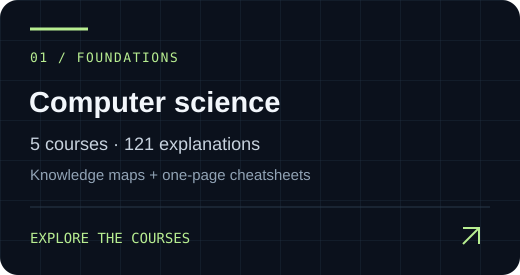
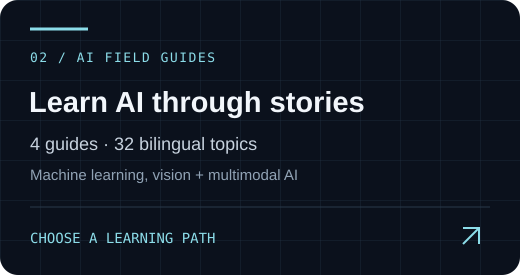

  <a href="https://leon1111-wgl.github.io/leon1111-wgl/"><strong>ENTER MY WEBSITE ↗</strong></a> &nbsp; / &nbsp;
  <a href="#about-me">About me</a> &nbsp; / &nbsp;
  <a href="#selected-research">Research</a> &nbsp; / &nbsp;
  <a href="#learning-portals">Courses</a> &nbsp; / &nbsp;
  <a href="mailto:zetongw6@gmail.com">Contact</a>

## About me

I am an MSc student at the University of Hong Kong, working on AI. My interests include multimodal models, LLM agents, long-video understanding and generation, and efficient video inference. I enjoy turning complex ideas into clear, practical learning resources.

| Currently exploring | How I work |
| :--- | :--- |
| Multimodal models and LLM agents | Connect model outputs to verifiable evidence |
| Long-video understanding and generation | Build datasets and evaluate models carefully |
| Efficient video inference | Explain ideas through stories, formulas and examples |

**Tools & interests** · Python · Java · C · Multimodal evaluation · lmms-eval · Instruction tuning · Knowledge distillation · Model quantization

## Selected research

**[Seeing Is Believing: Grounding Long-Video Understanding in Spatio-Temporal Visual Evidence](https://ojs.aaai.org/index.php/AAAI/article/view/38031)**

`AAAI 2026` · `Co-first author` · Long-video understanding

Long videos require answers that can be checked against visual evidence. This work introduces EV²-Bench and DynamicSelect to study evidence-grounded understanding and efficient video processing.

My contributions included benchmark construction, temporal and visual evidence annotation, model evaluation, and evidence scoring using temporal IoU, text similarity, and bipartite matching.

[Read the paper ↗](https://ojs.aaai.org/index.php/AAAI/article/view/38031) · [Research on my website ↗](https://leon1111-wgl.github.io/leon1111-wgl/#research)

## Background & experience

- **The University of Hong Kong** · MSc · 2026 - Present. Working on AI. Enrolled September 2026.
- **The University of Sydney** · Studied Finance and Computer Science · 2023–2026. Dalyell Scholar.
- **Zhejiang University** · Exchange study · Dec 2024 - Jan 2025. Short-term exchange experience.

- **Long-video research**, EV²-Bench & model evaluation · 2025 - 2026. Contributed to dataset construction and reproducible evaluation with lmms-eval, structured model outputs, and evidence precision, recall, and F1.
- **AI Algorithm Intern**, Shenzhen Beidou Applied Technology Research Institute · 2025. Worked on video data preparation, annotation consistency checks, and model fine-tuning, distillation, quantization, and deployment validation for safety monitoring.

**Languages** · Mandarin Chinese and English (IELTS 7.5)

## Learning portals

Choose a card to enter the teaching website. Follow **story → concept → formula → worked example**. AI guides and data structures include runnable Python, expected outputs and step-by-step explanations.

**New to Python or AI?** [Start here in English](https://leon1111-wgl.github.io/leon1111-wgl/ai/start.en.html) · [Start here in Chinese](https://leon1111-wgl.github.io/leon1111-wgl/ai/start.zh.html) · [Download Python examples](https://leon1111-wgl.github.io/leon1111-wgl/downloads/guoliang-python-examples.zip)

<table>
<tr>
<td width="50%" align="center"> <a href="https://leon1111-wgl.github.io/leon1111-wgl/#learning"><strong>Open the course library ↗</strong></a>
5 courses · 121 topics
</td>
<td width="50%" align="center"> <a href="https://leon1111-wgl.github.io/leon1111-wgl/#ai"><strong>Open the bilingual AI guides ↗</strong></a>
4 guides · 64 bilingual topics
</td>
</tr>
</table>

<strong>Go straight to a course — all nine learning paths</strong>

### Computer science foundations

| Course | Open the teaching page | Reference |
| :--- | :--- | :--- |
| INFO1113 | [Object-Oriented Programming in Java](https://leon1111-wgl.github.io/leon1111-wgl/courses/info1113.html) | [One-page PDF](https://leon1111-wgl.github.io/leon1111-wgl/downloads/INFO1113-cheatsheet.pdf) |
| COMP2017 | [Systems Programming: C, Processes & Concurrency](https://leon1111-wgl.github.io/leon1111-wgl/courses/comp2017.html) | [One-page PDF](https://leon1111-wgl.github.io/leon1111-wgl/downloads/COMP2017-cheatsheet.pdf) |
| COMP2123 | [Data Structures & Algorithms: Design, Proof & Performance](https://leon1111-wgl.github.io/leon1111-wgl/courses/comp2123.html) | [One-page PDF](https://leon1111-wgl.github.io/leon1111-wgl/downloads/COMP2123-cheatsheet.pdf) |
| COMP2022 | [Models of Computation: Languages, Machines & Logic](https://leon1111-wgl.github.io/leon1111-wgl/courses/comp2022.html) | [One-page PDF](https://leon1111-wgl.github.io/leon1111-wgl/downloads/COMP2022-cheatsheet.pdf) |
| COMP3308 | [Artificial Intelligence: Search, Reasoning & Learning](https://leon1111-wgl.github.io/leon1111-wgl/courses/comp3308.html) | [One-page PDF](https://leon1111-wgl.github.io/leon1111-wgl/downloads/COMP3308-cheatsheet.pdf) |

### AI field guides

| Guide | English | Chinese |
| :--- | :--- | :--- |
| Machine Learning | [Read EN](https://leon1111-wgl.github.io/leon1111-wgl/ai/ml.en.html) | [Read ZH](https://leon1111-wgl.github.io/leon1111-wgl/ai/ml.zh.html) |
| Deep Learning | [Read EN](https://leon1111-wgl.github.io/leon1111-wgl/ai/dl.en.html) | [Read ZH](https://leon1111-wgl.github.io/leon1111-wgl/ai/dl.zh.html) |
| Computer Vision: From Pixels to Perception | [Read EN](https://leon1111-wgl.github.io/leon1111-wgl/ai/vision.en.html) | [Read ZH](https://leon1111-wgl.github.io/leon1111-wgl/ai/vision.zh.html) |
| Multimodal AI | [Read EN](https://leon1111-wgl.github.io/leon1111-wgl/ai/multimodal.en.html) | [Read ZH](https://leon1111-wgl.github.io/leon1111-wgl/ai/multimodal.zh.html) |

[Download the complete cheatsheet collection](https://leon1111-wgl.github.io/leon1111-wgl/downloads/guoliang-cheatsheet-collection.pdf)

Guoliang · Research, ideas & learning in public. <a href="https://leon1111-wgl.github.io/leon1111-wgl/"><strong>Explore my personal website ↗</strong></a>

