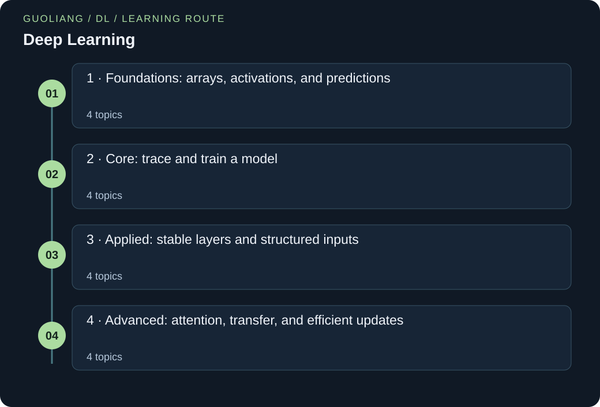

# Deep Learning

> Guoliang | AI Field Guides

[EN](AI-DL.en.md) · [中文](AI-DL.zh.md)



Build deep-learning understanding in sixteen patient chapters. Begin with arrays and functions. Trace shapes, losses, gradients, and a complete small training loop. Then assemble convolution, embeddings, attention, a toy Transformer block, and adaptation. Every chapter includes explained Python, answered questions, and two practice cases.

### Run the Python examples

Use Python 3.12 or newer. Save the code as a .py file. In a terminal, run `python filename.py`; some systems use `python3`. If the code contains `import numpy as np`, first run `python -m pip install numpy`. The import loads NumPy, a package for numeric arrays, and gives it the short name np. No dataset or model-weight downloads are needed.

[Official Python downloads](https://www.python.org/downloads/) · [Official NumPy installation guide](https://numpy.org/install/)

## A route through the ideas

Four stages cover tensor axes, nonlinear features, softmax loss, network shapes, backpropagation, optimizers, training loops, dropout, normalization, convolution, embeddings, attention, Transformer blocks, transfer learning, and low-rank adaptation. All examples are original. Code uses only Python and NumPy, without downloads or pretrained weights.

### Before you start

- Use arithmetic, fractions, squares, and simple functions.
- Read the shared Python and maths primer for lists, vectors, sums, logs, and slopes.
- The ML guide’s loss and validation chapters help, but no deep-learning framework is required.

### What you will learn

- Explain what each axis, layer, loss, and gradient means.
- Run and modify a small example for every topic, with checked output.
- Trace convolution, embeddings, masked attention, and a complete toy Transformer block.
- Separate learning, validation, transfer, parameter savings, and inference evidence.

## Knowledge framework

### 1 · Foundations: arrays, activations, and predictions

- [Tensors: give every axis a meaning](#dl-tensors)
- [Activations: put a bend between weighted sums](#dl-activations)
- [MLPs: learn useful intermediate features](#dl-representations)
- [Softmax and loss: turn scores into a learning signal](#dl-softmax-loss)

### 2 · Core: trace and train a model

- [Trace an entire network’s shapes](#dl-shape-tracing)
- [Backpropagation: follow the chain of dependence](#dl-autograd)
- [Minibatches and optimizers: turn gradients into steps](#dl-optimization)
- [A training loop: predict, measure, update, validate](#dl-training-loop)

### 3 · Applied: stable layers and structured inputs

- [Regularization: train with noise, evaluate deliberately](#dl-regularization)
- [Normalization: state which values share statistics](#dl-normalization)
- [Convolutions and residual paths: local evidence, preserved routes](#dl-convolution)
- [Token embeddings: turn IDs into trainable vectors](#dl-token-embeddings)

### 4 · Advanced: attention, transfer, and efficient updates

- [Attention: retrieve context with learned comparisons](#dl-attention)
- [A Transformer block: combine the pieces](#dl-transformer-block)
- [Transfer learning: adapt features without losing the evaluation boundary](#dl-transfer)
- [Low-rank adaptation and a checkable inference path](#dl-efficient-adaptation)

<a id="dl-tensors"></a>

## Tensors: give every axis a meaning

### 01 / The story

Mina collects recordings from three sensors. Each recording becomes three summary numbers. She wants to process two recordings at a time. Her first program runs, but a recording’s summary changes when she swaps the other recording in the batch. She has averaged over the wrong axis.

Mina draws a table. Rows mean recordings and columns mean sensor features. She names the axes before each calculation and checks one row by hand. After changing the averaging axis, each recording keeps its own summary. She learns that matching array sizes is only the first check. The entries must still mean the right things.

### 02 / The concept

A tensor is an array of numbers. A single number has no axis, a list has one, and a table has two. Shape lists the length of each axis. A batch groups examples for one calculation.

In a dense layer, each output is a weighted sum of input features plus a bias. Matrix multiplication computes many such sums together. Elementwise multiplication instead multiplies matching entries. A transpose exchanges axes; a reshape regroups entries without automatically changing their order. Write the meaning of each axis before using these operations.

### 03 / Put the concept to work

Write a shape contract at the data loader boundary and at each layer boundary. State which axis is the batch, how features are ordered, and whether a reduction should preserve one result per example. Before a large run, send two deliberately different examples through the pipeline. Inspect whether changing one example unexpectedly changes the other, and distinguish intended batch statistics from accidental mixing.

### 04 / How others use it

The official PyTorch Tensors tutorial represents inputs and model parameters with tensors, inspects their shape, data type, and device, and distinguishes matrix multiplication from elementwise multiplication. These are concrete preparation and inspection operations used before neural network training. The tutorial also demonstrates explicit device transfers, showing why a correct mathematical expression still requires compatible storage locations in an actual implementation.

### 05 / The formula, unpacked

```text
X ∈ ℝ^(B×d), W ∈ ℝ^(d×k), b ∈ ℝ^k
Y = XW + b
Y[i,j] = Σ(r=1…d) X[i,r]W[r,j] + b[j]
```

X is the input matrix; B counts examples and d counts features per example. W is the learned weight matrix, and k is the number of output features. b is a length k bias vector broadcast across rows. Y is the resulting B by k output matrix. i identifies an example, j identifies an output feature, and r indexes an input feature being summed. ℝ denotes real numbers, × specifies axis sizes, and Σ adds the products over all d input features. Brackets select individual entries.

### 06 / Work through the numbers

Take two recordings with X = [[2, 1, 0], [0, 3, 1]]. Choose W = [[1, −1], [2, 0], [0, 3]] and b = [0.5, −0.5]. The first row produces [2×1 + 1×2 + 0×0 + 0.5, 2×(−1) + 1×0 + 0×3 − 0.5] = [4.5, −2.5]. The second produces [6.5, 2.5], so Y has shape 2 by 2. Averaging across recordings gives [5.5, 0], one mean per output feature. Averaging across features instead gives [1, 4.5], one mean per recording. Both operations return two numbers; only axis meaning tells us which answers the intended question. The dense layer uses six weights and two biases, independently of this batch size.

### Words to know

- **Tensor:** An array of numbers with a stated shape and axis meanings.

- **Batch:** A group of examples processed together.

- **Broadcasting:** Reusing compatible smaller arrays across larger axes, such as one bias per output column.

### Let us work through it

**Why does a 2×3 input times a 3×2 weight table give 2×2?**

Each of two input rows combines with each of two output columns. The three matching feature entries are multiplied and added for each pair.

**Why can both averaging axes return two numbers?**

The output happens to be 2×2. Averaging rows gives one mean per feature; averaging columns gives one mean per recording. Equal sizes hide different meanings.

**Can a shape check find swapped sensor names?**

No. The dimensions may still match. Keep a fixed feature order and test known rows with hand calculations.

### Name the axes of a dense layer

Rows are recordings and columns are features.

```python
import numpy as np
x = np.array([[2.,1.,0.], [0.,3.,1.]])
w = np.array([[1.,-1.], [2.,0.], [0.,3.]])
b = np.array([0.5,-0.5])
out = x @ w + b
print('shape:', out.shape)
print('output:', out.tolist())
print('mean per feature:', out.mean(axis=0).tolist())
print('mean per recording:', out.mean(axis=1).tolist())
```

**Run it locally**

```sh
python dl-tensors-dl-dense-axis-check.py
```

**Expected output**

```text
shape: (2, 2)
output: [[4.5, -2.5], [6.5, 2.5]]
mean per feature: [5.5, 0.0]
mean per recording: [1.0, 4.5]
```

**Read the code step by step**

@ combines each input row with each weight column. Adding b repeats the two biases across recordings. shape reports axis lengths. mean(axis=0) removes the recording axis; mean(axis=1) removes the feature axis. The distinct output means show why axis names matter. Weights are hand selected, so this is layer arithmetic, not a trained recording classifier.

### Where you can use this

**Two recording rows**

Change only the second input row. In this dense layer, the first output row should remain unchanged. This checks that examples are not accidentally mixed.

**Different batch size**

Add a third recording with three features. The output becomes 3×2. The layer still has six weights and two biases; batch size does not add parameters.

**Where the analogy stops:** Shape checks cannot detect swapped feature names, mismatched physical units, or labels attached to the wrong rows. Broadcasting may silently produce a larger result than intended. Batch dependent layers also create legitimate interactions between examples, so independence checks must be interpreted with the architecture and its training mode in mind.

**Keep this idea:** Treat every tensor axis as a named contract; matching dimensions is necessary, but preserving their meaning is what makes the computation correct.

### Sources for this topic

- [PyTorch: Tensors — Learn the Basics](https://docs.pytorch.org/tutorials/beginner/basics/tensorqs_tutorial.html)

<a id="dl-activations"></a>

## Activations: put a bend between weighted sums

### 01 / The story

Anya draws a network for two sensor readings. She adds more weighted sums, expecting a more flexible rule. Yet the combined model still behaves like one straight transformation. She needs a step that changes the shape of the rule.

Anya tries ReLU. Positive values pass through, while negative values become zero. She also plots sigmoid values, which stay between zero and one. The functions behave differently, so she gives them different jobs. ReLU can build hidden features. Sigmoid can express one binary probability estimate. She checks the slope too, because training must pass changes back through the chosen function.

### 02 / The concept

An activation applies a function to each layer value. A nonlinear function cannot be written as one weighted sum plus bias over its whole range. ReLU is zero below zero and equals its input above zero. This bend lets later layers combine different active regions.

Sigmoid smoothly maps scores into (0,1). Its slope is largest near zero and small for large positive or negative scores. Small slopes can weaken backward signals. ReLU has slope zero on its negative side and one on its positive side. At zero, an implementation must choose a convention.

### 03 / Put the concept to work

Use activations with a clear role. Hidden layers need nonlinear features. A single binary output may use a sigmoid interpretation. Multiclass outputs use a different normalization, taught next. Inspect whether hidden units are always zero or saturated.

### 04 / How others use it

PyTorch’s ReLU reference defines the rectifier. Its model-building tutorial shows activations between linear layers. Our standard-library example compares values and slopes directly without training a network.

### 05 / The formula, unpacked

```text
ReLU(z) = max(0,z)
σ(z) = 1/(1+exp(−z))
σ′(z) = σ(z)(1−σ(z))
```

z is a raw layer value. max chooses the larger argument. σ names sigmoid, exp is the exponential, and the prime in σ′ means derivative with respect to z. The derivative is the local output change per small input change.

### 06 / Work through the numbers

At z=0, sigmoid is 1/(1+1)=0.5 and its slope is 0.5×0.5=0.25. At z=2, sigmoid is about 0.880797 and its slope about 0.104994. ReLU maps [−2,0,2] to [0,0,2]. The two functions therefore do not preserve the same values or gradients.

### Words to know

- **Activation:** A function applied to layer values, often to add nonlinearity.

- **Saturation:** A region where changing the input barely changes the output.

- **Local slope:** The output’s small-change rate near one input value.

### Let us work through it

**Why are more linear layers not enough?**

Their combination still reduces to one affine transformation. A nonlinear activation adds a bend that cannot be absorbed into a single matrix and bias.

**Why does sigmoid have slope 0.25 at zero?**

Its value is 0.5. Substitute into σ(1−σ): 0.5×(1−0.5)=0.25.

**Does ReLU have derivative one at zero?**

It is not differentiable there: left and right slopes differ. Libraries commonly choose a useful convention such as zero for backpropagation.

### Print values and slopes

Small chosen inputs make the arithmetic safe and easy to inspect.

```python
from math import exp
for z in [-2.,0.,2.]:
    relu = max(0.,z)
    sigmoid = 1/(1+exp(-z))
    slope = sigmoid*(1-sigmoid)
    print(f'z={z:.0f}: ReLU={relu:.1f}, sigmoid={sigmoid:.6f}, slope={slope:.6f}')
```

**Run it locally**

```sh
python dl-activations-dl-activation-values.py
```

**Expected output**

```text
z=-2: ReLU=0.0, sigmoid=0.119203, slope=0.104994
z=0: ReLU=0.0, sigmoid=0.500000, slope=0.250000
z=2: ReLU=2.0, sigmoid=0.880797, slope=0.104994
```

**Read the code step by step**

The loop evaluates three independent inputs. max implements ReLU. exp supplies the sigmoid exponential, and sigmoid*(1−sigmoid) evaluates its analytic derivative. Formatted output makes the symmetric slopes at −2 and 2 visible. This direct sigmoid expression is suitable for these small values; large-magnitude inputs need numerically robust implementations.

### Where you can use this

**A hidden gate**

Apply ReLU to [−3,−1,1,3]. Only the last two values survive. Add a positive bias before ReLU and inspect which units now activate.

**Saturated scores**

Compare sigmoid slopes at 0, 2, and 8. The slope near 8 is much smaller. Explain why a small backward signal can make changing that score slow.

**Where the analogy stops:** ReLU units can stay inactive on all relevant examples. Sigmoid can saturate. Neither activation fixes missing information or proves that a model is calibrated. This lesson compares functions, not complete model quality.

**Keep this idea:** An activation changes both the features passed forward and the slopes passed backward.

### Sources for this topic

- [PyTorch: ReLU activation](https://docs.pytorch.org/docs/2.14/generated/torch.nn.ReLU.html)

- [PyTorch: Build the Neural Network — Learn the Basics](https://docs.pytorch.org/tutorials/beginner/basics/buildmodel_tutorial.html)

<a id="dl-representations"></a>

## MLPs: learn useful intermediate features

### 01 / The story

Ravi watches two gauges that should agree. A high reading is harmless if both rise together. A weighted average misses the difference he cares about. He adds another linear layer, but the problem remains: two linear transformations still act like one.

Ravi builds two hidden units. One responds when the first gauge exceeds the second by more than one. The other checks the reverse. ReLU removes negative responses. Adding the two remaining values gives a disagreement score. His tiny network now describes the right pattern. These chosen weights show what the network can represent; training still has to learn a useful rule from data.

### 02 / The concept

A multilayer perceptron, or MLP, passes inputs through several dense layers. Hidden means an intermediate value between input and output. An activation adds a nonlinear bend between weighted sums. The previous activation chapter explains why that bend matters.

Without activations, affine layers collapse into a single affine map. Affine means weighted sum plus bias. With ReLU, different regions of the input can activate different hidden units. Training learns the weights that build these intermediate features. A useful hidden unit need not match a named human concept.

### 03 / Put the concept to work

Start with a compact network whose input features and output meaning are explicit. Choose the last layer and loss together: classification logits, probabilities, and continuous predictions have different roles. Inspect activation distributions to find units that are always zero or unusually large. Increase width or depth only after checking data quality and validation behavior, so additional capacity addresses an observed limitation.

### 04 / How others use it

PyTorch’s Build the Neural Network tutorial constructs a FashionMNIST classifier from a flattening operation, linear layers, and ReLU activations. It separates the network’s raw class scores from probabilities obtained by a later softmax operation. This official example shows how a basic MLP connects image entries to class outputs; the gauge scenario and all numbers here are independent illustrations.

### 05 / The formula, unpacked

```text
h = ReLU(W₁x + b₁), ReLU(u) = max(0,u)
ŷ = W₂h + b₂
P = Hd + H + kH + k
```

x is a column vector containing d input features. W₁ has H rows and d columns, while b₁ contains H hidden biases. h is the length H hidden representation. W₂ has k rows and H columns, and b₂ contains k output biases. ŷ is the length k prediction vector. ReLU applies max(0,u) separately to each scalar preactivation u. P counts every weight and bias in this two layer network. Subscripts 1 and 2 identify the two affine layers; they are not powers or time steps.

### 06 / Work through the numbers

Let d = 2, H = 2, and k = 1. Set W₁ = [[1, −1], [−1, 1]], b₁ = [−1, −1], W₂ = [[1, 1]], and b₂ = 0. For x = [3, 1], the hidden preactivations are [1, −3], so h = [1, 0] and ŷ = 1. Swapping the inputs to [1, 3] gives h = [0, 1], again producing 1. Equal inputs [2, 2] yield [−1, −1] before ReLU and a prediction of 0. This network measures disagreement beyond a one unit tolerance in either direction. Its parameter count is 2×2 + 2 + 1×2 + 1 = 9. These chosen weights demonstrate representational capacity; they are not a claim that training must discover this solution.

### Words to know

- **Hidden unit:** An intermediate computed feature inside a network.

- **Affine map:** A weighted sum followed by adding a bias.

- **Representation:** The numerical features used to describe an input at a chosen layer.

### Let us work through it

**Why do two affine layers still make one affine map?**

Substitute h=Ax+a into Bh+b. The result is BAx+(Ba+b): another matrix times x plus a bias.

**Why is the hidden result [1,0] for [3,1]?**

The first unit computes 3−1−1=1. The second computes −3+1−1=−3. ReLU keeps 1 and replaces −3 by zero.

**Does the parameter count change for a new input?**

No. With two inputs, two hidden units, and one output, there are 4+2+2+1=9 parameters regardless of the input values.

### Trace two hidden units

Use column-vector formulas with NumPy vectors.

```python
import numpy as np
w1 = np.array([[1.,-1.], [-1.,1.]])
b1 = np.array([-1.,-1.])
w2 = np.array([1.,1.]); b2 = 0.
for values in [[3.,1.], [1.,3.], [2.,2.]]:
    x = np.array(values)
    hidden = np.maximum(0, w1 @ x + b1)
    output = w2 @ hidden + b2
    print('input:', values, 'hidden:', hidden.tolist(), 'output:', float(output))
print('parameters:', w1.size + b1.size + w2.size + 1)
```

**Run it locally**

```sh
python dl-representations-dl-mlp-gauges.py
```

**Expected output**

```text
input: [3.0, 1.0] hidden: [1.0, 0.0] output: 1.0
input: [1.0, 3.0] hidden: [0.0, 1.0] output: 1.0
input: [2.0, 2.0] hidden: [0.0, 0.0] output: 0.0
parameters: 9
```

**Read the code step by step**

w1 @ x makes two weighted sums. Adding b1 subtracts the tolerance. maximum applies ReLU to each unit. The second dot product adds the surviving signals. size counts stored scalar entries, and the final +1 counts the scalar output bias. These weights are designed by hand to illustrate capacity; the script performs no parameter fitting.

### Where you can use this

**Gauge agreement**

Test [2,2], [3,1], and [1,3]. The outputs are 0, 1, and 1. Explain why reversing the unequal gauges preserves this network’s disagreement score.

**Change the tolerance**

Replace both first-layer biases −1 with −2. Now [3,1] produces zero. The hidden rule has changed from excess over one to excess over two.

**Where the analogy stops:** An MLP does not automatically exploit image locality or sequence order. More parameters can increase memorization, computation, and sensitivity to preprocessing. ReLU units receiving negative inputs throughout training may receive no useful gradient through that branch. A convincing fitted relationship also remains different from evidence that the relationship will generalize.

**Keep this idea:** Nonlinear hidden layers matter because they change the available representations; extra linear depth alone cannot create a nonlinear decision rule.

### Sources for this topic

- [PyTorch: Build the Neural Network — Learn the Basics](https://docs.pytorch.org/tutorials/beginner/basics/buildmodel_tutorial.html)

<a id="dl-softmax-loss"></a>

## Softmax and loss: turn scores into a learning signal

### 01 / The story

Nia builds a toy classifier for three simple shapes. Its final layer gives three numbers, but they can be negative and do not add to one. She first calls them probabilities, then realizes they are raw scores.

Nia applies softmax to compare the scores on a common scale. The largest score gets the largest probability. She then asks how much probability the model assigned to the correct shape. Negative log probability becomes the loss. A confident correct answer has small loss; a confident mistake has large loss. This gives her a precise target for training, beyond merely counting which score was largest.

### 02 / The concept

A logit is a raw class score before probability normalization. Softmax exponentiates every score and divides by their sum. All probabilities are positive and add to one. Subtracting the same number from every logit leaves the result unchanged. Subtract the maximum for numerical stability.

For one correct class, cross-entropy is the negative natural log of its probability. The natural log is the inverse of exp. Probability one gives loss zero; a probability approaching zero gives a large loss. This objective rewards more probability on the correct class even when the winning class has not changed.

### 03 / Put the concept to work

For mutually exclusive image or text classes, pair logits with the appropriate cross-entropy objective. Libraries often expect raw logits and combine normalization with loss internally. Do not apply an extra softmax unless the chosen API requires it.

### 04 / How others use it

The PyTorch CrossEntropyLoss reference documents unnormalized logits and class targets. Our NumPy calculation exposes the probability step explicitly for teaching. A production loss should use a numerically stable combined formulation.

### 05 / The formula, unpacked

```text
pⱼ = exp(zⱼ−m)/Σ(k=1…C) exp(zₖ−m), m = maxₖ zₖ
L = −log p_y
```

zⱼ is the raw score for class j. C is the number of classes; k runs over them. m is the largest raw score. pⱼ is the normalized probability. y is the index of the correct class and p_y is its probability. L is the loss, exp is exponential, and log is natural logarithm.

### 06 / Work through the numbers

For logits [2,1,0], subtract 2 to get [0,−1,−2]. Exponentials are approximately [1,0.367879,0.135335], summing to 1.503214. Probabilities are [0.665241,0.244728,0.090031]. If class zero is correct, L=−log(0.665241)≈0.407606. Adding 1000 to every logit changes none of these probabilities.

### Words to know

- **Logit:** A score before conversion into class probabilities.

- **Softmax:** Exponential normalization that turns a vector of scores into probabilities summing to one.

- **Cross-entropy:** Here, the negative natural log probability assigned to the correct class.

### Let us work through it

**Why is the largest exponential exactly one after shifting?**

The largest logit minus itself is zero. exp(0)=1. All other shifted logits are nonpositive, helping avoid overflow.

**Why can correct classification still have positive loss?**

Class zero wins with probability about 0.665, not one. Its negative log is positive. Training can still reward increased probability on that class.

**What if all logits are equal?**

Every exponential is equal, so three classes receive probability 1/3 each. The correct-class loss is log(3), about 1.098612.

### Compute stable probabilities and cross-entropy

Class IDs begin at zero in this Python example.

```python
import numpy as np
logits = np.array([2.,1.,0.]); target = 0
def softmax(values):
    shifted = values-values.max()
    weights = np.exp(shifted)
    return weights/weights.sum()
probabilities = softmax(logits)
loss = -np.log(probabilities[target])
print('probabilities:', np.round(probabilities,6).tolist())
print(f'sum: {probabilities.sum():.6f}; loss: {loss:.6f}')
print('shift unchanged:', bool(np.allclose(probabilities,softmax(logits+1000))))
```

**Run it locally**

```sh
python dl-softmax-loss-dl-stable-softmax-loss.py
```

**Expected output**

```text
probabilities: [0.665241, 0.244728, 0.090031]
sum: 1.000000; loss: 0.407606
shift unchanged: True
```

**Read the code step by step**

max finds the shift. exp transforms relative scores to positive weights. Division by their sum normalizes them. Indexing with target selects the correct-class probability; log turns it into loss. allclose checks the shift property within floating-point tolerance. The simple loss line is safe for these logits; extreme cases should use stable log-sum-exp loss implementations.

### Where you can use this

**A different true label**

Keep logits [2,1,0] but set the true label to class two. Loss becomes about 2.407606. The model assigned the correct class its smallest probability.

**Safe score shifting**

Add 1000 to all logits and run the stable function. Probabilities stay unchanged. Direct exp of the large raw logits may overflow, so the shift has a practical purpose.

**Where the analogy stops:** Softmax probabilities are not automatically calibrated. One-label cross-entropy assumes mutually exclusive classes. Tasks where several labels can be true need a suitable multilabel objective. The tiny example has no learned weights.

**Keep this idea:** Keep raw scores, normalized probabilities, and the loss as three distinct quantities.

### Sources for this topic

- [PyTorch: CrossEntropyLoss: logits and targets](https://docs.pytorch.org/docs/2.14/generated/torch.nn.CrossEntropyLoss.html)

<a id="dl-shape-tracing"></a>

## Trace an entire network’s shapes

### 01 / The story

Eli builds a small network for 2×2 grayscale images. The input has a batch axis and two image axes. His dense layer expects four numbers per image. He flattens the whole array into one long list and accidentally joins two images together.

Eli redraws the path with one shape at every step. He preserves the batch axis and flattens only the image axes. The hidden layer now receives one row per image. He also counts weights before running anything. The repaired network produces two class scores per image. A short trace prevents a large training run from learning from a mistaken arrangement.

### 02 / The concept

Shape tracing follows axis sizes through a whole computation. Flattening an image reorganizes its pixels into features; it should not merge separate examples. Reshape preserves the number of entries. It does not learn features and does not know which axis means batch.

For a dense layer with d inputs and H outputs, the weight table has dH entries and the bias has H. Batch size changes activation storage, not this parameter count. Trace both shapes and axis meanings. Assertions can catch a mismatch before training.

### 03 / Put the concept to work

Use a shape trace when preparing small image classifiers or sequence heads. Write the expected input shape, feature ordering, hidden width, and output class count. Test a batch of two distinct examples to detect accidental mixing.

### 04 / How others use it

NumPy’s reshape reference specifies compatible entry counts and the inferred −1 dimension. PyTorch’s model tutorial shows flattening before dense layers. The code here uses fixed weights to inspect shapes only.

### 05 / The formula, unpacked

```text
X: B×h×w → X_flat: B×d, d=hw
H₁ = ReLU(X_flat W₁ + b₁): B×H
Z = H₁W₂+b₂: B×C
P = dH+H+HC+C
```

B is batch size; h and w are image height and width. d counts flattened pixels. H is hidden width and C is class count. W₁ has shape d×H; b₁ has H entries. W₂ has shape H×C; b₂ has C entries. H₁ names hidden activations, Z names logits, and P is total parameter count. The arrow marks reshaping.

### 06 / Work through the numbers

Two 2×2 images have shape 2×2×2 and eight entries. Preserve two rows and flatten to 2×4. With H=3 and C=2, shapes become 2×3 then 2×2. Parameter count is 4×3+3+3×2+2=23. Four images would double stored input entries but still use 23 parameters.

### Words to know

- **Flatten:** Combine selected axes into one feature axis while preserving example boundaries.

- **Parameter count:** The number of stored trainable scalar weights and biases.

- **Assertion:** A program check that stops execution if a required condition is false.

### Let us work through it

**Why use reshape(batch_size, −1)?**

The first dimension preserves examples. The inferred second dimension collects each example’s remaining entries. Here eight entries divided by two gives four.

**Where do the 23 parameters come from?**

The first layer has 12 weights and 3 biases. The second has 6 weights and 2 biases. Add 15 and 8.

**Does reshape(4,2) also work on eight entries?**

Yes mathematically, but it invents four rows from two images. Valid array arithmetic can still violate the intended example boundary.

### Print the shape at every layer

The fixed layers check data arrangement, not recognition quality.

```python
import numpy as np
images = np.arange(8,dtype=float).reshape(2,2,2)
flat = images.reshape(images.shape[0],-1)
w1 = np.ones((4,3)); b1 = np.zeros(3)
w2 = np.ones((3,2)); b2 = np.zeros(2)
hidden = np.maximum(0,flat @ w1+b1)
logits = hidden @ w2+b2
assert flat.shape == (2,4)
for name, array in [('images',images),('flat',flat),('hidden',hidden),('logits',logits)]:
    print(name, array.shape)
print('first flattened image:', flat[0].tolist())
print('parameters:', w1.size+b1.size+w2.size+b2.size)
```

**Run it locally**

```sh
python dl-shape-tracing-dl-shape-path.py
```

**Expected output**

```text
images (2, 2, 2)
flat (2, 4)
hidden (2, 3)
logits (2, 2)
first flattened image: [0.0, 1.0, 2.0, 3.0]
parameters: 23
```

**Read the code step by step**

arange supplies eight known values. The first reshape creates two images; the second keeps their batch dimension. ones and zeros construct explicit weight and bias shapes. Matrix products preserve the batch axis. The assertion checks the planned flattening, and the final count sums scalar parameter entries. Identical output columns from all-one weights are expected; this is not a trained classifier.

### Where you can use this

**Add an image**

Create three 2×2 images. Check the path 3×2×2 → 3×4 → 3×3 → 3×2. Reuse the same weight shapes and parameter count.

**Change class count**

Change the final class count from two to four. The last layer becomes 3×4 plus four biases. Total parameters become 15+12+4=31.

**Where the analogy stops:** A compatible shape does not prove correct pixel order or labels. Flattening discards explicit spatial axes. A dense image model can learn spatial patterns, but it has no built-in local weight sharing like a convolution.

**Keep this idea:** Preserve the example axis, trace each transformation, and count parameters independently of batch size.

### Sources for this topic

- [NumPy: numpy.reshape: shape and index order](https://numpy.org/doc/stable/reference/generated/numpy.reshape.html)

- [PyTorch: Build the Neural Network — Learn the Basics](https://docs.pytorch.org/tutorials/beginner/basics/buildmodel_tutorial.html)

<a id="dl-autograd"></a>

## Backpropagation: follow the chain of dependence

### 01 / The story

Elena adds a trainable scale to a tiny sensor model. Predictions look plausible, yet the loss never changes. She draws the route from input to prediction to loss. Then she asks how a small change at each link should affect the final error.

Her hand calculation gives a nonzero gradient for the first weight. The program has no gradient there. A conversion used for logging had broken the recorded dependency. Elena keeps the original tensor in the model and converts only a separate value for display. Learning can now reach the weight. Her debugging question becomes concrete: where did the chain stop?

### 02 / The concept

A derivative is a local rate of change. The chain rule multiplies rates along a sequence of dependent operations. Backpropagation applies that rule backward from loss to parameters. If several routes reach one value, their contributions add.

Automatic differentiation records operations and combines their derivatives. It does not estimate every gradient by repeatedly perturbing a weight. A forward pass computes predictions. A backward pass computes gradients. An optimizer then changes parameters. These are three separate jobs. We calculate a small chain manually below before relying on a framework.

### 03 / Put the concept to work

For a suspicious model, shrink the forward computation until a single example and a few parameters can be differentiated by hand. Check whether each trainable parameter receives a gradient and whether its sign makes sense. Clear accumulated gradients at the intended update boundary. Keep logging, conversion, and inference operations separate from the tensor path whose derivatives training requires.

### 04 / How others use it

The official autograd tutorial enables gradient tracking for parameters, constructs a loss, calls backward, and reads parameter gradients. It also demonstrates disabling tracking and detaching tensors. The optimization tutorial documents gradient accumulation and resetting. Together these examples show actual framework mechanisms behind the dependency chain: a valid forward result is insufficient evidence that the required backward route still exists.

### 05 / The formula, unpacked

```text
z = wx + b, a = max(0,z), ŷ = va
L = ½(ŷ − y)²
∂L/∂v = (ŷ − y)a
∂L/∂w = (ŷ − y)v·1[z>0]·x
∂L/∂b = (ŷ − y)v·1[z>0]
θ_new = θ − η·∂L/∂θ
```

x and y are one scalar input and its target. w and b define the first affine operation, z is its preactivation, and a is the rectified activation. v scales a into prediction ŷ. L is half the squared prediction error. The symbol ∂ denotes a partial derivative with other independent inputs fixed. 1[z>0] is one for positive z and zero for negative z; at zero this example uses derivative zero. θ stands for any of w, b, or v, θ_new is its updated value, and η is the learning rate.

### 06 / Work through the numbers

Use x = 2, y = 1, w = 0.5, b = 0, and v = 2. Forward evaluation gives z = 1, a = 1, ŷ = 2, and L = 0.5. The prediction error is 1, so the gradients are ∂L/∂v = 1, ∂L/∂w = 4, and ∂L/∂b = 2. With η = 0.05, update all three parameters from these same old gradients: v becomes 1.95, w becomes 0.3, and b becomes −0.1. The new z is 0.3×2 − 0.1 = 0.5, making ŷ = 0.975. The new loss is 0.5×(−0.025)² = 0.0003125. This decrease verifies this particular step, not a universal guarantee for every learning rate or example.

### Words to know

- **Derivative:** The local rate at which an output changes when one input changes.

- **Chain rule:** Multiply local rates along dependent operations and add contributions from separate paths.

- **Backpropagation:** An efficient backward application of the chain rule to compute parameter gradients.

### Let us work through it

**Why is the weight gradient 4?**

The loss error is 1. The output weight is 2, ReLU’s slope at z=1 is 1, and input x is 2. Multiply 1×2×1×2=4.

**Why update all parameters from the old gradients?**

Those gradients describe the same old network. Updating one weight before computing another gradient would mix different network states.

**Does a finite-difference check replace backpropagation?**

It is useful for checking a small smooth case, but it needs repeated loss evaluations. It becomes expensive for many weights and is awkward at nondifferentiable points.

### Check a gradient and update the network

Use manual derivatives and a numerical check, with no autodiff library.

```python
x, target = 2., 1.
w, b, v = 0.5, 0., 2.
def loss(weight, bias, output_weight):
    prediction = output_weight * max(0., weight*x+bias)
    return 0.5 * (prediction-target)**2
z = w*x+b; a = max(0., z); error = v*a-target
gv = error*a; gw = error*v*int(z>0)*x; gb = error*v*int(z>0)
epsilon = 1e-6
numeric = (loss(w+epsilon,b,v)-loss(w-epsilon,b,v))/(2*epsilon)
print(f'gradient w: {gw:.6f}; finite difference: {numeric:.6f}')
w, b, v = w-0.05*gw, b-0.05*gb, v-0.05*gv
print(f'new loss: {loss(w,b,v):.7f}')
```

**Run it locally**

```sh
python dl-autograd-dl-chain-rule-check.py
```

**Expected output**

```text
gradient w: 4.000000; finite difference: 4.000000
new loss: 0.0003125
```

**Read the code step by step**

loss defines the exact forward objective. z, a, and error retain the intermediate values needed for the chain rule. int(z>0) supplies ReLU’s slope away from zero. The central difference compares nearby losses on either side of w. All updates use the saved old gradients. Agreement checks this small smooth case, not an entire training pipeline.

### Where you can use this

**A broken ReLU route**

Set b to −2 while keeping x=2 and w=0.5. The preactivation becomes −1, so ReLU is inactive. The gradients through w and b are zero for this example.

**Check one derivative**

Run the central finite-difference check for w. Compare it with the chain-rule result. Use a small perturbation away from the ReLU corner; exact equality is not expected in floating-point arithmetic.

**Where the analogy stops:** Gradients can vanish, explode, or fail to reflect useful progress across nondifferentiable choices. Autograd differentiates the implemented objective, including any mistakes in that objective. Floating point arithmetic also limits precision. A small finite difference check can expose errors in a smooth toy case, but cannot certify an entire training pipeline.

**Keep this idea:** A gradient is a trace of dependency through the actual computation; preserve that trace before expecting an optimizer to improve the model.

### Sources for this topic

- [PyTorch: Automatic Differentiation with torch.autograd](https://docs.pytorch.org/tutorials/beginner/basics/autogradqs_tutorial.html)

- [PyTorch: Optimizing Model Parameters — Learn the Basics](https://docs.pytorch.org/tutorials/beginner/basics/optimization_tutorial.html)

<a id="dl-optimization"></a>

## Minibatches and optimizers: turn gradients into steps

### 01 / The story

Noah trains on recordings collected across many days. Reading the whole archive before each update is slow. He switches to small batches. The displayed loss begins to bounce, so he thinks training is broken. Then he checks which examples are in each batch. Some are much harder than others.

Noah follows the longer training trend and a fixed validation set. He also compares SGD with Adam. The same learning rate produces different first steps because Adam keeps and rescales gradient statistics. Noah records batch size, loss averaging, and optimizer settings together. He can now explain both the noisy measurements and the changed updates.

### 02 / The concept

A batch gradient averages example gradients. With appropriate random sampling, it estimates the gradient of the full training objective. Smaller batches usually give noisier estimates but cheaper individual updates. An epoch visits the training set once; a step changes parameters once.

SGD subtracts learning rate times gradient. Adam keeps a moving average of gradients and squared gradients. It corrects the initial zero bias, then divides by a scale based on the squared gradients. This changes the update size for each parameter. Neither optimizer fixes a wrong loss or bad labels.

### 03 / Put the concept to work

Define whether the loss is averaged or summed before selecting a learning rate. Shuffle training examples when that matches the data assumptions, and preserve grouping where observations are dependent. Record update counts as well as epochs. Compare optimizers under a controlled validation procedure, and save optimizer state when a resumed run should continue its existing momentum and adaptation history.

### 04 / How others use it

PyTorch’s optimization tutorial uses an explicit training loop with loss calculation, backward propagation, parameter updates, and gradient resetting. Its Adam reference gives the moving average and bias correction algorithm. These primary sources support two concrete implementations of the same training interface: gradients supply local information, while an optimizer determines how stored state and hyperparameters turn that information into changed weights.

### 05 / The formula, unpacked

```text
gₜ = (1/B) Σ(i=1…B) ∇θ ℓᵢ(θₜ₋₁)
SGD: θₜ = θₜ₋₁ − ηgₜ
Adam: mₜ = β₁mₜ₋₁ + (1−β₁)gₜ
vₜ = β₂vₜ₋₁ + (1−β₂)gₜ²
m̂ₜ = mₜ/(1−β₁ᵗ), v̂ₜ = vₜ/(1−β₂ᵗ)
θₜ = θₜ₋₁ − ηm̂ₜ/(√v̂ₜ + ε), m₀ = v₀ = 0
```

θ is the parameter vector, t counts updates, and η is the learning rate. B is batch size; i indexes its examples. ℓᵢ is example i’s loss, ∇θ means its parameter gradient, Σ sums those gradients, and gₜ is their average. mₜ and vₜ track first and second gradient moments. β₁ and β₂ are decay factors between zero and one; their superscript t means a power. Hats mark bias correction. ε is a positive stabilizer. Squares, roots, products, and division act elementwise. Initial moments are zero; these formulas omit momentum for SGD and weight decay for both optimizers.

### 06 / Work through the numbers

Consider two scalar targets, 2 and 4, with predictions θ and per example loss ½(θ−y)². At θ₀ = 0, the gradients are −2 and −4, so g₁ = −3. SGD with η = 0.1 gives θ₁ = 0.3 and mean loss 4.145, down from 5. For Adam, independently restart at zero with β₁ = 0.9, β₂ = 0.999, and ε = 10⁻⁸. Its first moments are m₁ = −0.3 and v₁ = 0.009. Bias correction gives m̂₁ = −3 and v̂₁ = 9. The update is approximately +0.1, producing mean loss approximately 4.705. Equal learning rates thus need not mean equal steps. This single batch calculation compares update mechanics, not eventual generalization or which optimizer is better.

### Words to know

- **Minibatch:** A subset of training examples used for one gradient estimate.

- **Epoch:** One complete pass through the training examples.

- **Moving average:** A running summary that combines the old summary with a fraction of the new value.

### Let us work through it

**Why is the average gradient −3?**

For half-squared loss at prediction zero, targets 2 and 4 give gradients −2 and −4. Their average is (−2−4)/2=−3.

**Why does Adam move about 0.1 rather than 0.3?**

After bias correction, its first gradient moment is −3 and squared-gradient moment is 9. Dividing by √9 normalizes the gradient magnitude to about one.

**Are ten steps the same as ten epochs?**

Only if each epoch has exactly one step. With 100 examples and batches of 10, one epoch has ten steps under ordinary batching.

### Compare the first SGD and Adam steps

Restart both methods from the same scalar parameter.

```python
import numpy as np
targets = np.array([2.,4.]); theta = 0.; rate = 0.1
gradient = np.mean(theta-targets)
sgd = theta-rate*gradient
beta1, beta2 = 0.9, 0.999
m = (1-beta1)*gradient; v = (1-beta2)*gradient**2
m_hat = m/(1-beta1); v_hat = v/(1-beta2)
adam = theta-rate*m_hat/(np.sqrt(v_hat)+1e-8)
for name, value in [('SGD',sgd), ('Adam',adam)]:
    loss = np.mean(0.5*(value-targets)**2)
    print(f'{name}: parameter {value:.6f}; loss {loss:.6f}')
```

**Run it locally**

```sh
python dl-optimization-dl-sgd-adam-first-step.py
```

**Expected output**

```text
SGD: parameter 0.300000; loss 4.145000
Adam: parameter 0.100000; loss 4.705000
```

**Read the code step by step**

The mean forms one batch gradient. SGD uses it directly. Adam begins with zero moments, forms their first updates, and divides by the first-step bias corrections. sqrt and the small epsilon form its denominator. Both losses use the same half-squared convention. This comparison explains mechanics for one batch, not which optimizer learns better in general.

### Where you can use this

**Sum versus mean**

Use the same two per-example gradients. Their sum is −6 and mean is −3. Keeping the learning rate fixed doubles the SGD step when switching to a sum.

**Resume with state**

List what Adam needs to resume: weights, step count, and both moving averages. Restarting only the weights resets the adaptive history and changes later updates.

**Where the analogy stops:** A noisy batch loss alone does not diagnose divergence. Conversely, a smooth training curve does not establish generalization. Adam’s adaptation cannot repair mislabeled targets, leakage, or a poor objective. Gradient accumulation also requires consistent normalization; accumulating several batch means without appropriate scaling changes the effective gradient and may change the intended step.

**Keep this idea:** Separate the gradient estimate from the update rule, and compare learning dynamics with batch size, normalization, and optimizer state visible.

### Sources for this topic

- [PyTorch: Optimizing Model Parameters — Learn the Basics](https://docs.pytorch.org/tutorials/beginner/basics/optimization_tutorial.html)

- [PyTorch: Adam — optimizer reference](https://docs.pytorch.org/docs/main/generated/torch.optim.Adam.html)

<a id="dl-training-loop"></a>

## A training loop: predict, measure, update, validate

### 01 / The story

Omar understands a single gradient update but is unsure how a training program fits together. He starts with three synthetic points whose targets are twice their inputs. His tiny model has just one weight. Each loop computes predictions, measures error, derives the gradient, and updates that weight.

Omar also keeps two separate validation points. He evaluates them after each update but never uses their targets in the gradient. He saves the weight with the best validation score. The small run now has a clear beginning and end. This simple example lets him inspect the routine he will later use with larger neural networks.

### 02 / The concept

A training loop repeats the learning steps. In a framework, the usual order is clear old gradients, run forward, calculate loss, backpropagate, and update parameters. This NumPy example replaces automatic differentiation with a formula. There is only one full batch per epoch.

Validation measures a fixed model without updating it. Saving a checkpoint stores a candidate for later use. Select checkpoints using validation, then evaluate the final choice on an untouched test set. The example demonstrates fitting and validation bookkeeping; it does not include a final test claim.

### 03 / Put the concept to work

Use a tiny, known dataset to check a training routine before fitting image, sound, or text models. Confirm that training loss can fall. Then verify that validation performs no update and that the selected checkpoint can be restored.

### 04 / How others use it

PyTorch’s optimization tutorial documents the training and evaluation phases. Our one-weight model removes framework details so every operation and stored state can be inspected.

### 05 / The formula, unpacked

```text
ŷᵢ = wxᵢ
L_train = (1/n) Σᵢ (wxᵢ−yᵢ)²
g = (2/n) Σᵢ (wxᵢ−yᵢ)xᵢ
w_new = w−ηg
```

w is the single weight. xᵢ and yᵢ are training input and target for row i. ŷᵢ is its prediction. n is the number of training rows, L_train their mean squared error, and g the derivative with respect to w. η is learning rate. Validation uses different rows and never contributes to g.

### 06 / Work through the numbers

Use x=[−1,0,1], y=[−2,0,2], and w=0. The first loss is 8/3≈2.666667. The gradient is (2/3)[−2+0−2]=−8/3. With η=0.3, w becomes 0.8. The new training MSE is (1.44+0+1.44)/3=0.96. Validation at x=[−1.5,1.5] has targets [−3,3] and MSE 3.24 after that update.

### Words to know

- **Training loop:** The repeated sequence that computes loss, gradients, and parameter updates.

- **Checkpoint:** A saved model state from a particular training step.

- **Validation pass:** Prediction and scoring on reserved examples without changing parameters.

### Let us work through it

**Why does the first weight become 0.8?**

Subtract rate times gradient: 0−0.3×(−8/3)=0.8. The negative gradient increases the weight toward the true slope two.

**Why is validation loss larger despite the same exact relationship?**

Validation inputs have larger magnitude. The same slope error creates larger prediction errors at ±1.5 than at ±1.

**Can the best validation checkpoint be called a test result?**

No. Validation helped choose it. A final test must be separate from that selection process.

### Run five transparent training steps

This is a learned one-parameter regression model used to teach loop structure.

```python
import numpy as np
x = np.array([-1.,0.,1.]); y = 2*x
valid_x = np.array([-1.5,1.5]); valid_y = 2*valid_x
weight = 0.; best_loss = float('inf'); best_weight = weight
for epoch in range(1,6):
    error = weight*x-y
    gradient = 2*np.mean(error*x)
    weight -= 0.3*gradient
    train_loss = np.mean((weight*x-y)**2)
    valid_loss = np.mean((weight*valid_x-valid_y)**2)
    if valid_loss < best_loss:
        best_loss, best_weight = valid_loss, weight
    print(f'epoch {epoch}: w={weight:.4f}, train={train_loss:.4f}, valid={valid_loss:.4f}')
print(f'best weight: {best_weight:.5f}')
```

**Run it locally**

```sh
python dl-training-loop-dl-one-weight-training-loop.py
```

**Expected output**

```text
epoch 1: w=0.8000, train=0.9600, valid=3.2400
epoch 2: w=1.2800, train=0.3456, valid=1.1664
epoch 3: w=1.5680, train=0.1244, valid=0.4199
epoch 4: w=1.7408, train=0.0448, valid=0.1512
epoch 5: w=1.8445, train=0.0161, valid=0.0544
best weight: 1.84448
```

**Read the code step by step**

The first two lines create distinct training and validation inputs. error and gradient use training arrays only. The subtraction updates the scalar weight. Both losses are recomputed after the update for a consistent comparison. The if block saves the best validation state; scalar assignment copies its value. Five epochs here mean five full-batch updates. The synthetic line is learned, but no real neural application is evaluated.

### Where you can use this

**No learning**

Set the learning rate to zero. The weight stays zero and both losses stay constant. Use this as a sanity check that the update line is responsible for learning.

**Restore the chosen state**

After the loop, use best_weight for prediction rather than assuming the last weight is best. In this easy case they coincide; noisy real tasks may choose an earlier step.

**Where the analogy stops:** Falling loss on this exact line does not establish generalization on real data. Repeated checkpoint choices can overfit validation. Larger models need appropriate batching, state handling, and independent testing.

**Keep this idea:** Keep parameter updates and model evaluation separate, and save the state that validation actually selected.

### Sources for this topic

- [PyTorch: Optimizing Model Parameters — Learn the Basics](https://docs.pytorch.org/tutorials/beginner/basics/optimization_tutorial.html)

<a id="dl-regularization"></a>

## Regularization: train with noise, evaluate deliberately

### 01 / The story

Sofia trains a network on instrument sounds. Training accuracy rises, but validation accuracy stops improving. She tests dropout, which removes some hidden activations during training. The changed model needs a fair comparison on the same reserved recordings.

During a demo, one sound receives different scores on repeated runs. Sofia finds that the model is still in training mode. Each run uses a different dropout mask. Evaluation mode removes that source of randomness. She controls gradient recording separately. The incident teaches two lessons: choose regularization using evidence, and set the model’s execution mode deliberately when using the result.

### 02 / The concept

Dropout randomly removes selected activations during training. In inverted dropout, survivors are divided by their survival probability. This keeps each activation’s expected value unchanged. Expected value means the average over repeated random masks, not the value in every run.

At evaluation, this dropout layer passes values through. A framework’s evaluation mode changes layers such as dropout and batch normalization. Disabling gradient recording does a different job: it avoids storing a derivative graph. Neither switch automatically performs the other one’s job.

### 03 / Put the concept to work

Compare regularization settings using the same reserved data and a clearly defined selection metric. Keep training and evaluation mode changes visible in the workflow. During ordinary validation, select evaluation behavior and avoid recording gradients unless the analysis needs them. If scores remain unstable, inspect augmentation and other random operations as well; changing the dropout mode cannot remove every source of variation.

### 04 / How others use it

PyTorch’s Dropout reference specifies random zeroing and survival scaling during training, followed by identity behavior during evaluation. The Module reference documents evaluation mode as affecting modules such as dropout and batch normalization. These are operational distinctions in a real library, not merely terminology. They explain why a saved set of weights must be paired with an appropriate evaluation procedure.

### 05 / The formula, unpacked

```text
mⱼ ∼ Bernoulli(1−p), 0 ≤ p < 1
h̃ⱼ = mⱼhⱼ/(1−p)
E[h̃ⱼ | hⱼ] = hⱼ
Var(h̃ⱼ | hⱼ) = hⱼ²p/(1−p)
h_eval,ⱼ = hⱼ
```

hⱼ is activation j before dropout, treated as fixed when computing the expectation. p is the probability of dropping that activation, so 1−p is its survival probability. mⱼ is a binary mask drawn from a Bernoulli distribution: one means retained and zero means removed. h̃ⱼ is the random training output after survival scaling. E denotes expectation, Var denotes variance, and the vertical bar means conditioning on the original activation. h_eval,ⱼ is the corresponding evaluation output. The subscript j selects one element; ordinary elementwise dropout samples a mask for each element.

### 06 / Work through the numbers

Take a fixed activation hⱼ = 4 and dropout probability p = 0.25. With probability 0.75 the output is 4/0.75 = 16/3; otherwise it is zero. Its expectation is 0.75×16/3 = 4. Its second moment is 0.75×(16/3)² = 64/3, so the variance is 64/3 − 4² = 16/3, approximately 5.3333. For a vector [2, 4] and one sampled mask [1, 0], the training output becomes [8/3, 0]. In evaluation it is [2, 4]. One random pass clearly differs from the expected value. Preserving the mean therefore does not remove training noise, nor does it promise that a downstream nonlinear prediction equals the average prediction across all masks.

### Words to know

- **Dropout mask:** Zero-or-one choices saying which activations survive a training pass.

- **Expectation:** The probability-weighted average over possible outcomes.

- **Evaluation mode:** A layer-behavior setting for evaluation, distinct from gradient recording.

### Let us work through it

**Why divide a surviving value by 0.75?**

It survives only 75% of passes. Multiplying survival probability 0.75 by the scaled value h/0.75 gives expected value h.

**Why can one output be zero while the expectation is four?**

Expectation averages possible outcomes. A dropped activation is zero in that run. Other runs use a larger surviving value to balance the average.

**Does equal mean preserve the whole network prediction?**

Not necessarily. Later nonlinear operations can change averages. The exact statement here concerns the dropout layer’s activation expectation.

### Calculate dropout outcomes exactly

Enumerate scalar outcomes and use a fixed vector mask for repeatable output.

```python
import numpy as np
probability = 0.25; h = 4.
outcomes = np.array([0., h/(1-probability)])
weights = np.array([probability, 1-probability])
expected = weights @ outcomes
variance = weights @ (outcomes-expected)**2
vector = np.array([2.,4.]); mask = np.array([1.,0.])
print(f'expectation: {expected:.6f}; variance: {variance:.6f}')
print('training:', np.round(mask*vector/(1-probability),6).tolist())
print('evaluation:', vector.tolist())
```

**Run it locally**

```sh
python dl-regularization-dl-dropout-expectation.py
```

**Expected output**

```text
expectation: 4.000000; variance: 5.333333
training: [2.666667, 0.0]
evaluation: [2.0, 4.0]
```

**Read the code step by step**

outcomes lists dropped and surviving scalar values. weights stores their probabilities. The two dot products compute expectation and variance exactly, without sampling. The fixed mask illustrates one possible vector pass. Evaluation returns the original vector. The code demonstrates the dropout mechanism; it does not train or validate a sound model.

### Where you can use this

**Two fixed masks**

Apply masks [1,0] and [0,1] to [2,4] with p=0.25. Compare their outputs with the unchanged evaluation input. A fixed demonstration mask is not random training.

**A stable sound demo**

For a framework model, set evaluation behavior and disable gradient recording separately. If scores still vary, inspect random preprocessing and other operations before blaming dropout.

**Where the analogy stops:** Dropout can hurt when it removes information a small model already struggles to use. Its rate and placement need validation. Evaluation mode does not itself freeze parameters or disable gradients, and disabling gradients does not switch dropout off. Other regularizers, augmentations, and normalization layers have their own behavior and should not be treated as interchangeable.

**Keep this idea:** Regularization is a training choice; evaluation mode and gradient recording are separate execution choices that must match the purpose of each pass.

### Sources for this topic

- [PyTorch: Dropout — layer reference](https://docs.pytorch.org/docs/main/generated/torch.nn.Dropout.html)

- [PyTorch: Module — training and evaluation modes](https://docs.pytorch.org/docs/main/generated/torch.nn.Module.html)

- [PyTorch: Autograd mechanics — gradient and evaluation modes](https://docs.pytorch.org/docs/main/notes/autograd.html)

<a id="dl-normalization"></a>

## Normalization: state which values share statistics

### 01 / The story

Mara inspects hidden features in a sound model. Some rows have large offsets and others have small ones. She wants a predictable scale before the next transformation. She tries subtracting a mean and dividing by a standard deviation. The calculation looks simple, but one question changes everything: which values supply those statistics?

Mara compares each row’s own features with values pooled across examples. These are different operations. She chooses layer normalization for the current sketch and writes the feature axis explicitly. She also keeps a small positive number in the denominator. The result is repeatable, even when a row has no variation.

### 02 / The concept

Layer normalization computes a mean and variance over chosen feature axes within each example. Subtract the mean, divide by the square root of variance plus epsilon, then optionally apply learned scale and offset. The scale and offset let training restore useful ranges.

Batch normalization uses statistics across a batch and possibly spatial axes, depending on the layer. Its evaluation often uses running statistics. Layer normalization uses the current example’s selected axes in both training and evaluation. Neither operation is the same as fitting an input scaler once on training data.

### 03 / Put the concept to work

Use an explicit axis definition when adding normalization to a sequence or image network. Test a batch containing examples with very different means. Changing one example should not change another under this per-example layer-normalization rule.

### 04 / How others use it

PyTorch’s LayerNorm reference defines the selected last dimensions, population-style variance, and learned scale and offset. Its BatchNorm2d reference documents running statistics. The example isolates layer normalization with identity scale and zero offset.

### 05 / The formula, unpacked

```text
μ = (1/d)Σⱼ xⱼ; v = (1/d)Σⱼ(xⱼ−μ)²
hⱼ = γⱼ (xⱼ−μ)/√(v+ε) + βⱼ
```

xⱼ is feature j of one example and d counts its normalized features. μ is their mean and v their population variance. ε is a small positive constant preventing a zero denominator. γⱼ and βⱼ are learned scale and offset. hⱼ is the normalized output. This formula describes one example at a time.

### 06 / Work through the numbers

For [1,3], mean is 2 and variance is ((−1)²+1²)/2=1. With γ=[1,1], β=[0,0], and ε=0.00001, output is about [−0.999995,0.999995]. For [10,14], mean is 12 and variance is 4, giving about [−0.999999,0.999999]. Epsilon makes variance close to, not exactly, one.

### Words to know

- **Layer normalization:** Normalization over selected feature axes within one example.

- **Variance:** Here, the average squared distance of values from their mean.

- **Epsilon:** A small positive constant added to keep a denominator well defined.

### Let us work through it

**Why keepdims=True when taking row means?**

It keeps one column of means with shape batch×1. Subtraction then applies each mean to its own row instead of accidentally aligning another axis.

**What happens to [5,5]?**

Its centered values and variance are zero. Epsilon makes the denominator positive, so normalized values are [0,0] before learned offset.

**Does layer normalization need the other examples in the batch?**

Under this row-wise rule, no. Each row supplies its own statistics. This differs from a batch-based rule.

### Normalize features within each row

Use the population variance convention and an explicit epsilon.

```python
import numpy as np
x = np.array([[1.,3.], [10.,14.]])
mean = x.mean(axis=1,keepdims=True)
variance = ((x-mean)**2).mean(axis=1,keepdims=True)
normalized = (x-mean)/np.sqrt(variance+1e-5)
print('means:', mean.ravel().tolist())
print('variances:', variance.ravel().tolist())
print('normalized:', np.round(normalized,6).tolist())
print('row means:', np.round(normalized.mean(axis=1),6).tolist())
```

**Run it locally**

```sh
python dl-normalization-dl-row-layernorm.py
```

**Expected output**

```text
means: [2.0, 12.0]
variances: [1.0, 4.0]
normalized: [[-0.999995, 0.999995], [-0.999999, 0.999999]]
row means: [0.0, 0.0]
```

**Read the code step by step**

axis=1 selects features within a row; keepdims keeps statistics aligned for broadcasting. Centered squares averaged along the same axis give population variance. The denominator uses variance plus epsilon before the square root. ravel is used only to display one-dimensional statistics. This arithmetic omits trainable scale and offset, equivalent to choosing them as one and zero.

### Where you can use this

**Change another row**

Add 100 to both entries of the second row. The first normalized row stays unchanged. This checks per-example separation.

**Restore a scale**

After normalization, multiply the second feature by two. Its spread changes. Learned scales can intentionally change the output range after the standardized step.

**Where the analogy stops:** Normalization can remove useful magnitude information. Axis mistakes change the operation. Learned scale and offset mean final outputs need not have zero mean or unit variance. Batch-normalization state needs a deliberate evaluation policy.

**Keep this idea:** A normalization formula is incomplete until you name its axes, variance convention, and behavior at evaluation.

### Sources for this topic

- [PyTorch: LayerNorm: axes, variance, and affine parameters](https://docs.pytorch.org/docs/2.14/generated/torch.nn.LayerNorm.html)

- [PyTorch: BatchNorm2d — running statistics reference](https://docs.pytorch.org/docs/main/generated/torch.nn.BatchNorm2d.html)

<a id="dl-convolution"></a>

## Convolutions and residual paths: local evidence, preserved routes

### 01 / The story

Jun photographs metal samples with small scratches. A scratch can appear in many parts of the frame. He wants the same local detector to work at each position. A sliding filter reuses one set of weights across the image, so each location does not need a separate detector.

Jun then stacks many layers. He adds a shortcut that carries an input around a group of transformations. The group can learn a correction to that input. His sketch now separates two ideas. Convolution shares a local operation over space. A residual connection adds a direct route through the network. Both still require suitable data and training.

### 02 / The concept

A convolutional layer slides a small weight table over nearby entries. Reusing the table is called weight sharing. Most neural-network libraries use cross-correlation: the filter is not reversed. Stride is the distance between positions; padding adds entries around the boundary.

A residual connection adds an input to a learned correction. The two arrays must have matching shapes and aligned meanings. If dimensions differ, a learned projection may change one branch. Convolution and residual addition solve different structural problems. A shortcut does not make every deep network easy to train.

### 03 / Put the concept to work

Use local filters when nearby structure and repeated spatial patterns are useful assumptions. Track the spatial size after every change in stride or padding. Before adding a residual branch, confirm that both branches agree in shape and feature alignment. Compare training and validation behavior separately: an optimization improvement from a shortcut does not by itself establish a gain on unseen images.

### 04 / How others use it

The original ResNet paper evaluates residual networks for image recognition and also uses their features in object detection experiments. It describes identity shortcuts and projections for mismatched dimensions. PyTorch’s Conv2d reference specifies the cross correlation operation and spatial sizing rules. Together they connect an implemented local operator with a documented architecture that places learned transformations alongside shortcut paths.

### 05 / The formula, unpacked

```text
Z[i,j] = b + Σ(u=0…k−1) Σ(v=0…k−1) K[u,v]X[i+u,j+v]
H_out = floor((H + 2p − k)/s) + 1
y = x + F(x;θ)
```

X is one input image channel, K is a square kernel of width k, b is a scalar bias, and Z is its output. i and j select an output location; u and v index kernel entries. The first equation assumes unit stride and no padding. H is input height, p is padding on each side, s is stride, and H_out is output height with unit dilation; floor rounds downward. In the residual equation, x and y are compatible feature tensors, F is the learned branch, and θ contains its parameters. Σ denotes summation.

### 06 / Work through the numbers

Let X = [[1, 0, 2], [2, 1, 0], [0, 3, 1]], K = [[1, 0], [0, −1]], and b = 0. With no padding and unit stride, the output height is floor((3−2)/1)+1 = 2, and the width is also 2. The four window calculations are 1−1 = 0, 0−0 = 0, 2−3 = −1, and 1−1 = 0. Thus Z = [[0, 0], [−1, 0]]. Separately, consider a residual input x = [2, −1] and a learned correction F(x;θ) = [0.5, 0.25]. Their sum is [2.5, −0.75]. If this block applies ReLU after the addition, its final output is [2.5, 0]. Distinguishing the sum from the subsequent activation prevents an incorrect shortcut calculation.

### Words to know

- **Kernel:** A small table of weights reused at many input positions.

- **Stride:** The number of positions moved between neighboring filter applications.

- **Residual connection:** Adding an input representation to a learned correction with compatible shape.

### Let us work through it

**Why does a 3×3 input with a 2×2 filter give 2×2 output?**

With stride one and no padding, the filter can start at two row positions and two column positions. That gives four windows.

**Why is the lower-left output −1?**

That window is [[2,1],[0,3]]. The nonzero filter weights select 2 and subtract 3, giving −1.

**Can we add tensors just because their entry counts match?**

No. Axis shapes and feature alignment must match. A reshape that merely makes sizes fit can silently mix different meanings.

### Slide a filter and add a shortcut

Two separate calculations illustrate two different mechanisms.

```python
import numpy as np
x = np.array([[1.,0.,2.], [2.,1.,0.], [0.,3.,1.]])
kernel = np.array([[1.,0.], [0.,-1.]])
out = np.zeros((2,2))
for row in range(2):
    for col in range(2):
        out[row,col] = np.sum(x[row:row+2,col:col+2] * kernel)
residual_sum = np.array([2.,-1.]) + np.array([0.5,0.25])
print('filter output:', out.tolist())
print('residual sum:', residual_sum.tolist())
print('after ReLU:', np.maximum(0,residual_sum).tolist())
```

**Run it locally**

```sh
python dl-convolution-dl-filter-residual.py
```

**Expected output**

```text
filter output: [[0.0, 0.0], [-1.0, 0.0]]
residual sum: [2.5, -0.75]
after ReLU: [2.5, 0.0]
```

**Read the code step by step**

The nested loops choose each valid window. Slicing extracts its 2×2 entries. Elementwise multiplication and sum compute cross-correlation without flipping the kernel. The residual calculation adds matching coordinates; maximum applies a later ReLU. This hand-chosen filter is not a trained scratch detector, and the residual vector is a separate example.

### Where you can use this

**A constant image**

Replace the input with all ones. The filter has weights summing to zero, so every valid window gives zero. This shows local contrast detection rather than object recognition.

**Residual before activation**

Add [2,−1] and [0.5,0.25]. First obtain [2.5,−0.75]. Apply ReLU only afterward to get [2.5,0]. Keep those two operations separate.

**Where the analogy stops:** Weight sharing does not create complete invariance to translation, rotation, or scale; boundaries and downsampling matter. A shortcut cannot add tensors whose dimensions or semantic alignment disagree. Residual networks still depend on suitable initialization, optimization, data, and capacity. The two dimensional toy filter here illustrates arithmetic, not a complete scratch detector.

**Keep this idea:** Convolution shares local evidence across positions; residual connections preserve a route around transformations. Their benefits come from different structural choices.

### Sources for this topic

- [PyTorch: Conv2d — convolution reference](https://docs.pytorch.org/docs/main/generated/torch.nn.Conv2d.html)

- [He et al. / arXiv: Deep Residual Learning for Image Recognition](https://arxiv.org/abs/1512.03385)

<a id="dl-token-embeddings"></a>

## Token embeddings: turn IDs into trainable vectors

### 01 / The story

Tess wants to classify short robot instructions. Words cannot enter a matrix multiplication directly. She first splits a sentence into tokens and assigns each token an integer ID. She then looks up a small vector for each ID.

Tess pads short sequences so a batch has a common length. Her first average includes padding and shrinks the shorter sentence’s features. She adds a mask and averages only real tokens. Then she swaps two words and sees that the average stays the same. The lookup and mask now work, but she needs position-aware processing when order changes an instruction’s meaning.

### 02 / The concept

An embedding table has one vector per vocabulary ID. Looking up an ID selects a row. The integer is an address, not a numeric meaning: token 8 is not twice as meaningful as token 4. Training changes table entries through the task loss.

Padding adds placeholder positions to equalize sequence lengths. A mask says which positions are real. Masked mean pooling sums real-token vectors and divides by their count. Pooling produces one sequence vector but loses order. Position embeddings or sequence models can provide order information later.

### 03 / Put the concept to work

Embedding lookup is a building block for text classifiers and language models. Keep tokenizer and vocabulary consistent between training and use. Exclude padding from relevant averages and losses. Inspect unknown-token handling before interpreting an embedding.

### 04 / How others use it

PyTorch’s embedding reference documents integer lookup into a weight table. Its word-embedding tutorial shows trainable word vectors in small language tasks. Our vectors are hand chosen to isolate lookup, padding, and pooling.

### 05 / The formula, unpacked

```text
eᵢ = E[tᵢ]
s = (Σᵢ₌₁ᵀ mᵢeᵢ)/(Σᵢ₌₁ᵀ mᵢ)
```

E is a V×d embedding table, with V vocabulary entries and d numbers per vector. tᵢ is the token ID at position i; eᵢ is the selected row. T is padded sequence length. mᵢ is one for a real token and zero for padding. s is the pooled vector. At least one mask entry must be one.

### 06 / Work through the numbers

Let robot map to [1,0], moves to [0,2], and padding to [0,0]. The sequence [robot,moves,padding] has mask [1,1,0]. The masked sum is [1,2] and count is 2, giving mean [0.5,1]. Dividing by padded length 3 would incorrectly give [1/3,2/3] for the intended real-token mean.

### Words to know

- **Embedding table:** A trainable table assigning a vector to each vocabulary ID.

- **Padding:** Placeholder positions added to match sequence lengths.

- **Pooling:** Combining many position vectors into a smaller summary, such as a mean.

### Let us work through it

**Why is ID 2 not twice ID 1?**

IDs only select rows in a table. Their numeric spacing has no intended language meaning. The selected vectors carry learned information.

**Why divide by two rather than three?**

Only two positions are real tokens. The mask excludes the placeholder from both the sum and denominator.

**Can the pooled vector distinguish robot moves from moves robot?**

Not with this mean. Addition ignores order. A position-aware architecture must retain or add information beyond the unordered average.

### Look up tokens and ignore padding

The final table row is padding; the vectors are illustrative, not learned.

```python
import numpy as np
table = np.array([[1.,0.], [0.,2.], [0.,0.]])
ids = np.array([0,1,2]); padding_id = 2
vectors = table[ids]
mask = ids != padding_id
pooled = (vectors*mask[:,None]).sum(axis=0)/mask.sum()
reversed_ids = np.array([1,0,2])
reversed_mean = table[reversed_ids][reversed_ids != padding_id].mean(axis=0)
print('vectors:', vectors.tolist())
print('real-token count:', int(mask.sum()))
print('masked mean:', pooled.tolist())
print('reversed mean:', reversed_mean.tolist())
```

**Run it locally**

```sh
python dl-token-embeddings-dl-embedding-mask-mean.py
```

**Expected output**

```text
vectors: [[1.0, 0.0], [0.0, 2.0], [0.0, 0.0]]
real-token count: 2
masked mean: [0.5, 1.0]
reversed mean: [0.5, 1.0]
```

**Read the code step by step**

table[ids] selects a row for each position. The comparison creates a Boolean mask. [:,None] adds a feature-broadcasting axis so each position’s mask applies to its whole vector. Sum over axis zero combines positions, and mask.sum counts real tokens. The reversed sequence has the same mean, exposing the loss of order. This code performs lookup and pooling only.

### Where you can use this

**Add more padding**

Append another padding ID and mask zero. The masked mean must stay [0.5,1]. An unmasked mean would change again.

**Unknown token policy**

Reserve an unknown ID in a toy vocabulary. Use it for unseen text instead of inventing a new untrained row during evaluation. Inspect how often it appears.

**Where the analogy stops:** Lookup alone does not create semantic understanding. The training task shapes vector meaning. Averaging is insensitive to order. An all-padding sequence has zero count and needs explicit handling before division.

**Keep this idea:** Treat token IDs as addresses, preserve masks, and distinguish a lookup vector from a context-aware representation.

### Sources for this topic

- [PyTorch: Embedding: integer lookup into a trainable table](https://docs.pytorch.org/docs/2.14/generated/torch.nn.Embedding.html)

- [PyTorch: Word Embeddings: Encoding Lexical Semantics](https://docs.pytorch.org/tutorials/beginner/nlp/word_embeddings_tutorial.html)

<a id="dl-attention"></a>

## Attention: retrieve context with learned comparisons

### 01 / The story

Amara compares two notes about a pump and a valve. The notes use similar words but reverse which part failed. Averaging all word vectors loses much of this difference. She needs each position to gather context that is useful for that position.

Amara gives a position a query. It compares the query with keys, then mixes value vectors using the resulting weights. She adds position information so order can matter. For next-token prediction, she also masks future positions. Her drawing now explains one attention head. It still needs other layers and training before it can become a useful language model.

### 02 / The concept

Attention is a weighted average of value vectors. Queries ask what is relevant; keys provide vectors to compare with. A dot product gives each query-key pair a score. Divide by the square root of key width, then apply the softmax from the loss chapter. Each row of weights sums to one.

A mask prevents forbidden connections. A causal mask blocks future positions during next-token prediction. Self-attention gets queries, keys, and values from the same sequence. Cross-attention can read another sequence. Attention alone does not encode order, so models also need a position mechanism.

### 03 / Put the concept to work

Specify what each query may read before choosing an attention mask. Track query length, key length, and feature dimensions separately, especially in cross attention. Test a tiny case in which a forbidden position contains an extreme value; changing it should not change an output that cannot attend to it. Treat padding and causal restrictions as distinct masking requirements.

### 04 / How others use it

Vaswani and colleagues introduced the Transformer in Attention Is All You Need and evaluated it on machine translation. The original paper specifies scaled dot product attention, multiple heads, positional encodings, and masked decoder attention. This is a documented sequence modeling use of the mechanism. The maintenance narrative and numerical vectors here explain its operation without reproducing the paper’s experiments or claiming their results.

### 05 / The formula, unpacked

```text
S = QKᵀ/√dₖ + M
A[i,j] = exp(S[i,j]) / Σ(r=1…nₖ) exp(S[i,r])
O = AV
```

Q contains n_q query rows with dₖ features each. K contains nₖ key rows with the same dₖ features; Kᵀ is its transpose. V contains nₖ value rows with dᵥ features. S is the score matrix and M an additive mask, zero for allowed connections and negative infinity for blocked ones. A contains attention weights, and O contains n_q output rows with dᵥ features. i indexes queries; j and r index keys. exp is the exponential function, Σ sums over keys, and √dₖ is the positive square root. Each query must have an allowed key.

### 06 / Work through the numbers

Use one query Q = [[√2, 0]], two keys K = [[1, 0], [0, 1]], and values V = [[2, 0], [0, 4]]. The key dimension dₖ is 2. Before masking, scaled scores are [√2/√2, 0/√2] = [1, 0]. Softmax gives [exp(1)/(exp(1)+1), 1/(exp(1)+1)] ≈ [0.731059, 0.268941]. The output is therefore approximately [1.462117, 1.075766], a weighted combination of the two value vectors. If the second key is forbidden, use mask [0, −∞]. Its weight becomes zero and the first weight becomes one, yielding [2, 0]. The mask changes what information is available, not merely how strongly a forbidden position is preferred. These values describe one head before any output projection.

### Words to know

- **Query, key, value:** The comparison request, comparison target, and vector to be mixed.

- **Attention head:** One set of query, key, and value projections and its context mixing.

- **Causal mask:** A rule that prevents a position from reading later positions.

### Let us work through it

**Why do scores [1,0] not give weights [1,0]?**

Softmax exponentiates both finite scores. exp(0)=1, so the second position retains positive weight. A mask is needed to forbid it.

**How does the output’s second coordinate become 1.075766?**

The first value contributes zero there. The second contributes 0.268941×4, about 1.075766.

**What happens if every key is masked?**

The row has no allowed source. A softmax over all negative infinities is undefined. Design masks so each required query has a valid source or use an explicit special rule.

### Compare allowed and masked context

This is one numerical head before learned output projections.

```python
import numpy as np
q = np.array([[np.sqrt(2.),0.]])
k = np.array([[1.,0.], [0.,1.]])
v = np.array([[2.,0.], [0.,4.]])
scores = q @ k.T / np.sqrt(k.shape[1])
def softmax(row):
    values = np.exp(row-row.max(axis=-1,keepdims=True))
    return values/values.sum(axis=-1,keepdims=True)
weights = softmax(scores)
masked = softmax(scores + np.array([[0.,-np.inf]]))
print('weights:', np.round(weights,6).tolist())
print('output:', np.round(weights @ v,6).tolist())
print('masked output:', (masked @ v).tolist())
```

**Run it locally**

```sh
python dl-attention-dl-attention-mask.py
```

**Expected output**

```text
weights: [[0.731059, 0.268941]]
output: [[1.462117, 1.075766]]
masked output: [[2.0, 0.0]]
```

**Read the code step by step**

@ forms pair scores, and .T aligns key vectors as columns. The scale uses the key dimension, not sequence length. softmax subtracts each row maximum for stability. Negative infinity produces zero exponential for the forbidden key. The final multiplication mixes values. The vectors are hand chosen; no tokenization, language training, or full Transformer is implemented here.

### Where you can use this

**Test a forbidden value**

Mask the second key, then replace its value with [1000,1000]. The output should remain [2,0]. This directly checks the information boundary.

**Next-token context**

For a three-token sequence, draw which positions each query may read. Query zero may read only zero; query one may read zero and one. Do not let training use future targets as context.

**Where the analogy stops:** Dense attention forms a score for every query and key pair, which can be costly for long sequences. Attention weights are not automatically faithful causal explanations. Missing positional information, incorrect masks, or entirely masked rows can invalidate an otherwise plausible computation. The small example omits learned projections and the other components needed for a complete Transformer.

**Keep this idea:** Attention chooses how to mix available context; dimensions, positional information, and masks determine what that choice can actually mean.

### Sources for this topic

- [Vaswani et al. / arXiv: Attention Is All You Need](https://arxiv.org/abs/1706.03762)

<a id="dl-transformer-block"></a>

## A Transformer block: combine the pieces

### 01 / The story

Wei can calculate an attention head, but a language-model diagram still looks crowded. It contains normalization, additions, and another network around the attention box. He redraws one block using only the operations he has already studied.

Wei follows two token vectors through normalization, masked attention, and a residual addition. Then a small feedforward network transforms each position separately, followed by another residual addition. The sequence length and feature width stay fixed. He tests the block with hand-chosen weights before thinking about training. The diagram now describes a computation he can trace. It is still only one component, not a complete language model.

### 02 / The concept

A Transformer block combines attention, position-wise feedforward layers, residual connections, and normalization. Attention mixes information across positions. The feedforward network changes features within each position using shared weights. Residual routes keep an additive path around each transformation.

The block below uses pre-normalization: normalize before each transformation, then add its output to the residual stream. Other arrangements exist, including the original paper’s post-normalization form. Our example has one attention head and a causal mask. Position information is assumed to have been supplied before the block; the toy values do not encode a real sentence.

### 03 / Put the concept to work

Transformer blocks support sequence tasks such as language modeling and translation. When inspecting an implementation, check mask direction, normalization placement, feature widths, and whether residual branches align. Verify one block before stacking many.

### 04 / How others use it

The original Transformer paper describes the components and translation task. PyTorch’s TransformerEncoderLayer reference documents feedforward layers and a norm_first option. This example explicitly chooses a small pre-normalization variant and does not reproduce a pretrained architecture.

### 05 / The formula, unpacked

```text
U = LN(X)
Y = X + Attention(U,U,U)
Z = Y + ReLU(LN(Y)W₁+b₁)W₂+b₂
```

X is the sequence table with one token per row. LN is per-token layer normalization. U is its normalized form. Attention uses U as query, key, and value in this identity-projection example. Y is the first residual sum. W₁, b₁, W₂, b₂ are feedforward parameters. Z is the block output. All additions preserve the same sequence length and feature width.

### 06 / Work through the numbers

Use two identical rows [1,−1] and a very small epsilon. Normalized rows are approximately [1,−1]. The first query can read only itself, so weights are [1,0]. The second sees two equal scores, so weights are [0.5,0.5]. Both context vectors are approximately [1,−1]. The first residual gives [2,−2]. Here I = [[1,0],[0,1]] is the identity matrix. Multiplying by it leaves a vector unchanged. With W₁=I, W₂=0.5I and zero biases, the feedforward correction is about [0.5,0], giving final rows [2.5,−2].

### Words to know

- **Residual stream:** The representation carried through repeated additive shortcut paths.

- **Position-wise feedforward network:** The same small network applied separately to each token’s feature vector.

- **Pre-normalization:** Normalize the input to a sublayer before applying that sublayer.

### Let us work through it

**Which part mixes information between tokens?**

Attention does. Layer normalization and the feedforward network here operate within each token row. Residual addition combines matching positions.

**Why are the second attention weights exactly 0.5 each?**

Its two allowed key vectors are identical. Their scores and exponentials match, so each gets half the total weight.

**Is this the exact block from the original paper?**

No. We explicitly use pre-normalization and one head with identity projections. The original paper uses a different normalization placement and richer parameterization.

### Run a complete toy pre-norm block

Identity attention projections and repeated rows keep the result inspectable.

```python
import numpy as np
def layer_norm(values):
    centered = values-values.mean(axis=-1,keepdims=True)
    return centered/np.sqrt((centered**2).mean(axis=-1,keepdims=True)+1e-8)
x = np.array([[1.,-1.], [1.,-1.]])
u = layer_norm(x)
scores = u @ u.T / np.sqrt(u.shape[1])
allowed = np.tril(np.ones((len(x),len(x)),dtype=bool))
scores = np.where(allowed,scores,-np.inf)
weights = np.exp(scores-scores.max(axis=1,keepdims=True))
weights /= weights.sum(axis=1,keepdims=True)
y = x + weights @ u
w1 = np.eye(2); w2 = 0.5*np.eye(2)
z = y + np.maximum(0,layer_norm(y) @ w1) @ w2
print('attention:', np.round(weights,6).tolist())
print('first residual:', np.round(y,6).tolist())
print('block output:', np.round(z,6).tolist())
```

**Run it locally**

```sh
python dl-transformer-block-dl-tiny-transformer-block.py
```

**Expected output**

```text
attention: [[1.0, 0.0], [0.5, 0.5]]
first residual: [[2.0, -2.0], [2.0, -2.0]]
block output: [[2.5, -2.0], [2.5, -2.0]]
```

**Read the code step by step**

layer_norm centers each token’s feature row. tril builds a lower-triangular causal permission mask. where assigns forbidden scores negative infinity. Stable row softmax supplies mixing weights. y adds attention to the original residual stream. The final expression normalizes, applies a two-layer ReLU network with zero biases, and adds its correction. Every weight is fixed for teaching; no language training or pretrained weights are used. np.eye(2) creates that 2-by-2 identity matrix. Multiplying it by 0.5 puts 0.5 on the diagonal and keeps the other entries zero.

### Where you can use this

**Change the later token**

Replace only the second input row. Under the causal mask, the first output row should not change. Test this to verify the block’s information boundary.

**Remove the feedforward correction**

Set W₂ to all zeros and keep b₂ zero. The block output equals the first residual result Y. This isolates what the second sublayer adds.

**Where the analogy stops:** The toy omits multiple heads, learned query/key/value projections, dropout, and a vocabulary output head. Identical rows make the arithmetic easy but do not test rich context behavior. A working block alone has no learned language ability.

**Keep this idea:** A Transformer is a structured composition of familiar operations. Trace each branch and state the chosen variant.

### Sources for this topic

- [Vaswani et al. / arXiv: Attention Is All You Need](https://arxiv.org/abs/1706.03762)

- [PyTorch: TransformerEncoderLayer: component ordering](https://docs.pytorch.org/docs/2.14/generated/torch.nn.TransformerEncoderLayer.html)

<a id="dl-transfer"></a>

## Transfer learning: adapt features without losing the evaluation boundary

### 01 / The story

Lina has a small set of photographs of handmade ceramic tiles. Training a large image model from scratch soon memorizes them. She tries features from a pretrained encoder and learns only a new final classifier. The first validation score looks excellent. Then she finds nearly identical photos of one tile in both sets.

Lina splits whole tiles and photography sessions apart. She rebuilds the frozen-feature baseline and then tests limited fine tuning. A separate test set stays untouched. She now asks two questions: which weights need to change, and which evidence can fairly justify changing them? Reused features do not remove the need for a reliable experiment.

### 02 / The concept

Transfer learning starts with parameters learned on an earlier task. An encoder turns an input into a feature vector. A prediction head maps that vector to the new answer. Freezing the encoder means not updating its parameters. Fine tuning updates some or all of them.

Useful transfer depends on the old features matching the new task. Preserve the expected preprocessing. Also decide what to do with mutable state, such as batch-normalization running statistics. Freezing gradients alone does not freeze that state. Choose changes with validation and keep the final test independent.

### 03 / Put the concept to work

Begin with a frozen feature baseline and preprocessing compatible with the selected pretrained weights. Define train, validation, and test groups before tuning. When unfreezing layers, explicitly include their parameters in the optimizer and decide how normalization statistics should behave. Compare changes on the same validation protocol, record the selected checkpoint, and evaluate the held out test set only after model selection is complete.

### 04 / How others use it

PyTorch’s transfer tutorial adapts an ImageNet-pretrained ResNet to ants and bees. It demonstrates fine tuning and a fixed feature extractor with a new final layer. Its phases separate training from validation and retain a selected checkpoint. The tile-photo story and fixed-vector head calculation here are original.

### 05 / The formula, unpacked

```text
z = fθ(x), s = wᵀz + b, p = 1/(1+exp(−s))
L = −y log(p) − (1−y) log(1−p)
w_new = w − η(p−y)z
b_new = b − η(p−y)
θ_new = θ
```

x is an input and fθ is the pretrained encoder with parameters θ. z is its fixed feature column vector. w is the classifier’s weight vector, wᵀ is its transpose, b is its scalar bias, and s is the raw score. p is the sigmoid probability of class one; y is a binary target, either zero or one. L is binary cross entropy, log is the natural logarithm, and exp is the exponential. η is the learning rate. The new subscripts denote simultaneous updates; unchanged θ specifies a frozen encoder for this calculation.

### 06 / Work through the numbers

Suppose the frozen encoder returns z = [2, −1]. Start the head at w = [0.1, 0.2], b = 0, and use target y = 1. The raw score is 0.1×2 + 0.2×(−1) = 0, so p = 0.5 and L ≈ 0.693147. The weight gradient is (0.5−1)[2, −1] = [−1, 0.5], and the bias gradient is −0.5. With η = 0.1, the new weights are [0.2, 0.15] and the new bias is 0.05. The new score is 0.4 − 0.15 + 0.05 = 0.3. Thus p ≈ 0.574443 and L ≈ 0.554355. The encoder did not change. This lower loss on one training example says nothing by itself about whether fine tuning would improve independent validation data.

### Words to know

- **Encoder:** A model component that turns an input into numerical features.

- **Prediction head:** The final component mapping features to the task’s answer.

- **Fine tuning:** Updating previously learned parameters using a new task’s data.

### Let us work through it

**Which values change when only the head trains?**

The head weights and bias change. Encoder parameters remain fixed. The example assumes a supplied fixed feature vector and has no mutable encoder state.

**Why does the first score equal zero?**

Multiply matching entries: 0.1×2+0.2×(−1)+0=0. Sigmoid of zero gives probability 0.5.

**Does a lower loss after this step justify unfreezing the encoder?**

No. It shows only that one head update helped one training case. Compare freezing and fine tuning with a valid validation protocol.

### Train a head on fixed features

A supplied vector stands in for an encoder output; no pretrained model is loaded.

```python
import numpy as np
z = np.array([2.,-1.]); w = np.array([0.1,0.2]); b = 0.; y = 1.
def probability(weights, bias):
    return 1/(1+np.exp(-(weights @ z+bias)))
p = probability(w,b)
gw = (p-y)*z; gb = p-y
w, b = w-0.1*gw, b-0.1*gb
new_p = probability(w,b)
print('new weights:', np.round(w,3).tolist())
print(f'new bias: {b:.3f}; new probability: {new_p:.6f}')
print(f'loss before: {-np.log(p):.6f}; after: {-np.log(new_p):.6f}')
print('fixed features:', z.tolist())
```

**Run it locally**

```sh
python dl-transfer-dl-frozen-feature-head.py
```

**Expected output**

```text
new weights: [0.2, 0.15]
new bias: 0.050; new probability: 0.574443
loss before: 0.693147; after: 0.554355
fixed features: [2.0, -1.0]
```

**Read the code step by step**

probability computes the head’s dot product and sigmoid. For binary cross-entropy, p−y is the derivative with respect to the raw score. Multiplying by z gives weight gradients. The update changes w and b only. Because y=1, the loss is −log(p). The example trains one small head step; it does not demonstrate that real pretrained features transfer well.

### Where you can use this

**Tile-photo grouping**

Assign all photos of one tile to one split. If sessions introduce shared lighting, account for those groups too. Near-duplicate views are not independent tests of new tiles.

**A frozen head update**

Run the code and verify that z never changes. The head’s score rises from 0 to 0.3. This isolates the update from any encoder adaptation.

**Where the analogy stops:** Pretraining can transfer irrelevant features or biases, and aggressive fine tuning can erase useful ones. Repeated validation comparisons can overfit the validation set even without direct gradient updates. Small datasets leave substantial uncertainty. A frozen backbone also needs an explicit policy for running statistics and preprocessing; parameter freezing alone is not a complete reproducibility plan.

**Keep this idea:** Reuse useful representations, change only what evidence supports, and protect the validation and test boundaries that make adaptation claims credible.

### Sources for this topic

- [PyTorch: Transfer Learning for Computer Vision Tutorial](https://docs.pytorch.org/tutorials/beginner/transfer_learning_tutorial.html)

- [PyTorch: Module — training and evaluation modes](https://docs.pytorch.org/docs/main/generated/torch.nn.Module.html)

- [PyTorch: BatchNorm2d — running statistics reference](https://docs.pytorch.org/docs/main/generated/torch.nn.BatchNorm2d.html)

<a id="dl-efficient-adaptation"></a>

## Low-rank adaptation and a checkable inference path

### 01 / The story

Ivo wants to adapt a large text model to short equipment notes. Updating every weight would require many trainable values and optimizer states. He studies a smaller change: keep a base matrix fixed and learn a product of two thin matrices.

Before using real model weights, Ivo tries the algebra on a tiny table. He counts the adjustable entries and compares two ways to compute an output. One keeps the correction as a separate branch. The other merges it into the base matrix. Their answers match within floating-point tolerance. He has verified an implementation idea, while task accuracy and real speed still need separate measurement.

### 02 / The concept

Low-rank adaptation represents a weight change as BA. A compresses the input to r coordinates; B expands that correction to the output width. Rank is the number of independent directions a matrix can produce. Choosing a small r limits the update’s directions and trainable entries.

With fixed base W₀, the output is W₀x+sB(Ax). For a fixed adapter, the effective matrix W₀+sBA gives the same mathematical result. This merge can remove the extra adapter branch during inference. It does not remove the base model’s storage or guarantee a speedup in every system. Compare quality and resource use separately.

### 03 / Put the concept to work

For language adaptation, compare a frozen-feature or prompt baseline with any parameter update. Record which matrices are adapted, the rank, and the scaling. Before using a merged model, check numerical agreement on representative inputs and evaluate the intended task.

### 04 / How others use it

The original LoRA paper proposes frozen base weights with trainable low-rank updates for language models and discusses merging. The tiny example demonstrates its matrix identity and parameter count. It makes no claim about the paper’s benchmark performance or a real adapted model.

### 05 / The formula, unpacked

```text
W_eff = W₀+sBA
y = W₀x+sB(Ax) = W_eff x
P_adapter = r(d_in+d_out); P_full = d_in d_out
```

W₀ is a fixed d_out×d_in base matrix. x has d_in entries and y has d_out. A has shape r×d_in and B has shape d_out×r. r is the chosen rank bound and s a fixed scale. W_eff is the merged matrix. P_adapter counts trainable adapter entries; P_full counts entries in the full matrix. Biases are omitted here.

### 06 / Work through the numbers

Take input width 4, output width 3, and r=1. A has 4 entries and B has 3, giving 7 trainable entries instead of 12. Let x=[1,2,3,4], A=[1,0,−1,0], and B=[0.1,0.2,0.3]ᵀ. Then Ax=−2 and B(Ax)=[−0.2,−0.4,−0.6]. With s=1 and base output [1,2,3], the final output is [0.8,1.6,2.4].

### Words to know

- **Low rank:** A matrix can express only a small number of independent output directions.

- **Adapter:** A small trainable correction attached to a fixed base model.

- **Inference:** Computing outputs with a selected model without fitting its weights on the query.

### Let us work through it

**Why are there seven adapter entries?**

A is 1×4 and B is 3×1. Add their sizes: four plus three. The fixed twelve-entry base matrix still exists.

**Why can the adapter be merged?**

Matrix multiplication distributes over addition: (W₀+sBA)x equals W₀x+sB(Ax). Floating-point ordering can cause tiny numeric differences.

**Does seven trainable entries prove better quality than twelve?**

No. It describes the optimization parameter count. Quality needs validation; speed and memory need measurement under the real execution setup.

### Compare separate and merged adapter paths

All matrices are supplied for arithmetic; none are pretrained or fitted.

```python
import numpy as np
base = np.eye(3,4)
a = np.array([[1.,0.,-1.,0.]])
b = np.array([[0.1],[0.2],[0.3]])
x = np.array([1.,2.,3.,4.]); scale = 1.
separate = base @ x + scale*b @ (a @ x)
merged = (base+scale*b @ a) @ x
print('full entries:', base.size, 'adapter entries:', a.size+b.size)
print('output:', np.round(separate,6).tolist())
print('merged agrees:', bool(np.allclose(separate,merged)))
```

**Run it locally**

```sh
python dl-efficient-adaptation-dl-low-rank-merge.py
```

**Expected output**

```text
full entries: 12 adapter entries: 7
output: [0.8, 1.6, 2.4]
merged agrees: True
```

**Read the code step by step**

eye(3,4) creates a rectangular identity-like base map. a compresses four inputs to one correction coordinate; b expands it to three outputs. The separate expression retains two routes. The merged expression adds the matrix correction first. size counts entries and allclose checks numerical agreement. No speed claim follows from this tiny calculation, and no model adaptation is trained.

### Where you can use this

**Change the rank**

For a 100×100 weight matrix, compare rank 2 and rank 8. Adapter counts are 400 and 1600, versus 10000 full entries. More adapter capacity still needs validation.

**Check the merge**

Run both computation routes for several fixed input vectors. Compare with allclose rather than exact floating-point equality. Keep the original base and adapter available when checking the merged result.

**Where the analogy stops:** Low rank restricts possible updates and may miss changes the task needs. Fewer trainable entries do not imply a smaller base model or universally faster inference. Quantized weights and other representations can make merging more complicated. The example uses ordinary floating-point arrays and supplied adapter values.

**Keep this idea:** Separate trainable-parameter savings, numerical equivalence, task quality, and measured inference cost.

### Sources for this topic

- [Hu et al. / arXiv: LoRA: Low-Rank Adaptation of Large Language Models](https://arxiv.org/abs/2106.09685)

## The reference desk

### [Tensors: give every axis a meaning](#dl-tensors)

Treat every tensor axis as a named contract; matching dimensions is necessary, but preserving their meaning is what makes the computation correct.

### [Activations: put a bend between weighted sums](#dl-activations)

An activation changes both the features passed forward and the slopes passed backward.

### [MLPs: learn useful intermediate features](#dl-representations)

Nonlinear hidden layers matter because they change the available representations; extra linear depth alone cannot create a nonlinear decision rule.

### [Softmax and loss: turn scores into a learning signal](#dl-softmax-loss)

Keep raw scores, normalized probabilities, and the loss as three distinct quantities.

### [Trace an entire network’s shapes](#dl-shape-tracing)

Preserve the example axis, trace each transformation, and count parameters independently of batch size.

### [Backpropagation: follow the chain of dependence](#dl-autograd)

A gradient is a trace of dependency through the actual computation; preserve that trace before expecting an optimizer to improve the model.

### [Minibatches and optimizers: turn gradients into steps](#dl-optimization)

Separate the gradient estimate from the update rule, and compare learning dynamics with batch size, normalization, and optimizer state visible.

### [A training loop: predict, measure, update, validate](#dl-training-loop)

Keep parameter updates and model evaluation separate, and save the state that validation actually selected.

### [Regularization: train with noise, evaluate deliberately](#dl-regularization)

Regularization is a training choice; evaluation mode and gradient recording are separate execution choices that must match the purpose of each pass.

### [Normalization: state which values share statistics](#dl-normalization)

A normalization formula is incomplete until you name its axes, variance convention, and behavior at evaluation.

### [Convolutions and residual paths: local evidence, preserved routes](#dl-convolution)

Convolution shares local evidence across positions; residual connections preserve a route around transformations. Their benefits come from different structural choices.

### [Token embeddings: turn IDs into trainable vectors](#dl-token-embeddings)

Treat token IDs as addresses, preserve masks, and distinguish a lookup vector from a context-aware representation.

### [Attention: retrieve context with learned comparisons](#dl-attention)

Attention chooses how to mix available context; dimensions, positional information, and masks determine what that choice can actually mean.

### [A Transformer block: combine the pieces](#dl-transformer-block)

A Transformer is a structured composition of familiar operations. Trace each branch and state the chosen variant.

### [Transfer learning: adapt features without losing the evaluation boundary](#dl-transfer)

Reuse useful representations, change only what evidence supports, and protect the validation and test boundaries that make adaptation claims credible.

### [Low-rank adaptation and a checkable inference path](#dl-efficient-adaptation)

Separate trainable-parameter savings, numerical equivalence, task quality, and measured inference cost.

## Official tutorials & original research

Original stories, explanations and examples by Guoliang. The linked tutorials and research belong to their respective authors; these independent companions are not official translations or endorsed courses.

- [Tensors — Learn the Basics](https://docs.pytorch.org/tutorials/beginner/basics/tensorqs_tutorial.html) — PyTorch

- [Build the Neural Network — Learn the Basics](https://docs.pytorch.org/tutorials/beginner/basics/buildmodel_tutorial.html) — PyTorch

- [Automatic Differentiation with torch.autograd](https://docs.pytorch.org/tutorials/beginner/basics/autogradqs_tutorial.html) — PyTorch

- [Optimizing Model Parameters — Learn the Basics](https://docs.pytorch.org/tutorials/beginner/basics/optimization_tutorial.html) — PyTorch

- [Adam — optimizer reference](https://docs.pytorch.org/docs/main/generated/torch.optim.Adam.html) — PyTorch

- [Dropout — layer reference](https://docs.pytorch.org/docs/main/generated/torch.nn.Dropout.html) — PyTorch

- [Module — training and evaluation modes](https://docs.pytorch.org/docs/main/generated/torch.nn.Module.html) — PyTorch

- [Conv2d — convolution reference](https://docs.pytorch.org/docs/main/generated/torch.nn.Conv2d.html) — PyTorch

- [Deep Residual Learning for Image Recognition](https://arxiv.org/abs/1512.03385) — He et al. / arXiv

- [Attention Is All You Need](https://arxiv.org/abs/1706.03762) — Vaswani et al. / arXiv

- [Transfer Learning for Computer Vision Tutorial](https://docs.pytorch.org/tutorials/beginner/transfer_learning_tutorial.html) — PyTorch

- [Autograd mechanics — gradient and evaluation modes](https://docs.pytorch.org/docs/main/notes/autograd.html) — PyTorch

- [BatchNorm2d — running statistics reference](https://docs.pytorch.org/docs/main/generated/torch.nn.BatchNorm2d.html) — PyTorch

- [ReLU activation](https://docs.pytorch.org/docs/2.14/generated/torch.nn.ReLU.html) — PyTorch

- [CrossEntropyLoss: logits and targets](https://docs.pytorch.org/docs/2.14/generated/torch.nn.CrossEntropyLoss.html) — PyTorch

- [LayerNorm: axes, variance, and affine parameters](https://docs.pytorch.org/docs/2.14/generated/torch.nn.LayerNorm.html) — PyTorch

- [Embedding: integer lookup into a trainable table](https://docs.pytorch.org/docs/2.14/generated/torch.nn.Embedding.html) — PyTorch

- [TransformerEncoderLayer: component ordering](https://docs.pytorch.org/docs/2.14/generated/torch.nn.TransformerEncoderLayer.html) — PyTorch

- [numpy.reshape: shape and index order](https://numpy.org/doc/stable/reference/generated/numpy.reshape.html) — NumPy

- [Word Embeddings: Encoding Lexical Semantics](https://docs.pytorch.org/tutorials/beginner/nlp/word_embeddings_tutorial.html) — PyTorch

- [LoRA: Low-Rank Adaptation of Large Language Models](https://arxiv.org/abs/2106.09685) — Hu et al. / arXiv
