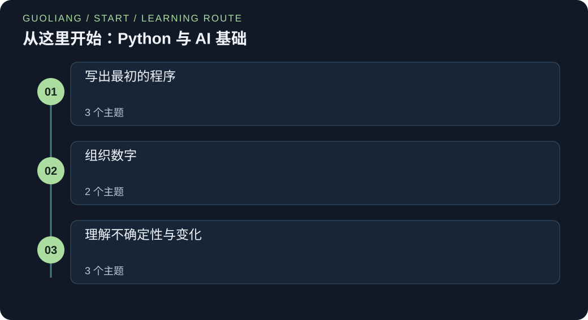

# 从这里开始：Python 与 AI 基础

> Leon | AI Field Guides

[EN](AI-START.en.md) · [中文](AI-START.zh.md)



刚开始学习编程或 AI 数学？先读这八节循序渐进的入门课。听一个故事，跟着数字计算，再运行一个小 Python 程序。

### 运行 Python 示例

使用 Python 3.12 或更新版本。把代码保存为 .py 文件，在终端中用 `python 文件名.py` 运行；部分系统使用 `python3`。若出现 `import numpy as np`，先运行 `python -m pip install numpy`。这行 import 加载 NumPy 数值工具包，并把它简称为 np。示例无需下载数据集或模型权重。

[Python 官方下载](https://www.python.org/downloads/) · [NumPy 官方安装说明](https://numpy.org/install/)

## 把知识连接起来

先学习变量、列表和函数，再学习向量、矩阵、概率、对数和斜率。每节都先解释术语再使用，只需学校阶段的基础算术就能开始。

### 开始前需要了解

- 会加、减、乘、除。
- 愿意一次检查一个小步骤。
- 运行示例需 Python 3.12 或更新版本，无需额外工具包。

### 你将学到什么

- 能读懂并修改小型 Python 程序。
- 能检查形状、单位和数学符号。
- 能解释一次损失计算和一次梯度更新。
- 带着更扎实的基础继续学习 AI 路径。

## 知识框架

### 写出最初的程序

- [数字、变量与第一个程序](#python-values)
- [列表、位置与重复操作](#lists-loops)
- [函数、条件判断与小检查](#functions-tests)

### 组织数字

- [向量与点积](#vectors-dot-products)
- [矩阵：一次表示多个样本](#matrices-shapes)

### 理解不确定性与变化

- [概率：先选对分母](#probability-counts)
- [乘方与对数并不神秘](#powers-logarithms)
- [斜率、梯度与一次学习更新](#slopes-gradients)

<a id="python-values"></a>

## 数字、变量与第一个程序

### 01 / 从一个完整故事开始

莉娅记录小温室的温度。传感器报告摄氏度，笔记却使用华氏度。她先用计算器转换一个读数。第二天早上，她重复操作时输错了数字。于是她写了三行 Python：一行保存读数，一行按规则转换，最后一行显示答案。她把结果与之前的手算比较。现在，只需改变读数，就能继续使用同一条规则。程序成了清楚的计算记录。

### 02 / 理解核心概念

变量让一个值有名字。在 Python 中，= 用来赋值，不是询问两个值是否相等。判断相等要用 ==。20 这样的数是整数。20.5 这样的数是浮点数。文字要写在引号里。

赋值时，Python 先计算等号右侧，再保存结果。括号决定运算顺序。print 函数显示结果。以 # 开头的行是给读者看的注释。

### 03 / 如何运用这个概念

把转换规则与读数分开。转换其他温度时只改变 celsius。每种单位使用清楚的变量名。需要定位错误时，可以打印中间结果。

### 04 / 官方教程与研究中的应用

Python 官方教程介绍数字、赋值和算术表达式。数据预处理会用同样的操作在分析前转换单位。这里的温度例子是对这一流程的原创演示。

### 05 / 公式与逐项解析

```text
F = (9 / 5)C + 32
```

C 表示摄氏温度，F 表示同一温度对应的华氏度。先把 C 乘以九分之五，再加 32。在 Python 中，乘法写作 *，除法写作 /。程序变长后，celsius 这样的名称通常比单个字母更容易理解。

### 06 / 一步步算出结果

令 C = 20。先算 9 / 5 = 1.8，再算 1.8 × 20 = 36，最后加上 32，得到 F = 68。若 C = 0，乘积为零，因此 F = 32。这两个检查可以帮助发现括号位置错误。程序输出 68.0，因为除法产生浮点结果。

### 先认识这些词

- **变量:** 指向一个值的名称。

- **赋值:** 用 = 把右侧结果保存到一个名称下。

- **布尔值:** 只有 True 或 False 两种取值。

### 一步步想清楚

**为什么不每次都直接写 20 × 1.8 + 32？**

给输入命名后，规则可以复用，读者也能知道 20 表示什么。

**x = x + 1 有意义吗？**

有，但 x 必须已经是数值。先读取旧值，加一，再保存新值。这是操作指令，不是代数等式。

**如果 celsius 是文字 "20" 呢？**

文字和数字的类型不同。计算前要用 float 或 int 转换数字文字。带引号的数字不会自动表现为数值。

### 数字、变量与第一个程序

把代码保存为 .py 文件，用 Python 3 运行。无需安装额外工具包。程序使用少量固定输入，你可以逐项检查结果。

```python
celsius = 20
fahrenheit = (9 / 5) * celsius + 32
print(fahrenheit)
print(fahrenheit == 68)
```

**在本地运行**

```sh
python python-values-first-steps.py
```

**预期输出**

```text
68.0
True
```

**逐步读懂代码**

第 1 行把数字 20 保存为 celsius。第 2 行读取这个值，并按公式计算，再保存为 fahrenheit。第 3 行显示 68.0。第 4 行判断结果是否等于 68，并显示 True。True 和 False 是布尔值，分别表示真和假。改变第 1 行会改变计算输入，不会改变公式。

### 这些知识可以用在哪里

**传感器预处理**

先把所有读数转换到相同单位，再进行比较。

**模型设置**

为学习率或阈值命名，让读者看得出它们的用途。

**类比的边界与注意事项:** 浮点数不能精确表示所有小数。本例可以直接核对一个简单结果。许多后续计算需要允许合适的误差，而不是要求完全相等。

**记住这一点:** 给数值起有含义的名称。= 用于赋值，== 用于比较。计算前先说清单位。

### 本节资料来源

- [Python Software Foundation: Python 入门介绍](https://docs.python.org/3/tutorial/introduction.html)

<a id="lists-loops"></a>

## 列表、位置与重复操作

### 01 / 从一个完整故事开始

莉娅现在有三天的读数。她可以创建三个变量，但第四天又需要加一行。于是她把读数放进列表，让计算机按顺序访问它们。每访问一个读数，就把它加到累计值中。最后，再除以读数数量。她能同时看到总和与平均值。增加一天的数据后，同一个循环也能处理更长的列表。关键思想是：对一组数据重复执行同一个操作。

### 02 / 理解核心概念

列表按顺序保存值，用方括号创建。位置从零开始，因此 values[0] 读取第一个元素。for 循环每次取出一个元素。循环下方缩进的行会为每个元素重复执行。

total 是累计变量。它从零开始，保存当前总和。len(values) 统计元素数量。用列表长度做除数之前，要先确认列表不是空的。

### 03 / 如何运用这个概念

多个读数用途相同时可以放进列表。同一操作要作用于每个读数时可以使用循环。先跟踪每次更新后的 total，再考虑一行简写。

### 04 / 官方教程与研究中的应用

Python 官方数据结构与控制流程教程介绍列表和 for 循环。数据清洗脚本可以逐行统计缺失值。训练循环可以逐批更新参数。两者都在对一个集合重复操作。

### 05 / 公式与逐项解析

```text
mean = (x₁ + x₂ + … + xₙ) / n = (1 / n) Σᵢ₌₁ⁿ xᵢ
```

n 是读数数量，必须大于零。xᵢ 表示数学记号中的第 i 个读数。Σ 表示把这些项相加。这里的数学编号从一开始，而 Python 列表位置从零开始。数学中的第一个读数 x₁，在代码中是 values[0]。

### 06 / 一步步算出结果

使用读数 18、21、24。从 total = 0 开始。第一次处理后为 18，第二次为 39，第三次为 63。一共有三个读数，因此平均值是 63 / 3 = 21。循环不会忘记之前的累计值，而是继续更新它。

### 先认识这些词

- **索引:** 元素在列表中的位置，Python 从零开始。

- **循环:** 对多个元素重复执行一组指令。

- **累计变量:** 保存多个步骤逐渐汇总的结果。

### 一步步想清楚

**为什么在循环外创建 total？**

若在循环内部每次归零，之前的读数就会丢失，最后只剩最后一个读数。

**values[2] 是多少？**

是 24。位置 0、1、2 分别对应第一个、第二个和第三个值。

**Python 列表就是 NumPy 向量吗？**

不是。列表是通用的 Python 容器。NumPy 数组的数值运算规则不同。后面的例子会说明使用哪种表示。

### 列表、位置与重复操作

把代码保存为 .py 文件，用 Python 3 运行。无需安装额外工具包。程序使用少量固定输入，你可以逐项检查结果。

```python
values = [18, 21, 24]
total = 0
for value in values:
    total = total + value
    print("running total:", total)
print("first:", values[0])
print("mean:", total / len(values))
```

**在本地运行**

```sh
python lists-loops-first-steps.py
```

**预期输出**

```text
running total: 18
running total: 39
running total: 63
first: 18
mean: 21.0
```

**逐步读懂代码**

列表中有三个数字。total 在循环之前创建，因此不会在每次访问时归零。value 依次得到 18、21、24。每次都会执行两行缩进代码。最后两个 print 没有缩进，所以会在循环结束后执行。注意，输出的平均值是 21.0。

### 这些知识可以用在哪里

**数据记录**

逐条访问记录，统计缺失字段或生成摘要。

**训练批次**

训练循环对多组样本重复执行更新。

**类比的边界与注意事项:** 平均值会掩盖差异。0 和 42 的平均值也为 21，但两个读数都离 21 很远。程序假设列表非空，并且只包含数字。

**记住这一点:** 列表按顺序保存数值，循环重复步骤。累加器要在循环前创建，才能保留之前的结果。

### 本节资料来源

- [Python Software Foundation: 数据结构](https://docs.python.org/3/tutorial/datastructures.html)

- [Python Software Foundation: 更多控制流程工具](https://docs.python.org/3/tutorial/controlflow.html)

<a id="functions-tests"></a>

## 函数、条件判断与小检查

### 01 / 从一个完整故事开始

奥马尔想把温度读数标记为暖或凉。他写好一次规则后，发现两个地方都需要它。复制代码会让后续修改容易遗漏，于是他给规则命名为 label_temperature。函数接收一个读数，再返回一个标签。他检查略低于边界的值，以及恰好在边界上的值。这些检查说明边界属于哪一侧。这个小函数现在有清楚的任务，也有能说明行为的例子。

### 02 / 理解核心概念

函数把一组指令放在一个名称下，def 开始函数定义。参数是有名称的输入。return 把结果交回调用者。if 根据条件选择执行哪个分支。

测试比较实际结果和预期结果。assert 的条件若为假，就会报错。它适合检查教学例子，但不能代替真实应用中对不可信输入的检查。

### 03 / 如何运用这个概念

当一个计算需要名称并可能复用时，可以写成函数。先确定输入和返回值，再写函数体。检查边界两侧以及边界本身。

### 04 / 官方教程与研究中的应用

Python 官方控制流程教程介绍 if、def 和 return。预处理流程常调用小函数完成清洗或转换。评估脚本可以调用另一个函数计算指标。清楚的输入让这些部分更容易检查。

### 05 / 公式与逐项解析

```text
label(x) = warm if x ≥ 25; otherwise cool
```

x 是传给函数的温度。25 是本例选择的边界，不是通用的舒适温度标准。符号 ≥ 表示大于或等于，在 Python 中写作 >=。函数返回文字，不返回概率。

### 06 / 一步步算出结果

x = 24 时，24 ≥ 25 为假，结果是 cool。x = 25 时，条件为真，结果是 warm。x = 29 时，结果也为 warm。这三个输入检查了两个分支和边界。很多错误恰好藏在规则发生变化的地方。

### 先认识这些词

- **参数:** 函数内部用来表示输入的名称。

- **返回值:** 函数交回的结果。

- **边界情况:** 规则行为发生变化时对应的输入。

### 一步步想清楚

**如果把 >= 改成 > 会怎样？**

25 会变成 cool。即使其他大多数输入表现相同，边界定义仍然重要。

**为什么使用 return，而不只是 print？**

返回值可以保存、比较或传给另一个函数。print 只负责显示。

**两个测试通过，就证明所有情况都正确吗？**

不能。它们只检查对应输入。还要考虑其他有效值，以及真实程序需要处理的无效输入。

### 函数、条件判断与小检查

把代码保存为 .py 文件，用 Python 3 运行。无需安装额外工具包。程序使用少量固定输入，你可以逐项检查结果。

```python
def label_temperature(value):
    if value >= 25:
        return "warm"
    return "cool"

assert label_temperature(24) == "cool"
assert label_temperature(25) == "warm"
for reading in [24, 25, 29]:
    print(reading, label_temperature(reading))
```

**在本地运行**

```sh
python functions-tests-first-steps.py
```

**预期输出**

```text
24 cool
25 warm
29 warm
```

**逐步读懂代码**

前四行定义函数，不会立刻执行函数体。调用 label_temperature(24) 时，value 得到 24，然后检查 if 条件。return 会结束这一次调用。两行 assert 检查已知情况。最后的循环再调用函数三次，并把输入和标签一起打印出来。

### 这些知识可以用在哪里

**预处理函数**

把单位转换或清洗规则放进可复用的函数。

**模型检查**

用答案已知的小例子检查评价指标是否算对。

**类比的边界与注意事项:** 这个阈值是教学规则，不是天气或健康建议。函数假设输入是数值。真实接口需要明确处理无效输入。

**记住这一点:** 函数为重复逻辑命名。return 交回结果。边界检查让规则的含义变得明确。

### 本节资料来源

- [Python Software Foundation: 更多控制流程工具](https://docs.python.org/3/tutorial/controlflow.html)

<a id="vectors-dot-products"></a>

## 向量与点积

### 01 / 从一个完整故事开始

诺拉用两个数量描述短视频：室外场景数和说话句数。一个数字无法分别保留这两项信息，于是她写成有顺序的一对数字。接着，她让两项数量对总分产生不同影响：分别乘以权重，再相加。朋友交换了两项的顺序，算出了不同分数。他们发现，向量不仅需要数值，还需要为每个位置约定相同含义。算术很简单，但顺序也是数据的一部分。

### 02 / 理解核心概念

向量是一组有顺序的数字。这里的长度指元素个数，也叫维度。特征向量描述一个对象。权重向量说明每个特征如何影响分数。

点积先把对应位置的数字相乘，再把乘积相加。两个向量必须有相同数量的元素，特征顺序也必须一致。加权分数并不自动成为有用的预测，还要说明特征、权重和评估方式是否合理。

### 03 / 如何运用这个概念

在各个位置旁写出特征名称。确认权重列表使用相同顺序。先分别计算每项贡献，再相加，这样能看出哪个特征提高或降低了分数。

### 04 / 官方教程与研究中的应用

NumPy 文档介绍一维数组的点积。线性层和线性预测规则使用特征加权和。检索模型也可以用点积比较学习得到的表示，通常还会先归一化。

### 05 / 公式与逐项解析

```text
x = [x₁, x₂]; w = [w₁, w₂]
s = w · x = w₁x₁ + w₂x₂
```

x 是特征向量，x₁、x₂ 分别是第一和第二个特征。w 中包含两个权重 w₁、w₂。符号 · 表示点积。s 是结果分数。下标表示位置，不表示乘方。点积的结果是一个数字。

### 06 / 一步步算出结果

取 x = [3, 4]，w = [2, −1]。第一项贡献为 2 × 3 = 6，第二项为 −1 × 4 = −4，相加得到 s = 2。若只把第一个特征改成 4，分数就变成 2 × 4 − 4 = 4。分数增加了 2，因为该特征的权重为 2。

### 先认识这些词

- **特征:** 一个对象的一项测量属性。

- **维度:** 这里指向量的元素数量。

- **点积:** 对应元素相乘，再把结果相加。

### 一步步想清楚

**为什么特征顺序必须一致？**

室外场景的权重必须乘以室外场景数量。只交换一个向量的顺序，会改变计算含义。

**负权重意味着数据不好吗？**

不是。它表示其他特征不变时，增加该特征会降低这个分数。

**如果一个向量多了一个元素呢？**

这个元素没有对应项。应先修正数据约定，不要悄悄丢弃它。

### 向量与点积

把代码保存为 .py 文件，用 Python 3 运行。无需安装额外工具包。程序使用少量固定输入，你可以逐项检查结果。

```python
features = [3, 4]
weights = [2, -1]
assert len(features) == len(weights)
score = 0
for position in range(len(features)):
    contribution = features[position] * weights[position]
    score = score + contribution
    print("contribution:", contribution)
print("score:", score)
```

**在本地运行**

```sh
python vectors-dot-products-first-steps.py
```

**预期输出**

```text
contribution: 6
contribution: -4
score: 2
```

**逐步读懂代码**

两个列表使用相同的特征顺序。assert 检查长度。range(2) 产生位置 0 和 1。每次循环读取一个特征及其对应权重，相乘得到单项贡献，再加入总分。这个较长的写法展示了每一步。后面可能用 sum、zip 或 NumPy 简写同一操作。

### 这些知识可以用在哪里

**线性模型**

预测常常从输入特征的加权和开始。

**相似度检索**

许多检索方法用点积或归一化后的点积比较数值表示。

**类比的边界与注意事项:** 点积本身只是算术，还需要说明特征含义与权重是否合理。尺度较大的特征可能主导分数。本例人为选择权重，是为了方便观察计算。

**记住这一点:** 对应位置相乘，再把乘积相加。维度相同并不保证特征含义相同。

### 本节资料来源

- [NumPy: numpy.dot 点积](https://numpy.org/doc/stable/reference/generated/numpy.dot.html)

- [NumPy: NumPy：初学者基础](https://numpy.org/doc/stable/user/absolute_beginners.html)

<a id="matrices-shapes"></a>

## 矩阵：一次表示多个样本

### 01 / 从一个完整故事开始

诺拉已经会给一个视频打分。现在她想同时给两个视频打分。她把每个视频的特征向量放在表格的一行，并让每列保留相同含义，再对每一行使用同一组权重。第一个分数是零，第二个是二。朋友把表格转了方向，却不知道该怎么算。他们给行标上“视频”，给列标上“特征”。计算又清楚了。矩阵可以按规则的形状保存多个相关向量。

### 02 / 理解核心概念

矩阵是一个长方形数字表格。形状先写行数，再写列数。2 × 2 矩阵有两行两列。这里每行描述一个视频，每列描述所有视频的同一特征。

让这个矩阵乘以含两个元素的权重向量，会为每一行产生一个分数。列数必须与权重数量相同。检查形状可以发现部分错误，但无法判断每列的测量含义是否正确。

### 03 / 如何运用这个概念

使用矩阵记号前，先画出行和列。标清一行代表一个样本。确认每行特征数量相同，再对各行使用同一打分规则。

### 04 / 官方教程与研究中的应用

NumPy 入门指南解释数组形状和轴。点积文档介绍矩阵与向量运算。机器学习程序利用这些结构，让一批样本共享同一组权重。

### 05 / 公式与逐项解析

```text
X = [[1, 2], [3, 4]]; w = [2, −1]
y = Xw = [1×2 + 2×(−1), 3×2 + 4×(−1)] = [0, 2]
```

X 是输入矩阵，有两行样本、两列特征。w 是由两个权重组成的列向量，这里为了方便写成列表。y 为每一行保存一个分数。Xw 表示矩阵与向量相乘，不是在 Python 中把两个完整列表直接相乘。每个输出都是一次点积。

### 06 / 一步步算出结果

第一行先算 1 × 2 和 2 × (−1)，再把 2 与 −2 相加，得到 0。第二行先算 3 × 2 和 4 × (−1)，再把 6 与 −4 相加，得到 2。两行对应两个输出。增加一个样本行，就会增加一个输出。增加一列特征，就需要增加一个权重。

### 先认识这些词

- **矩阵:** 长方形的数字表格。

- **形状:** 各个轴的大小，例如行数和列数。

- **样本:** 输入数据所描述的一个对象。

### 一步步想清楚

**为什么输出不是 2 × 2 表格？**

每行都被汇总为一个加权和，所以两行只产生两个数字。

**如果一行有三个特征呢？**

它需要三个对应权重，否则无法计算约定的点积。

**形状正确的矩阵仍会出错吗？**

会。以厘米测量的列不能悄悄替换以米测量的列。含义和单位同样重要。

### 矩阵：一次表示多个样本

把代码保存为 .py 文件，用 Python 3 运行。无需安装额外工具包。程序使用少量固定输入，你可以逐项检查结果。

```python
rows = [[1, 2], [3, 4]]
weights = [2, -1]
scores = []
for row in rows:
    assert len(row) == len(weights)
    score = 0
    for column in range(len(weights)):
        score = score + row[column] * weights[column]
    scores.append(score)
print("shape:", len(rows), "by", len(weights))
print("scores:", scores)
```

**在本地运行**

```sh
python matrices-shapes-first-steps.py
```

**预期输出**

```text
shape: 2 by 2
scores: [0, 2]
```

**逐步读懂代码**

外层循环遍历样本行，内层循环遍历当前行的列。每换一行，score 都从零开始。append 把计算完成的分数加到 scores 末尾。缩进很重要：append 在内层循环结束后才执行。如果只在外层循环前把 score 清零，分数就会跨行累加。不过，本例第一行分数为零，恰好掩盖了这个错误。把第一行改成 [2, 2]：正确输出为 [2, 2]，错误的清零位置会产生 [2, 4]。

### 这些知识可以用在哪里

**批量预测**

用特征矩阵让同一个模型处理多个样本。

**图像**

灰度图可以保存为矩阵，每个元素记录一个像素的亮度。

**类比的边界与注意事项:** 嵌套 Python 列表不会自动成为 NumPy 矩阵。这里用循环明确执行算术。更多维度需要额外的形状约定，后面的课程会先解释再使用。

**记住这一点:** 形状表示各轴大小。计算 Xw 时，特征列数必须等于权重数量。每个样本行产生一个分数。

### 本节资料来源

- [NumPy: NumPy：初学者基础](https://numpy.org/doc/stable/user/absolute_beginners.html)

- [NumPy: numpy.dot 点积](https://numpy.org/doc/stable/reference/generated/numpy.dot.html)

<a id="probability-counts"></a>

## 概率：先选对分母

### 01 / 从一个完整故事开始

莉娅保存了十天的天气记录，其中四天下雨。一个简单预警规则在五天发出了提醒，这五天中有三天下雨。朋友说，下雨比例是十分之四。莉娅提出更具体的问题：出现提醒时，有多大比例的日子真的下雨？他们只看收到提醒的五天，其中三天下雨。两个分数都算对了，但回答的是不同问题。使用概率时，第一步是选清楚计数的范围。

### 02 / 理解核心概念

观察比例等于目标数量除以所考察群体的总数量，取值在零和一之间。乘以 100 就得到百分比。概率模型也用这个范围内的数描述不确定性。

条件比例只考察满足某个条件的记录，例如收到提醒的日子。分母会随条件改变。观察比例可以帮助估计未来概率，但仅凭十天记录，不能保证对另一个季节的估计准确。

### 03 / 如何运用这个概念

选择分数前先用文字写清问题。圈出“在……条件下”所限定的群体，以此确定分母，再统计该群体中目标事件的数量。

### 04 / 官方教程与研究中的应用

Google 分类指南区分精确率和召回率。这里也需要选择分母：精确率考察提醒，召回率考察实际下雨日。天气数量只是教学演示，不是实际预报评估。

### 05 / 公式与逐项解析

```text
p̂(rain) = rainy days / all days = 4/10 = 0.4
p̂(rain | alert) = rainy alerted days / alerted days = 3/5 = 0.6
```

p̂ 上的帽子表示由这些记录得到的估计。竖线 | 表示“在……条件下”，考察范围限制为右侧条件。rain | alert 表示“已收到提醒时下雨”。分母必须大于零。这些数是小数据集中的频率，不是对明天的保证。

### 06 / 一步步算出结果

全部日子的下雨比例是 4 ÷ 10 = 0.4，也就是 40%。只看五个收到提醒的日子，下雨比例为 3 ÷ 5 = 0.6，也就是 60%。反过来问，分母又不同：四个下雨日中有三个收到提醒，所以比例为 3 ÷ 4 = 0.75。混淆这两个条件问题很常见。

### 先认识这些词

- **比例:** 部分数量除以所考察的整体数量。

- **条件:** 决定哪些记录参与计算的规则。

- **估计:** 根据已有观察推算的数值。

### 一步步想清楚

**为什么 0.6 和 0.75 不同？**

前者的分母是收到提醒的日子，后者是下雨的日子，考察的是不同群体。

**如果一次提醒都没有呢？**

分母为零，观察到的“提醒后下雨比例”就没有定义。不要把零当作实际测得的结果。

**60% 意味着明天一定下雨吗？**

不是。它概括的是这些记录在指定条件下的表现。未来天气可能不同，而且样本很少。

### 概率：先选对分母

把代码保存为 .py 文件，用 Python 3 运行。无需安装额外工具包。程序使用少量固定输入，你可以逐项检查结果。

```python
all_days = 10
rainy_days = 4
alerted_days = 5
rainy_alerted_days = 3
print("rain:", rainy_days / all_days)
print("rain given alert:", rainy_alerted_days / alerted_days)
print("alert given rain:", rainy_alerted_days / rainy_days)
```

**在本地运行**

```sh
python probability-counts-first-steps.py
```

**预期输出**

```text
rain: 0.4
rain given alert: 0.6
alert given rain: 0.75
```

**逐步读懂代码**

前四行为数量命名。第一个分数表示十天中有四天下雨。后两个分数使用相同分子三，但分母不同。第二个结果考察收到提醒的日子，第三个结果考察下雨的日子。真实程序应先检查所选群体非空，再做除法。

### 这些知识可以用在哪里

**分类器评估**

精确率考察预测为正的样本中有多少真的为正。召回率则把实际为正的样本作为分母。

**数据检查**

在根据总体平均值下结论前，先比较各组的事件频率。

**类比的边界与注意事项:** 十条记录不足以充分说明未来天气。样本可能有偏差或缺少代表性。若条件限定的群体为空，条件比例没有定义。

**记住这一点:** 先问清楚统计哪个群体。“提醒后下雨”与“下雨时提醒”通常使用不同的分母。

### 本节资料来源

- [Google: 准确率、召回率、精确率及相关指标](https://developers.google.com/machine-learning/crash-course/classification/accuracy-precision-recall)

<a id="powers-logarithms"></a>

## 乘方与对数并不神秘

### 01 / 从一个完整故事开始

诺拉比较两个模型。它们都涉及同一个真实类别，但分别给这个类别 0.8 和 0.2 的概率。只看对错，容易忽略概率分配的差异。她希望概率越低，惩罚越大，于是尝试负自然对数。第一个模型得到较小惩罚，第二个得到较大惩罚。她不需要背对数表。先理解对数在“反过来求什么”，再用 Python 核对数字。新符号就有了具体用途。

### 02 / 理解核心概念

当指数为正整数时，乘方表示重复相乘。例如 2³ = 2 × 2 × 2 = 8。对数反过来问：指数取多少才能得到这个值？因此 log₂(8) = 3。

自然对数写作 ln，以常数 e 为底，e 约等于 2.71828。exp(a) 表示 e 的 a 次方。在有效实数输入范围内，ln 和 exp 互为逆运算。分类任务中，−ln(p) 会惩罚模型给真实类别分配较低概率的行为。

### 03 / 如何运用这个概念

遇到对数先确认底数。Python 中 math.log(p) 表示 ln(p)。把损失看作评价预测的规则，代入几个概率观察规则的表现。

### 04 / 官方教程与研究中的应用

Python 的 math 文档定义 log、log2 和 exp。Google 把对数列为机器学习课程所需数学知识。后面的分类章节会用负对数构造基于概率的损失。

### 05 / 公式与逐项解析

```text
2³ = 8; log₂(8) = 3
ln(exp(a)) = a
L = −ln(p), where 0 < p ≤ 1
```

上标 3 是指数。log₂ 的下标 2 是底数。a 是实数。p 是分配给真实类别的概率。L 是这个样本的损失。ln 的底数为 e，不是 10。L 越大，说明给这个真实类别分配的概率越不理想。

### 06 / 一步步算出结果

p = 0.8 时，ln(0.8) 约为 −0.2231，因此 L 为 0.2231。p = 0.2 时，L 约为 1.6094。p = 1 时，ln(1) = 0，损失为零。当 p 从正数方向接近零时，损失不断增大，没有有限上界。ln(0) 不是有限数值。

### 先认识这些词

- **指数:** 指定底数进行乘方的次数或推广后的数值。

- **对数:** 以指定底数得到某个值时所需的指数。

- **损失:** 按指定规则衡量错误或预测不佳程度的数。

### 一步步想清楚

**为什么前面有负号？**

概率在零和一之间时，ln(p) 不大于零。加负号后得到非负惩罚。

**能把零传给 math.log 吗？**

不能。Python 会报定义域错误。真实训练代码会使用数值稳定的损失函数，而不是对舍入后的零直接取对数。

**损失小就证明模型有用吗？**

不能。还要检查未见样本、合适的指标和任务要求。损失值只回答其定义的问题。

### 乘方与对数并不神秘

把代码保存为 .py 文件，用 Python 3 运行。无需安装额外工具包。程序使用少量固定输入，你可以逐项检查结果。

```python
import math
print("power:", 2 ** 3)
print("reverse:", math.log2(8))
for probability in [0.8, 0.2, 1.0]:
    loss = -math.log(probability)
    print(f"p={probability:.1f}, loss={loss:.4f}")
```

**在本地运行**

```sh
python powers-logarithms-first-steps.py
```

**预期输出**

```text
power: 8
reverse: 3.0
p=0.8, loss=0.2231
p=0.2, loss=1.6094
p=1.0, loss=-0.0000
```

**逐步读懂代码**

import math 加载 Python 标准数学工具。** 表示乘方。math.log2 使用底数 2。只传一个参数时，math.log 计算自然对数。循环计算三个损失。f-string 把数值插入文字，:.4f 表示显示四位小数，它只改变显示形式，不改变保存的损失。 输出中的 −0.0000 是浮点负零。比较时它等于零，概率为一时损失就是零。

### 这些知识可以用在哪里

**分类损失**

使用独热标签时，交叉熵包含真实类别概率的负对数。

**概率相乘**

对数把乘积变成和，方便处理许多较小正概率。

**类比的边界与注意事项:** 对数要求输入为正数。舍入为零的概率会引起数值问题。短程序只演示公式，真实工具库会用稳定运算计算等价损失。

**记住这一点:** 对数反过来求乘方中的指数。真实类别概率越高，−ln(p) 越小；概率越低，损失越大。

### 本节资料来源

- [Python Software Foundation: 数学函数](https://docs.python.org/3/library/math.html)

- [Google: 预备知识与准备工作](https://developers.google.com/machine-learning/crash-course/prereqs-and-prework)

<a id="slopes-gradients"></a>

## 斜率、梯度与一次学习更新

### 01 / 从一个完整故事开始

莉娅调整相机参数。目标是三，但她从零开始。她用参数与目标之差的平方衡量误差，起点的误差是九。她稍微增大参数，发现误差下降，这给出了一个有用方向。接着，她根据斜率做一次小更新。参数变成 0.6，误差变成 5.76。她还没有到达目标，但已经知道如何根据局部变化寻找下一步。

### 02 / 理解核心概念

斜率描述输入改变时，输出变化得有多快。对于曲线，导数表示某一点的斜率。可以通过比较附近数值来估计它。当输入变量有多个时，梯度把各个方向的斜率收集起来。

梯度下降让参数朝损失局部斜率的反方向移动。学习率控制步长。单凭一个位置的斜率，无法知道整个曲面的形状。步子太大时，损失反而可能上升。

### 03 / 如何运用这个概念

选择简单损失，画出几个取值。用邻近输入估计斜率，再用小学习率更新一次。更新后重新计算损失，不要假定更新一定带来改善。

### 04 / 官方教程与研究中的应用

Google 梯度下降课程用导数指导参数更新。神经网络把同样的优化思路用于许多参数。反向传播计算梯度，优化器决定如何根据梯度更新参数。

### 05 / 公式与逐项解析

```text
L(w) = (w − 3)²
g = dL/dw = 2(w − 3)
w_new = w − ηg
```

w 是可调参数。L 是它与目标三之间的平方误差。dL/dw 表示 L 对 w 的导数，这里把斜率记为 g。η 读作 eta，是正的学习率。w_new 是更新后的参数。只有一个参数时，梯度就是这个单独的斜率。

### 06 / 一步步算出结果

从 w = 0 开始，损失为 (0 − 3)² = 9。斜率为 2(0 − 3) = −6。选择 η = 0.1，新值为 0 − 0.1 × (−6) = 0.6，新损失为 (0.6 − 3)² = 5.76。斜率公式来自展开变化量：[L(w+h) − L(w)] / h = 2(w−3) + h。当非零小变化 h 趋近零时，这个值趋近 2(w−3)。

### 先认识这些词

- **导数:** 函数相对于一个输入的局部斜率。

- **梯度:** 多个参数对应的偏导数组成的向量。

- **学习率:** 控制参数更新幅度的数值。

### 一步步想清楚

**为什么要减去负斜率？**

减去负数会让 w 增大。这里小幅增加 w 会靠近三，从而降低损失。

**w = 3 时会怎样？**

斜率和损失都为零，这条二次曲线已到达最小值。其他函数的零斜率点不一定是最小值。

**若 w = 0 时取 η = 2 呢？**

新权重是 12，损失是 81。步子跨得太大，损失反而上升。

### 斜率、梯度与一次学习更新

把代码保存为 .py 文件，用 Python 3 运行。无需安装额外工具包。程序使用少量固定输入，你可以逐项检查结果。

```python
def loss(weight):
    return (weight - 3) ** 2

weight = 0.0
step = 0.001
approx_slope = (loss(weight + step) - loss(weight - step)) / (2 * step)
slope = 2 * (weight - 3)
new_weight = weight - 0.1 * slope
print(f"estimated slope: {approx_slope:.3f}")
print(f"before: w={weight:.2f}, loss={loss(weight):.2f}")
print(f"after: w={new_weight:.2f}, loss={loss(new_weight):.2f}")
assert loss(new_weight) < loss(weight)
```

**在本地运行**

```sh
python slopes-gradients-first-steps.py
```

**预期输出**

```text
estimated slope: -6.000
before: w=0.00, loss=9.00
after: w=0.60, loss=5.76
```

**逐步读懂代码**

函数定义损失曲线。approx_slope 比较当前权重左右两个相邻点，它们的输入距离为 step 的两倍，所以分母是 2 * step。slope 使用这条曲线的精确导数。更新时减去“学习率 × 斜率”。最后一行检查这一次更新确实降低了损失，并不声称所有学习率都有效。

### 这些知识可以用在哪里

**线性回归**

调整直线权重，降低训练样本上的预测损失。

**神经网络**

反向传播计算参数梯度，优化器再根据梯度更新权重。

**类比的边界与注意事项:** 这里的损失是一条只有一个最小值的简单凸二次曲线。神经网络损失的形状可能复杂得多。有限差分估计也会受步长与浮点精度影响。

**记住这一点:** 梯度描述局部变化。减去“学习率 × 梯度”后，再检查结果。步子更大并不总是更好。

### 本节资料来源

- [Google: 梯度下降](https://developers.google.com/machine-learning/crash-course/linear-regression/gradient-descent)

- [Google: 预备知识与准备工作](https://developers.google.com/machine-learning/crash-course/prereqs-and-prework)

## 知识速查

### [数字、变量与第一个程序](#python-values)

给数值起有含义的名称。= 用于赋值，== 用于比较。计算前先说清单位。

### [列表、位置与重复操作](#lists-loops)

列表按顺序保存数值，循环重复步骤。累加器要在循环前创建，才能保留之前的结果。

### [函数、条件判断与小检查](#functions-tests)

函数为重复逻辑命名。return 交回结果。边界检查让规则的含义变得明确。

### [向量与点积](#vectors-dot-products)

对应位置相乘，再把乘积相加。维度相同并不保证特征含义相同。

### [矩阵：一次表示多个样本](#matrices-shapes)

形状表示各轴大小。计算 Xw 时，特征列数必须等于权重数量。每个样本行产生一个分数。

### [概率：先选对分母](#probability-counts)

先问清楚统计哪个群体。“提醒后下雨”与“下雨时提醒”通常使用不同的分母。

### [乘方与对数并不神秘](#powers-logarithms)

对数反过来求乘方中的指数。真实类别概率越高，−ln(p) 越小；概率越低，损失越大。

### [斜率、梯度与一次学习更新](#slopes-gradients)

梯度描述局部变化。减去“学习率 × 梯度”后，再检查结果。步子更大并不总是更好。

## 官方教程与原始研究

故事、讲解与计算例子由 Leon 原创编写。链接中的教程和研究属于各自作者；本资料为独立学习笔记，并非官方译本或官方认可课程。

- [Python 入门介绍](https://docs.python.org/3/tutorial/introduction.html) — Python Software Foundation

- [更多控制流程工具](https://docs.python.org/3/tutorial/controlflow.html) — Python Software Foundation

- [数据结构](https://docs.python.org/3/tutorial/datastructures.html) — Python Software Foundation

- [NumPy：初学者基础](https://numpy.org/doc/stable/user/absolute_beginners.html) — NumPy

- [numpy.dot 点积](https://numpy.org/doc/stable/reference/generated/numpy.dot.html) — NumPy

- [数学函数](https://docs.python.org/3/library/math.html) — Python Software Foundation

- [预备知识与准备工作](https://developers.google.com/machine-learning/crash-course/prereqs-and-prework) — Google

- [梯度下降](https://developers.google.com/machine-learning/crash-course/linear-regression/gradient-descent) — Google

- [准确率、召回率、精确率及相关指标](https://developers.google.com/machine-learning/crash-course/classification/accuracy-precision-recall) — Google
