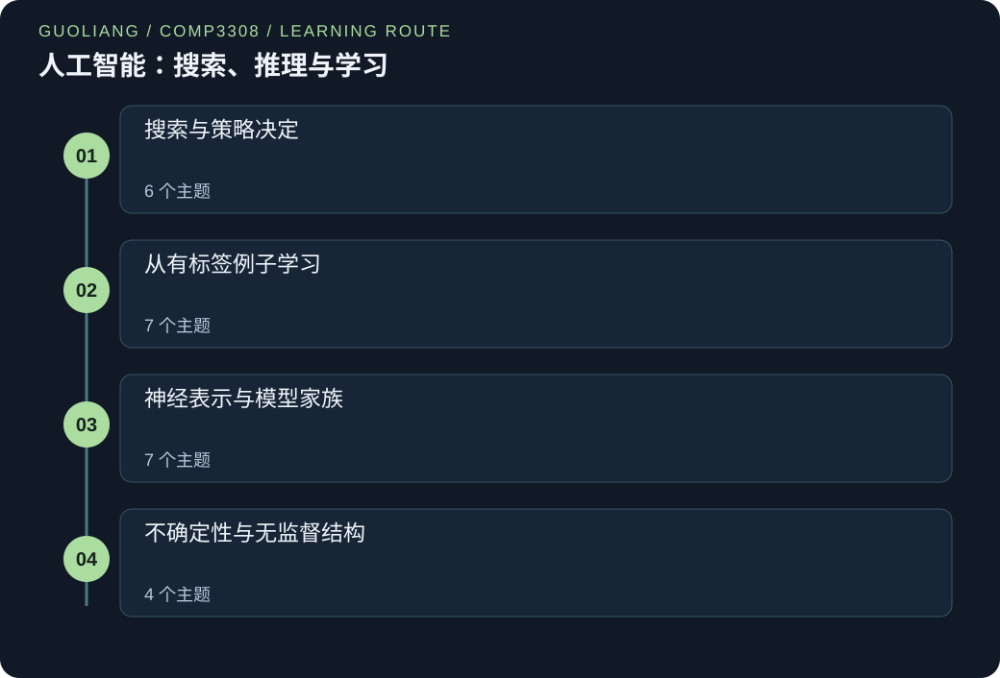

# COMP3308 — 人工智能：搜索、推理与学习

> Guoliang | Original study notes

[English](COMP3308.md) · [中文](COMP3308.zh.md)



探索智能系统怎样搜索动作、在不确定性下推理并学习预测规律。原创类比与逐步例题连接数学、实现选择与各方法的边界。

独立编写的搜索、优化、游戏、监督学习、神经网络、概率推理与聚类指南。每个主题包括原创完整推理和教学补充。强化学习与关联学习仅作入门定位。

## 把知识连接起来

### 搜索与策略决定
- [先建模，再选择搜索边界](#search-models)
- [A* 与可靠的剩余代价下界](#astar-heuristics)
- [爬山、重新开始与束搜索](#local-search)
- [模拟退火与遗传搜索](#stochastic-optimization)
- [极小极大与 α–β 界](#minimax-pruning)
- [截断、机会节点与多位玩家](#bounded-stochastic-games)

### 从有标签例子学习
- [学习任务与最近邻](#learning-neighbors)
- [1R：只看一个特征的基线](#one-rule)
- [朴素贝叶斯与平滑似然](#naive-bayes)
- [验证、交叉验证与比较](#evaluation-design)
- [混淆矩阵与错误代价](#classification-metrics)
- [决策树、熵与信息增益](#decision-tree-information)
- [让树学习规律而非记住噪声](#tree-generalization)

### 神经表示与模型家族
- [感知机与直线决策边界](#perceptron)
- [多层网络与反向传播](#backpropagation)
- [优化、初始化与正则化](#neural-training)
- [自动编码器与学习表示](#autoencoders)
- [卷积、池化与共享特征](#convolutional-networks)
- [间隔、软约束与核函数](#support-vector-machines)
- [装袋、提升与随机森林](#ensemble-learning)

### 不确定性与无监督结构
- [联合分布、条件化与贝叶斯](#probability-reasoning)
- [贝叶斯网络与推断](#bayesian-networks)
- [K-means、代表点与向量量化](#kmeans)
- [层次、阈值与聚类质量](#clustering-comparisons)

<a id="search-models"></a>

## 先建模，再选择搜索边界

### 01 / 从一个故事开始

博物馆机器人寻找房间。若有门需要钥匙，只记录房间不够：同一房间里有钥匙和没钥匙，未来选择不同。记录房间与钥匙状态就修好了模型。机器人还保存未完成路线：队列先看近处，栈沿一条走廊深入，优先队列先看已花费最少的路线。先准确描述世界，再决定探索顺序，是两项不同工作。

### 02 / 理解原理

搜索问题包括初始状态、动作、转移规则、目标检查和路径代价。搜索节点还记录父节点与累计代价；同一状态可对应多条路线的不同节点。广度优先使用先进先出队列，在有限分支下找到最浅目标；步长代价相同时也最便宜。深度优先使用栈，边界内存小，却可能困在无限分支且一般不保证最优。深度限制可能漏掉更深目标。迭代加深重复增加限制，在有限分支下兼具深度优先存储与最浅目标完备性。

一致代价搜索取出累计代价最小节点，并在取出时检查目标；无限空间中的通常完备性保证要求每步代价至少为某个正数。

### 03 / 逐项读懂公式

```text
g(n) = 到 n 路线上全部边代价之和
BFS：最小深度；DFS：当前最深；UCS：最小 g(n)
树搜索边界空间：BFS O(bᵈ)，DFS O(bm)，IDS O(bd)
```

g(n) 是到搜索节点 n 已支付代价，Σ 把路线全部边相加，不只是最后一边。b 是有限分支数，d 是最浅解深度，m 是最大搜索深度。内存界描述通常树搜索边界；图搜索已访问集合另占空间。展开次序不是最后路径。

### 04 / 先看一个完整例子

边 S→A 为1、A→G 为9、S→B 为4、B→G 为2。两个目标深度均为2，若先生成 A，广度优先可返回费用10的 S→A→G。一致代价依次取出 S、费用1的 A、费用4的 B，比较目标费用10与6，取出6后返回 S→B→G。父指针还原路线；展开顺序 S,A,B,G 本身不是合法路线。

### 先认识这些词

- **状态:** 足以决定未来合法动作的信息。

- **搜索边界:** 已生成、等待探索的路线。

- **路径代价:** 一条路线全部步骤代价之和。

### 一步步想清楚

**状态为何包括钥匙？**

它改变哪些门可打开。

**一致代价为何在取出时验目标？**

先生成目标可能比另一未完成路线贵。

**展开列表是路径吗？**

通常不是，须用父指针还原相连路线。

### 两条同深路线

有向边 S→A:2、A→G:8、S→B:3、B→G:2，无其他边。先生成 A。比较 BFS 与 UCS。

**先选择方法**

区分边数与边代价之和。

1. 两路都两条边，BFS 可依给定顺序选 A 路线。

2. 相加得 S-A-G 费用2+8=10，S-B-G 费用3+2=5。

3. UCS 取出费用2的 A、3的 B，再先取5的目标而非10。

**解释最终答案**

BFS 可返回10；UCS 返回 S-B-G，费用5。

**检验推理**

图只有这两条完整路线，5 是较小总数。

### 深度限制漏解

链 S→A→B→G 各边费用1，根深度0。先用限制2，再用迭代加深限制0、1、2、3。

**先选择方法**

先标深度，再判断限制内可到节点。

1. S、A、B、G 深度分别0、1、2、3。

2. 限制2到 B，却不能访问深度3的目标。

3. 限制0、1、2失败；限制3到 G 并还原三边路线。

**解释最终答案**

深度2搜索终止但无解；迭代加深在限制3找到费用3的解。

**检验推理**

图只有一条链，三条边不可省。

### Guoliang 的进一步思考

**代价改变算法选择**

数边只在每边代价相等时给最便宜路线；代价不同时须比较累计和。

**合并状态须有理由**

只有未来动作与代价一致才能合并两次房间访问；剩余电量可像钥匙一样重要。

**注意这个边界:** 深度限制会终止，不等于能找到现存目标。限制必须够深，环处理也必须符合状态表示。

<details>
<summary>检查自己的理解</summary>

广度优先何时像一致代价？

每步代价为相同正数且平局规则一致时，累计代价正比于深度，两者按相同层次展开。

</details>

<a id="astar-heuristics"></a>

## A* 与可靠的剩余代价下界

### 01 / 从一个故事开始

送信人比较尚未完成的路线。只看已经花的钱会偏爱便宜开头、昂贵结尾；只看剩余估计又会忘掉此前绕路。A* 把两者都写在路线卡上。剩余估计须是不超过真实最低费用的下界。移除一些障碍后的宽松地图常能提供这样的估计。更紧的下界可减少探索，但计算它也有成本。

### 02 / 理解原理

A* 优先展开累计代价加剩余估计最小的节点。可采纳表示估计从不超过真实最小剩余代价。一致性进一步要求当前估计不超过一步费用加后继估计；目标估计为0时，它蕴涵可采纳，并使沿路径的 f 不下降。通常终止条件下，树搜索 A* 配可采纳估计能找到最优解。图搜索若永久关闭状态，使用一致估计才可安全这样做；可采纳但不一致时，找到更便宜路线可能需要重新打开状态。

在选中展开时才检查目标。有限分支与正的步长下界支持无限空间中的完备性。内存常是瓶颈，IDA* 用重复搜索换取受限的深度优先存储。

### 03 / 逐项读懂公式

```text
f(n)=g(n)+h(n)
可采纳：0≤h(n)≤h*(n)
一致：h(n)≤c(n,n′)+h(n′)
hmax(n)=max(h₁(n),…,hₖ(n))
```

h(n) 估计剩余费用，h*(n) 是真实最低剩余费用。c(n,n′) 是一步费用。h 可采纳时 f 是经过该节点的解的费用下界。多个可采纳估计取最大仍可采纳，直接相加一般不保证。处处更大的下界称支配另一估计，但总耗时还依赖计算成本和平局处理。

### 04 / 先看一个完整例子

边 S→A:2、A→G:3、S→B:1、B→G:8。取 h(A)=3、h(B)=1、h(S)=2、h(G)=0。展开 S 后 A 的 f=5，B 的 f=2。先展开 B 生成费用9目标，但 A 的 f=5 更小，于是再展开 A 生成费用5目标。取出该目标才结束。估计都可采纳且一致；若首个目标一生成就停止，会错选9。

### 先认识这些词

- **启发式估计:** 用于安排探索顺序的剩余代价估计。

- **可采纳:** 不超过真实最便宜剩余代价。

- **一致:** 估计跨一步下降不超过该步代价。

### 一步步想清楚

**g=4、h=3 时 f 是多少？**

7，把已付与估计剩余相加。

**非负费用下零估计可采纳吗？**

是，此时 A* 像 UCS 排序。

**两个下界可直接相加吗？**

一般不能，可能重复计入同一必要工作。

### 选择下一边界节点

边界 A:(g=3,h=4)、B:(5,1)、C:(2,6)，估计可采纳，取最小 f。

**先选择方法**

逐项求和后比较。

1. A 的 f=3+4=7。

2. B 的 f=5+1=6，C 的 f=2+6=8。

3. 最小为 B 的6，虽然 B 已支付代价最大。

**解释最终答案**

先展开 B；若无新节点，顺序 B、A、C。

**检验推理**

仅选最小 g 会选 C，说明 A* 使用两项。

### 可采纳却不一致

边 A→B:1、B→G:4、A→G:7。h(A)=5、h(B)=2、h(G)=0，检查可采纳与一致性。

**先选择方法**

先求真实最短剩余距离，再逐边检验不等式。

1. 真实距离 h*(B)=4，h*(A)=min(7,1+4)=5。

2. 估计5≤5、2≤4、0≤0，非负且可采纳。

3. A→B 要求5≤1+2=3，失败；其余两边通过。

**解释最终答案**

估计可采纳却不一致，永久关闭须谨慎。

**检验推理**

沿 A→B，g 增1但 h 减3，f 减2，显出不一致。

### Guoliang 的进一步思考

**既检查边也检查目标**

估计表可对所有真实距离都低估，却在某边违反一致性；重新打开处理这个区别。

**更好估计也有代价**

若计算 h 比省去的展开更慢，更紧下界反而拖慢整体，须计两种成本。

**注意这个边界:** 可采纳本身不允许丢弃到已关闭状态的所有更便宜路线；须有一致性，或正确实现重新打开。

<details>
<summary>检查自己的理解</summary>

滑块拼图不计空格时，曼哈顿距离为何可采纳？

每次移动只让一个数字块走一格，每块至少走完自己的横纵位移，所以总位移不超过必要步数。再计空格可能重复计数。

</details>

<a id="local-search"></a>

## 爬山、重新开始与束搜索

### 01 / 从一个故事开始

排座位时，规划者只关心最终冲突少，不在意经过哪些旧方案。爬山法桌上只留一个方案，每次选附近最好的改进。局部束搜索留多个方案，但若它们几乎一样，多放几张桌子帮助有限。随机重启则从全新方案开始，避免一直困在一处。附近表现并不能证明远方没有更好方案。

### 02 / 理解原理

局部搜索对完整配置定义目标值与邻域。最小化时，最陡下降选目标最小的邻居，并按规则决定是否允许移动。它可停在局部最小、平台，或因允许方向不足而卡在山脊。允许有限横向移动、扩大邻域、向前多看几步与随机重启会改变行为。

局部束搜索合并 k 个当前状态的所有后继，再全局选最好的 k 个，不是 k 个独立爬山者。逐层束搜索同样丢弃束外候选。永久裁剪节省内存，却可删掉通向目标的全部路线，所以普通束搜索与爬山一般不保证完备或最优。

### 03 / 逐项读懂公式

```text
snext∈argmin{V(u):u∈N(s)}
r 次独立重启至少一次成功概率 = 1−(1−p)ʳ
```

V(s) 是配置 s 的目标值，此处越小越好。N(s) 为允许邻居集合。argmin 指取得最低分的状态，平局另设规则。重启式中 p 是单次成功率，r 是相同成功率的独立运行次数；相关重启或不同预算不能原样套用。

### 04 / 先看一个完整例子

当前排课有12个冲突，邻居为9、10、14，最陡下降选9。接着邻居为11、12、9，严格改进规则停止，虽远处可能有0。宽度2的束先留9和10，可从第二候选继续探索。若每次独立重启成功率0.2，五次至少一次成功为1−0.8⁵=0.67232，约67.2%，并非保证。

### 先认识这些词

- **邻域:** 一次允许改动能到达的候选配置。

- **局部最小:** 没有允许邻居的目标值更小。

- **束宽:** 全局筛选后保留的候选数量。

### 一步步想清楚

**局部最小证明全局最优吗？**

不能，更好状态可能隔着较差中间步。

**严格下降怎样处理同分？**

不移向同分邻居。

**束为何会失去多样性？**

多个保留候选可能来自同一区域。

### 全局选择束

束宽2，X 后继分数4、8，Y 后继3、5；越小越好，全部后继不同。

**先选择方法**

先合并后继再选择。

1. 合并得4、8、3、5。

2. 升序排为3、4、5、8。

3. 保留前两项：Y 的3与 X 的4。

**解释最终答案**

下一束分数3与4，恰有两个状态。

**检验推理**

本例每父保一碰巧相同；若 X:(1,2)、Y:(3,4)，全局会全留 X 后继。

### 三次独立重启

单次成功率1/4，三次同预算且独立，求至少一次成功概率。

**先选择方法**

先算相反事件：全部失败。

1. 一次失败概率1−1/4=3/4。

2. 独立使全失败概率 (3/4)³=27/64。

3. 从1减去：1−27/64=37/64=0.578125。

**解释最终答案**

成功概率57.8125%，高于25%但并非必然。

**检验推理**

互补概率37/64与27/64相加为1。

### Guoliang 的进一步思考

**改变邻域**

两物品交换可能有效，虽然单移任一物品都变差；更丰富动作可消除局部陷阱。

**明确独立假设**

反复用同一种子重启可重现同一失败；公式假设独立机会。

**注意这个边界:** 从每个束成员各保留 k 个后继会有最多 k² 个候选，与合并后全局只留 k 个不同。

<details>
<summary>检查自己的理解</summary>

为什么无限允许同分移动可能更糟？

可能在平台上永远循环。可限制横移次数、跟踪重复状态或明确设计随机探索策略。

</details>

<a id="stochastic-optimization"></a>

## 模拟退火与遗传搜索

### 01 / 从一个故事开始

摄影师想登高，有时须先下坡才能登上更好山脊。早期愿意探索，日落前更保守。退火用温度表达这种变化。遗传搜索则同时保存多条候选行程，组合部分路线并偶尔随机改变。生物术语只是设计比喻：两个好行程的拼接也可能无法执行，评分也可能奖励错目标。效果依赖表示、邻域与目标。

### 02 / 理解原理

模拟退火抽样邻居，总接受改进，并按损失大小和温度概率接受变差。降温减少探索。渐近收敛结论依赖严格降温与连通性假设，不保证普通有限运行达到最优。遗传算法维护种群，按适应度选父代、交叉编码并变异。选择加强利用，变异与种群多样性支持探索。

约束可通过始终合法的表示、修复或惩罚处理。精英保留能保存最佳个体，但不证明全局最优。应报告找到的最佳目标值与计算预算，不能把一次随机运行当作证明。

### 03 / 逐项读懂公式

```text
Δ=V(候选)−V(当前)
P(接受)=min(1,exp(−Δ/T))，T>0
适应度比例选择：P(i)=Fᵢ/ΣⱼFⱼ
```

V 是要最小化的目标，所以 Δ 正表示变差。T 为正温度，与目标差使用同一尺度。变差时指数函数给0到1概率。Fᵢ 是要最大化的非负适应度，分母必须正。成本与适应度方向不同，将成本转为适应度须说明依据。

### 04 / 先看一个完整例子

当前路线40，新路线44，Δ=4。T=8 时接受概率 exp(−0.5)≈0.6065，T=2 时 exp(−2)≈0.1353。均匀随机数0.3使前者接受、后者拒绝。另有适应度2、3、5，选择概率0.2、0.3、0.5。1100 与0011在第二位后交叉，得到1111与0000；子代须重新评分，父代好不保证子代好。

### 先认识这些词

- **温度:** 控制接受较差移动意愿的正数。

- **变异:** 候选编码的随机改动。

- **适应度:** 选择时用于偏好候选的评分。

### 一步步想清楚

**Δ 为负怎样？**

最小化目标改进，以概率1接受。

**降温改变什么？**

对固定正的变差量，降低接受概率。

**交叉保证子代合法吗？**

不保证，须靠表示与约束处理。

### 降温后的决策

最小化成本，当前20、候选22。温度4与1，同一均匀抽样0.4，抽样小于接受概率才接受。

**先选择方法**

先求变差量，再代各温度。

1. Δ=22−20=2，属于变差。

2. T=4 时 exp(−2/4)≈0.606531，高于0.4，接受。

3. T=1 时 exp(−2)≈0.135335，低于0.4，拒绝。

**解释最终答案**

同一较差提案，温暖运行接受，冷却运行拒绝。

**检验推理**

两概率均在0与1间，且温度下降时概率下降。

### 选择并交叉

三个适应度1、2、5。父串101010与010101从1计数在第3位后交叉，求选择概率与子串。

**先选择方法**

先归一化评分，再在指定位置交换后缀。

1. 总适应度1+2+5=8。

2. 概率1/8、2/8、5/8，即0.125、0.25、0.625。

3. 切成101|010与010|101，交换后得101101与010010。

**解释最终答案**

概率偏好适应度5；子代101101与010010，质量仍须评估。

**检验推理**

概率和为1，两个子代仍长6。

### Guoliang 的进一步思考

**温度随目标缩放**

目标与 T 同乘正数时，Δ/T 及接受概率不变。

**个别零适应度可以，总和零不行**

个体适应度0对应概率0；若全为0，除法无定义，须设备用选择规则。

**注意这个边界:** 慢降温理论不表示任何实际退火都完备且最优；无限时间的限制性结论不同于有限日程。

<details>
<summary>检查自己的理解</summary>

适应度比例选择遇到负适应度怎么办？

负数不能直接构成概率。须使用合适非负变换、排序选择或其他明确定义方案，并检查选择压力如何变化。

</details>

<a id="minimax-pruning"></a>

## 极小极大与 α–β 界

### 01 / 从一个故事开始

两人轮流选择棋子走哪条走廊。出口数字是第一人所得，也等于第二人所失。某走廊有极好出口，却可能被对手阻止。极小极大从出口反推每人能保证什么。α–β 则在证明某走廊不可能改善已有选择后停止检查；剪枝依据的是保证，不是对未看路线的猜测。

### 02 / 理解原理

有限、确定、二人零和、完全信息游戏中，MAX 节点取子值最大，MIN 节点取最小。精确终局效用给出对最佳对手的最优策略；若 MAX 持续遵循策略，更弱对手也不能迫使它更差。α–β 以深度优先回传相同值，同时携带祖先界。α 是 MAX 已有下界，β 是 MIN 已有上界。α≥β 后，其余兄弟不会改善相关祖先决定。

根值与完整极小极大相同，平局选择可不同。走法排序影响效率，最坏仍指数；理想排序可在相同预算下大约加倍可搜深度。

### 03 / 逐项读懂公式

```text
终局：V(s)=U(s)
MAX：V(s)=max V(子节点)；MIN：取 min
α≥β 时剪枝
完整树时间 O(bᵐ)；深度优先空间 O(bm)
```

U(s) 为从 MAX 角度衡量的终局收益，V(s) 为回传值。child 遍历合法后继。α、β 是当前搜索路径相关的界，并非所有节点独立全局评分。b 是分支数，m 是深度。空间界假设深度优先与后继列表，存整棵树会大得多。

### 04 / 先看一个完整例子

MAX 的三走法到 MIN 节点，叶子从左到右 A:[5,7]、B:[3,100]、C:[6,4]。A 返回5，根 α=5。B 首叶3令 β=3≤α，故100可跳过，因为 MIN 已能把 B 压到至多3。C 首叶6不能剪，继续看4并返回4。MAX 选 A 保证5，被剪叶再大也不会改变选择。

### 先认识这些词

- **效用:** 从固定玩家角度衡量结果的数值。

- **极小极大:** 选择最佳对手允许下仍能保证的最好结果。

- **剪枝:** 证明某分支不能改变所需决定后跳过它。

### 一步步想清楚

**MIN 为何取较小数？**

数字是 MAX 效用，对手要降低它。

**隐藏叶极大会阻止剪枝吗？**

不会，只要另一个 MIN 子节点已给较低上界。

**走法顺序改变精确根值吗？**

不改变，但改变可省工作量。

### 回传小树

MAX 在 MIN 节点 L（叶8、3）与 R（叶4、6）中选，全部为终局 MAX 效用。

**先选择方法**

先求对手回应，再在根选择。

1. L 的 MIN 取 min(8,3)=3。

2. R 的 MIN 取 min(4,6)=4。

3. MAX 再取 max(3,4)=4。

**解释最终答案**

选 R，对最佳对手保证4。

**检验推理**

只选最大叶8会失败，因为 MIN 可选3。

### 证明一次剪枝

根 MAX 已有完整走法价值6。下一 MIN 子节点叶依次4、9、100，说明可跳过什么。

**先选择方法**

把根下界带入 MIN 节点。

1. 此前走法建立 α=6。

2. 看到首叶4使该 MIN 的 β≤4。

3. 因 β≤4<6≤α，剩余叶不能使 MIN 值超过根已有6。

**解释最终答案**

跳过9与100，保留此前根走法。

**检验推理**

完整计算 min(4,9,100)=4，确认界与决定。

### Guoliang 的进一步思考

**界未必是精确值**

因低值子节点剪掉 MIN 后，其真值可能更低；祖先只需证明它胜不过已有选择。

**模型假设重要**

暗牌须按信息状态推理；偷看对手暗牌的极小极大树解决的是另一问题。

**注意这个边界:** 整树须使用同一效用视角。既随意反转符号又应用 MIN，会把决定反转两次。

<details>
<summary>检查自己的理解</summary>

α–β 会提高浅层估值本身的准确性吗？

不会，它保持相同树与叶值下的极小极大结果。省下工作可搜更深，但剪枝本身不改进估值函数。

</details>

<a id="bounded-stochastic-games"></a>

## 截断、机会节点与多位玩家

### 01 / 从一个故事开始

棋类程序只有十秒，不能看完所有结局，于是在某个深度估计未完局面。眼前看似有利却马上必败，说明截断边界有危险。骰子另添问题：玩家不能选择点数，须按概率平均。第三位玩家又改变动机，因为两个对手未必利益一致。时限、随机与多方利益分别要求改变模型。

### 02 / 理解原理

深度截断以启发估值替代终局效用，失去完整游戏精确最优保证。迭代加深保留截止前最后完成结果。静态搜索对战术不稳定局面延伸若干强制走法，但仍须终止控制。线性估值组合特征，可能遗漏交互。期望极小极大增加按概率加权平均的机会节点，MAX、MIN 规则不变。

期望效用要求有基数意义：正仿射变换保留偏好，一般递增变换却未必。普通 α–β 不能直接忽略随机结果；有效剪枝需未见结果的价值界与概率质量。超过两人时，Max-n 回传效用向量，每人选自己分量最大者，没有二人零和的同样保证。

### 03 / 逐项读懂公式

```text
E(s)=Σᵢwᵢφᵢ(s)
V(机会)=ΣⱼpⱼV(sⱼ)，Σⱼpⱼ=1
保留期望偏好的仿射变换：U′=aU+b，a>0
```

E(s) 用特征 φᵢ 和权重 wᵢ 估计未完成局面。pⱼ 为后继 sⱼ 的概率，须覆盖全部结果且和为1。a、b 统一缩放平移效用，a>0 时保留期望偏好。概率不等于对手可恶意选择结果。效用向量每玩家一分量，并须说明平局规则。

### 04 / 先看一个完整例子

安全行动值3，赌博以0.4概率得10、否则0，期望0.4×10+0.6×0=4，按此效用选赌博。统一作3U+2，安全变11，赌博期望14，选择不变。原非负效用平方后比较9与40，本例仍同，但其他赌博可能不同。三人节点向量(5,1,0)与(2,4,3)，玩家二因4>1选择后者。

### 先认识这些词

- **截断:** 停止搜索并估计未完成结果的位置。

- **机会节点:** 后继依概率选择的节点。

- **期望效用:** 结果效用按概率加权的平均。

### 一步步想清楚

**机会节点应选最差子节点吗？**

不，应按概率平均，除非模型明确是对手选择。

**概率和应多少？**

包含全部互斥结果后应为1。

**迭代加深保留什么？**

最后一个完整搜索深度的结果。

### 比较随机行动

安全效用2，赌博以1/4概率得8、否则0。最大化期望，平局选安全。

**先选择方法**

给结果加权，再用平局规则。

1. 高结果贡献(1/4)×8=2。

2. 低结果贡献(3/4)×0=0，总期望2。

3. 安全也为2，期望相同，按规则选安全。

**解释最终答案**

按平局规则选安全，两者期望没有高低。

**检验推理**

均值2介于赌博结果0与8间。

### 约束未见随机结果

机会分支已知概率0.3结果10；剩余概率0.7的效用介于0与4。另一行动保证6，MAX 能丢弃机会分支吗？

**先选择方法**

用未见部分最佳可能值构造上界。

1. 已知贡献0.3×10=3。

2. 未见贡献至多0.7×4=2.8。

3. 总期望至多5.8，小于已有6。

**解释最终答案**

可以，即使允许范围内最佳期望也胜不过6。

**检验推理**

下界3+0.7×0=3，整个允许区间[3,5.8]均低于6。

### Guoliang 的进一步思考

**期望值不是承诺结果**

结果0与8的赌博均值可为2，虽然2从不出现；均值概括模型下重复抽样。

**非线性效用可用但须明确**

可用分数的凹效用表示风险厌恶，先转效用再取期望；这会有意改变决策准则。

**注意这个边界:** 截断后刚好很大的估值不是已证明胜利；神经网络高输出也不自动是校准概率。

<details>
<summary>检查自己的理解</summary>

等概率得0或4与确定得1.5，开平方保留偏好吗？

不保留。原期望2与1.5偏好赌博；开方后1与约1.225偏好确定收益，非线性变换改变风险偏好。

</details>

<a id="learning-neighbors"></a>

## 学习任务与最近邻

### 01 / 从一个故事开始

修车工用相似旧记录估计新车维修时间。旧记录有实际分钟数，就能做监督回归；有维修类别，就能投票分类。没有标签而分组是聚类；学习动作的延迟奖励是强化学习；找零件同时出现的规律是关联学习。相似性的尺子很重要：价格若用分而非元，可能压过以厘米计的车架大小。最近邻直接用选出的例子预测，让这种选择清晰可见。

### 02 / 理解原理

监督学习用输入与目标成对的数据预测未见目标。k 最近邻保存训练例，把多数计算留到预测时，所以称惰性学习。分类让最近 k 例投票，回归平均其目标，也可按距离加权。欧氏、曼哈顿及一般 Minkowski 距离表达不同几何。缩放只在训练集拟合，再原样用于验证与测试。

无序类别需合理不匹配规则或编码，随意整数会制造假距离。缺失值须有明确政策。小 k 容易追随噪声，大 k 可能抹平边界。无关维度会削弱有效邻域，因此特征选择与验证重要。

### 03 / 逐项读懂公式

```text
d_q(x,z)=(Σⱼ|xⱼ−zⱼ|ᑫ)^(1/q)，q≥1
缩放值=(x−训练最小值)/(训练最大值−训练最小值)
回归：ŷ=(Σᵢwᵢyᵢ)/(Σᵢwᵢ)
```

x、z 是逐项对应特征组成的向量，j 标记特征。q=1 得曼哈顿距离，q=2 得欧氏距离。训练最小最大值决定缩放，常数特征分母0须另行处理。回归中 i 标记选中邻居，yᵢ 为目标，wᵢ 为正权重。倒距离权重须专门处理距离恰为0的匹配。

### 04 / 先看一个完整例子

复杂度1、3、6、9的旧任务耗时10、18、30、50分钟。新任务复杂度5，距离4、2、1、4。k=2 选6与3，无权平均(30+18)/2=24分钟。

倒距离权重1与1/2，预测(30+9)/1.5=26分钟。这是预测而非保证。n 条 d 维记录的暴力查询计算 n 个距离，选择邻居前费用 O(nd)，存储也 O(nd)。

### 先认识这些词

- **特征:** 测得的输入性质，例如长度。

- **回归:** 预测数值目标。

- **距离加权:** 依距离给选中例子不同影响力。

### 一步步想清楚

**为何缩放特征？**

否则单位可能主导距离，却不代表重要性。

**k 数什么？**

选中的最近训练例数量。

**新缩放值可超过1吗？**

可以，若超过训练最大值。

### 用两邻居预测

训练对(0,2)、(4,10)、(7,16)，查询 x=5，k=2，使用绝对距离。

**先选择方法**

先求距离，再只平均入选目标。

1. 距离依次5、1、2。

2. 最近为 x=4、7，目标10、16。

3. 无权平均(10+16)/2=13。

**解释最终答案**

预测13，位于两入选目标间。

**检验推理**

远目标2被排除，因为 k=2 而非3。

### 比较两种距离尺

点 x=(1,2)、z=(4,6)，坐标同等缩放，求曼哈顿与欧氏距离。

**先选择方法**

对应坐标相减，再按选定方法合并。

1. 坐标绝对差为3、4。

2. 曼哈顿相加3+4=7。

3. 欧氏先平方相加再开方：√(9+16)=5。

**解释最终答案**

距离分别7与5，对应不同几何含义。

**检验推理**

直达对角线长5不超过沿坐标走的7。

### 找到并平均两个邻居

用排序距离表重现第一道完整例题。

```python
records = [(0, 2), (4, 10), (7, 16)]
query = 5
ranked = []
for x, target in records:
    distance = abs(x - query)
    ranked.append((distance, x, target))
ranked.sort()
selected = ranked[:2]
total = 0
for distance, x, target in selected:
    total += target
prediction = total / len(selected)
print("Neighbors:", selected)
print("Prediction:", prediction)
assert prediction == 13
```

**在本地运行**

```sh
python learning-neighbors-nearest-two-trace.py
```

**预期输出**

```text
Neighbors: [(1, 4, 10), (2, 7, 16)]
Prediction: 13.0
```

**按执行顺序理解**

1. 排序前距离5、1、2。

2. 排序使输入4、7在前，目标10、16。

3. 平均26/2=13，改变 k 会改变选中集合。

**逐步读懂代码**

每条记录是输入与目标的一对。for 把值对拆到变量名，abs 求绝对距离，append 把三数元组加入 ranked 列表。

sort 先按元组首数排序，平局再看后面数字。切片 [:2] 保留前两项。第二循环加目标，+= 表示加到现有总数。len 数入选项，总数除项数得平均，assert 检查例题答案。只有一个输入坐标，演示未做特征缩放。

### Guoliang 的进一步思考

**平方距离可排邻居**

欧氏排序可省平方根，非负数开方保序；若加权公式需要距离，仍用实际距离。

**明确处理精确匹配**

d=0 时用1/d会除零；一种明确政策是先平均全部精确匹配目标，不再考虑远例。

**注意这个边界:** 对整个数据集拟合归一化会泄漏验证信息。每折都须在该折训练部分重新拟合预处理。

<details>
<summary>检查自己的理解</summary>

红绿蓝编码1、2、3为何可能伤害 k-NN？

它虚构顺序，并令红到蓝距离是红到绿的两倍；应采用符合相似含义的类别距离或合理编码。

</details>

<a id="one-rule"></a>

## 1R：只看一个特征的基线

### 01 / 从一个故事开始

图书管理员想快速判断归还物品是否需修理。先只看装订类型，对每种类型预测旧记录中最多的结果。再分别试年龄组和封面材料，保留错误最少的属性。这提供一个朴素基准：复杂模型须在新数据上说明增加复杂度的价值。一个属性可产生多条分支，所以“一条规则”不等于一个字面句子或单一结果。

### 02 / 理解原理

1R 对每个候选属性按取值分组，每组预测多数类别，再选整个规则训练错误最少的属性。平局需确定约定。若合理，缺失可作为独立类别。数值属性要划区间：排序、提出边界，避免微小区间记住个别标签；最小桶大小与合并相邻同标签区间可限制复杂度。

1R 易解释，是有效检查基线，却看不到属性间交互。属性与离散化选择都属于训练决定，最终表现须在保留观测上评估。

### 03 / 逐项读懂公式

```text
预测(v)=argmax_c count(属性=v,类别=c)
错误数(属性)=Σᵥ[count(v)−max_c count(v,c)]
```

v 为单属性类别或数值区间，c 为类别。count(v,c) 数同时属该取值与类别的训练记录；count(v) 数组内全部记录。总数减多数数是该组固定预测不可避免的错误，再跨组相加比较属性。未见类别须有政策，例如回退到训练集多数类。

### 04 / 先看一个完整例子

8 台设备标签为修理或保留。金属盖3修1留，塑料盖1修3留，各预测多数时各错1，共2。年龄组年轻2修1留，旧2修3留，错误1+2=3。所以选盖材质，训练准确率6/8=75%。新塑料设备预测保留，年龄不影响结果，显出该模型限制。

### 先认识这些词

- **基线:** 用于比较的简单参考方法。

- **多数类:** 一组中出现最多的标签。

- **离散化:** 将数值替换为所属区间类别。

### 一步步想清楚

**1R 只用一条分支吗？**

不是，一个属性可有多个值与分支。

**4A、1B 组错几个？**

预测多数 A 时错1个。

**零训练错误证明好模型吗？**

不能，可能只记住唯一标识符。

### 选择较好属性

属性 A 分组(4是,1否)、(1是,4否)；B 分组(3是,2否)、(2是,3否)。按多数预测。

**先选择方法**

求各组少数数目再相加。

1. A 错1+1=2，共10例。

2. B 错2+2=4，共10例。

3. 因2<4选 A，训练准确率(10−2)/10=0.8。

**解释最终答案**

A 以80%训练准确率胜出，保留集准确率仍未知。

**检验推理**

两属性都对应总计5是、5否。

### 单特征为何错过 XOR

记录(0,0)→0、(0,1)→1、(1,0)→1、(1,1)→0。1R 平局预测0。

**先选择方法**

按一输入分组检查标签，再检查另一输入。

1. 第一输入0组标签0与1，预测0错1。

2. 第一输入1组标签1与0，再错1，共2。

3. 按第二输入分组也得两个平衡组，错2。

**解释最终答案**

任选一特征准确率50%，目标依赖组合而非单坐标。

**检验推理**

两层树检查两个输入就能区分全部四行。

### Guoliang 的进一步思考

**说明未见类别行为**

未见取值没有学到的多数类，须在评估前指定仅依训练数据的备用规则。

**数值边界也是学到的选择**

即使最终只用一特征，按测试标签尝试很多区间仍是测试集调参。

**注意这个边界:** 每记录唯一的标识属性可达零训练错误，却对新例无用；标识符与过细数值区间须谨慎。

<details>
<summary>检查自己的理解</summary>

1R 能表示两个二元输入恰好不同时为真吗？

在完整平衡 XOR 表上，任一输入单独都不行，每组两标签一样多；交互需要更丰富模型。

</details>

<a id="naive-bayes"></a>

## 朴素贝叶斯与平滑似然

### 01 / 从一个故事开始

邮件过滤器结合优惠词和陌生发件人等线索。它先问未读线索前垃圾邮件多常见，再问若为垃圾或普通邮件，这些线索分别多常见。这样从“垃圾邮件包含什么”反推“这封是什么”。朴素之处是在已知类别后把线索视为独立；同一线索的多个相关版本可能增加信心，却没有增加同等数量的新证据。

### 02 / 理解原理

朴素贝叶斯建模类别先验与每类的各特征条件分布，利用给定类别下条件独立将其相乘。并不假设特征同等重要，不同似然比影响可很不同。类别频率需平滑，避免未见值使整类分数为0。数值特征可用每类不同均值方差的高斯密度，或其他适当分布。用对数相加可避免小数连乘下溢。

模型下缺失特征可边缘化去掉，但获胜类别可能改变；缺失本身有信息时须额外建模。需要概率就归一化类别分数，且须认识到错误独立假设可能使概率校准较差。

### 03 / 逐项读懂公式

```text
P(c|x)∝P(c)ΠⱼP(xⱼ|c)
P(xⱼ=v|c)=(N_cv+1)/(N_c+kⱼ)
高斯密度：exp(−(x−μ)²/(2σ²))/(σ√(2π))
```

c 为类别，xⱼ 为第 j 个观测特征，∝ 省略各类共有分母。N_cv 数该类取值 v，N_c 数该特征有观测值的该类记录，kⱼ 为可能类别数。Laplace 平滑给每类别加1。高斯式为密度，不是某精确实数的概率；μ 与正 σ 为该类参数。

### 04 / 先看一个完整例子

先验垃圾0.25、普通0.75。垃圾下优惠词0.8、陌生人0.6；普通下为0.1、0.2。两线索都出现时，分数0.25×0.8×0.6=0.12 与0.75×0.1×0.2=0.015。

和0.135，垃圾后验0.12/0.135=8/9≈0.8889。另在6条该类记录、4种可能值中，未见值平滑概率(0+1)/(6+4)=0.1。各类使用同一证据，归一化分母相同，归一化前也能比较预测。

### 先认识这些词

- **先验:** 当前证据出现前的类别概率。

- **似然:** 假设某类别时观测证据多符合预期。

- **平滑:** 加指定伪计数，避免缺乏依据的零估计。

### 一步步想清楚

**独立是在知道类别前还是后？**

模型假设给定类别后独立。

**分数已加为1吗？**

通常不是，需后验概率时各除以分数和。

**为何用对数？**

小概率连乘可下溢，对数把乘积变和。

### 归一化两类分数

P(A)=P(B)=0.5，观测 x=y=1，A 下似然0.8、0.5，B 下0.2、0.5，假设条件独立。

**先选择方法**

先验乘该类似然，再归一化。

1. A 分数0.5×0.8×0.5=0.2。

2. B 分数0.5×0.2×0.5=0.05，总和0.25。

3. 后验0.2/0.25=0.8 与0.05/0.25=0.2。

**解释最终答案**

预测 A，模型后验0.8；第二线索似然相同，不改赔率。

**检验推理**

先验赔率1:1，后验4:1等于第一线索似然比0.8:0.2。

### 平滑未见类别

某类计数红3、绿1、蓝0，仅此三种可能，使用加一平滑。

**先选择方法**

各计数加1，原总数加3。

1. 原总数3+1+0=4。

2. 平滑计数4、2、1，分母4+3=7。

3. 概率4/7、2/7、1/7，蓝现有正支持。

**解释最终答案**

未见蓝估计1/7≈0.142857，避免整项乘积为0。

**检验推理**

分子4+2+1=7等于分母，概率和为1。

### Guoliang 的进一步思考

**重复证据须谨慎**

复制二元特征产生完全依赖列，朴素相乘把其似然比计两次，可夸大信心。

**密度可大于1**

窄连续分布密度高度可超过1但总面积仍1，不能像事件概率一样截断高斯密度。

**注意这个边界:** 去掉缺失特征不保证类别排序不变，其似然比可能原本正是决定因素。

<details>
<summary>检查自己的理解</summary>

相乘 P(特征) 与朴素贝叶斯有何不同？

朴素贝叶斯用 P(特征|类别)，线索对各类影响不同；无条件概率对每类是相同乘数，不能提供类别专属证据。

</details>

<a id="evaluation-design"></a>

## 验证、交叉验证与比较

### 01 / 从一个故事开始

厨师用一组试吃者调整食谱，另一组留作最后评价。若每次调整都问最后一组，他们事实上已参与调优。机器学习也一样，反复看测试分数会把它变成开发的一部分。交叉验证轮流保留一部分有限数据，但训练集重叠，不能当成统计独立实验。须先说明要代表什么未来观测，再分开开发选择和最终估计。

### 02 / 理解原理

训练估参数；验证选择超参数、特征、预处理和停止规则；测试在这些决定固定后估表现。保留法一次切分，重复保留观察切分变动，k 折轮流留一折。分层大致保持类别比例，却不能解决重复人物、时间顺序或相关记录泄漏，这些需按组或时间切分。每个学得的预处理都须在各折训练部分拟合。留一法训练 n 个模型，可能昂贵。

在相同切分上比较配对差值。经典配对 t 区间假设差值大致独立并满足适当分布；普通交叉验证训练集重叠，直接套用可过度自信。部署前重训改变拟合模型，并不产生新测试估计。

### 03 / 逐项读懂公式

```text
等大折 CV 分数=(1/k)Σᵢscoreᵢ
d̄=(1/k)Σᵢdᵢ
s_d²=Σᵢ(dᵢ−d̄)²/(k−1)
经典配对区间：d̄±t*s_d/√k
```

k 是配对评估次数，dᵢ 是同评估集上 A 分数减 B 分数。横线表示平均，s_d 为差值样本标准差。t* 依置信水平与 k−1 自由度。区间是带假设的统计模型，不是自动优越证书。不同折大小下，估逐例总体表现可能须按人数加权。

### 04 / 先看一个完整例子

120 个独立观测作六折，每次训练100、评估20，每观测评估一次，训练集仍重叠。另有五次适当独立实验的配对分数差0.02、0.04、0.03、0.01、0.05，均值0.03、样本标准差约0.01581。

t*=2.776 时95%经典区间0.03±0.01963，即约[0.0104,0.0496]。不加判断用于五个普通交叉验证折，会忽略依赖并夸大证据。

### 先认识这些词

- **验证:** 用于选择模型设置的开发数据。

- **泄漏:** 预测时不可获得的信息进入模型开发。

- **配对比较:** 用相同评估观测比较两个模型。

### 一步步想清楚

**分层会消除时间泄漏吗？**

不会，它平衡类别比例，不保证时间顺序。

**交叉验证中在哪拟合缩放？**

在每折的训练部分内。

**测试集用于调参吗？**

不是，用它作选择就变成开发数据。

### 计算五折划分

100个独立例分五等折，每次一折验证，求训练数、验证数、总验证出现数。

**先选择方法**

先等分，再跟踪轮换。

1. 每折100/5=20例。

2. 每次训练100−20=80，验证20。

3. 五次共5×20=100次验证出现，每例一次。

**解释最终答案**

每次训练80、验证20，每例保留一次。

**检验推理**

训练出现共400次，故验证折虽分开，训练集仍重叠。

### 折均值与总体准确率

两验证折分别10与30例，正确9与15，求不加权折均值与总体准确率。

**先选择方法**

保留每个计数对应分母。

1. 折准确率9/10=0.9 与15/30=0.5。

2. 等折均值(0.9+0.5)/2=0.7。

3. 总体准确率(9+15)/(10+30)=24/40=0.6。

**解释最终答案**

等折均值70%，逐观测总体准确率60%。

**检验推理**

按大小加权(10/40)0.9+(30/40)0.5=0.6，与总计一致。

### Guoliang 的进一步思考

**相关记录放同组**

同物体照片跨训练测试可奖励记住该物体；应按部署时真正新出现的单位分组。

**按要估的量加权**

折准确率平均给折同权，总体准确率给观测同权；折大小不同时可不同。

**注意这个边界:** 测试数据不能决定最佳超参数。评估模型选择过程时，用嵌套评估或独立最终测试集。

<details>
<summary>检查自己的理解</summary>

预测下月需求时随机分层为何可能误导？

可能用晚于验证记录的数据训练，提前见到未来模式。应采用符合预测场景的时间顺序评估。

</details>

<a id="classification-metrics"></a>

## 混淆矩阵与错误代价

### 01 / 从一个故事开始

包裹扫描器标记破损件。几乎全找出听来很好，但若完好件也几乎全标记，检查员会忙于误报。过于谨慎又可能少误报却漏掉多数破损。混淆矩阵分别统计真实情况与预测决定。实际选择还取决于后果：不必要检查与漏掉破损可能代价不同，单个百分比不能表达全部取舍。

### 02 / 理解原理

指定正类后，混淆矩阵数真正、假正、假负与真负。准确率看全部正确，精确率问阳性预测多可信，召回率问实际阳性找到多少。F1 是精确率与召回率的调和平均，不使用真负。类别不平衡可使无用多数预测器准确率很高。分母为0须明确报告政策，多类须有意选择宏、微或加权平均。

改阈值常权衡精确率与召回率，但不同模型间不是普遍代数反比。代价矩阵加权不同错误。阈值在验证集选，并在相关类别比例的保留数据上评估。

### 03 / 逐项读懂公式

```text
准确率=(TP+TN)/N
精确率=TP/(TP+FP)；召回率=TP/(TP+FN)
F1=2TP/(2TP+FP+FN)
总错误代价=c_FP·FP+c_FN·FN
```

TP 真正、FP 假正、FN 漏掉正类、TN 真负，N 是总数。先说明正类。c_FP、c_FN 是每种错误的特定代价，简式假设各类内固定。F1 有定义时在0到1间，不是概率或成本估计。没有正预测时精确率须明确约定。

### 04 / 先看一个完整例子

200件中40真破损，标50件，其中30真破损。TP=30、FP=20、FN=10、TN=140。准确170/200=85%，精确30/50=60%，召回30/40=75%，F1=60/(60+20+10)=2/3≈66.7%。

误检每次2、漏检每次15，总代价20×2+10×15=190。全部不标准确率80%，却耗40×15=600，说明实际目标不能只看准确率。比较用相同总体并明确两种错误。

### 先认识这些词

- **精确率:** 正预测中真正为正的比例。

- **召回率:** 实际正类被成功找到的比例。

- **假负:** 实际为正却被预测为负的例子。

### 一步步想清楚

**召回率分母是什么？**

全部实际正类 TP+FN。

**F1 使用 TN 吗？**

不使用，只增加真负不会改变 F1。

**为何命名正类？**

交换类别角色会改变精确率与召回率。

### 构造四格计数

100例中20真阳性，系统预测30阳性，其中15正确，求四指标。

**先选择方法**

先补全混淆矩阵，再代比率。

1. TP=15，FP=30−15=15。

2. FN=20−15=5；TN=100−15−15−5=65。

3. 准确80/100=0.8；精确15/30=0.5；召回15/20=0.75；F1=30/(30+15+5)=0.6。

**解释最终答案**

准确80%、精确50%、召回75%、F1=60%；总准确率隐藏了半数标记为假。

**检验推理**

四格和100，实际阳性15+5=20，吻合已知。

### 比较错误代价

同一集 A 有 FP=8、FN=4；B 有 FP=14、FN=1。假正代价1，假负10，忽略正确决定代价。

**先选择方法**

先加权两类错误，再比较总数。

1. A 代价8×1+4×10=48。

2. B 代价14×1+1×10=24。

3. B 虽多6个假正，却节省48−24=24单位。

**解释最终答案**

给定代价下选 B，换代价比可能改变选择。

**检验推理**

少3次漏报省30，多6次误报花6，净省24。

### Guoliang 的进一步思考

**代价单位须一致**

一种错误用分钟、另一用货币不能直接相加，须共同单位或转换规则。

**阈值选择也是学习决定**

即使模型权重固定，在最终测试标签上试阈值仍泄漏信息。

**注意这个边界:** 全部预测阴性不会得到完美精确率；没有正预测时分母为0。

<details>
<summary>检查自己的理解</summary>

召回90%而精确10%说明什么？

能找到实际正类十之九，但标记十例仅一例真阳性，多数标记为误报，工作量可能很大。

</details>

<a id="decision-tree-information"></a>

## 决策树、熵与信息增益

### 01 / 从一个故事开始

博物馆导览员靠一串问题识别藏品。好的首问把集合分成更容易辨认的组，几乎总得到同答案的问题帮助小；按目录号识别每件藏品则只记住旧收藏，不帮助新物品。决策树测量提问前后的不确定性，随后各分支只在到达本分支的数据上继续提问。局部好问题未必产生全局最小树。

### 02 / 理解原理

分类树内部节点测属性或阈值，叶子预测类别。ID3 贪心选高信息增益，分组后递归。熵衡量类别分布的不确定性，信息增益是父熵减按子组大小加权的子熵。纯节点熵0。若无有效划分，预测多数而非无限继续；空分支需基于父数据回退。数值阈值产生沿坐标方向的边界，类别测试按值分支。

树可表达复杂有限映射，但同样特征却冲突的标签不能由确定函数全部分对。学到紧凑且泛化的树不只是降低训练熵。

### 03 / 逐项读懂公式

```text
H(Y)=−Σ_cp_c log₂p_c，约定0log₂0=0
IG(S,A)=H(S)−Σ_v(|S_v|/|S|)H(S_v)
```

p_c 是类别 c 比例，以2为底的对数使熵单位为比特。零概率项按极限定义0，不是说 log₂0=0。S 为当前训练子集，A 为候选属性，S_v 为子集，权重 |S_v|/|S| 为分到该支的比例。按观测数平均，不能对大小不同分支等权。

### 04 / 先看一个完整例子

8件藏品4A4B，父熵1比特。某问题分成3A1B与1A3B，各熵−0.75log₂0.75−0.25log₂0.25≈0.8113，加权仍0.8113，增益0.1887。另一个问题得到两个各4件纯组，子熵0，增益1。贪心训练选第二问，泛化还取决于问题怎样获得和验证。

### 先认识这些词

- **熵:** 衡量标签分布不确定性的数。

- **信息增益:** 父不确定性减划分后期望不确定性。

- **纯节点:** 只含一个观测类别的节点。

### 一步步想清楚

**确定一个类别的熵？**

0，因为没有类别不确定性。

**子熵为何加权？**

大子组有更多观测，应贡献更多。

**贪心意味着全局最佳树吗？**

不是，眼前最好划分未必给最好完整树。

### 完全提供信息的划分

节点4红4蓝，划分将红全送左、蓝全送右，求父熵与比特增益。

**先选择方法**

计算类别比例，再加权子不确定性。

1. 父比例各1/2，H=−2(1/2)log₂(1/2)=1。

2. 两子组纯，各熵0。

3. 加权子熵(4/8)0+(4/8)0=0，增益1−0=1。

**解释最终答案**

增益1比特，移除全部训练标签不确定性。

**检验推理**

增益等于父熵，不能移除超过原本存在的不确定性。

### 加权子组的不确定性

节点3A1B，分为纯2A与混合1A1B，使用 log₂3≈1.584963。

**先选择方法**

先求父熵，再按各子组两条记录加权。

1. 父熵−0.75log₂0.75−0.25log₂0.25≈0.811278。

2. 纯子熵0，平衡混合子熵1。

3. 各权重2/4，期望熵0.5，增益约0.311278。

**解释最终答案**

增益约0.3113比特，混合子组仍有不确定性。

**检验推理**

增益非负，且小于初始0.811278比特。

### Guoliang 的进一步思考

**熵单位依赖对数底**

底2给比特，自然对数给奈特；比较增益须一致底数。

**唯一标识可看似完美**

每训练例独立纯叶可消掉熵，却对未来标识无规则；纯度不足以证明好。

**注意这个边界:** 子熵必须按大小加权，小纯组不应压过大混合组。

<details>
<summary>检查自己的理解</summary>

四个等概率类别熵多少，为什么？

−4×(1/4)×log₂(1/4)=2比特，理想编码平均需两个二元比特区分四种同等可能标签。

</details>

<a id="tree-generalization"></a>

## 让树学习规律而非记住噪声

### 01 / 从一个故事开始

园丁可任由枝条生长，也可修掉耗空间却不结果的枝。学习树也有这种张力：额外分支能解释特殊训练记录，却可能损害未来判断。修剪应依据创建分支之外的数据。数值测试若为每个异常值切微小区间，训练解释漂亮，分类器却脆弱。有效修剪取决于验证证据与错误代价，而不是外观对称。

### 02 / 理解原理

预剪枝用深度、最小叶大小或最小改善限制增长。后剪枝先长树，再比较用多数叶替代子树、提升子树或修剪提取规则等简化。减少错误剪枝按平局政策接受不损害验证表现的改动。数值阈值常在排序后不同相邻值之间，按所得加权不纯度评估。

信息增益偏好多取值属性，包括标识符。增益率除以分支分布熵以缓解偏好，但极小分母又有问题，实践需筛选保障。获取测试的成本也可影响选择。这些方法都不保证最佳树，最终测试集不能用于剪枝。

### 03 / 逐项读懂公式

```text
SplitInfo(A)=−Σ_v q_v log₂q_v，q_v=|S_v|/|S|
GainRatio(A)=IG(S,A)/SplitInfo(A)
不同相邻值 a<b 的候选阈值：θ=(a+b)/2
```

q_v 为进入分支 v 的当前例子比例，不论类别。SplitInfo 衡量分支归属的不确定性，IG 衡量类别不确定性减少。分裂信息正时增益率才有定义，并须配筛选规则。θ 在不同排序值 a、b 之间；实现可选等价安全可表示边界，并一致处理重复值。

### 04 / 先看一个完整例子

8条训练记录二元标签平衡。唯一标识分成8个纯单例，信息增益1，分裂信息−8×(1/8)log₂(1/8)=3，增益率1/3。另一个有意义的二值属性也完全分开标签，分裂信息1，增益率1。随后某子树验证20例中对15，换多数叶对16，减少错误剪枝接受替换。验证支持简化，最终表现仍须未碰评估数据。

### 先认识这些词

- **预剪枝:** 分支完全建立前停止生长。

- **后剪枝:** 按指定标准简化已生长的树。

- **增益率:** 信息增益除以分支分布熵。

### 一步步想清楚

**测试集可选剪枝吗？**

不可，应使用验证证据并保留最终测试。

**为何考虑不同值之间阈值？**

它们改变两侧归属，不能不一致拆分相等值。

**SplitInfo=0 怎样？**

比率无定义，该划分将全部例送同一支。

### 按验证计数剪枝

子树验证25例对17，替换为训练多数叶对19；接受准确率不下降的改动。

**先选择方法**

在同一批验证例上比较。

1. 子树准确17/25=0.68。

2. 叶准确19/25=0.76。

3. 改善2/25=0.08，简单替代通过规则。

**解释最终答案**

剪掉子树，验证准确率升8个百分点。

**检验推理**

错误由8降6，对应多正确2例。

### 比较增益率

4例二元标签平衡。ID 有4个单例支，A 有两个大小2纯支，两者增益均1比特。

**先选择方法**

分开计算分支熵与类别增益。

1. ID 各支概率1/4，分裂信息2比特。

2. A 各支概率1/2，分裂信息1比特。

3. 增益率 ID 为1/2=0.5，A 为1/1=1。

**解释最终答案**

A 增益率高，用更少分支得到相同训练区分。

**检验推理**

原信息增益平局，归一化才区分选择。

### Guoliang 的进一步思考

**平局政策影响树大小**

验证分数相同时偏好小树是合理简约政策，但须事先声明。

**纯叶未必有用**

单例叶内部无分歧，却很少支持未来判断；最小叶大小权衡拟合与稳定。

**注意这个边界:** 增益率仅减少部分多值偏好，不自动去除标识符泄漏，也不保证更小更准。

<details>
<summary>检查自己的理解</summary>

预剪枝为何可能太早停止 XOR？

平衡根节点每个单输入信息增益0，但连续两层能解决；要求立即正增益会漏掉有用交互。

</details>

<a id="perceptron"></a>

## 感知机与直线决策边界

### 01 / 从一个故事开始

自动门为证件特征加权计分，再加基准调整，达到阈值就开门。每个权重决定对应特征影响。当已知有效证件被拒，感知机向它的方向调整；无效证件被接受则反向调整。几何上是旋转或移动分界线。一条线不能表达全部模式，例如正方形两个相对角接受、另两个拒绝就做不到。

### 02 / 理解原理

人工神经元计算加权输入和偏置，再应用激活函数。感知机使用硬阈值，因此形成线性边界。目标0/1时，错误量为目标减预测，误分例按输入比例改权重并改偏置。一个 epoch 是遍历训练集一次。有限且线性可分数据在通常更新条件下，标准感知机会在有限误分后收敛。不可分数据需停止预算或其他目标。

它寻找分界，不保证最大间隔。多神经元隐藏层能组合直线测试表示 XOR 等非线性模式，但原单感知机更新并不直接解决多层如何分配误差的问题。

### 03 / 逐项读懂公式

```text
z=w·x+b；z≥0 时 a=1，否则0
e=t−a
w←w+ηex；b←b+ηe
边界：w·x+b=0
```

x 是输入向量，w 是同长权重，b 是偏置，z 是激活前分数，a 为二元输出。t 也是0/1目标，η 为正学习率。点积就是对应项相乘后相加。更新须使用更新前预测。w 垂直分界面，b 在不改变方向时移动边界。

### 04 / 先看一个完整例子

x=(2,−1)、t=1、w=(0.2,0.4)、b=−0.3、η=0.5。分数0.2×2+0.4×(−1)−0.3=−0.3，a=0、e=1。权重更新为(1.2,−0.1)，偏置0.2。

重新算得1.2×2+(−0.1)×(−1)+0.2=2.7，输出1。本例现正确，但以前正确例可能换边，须检查全训练集才可声称已分开。更新同时改变方向与位置，固定偏置会是另一算法。

### 先认识这些词

- **点积:** 对应元素相乘，再将乘积相加。

- **偏置:** 加在输入加权和上的可调整常数。

- **线性可分:** 一条直边界能使所有标签在正确一侧。

### 一步步想清楚

**预测正确时怎样？**

e=0，规则不改权重或偏置。

**一定找到最宽间隔吗？**

不会，普通感知机只求分隔。

**本处零分预测什么？**

类别1，因为阈值 z≥0。

### 纠正假正

x=(1,2)，目标0，w=(1,0)，b=0，η=0.2。z≥0预测1，执行一次更新。

**先选择方法**

先求旧预测与有符号错误，再改参数。

1. 旧分数1，a=1，e=0−1=−1。

2. 权重变化0.2(−1)(1,2)=(−0.2,−0.4)，新 w=(0.8,−0.4)。

3. 新 b=−0.2，分数0.8−0.8−0.2=−0.2，输出0。

**解释最终答案**

本例一次更新后正确。

**检验推理**

分数降1.2=η(||x||²+1)，符合 e=−1。

### 使用有偏移边界

一维 x=1 标签0、x=3 标签1，阈值 z≥0。固定 w=1 找 b，再检查 b=0 为何任意 w 都不行。

**先选择方法**

把边界放两点之间，再检查符号。

1. 取 b=−2，z=x−2，边界 x=2。

2. x=1 时 z=−1 给0，x=3 时 z=1 给1。

3. 若 b=0，两正输入都与 w 同号；w=0 又都给1，不能分出不同标签。

**解释最终答案**

w=1、b=−2 分开数据，本例偏置不可缺。

**检验推理**

中点2严格位于1与3间，无例恰在阈值上。

### Guoliang 的进一步思考

**固定旧预测**

用旧参数算一次 e；坐标更新途中重算 e 会混合两种规则。

**缩放改变更新轨迹**

同一错误下某输入坐标乘100，该权重更新也乘100；解释学习率行为前须考虑缩放。

**注意这个边界:** 零分须明确阈值约定。在一次跟踪中混用 > 与 ≥ 会改变更新。

<details>
<summary>检查自己的理解</summary>

没有偏置为何可能无法分开原本直线可分数据？

边界会被限制经过原点，偏置提供不经过原点的分隔所需位移。

</details>

<a id="backpropagation"></a>

## 多层网络与反向传播

### 01 / 从一个故事开始

几道工序做出的最终产品出错，只怪最后一站会漏掉前站的影响。反向传播追踪每站小改变怎样影响最终误差：下游敏感度乘本站局部敏感度。这是链式法则，不是把原目标原封不动发给每个隐藏单元。前向保存中间值，反向复用。优化器改设置前，所有梯度必须描述同一套当前配置。

### 02 / 理解原理

多层感知机交替组合仿射变换与非线性激活。没有非线性，多层仿射仍可合成一层。类别输入常用独热编码或学习的嵌入；输出依任务选择，二类常用一个 sigmoid，互斥多类常用 softmax。反向传播沿计算图高效求指定损失的导数。sigmoid 与半平方误差下，输出敏感度是预测误差乘 sigmoid 导数，隐藏敏感度则经输出权重汇总下游敏感度。

全部梯度先用前向时参数计算，再一起更新。普遍逼近定理是在特定函数和论域条件下说足够大网络存在，不保证某架构或某次训练找到合适参数。

### 03 / 逐项读懂公式

```text
σ(z)=1/(1+exp(−z))；σ′(z)=σ(z)(1−σ(z))
L=½Σᵢ(aᵢ−tᵢ)²
输出 δᵢ=(aᵢ−tᵢ)aᵢ(1−aᵢ)
隐藏 δⱼ=aⱼ(1−aⱼ)Σᵢwᵢⱼδᵢ
∂L/∂wᵢⱼ=δᵢaⱼ；w←w−η∇L
```

a 为激活，t 为目标。δ 是损失对激活前分数的导数，即该分数小改动时损失的变化率。wᵢⱼ 从源 j 连到目的 i。隐藏单元无直接目标，因此汇总下游贡献。∇ 是把各参数偏导数组成的列表；偏导只变一个量而固定其他量。这些 δ 式专用于 sigmoid 与半平方误差，更换损失或激活需改局部导数。

### 04 / 先看一个完整例子

输入1，隐藏 sigmoid 权重0、偏置0，输出 sigmoid 权重2、偏置−1。隐藏激活0.5，输出分数2×0.5−1=0，输出0.5。目标1时损失0.125。输出 δ=(0.5−1)×0.25=−0.125，输出权重梯度−0.0625。

隐藏 δ=0.25×2×(−0.125)=−0.0625，也等于输入权重梯度。学习率0.1时两权重各加0.00625，输出偏置加0.0125，隐藏偏置加0.00625。

### 先认识这些词

- **导数:** 一个量轻微变化时另一量的局部变化率。

- **链式法则:** 沿依赖路径相乘局部变化率，多条路径贡献相加。

- **梯度:** 各可调参数对应的损失导数组成的列表。

### 一步步想清楚

**为何保存前向激活？**

反向的局部导数公式需要它们。

**隐藏单元直接以原标签为目标吗？**

通常没有，它经下游连接收到敏感度。

**为何加非线性激活？**

否则多层仿射仍只描述一个仿射变换。

### 一个 sigmoid 梯度

输入2、权重0、偏置0、目标1，sigmoid 输出，L=(a−t)²/2，学习率0.1，求一次同步更新。

**先选择方法**

先前向求 a，再经损失与激活反向计算。

1. z=0，a=σ(0)=0.5，L=0.125。

2. sigmoid 斜率0.25，δ=(0.5−1)0.25=−0.125。

3. 权重梯度 δx=−0.25，偏置梯度−0.125；新 w=0.025、b=0.0125。

**解释最终答案**

新分数升到0.0625，使输出朝目标1移动。

**检验推理**

两梯度负，减去它们使参数增加，方向符合需要。

### 反传简单链

u=3w，预测 a=u+1，目标4，L=(a−t)²/2。在 w=2 求 dL/dw，已知损失对 a 斜率 a−t。

**先选择方法**

先求中间值，再反向乘局部斜率。

1. w=2 时 u=6、a=7，L=4.5。

2. 局部斜率 dL/da=3、da/du=1、du/dw=3。

3. 链式法则 dL/dw=3×1×3=9。

**解释最终答案**

梯度9，局部略减 w 会降低损失。

**检验推理**

直接 L=(3w−3)²/2，w=2 时斜率3(3w−3)=9，与链式结果一致。

### 检查一次 sigmoid 更新

只用标准 math 模块跟踪第一道完整例题。

```python
import math

x, target = 2.0, 1.0
weight, bias = 0.0, 0.0
rate = 0.1
score = weight * x + bias
activation = 1 / (1 + math.exp(-score))
delta = (activation - target) * activation * (1 - activation)
weight_gradient = delta * x
bias_gradient = delta
weight = weight - rate * weight_gradient
bias = bias - rate * bias_gradient
print(f"Old output: {activation:.6f}")
print(f"New weight: {weight:.6f}")
print(f"New bias: {bias:.6f}")
print(f"New score: {weight * x + bias:.6f}")
assert abs(weight - 0.025) < 1e-12
```

**在本地运行**

```sh
python backpropagation-sigmoid-one-update.py
```

**预期输出**

```text
Old output: 0.500000
New weight: 0.025000
New bias: 0.012500
New score: 0.062500
```

**按执行顺序理解**

1. 旧分数0给激活0.5、delta −0.125。

2. 输入2使权重梯度−0.25，偏置梯度−0.125。

3. 减负更新使分数升至0.0625。

**逐步读懂代码**

import math 使指数函数 math.exp 可用。逗号赋值将两个数字分别存入两个名称。sigmoid 把旧分数转为0与1间输出。

delta 将损失斜率乘 sigmoid 斜率。两个梯度先保存，再改变任一参数。减学习率乘梯度就是下降。f 字符串插入数值，:.6f 显示六位小数。abs 与小容差检查浮点结果。这是手工设定的单神经元与一步训练，不是训练好的通用分类器。

### Guoliang 的进一步思考

**先看单数链**

u=2w、L=u²/2 时，w 微变让 u 变两倍；将变化率2乘损失对 u 的斜率 u，得2u。

**数值检查梯度**

对平滑损失比较导数与 [L(w+ε)−L(w−ε)]/(2ε)，小但有限 ε 给近似，可发现符号错误。

**注意这个边界:** 不能先更新输出权重，再用新权重求同一例的隐藏梯度；那混合参数版本，不再是指定梯度。

<details>
<summary>检查自己的理解</summary>

独立 sigmoid 输出为何不自动构成互斥类别概率分布？

它们不一定和为1。softmax 明确归一化，但归一化后要强概率解释仍需经验校准检查。

</details>

<a id="neural-training"></a>

## 优化、初始化与正则化

### 01 / 从一个故事开始

下山者依局部斜坡选方向，按策略选步长。小步太慢，大步可能跨过谷底爬上另一侧。动量带来惯性，可平滑左右摇摆，也可能冲过头。训练损失与验证损失像两张地图，一张看熟悉地形拟合，一张看未见地形是否改善。平坦斜坡或低训练损失都不证明到达最佳地点。

### 02 / 理解原理

梯度下降沿损失梯度反向更新。全批量平均全部训练例，随机更新用一个例，小批量权衡梯度噪声与计算效率。学习率决定步幅，能影响收敛或发散。动量积累旧方向，自适应方法按历史梯度缩放。适当尺度的随机初始化打破隐藏单元对称性。输入缩放帮助优化，但不能泄漏信息。

深 sigmoid 网络多小导数相乘可导致梯度消失。监控验证损失、保留最佳检查点，按指定耐心期停止。权重衰减与 dropout 限制拟合，但不保证泛化。驻点可为极小、极大或鞍点，神经损失也可有多个等价极小值。

### 03 / 逐项读懂公式

```text
v_t=μv_(t−1)−η∇L(θ_t)；θ_(t+1)=θ_t+v_t
正则损失=数据损失+λ||w||²/2
反向缩放 dropout：ã=ma/q，m~Bernoulli(q)
```

θ 表示参数，v 是更新速度，η 是学习率，μ 是通常0到1间的动量系数。λ 控制选定权重的 L2 惩罚。dropout 中 q 是保留概率，m 是随机0/1掩码，a 是激活。保留时除以 q，使训练期望不变。此反向缩放约定下，预测用不遮罩激活，不再缩放一次。

### 04 / 先看一个完整例子

标量 L(w)=w²/2，梯度 w。起点4、学习率0.5，依次 w=2、1、0.5，损失8、2、0.5、0.125。若学习率3，第一步 w=−8、损失32，说明梯度一步可增大损失。激活6、保留率0.75时，训练以0.75概率输出8、0.25概率0，期望仍6，但单次训练前向不等于推理。

### 先认识这些词

- **学习率:** 控制梯度更新步幅的乘数。

- **动量:** 将过去运动与当前梯度混合的存储方向。

- **正则化:** 抑制过度贴合个别数据的限制或惩罚。

### 一步步想清楚

**每步梯度都降损失吗？**

不会，学习率过大可越过谷底。

**dropout 在期望上保留什么？**

反向缩放约定下的激活值。

**早停保留哪个检查点？**

按预先声明验证标准最好的。

### 两步下降

L(w)=w²/2，梯度 w，初始6、学习率1/2，无动量普通下降。

**先选择方法**

每步减去当前权重一半。

1. 初始损失6²/2=18。

2. 第一步 w=3，损失9/2=4.5。

3. 第二步 w=1.5，损失2.25/2=1.125。

**解释最终答案**

两步后 w=1.5，损失1.125，每步损失变四分之一。

**检验推理**

w 减半在平方中变1/4，解释损失比例。

### dropout 期望

激活10，独立保留掩码 q=0.4，反向缩放 ã=ma/q，求输出与期望。

**先选择方法**

列两种掩码结果并加权。

1. m=1 时输出10/0.4=25，概率0.4。

2. m=0 时输出0，概率0.6。

3. 期望0.4×25+0.6×0=10。

**解释最终答案**

训练输出0或25，平均10；推理用10且不再缩放。

**检验推理**

期望等于 a，虽然单次输出都不等于 a。

### Guoliang 的进一步思考

**导数是局部信息**

梯度预测当前参数附近小步变化，不保证大跳或全局最优。

**惩罚与更新须对应约定**

λw²/2 的附加斜率是 λw，去掉一半则变2λw；比较设置前先比较定义。

**注意这个边界:** 训练损失降而验证升时，应检查复杂度或停止策略；追求训练误差消失不是通用学习目标。

<details>
<summary>检查自己的理解</summary>

两隐藏单元输入输出权重完全相同时，零初始化为何可能有问题？

对称计算让它们收到相同梯度并始终相同，不能学不同特征。随机初始化打破对称。

</details>

<a id="autoencoders"></a>

## 自动编码器与学习表示

### 01 / 从一个故事开始

档案员把素描压成短描述，让另一人重建。若描述可逐像素照抄，就无需学结构；紧凑描述迫使它保留常见形状与笔画。自动编码器用输入自己作为重建目标。紧凑不等于加密，有解码器或足够信息的人可能恢复内容。重建质量反映模型保留什么，并不普遍等于人类认为重要什么。

### 02 / 理解原理

自动编码器由将输入映到潜在表示的编码器，以及重建输入的解码器组成。无外部类别标签，以重建损失训练。欠完备瓶颈限制表示维度；稀疏惩罚与去噪目标可在隐藏层很宽时施加其他约束。去噪编码器输入受扰动，但目标为干净输入。

堆叠编码器可逐层预训练，再接监督头并可端到端微调，这是历史与实践选择之一，并非所有深网必需。潜在特征可支持压缩、可视化、下游预测。大重建误差或提示新颖，但异常检测须另验，因为陌生输入可能重建很好，无害变化也可能很差。

### 03 / 逐项读懂公式

```text
h=f_encoder(x)；x̂=f_decoder(h)
重建损失=(1/n)Σᵢ||xᵢ−x̂ᵢ||²
去噪：最小化 ||x−f_decoder(f_encoder(x_corrupted))||²
```

x 是输入向量，h 是潜在编码，x̂ 是重建。编码解码是学得函数，常为神经网络。n 个训练例上平均，平方范数将每特征误差平方相加，所以缩放影响目标。去噪 x_corrupted 为刻意扰动输入，目标仍干净 x。低维只限制坐标数量，不自动规定比特率、安全性或可解释因素。

### 04 / 先看一个完整例子

训练输入形如(u,2u)，例如(1,2)、(3,6)、(4,8)。编码 h=x₁，解码(h,2h)，一坐标就精确重建。输入(3,7)重建为(3,6)，平方误差0²+1²=1。它展示数据近似一条线的结构，不说明表示保密，也不说明误差1必为异常。实际阈值须按合适保留分布与误报后果选择。

### 先认识这些词

- **编码器:** 把输入转成内部表示的函数。

- **解码器:** 从表示重建输入的函数。

- **重建误差:** 输入与重建差异的指定度量。

### 一步步想清楚

**需要类别标签吗？**

不需要，普通重建以输入自身为目标。

**一个潜在数规定固定比特率吗？**

不会，还须说明存储精度与编码。

**大误差证明异常吗？**

不能，阈值和任务仍须验证。

### 重建线形规律

h=x₁，解码(h,3h)。x=(2,7)，求重建与平方误差和，不对坐标平均。

**先选择方法**

先编码，再解码，最后逐坐标比较。

1. 编码保留 h=2。

2. 解码输出(2,6)。

3. 误差0与1，平方和0²+1²=1。

**解释最终答案**

重建(2,6)，误差1；解码强制 x₂=3x₁。

**检验推理**

若输入(2,6)会精确重建，误差0。

### 干净与受扰目标

干净输入(1,1)，受扰(1,0)。比较输出 A=(1,0)、B=(0.8,0.8) 对干净目标的平方误差。

**先选择方法**

两者都对干净向量比较。

1. A 照抄受扰输入，误差0²+1²=1。

2. B 两个误差0.2，总0.2²+0.2²=0.08。

3. 因0.08<1，去噪目标偏好 B。

**解释最终答案**

B 更好恢复干净规律，虽然没有精确照抄任一输入坐标。

**检验推理**

若误用受扰目标，A 得0，说明目标选择的重要性。

### Guoliang 的进一步思考

**特征单位重要**

同一长度从米改厘米，误差平方扩大10000倍；应按预期重要性选择缩放。

**宽瓶颈需其他约束**

若可完美照抄，单靠重建可能学不到什么；去噪或稀疏改变有用保留信息。

**注意这个边界:** 压缩与重建不证明密码学保密性，安全主张须另行检验。

<details>
<summary>检查自己的理解</summary>

去噪自动编码器为何与干净输入比？

否则可能学会照抄噪声；干净目标鼓励恢复扰动后仍可预测的结构。

</details>

<a id="convolutional-networks"></a>

## 卷积、池化与共享特征

### 01 / 从一个故事开始

检查员把小模板滑过布料，同一模板在每处检查局部图案。不同模板可寻找边缘或角点。复用模板就是卷积滤波器的核心想法。

### 02 / 理解原理

卷积网络用局部感受野与共享权重利用空间结构。滤波器跨全部输入通道，产生一个输出特征图，多滤波器产生多图。深度学习库通常做不翻转滤波器的互相关，名称却叫卷积。步幅控制采样位置，填充控制边缘，空洞间隔拉开滤波器元素。滤波后接非线性，池化用局部最大或平均下采样。

共享相较全连接大幅减少参数，在适当边界假设下产生平移等变。池化可有有限位移容忍，不保证全局不变。多层扩大有效感受野。局部对比度归一化是可选历史组件，现代架构不同。通过反向传播训练，并用验证评估稳健性，不能只凭架构推断。

### 03 / 逐项读懂公式

```text
yᵢⱼₖ=bₖ+Σᵤᵥ꜀Wᵤᵥ꜀ₖxᵢ₊ᵤ,ⱼ₊ᵥ,꜀
输出宽=floor((W+2P−K)/S)+1
参数数=Kheight·Kwidth·Cin·Cout+Cout
```

x 是输入张量，即多维数字数组；y 是激活前特征图。u、v 指滤波器位置，c 为输入通道，k 为输出通道。第一式是步幅1互相关。形状式 W 为输入宽、P 为每边填充、K 为核宽、S 为步幅，空洞率1。Cin、Cout 数通道，参数式包含每输出通道一个偏置。共享参数数不乘图像空间大小。

### 04 / 先看一个完整例子

2×2核[[1,0],[0,−1]]用于3×3输入[[1,2,3],[4,5,6],[7,8,9]]，步幅1、无填充、偏置0。四输出1−5、2−6、4−8、5−9都为−4，成2×2图。

ReLU 全变0；若先对整个2×2图最大池化则−4。另一个 RGB 层8个3×3核，参数3×3×3×8+8=224，不论图32×32还是64×64，但输出大小与运算量仍依图像大小。共享省参数，不省去访问位置的工作。

### 先认识这些词

- **通道:** 一层数值，例如红色强度或学到的特征图。

- **步幅:** 两次计算之间滤波器移动的位置数。

- **权重共享:** 多个空间位置复用同一组滤波器数字。

### 一步步想清楚

**滤波器看全部输入通道吗？**

普通全通道卷积中是，汇总为一个输出通道。

**图宽翻倍会使参数翻倍吗？**

不会，复用相同核，但计算增加。

**ReLU 对−3怎样？**

输出 max(0,−3)=0。

### 滑动一维滤波器

输入[2,5,4,8]，核[1,−1]，步幅1、无填充、偏置0，做互相关再 ReLU。

**先选择方法**

每次取相邻两数，不翻转核。

1. 首窗口[2,5]得2−5=−3。

2. 后续窗口[5,4]、[4,8]得1与−4。

3. ReLU 将负数变0，得到[0,1,0]。

**解释最终答案**

原图[−3,1,−4]，激活图[0,1,0]。

**检验推理**

输出长度(4−2)/1+1=3，吻合三个窗口。

### 数形状与参数

输入8×8、3通道，4个普通3×3核，步幅1、填充0，每输出通道一偏置，空洞率1。

**先选择方法**

分开算空间大小与学习参数数。

1. 输出宽高均(8−3)/1+1=6。

2. 4个核给4输出通道，形状6×6×4。

3. 每核27权重与1偏置，总4×28=112。

**解释最终答案**

输出形状6×6×4，可训参数112。

**检验推理**

输出144个值但仅112参数，因为每核复用36个位置。

### Guoliang 的进一步思考

**说明互相关与卷积**

数学卷积翻转核，通常网络运算不翻，手算前须说明约定。

**边界规则限制等变性**

填充与步幅可使边缘或采样位置平移后不同，仅共享权重不保证任意位移不变。

**注意这个边界:** 等变是输入平移时输出跟着移，不变是输出不变。卷积通常给前者而非后者。

<details>
<summary>检查自己的理解</summary>

宽10、核3、填充1、步幅2时输出宽多少？

floor((10+2−3)/2)+1=floor(4.5)+1=5，数合法放置位置，不能向上取整。

</details>

<a id="support-vector-machines"></a>

## 间隔、软约束与核函数

### 01 / 从一个故事开始

测量员在两类植物间建围栏。多条围栏都能分开已见植物，两侧空隙更宽者对小移动更不敏感。硬间隔支持向量机寻找最宽通道。一株错标签可使严格分开不可能，软间隔允许付代价违反。核函数改变围栏为直线的特征空间，在原花园可表现为弯曲边界。偏好宽间隔不保证每株未见植物都分对。

### 02 / 理解原理

线性 SVM 按特征加权和符号预测。规范缩放下，硬间隔要求全部训练例有符号函数间隔至少1，并最小化权重平方范数的一半。软间隔加入非负松弛，以 C 惩罚，允许进入间隔或误分。C 越大，违反相对于权重项罚得越重。对偶表示中，预测依赖非零乘子对应训练例的内积。

核函数提供特征空间内积而不显式构造坐标。有效核对有限点集需产生半正定 Gram 矩阵，任意相似函数未必符合。缩放、C、核参数须验证。软间隔支持向量可在间隔内，不一定是最近的正确分类点。

### 03 / 逐项读懂公式

```text
最小化 ½||w||²+CΣᵢξᵢ
约束 yᵢ(w·xᵢ+b)≥1−ξᵢ，ξᵢ≥0
间隔宽=2/||w||
f(x)=ΣᵢαᵢyᵢK(xᵢ,x)+b
```

xᵢ 是训练向量，yᵢ 取−1或+1。w、b 定义分界，ξᵢ 是间隔不足量，C 为正惩罚参数。αᵢ 为学得对偶乘子，K 计算特征空间内积，f 符号预测类别。宽度式要求规范缩放与非零 w，不是每训练点到边界距离。||w|| 为各坐标平方和的平方根。

### 04 / 先看一个完整例子

一维负例−3、−1，正例1、4。硬间隔解 w=1、b=0，最近的−1与1满足 y(wx+b)=1。两间隔边界 x=−1、1，宽2/|w|=2。固定此边界时，新正例0.2函数间隔0.2，需松弛至少0.8。二次核 K(u,v)=(uv+1)²，u=2、v=3 得49，无需显式构造映射向量。

### 先认识这些词

- **间隔:** 指定缩放下围绕决策边界测得的分隔空间。

- **松弛量:** 离所要求有符号间隔1的非负不足量。

- **核函数:** 充当某特征表示内积的函数。

### 一步步想清楚

**该 SVM 式用什么标签？**

−1与+1，不同于此前0/1感知机约定。

**增加 C 偏好什么？**

相对小权重范数，更重视减少间隔违反。

**任何相似度都是有效核吗？**

不是，必须满足所需内积结构。

### 求两个松弛量

固定分类器，正例分数0.3，负例分数0.4，按 y f(x)≥1−ξ 求各最小松弛。

**先选择方法**

先将分数乘标签，再求不足量。

1. 正例有符号间隔0.3，ξ≥0.7。

2. 负例有符号间隔−0.4，ξ≥1.4。

3. 两个界均正，非负约束不再改变。

**解释最终答案**

最小松弛0.7与1.4；前者符号正确却在间隔内，后者误分。

**检验推理**

代入得0.3=1−0.7与−0.4=1−1.4，恰满足约束。

### 显式计算多项式核

标量 u=1、v=2，K(u,v)=(uv+1)²，用 φ(x)=(x²,√2x,1) 验证。

**先选择方法**

分别算紧凑公式与特征点积。

1. 核式得(1×2+1)²=9。

2. 映射向量(1,√2,1)与(4,2√2,1)。

3. 点积1×4+√2×2√2+1×1=4+4+1=9。

**解释最终答案**

两者均9，展示隐式三坐标内积。

**检验推理**

一般展开 u²v²+2uv+1=(uv+1)²，故一致非偶然。

### Guoliang 的进一步思考

**函数与几何间隔不同**

w、b 同乘正数边界不变但原分数缩放；规范约束固定尺度，才能用宽度式。

**直观理解核要求**

任意有限点及实系数 c，有效 Gram 矩阵 K 应满足 cᵀKc≥0，这是内积产生平方长度应有性质。

**注意这个边界:** 核技巧避免显式坐标，却不消除训练成本、过拟合风险或有效核选择。

<details>
<summary>检查自己的理解</summary>

正例分数−0.4时最小松弛多少？

有符号间隔−0.4，要求−0.4≥1−ξ，故 ξ≥1.4。此约定下大于1表误分。

</details>

<a id="ensemble-learning"></a>

## 装袋、提升与随机森林

### 01 / 从一个故事开始

三个天气观察者若犯不同错误，可能胜过一人；若都读同一坏温度计，一致投票帮助很小。集成需要有用多样性，而不只是模型多。装袋给学习者不同重抽样历史，随机森林再限制每次划分可看的特征，提升则让后续学习者更关注当前组合处理不好的例。共享数据、特征与偏差可使模型错误高度相关，不能当作独立证人。

### 02 / 理解原理

装袋有放回抽 bootstrap 样本训练基学习者，再投票或平均数值，常降低深树等不稳定学习者的方差。随机森林在各划分加入随机特征子集，希望保持有用同时去相关。AdaBoost 维护训练例权重分布，训练弱分类器，并在下一轮提高错误例相对权重。最终投票权重依加权错误，不只是原始准确率。

梯度提升则逐次拟合与损失有关的修正，例如负梯度。多样性与足够准确可帮助，但实践不保证独立或改善。更多模型增加训练、存储、预测成本，噪声标签可能吸引有害提升关注。

### 03 / 逐项读懂公式

```text
bootstrap 包含概率=1−(1−1/n)ⁿ≈0.632
ε_t=ΣᵢD_t(i)·1[h_t(xᵢ)≠yᵢ]
α_t=½ln((1−ε_t)/ε_t)
D_(t+1)(i)∝D_t(i)exp(−α_tyᵢh_t(xᵢ))
```

n 为训练集大小，每个 bootstrap 做 n 次抽样。D_t 是归一化例权重，指示函数误分为1否则0。h_t 与 yᵢ 使用−1/+1。ε 是加权错误，α 是学习者票重。所示公式假设0<ε<0.5，零错误与无改进须特别处理。新分布须重新归一化和为1。

### 04 / 先看一个完整例子

三个独立二元分类器各错0.2，多数错概率恰两错或三错：3×0.2²×0.8+0.2³=0.104。若错误完全相同仍0.2。AdaBoost 四例等权且错一，ε=0.25、α=0.5ln3≈0.5493。指数重权并归一化后错例权1/2，其余各1/6。下一学习者用该新分布；机制算术不保证未来测试误差下降。

### 先认识这些词

- **有放回重抽样:** 有放回抽训练记录，允许重复。

- **相关错误:** 模型倾向在同些例子上失败。

- **加权投票:** 用指定不同票重组合预测。

### 一步步想清楚

**模型更多保证改善吗？**

不保证，相同或很差的错误会持续。

**AdaBoost 用哪种错误？**

当前例权重下的错误，不一定是普通错误率。

**例权为何归一化？**

给定加权错误式要求权重构成和为1分布。

### 三个独立投票

三个二元分类器在随机例上独立以0.1概率出错，求多数错误率。

**先选择方法**

分开恰两错与三错。

1. 指定两人错第三人对，概率0.1²×0.9=0.009。

2. 有三种错对组合，贡献3×0.009=0.027。

3. 全错贡献0.1³=0.001，总0.028。

**解释最终答案**

独立假设下多数错误2.8%，低于单人10%。

**检验推理**

若错误完全相同，答案10%，说明假设的重要性。

### 微型重抽样

3条记录独立有放回抽3次，求指定记录至少出现一次概率与不同记录数期望。

**先选择方法**

先算完全缺席，再用对称性求期望。

1. 每次漏过该记录概率2/3。

2. 三次都漏概率8/27，包含率19/27。

3. 三个记录包含指示相加，期望不同数3×19/27=19/9。

**解释最终答案**

包含概率约70.37%，不同记录期望约2.111，而非3。

**检验推理**

期望介于三次抽样可能的不同数1与3之间。

### Guoliang 的进一步思考

**有限 bootstrap 不等于极限**

63.2%是大 n 极限，n=2 时精确包含率75%，小例须用有限式。

**标签噪声可吸引权重**

持续错标签例可能获得大提升权重，应检查数据质量，不能假设每个难例都有用。

**注意这个边界:** 随机森林通常每个划分抽候选特征，不只是每棵树抽一次；须说明实际变体。

<details>
<summary>检查自己的理解</summary>

大小 n 的 bootstrap 为何不预期含 n 个不同记录？

有放回抽样，某记录缺席概率(1−1/n)ⁿ趋近 e⁻¹，大 n 时平均约63.2%不同记录出现。

</details>

<a id="probability-reasoning"></a>

## 联合分布、条件化与贝叶斯

### 01 / 从一个故事开始

仓库警报故障时更常响，正常振动也偶尔触发。听到警报改变故障信念，却不证明故障。可列四种组合：故障且响、故障不响、无故障响、两者皆无。跨行相加给总体频率；只保留响的行再归一化，回答警报后的问题。故障罕见时，可靠警报仍可能多数是假警报；条件推理同时依证据和先验。

### 02 / 理解原理

离散联合分布给完整赋值分配非负概率，总和1。边缘化对查询不需要的变量求和。条件化限制到符合证据的赋值，再除以正的证据概率。乘法法则给链式分解，贝叶斯结合似然与先验反转条件方向。独立表示无条件联合可分解；条件独立表示给定特定变量后可分解，两者一般不互相蕴涵。

未归一化类别分数须先加完全部相关隐藏可能性再归一化。概率是形式化不确定性模型，频率估计只是获得它的一种方式。

### 03 / 逐项读懂公式

```text
P(A|B)=P(A,B)/P(B)，P(B)>0
P(A|B)=P(B|A)P(A)/P(B)
P(A)=Σ_bP(A,b)
A⟂B|C：P(A,B|C)=P(A|C)P(B|C)
```

A、B 表事件或变量赋值，逗号表示同时发生，竖线表示给定。求和遍历互斥且完整的 b。C 是最后独立式给定的变量或证据，独立只对所指定条件集合成立。所有式用同一概率模型，条件事件概率须正。

### 04 / 先看一个完整例子

故障概率0.02，故障下警报0.9，非故障下0.05。故障且响0.02×0.9=0.018，无故障且响0.98×0.05=0.049，故响概率0.067，故障给定响0.018/0.067≈0.2687。

假想10000时段，预期真警报180、假警报490。警报把故障从2%大幅提高，但多数响时仍无故障。这是演示模型概率而非实测可靠性主张，两种响情况互斥且穷尽。

### 先认识这些词

- **联合概率:** 指定事件同时发生的概率。

- **边缘化:** 对不关心的备选情况求和得到较小查询。

- **条件概率:** 限制到符合已见证据情况后的概率。

### 一步步想清楚

**为何除以证据概率？**

把保留情况重新缩放为概率和1。

**此式能对零概率证据条件化吗？**

不能，分母为0。

**强似然会消除先验吗？**

不会，后验推理仍乘先验。

### 罕见信号

事件概率0.1，事件发生时正信号概率0.8，否则0.2，求正信号后事件概率。

**先选择方法**

计算正信号的两种互斥来源。

1. 事件且正信号概率0.1×0.8=0.08。

2. 无事件且正信号0.9×0.2=0.18，总正信号0.26。

3. 后验0.08/0.26=4/13≈0.307692。

**解释最终答案**

信号将事件概率从10%升至约30.77%，仍低于一半。

**检验推理**

模型1000例中真正80、假正180，80/260为同一比例。

### 读取联合表

二元 A、B 联合为 P(1,1)=0.3、P(1,0)=0.2、P(0,1)=0.1、P(0,0)=0.4，求 A=1 边缘、给定 B=1 条件与独立性。

**先选择方法**

先加相关格，再比较联合与边缘乘积。

1. P(A=1)=0.5，P(B=1)=0.4。

2. 条件概率0.3/0.4=0.75。

3. 若独立 P(1,1) 应0.5×0.4=0.2，实际却0.3。

**解释最终答案**

边缘0.5、条件0.75，A、B 依赖。

**检验推理**

四概率非负且和1，因此表为有效分布。

### Guoliang 的进一步思考

**自然频数有帮助**

将概率换成1000或10000例中的预期数，再限制到证据例，同样比率常更直观。

**条件化不是干预**

得知开关打开可提供其原因的证据，强制打开则改变过程，单纯概率表未必能答因果问题。

**注意这个边界:** 不要把 P(警报|故障) 换成 P(故障|警报)，两者回答不同问题，仅特殊情况相等。

<details>
<summary>检查自己的理解</summary>

观察共同原因后独立的两变量，之前也独立吗？

未必。混合未见共同原因可产生依赖，看到一结果改变对原因信念，进而改变另一结果信念。

</details>

<a id="bayesian-networks"></a>

## 贝叶斯网络与推断

### 01 / 从一个故事开始

楼宇面板连接雨、洒水器与湿地。画出依赖使工程师可存局部条件表，而非巨大全组合账簿。箭头告诉概率怎样分解，但方向本身不证明因果。看到湿地后问是否下雨，须考虑未观察的洒水器状态，不能偷偷选方便的一种。变量消元复用中间合计，抽样则在精确计算昂贵时用大量模拟近似。

### 02 / 理解原理

贝叶斯网络是有向无环图，每变量给一张以父节点为条件的概率表。局部 Markov 性表示给定父节点时，该变量独立于非后代，由此得到联合乘积分解。没有直接边不表示无条件独立。节点的 Markov 毯含父、子以及子的其他父。精确枚举对隐藏赋值求和，变量消元乘相关因子再逐个求和，复杂度受消元顺序与中间因子大小强烈影响。

近似方法有先验抽样、拒绝抽样、似然加权、Gibbs 抽样。罕见证据使拒绝抽样效率低，加权或相关样本也有方差与收敛问题。结构与表可来自数据、专家或两者。

### 03 / 逐项读懂公式

```text
P(x₁,…,x_n)=ΠᵢP(xᵢ|parents(Xᵢ))
P(Q|e)=αΣ_隐藏ΠᵢP(xᵢ|parents(Xᵢ))
全部节点二元时独立参数数=Σᵢ2^(kᵢ)
```

Q 为查询变量，e 为观测证据，α 是使所得分布和1的归一化常数。和式遍历与证据一致的全部隐藏赋值。kᵢ 是二元节点 i 的二元父数，每种父配置需一个独立概率。参数计数式假设全部变量二元。表示紧凑不保证推断便宜，因为因子乘积可变大。

### 04 / 先看一个完整例子

雨 R 概率0.2，洒水 S 概率0.3，两独立根。湿地概率按(R,S)=(1,1),(1,0),(0,1),(0,0)为0.99、0.8、0.7、0.05。对 S 求和得 P(湿|R)=0.3×0.99+0.7×0.8=0.857，P(湿|非R)=0.3×0.7+0.7×0.05=0.245。

雨两分数0.1714、0.196，后验0.1714/0.3674≈0.4665。需1+1+4=6独立参数，而不受限三二元联合需2³−1=7。洒水未见所以必须求和，固定一种是另一查询。观测湿地通常让原独立原因产生统计关联。

### 先认识这些词

- **有向无环图:** 节点由箭头连接，不存在沿方向返回起点的路径。

- **条件概率表:** 对每个允许父赋值给该节点一个分布。

- **变量消元:** 分阶段相乘相关因子并对隐藏变量求和。

### 一步步想清楚

**无边就独立吗？**

不是，间接路径与条件化可产生依赖。

**二元根几个参数？**

一个，另一概率是1减它。

**隐藏值为何求和？**

全部未观察备选都可能贡献观测证据。

### 从隐藏原因推断

网络 A→B，P(A=1)=0.4，P(B=1|A=1)=0.75，P(B=1|A=0)=0.25，观察 B=1。

**先选择方法**

构造两个联合概率，再对 A 归一化。

1. A=1且B=1概率0.4×0.75=0.3。

2. A=0且B=1概率0.6×0.25=0.15，证据和0.45。

3. P(A=1|B=1)=0.3/0.45=2/3。

**解释最终答案**

后验2/3高于先验0.4，因为 B=1 偏向支持 A=1。

**检验推理**

互补后验1/3，两者和1。

### 数四节点网络参数

全二元变量，独立根 A、B，C 父为 A，D 父为 B、C。数独立概率参数并比较不受限联合。

**先选择方法**

数各节点父赋值，每二元行一个自由概率。

1. 根 A、B 各需2⁰=1。

2. C 一个二元父需2，D 两父需4。

3. 总1+1+2+4=8，不受限四二元联合2⁴−1=15。

**解释最终答案**

网络8而非15参数，源于编码了独立限制。

**检验推理**

每条件行和1，将两项都算独立会重复。

### Guoliang 的进一步思考

**观测共同结果可联系原因**

独立原因 A→C←B 中，观察 C 后，A 的证据可降低用 B 解释 C 的需要；具体依赖取决于表。

**参数节省利用归一化**

二元节点每父配置虽有两概率，却仅一个自由选择，另一等于1减前者。

**注意这个边界:** 箭头表示概率分解依赖；解释为可干预因果关系需要额外假设与证据。

<details>
<summary>检查自己的理解</summary>

消元顺序为何改变时间却不改精确答案？

分配律允许不同求和次序，但产生的中间因子大小不同。正确精确算术给同边缘，内存与乘法成本不同。

</details>

<a id="kmeans"></a>

## K-means、代表点与向量量化

### 01 / 从一个故事开始

陶艺室选少量标准釉色近似大量样本：先把样本分给最近标准，再把标准移到其组平均，重复可降低误差。平均标准未必是实际样本，正如质心未必是数据点。若只能选现有实物，要用中心样本等不同代表。颜色编码距离也未必完全等于人眼感受，整齐数学分组仍可能无用。

### 02 / 理解原理

Lloyd k-means 交替将点分给最近质心，再把非空组质心更新为平均。在平方欧氏目标下，两步都不增目标；标准有限数据实现按平局约定终止在局部稳定划分。不保证全局最优，多起点与 k-means++ 可帮助。算术平均专门最小化平方欧氏距离，改距离通常须改代表更新。

特征应适当缩放，空组需明确处理，并检查异常点敏感性。组数是建模选择，不一定是自然真相。质心可成向量量化码本，用索引替代各输入块；存储节省要数索引与码本，重建变有损。

### 03 / 逐项读懂公式

```text
J=Σ_rΣ_(x∈C_r)||x−μ_r||²
μ_r=(1/|C_r|)Σ_(x∈C_r)x
朴素每轮成本 O(nkd)
每项定长索引比特数=ceil(log₂k)
```

C_r 为第 r 组，μ_r 为各坐标平均。J 是组内平方误差和，固定 k 与数据下越小越好。n 是点数、k 是组数、d 是维度，质心式要求非空。k 个代表的定长索引需 ceil(log₂k) 比特，总大小还包括代表与格式开销。

### 04 / 先看一个完整例子

点0、2、8、10，k=2，初始中心0、8。分组{0,2}与{8,10}，新均值1、9，之后不变。目标(0−1)²+(2−1)²+(8−9)²+(10−9)²=4。另有100个四字节块原400字节，四项码本16字节，100个两比特索引25字节，总41，不含头。节省来自限制重建为四代表，一般不能精确恢复原始。

### 先认识这些词

- **质心:** 一组逐坐标的平均值。

- **平方误差和:** 点到分配代表距离平方的总和。

- **码本:** 重建时按索引使用的代表集合。

### 一步步想清楚

**质心必须是观测点吗？**

不，平均可位于点之间。

**每次都找到全局最优吗？**

不会，初始化与平局可导致不同局部结果。

**空组需什么？**

明确政策，因为平均分母为0。

### 一轮 Lloyd 更新

点1、3、9、11，k=2，初始中心1、9，平方欧氏距离，分给近中心。

**先选择方法**

先分配，再算平均与新目标。

1. 1、3更近1，9、11更近9。

2. 新中心(1+3)/2=2、(9+11)/2=10。

3. 新 SSE 四项各1，总4。

**解释最终答案**

中心2与10给 SSE 4，下一轮分配不变。

**检验推理**

原 SSE=8，更新后下降。

### 计算压缩存储

64块原各4字节，用8个各4字节代表，定长索引，忽略头信息。

**先选择方法**

分开数原字节、码本字节与打包索引位。

1. 原大小64×4=256字节。

2. 码本32字节，每索引 log₂8=3比特。

3. 索引192比特=24字节，总32+24=56字节。

**解释最终答案**

存56字节，不计头节省200，重建一般有损。

**检验推理**

代表32字节本身超过索引24，漏码本会严重少算。

### 跟踪两轮 Lloyd 更新

检查四个一维点的分配、均值与平方误差。

```python
points = [1, 3, 9, 11]
centers = [1, 9]
for step in range(2):
    groups = [[], []]
    for point in points:
        distances = [abs(point - centers[0]), abs(point - centers[1])]
        group_id = 0 if distances[0] <= distances[1] else 1
        groups[group_id].append(point)
    centers = [sum(group) / len(group) for group in groups]
    error = 0
    for group_id, group in enumerate(groups):
        for point in group:
            error += (point - centers[group_id]) ** 2
    print(f"Step {step + 1}: centers={centers}, SSE={error:.1f}")
assert centers == [2.0, 10.0]
```

**在本地运行**

```sh
python kmeans-lloyd-two-clusters.py
```

**预期输出**

```text
Step 1: centers=[2.0, 10.0], SSE=4.0
Step 2: centers=[2.0, 10.0], SSE=4.0
```

**按执行顺序理解**

1. 首轮分配成[1,3]与[9,11]。

2. 均值2、10给四个各1的平方误差，总4。

3. 第二次分配不变，均值与 SSE 均不变。

**逐步读懂代码**

range(2) 使外循环两次，step 为0与1。groups 含两个空列表。索引0指首中心，1指第二。条件表达式选择近中心，<= 将平局给首组。此处绝对距离与平方距离最近排序一致。append 把点放入选定列表。

列表推导式对每组用 sum/len 求平均。本例两组非空，通用实现需空组规则。enumerate 同时给列表索引和组。内循环加平方误差，**2 表平方。第二次打印确认本数据稳定，不证明任意数据全局最优。

### Guoliang 的进一步思考

**平均匹配平方损失**

一维绝对距离总和由中位数最小化，不能盲目改距离却保留平均更新。

**报告码本开销**

数据很小时，存代表可能比省下的索引位更多；声称压缩前须全计。

**注意这个边界:** 目标下降不证明组对应现实有意义类别；解释与稳定性须另查。

<details>
<summary>检查自己的理解</summary>

跨 k 比原始 SSE 为何偏好较大 k？

增加中心不使最佳 SSE 变差，最终可一点一中心。选 k 须其他标准、稳定性与用途，不能只看 SSE。

</details>

<a id="clustering-comparisons"></a>

## 层次、阈值与聚类质量

### 01 / 从一个故事开始

制图者先把村落两两组合，再成地区和大区。层次保留多种分辨率，可选树的切割高度。但“组相近”有多种定义：单链接靠一座短桥可连两条长链，完全链接看最远跨组点对。流式规则又可能把新村分给阈值内最近旧村所属组，结果可依到达顺序。相同距离表下，不同算法回答不同分组问题。

### 02 / 理解原理

凝聚聚类从单例开始按链接规则合最近两组，分裂法从全部一起逐步拆。树状图记录合并结构与高度，选切割才得到实际划分。单链接用最小跨组距离，易沿桥点成链；完全链接用最大；平均链接平均全部跨组点对。质心与中心样本距离是其他定义。

在线最近邻阈值法用已见邻居分配或新建组，须规定以后能否合并与平局处理。轮廓或 Davies–Bouldin 等分数测紧密与分离，但内部指标偏好特定几何。经典稠密实现存 O(n²) 距离，时间依链接与数据结构，不能一概而论。

### 03 / 逐项读懂公式

```text
d_single(A,B)=min{d(a,b):a∈A,b∈B}
d_complete(A,B)=max{d(a,b):a∈A,b∈B}
s(i)=(b(i)−a(i))/max(a(i),b(i))
DB=(1/k)Σ_r max_(s≠r)[(S_r+S_s)/M_rs]
```

A、B 是组。轮廓 a(i) 是到同组其他点的平均距离，b(i) 是到另一组的平均距离中最小者，轮廓通常越大越好，单例须约定。DB 中 S_r 为组内散布，M_rs 为代表距离，通常越小越好。散布、代表与距离须一致定义，重合代表分母0可能使分数无定义。

### 04 / 先看一个完整例子

一维 A={0,2}、B={5,9}，跨距离5、9、3、7，单链接3、完全9、平均24/4=6。阈值4允许单链接合并，不允许完全链接。点2同组距离 a=2，另一组平均 b=(3+7)/2=5，轮廓(5−2)/5=0.6。

质心1、7，平均绝对散布1、2，两组 DB=(1+2)/6=0.5。这些分数描述给定划分，不证明分组具有外部意义。 所有量都使用相同的一维欧氏距离。

### 先认识这些词

- **链接准则:** 把点距离转为组间距离的规则。

- **树状图:** 记录分组合并及其高度的树。

- **轮廓系数:** 比较组内距离与最近其他组平均距离的数。

### 一步步想清楚

**哪种链接用最远点对？**

完全链接。

**负轮廓暗示什么？**

该点平均更靠近另一组而非本组。

**层次给唯一划分吗？**

不，须选切割高度或组数。

### 三种链接答案

一维 A={1,3}、B={6,8}，绝对距离，求单、完全与平均链接。

**先选择方法**

每个跨组点对枚举一次。

1. 距离5、7、3、5。

2. 最小3、最大7，分别为单与完全链接。

3. 平均(5+7+3+5)/4=5。

**解释最终答案**

单3、完全7、平均5，阈值4仅单链接合并。

**检验推理**

平均5介于最小3与最大7。

### 计算一个轮廓

划分 A={0,2}、B={8,10}，对点2用绝对距离与标准非单例轮廓定义。

**先选择方法**

先平均组内与跨组距离，再构造比率。

1. 唯一同组其他点0，a=2。

2. 到 B 距离6与8，b=7。

3. s=(7−2)/7=5/7≈0.714286。

**解释最终答案**

轮廓约0.714为正，表示该点平均更近本组。

**检验推理**

结果在[−1,1]，b>a解释正号。

### Guoliang 的进一步思考

**单链接可沿链连接**

点0、2、4，阈值2，连续短边合三点，端点距离却4。

**内部质量取决于尺子**

改变特征尺度会改距离并可能反转指标比较，优化分数前须选有意义表示。

**注意这个边界:** 树状图或自组织映射都不会自动给出唯一正确组数，仍需切割、阈值或解释。

<details>
<summary>检查自己的理解</summary>

为何一个离群桥点就可能大幅改变单链接聚类？

每次合并只由最近跨组点对控制。一串单独很短的连接可合并两端相距很远的组。

</details>

## 继续探索

- [Russell and Norvig — Artificial Intelligence: A Modern Approach](https://aima.cs.berkeley.edu/)

- [Berkeley AI textbook — Informed search](https://inst.eecs.berkeley.edu/~cs188/textbook/search/informed.html)

- [Berkeley AI textbook — Naive Bayes](https://inst.eecs.berkeley.edu/~cs188/textbook/ml/naive-bayes.html)

- [Berkeley AI textbook — Bayesian network representation](https://inst.eecs.berkeley.edu/~cs188/textbook/bayes-nets/representation.html)

- [Stanford CS231n — Backpropagation](https://cs231n.github.io/optimization-2/)

- [Stanford CS231n — Convolutional networks](https://cs231n.github.io/convolutional-networks/)

- [Goodfellow, Bengio and Courville — Autoencoders](https://www.deeplearningbook.org/contents/autoencoders.html)

- [scikit-learn official guide — Support vector machines](https://scikit-learn.org/stable/modules/svm.html)

- [scikit-learn official guide — Clustering](https://scikit-learn.org/stable/modules/clustering.html)


---
Guoliang
