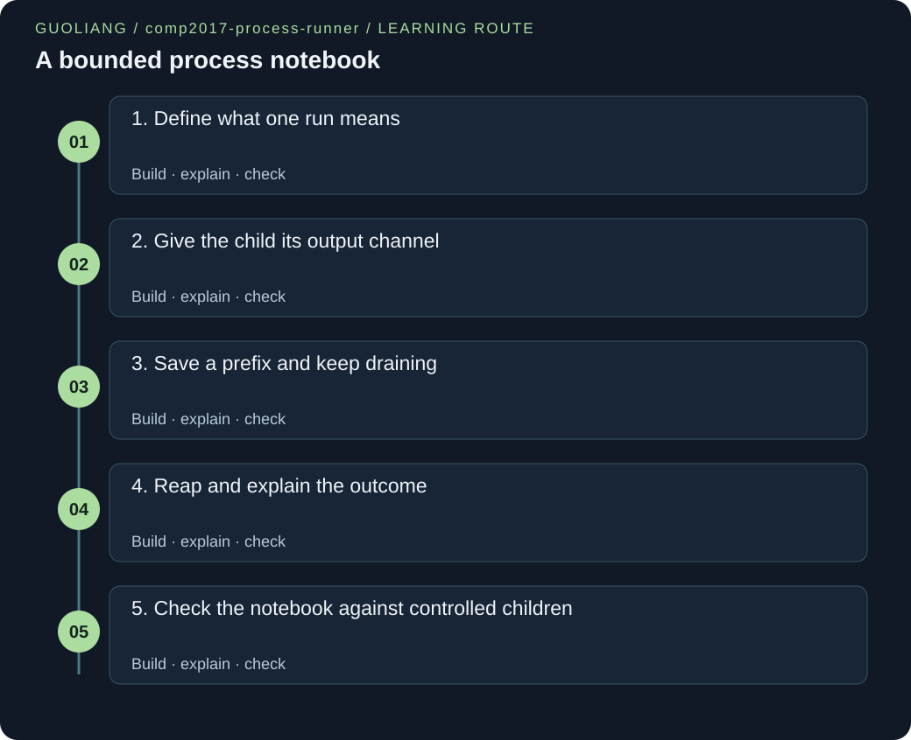

# COMP2017 — A bounded process notebook

> Guoliang | Original engineering workshop



[English](comp2017-process-runner.en.md) · [中文](comp2017-process-runner.zh.md)

Run one local program, retain a bounded stdout prefix, drain every remaining byte, and explain exactly how the child ended.

[Download the complete project ZIP](../site/downloads/comp2017-process-runner.zip)

## The story

Mei checks a sensor report before sharing it with her team. One checker prints a short success message; another prints pages of detail before returning an error. Copying terminal text loses the exit status, and saving every byte wastes memory. She builds a small notebook that keeps the first C bytes, says whether more arrived, and records the child outcome. Her first success is an echo with a space inside one argument. She then faces a full pipe, a missing executable, and a final line without a newline. By the end she can explain every descriptor, every captured byte, and the remaining limits of her tool. This is an original Guoliang learning project, independent of supplied course assignments.

### Before this project

- [Strings, bounded input and parsing](../site/courses/comp2017.html#strings-parsing): Read argv as an array of separate strings and validate decimal capacity without overflow.

- [Dynamic allocation and object lifetime](../site/courses/comp2017.html#allocation-ownership): The CLI allocates the buffer, lends it to the process module, then frees it exactly once.

- [Translation units, symbols and libraries](../site/courses/comp2017.html#compilation-linkage): Compile main.c and process.c together through the contract in process.h.

- [Processes, virtual memory and fork](../site/courses/comp2017.html#process-fork): fork returns in two processes with separate memory and copied descriptor tables.

- [Execute programs and reap children](../site/courses/comp2017.html#exec-wait): Replace the child program and collect its final status with waitpid.

- [Pipes, FIFO endpoints and byte framing](../site/courses/comp2017.html#pipes-fifos): Use pipe EOF and descriptor ownership to coordinate output and completion.

### Outcomes

- Preserve argument boundaries while executing a program with fork and execvp.

- Bound captured memory while draining enough output to let a child make progress.

- Separate EOF, successful wait, normal exit, signal termination, and runner failure.

- Test observable bytes and status codes without depending on process scheduling.

## Requirements and contracts

### Accept CAP -- PROGRAM [ARG ...], with CAP from 0 through 65536.

The memory budget must be explicit and validated before work starts.

Malformed, negative, huge, missing, and partially numeric capacities return 2 without a stdout report.

### Pass the existing argv slice directly to execvp.

Joining strings would erase argument boundaries and invite shell interpretation.

The fixture receives two words as one argument and $HOME;* as literal characters.

### Store at most CAP bytes; continue reading until EOF.

Stopping at the cap can leave the child blocked on a full pipe.

A 1 MiB burst completes with a cap of 8 or 0, and reports truncation.

### Capture stdout only; inherit stdin and stderr.

A single pipe keeps ownership visible and avoids pretending that two streams have one reliable order.

The stderr fixture produces an ok report and a separate diagnostic.

### Close unused descriptors, reap the direct child, and decode its wait status.

EOF requires every write end to close; termination still needs waitpid.

Normal exit 0, exit 7, missing program 127, and SIGTERM are reported distinctly.

### Display bytes with deterministic ASCII escapes.

A captured prefix may contain NUL, controls, or only part of a multibyte character.

NUL, 0xFF, quotes, backslash, tab, carriage return, and newline retain their byte identities.

## Architecture and ownership

**CLI and report: main.c**

Parse capacity, allocate the byte buffer, borrow argv, call the process module, escape the retained bytes, and return the child outcome.

**Process lifecycle: process.c / process.h**

Create a pipe and child, redirect child stdout, drain the parent read end, and reap exactly that child. The public result stores a byte count, a truncation flag, and raw wait status.

**Finite child: fixtures/child.c**

Generate controlled outputs and outcomes without files, descendants, input, sleeps, or network access. Burst mode writes exactly 256 blocks of 4096 bytes.

**Independent checks: test.py**

Compile a temporary copy and compare real output and return codes with literal expectations. Each runner has an 8-second watchdog and a private process group.

Validate → allocate → pipe → fork. Child: close read end → dup2(write end, 1) → close original write end → execvp. Parent: close write end → read to EOF → close read end → waitpid → escape and report → free. Parent and child run concurrently; there is no chosen schedule. Reads observe bytes already written, EOF follows closure of all writers and draining of queued bytes, and the final report follows a successful wait.

- Pipe read end → Parent after fork; child initially has a copy. → Child closes its copy before exec; parent closes after drain or read error.

- Original pipe write end → Both processes briefly after fork. → Parent closes immediately. Child closes after dup2 leaves stdout referring to the same pipe.

- Child stdout, descriptor 1 → Executed program and any descendants that inherit it. → Program close or process termination; every writer must close before EOF.

- Capture buffer and argument vector → main owns the allocation; process_run borrows it and the argv strings. → main frees the buffer on error or after the report; borrowed argv is never freed here.

- Direct child and termination status → Parent owns the responsibility to reap its returned PID. → waitpid retries EINTR and consumes termination status; read errors also attempt kill and reap.

<a id="milestone-contract"></a>

## 1. Define what one run means

Validate the command line and give the buffer one owner.

Mei chooses a byte budget before running a checker. A bounded decimal parser rejects overflow before multiplying; argv already supplies the required argument boundaries.

1. Build the complete project with make. Read process.h before following main.

2. Trace 65536 through parse_capacity, then see why 65537 and 8x are rejected.

3. Follow malloc, process_run(&argv[3], ...), and free. The process module must not free borrowed memory.

Teaching extract; run the complete project.

```c
static int parse_capacity(const char *text, size_t *capacity)
{
    size_t value = 0;
    if (*text == '\0') {
        return -1;
    }
    for (const char *p = text; *p != '\0'; ++p) {
        if (*p < '0' || *p > '9') {
            return -1;
        }
        size_t digit = (size_t)(*p - '0');
        if (value > (PROCESS_MAX_CAPTURE - digit) / 10) {
            return -1;
        }
        value = value * 10 + digit;
    }
    *capacity = value;
    return 0;
}
```

Extract from main.c, not a standalone program. digit is 0–9. The inequality value <= (MAX-digit)/10 ensures value*10+digit stays within the cap before computing it. Empty strings and any non-digit fail.

**Why pass &argv[3] instead of combining the remaining strings?**

It points to the program name followed by its existing arguments and the terminating NULL. Combining them would lose which spaces are inside an argument.

<a id="milestone-wire-child"></a>

## 2. Give the child its output channel

Replace child stdout with the pipe while preserving stdin and stderr.

fork copies descriptors, so both processes initially hold both ends. Descriptor 1 must refer to the pipe in the child before exec changes the running program.

1. Draw two descriptor tables immediately after fork. Each has a read end and a write end.

2. In the child, close the read copy, dup2 the write copy onto descriptor 1, then close the original write descriptor.

3. Call execvp with the unchanged argument vector. On failure, write a fixed stderr diagnostic and call _exit(127).

Teaching extract; run the complete project.

```c
static void execute_child(int read_end, int write_end, char *const argv[])
{
    static const char setup_error[] = "process_runner: stdout setup failed\n";
    static const char exec_error[] = "process_runner: execvp failed\n";
    (void)close(read_end);
    int copied;
    do {
        copied = dup2(write_end, STDOUT_FILENO);
    } while (copied == -1 && errno == EINTR);
    if (copied == -1) {
        (void)close(write_end);
        child_failure(setup_error, sizeof(setup_error) - 1, 126);
    }
    (void)close(write_end);
    /* The original argument boundaries survive; no command string is built. */
    execvp(argv[0], argv);
    child_failure(exec_error, sizeof(exec_error) - 1, 127);
}
```

Extract from process.c. The caller verifies descriptors 0–2 are open, so the new pipe descriptors exceed 2. dup2 makes stdout another reference to the write end; closing the original does not close stdout. Successful exec never returns. _exit skips copied stdio buffers and atexit callbacks.

**Does closing the original write descriptor destroy the child output connection?**

No. Descriptor 1 still refers to the pipe after successful dup2. That reference survives exec and closes when the program closes it or exits.

<a id="milestone-drain-bound"></a>

## 3. Save a prefix and keep draining

Handle empty, exact-limit, over-limit, and newline-free output with bounded memory.

The pipe has finite kernel capacity too. If Mei stops reading after filling her buffer and then waits, a verbose child may be waiting for pipe space. Both sides would wait forever.

1. For each positive read, compute space = capacity - captured and keep = min(count, space).

2. Copy only keep bytes. Set truncated only when some actual bytes do not fit; reaching the cap alone is not truncation.

3. Continue reading until zero means EOF. Retry EINTR; a final fragment is data even without a newline.

Teaching extract; run the complete project.

```c
static int drain_output(int read_end, unsigned char *buffer, size_t capacity,
                        struct process_result *result)
{
    unsigned char chunk[4096];
    for (;;) {
        ssize_t received = read(read_end, chunk, sizeof(chunk));
        if (received == -1 && errno == EINTR) {
            continue;
        }
        if (received == -1) {
            return -1;
        }
        if (received == 0) {
            return 0;
        }
        size_t count = (size_t)received;
        size_t space = capacity - result->captured;
        size_t keep = count < space ? count : space;
        if (keep > 0) {
            memcpy(buffer + result->captured, chunk, keep);
            result->captured += keep;
        }
        if (keep < count) {
            result->truncated = true;
        }
        /* A full buffer stops copying, never reading. The child must progress. */
    }
}
```

Extract from process.c. The invariant is 0 <= captured <= capacity. Each read can be short; one write need not match one read. N bytes of child output require O(N) draining work, while storage is O(C+4096) for cap C. No total-discarded-byte counter can overflow.

**The child emits tail, exactly four bytes. What changes between caps 4, 3, and 0?**

Cap 4 retains tail with truncated=no. Cap 3 retains tai with truncated=yes. Cap 0 retains nothing with truncated=yes. All three still drain the same four bytes.

<a id="milestone-reap-report"></a>

## 4. Reap and explain the outcome

Finish descriptor cleanup and distinguish normal exit from signal termination.

EOF does not prove a child has terminated: it can close stdout and continue running. Conversely, a descendant can hold the pipe open after the direct child ends. Mei needs waitpid as a second completion check.

1. Close the parent write end before draining; otherwise the parent itself prevents EOF.

2. After draining, close the read end and wait for the specific child PID. Retry waitpid only when errno is EINTR.

3. Use wait macros, print the escaped byte prefix and status, then free the buffer. On read failure, kill the direct child and still attempt to reap it.

Teaching extract; run the complete project.

```c
static int report(const unsigned char *data, const struct process_result *result)
{
    print_bytes(data, result->captured);
    printf("captured_bytes=%zu\ntruncated=%s\n", result->captured,
           result->truncated ? "yes" : "no");
    if (WIFEXITED(result->wait_status)) {
        int code = WEXITSTATUS(result->wait_status);
        printf("child_exit=%d\n", code);
        return code;
    }
    if (WIFSIGNALED(result->wait_status)) {
        int number = WTERMSIG(result->wait_status);
        printf("child_signal=%d\n", number);
        return 128 + number;
    }
    fputs("process_runner: unexpected wait status\n", stderr);
    return 125;
}
```

Extract from main.c. WEXITSTATUS is used only after WIFEXITED; WTERMSIG only after WIFSIGNALED. The raw wait integer is not itself the exit code. Normal exit returns the child code; a signal is displayed separately and maps to 128+signal on supported systems.

**Is child_exit=127 enough to prove execvp failed?**

No. The selected program could return 127 itself. This project adds a fixed stderr message on exec failure, but has no separate exec-error protocol. An extra close-on-exec error pipe is a possible extension.

<a id="milestone-test-boundaries"></a>

## 5. Check the notebook against controlled children

Verify bytes, truncation, stderr policy, and status without assuming scheduling.

A real child is a better check than inspecting source text. The synthetic helper produces finite, known behavior, so Mei can compute expectations independently and place a watchdog around the whole run.

1. Run make test. It builds a temporary copy with strict warnings and invokes only the local fixture, /bin/echo, and a deliberately missing path.

2. Compare exact output, byte counts, child status, and separate stderr. The burst is 256*4096=1048576 bytes regardless of read chunk sizes.

3. Test zero, exact and over-limit caps, literal metacharacters, nonzero exit, signal exit, binary escapes, and missing programs. Timeouts clean up only the private test process group.

Teaching extract; run the complete project.

```c
int main(int argc, char **argv)
{
    if (argc < 2) {
        return 2;
    }
    if (strcmp(argv[1], "args") == 0) {
        for (int i = 2; i < argc; ++i) {
            printf("[%s]", argv[i]);
        }
    } else if (strcmp(argv[1], "burst") == 0) {
        char block[4096];
        memset(block, 'A', sizeof(block));
        for (int i = 0; i < 256; ++i) {
            if (fwrite(block, 1, sizeof(block), stdout) != sizeof(block)) {
                return 3;
            }
        }
    } else if (strcmp(argv[1], "fragment") == 0) {
        fputs("tail", stdout);
    } else if (strcmp(argv[1], "fail") == 0) {
        puts("check failed");
        return 7;
    } else if (strcmp(argv[1], "stderr") == 0) {
        fputs("diagnostic\n", stderr);
        puts("ok");
    } else if (strcmp(argv[1], "bytes") == 0) {
        const unsigned char bytes[] = {0, 255, '"', '\\', '\t', '\r', '\n'};
        if (fwrite(bytes, 1, sizeof(bytes), stdout) != sizeof(bytes)) {
            return 3;
        }
    } else if (strcmp(argv[1], "signal") == 0) {
        (void)raise(SIGTERM);
        return 3;
    } else if (strcmp(argv[1], "empty") != 0) {
        return 2;
    }
    return fflush(stdout) == 0 ? 0 : 3;
}
```

Extract from fixtures/child.c, a separate bounded executable used by the tests. The helper neither forks nor reads stdin. Its burst is finite, its fail mode returns 7, and fragment omits the newline. These examples test this project and are not supplied assignment solutions.

**What does the successful burst test prove, and what does it leave unproved?**

It shows that this run drained a finite large stream while retaining only the cap and reaped the child. It does not prove every schedule, forced EINTR/error path, descendant cleanup, or a production timeout policy.

## Build and run

Use Clang with C11 support, make and Python 3 on macOS or Linux. On Windows use a Linux environment such as WSL. The supplied Makefiles use Clang. Open a terminal in the download directory. Unzip the archive, then enter its folder. make builds the executable; make test checks its behavior.

```sh
unzip comp2017-process-runner.zip
cd comp2017-process-runner
make
make test
```

### A first run with one space argument

```sh
./process_runner 32 -- /bin/echo 'hello team'
```

```text
stdout="hello team\n"
captured_bytes=11
truncated=no
child_exit=0
```

Exit status: 0


The shell quotes create one hello team argument before the runner starts. The child writes 11 bytes including the newline. The runner returns 0 after EOF and waitpid.

### A megabyte through an eight-byte budget

```sh
./process_runner 8 -- ./fixture_child burst
```

```text
stdout="AAAAAAAA"
captured_bytes=8
truncated=yes
child_exit=0
```

Exit status: 0


The helper writes 1,048,576 A bytes. Only eight are retained, but all remaining output is drained so the child can finish. Truncation does not make the child fail: the runner returns 0.

### A checker that reports failure

```sh
./process_runner 32 -- ./fixture_child fail
```

```text
stdout="check failed\n"
captured_bytes=13
truncated=no
child_exit=7
```

Exit status: 7


The 13-byte message is complete, yet the child exits with 7. The runner returns 7 too. Successful capture and a successful child are different claims.

### A missing executable still has a lifecycle

```sh
./process_runner 16 -- ./absent-program
```

```text
stdout=""
captured_bytes=0
truncated=no
child_exit=127
```

Exit status: 127


The child writes process_runner: execvp failed plus a newline to inherited stderr (not shown in the stdout block), then calls _exit(127). The parent sees EOF, reaps it, and returns 127. A real program could also return 127, so the status alone is ambiguous.

### Exactly full without a final newline

```sh
./process_runner 4 -- ./fixture_child fragment
```

```text
stdout="tail"
captured_bytes=4
truncated=no
child_exit=0
```

Exit status: 0


tail is exactly four bytes. No byte is discarded, so truncated=no even though capacity is full. A newline is not needed to finish a byte stream. The runner returns 0.

### Literal spaces and shell metacharacters

```sh
./process_runner 64 -- ./fixture_child args 'two words' '$HOME;*'
```

```text
stdout="[two words][$HOME;*]"
captured_bytes=20
truncated=no
child_exit=0
```

Exit status: 0


The fixture surrounds each argument with brackets. The 20-byte result shows that two words stayed together and $HOME;* stayed literal. The runner returns 0; it never formed a command string.

## Debugging

### A large-output command never finishes.

The parent waited before draining, or stopped reading at the capture limit.

Run the finite burst with cap 8 under make test; inspect whether every positive read leads back to read.

Drain to EOF even when keep becomes zero; only then call waitpid.

### The child exits, but EOF never appears.

The parent retained its write end, or another process inherited a writer.

Draw every write descriptor in both processes; check the parent close immediately after fork.

Close the unused parent write end. A descendant-held writer requires a future process-tree policy.

### The four-byte output tail is reported as truncated at cap 4.

The code treats full capacity as proof of discarded data.

Compare fragment at cap 4 and cap 3; only the latter loses a byte.

Set truncated only when keep < count for an actual positive read.

### The reported exit code looks like 1792 instead of 7.

The code printed raw wait status as the exit code.

Run the fail fixture and inspect the WIFEXITED guard before WEXITSTATUS.

Decode with the wait macros; check signal termination in a separate branch.

### The output after a NUL byte disappears.

A string routine such as strlen was used on raw captured bytes.

Run the bytes fixture: all seven bytes must remain visible as characters or escapes.

Iterate to result.captured, use unsigned char, and escape bytes individually.

### A space argument becomes two arguments or $HOME expands.

The invocation was not quoted at the outer shell, or a command string was introduced.

Use the args fixture and single-quote the literal values in a terminal command.

Preserve the received argv vector in the runner; use shell quoting only to construct the initial arguments.

## Test plan

### One argument containing a space

echo prints hello team plus newline: 11 bytes, exit 0.

Detects accidental splitting and newline loss.

### Literal $HOME;* argument

The args fixture prints [two words][$HOME;*]: 20 bytes.

Detects command-string construction or expansion.

### 1 MiB burst with caps 8, 0, and 65536

Keep exactly the cap, report truncated=yes, and exit 0 before the watchdog.

Tests progress after capacity is exhausted, including the two limit endpoints.

### Empty output at cap 0

Keep zero bytes with truncated=no, exit 0.

A zero-size budget is not itself evidence of lost data.

### Final fragment tail at caps 4 and 3

Retain tail/no and tai/yes respectively, without requiring a newline.

Separates exact capacity from overflow and byte streams from lines.

### A checker returns 7

Capture check failed plus newline, print child_exit=7, return 7.

Runner success must not erase the child failure status.

### Missing local executable

Empty capture, fixed execvp stderr diagnostic, child_exit=127, return 127.

Exercises the child _exit path and parent EOF/wait lifecycle.

### Child stderr and binary stdout

stderr stays separate; the bytes fixture reports all seven bytes with reversible escapes.

Prevents stream mixing, NUL truncation, and raw terminal-control output.

### Child terminates itself with SIGTERM

Report child_signal using the platform signal number; return 128 plus that number.

Exercises a different wait-status branch without timing assumptions.

### Malformed CLI, negative or excessive cap, missing program

Return 2 with usage on stderr and no stdout report.

Checks rejection before allocation/fork and guards numeric overflow.

## Engineering decisions

### A byte budget is not a time budget

Stored bytes=min(N,C); truncated=(N>C). Draining remains O(N) and memory O(C+4096). No timeout or process-tree control exists. A child waiting on input, a descendant keeping stdout open, a blocked stderr sink, or a child that never exits can stall the run. The test watchdog belongs to test.py, not the runner.

### Two output streams, one capture

stdout is captured and displayed after completion. stdin and stderr are inherited, and stderr can appear before the later stdout report without defining a merged order. Bytes use ASCII escapes rather than Unicode decoding; a cap may split a UTF-8 sequence, but its retained bytes remain visible. This is not a raw binary-copy tool.

### No command string is constructed

argv boundaries remain intact. A bare program name uses inherited PATH; an explicit path selects more predictably. POSIX execvp can invoke an interpreter for an executable text file in an unrecognized format. That fallback interprets the file, not a newly joined argument string. The program inherits authority, directory, environment, and unrelated non-close-on-exec descriptors; it is not a sandbox.

### Status codes have deliberate limits

Normal child exit codes pass through. Signals are displayed separately and map to 128+N. CLI errors return 2, handled runner errors 125, child setup errors 126, and exec failures 127. A child can return any of those codes itself. No exec-error pipe exists, so 127 alone cannot identify exec failure. Fixed child diagnostics remain separate on stderr.

### Small POSIX scope, explicit cleanup

The module assumes one thread, open descriptors 0–2, blocking I/O, default SIGCHLD handling, and no competing reaper. read/waitpid/dup2/child diagnostic write retry EINTR. On read error, cleanup kills only the direct child and attempts to reap it. close is best effort without retry; cross-platform recovery from interrupted close is omitted. There is no application signal handler, forwarding, or user-cancel policy. An interrupted runner can leave a child; a broken report pipe can cause default SIGPIPE termination.

## Complete source files

### README.md

English build and engineering guide

[Download file](../projects/comp2017-process-runner/README.md)

1. Start with the four real command examples and their exit semantics.

2. Follow the five milestones and descriptor ownership table.

3. Read the limits before using a program outside the finite fixtures.

### README.zh.md

Complete Chinese companion guide

[Download file](../projects/comp2017-process-runner/README.zh.md)

1. Use the same build, run, test, and clean commands.

2. Trace EOF and wait as two distinct conditions.

3. Check the Chinese explanation of signals, exec fallback, and inherited resources.

### process.h

Public data and ownership contract

[Download file](../projects/comp2017-process-runner/process.h)

```c
/* Guoliang | Original teaching project. */
#ifndef GUOLIANG_PROCESS_H
#define GUOLIANG_PROCESS_H

#include <stdbool.h>
#include <stddef.h>

#define PROCESS_MAX_CAPTURE 65536U

struct process_result {
    size_t captured;
    bool truncated;
    int wait_status;
};

/* Synchronous, single-threaded caller; standard descriptors 0, 1, 2 must be open.
 * argv is a nonempty, NULL-terminated argument vector, borrowed for this call.
 * buffer belongs to the caller and holds at least capacity bytes (0 is valid).
 * Return 0 after reaping the direct child, even if it failed. On -1, errno
 * describes a runner error; do not consume result. No timeout is provided. */
int process_run(char *const argv[], unsigned char *buffer, size_t capacity,
                struct process_result *result);

#endif
```

1. Read the cap limit and three fields in process_result.

2. Observe that the buffer and argv are borrowed rather than transferred.

3. Return 0 means the child was reaped, even when its own exit was nonzero.

### main.c

CLI validation, byte display, and exit-code mapping

[Download file](../projects/comp2017-process-runner/main.c)

```c
/* Guoliang | Original teaching project. */
#include "process.h"

#include <stdio.h>
#include <stdlib.h>
#include <string.h>
#include <sys/wait.h>

static int parse_capacity(const char *text, size_t *capacity)
{
    size_t value = 0;
    if (*text == '\0') {
        return -1;
    }
    for (const char *p = text; *p != '\0'; ++p) {
        if (*p < '0' || *p > '9') {
            return -1;
        }
        size_t digit = (size_t)(*p - '0');
        if (value > (PROCESS_MAX_CAPTURE - digit) / 10) {
            return -1;
        }
        value = value * 10 + digit;
    }
    *capacity = value;
    return 0;
}

/* A byte view: no strlen on captured data, and no raw terminal controls. */
static void print_bytes(const unsigned char *data, size_t length)
{
    fputs("stdout=\"", stdout);
    for (size_t i = 0; i < length; ++i) {
        unsigned char byte = data[i];
        switch (byte) {
        case '\n': fputs("\\n", stdout); break;
        case '\r': fputs("\\r", stdout); break;
        case '\t': fputs("\\t", stdout); break;
        case '\\': fputs("\\\\", stdout); break;
        case '"': fputs("\\\"", stdout); break;
        default:
            if (byte >= 32 && byte <= 126) {
                putchar((int)byte);
            } else {
                printf("\\x%02X", (unsigned int)byte);
            }
        }
    }
    puts("\"");
}

static int report(const unsigned char *data, const struct process_result *result)
{
    print_bytes(data, result->captured);
    printf("captured_bytes=%zu\ntruncated=%s\n", result->captured,
           result->truncated ? "yes" : "no");
    if (WIFEXITED(result->wait_status)) {
        int code = WEXITSTATUS(result->wait_status);
        printf("child_exit=%d\n", code);
        return code;
    }
    if (WIFSIGNALED(result->wait_status)) {
        int number = WTERMSIG(result->wait_status);
        printf("child_signal=%d\n", number);
        return 128 + number;
    }
    fputs("process_runner: unexpected wait status\n", stderr);
    return 125;
}

int main(int argc, char **argv)
{
    size_t capacity;
    if (argc < 4 || strcmp(argv[2], "--") != 0 || argv[3][0] == '\0' ||
        parse_capacity(argv[1], &capacity) == -1) {
        fputs("usage: process_runner CAP -- PROGRAM [ARG ...]\n"
              "CAP must be decimal digits from 0 to 65536.\n", stderr);
        return 2;
    }
    unsigned char *data = malloc(capacity > 0 ? capacity : 1);
    if (data == NULL) {
        fputs("process_runner: allocation failed\n", stderr);
        return 125;
    }
    struct process_result result;
    if (process_run(&argv[3], data, capacity, &result) == -1) {
        perror("process_runner");
        free(data);
        return 125;
    }
    int code = report(data, &result);
    free(data);
    if (fflush(stdout) == EOF || ferror(stdout)) {
        fputs("process_runner: report write failed\n", stderr);
        return 125;
    }
    return code;
}
```

1. parse_capacity rejects malformed and out-of-range input before allocation.

2. print_bytes uses a byte count rather than strlen, preserving embedded NUL.

3. report decodes wait status; main frees the allocation on handled paths and checks the final stdout flush.

### process.c

Pipe setup, fork/exec, continuous drain, and wait

[Download file](../projects/comp2017-process-runner/process.c)

```c
/* Guoliang | Original teaching project. */
#include "process.h"

#include <errno.h>
#include <fcntl.h>
#include <signal.h>
#include <string.h>
#include <sys/types.h>
#include <sys/wait.h>
#include <unistd.h>

/* Child failure: no stdio flushing or parent atexit handlers after fork. */
static void child_failure(const char *message, size_t length, int code)
{
    while (length > 0) {
        ssize_t sent = write(STDERR_FILENO, message, length);
        if (sent < 0 && errno == EINTR) {
            continue;
        }
        if (sent <= 0) {
            break;
        }
        message += (size_t)sent;
        length -= (size_t)sent;
    }
    _exit(code);
}

static void execute_child(int read_end, int write_end, char *const argv[])
{
    static const char setup_error[] = "process_runner: stdout setup failed\n";
    static const char exec_error[] = "process_runner: execvp failed\n";
    (void)close(read_end);
    int copied;
    do {
        copied = dup2(write_end, STDOUT_FILENO);
    } while (copied == -1 && errno == EINTR);
    if (copied == -1) {
        (void)close(write_end);
        child_failure(setup_error, sizeof(setup_error) - 1, 126);
    }
    (void)close(write_end);
    /* The original argument boundaries survive; no command string is built. */
    execvp(argv[0], argv);
    child_failure(exec_error, sizeof(exec_error) - 1, 127);
}

static int drain_output(int read_end, unsigned char *buffer, size_t capacity,
                        struct process_result *result)
{
    unsigned char chunk[4096];
    for (;;) {
        ssize_t received = read(read_end, chunk, sizeof(chunk));
        if (received == -1 && errno == EINTR) {
            continue;
        }
        if (received == -1) {
            return -1;
        }
        if (received == 0) {
            return 0;
        }
        size_t count = (size_t)received;
        size_t space = capacity - result->captured;
        size_t keep = count < space ? count : space;
        if (keep > 0) {
            memcpy(buffer + result->captured, chunk, keep);
            result->captured += keep;
        }
        if (keep < count) {
            result->truncated = true;
        }
        /* A full buffer stops copying, never reading. The child must progress. */
    }
}

int process_run(char *const argv[], unsigned char *buffer, size_t capacity,
                struct process_result *result)
{
    if (argv == NULL || argv[0] == NULL || argv[0][0] == '\0' ||
        result == NULL || capacity > PROCESS_MAX_CAPTURE ||
        (capacity > 0 && buffer == NULL)) {
        errno = EINVAL;
        return -1;
    }
    /* Keeps both pipe descriptors above 2, so dup2/close ownership is simple. */
    for (int fd = STDIN_FILENO; fd <= STDERR_FILENO; ++fd) {
        if (fcntl(fd, F_GETFD) == -1) {
            return -1;
        }
    }
    *result = (struct process_result){0, false, 0};
    int channel[2];
    if (pipe(channel) == -1) {
        return -1;
    }
    pid_t child = fork();
    if (child == -1) {
        int saved = errno;
        (void)close(channel[0]);
        (void)close(channel[1]);
        errno = saved;
        return -1;
    }
    if (child == 0) {
        execute_child(channel[0], channel[1], argv);
    }
    /* Parent owns only the read end. Keeping any write end would prevent EOF. */
    (void)close(channel[1]);
    int failure = 0;
    if (drain_output(channel[0], buffer, capacity, result) == -1) {
        failure = errno;
        /* On a read error, abort our direct child before trying to reap it. */
        (void)kill(child, SIGKILL);
    }
    (void)close(channel[0]);
    pid_t waited;
    do {
        waited = waitpid(child, &result->wait_status, 0);
    } while (waited == -1 && errno == EINTR);
    if (waited == -1 && failure == 0) {
        failure = errno;
    }
    if (failure != 0) {
        errno = failure;
        return -1;
    }
    return 0;
}
```

1. Check standard descriptors, then create the pipe before fork so both processes can refer to it.

2. Separate execute_child from drain_output so descriptor ownership is easy to trace.

3. Save errno before cleanup, retry EINTR where appropriate, and attempt to reap even after a read error.

### fixtures/child.c

Finite synthetic output and status generator

[Download file](../projects/comp2017-process-runner/fixtures/child.c)

```c
/* Guoliang | Original teaching project. */
#include <signal.h>
#include <stdio.h>
#include <string.h>

/* Synthetic, finite output only: no files, descendants, input, or sleeps. */
int main(int argc, char **argv)
{
    if (argc < 2) {
        return 2;
    }
    if (strcmp(argv[1], "args") == 0) {
        for (int i = 2; i < argc; ++i) {
            printf("[%s]", argv[i]);
        }
    } else if (strcmp(argv[1], "burst") == 0) {
        char block[4096];
        memset(block, 'A', sizeof(block));
        for (int i = 0; i < 256; ++i) {
            if (fwrite(block, 1, sizeof(block), stdout) != sizeof(block)) {
                return 3;
            }
        }
    } else if (strcmp(argv[1], "fragment") == 0) {
        fputs("tail", stdout);
    } else if (strcmp(argv[1], "fail") == 0) {
        puts("check failed");
        return 7;
    } else if (strcmp(argv[1], "stderr") == 0) {
        fputs("diagnostic\n", stderr);
        puts("ok");
    } else if (strcmp(argv[1], "bytes") == 0) {
        const unsigned char bytes[] = {0, 255, '"', '\\', '\t', '\r', '\n'};
        if (fwrite(bytes, 1, sizeof(bytes), stdout) != sizeof(bytes)) {
            return 3;
        }
    } else if (strcmp(argv[1], "signal") == 0) {
        (void)raise(SIGTERM);
        return 3;
    } else if (strcmp(argv[1], "empty") != 0) {
        return 2;
    }
    return fflush(stdout) == 0 ? 0 : 3;
}
```

1. args surrounds each argument with brackets so spaces remain visible.

2. burst writes 256 fixed blocks; empty and fragment probe EOF without line assumptions.

3. fail, stderr, bytes, and signal isolate distinct observable behaviors.

### test.py

Fourteen real-process regression tests

[Download file](../projects/comp2017-process-runner/test.py)

```python
#!/usr/bin/env python3
# Guoliang | Original teaching project.
"""Build a temporary copy and exercise only bounded, local fixture programs."""
import os
from pathlib import Path
import shutil
import signal
import subprocess
import tempfile
import unittest

SOURCE = Path(__file__).resolve().parent


class RunnerTests(unittest.TestCase):
    @classmethod
    def setUpClass(cls):
        cls.temp = tempfile.TemporaryDirectory(prefix="guoliang-process-test-")
        cls.addClassCleanup(cls.temp.cleanup)
        cls.work = Path(cls.temp.name)
        for name in ("main.c", "process.c", "process.h", "Makefile"):
            shutil.copy2(SOURCE / name, cls.work / name)
        shutil.copytree(SOURCE / "fixtures", cls.work / "fixtures")
        built = subprocess.run(["make", "all"], cwd=cls.work, text=True,
                               capture_output=True, timeout=30, check=False)
        if built.returncode:
            raise AssertionError(built.stdout + built.stderr)

    def run_runner(self, *args):
        # A new group lets a timeout clean up both runner and its own child.
        child = subprocess.Popen(["./process_runner", *args], cwd=self.work,
                                 stdin=subprocess.DEVNULL, stdout=subprocess.PIPE,
                                 stderr=subprocess.PIPE, start_new_session=True)
        try:
            out, err = child.communicate(timeout=8)
        except subprocess.TimeoutExpired:
            os.killpg(child.pid, signal.SIGKILL)
            child.communicate()
            self.fail("bounded fixture timed out; possible pipe/wait deadlock")
        return child.returncode, out.decode("ascii"), err.decode("ascii")

    def test_echo_and_literal_space_argument(self):
        # Catches splitting one argument or losing the trailing newline.
        self.assertEqual(self.run_runner("32", "--", "/bin/echo", "hello team"),
                         (0, 'stdout="hello team\\n"\ncaptured_bytes=11\n'
                          'truncated=no\nchild_exit=0\n', ""))

    def test_metacharacters_are_arguments(self):
        # No shell may expand the dollar sign, wildcard, or semicolon.
        self.assertEqual(self.run_runner("64", "--", "./fixture_child", "args",
                                        "two words", "$HOME;*"),
                         (0, 'stdout="[two words][$HOME;*]"\ncaptured_bytes=20\n'
                          'truncated=no\nchild_exit=0\n', ""))

    def test_large_output_is_drained_after_cap(self):
        self.assertEqual(self.run_runner("8", "--", "./fixture_child", "burst"),
                         (0, 'stdout="AAAAAAAA"\ncaptured_bytes=8\n'
                          'truncated=yes\nchild_exit=0\n', ""))

    def test_zero_cap_still_drains(self):
        self.assertEqual(self.run_runner("0", "--", "./fixture_child", "burst"),
                         (0, 'stdout=""\ncaptured_bytes=0\n'
                          'truncated=yes\nchild_exit=0\n', ""))

    def test_empty_output_is_not_truncation(self):
        self.assertEqual(self.run_runner("0", "--", "./fixture_child", "empty"),
                         (0, 'stdout=""\ncaptured_bytes=0\n'
                          'truncated=no\nchild_exit=0\n', ""))

    def test_exact_cap_and_final_fragment(self):
        self.assertEqual(self.run_runner("4", "--", "./fixture_child", "fragment"),
                         (0, 'stdout="tail"\ncaptured_bytes=4\n'
                          'truncated=no\nchild_exit=0\n', ""))

    def test_one_byte_over_cap(self):
        self.assertEqual(self.run_runner("3", "--", "./fixture_child", "fragment"),
                         (0, 'stdout="tai"\ncaptured_bytes=3\n'
                          'truncated=yes\nchild_exit=0\n', ""))

    def test_nonzero_child_status_is_returned(self):
        self.assertEqual(self.run_runner("32", "--", "./fixture_child", "fail"),
                         (7, 'stdout="check failed\\n"\ncaptured_bytes=13\n'
                          'truncated=no\nchild_exit=7\n', ""))

    def test_missing_program_is_reaped(self):
        self.assertEqual(self.run_runner("16", "--", "./absent-program"),
                         (127, 'stdout=""\ncaptured_bytes=0\n'
                          'truncated=no\nchild_exit=127\n',
                          "process_runner: execvp failed\n"))

    def test_stderr_is_inherited_not_captured(self):
        self.assertEqual(self.run_runner("16", "--", "./fixture_child", "stderr"),
                         (0, 'stdout="ok\\n"\ncaptured_bytes=3\n'
                          'truncated=no\nchild_exit=0\n', "diagnostic\n"))

    def test_byte_escaping_is_lossless_for_the_prefix(self):
        self.assertEqual(self.run_runner("16", "--", "./fixture_child", "bytes"),
                         (0, 'stdout="\\x00\\xFF\\\"\\\\\\t\\r\\n"\ncaptured_bytes=7\n'
                          'truncated=no\nchild_exit=0\n', ""))

    def test_signal_status_is_reported(self):
        code, out, err = self.run_runner("16", "--", "./fixture_child", "signal")
        self.assertEqual(code, 128 + signal.SIGTERM)
        self.assertEqual(out, 'stdout=""\ncaptured_bytes=0\ntruncated=no\n'
                             f'child_signal={signal.SIGTERM}\n')
        self.assertEqual(err, "")

    def test_maximum_cap(self):
        code, out, err = self.run_runner("65536", "--", "./fixture_child", "burst")
        self.assertEqual(code, 0)
        self.assertEqual(out, 'stdout="' + "A" * 65536 + '"\ncaptured_bytes=65536\n'
                             'truncated=yes\nchild_exit=0\n')
        self.assertEqual(err, "")

    def test_bad_cli_never_starts_a_child(self):
        cases = [(), ("8", "--"), ("8", "--", ""),
                 ("-1", "--", "./fixture_child", "empty"),
                 ("65537", "--", "./fixture_child", "empty"),
                 ("8x", "--", "./fixture_child", "empty"),
                 (" 8", "--", "./fixture_child", "empty"),
                 ("9999999999999999999999999", "--", "./fixture_child", "empty"),
                 ("8", "wrong", "./fixture_child", "empty")]
        for args in cases:
            with self.subTest(args=args):
                code, out, err = self.run_runner(*args)
                self.assertEqual(code, 2)
                self.assertEqual(out, "")
                self.assertEqual(err, "usage: process_runner CAP -- PROGRAM [ARG ...]\n"
                                     "CAP must be decimal digits from 0 to 65536.\n")


if __name__ == "__main__":
    unittest.main(verbosity=2)
```

1. Copy only project inputs into TemporaryDirectory and compile there.

2. Popen uses an argument list, DEVNULL stdin, separate output pipes, a new session, and an 8-second watchdog.

3. Assertions compare real stdout, stderr, and return codes with hand-derived expectations; timeout kills only the test group.

### Makefile

Strict, repeatable all/test/clean entry points

[Download file](../projects/comp2017-process-runner/Makefile)

```make
# Guoliang | Original teaching project.
CC = clang
CFLAGS = -std=c11 -Wall -Wextra -Werror -pedantic -pthread
CPPFLAGS = -D_POSIX_C_SOURCE=200809L

.PHONY: all test clean
all: process_runner fixture_child

process_runner: main.c process.c process.h
	$(CC) $(CPPFLAGS) $(CFLAGS) main.c process.c -o $@

fixture_child: fixtures/child.c
	$(CC) $(CPPFLAGS) $(CFLAGS) fixtures/child.c -o $@

test:
	python3 test.py

clean:
	rm -f process_runner fixture_child
```

1. all compiles the runner and independent fixture helper.

2. C11, POSIX feature declarations, warnings, and Werror are explicit.

3. test invokes Python; clean removes only the two generated executables.

## Extensions

### Add a distinct exec-error channel

Create a second pipe with close-on-exec on the child write end. Successful exec closes it automatically; a failed exec writes a small errno record before _exit. Preserve ownership and complete both error and stdout reads.

Distinguish a real program returning 127 from failure to execute a missing path, with both children reaped and no descriptor leaks.

### Design deadlines and cancellation as a separate feature

Specify process-group ownership, monotonic deadlines, poll-based draining, a termination grace period, final forced cleanup, and a policy for descendants and caller signals before coding. Use only finite owned fixtures while developing.

A controlled child exceeding its budget yields a timeout outcome within a bounded interval; all owned children are reaped, pipes close, and retained output remains correct. Tests must not assert exact scheduling times.

## Primary references

- [The Open Group: POSIX fork](https://pubs.opengroup.org/onlinepubs/9799919799/functions/fork.html)

- [The Open Group: POSIX exec family](https://pubs.opengroup.org/onlinepubs/9799919799/functions/exec.html)

- [The Open Group: POSIX pipe](https://pubs.opengroup.org/onlinepubs/9799919799/functions/pipe.html)

- [The Open Group: POSIX read](https://pubs.opengroup.org/onlinepubs/9799919799/functions/read.html)

- [The Open Group: POSIX wait and waitpid](https://pubs.opengroup.org/onlinepubs/9699919799/functions/wait.html)

- [The Open Group: POSIX dup and dup2](https://pubs.opengroup.org/onlinepubs/9799919799/functions/dup.html)

- [The Open Group: POSIX _Exit and _exit](https://pubs.opengroup.org/onlinepubs/9799919799/functions/_exit.html)

---
Guoliang
