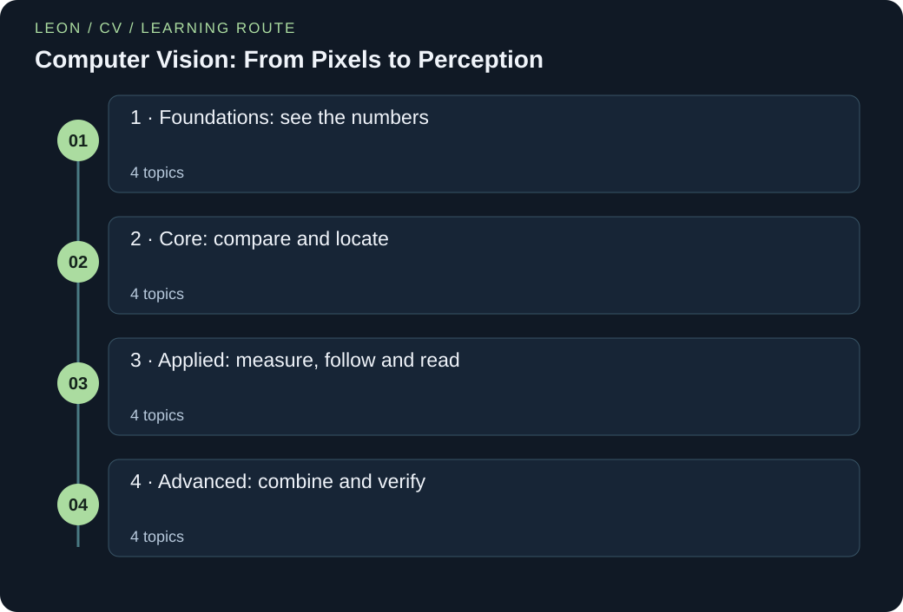

# Computer Vision: From Pixels to Perception

> Guoliang | AI Field Guides

[EN](AI-CV.en.md) · [中文](AI-CV.zh.md)



Sixteen connected lessons start with pixels and simple Python lists, then build toward recognition, detection, tracking, OCR and reliable image systems. Every lesson includes a story, explained arithmetic, runnable code, answered questions and two practice cases.

### Run the Python examples

Use Python 3.12 or newer. Save the code as a .py file. In a terminal, run `python filename.py`; some systems use `python3`. If the code contains `import numpy as np`, first run `python -m pip install numpy`. The import loads NumPy, a package for numeric arrays, and gives it the short name np. No dataset or model-weight downloads are needed.

[Official Python downloads](https://www.python.org/downloads/) · [Official NumPy installation guide](https://numpy.org/install/)

## A route through the ideas

An original conceptual companion to official OpenCV and PyTorch materials, Stanford teaching and foundational vision research. Examples use synthetic numbers; this is a connected introduction, not a reproduction of a particular course or a production deployment manual.

### Before you start

- High-school arithmetic: addition, multiplication, fractions and coordinates
- Start with the shared Python primer if lists, loops or indexing are new
- No linear algebra, calculus or deep-learning framework is assumed

### What you will learn

- Trace an image through shape, scale and coordinate changes
- Choose classification, detection or segmentation for the actual question
- Read a convolution or patch model with explicit dimensions
- Evaluate performance without leaking related images

## Knowledge framework

### 1 · Foundations: see the numbers

- [Pixels are measurements with a contract](#pixels-contracts)
- [Colour: keep the channels straight](#colour-channels)
- [Local filters ask local questions](#filters-neighborhoods)
- [Edges and masks: change, then clean](#edges-morphology)

### 2 · Core: compare and locate

- [Move the picture and its meaning together](#geometry-augmentation)
- [Local features: compare distinctive patches](#classical-features)
- [Borrow a visual vocabulary, then teach a new decision](#recognition-transfer)
- [Boxes locate candidates; overlap resolves duplicates](#detection-overlap)

### 3 · Applied: measure, follow and read

- [Detection scores: follow the ranked list](#detection-average-precision)
- [From a rectangle to the pixels that belong](#segmentation-regions)
- [Tracking: keep identities across frames](#tracking-identity)
- [OCR: turn visible marks into text](#ocr-reading)

### 4 · Advanced: combine and verify

- [Let image patches exchange information](#visual-tokens)
- [Defect inspection: notice unusual regions](#defect-inspection)
- [Test on the next capture, not a familiar neighbour](#evaluation-shift)
- [Inference pipelines: preserve the whole journey](#inference-pipelines)

<a id="pixels-contracts"></a>

## Pixels are measurements with a contract

### 01 / The story

Maya helps a community archive scan painted theatre posters. One morning, the blue costumes appear red in the new catalogue. The files open normally, so the team first blames the screen. Maya instead follows one known blue patch through each processing step.

She discovers that the loader stores blue first, while the next step reads the first value as red. She writes down the order, image size and value range, then corrects the colour conversion. The costume becomes blue again. The team now checks those simple agreements before asking a model to recognise anything. The same numbers can describe different colours when their meaning is not shared.

### 02 / The concept

A digital image is a grid of small measurements called pixels. A grey image stores one number at each row and column. A colour image often stores three numbers there: red, green and blue, abbreviated RGB. A channel is one of these colour lists. An array is simply an organised table of numbers; a tensor is an array with one or more axes.

A shape such as (4, 6, 3) means four rows, six columns and three channels. Python counts from zero, so image[0, 1] selects the first row and second column. Some tools store blue first (BGR). Moving the channel axis does not swap the colour meanings.

Scaling divides a byte value by 255 to put it between 0 and 1. Standardization then subtracts a chosen centre and divides by a positive spread. A negative result means below that centre, not an impossible colour. Use exactly the input rules that a model was trained with.

### 03 / Put the concept to work

Start a vision pipeline with a tiny diagnostic image whose colours and locations you know. Inspect shape, type, minimum and maximum values, and one selected pixel after each conversion. Apply normalization using the statistics specified by the pretrained weights, or training-only estimates when designing your own pipeline. Keep the unmodified input available so that visualization does not accidentally display standardized values as ordinary colours.

### 04 / How others use it

OpenCV's Basic Operations on Images tutorial makes pixel access, array properties and channel manipulation visible rather than treating an image as an opaque file. TorchVision's transforms documentation explains transformations across images and structured targets. Together they illustrate the practical boundary that the archive story exposes: representation choices are part of the computation, and must remain consistent before learned inference begins.

### 05 / The formula, unpacked

```text
z = (v / 255 − μ) / σ
HWC → CHW: (H, W, C) → (C, H, W)
```

v is an eight-bit channel value between zero and 255. Dividing by 255 maps it to the unit interval; μ and σ are the chosen mean and positive standard deviation on that same scale. z is the standardized value and can be negative. H, W and C denote height, width and channel count. HWC and CHW describe axis order only, not whether the channels mean red, green or blue. This equation assumes the stated byte scale; a floating image already in the unit interval should not be divided again.

### 06 / Work through the numbers

Use a synthetic channel value v = 153 with μ = 0.5 and σ = 0.25. First scale: 153 / 255 = 0.6. Then centre: 0.6 − 0.5 = 0.1. Finally divide by the standard deviation: z = 0.4.

If the value 0.6 had already been scaled, another division by 255 would instead produce approximately −1.9906 after standardization. The shape offers a separate check: a 4-by-6 RGB image has shape (4, 6, 3), and moving its channel axis first gives (3, 4, 6), still containing 72 numbers. Neither operation by itself converts BGR to RGB. Compare both numeric values and channel semantics before declaring the input correct.

### Words to know

- **Pixel:** One position in an image grid.

- **Channel:** One measurement type at every pixel, such as red.

- **Shape:** The sizes of an array along its axes.

### Let us work through it

**Why can a correctly sized image still look wrong?**

The three channels can have the wrong meaning. Interpreting BGR as RGB swaps red and blue.

**What is the middle step for v = 153?**

153/255 = 0.6. Subtracting 0.5 gives 0.1 before division by 0.25.

**Should an input of 0.6 be divided again?**

Only if 0.6 is on the byte scale. If it is already scaled to 0–1, dividing again corrupts the agreed input range.

### Follow one channel

A list represents one known blue pixel. No image file or trained model is needed.

```python
bgr = [255, 0, 0]
rgb = list(reversed(bgr))
value = 153
scaled = value / 255
standardized = (scaled - 0.5) / 0.25
print("RGB:", rgb)
print(f"scaled={scaled:.1f}; standardized={standardized:.1f}")
print("stored numbers:", 4 * 6 * 3)
```

**Run it locally**

```sh
python pixels-contracts-pixel-scale.py
```

**Expected output**

```text
RGB: [0, 0, 255]
scaled=0.6; standardized=0.4
stored numbers: 72
```

**Read the code step by step**

The first line stores blue, green, red. reversed changes their order and list stores the result. The next three lines scale 153, subtract 0.5, and divide by 0.25. The f-string prints one decimal place. The final multiplication counts 72 channel values, not 72 separate pixels. This checks data conventions; it does not recognize an object.

### Where you can use this

**Known-colour check**

Change bgr to [0, 0, 255]. RGB should become [255, 0, 0], a red pixel. Explain why the number of entries remains three.

**Different image size**

A 2 by 5 RGB image has 10 pixels and 30 channel values. Change the final multiplication and check both counts separately.

**Where the analogy stops:** The parcel-label analogy explains interface agreement, not colour science. Camera response, gamma encoding and illumination also affect pixels. Correct shapes and ranges cannot prove that an image represents the same physical scene under different capture conditions; they only eliminate a useful class of avoidable errors.

**Keep this idea:** Before learning from pixels, establish their axes, colour meaning, scale and normalization contract at every boundary.

### Sources for this topic

- [OpenCV: Basic Operations on Images](https://docs.opencv.org/4.x/d3/df2/tutorial_py_basic_ops.html)

- [TorchVision: Transforming images, videos, boxes and more](https://docs.pytorch.org/vision/stable/transforms.html)

<a id="colour-channels"></a>

## Colour: keep the channels straight

### 01 / The story

A school garden club photographs coloured plant markers. Mei tries to find red markers by looking for bright pixels. White labels also pass her test, and red markers in shade disappear. She looks at the three channels separately.

A red marker often has more red than green or blue, while white paper has all three high. She tests a small rule on a few known colours and sees the difference immediately. She also keeps the shaded examples for later checks. The club can now explain what the rule selects. It still needs testing under changing light, but brightness and colour are no longer being confused.

### 02 / The concept

RGB stores red, green and blue amounts for each pixel. Three large values can describe bright white; one large red value can describe red. A greyscale image compresses colour into one value, so different colours may become indistinguishable.

One simple colour rule compares channels directly. Another colour space, HSV, represents hue (colour family), saturation (strength of colour) and value (the largest channel on a normalized RGB scale). HSV can make colour ranges easier to state, but does not remove lighting effects. A red hue range may wrap around the end of its scale. Library scales also differ.

### 03 / Put the concept to work

Colour filtering can select markers or prepare regions for later inspection. Check known colours, channel order and lighting before trusting a mask.

### 04 / How others use it

Use the original calculation and Python below to inspect the mechanism. The linked primary sources explain how full systems extend it. The story is an invented teaching scenario.

### 05 / The formula, unpacked

```text
red_margin = R − max(G, B)
select_red = red_margin > threshold
```

R, G and B are the red, green and blue channel values of the same pixel, all on the same scale. max chooses the larger of green and blue. red_margin measures how much red exceeds that competitor. threshold is a chosen minimum gap; it is a rule setting, not a learned certainty.

### 06 / Work through the numbers

Use threshold 50. A red marker (200, 40, 30) has margin 200−40 = 160 and passes. White paper (220, 220, 220) has margin 0 and fails. A dark red marker (60, 20, 20) has margin 40 and fails too. The last case reveals a limitation: one absolute difference threshold can miss the same colour in shade.

### Words to know

- **RGB:** A colour representation using red, green and blue channels.

- **Hue:** A colour family such as red or blue.

- **Saturation:** How strongly coloured a pixel is relative to grey.

### Let us work through it

**Why reject bright white?**

All three channels are equally high, so red has no advantage.

**How is the marker margin 160?**

max(40,30)=40, then 200−40=160.

**Does changing the threshold to 30 recover shade?**

Yes, margin 40 passes, but more non-target colours may pass too.

### Test three known colours

Use ordinary RGB tuples and a transparent rule.

```python
pixels = {"marker": (200, 40, 30), "paper": (220, 220, 220), "shade": (60, 20, 20)}
for name, (red, green, blue) in pixels.items():
    margin = red - max(green, blue)
    print(name, "margin:", margin, "selected:", margin > 50)
```

**Run it locally**

```sh
python colour-channels-red-channel-rule.py
```

**Expected output**

```text
marker margin: 160 selected: True
paper margin: 0 selected: False
shade margin: 40 selected: False
```

**Read the code step by step**

The dictionary links each name to three channel values. items returns name–value pairs, and unpacking names the channels. max chooses the stronger competing channel. Subtraction measures the gap, and >50 returns True or False. This is a hand-set colour filter, not a trained detector or a complete HSV conversion.

### Where you can use this

**Blue marker**

Swap the red and blue roles to create a blue-margin rule. Test (30,40,200); its blue margin is 160.

**Distracting background**

Add a pixel from a red wall. The colour rule cannot tell it from a marker; an additional shape or location check is needed.

**Where the analogy stops:** A channel rule is not object recognition. A red wall can pass as easily as a red marker. Camera settings and shadows change the values.

**Keep this idea:** Colour filtering can select markers or prepare regions for later inspection. Check known colours, channel order and lighting before trusting a mask.

### Sources for this topic

- [OpenCV: Changing Colorspaces](https://docs.opencv.org/4.x/df/d9d/tutorial_py_colorspaces.html)

- [OpenCV: Basic Operations on Images](https://docs.opencv.org/4.x/d3/df2/tutorial_py_basic_ops.html)

<a id="filters-neighborhoods"></a>

## Local filters ask local questions

### 01 / The story

Jon is cleaning a scanned star chart. Dust creates bright dots, but faint pencil lines mark the constellations. He first replaces each pixel with the average of its nearby pixels. The dust becomes weaker, yet some useful pencil lines fade too.

Jon compares known lines with empty regions instead of judging only whether the picture looks smooth. He tries a smaller averaging window and keeps the original beside the result. The chart improves where the chosen operation preserves the marks he needs. He learns to ask what a local calculation removes as well as what it reveals. A rare bright mark can be either noise or important evidence.

### 02 / The concept

A filter replaces a pixel using a small nearby group of pixels. To take a mean, add the group and divide by its size. This reduces a lone bright speck, but can also weaken a real thin line.

A kernel is a small table of weights. Multiply each nearby pixel by its matching weight, then add the products. A 3 by 3 mean kernel gives all nine pixels weight 1/9. A change detector can use negative weights, so keep signed numbers.

At an image edge, part of the group is missing. Padding supplies a chosen replacement, such as zeros or copies of edge pixels. State that choice. The formula here slides weights without reversing them: this is cross-correlation. Strict mathematical convolution reverses the kernel first. Symmetric mean kernels give the same result either way.

### 03 / Put the concept to work

Specify the question before choosing a filter: suppress isolated noise, estimate a gradient, or prepare an image for a downstream task. Inspect representative boundaries as well as flat areas, record the padding rule, and retain a floating-point output when negative responses matter. Compare downstream accuracy or annotation quality rather than assuming that visual smoothness is automatically an improvement.

### 04 / How others use it

OpenCV's Smoothing Images tutorial presents several neighbourhood filters, while its filter2D reference specifies the correlation convention used by that operation. These are useful complementary sources: the tutorial explains the workflow and the reference resolves an implementation detail. Learned convolutional networks extend the shared-local-operation idea by fitting many kernels from data, although training and nonlinear layers make them much more than fixed smoothing filters.

### 05 / The formula, unpacked

```text
filtered_value = pixel₁×weight₁ + pixel₂×weight₂ + …
3×3 mean = (sum of nine pixel values) / 9
```

Each pixel number comes from one position in the chosen neighbourhood. Its matching weight says how much it contributes. The dots mean continue for every position. For a 3×3 mean, each weight is 1/9, so the nine weights sum to 1. The formula slides weights without reversing them, which is cross-correlation. At borders, specify how missing pixels are supplied. Multiple channels may be filtered separately or combined, depending on the operation.

### 06 / Work through the numbers

Consider a 3-by-3 patch with eight entries equal to 10 and a centre entry equal to 19. A uniform mean filter gives (8 × 10 + 19) / 9 = 11 at the centre. The bright speck is reduced, but not removed without consequence: a genuine isolated star would also be weakened. For a separate one-dimensional edge probe, apply the correlation kernel [−1, 0, 1] to [2, 5, 8].

The response is −2 + 0 + 8 = 6. Reversing the input order gives −6. Taking an unsigned output carelessly could hide the negative response. These two calculations answer different questions, so choose and evaluate them according to the information you need to preserve.

### Words to know

- **Kernel:** A small table of weights or neighbourhood positions.

- **Padding:** Values supplied beyond the original image border.

- **Weighted sum:** Multiply each value by its weight and add the results.

### Let us work through it

**Why does the bright centre become 11 rather than 10?**

Its value 19 still contributes one ninth of the sum. Averaging weakens it but does not discard it.

**How does the edge filter get 6?**

Multiply 2 by −1, 5 by 0, and 8 by 1. Add −2 + 0 + 8.

**What changes if the row is reversed?**

[8, 5, 2] produces −6. The sign tells which direction gets brighter.

### Average a small patch

Inspect a bright speck and a signed edge response. This is a hand-written filter, not a learned model.

```python
patch = [10, 10, 10, 10, 19, 10, 10, 10, 10]
mean = sum(patch) / len(patch)
row = [2, 5, 8]
weights = [-1, 0, 1]
response = sum(value * weight for value, weight in zip(row, weights))
print(f"mean={mean:.1f}")
print("edge response:", response)
```

**Run it locally**

```sh
python filters-neighborhoods-local-filter.py
```

**Expected output**

```text
mean=11.0
edge response: 6
```

**Read the code step by step**

sum adds nine values and len counts them, giving 99/9 = 11. zip pairs each row value with a weight. The generator multiplies each pair; sum adds −2, 0 and 8 to get 6. The example computes only one valid location, so it avoids the separate padding question.

### Where you can use this

**Preserve a thin mark**

Replace the central 19 with a useful bright line pixel. Its mean is still 11. Decide whether smoothing is appropriate before removing the evidence you need.

**Constant region**

Set row to [5, 5, 5]. The edge response becomes zero because −5 + 0 + 5 = 0. A nonzero brightness is not the same as a brightness change.

**Where the analogy stops:** Neighbouring witnesses can share the same mistake. Averaging cannot recover details already absent from the measurement, and strong smoothing can damage boundaries. An edge response identifies local intensity change, not a semantic object boundary: shadows, texture and sensor noise can all generate responses.

**Keep this idea:** A filter is a local question expressed as weights; evaluate what it preserves as carefully as what it removes.

### Sources for this topic

- [OpenCV: Smoothing Images](https://docs.opencv.org/4.x/d4/d13/tutorial_py_filtering.html)

- [OpenCV: Image filtering: filter2D](https://docs.opencv.org/4.x/d4/d86/group__imgproc__filter.html)

<a id="edges-morphology"></a>

## Edges and masks: change, then clean

### 01 / The story

A student scans a stencil for a craft project. The thresholded picture contains the letters, but also tiny white dust spots. Jun first checks where brightness changes quickly, which reveals possible boundaries. Then he examines the yes/no mask itself.

He chooses an opening operation: shrink selected regions, then expand what remains. A single speck disappears while a wider stroke survives. He compares the result with the scan before saving the rule. A very thin stroke can also disappear, so he does not call every removed pixel noise. The operation becomes useful because its effect on both wanted and unwanted marks is visible.

### 02 / The concept

An edge is a strong local change, not automatically an object outline. Subtract nearby brightness values to measure a change. Thresholding then turns numbers into a binary mask: selected or unselected.

Morphology changes the shapes in such a mask using a small neighbourhood. Erosion keeps a position only when every required neighbour is selected. Dilation keeps it when any required neighbour is selected. Opening applies erosion then dilation. Closing reverses the order. These rules act on shape rather than learning object meaning.

### 03 / Put the concept to work

Use these operations to clean scanned text masks or inspect simple shapes. Compare small useful details before and after every cleanup.

### 04 / How others use it

Use the original calculation and Python below to inspect the mechanism. The linked primary sources explain how full systems extend it. The story is an invented teaching scenario.

### 05 / The formula, unpacked

```text
change = right_value − left_value
erode[i] = min(mask[i−1], mask[i], mask[i+1])
dilate[i] = max(mask[i−1], mask[i], mask[i+1])
```

i is a position in a one-dimensional row. The mask values are 0 or 1. min is 1 only when all three values are 1; max is 1 when at least one is 1. We pad outside the row with zeros. A two-dimensional implementation uses a chosen neighbourhood around each pixel.

### 06 / Work through the numbers

For [0,1,0,0,1,1,1,0], erosion gives [0,0,0,0,0,1,0,0]. Only the centre of the length-three run has three selected neighbours including itself. Dilation of that result gives [0,0,0,0,1,1,1,0]. The isolated position 1 is removed, while the wider run returns.

### Words to know

- **Edge:** A location where nearby image values change strongly.

- **Erosion:** Keep only positions whose required neighbours are all selected.

- **Dilation:** Select positions with at least one selected required neighbour.

### Let us work through it

**Why does the lone 1 vanish?**

Its neighbourhood contains zeros, so erosion returns min=0. No surviving neighbour restores it later.

**What survives erosion in the three-wide run?**

Only its middle position, because [1,1,1] has minimum 1.

**Would a true one-pixel line survive?**

Not under this rule. The operation cannot know that the thin mark matters.

### Remove an isolated speck

Use zero padding and a three-position neighbourhood.

```python
mask = [0, 1, 0, 0, 1, 1, 1, 0]
def local_rule(values, operation):
    padded = [0] + values + [0]
    return [operation(padded[i:i + 3]) for i in range(len(values))]
eroded = local_rule(mask, min)
opened = local_rule(eroded, max)
print("eroded:", eroded)
print("opened:", opened)
```

**Run it locally**

```sh
python edges-morphology-binary-opening.py
```

**Expected output**

```text
eroded: [0, 0, 0, 0, 0, 1, 0, 0]
opened: [0, 0, 0, 0, 1, 1, 1, 0]
```

**Read the code step by step**

def names a reusable function. Adding lists supplies one zero at each end. range visits each original position; the slice i:i+3 takes three values and excludes its end index. Passing min performs erosion, while passing max performs dilation. Opening uses the eroded list as its next input. This is an exact toy morphology rule, not a learned image system.

### Where you can use this

**Wider dust**

Replace the isolated speck with a run of three ones. It can survive opening, showing that cleanup depends on size rather than meaning.

**Boundary rule**

Try [1,1,1] with the same zero padding. Inspect erosion before dilation; border assumptions affect intermediate shapes.

**Where the analogy stops:** Opening can remove small real objects. Edge strength cannot decide which side is the object. The one-dimensional example omits corners and curved shapes.

**Keep this idea:** Use these operations to clean scanned text masks or inspect simple shapes. Compare small useful details before and after every cleanup.

### Sources for this topic

- [OpenCV: Morphological Transformations](https://docs.opencv.org/4.x/d9/d61/tutorial_py_morphological_ops.html)

- [OpenCV: Smoothing Images](https://docs.opencv.org/4.x/d4/d13/tutorial_py_filtering.html)

<a id="geometry-augmentation"></a>

## Move the picture and its meaning together

### 01 / The story

A school workshop photographs hand tools on a table. To create more varied training examples, Eva enlarges one picture and moves the tool toward a corner. The picture looks reasonable, but the old rectangle marking the tool stays in its original place.

Eva follows the rectangle’s two corners through the same scale and shift as the picture. The new rectangle now covers the tool. She also checks whether any part lies outside the new canvas. For another example, she rejects a flip that would reverse a direction arrow. The exercise teaches her that changing an image requires checking its meaning and moving its labels with it.

### 02 / The concept

Geometry describes where image content sits. Scaling multiplies coordinates, while translation adds a shift. A bounding box records two opposite corners around an object. If the picture moves, its box must move too.

An output pixel may map between two original pixels. Interpolation estimates a value there; choosing the nearest original pixel is the simplest option. For class-label masks, ordinary averaging can invent labels, so nearest-neighbour sampling is often appropriate.

Augmentation creates changed training examples to represent expected variation. The label must still be valid. Flipping a hammer may preserve its class, but flipping a left arrow creates a right arrow. Rotation and cropping also need new box or mask coordinates and rules for objects partly removed.

### 03 / Put the concept to work

Write down which variations are plausible in the intended camera setting and which annotations must change with them. Preview augmented samples with boxes and masks overlaid, including extreme crops and border cases. Apply randomness only in the training pipeline; use a defined evaluation transform. Keep related frames within one split so augmentation does not disguise leakage between training and evaluation.

### 04 / How others use it

OpenCV's Geometric Transformations tutorial connects coordinate maps with image resampling. TorchVision's transforms documentation demonstrates why images, boxes, masks and videos need compatible operations. In the official TorchVision detection tutorial, image and target transformations are part of preparing training data. These sources motivate the workshop workflow without suggesting that every transformation is valid for every detection task or label vocabulary.

### 05 / The formula, unpacked

```text
x′ = sₓ × x + tₓ
y′ = sᵧ × y + tᵧ
```

x and y are horizontal and vertical coordinates before the move. A prime mark (′) means the coordinate afterwards. sₓ and sᵧ are scale factors; 2 doubles distances on that axis. tₓ and tᵧ are shifts in coordinate units. A negative shift moves in the negative axis direction. Multiply first, then add. No matrix algebra is needed for these two equations.

### 06 / Work through the numbers

A synthetic tool box has corners (10, 20) and (30, 50). Choose sₓ = sᵧ = 2, tₓ = 5 and tᵧ = −3. The first corner becomes (2 × 10 + 5, 2 × 20 − 3) = (25, 37). The second becomes (65, 97).

Width changes from 20 to 40 and height from 30 to 60, so area changes from 600 to 2400 square coordinate units. Translation changes neither width nor area. If the output canvas ends at y = 80, the box extends beyond it; clipping and the retained-object rule must now be applied consistently. Updating only the pixels would leave the original box at an unrelated location.

### Words to know

- **Bounding box:** A rectangle around an object, recorded by its corners.

- **Interpolation:** Estimating a value between known sample positions.

- **Augmentation:** Making changed training examples while keeping targets consistent.

### Let us work through it

**Why must the box change?**

The label states where the object is. Leaving old coordinates teaches the wrong location.

**How does the first y coordinate become 37?**

Double 20 to 40, then subtract 3 to get 37. Reversing the order gives a different result.

**Does shifting alone change area?**

No. Both corners receive the same shift, so their differences stay unchanged.

### Move both box corners

Scale first, then shift, using ordinary numbers.

```python
corners = [(10, 20), (30, 50)]
moved = [(2 * x + 5, 2 * y - 3) for x, y in corners]
(x1, y1), (x2, y2) = moved
print("corners:", moved)
print("area:", (x2 - x1) * (y2 - y1))
print("clipped bottom:", min(y2, 80))
```

**Run it locally**

```sh
python geometry-augmentation-move-box.py
```

**Expected output**

```text
corners: [(25, 37), (65, 97)]
area: 2400
clipped bottom: 80
```

**Read the code step by step**

The list holds two coordinate pairs. The list comprehension applies the same two equations to each pair. Unpacking names the four new coordinates. Subtraction finds width 40 and height 60; multiplication gives area 2400. min clips the bottom coordinate to 80 but a real pipeline must also update visibility rules. This transforms annotations; it does not resample image pixels.

### Where you can use this

**Annotation check**

Set the scale to 1 and keep the shifts. The new corners are (15, 17) and (35, 47); area stays 600.

**Meaning check**

Sketch a left arrow, then flip it horizontally. Change the target to right arrow or reject that augmentation. A valid image shape alone does not preserve a label.

**Where the analogy stops:** The moving-stage analogy does not guarantee that identity survives a transformation. Cropping can remove decisive evidence, and interpolation can change small patterns. Augmentation improves robustness only to useful, label-consistent variation; it cannot substitute for representative real images from the intended environment.

**Keep this idea:** Every geometric change must carry its targets along, and every augmentation must justify why the label still means the same thing.

### Sources for this topic

- [OpenCV: Geometric Transformations of Images](https://docs.opencv.org/4.x/da/d6e/tutorial_py_geometric_transformations.html)

- [TorchVision: Transforming images, videos, boxes and more](https://docs.pytorch.org/vision/stable/transforms.html)

- [PyTorch: TorchVision Object Detection Finetuning Tutorial](https://docs.pytorch.org/tutorials/intermediate/torchvision_tutorial.html)

<a id="classical-features"></a>

## Local features: compare distinctive patches

### 01 / The story

A history club has two photographs of the same decorated door. One is closer and slightly rotated. Comparing every pixel directly gives a poor match. Sara instead looks for distinctive corners and small patterns around them.

She writes short numerical descriptions of those patches and compares each description with candidates in the other picture. One candidate is much closer than the rest, while two repeated tiles look equally plausible. She accepts the clear suggestion and leaves the tile match unresolved. The exercise shows why a useful matcher needs both a similarity measure and a way to notice ambiguity. It does not require the whole image to be identical.

### 02 / The concept

A keypoint is an interesting image location. A descriptor is a list of numbers summarising the surrounding patch. Comparing descriptors can suggest correspondences between pictures. SIFT is a classical method that chooses locations at multiple scales and describes local brightness-change patterns with orientation information.

Before using a real SIFT implementation, we can understand descriptor matching with two-number lists. Subtract matching entries, square each difference, add them, then take a square root. This Euclidean distance is small for similar lists. Compare the nearest and second-nearest distances: a nearly tied best match deserves caution. Geometry should still check whether several proposed correspondences agree.

### 03 / Put the concept to work

Local features can support panorama alignment or matching a photographed object to a reference image. Check repeated patterns and geometric agreement.

### 04 / How others use it

Use the original calculation and Python below to inspect the mechanism. The linked primary sources explain how full systems extend it. The story is an invented teaching scenario.

### 05 / The formula, unpacked

```text
d(a,b) = √((a₁−b₁)² + (a₂−b₂)²)
ratio = nearest_distance / second_distance
```

a and b are descriptor lists, not pixel coordinates here. Subscripts 1 and 2 select their entries. Squaring means multiplying a difference by itself. √ undoes squaring for the final distance. ratio compares the two best candidates; lower values mean a clearer separation. The second distance must be positive.

### 06 / Work through the numbers

For query (1,2), candidate A=(1,3) has distance √(0²+1²)=1. Candidate B=(4,6) has distance √(3²+4²)=5. Their ratio is 1/5=0.2. A toy acceptance rule ratio<0.8 keeps A. If B changes to (1,3.1), its distance is 1.1, so ratio≈0.9091 and the rule rejects the ambiguous match.

### Words to know

- **Keypoint:** A selected location whose neighbourhood is useful to compare.

- **Descriptor:** A numerical summary of a local image region.

- **Euclidean distance:** Square-root of the sum of squared entry differences.

### Let us work through it

**Why use the runner-up too?**

A nearest candidate exists even when every candidate is poor or ambiguous. Separation from the runner-up adds useful evidence.

**Why is B’s distance five?**

The differences are 3 and 4. Their squared sum is 9+16=25; √25=5.

**Does ratio 0.2 prove an object match?**

No. It only compares these descriptors. Several consistent locations and direct inspection are stronger checks.

### Compare two patch descriptions

Distances are computed from hand-set descriptors.

```python
import math
query = (1, 2)
candidates = {"A": (1, 3), "B": (4, 6)}
def distance(a, b):
    return math.sqrt(sum((x - y) ** 2 for x, y in zip(a, b)))
ranked = sorted((distance(query, value), name) for name, value in candidates.items())
ratio = ranked[0][0] / ranked[1][0]
print("ranked:", ranked)
print(f"ratio={ratio:.2f}; accept={ratio < 0.8}")
```

**Run it locally**

```sh
python classical-features-descriptor-distance.py
```

**Expected output**

```text
ranked: [(1.0, 'A'), (5.0, 'B')]
ratio=0.20; accept=True
```

**Read the code step by step**

zip pairs entries, **2 squares their differences, sum adds them, and math.sqrt takes the square root. sorted orders (distance,name) pairs from smallest distance. ranked[0][0] selects the first pair’s distance; ranked[1][0] selects the next. The ratio is 0.20. This matches invented descriptors; it does not find image keypoints or implement SIFT.

### Where you can use this

**Ambiguous tile**

Set B to (1,3.1). The ratio becomes about 0.9091, so the rule leaves the match unresolved.

**Exact duplicate**

Add another candidate equal to A. The nearest distances tie and ratio is one. Repeated patterns can defeat local matching even with clean pixels.

**Where the analogy stops:** Two-number descriptors teach matching only. They are not SIFT descriptors, which carry a richer local description. Textureless regions and repeated patterns can leave few reliable matches.

**Keep this idea:** Local features can support panorama alignment or matching a photographed object to a reference image. Check repeated patterns and geometric agreement.

### Sources for this topic

- [OpenCV: Introduction to SIFT](https://docs.opencv.org/4.x/da/df5/tutorial_py_sift_intro.html)

<a id="recognition-transfer"></a>

## Borrow a visual vocabulary, then teach a new decision

### 01 / The story

A community garden asks Noor to sort plant photographs into three groups. There are few labelled examples. Starting a large model with no learned visual knowledge gives unreliable results. Noor instead reuses a model that has learned patterns from other images.

She first keeps its image-reading part fixed and trains only a small new decision part. She then checks photographs from separate garden visits. Evening pictures still cause errors, so she cautiously allows some reused weights to change and tests again. Experience from other pictures helps, but does not remove the need for local examples. The test pictures tell her whether the changes work beyond the examples used for learning.

### 02 / The concept

Classification chooses from a list of labels, such as cup, book and ball. First, a feature extractor turns pixels into useful numbers. A prediction head combines those numbers into one score for each label. These raw scores are also called logits.

Training adjusts weights using labelled examples. A loss is a number that says how poorly the current output matches the target. Transfer learning starts from weights learned on another collection. Freezing keeps selected weights unchanged; fine-tuning allows them to change for the new task. The reused feature extractor is often called the backbone.

Softmax converts the scores to positive values that sum to one. It only compares the listed classes. A picture of an unknown object can still get a large score for cup, so a high value is not proof of a correct identification.

### 03 / Put the concept to work

Begin with a simple frozen-feature baseline, match the pretrained preprocessing, and replace the head to match your own label set. Split by capture session or source when neighbouring images are related. Compare fine-tuning against that baseline using the same held-out groups. Inspect mistakes by lighting and viewpoint, and reserve enough evaluation data to notice when an apparently better model has merely memorized local patterns.

### 04 / How others use it

PyTorch's official Transfer Learning for Computer Vision tutorial contrasts adapting a pretrained network with using it as a fixed feature extractor. Stanford's CS231n teaching provides a broader account of learned visual representations and recognition. Noor's three-category garden example is original; the connection is the reusable workflow of adapting a learned representation and testing whether that adaptation actually generalizes to new images.

### 05 / The formula, unpacked

```text
scoreₖ = wₖ₁ × h₁ + wₖ₂ × h₂ + bₖ
pₖ = exp(scoreₖ) / sum of exp(all scores)
loss = −ln(p_correct)
```

h₁ and h₂ are two feature numbers summarising an image. k chooses a class. wₖ₁ and wₖ₂ say how much each feature contributes to that class; bₖ adds a constant offset. exp(a) means e raised to a, where e is about 2.718. Positive exponentials can be divided by their sum to make p values total 1. ln is the natural logarithm, the inverse of exp. The loss is zero at p_correct = 1 and increases as that value falls.

### 06 / Work through the numbers

Use feature list [1,2]. The first class uses weights [1,0], so its score is 1×1+0×2=1. The second uses [0,1], so its score is 0×1+1×2=2. The third uses [0,0], giving 0. All constant offsets are zero.

Exponentiating scores [1,2,0] gives about [2.7183,7.3891,1], totalling 11.1073. Divide each by the total to get [0.2447,0.6652,0.0900]. If the second class is correct, loss is −ln(0.6652)≈0.4076. The model prefers the right label but still assigns some probability elsewhere. These features are supplied; the example does not explain away the separate work of learning them from pixels.

### Words to know

- **Feature:** A number that captures a useful property of an input.

- **Weight:** A multiplier whose value can be learned from examples.

- **Loss:** A numerical penalty for disagreement with a target.

- **Softmax:** Exponentiate scores and divide by their sum.

### Let us work through it

**Why reuse a feature extractor?**

Earlier training may have learned useful patterns such as edges. New examples can train a smaller head, though usefulness must be tested.

**Why is the second score 2?**

Its row is [0, 1], so 0×1 + 1×2 = 2.

**Can 0.6652 prove the object is in the second class?**

No. It is the model’s relative preference among these labels, and the model can be wrong.

### Turn features into three scores

Hand-set features isolate the prediction head. This is not a trained image classifier.

```python
import math
features = [1, 2]
weights = [[1, 0], [0, 1], [0, 0]]
scores = [sum(w * h for w, h in zip(row, features)) for row in weights]
exp_scores = [math.exp(s - max(scores)) for s in scores]
probabilities = [v / sum(exp_scores) for v in exp_scores]
print("scores:", scores)
print("probabilities:", [round(p, 4) for p in probabilities])
print(f"loss={-math.log(probabilities[1]):.4f}")
```

**Run it locally**

```sh
python recognition-transfer-classification-head.py
```

**Expected output**

```text
scores: [1, 2, 0]
probabilities: [0.2447, 0.6652, 0.09]
loss=0.4076
```

**Read the code step by step**

Each weight row makes one class score by multiplying and adding. Subtracting the largest score before exp keeps numbers smaller without changing softmax. Dividing by the total produces approximately 0.2447, 0.6652, 0.0900. Index 1 selects the second class. math.log computes its natural log and the minus sign makes loss 0.4076. The code does not train the backbone.

### Where you can use this

**Change the evidence**

Swap features to [2, 1]. The first two probabilities swap, showing how the same head responds to changed evidence.

**Unknown category**

Imagine showing a bicycle to a cup/book/ball classifier. Add an explicit review route for weak evidence; softmax alone cannot add a bicycle label.

**Where the analogy stops:** The experienced-illustrator analogy can overstate what transfers. Pretraining may encode irrelevant shortcuts, and a confident softmax can still choose the wrong class. Frozen features are a useful baseline rather than a universal solution; the appropriate adaptation depends on dataset size, similarity and evaluation evidence.

**Keep this idea:** Transfer a representation, define the new decision carefully, and measure improvement on genuinely separate image groups.

### Sources for this topic

- [PyTorch: Transfer Learning for Computer Vision](https://docs.pytorch.org/tutorials/beginner/transfer_learning_tutorial.html)

- [Stanford University: CS231n: Deep Learning for Computer Vision](https://cs231n.stanford.edu/2025/schedule.html)

<a id="detection-overlap"></a>

## Boxes locate candidates; overlap resolves duplicates

### 01 / The story

A bird club wants to count gulls in a photograph. Its detector draws several rectangles around one gull, so counting rectangles gives too many birds. Lea inspects the highest-scoring rectangle and compares it with nearby ones.

She measures how much area they share relative to all the area they cover. When a lower-scoring rectangle overlaps strongly, she treats it as a possible duplicate and removes it under a chosen rule. A crowded pair of gulls remains difficult: two overlapping boxes can represent two real birds. Lea tests that case before settling on the rule. Finding objects and deciding which boxes repeat one object are related but different jobs.

### 02 / The concept

Detection answers two questions: what objects are present, and where are they? A detector may propose several rectangles for the same object. Each candidate has a class, a score and corner coordinates.

Intersection is the area shared by two rectangles. Union is the area covered by either rectangle, counting the shared part only once. Intersection over union, or IoU, divides the first area by the second. It ranges from zero for no overlap to one for identical nonempty boxes.

Non-maximum suppression (NMS) reduces repeated boxes. Keep the remaining box with the largest score. Remove lower-scoring boxes of the same class if their IoU with it exceeds a threshold. Repeat. Basic TorchVision NMS does not receive class labels, so the caller must arrange class separation. The NMS threshold removes duplicates; an evaluation threshold decides whether a prediction matches an annotation. They are different choices.

### 03 / Put the concept to work

Define box coordinates and class handling before comparing detections. Inspect overlays containing isolated objects, crowded neighbours and partial occlusions. Choose score and suppression thresholds using validation data, then keep them fixed for the final evaluation. Record how predictions match annotations, including the rule preventing multiple predictions from claiming the same object. A plausible-looking box is evidence to inspect, not proof that the object count is correct.

### 04 / How others use it

The official TorchVision detection tutorial fine-tunes Mask R-CNN on Penn-Fudan pedestrian images, using boxes, labels and object masks as structured targets. The NMS reference separately documents score ordering and removal when overlap is strictly greater than the supplied threshold. Reading both distinguishes a complete detection example from one postprocessing operation, and makes the seabird story's duplicate-removal decision precise.

### 05 / The formula, unpacked

```text
intersection = shared_width × shared_height
union = area_A + area_B − intersection
IoU = intersection / union
```

A and B name two rectangles. Each is written (x₁, y₁, x₂, y₂), with x₂ > x₁ and y₂ > y₁. Area is (x₂ − x₁)×(y₂ − y₁), using continuous edge coordinates without an extra +1. Shared width is max(0, min(x₂A, x₂B) − max(x₁A, x₁B)); height follows the same rule. min selects the smaller number and max the larger. The outer max prevents a negative overlap.

### 06 / Work through the numbers

Consider three synthetic gull boxes: A = (0, 0, 4, 4), B = (1, 1, 5, 5), and C = (6, 0, 8, 2), with scores 0.9, 0.8 and 0.7. A and B each have area 16. Their intersection has width 3 and height 3, hence area 9. Their union is 16 + 16 − 9 = 23, giving IoU = 9 / 23, approximately 0.3913.

At τ = 0.3, keep A and suppress B. C does not overlap A, so keep C: two boxes remain. At τ = 0.5, B also remains, giving three boxes. These results demonstrate threshold mechanics; without annotations they cannot tell whether A and B describe one gull or two overlapping gulls.

### Words to know

- **Detection:** Predicting object classes and locations.

- **IoU:** Shared area divided by total covered area.

- **Suppression:** Removing a lower-scoring candidate under a rule.

### Let us work through it

**Why subtract the intersection in the union?**

Adding the two areas counts their shared area twice. Subtract it once to count it once.

**Where does 23 come from?**

Both boxes have area 16; their intersection is 9. Thus 16+16−9 = 23.

**Does a higher NMS threshold keep more boxes?**

In this two-box example, yes: IoU 0.3913 exceeds 0.3 but not 0.5. The threshold is not a correctness probability.

### Measure two proposed boxes

Compute one suppression decision for two boxes of the same class.

```python
a = (0, 0, 4, 4)
b = (1, 1, 5, 5)
width = max(0, min(a[2], b[2]) - max(a[0], b[0]))
height = max(0, min(a[3], b[3]) - max(a[1], b[1]))
intersection = width * height
area_a = (a[2] - a[0]) * (a[3] - a[1])
area_b = (b[2] - b[0]) * (b[3] - b[1])
iou = intersection / (area_a + area_b - intersection)
print(f"intersection={intersection}; IoU={iou:.4f}")
for threshold in [0.3, 0.5]:
    print(threshold, "suppress B" if iou > threshold else "keep B")
```

**Run it locally**

```sh
python detection-overlap-box-overlap.py
```

**Expected output**

```text
intersection=9; IoU=0.3913
0.3 suppress B
0.5 keep B
```

**Read the code step by step**

Indices 0 and 2 are left and right edges; 1 and 3 are top and bottom. min and max locate the shared part. The next lines calculate the two areas, subtract the shared area once, and divide. The for loop tests two thresholds; the inline if chooses the printed message. A is assumed to have the higher score. This example starts with boxes and does not detect objects in pixels.

### Where you can use this

**No overlap**

Move B to (6, 0, 8, 2). Shared width becomes zero, so IoU is zero and B survives either threshold.

**Crowded objects**

Draw two overlapping birds. NMS can remove a genuine second bird if its box overlaps too much; inspect crowded cases separately.

**Where the analogy stops:** The pencil-circle analogy explains duplicate proposals, but high overlap does not prove shared identity. Greedy suppression can remove real neighbours, and a high score can belong to an inaccurate box. Different detectors may use other duplicate-handling designs; the rule here describes a common operation, not every detection architecture.

**Keep this idea:** Treat boxes as candidates, define overlap precisely, and validate duplicate removal separately from the rule used to judge detection quality.

### Sources for this topic

- [PyTorch: TorchVision Object Detection Finetuning Tutorial](https://docs.pytorch.org/tutorials/intermediate/torchvision_tutorial.html)

- [TorchVision: Non-maximum suppression](https://docs.pytorch.org/vision/stable/generated/torchvision.ops.nms.html)

<a id="detection-average-precision"></a>

## Detection scores: follow the ranked list

### 01 / The story

The bird club compares two detectors on the same pictures. Both find two birds, yet one first announces a window reflection with a very high score. Rui realises that a count of found birds misses the ordering of alerts. She sorts predictions by score and walks through the list.

Each true bird can be matched only once. A repeated box becomes an extra false alert, not a second discovery. She records precision whenever another real bird is found. Now the team can see why early wrong alerts reduce the usefulness of a ranked result, even when a later threshold eventually finds every bird.

### 02 / The concept

First choose a class and an IoU matching threshold. Sort its predicted boxes from highest score to lowest. A prediction is a true positive when it matches an eligible, previously unmatched reference object; otherwise it is a false positive. Precision and recall change as the list grows.

Average precision (AP) summarizes a precision–recall curve. There are several definitions. Our teaching calculation uses the non-interpolated sum of precision times each increase in recall. COCO evaluation uses interpolated precision sampled at recall levels and averages across specified IoU thresholds and classes. A single toy AP is therefore not a COCO benchmark score.

### 03 / Put the concept to work

Use a ranked evaluation to compare detectors under a stated matching protocol. Keep scores, boxes, class labels and reference counts together.

### 04 / How others use it

Use the original calculation and Python below to inspect the mechanism. The linked primary sources explain how full systems extend it. The story is an invented teaching scenario.

### 05 / The formula, unpacked

```text
Pₖ = true_matches_in_first_k / k
Rₖ = true_matches_in_first_k / reference_count
AP_toy = sum of Pₖ × (Rₖ − Rₖ₋₁)
```

k is the rank, starting at 1. Pₖ and Rₖ are precision and recall after reading k predictions. R₀ is zero. reference_count counts all reference objects of this class, including missed ones. The sum runs over every prediction; only new true matches increase recall.

### 06 / Work through the numbers

With two reference birds and ranked outcomes [true, false, true], precision is 1, 1/2, 2/3 and recall is 1/2, 1/2, 1. AP_toy = 1×1/2 + (1/2)×0 + (2/3)×1/2 = 5/6 ≈ 0.8333. If only one bird is found at rank one, AP_toy is 1×1/2 = 0.5, not 1. Missing objects matter.

### Words to know

- **Ranking:** Ordering predictions by a score.

- **AP:** A summary of precision as recall increases, with a specified convention.

- **Matching threshold:** The minimum overlap required to pair a prediction with a reference.

### Let us work through it

**Why can one reference match only once?**

Otherwise repeated boxes could claim multiple discoveries of the same object.

**Why does rank two add zero AP?**

It is false, so recall does not increase. Its false alert still lowers later precision.

**What if there are three reference birds?**

The two found birds reach recall 2/3, and toy AP becomes (1+2/3)/3 ≈ 0.5556.

### Read three ranked detections

The inputs are checked match outcomes, not raw boxes.

```python
matches = [True, False, True]
reference_count = 2
found = 0
ap = 0.0
for rank, correct in enumerate(matches, start=1):
    found += int(correct)
    precision = found / rank
    recall = found / reference_count
    if correct:
        ap += precision / reference_count
    print(f"rank={rank}: precision={precision:.4f}, recall={recall:.4f}")
print(f"toy AP={ap:.4f}")
```

**Run it locally**

```sh
python detection-average-precision-ranked-ap.py
```

**Expected output**

```text
rank=1: precision=1.0000, recall=0.5000
rank=2: precision=0.5000, recall=0.5000
rank=3: precision=0.6667, recall=1.0000
toy AP=0.8333
```

**Read the code step by step**

enumerate supplies a rank and the corresponding outcome. int turns True into 1 and False into 0. found counts cumulative matches. Each true match raises recall by 1/reference_count, so its contribution is precision/reference_count. += adds to the running total. The printed 0.8333 is this stated toy AP, not the full COCO metric.

### Where you can use this

**Wrong result first**

Change outcomes to [False, True, True]. AP becomes ((1/2)+(2/3))/2 ≈ 0.5833. Early errors matter.

**Missed object**

Keep outcomes [True] with two references. Confirm AP=0.5 even though precision is one.

**Where the analogy stops:** This toy assumes the true/false matches have already been checked. It does not implement COCO crowd rules, interpolation, multiple IoU thresholds or size categories.

**Keep this idea:** Use a ranked evaluation to compare detectors under a stated matching protocol. Keep scores, boxes, class labels and reference counts together.

### Sources for this topic

- [COCO authors: Official COCO evaluation implementation](https://github.com/cocodataset/cocoapi/blob/master/PythonAPI/pycocotools/cocoeval.py)

- [TorchVision: Non-maximum suppression](https://docs.pytorch.org/vision/stable/generated/torchvision.ops.nms.html)

<a id="segmentation-regions"></a>

## From a rectangle to the pixels that belong

### 01 / The story

A gardening class wants to measure leaf area in photographs. A rectangle around a leaf includes empty background, so Kim marks the individual leaf pixels instead. The first automatic result marks every pixel as background. It gets most pixels right because the leaf is small, yet it misses the entire thing the class wants to measure.

Kim compares only the selected leaf region with a carefully checked reference. She counts shared pixels, extra pixels and missed pixels. The new report makes the failure clear. She also asks whether touching leaves should be one leaf-class region or separate numbered objects. The answer changes the required labels before any model is chosen.

### 02 / The concept

A box says roughly where an object is. Segmentation goes further by assigning a label to each pixel. A mask is a grid that stores those labels; in a binary mask, 1 marks the selected region and 0 marks the background. Semantic segmentation labels the kind of object. Instance segmentation also separates individual objects of the same kind.

To compare a predicted foreground mask with a checked reference, count the pixels each selects and how many they share. IoU and Dice focus on the selected region. Plain pixel accuracy also rewards background, so it can look high even when every small object is missed.

These formulas use yes/no masks, not uncertain probabilities. Full training may use related but different loss formulas. State whether scores are averaged per image or over all pixels. If both masks are empty, a denominator becomes zero; decide and report a convention instead of dividing silently.

### 03 / Put the concept to work

Choose semantic labels when the question concerns material coverage, and instance labels when separate objects matter. Overlay masks on originals to inspect boundaries and small regions. Keep foreground overlap alongside class frequencies and representative mistakes, and document whether scores average over images, objects or classes. Define empty-mask handling before evaluation, so images without foreground do not silently change the meaning of the reported average.

### 04 / How others use it

TorchVision documents an FCN model with a ResNet-50 backbone for semantic segmentation. Its detection tutorial instead uses Mask R-CNN and Penn-Fudan annotations to distinguish individual pedestrians and their masks. These are concrete examples of the two output types. The scikit-learn metrics guide supplies the related Jaccard and F-measure definitions, which can be applied to flattened binary pixel labels under an explicit foreground convention.

### 05 / The formula, unpacked

```text
IoU = |P ∩ G| / |P ∪ G|
Dice = 2|P ∩ G| / (|P| + |G|)
Dice = 2IoU / (1 + IoU)  (|P ∪ G| > 0)
```

P is the set of pixels predicted as foreground, and G is the reference foreground set. Vertical bars count pixels; ∩ selects pixels in both sets, while ∪ selects pixels in either set. IoU means intersection over union, and Dice is the overlap coefficient defined above. Both lie between zero and one when the denominator is positive. If both masks are empty, these raw fractions are undefined; choose and report a convention such as scoring agreement as one or excluding that case from a specified average.

### 06 / Work through the numbers

Use a synthetic image with 1000 pixels and 40 reference leaf pixels. An all-background prediction achieves 960 / 1000 = 96% pixel accuracy, yet foreground IoU and Dice are both zero because it finds no leaf pixels. A second prediction marks 50 pixels as leaves, with 30 correctly overlapping the reference.

The union contains 50 + 40 − 30 = 60 pixels, so IoU = 30 / 60 = 0.5. Dice = 60 / 90, approximately 0.6667, matching 2 × 0.5 / 1.5. There are 20 false foreground pixels and 10 missed leaf pixels. The two overlap scores describe the same masks on different scales; neither should be compared numerically with pixel accuracy as if they measured the same quantity.

### Words to know

- **Mask:** A pixel grid storing a selection or a class label.

- **Foreground:** The region selected as relevant to the task.

- **Instance:** One individual object, such as one of three leaves.

### Let us work through it

**Why can all-background accuracy be misleading?**

Most pixels may be background. Correct background decisions hide missed foreground objects.

**Why is the code’s union four?**

Positions 0, 1, 2 and 3 appear in at least one mask. Positions 4 and 5 appear in neither.

**Would two empty masks give IoU = 0/0?**

Yes, the raw formula is undefined. An evaluation must specify how that case is handled.

### Count foreground overlap

Tiny binary lists stand in for flattened masks.

```python
prediction = [1, 1, 1, 0, 0, 0]
reference = [0, 1, 1, 1, 0, 0]
shared = sum(p == 1 and g == 1 for p, g in zip(prediction, reference))
union = sum(p == 1 or g == 1 for p, g in zip(prediction, reference))
iou = shared / union
dice = 2 * shared / (sum(prediction) + sum(reference))
print("shared:", shared, "union:", union)
print(f"IoU={iou:.4f}; Dice={dice:.4f}")
```

**Run it locally**

```sh
python segmentation-regions-mask-counts.py
```

**Expected output**

```text
shared: 2 union: 4
IoU=0.5000; Dice=0.6667
```

**Read the code step by step**

zip visits matching positions. and counts a position only when both masks select it; or counts it when either selects it. Python adds True as 1 and False as 0. There are two shared pixels and four union pixels. Each list selects three pixels, so Dice is 4/6. This evaluates given masks; it does not learn or predict them.

### Where you can use this

**Perfect region**

Copy reference into prediction. Shared and union both become three, so IoU and Dice both become one.

**Separate leaves**

Draw two leaves touching. A semantic leaf mask may join them; instance labels must still tell leaf A from leaf B.

**Where the analogy stops:** A coloured region is only as meaningful as its annotation rules. Ambiguous boundaries, transparent objects and overlapping instances may require careful conventions. High average overlap can still hide missed tiny objects or important boundary errors, and foreground area alone cannot establish the number of individual objects.

**Keep this idea:** Match the mask to the question, inspect minority foreground, and state exactly how overlap and empty cases are scored.

### Sources for this topic

- [TorchVision: FCN with a ResNet-50 backbone](https://docs.pytorch.org/vision/stable/models/generated/torchvision.models.segmentation.fcn_resnet50.html)

- [PyTorch: TorchVision Object Detection Finetuning Tutorial](https://docs.pytorch.org/tutorials/intermediate/torchvision_tutorial.html)

- [scikit-learn: Metrics and scoring: quantifying prediction quality](https://scikit-learn.org/stable/modules/model_evaluation.html)

<a id="tracking-identity"></a>

## Tracking: keep identities across frames

### 01 / The story

A school robotics team films two toy carts crossing a table. Detecting a cart in each frame is easy to describe, but counting each detection would count the same cart many times. Ana gives each cart a track number.

She predicts where an existing cart might move next, then pairs new detections with nearby tracks. When the carts cross, a nearest-position rule swaps their names. She keeps that clip as a test case and considers movement history. The team learns that tracking is a sequence problem: a plausible box in one frame does not by itself establish that it belongs to the same cart seen earlier.

### 02 / The concept

Detection supplies observations in each frame. Tracking links observations over time. A track stores an identity and a recent state, such as centre position and speed. Prediction moves that state forward before matching new detections.

In a simple one-dimensional model, speed is the position change per frame. Add speed to the last position to predict the next. Associate the nearest detection only if its distance is within a chosen gate. Real multi-object systems need one-to-one assignment so one detection does not update two tracks. SORT combines motion prediction with assignment; our arithmetic isolates only one track’s prediction and gate.

### 03 / Put the concept to work

Tracking supports counting moving objects and following toy robots or wildlife through video. Inspect crossings, occlusion and missed detections.

### 04 / How others use it

Use the original calculation and Python below to inspect the mechanism. The linked primary sources explain how full systems extend it. The story is an invented teaching scenario.

### 05 / The formula, unpacked

```text
v = x_now − x_previous
x_predicted = x_now + v
match if |x_detection − x_predicted| ≤ gate
```

x values are horizontal centre positions measured in pixels. v is pixels per frame, assuming equally spaced frames. Vertical bars mean absolute value, so distance is nonnegative. gate is the largest allowed distance for this toy association.

### 06 / Work through the numbers

A cart moves from x=2 to x=5, so v=3. The next prediction is 5+3=8. Detections at 8 and 15 are distances 0 and 7 from the prediction. With gate 2, choose 8. If the only detection were 15, leave the track unmatched instead of forcing a distant association.

### Words to know

- **Track:** An identity and changing state linked across frames.

- **Association:** Pairing a new detection with an existing track.

- **Occlusion:** An object is partly or fully hidden from the camera.

### Let us work through it

**Why predict before matching?**

A moving object is expected to leave its old position. Prediction gives a more relevant comparison point.

**Why predict eight?**

The last change is 5−2=3; adding the same change to 5 gives 8.

**What if no detection passes the gate?**

Record a missing observation. A full tracker may keep a prediction briefly, but should not invent a confirmed sighting.

### Predict and gate one track

Use a single cart with equally spaced frames.

```python
previous, current = 2, 5
velocity = current - previous
predicted = current + velocity
detections = [8, 15]
nearest = min(detections, key=lambda x: abs(x - predicted))
accepted = abs(nearest - predicted) <= 2
print("predicted:", predicted)
print("nearest:", nearest, "accepted:", accepted)
```

**Run it locally**

```sh
python tracking-identity-track-gate.py
```

**Expected output**

```text
predicted: 8
nearest: 8 accepted: True
```

**Read the code step by step**

Subtraction estimates speed; addition predicts the next centre. min searches the list. Its key is a small lambda function that returns absolute distance from the prediction, so it chooses the smallest distance rather than the smallest coordinate. <= tests the gate. The result accepts 8. This is a toy one-track association, not a trained tracker.

### Where you can use this

**Unexpected turn**

Set detections to [4,15]. The nearest is 4 but distance 4 exceeds the gate. The rule rejects it even if the cart truly turned.

**Two carts**

Sketch two predicted centres and two detections. Enforce one detection per track before deciding identities; independent nearest choices can collide.

**Where the analogy stops:** Constant speed fails during sudden turns. Position alone does not resolve identical objects crossing. This example has one track and does not implement SORT’s state estimation or global assignment.

**Keep this idea:** Tracking supports counting moving objects and following toy robots or wildlife through video. Inspect crossings, occlusion and missed detections.

### Sources for this topic

- [Bewley et al.: Simple Online and Realtime Tracking](https://arxiv.org/abs/1602.00763)

<a id="ocr-reading"></a>

## OCR: turn visible marks into text

### 01 / The story

The library club scans shelf labels so books can be found by typing a code. One photograph is tilted, and the letter O is read as zero. Noah first straightens the crop and checks whether the characters have enough pixels.

He then compares the read text with the visible label, keeping the crop beside the result. A spelling rule helps for ordinary words but would damage unusual catalogue codes, so he leaves those for review. The corrected workflow treats reading as several connected decisions: find the text, prepare it, recognise the symbols and check whether the result fits the evidence. A readable sentence alone does not prove a faithful transcription.

### 02 / The concept

Optical character recognition, or OCR, turns text in images into characters. A common pipeline detects text regions, corrects rotation, recognises characters or sequences, then checks output order. Page layout matters: reading two columns as one line changes the message.

A small template matcher teaches the recognition step. Store a binary pattern for each candidate symbol. Compare an observed pattern to each template and count positions that differ. The smallest mismatch count wins. Full OCR systems learn much richer shape and language patterns, and must handle variable fonts, spacing and image quality.

### 03 / Put the concept to work

OCR supports searchable scans, labels and document reading. Preserve the image region and reading order so users can check uncertain text.

### 04 / How others use it

Use the original calculation and Python below to inspect the mechanism. The linked primary sources explain how full systems extend it. The story is an invented teaching scenario.

### 05 / The formula, unpacked

```text
mismatch(pattern, template) = number of unequal positions
chosen_label = label with the smallest mismatch
```

A pattern is a fixed-length list of zeros and ones read row by row from a tiny image. A template is a stored reference list of the same size. Each unequal position contributes one; equal positions contribute zero. This is Hamming distance for binary patterns.

### 06 / Work through the numbers

Use seven positions. A toy H template is [1,0,1,1,1,0,1], and an I template is [0,1,0,1,0,1,0]. The observed [1,0,1,1,1,0,0] differs from H only at the last position, so distance is 1. It differs from I at five positions. H is closer under this toy encoding.

### Words to know

- **OCR:** Converting visible text in an image into character data.

- **Template:** A stored example used for comparison.

- **Reading order:** The order in which page regions should be read.

### Let us work through it

**Why retain the crop?**

It provides direct evidence for checking whether a symbol was read correctly.

**Why is H’s distance one?**

Only the seventh position differs; the other six agree.

**Can a dictionary always correct O versus 0?**

No. A shelf code may legitimately contain either, so language plausibility is not enough.

### Count symbol mismatches

Compare invented binary symbol patterns; this is not Tesseract or a trained OCR model.

```python
templates = {"H": [1, 0, 1, 1, 1, 0, 1], "I": [0, 1, 0, 1, 0, 1, 0]}
observed = [1, 0, 1, 1, 1, 0, 0]
distances = {}
for label, template in templates.items():
    distances[label] = sum(a != b for a, b in zip(observed, template))
print("distances:", distances)
print("closest:", min(distances, key=distances.get))
```

**Run it locally**

```sh
python ocr-reading-ocr-template.py
```

**Expected output**

```text
distances: {'H': 1, 'I': 5}
closest: H
```

**Read the code step by step**

The dictionary stores one list per label. The loop pairs observed and template positions with zip; != is True when they differ. sum counts these True values. distances.get supplies each label’s distance to min, which selects H. Equal lengths are assumed here; a real input check must enforce them. No text region detection is implemented.

### Where you can use this

**Unreadable mark**

Try an all-zero observation and inspect both distances. Add a maximum allowed mismatch before accepting any label.

**Two-column page**

Write two short columns on paper. Compare row-wise reading with column-wise reading. Correct individual characters do not guarantee correct sentence order.

**Where the analogy stops:** The seven-bit patterns are invented teaching codes, not actual font images. The nearest template always exists even for unreadable input. Unknown symbols and ties need an explicit review option.

**Keep this idea:** OCR supports searchable scans, labels and document reading. Preserve the image region and reading order so users can check uncertain text.

### Sources for this topic

- [Tesseract: Improving the quality of the output](https://tesseract-ocr.github.io/tessdoc/ImproveQuality.html)

<a id="visual-tokens"></a>

## Let image patches exchange information

### 01 / The story

Mateo builds a teaching display that sorts photographs of handmade kites. A stripe near a corner matters only together with the tail. He draws a grid over each photograph and represents every square with a short list of numbers. The model can let these lists exchange information before choosing a label.

Mateo first thinks that halving each square’s width will only double the work. He counts again: the picture now has four times as many squares, and far more pairs can compare. He displays these counts beside the examples. The lesson now shows both why distant regions can interact and why keeping finer detail can require more computation.

### 02 / The concept

A visual token is a list of numbers representing one image piece. Start by cutting the image into equal patches. Flattening reads each patch’s channel values into one long list without adding information. A learned projection uses weighted sums to turn this list into a fixed number of features.

The original Vision Transformer adds position information and one class token. Self-attention lets each token compare with other tokens and mix their information. The class token gathers information used for classification. A patch is a grid region; it does not have to contain one whole object.

With L tokens, full attention considers L choices of source and L choices of destination: L×L pairs. Smaller patches give more detail but many more comparisons. This count describes one part of the model. It is not a direct promise about total runtime or memory on every implementation.

### 03 / Put the concept to work

Before choosing image resolution and patch size, calculate the patch count and the sequence length including special tokens. Check whether the image dimensions divide evenly or require an explicit resizing or padding policy. Compare detail retention against measured resource use, and preserve the pretrained model's positional handling. For a new task, inspect whether useful evidence is lost during resizing before attributing every error to attention.

### 04 / How others use it

The original ViT paper demonstrates image classification by combining projected patches with a transformer encoder and studies transfer after large-scale pretraining. TorchVision's VisionTransformer implementation makes patch projection and the added class token inspectable. The original Transformer paper explains the attention operation underlying this exchange. These sources support the design being illustrated; the handmade-kite display and its small numerical example are original teaching scenarios.

### 05 / The formula, unpacked

```text
patch_count = (H / P) × (W / P)
values_per_patch = P × P × C
L = patch_count + 1
pair_count = L × L
```

H and W are image height and width in pixels. P is the side length of one square patch; here it divides both image dimensions exactly. C counts colour channels. L is the number of tokens after adding one class token, a learned summary slot used in the original Vision Transformer. pair_count counts every ordered token pair for one full-attention head. A head is one set of comparison and mixing operations.

### 06 / Work through the numbers

A 32×32 RGB image divided into 8×8 patches has 4 patches along each side, so 4×4=16 patches. Each contains 8×8×3=192 channel values. A learned projection can convert each 192-number list into, for example, 64 feature numbers by computing 64 different weighted sums.

One added class token gives L=17, so full attention has 17×17=289 pairs per head. Using 4×4 patches gives 8×8=64 patches, 65 tokens and 65²=4225 pairs. The ratio is 4225/289≈14.62. This counts comparisons in an attention component; it does not predict the same multiplier for complete runtime.

### Words to know

- **Patch:** A small grid region cut from an image.

- **Token:** One numerical unit processed in a sequence.

- **Projection:** Weighted sums that convert one feature list to another size.

- **Self-attention:** Mixing information among tokens in the same sequence.

### Let us work through it

**Why keep patch positions?**

The same patches in another arrangement can describe a different scene. Order carries spatial evidence.

**How many values are inside an 8×8 RGB patch?**

8×8×3 = 192; each of 64 pixels stores three channel values.

**Does four times as many patches mean four times as many pairs?**

No. Pair count squares the token count. Here the added class token gives 4225/289 ≈ 14.62 times.

### Count patches and comparisons

Compare two patch sizes before considering a full model.

```python
height, width, channels = 32, 32, 3
for patch_size in [8, 4]:
    patches = (height // patch_size) * (width // patch_size)
    values = patch_size * patch_size * channels
    tokens = patches + 1
    print(f"P={patch_size}: patches={patches}, values={values}, pairs={tokens ** 2}")
```

**Run it locally**

```sh
python visual-tokens-patch-budget.py
```

**Expected output**

```text
P=8: patches=16, values=192, pairs=289
P=4: patches=64, values=48, pairs=4225
```

**Read the code step by step**

The first line assigns three size variables. The loop repeats the same calculation for patch sizes 8 and 4. // is whole-number division; here both sizes divide evenly. Add one token for the class summary. **2 means multiply the token count by itself. We count 289 and 4225 pairs; we do not implement attention, learned projection or a trained transformer.

### Where you can use this

**Tiny writing**

Consider a small sign that fits inside one large patch. Smaller patches may preserve more useful detail but raise the comparison budget. Evaluate both reading quality and cost.

**No summary token**

Remove the +1 to model a variant that pools patch outputs instead. For P=8 there are 16 tokens and 256 pairs. This is a different design.

**Where the analogy stops:** The exchange-of-descriptions analogy does not mean tokens reason like people or that attention weights explain every decision. The simplified arithmetic concerns ordinary full attention with fixed embedding width. Other architectures can use windows, pooling or different token designs, and finer patches alone do not guarantee better recognition.

**Keep this idea:** Count patches and special tokens explicitly: finer visual units increase possible interactions, while useful detail and actual runtime still require measurement.

### Sources for this topic

- [Dosovitskiy et al.: An Image is Worth 16x16 Words](https://arxiv.org/abs/2010.11929)

- [TorchVision: VisionTransformer implementation](https://docs.pytorch.org/vision/stable/_modules/torchvision/models/vision_transformer.html)

- [Vaswani et al.: Attention Is All You Need](https://arxiv.org/abs/1706.03762)

<a id="defect-inspection"></a>

## Defect inspection: notice unusual regions

### 01 / The story

A ceramics club photographs tiles made in class. Most are smooth, while a few contain dark chips. Elena first compares each photograph with a typical clean tile. One region differs strongly and deserves a closer look.

But a lamp moved between sessions also makes an undamaged tile look unusual. She fixes the camera and light, checks which differences remain, and marks suspicious regions for a person to inspect. The team avoids calling every unusual pixel a defect. Their comparison now has a clear job: suggest where to look, while examples of real chips and harmless variation determine whether the suggestion is useful.

### 02 / The concept

A defect is a task-defined problem, such as a chip on a tile. An anomaly is something unlike the reference data. They are not identical: an unfamiliar but harmless design is also unusual. In anomaly detection, a system may learn typical appearances from normal examples and score deviations.

Our simplest baseline uses absolute differences between an aligned observation and a reference. A threshold turns that difference map into candidate regions. Real systems often compare learned features instead of raw pixels. Evaluate both image-level alerts and the location of suspicious regions, using separately collected normal and defective examples.

### 03 / Put the concept to work

Use anomaly maps as inspection aids for textures or objects. Keep a distinction between unusual appearance and a confirmed defect.

### 04 / How others use it

Use the original calculation and Python below to inspect the mechanism. The linked primary sources explain how full systems extend it. The story is an invented teaching scenario.

### 05 / The formula, unpacked

```text
dᵢ = |observedᵢ − referenceᵢ|
flagᵢ = dᵢ > threshold
image_score = max(d₁, …, dₙ)
```

i selects one corresponding pixel or feature. dᵢ is its nonnegative absolute difference. n is the number of compared positions. max chooses the largest difference. A flag is a yes/no decision. All values must share the same scale and be spatially aligned.

### 06 / Work through the numbers

Reference [10,10,10,10] and observation [11,9,25,10] give differences [1,1,15,0]. A threshold of 5 flags only position 2 when indexing from zero. The image score is 15. If lighting adds 8 to every value, all four positions may be flagged despite no local chip.

### Words to know

- **Anomaly:** An observation unlike the reference examples.

- **Defect:** A problem defined by the actual inspection task.

- **Baseline:** A simple method used as a comparison point.

### Let us work through it

**Why separate anomaly from defect?**

A new harmless pattern can be unusual, while a subtle defect may look familiar.

**Why flag position two?**

Its difference is |25−10|=15, the only difference above 5.

**Would a brighter lamp cause alerts?**

Yes. A global brightness change affects raw pixel differences even without damage.

### Locate the largest change

A four-position strip isolates the idea of a deviation map.

```python
reference = [10, 10, 10, 10]
observed = [11, 9, 25, 10]
differences = [abs(x - r) for x, r in zip(observed, reference)]
flagged = [i for i, value in enumerate(differences) if value > 5]
print("differences:", differences)
print("flagged positions:", flagged)
print("image score:", max(differences))
```

**Run it locally**

```sh
python defect-inspection-difference-inspection.py
```

**Expected output**

```text
differences: [1, 1, 15, 0]
flagged positions: [2]
image score: 15
```

**Read the code step by step**

zip pairs aligned positions. abs removes the sign of each difference. The second list comprehension uses enumerate to retain position numbers and if to keep only values above 5. max gives score 15. A high difference identifies a candidate for review, not a proven defect. This is an untrained baseline with a hand-set reference.

### Where you can use this

**Harmless variation**

Use observed=[12,11,9,10]. Differences are [2,1,1,0], so this threshold produces no alert.

**Lighting change**

Use observed=[18,18,18,18]. Every position is flagged. Explain why controlled capture matters before tuning a model.

**Where the analogy stops:** Pixel differences are sensitive to alignment and light. MVTec AD is a research dataset for industrial anomaly detection, not evidence that this tiny rule meets an inspection requirement.

**Keep this idea:** Use anomaly maps as inspection aids for textures or objects. Keep a distinction between unusual appearance and a confirmed defect.

### Sources for this topic

- [MVTec: MVTec AD anomaly detection dataset](https://www.mvtec.com/research-teaching/datasets/mvtec-ad)

<a id="evaluation-shift"></a>

## Test on the next capture, not a familiar neighbour

### 01 / The story

A wildlife club trains a camera-image filter and celebrates a high test score. Sam notices that neighbouring frames from the same camera burst appear in both training and test folders. The test pictures are new files, but almost copies of pictures already seen.

Sam groups each burst together and holds out entire camera locations for a separate check. The score falls, especially at night. He counts correct alerts, false alerts and missed animals instead of reporting only one percentage. The revised test is harder, but answers a useful question about a new camera. It also points to the conditions where the club needs more examples or human review.

### 02 / The concept

Evaluation asks how a system behaves on examples it did not learn from. Split data into training examples used to adjust weights, validation examples used to choose settings, and a final test set used to report results. Keep near-duplicates and related capture sessions together. Otherwise the test may look familiar even if its file names are new.

Choose groups to match future use. To test a new camera, hold out cameras. To test new objects, hold out object identities. A change in lighting, viewpoint or camera between training and use is a domain shift. A good result in one setting may not carry to another.

For a yes/no task, a true positive is a correct alert. A false positive is an incorrect alert. A false negative is a missed item. Precision asks what fraction of alerts are correct. Recall asks what fraction of real items were found. Report the counts as well as fractions and inspect important conditions separately.

### 03 / Put the concept to work

Write the future-use question before constructing a split: new frames from familiar cameras, new sessions, or new locations require different evidence. Group related captures accordingly and preserve a final test set. Select thresholds on validation data, inspect errors by relevant conditions, and report both aggregate and group-level counts. Treat a new environment as something to measure explicitly rather than assuming one pooled score transfers unchanged.

### 04 / How others use it

The WILDS research benchmark includes wildlife monitoring shifts across camera traps, giving a documented example of why image source matters. Scikit-learn's GroupKFold documentation shows how group identities can remain separate across training and test folds. Its evaluation guide defines precision and recall. These sources motivate capture-aware evaluation; a grouped split alone does not establish robustness to every future camera or season.

### 05 / The formula, unpacked

```text
Precision = TP / (TP + FP)
Recall = TP / (TP + FN)
F₁ = 2TP / (2TP + FP + FN)
```

TP means true positive: an image with wildlife that correctly triggers an alert. FP means false positive: an empty image that incorrectly triggers an alert. FN means false negative: a wildlife image that was missed. These count images, not pixels or boxes. F₁ combines precision and recall; its displayed count formula avoids needing a new averaging rule. Keep the decision threshold fixed when comparing these counts. If a denominator is zero, state how the metric is handled and report the counts.

### 06 / Work through the numbers

Suppose a synthetic held-out group contains 100 images: 20 show wildlife and 80 are empty. At the chosen threshold, the model flags 25 images. Of these, 15 contain wildlife, so TP = 15 and FP = 10. It misses five wildlife images, giving FN = 5.

Precision is 15 / 25 = 0.60, recall is 15 / 20 = 0.75, and F₁ is 30 / 45, approximately 0.6667. The remaining 70 empty images are correctly rejected. Overall accuracy is therefore 85 / 100 = 85%, but that number alone hides the ten false alerts and five misses. These counts describe this sampled group at this threshold, not a guarantee about an unseen camera location.

### Words to know

- **Precision:** Correct alerts divided by all alerts.

- **Recall:** Found real items divided by all real items.

- **Leakage:** Test information reaches model development and makes evaluation misleading.

- **Domain shift:** The data conditions change between development and use.

### Let us work through it

**Why group adjacent video frames?**

They share much of the scene. Splitting them can measure recognition of a near-copy instead of generalization.

**Why is recall 15/20?**

There are 15 found animals and 5 missed animals, so 20 actual positive images.

**Would twice as many false alerts change recall?**

With true positives and misses fixed, recall stays 0.75. Precision drops to 15/35 ≈ 0.4286.

### Count alerts and misses

Calculate metrics from explicit counts for one held-out group.

```python
true_positive, false_positive, false_negative = 15, 10, 5
precision = true_positive / (true_positive + false_positive)
recall = true_positive / (true_positive + false_negative)
f1 = 2 * true_positive / (2 * true_positive + false_positive + false_negative)
print(f"precision={precision:.2f}; recall={recall:.2f}; F1={f1:.4f}")
sessions = {"train": {"morning-A", "evening-A"}, "test": {"morning-B"}}
print("shared sessions:", len(sessions["train"] & sessions["test"]))
```

**Run it locally**

```sh
python evaluation-shift-evaluate-alerts.py
```

**Expected output**

```text
precision=0.60; recall=0.75; F1=0.6667
shared sessions: 0
```

**Read the code step by step**

The first line assigns the three error counts. Each division uses the population named by its metric. A dictionary maps split names to sets of capture-session names. & finds set intersection; len reports zero shared sessions. This verifies one chosen grouping rule, not every possible source of leakage. There is no model training here.

### Where you can use this

**A hidden duplicate**

Put morning-A in the test set too. The shared-session count becomes one. Remove that overlap before interpreting a test score.

**Night-time check**

Report separate day and night counts. An excellent daytime average cannot establish night-time reliability when few night images were tested.

**Where the analogy stops:** The unfamiliar-photograph analogy helps expose leakage, but novelty has several dimensions. Separate sessions may still share the same camera background, and new locations can change class frequencies. Small evaluation groups produce uncertain estimates; always retain sample counts and avoid interpreting a single split as a universal performance certificate.

**Keep this idea:** A trustworthy vision score names its population, separates related captures, and reveals the false positives and missed positives behind the average.

### Sources for this topic

- [scikit-learn: Metrics and scoring: quantifying prediction quality](https://scikit-learn.org/stable/modules/model_evaluation.html)

- [scikit-learn: GroupKFold: cross-validation with non-overlapping groups](https://scikit-learn.org/stable/modules/generated/sklearn.model_selection.GroupKFold.html)

- [Koh et al.: WILDS: A Benchmark of in-the-Wild Distribution Shifts](https://arxiv.org/abs/2012.07421)

<a id="inference-pipelines"></a>

## Inference pipelines: preserve the whole journey

### 01 / The story

The robotics club finishes a small image model and tries it on a slower laptop. The arithmetic inside the model is quick, yet each result arrives late. Imani measures the whole trip: resizing the image, running the model and converting boxes back to the original picture.

She also discovers that a score threshold was changed on only one computer. The club writes one shared input and output specification, then compares accuracy before and after a smaller numeric representation is used. They keep the faster version only if it passes their checked examples. Speed becomes something to measure alongside correctness, rather than a reason to skip it.

### 02 / The concept

Inference means using fixed model weights to make a prediction. A pipeline includes preprocessing, model computation and postprocessing. Its output is correct only if these steps agree on channels, sizes, coordinates and thresholds.

Latency is the delay for one request. Throughput is how many requests finish per second. They are different: batching can improve throughput while making one request wait. Quantization stores or computes numbers with fewer possible values. It can reduce cost on suitable hardware, but rounding changes numbers and may change decisions. Always re-evaluate the complete pipeline after an optimisation.

### 03 / Put the concept to work

Build reproducible preprocessing and postprocessing around a model. Compare output quality, latency and memory using the actual intended inputs.

### 04 / How others use it

Use the original calculation and Python below to inspect the mechanism. The linked primary sources explain how full systems extend it. The story is an invented teaching scenario.

### 05 / The formula, unpacked

```text
quantized = round(value / step)
restored = quantized × step
error = |restored − value|
serial_latency = preprocess_time + model_time + postprocess_time
```

step is the spacing between representable values in a simple zero-offset quantizer. round picks the nearest integer; this toy omits clipping and data-type limits. error is the absolute change. The latency sum assumes the three stages run one after another without overlap, in the same time unit.

### 06 / Work through the numbers

For value 0.26 and step 0.1, 0.26/0.1=2.6 rounds to 3. Restoring gives 0.3, with error 0.04. Times of 4, 7 and 2 milliseconds sum to 13 milliseconds. If only model time drops to 4, total delay becomes 10, not half of 13.

### Words to know

- **Inference:** Making predictions with a model’s current fixed weights.

- **Latency:** Time a request waits until its result is ready.

- **Quantization:** Representing values with a smaller set of possible numbers.

- **Throughput:** The number of completed requests per unit time.

### Let us work through it

**Why measure beyond model computation?**

Image preparation and output conversion also delay the result. Users wait for all required steps.

**How is 0.26 restored as 0.3?**

Divide by 0.1 to get 2.6, round to 3, then multiply by 0.1.

**Does lower numeric error guarantee identical labels?**

No. A score near a decision threshold can cross it after a small change.

### Inspect rounding and total delay

Use stated hypothetical times, not measurements.

```python
values = [0.12, 0.26, 0.91]
step = 0.1
encoded = [round(value / step) for value in values]
restored = [number * step for number in encoded]
errors = [abs(a - b) for a, b in zip(values, restored)]
print("encoded:", encoded)
print("restored:", [round(x, 2) for x in restored])
print(f"largest error={max(errors):.2f}")
print("serial latency ms:", sum([4, 7, 2]))
```

**Run it locally**

```sh
python inference-pipelines-pipeline-budget.py
```

**Expected output**

```text
encoded: [1, 3, 9]
restored: [0.1, 0.3, 0.9]
largest error=0.04
serial latency ms: 13
```

**Read the code step by step**

The first comprehension divides and rounds each value. The second reconstructs approximate values by multiplication. zip pairs originals with reconstructions so abs can measure error. Rounding the displayed values to two decimals only affects presentation. sum adds the three assumed stage times. This toy quantizer does not convert or run a trained model.

### Where you can use this

**Finer spacing**

Set step to 0.01. These example values reconstruct closely, but a finer grid requires more representable levels over the same range.

**Bottleneck**

Change assumed stage times to [20,4,2]. Speeding the model alone cannot remove the 20 ms preprocessing cost.

**Where the analogy stops:** This code demonstrates rounding and assumed stage times, not a hardware benchmark. ONNX Runtime documents real quantization options; not every model or device benefits equally.

**Keep this idea:** Build reproducible preprocessing and postprocessing around a model. Compare output quality, latency and memory using the actual intended inputs.

### Sources for this topic

- [ONNX Runtime: Quantize ONNX models](https://onnxruntime.ai/docs/performance/model-optimizations/quantization.html)

- [TorchVision: Transforming images, videos, boxes and more](https://docs.pytorch.org/vision/stable/transforms.html)

## The reference desk

### [Pixels are measurements with a contract](#pixels-contracts)

Before learning from pixels, establish their axes, colour meaning, scale and normalization contract at every boundary.

### [Colour: keep the channels straight](#colour-channels)

Colour filtering can select markers or prepare regions for later inspection. Check known colours, channel order and lighting before trusting a mask.

### [Local filters ask local questions](#filters-neighborhoods)

A filter is a local question expressed as weights; evaluate what it preserves as carefully as what it removes.

### [Edges and masks: change, then clean](#edges-morphology)

Use these operations to clean scanned text masks or inspect simple shapes. Compare small useful details before and after every cleanup.

### [Move the picture and its meaning together](#geometry-augmentation)

Every geometric change must carry its targets along, and every augmentation must justify why the label still means the same thing.

### [Local features: compare distinctive patches](#classical-features)

Local features can support panorama alignment or matching a photographed object to a reference image. Check repeated patterns and geometric agreement.

### [Borrow a visual vocabulary, then teach a new decision](#recognition-transfer)

Transfer a representation, define the new decision carefully, and measure improvement on genuinely separate image groups.

### [Boxes locate candidates; overlap resolves duplicates](#detection-overlap)

Treat boxes as candidates, define overlap precisely, and validate duplicate removal separately from the rule used to judge detection quality.

### [Detection scores: follow the ranked list](#detection-average-precision)

Use a ranked evaluation to compare detectors under a stated matching protocol. Keep scores, boxes, class labels and reference counts together.

### [From a rectangle to the pixels that belong](#segmentation-regions)

Match the mask to the question, inspect minority foreground, and state exactly how overlap and empty cases are scored.

### [Tracking: keep identities across frames](#tracking-identity)

Tracking supports counting moving objects and following toy robots or wildlife through video. Inspect crossings, occlusion and missed detections.

### [OCR: turn visible marks into text](#ocr-reading)

OCR supports searchable scans, labels and document reading. Preserve the image region and reading order so users can check uncertain text.

### [Let image patches exchange information](#visual-tokens)

Count patches and special tokens explicitly: finer visual units increase possible interactions, while useful detail and actual runtime still require measurement.

### [Defect inspection: notice unusual regions](#defect-inspection)

Use anomaly maps as inspection aids for textures or objects. Keep a distinction between unusual appearance and a confirmed defect.

### [Test on the next capture, not a familiar neighbour](#evaluation-shift)

A trustworthy vision score names its population, separates related captures, and reveals the false positives and missed positives behind the average.

### [Inference pipelines: preserve the whole journey](#inference-pipelines)

Build reproducible preprocessing and postprocessing around a model. Compare output quality, latency and memory using the actual intended inputs.

## Official tutorials & original research

Original stories, explanations and examples by Guoliang. The linked tutorials and research belong to their respective authors; these independent companions are not official translations or endorsed courses.

- [Basic Operations on Images](https://docs.opencv.org/4.x/d3/df2/tutorial_py_basic_ops.html) — OpenCV

- [Smoothing Images](https://docs.opencv.org/4.x/d4/d13/tutorial_py_filtering.html) — OpenCV

- [Image filtering: filter2D](https://docs.opencv.org/4.x/d4/d86/group__imgproc__filter.html) — OpenCV

- [Geometric Transformations of Images](https://docs.opencv.org/4.x/da/d6e/tutorial_py_geometric_transformations.html) — OpenCV

- [Transfer Learning for Computer Vision](https://docs.pytorch.org/tutorials/beginner/transfer_learning_tutorial.html) — PyTorch

- [TorchVision Object Detection Finetuning Tutorial](https://docs.pytorch.org/tutorials/intermediate/torchvision_tutorial.html) — PyTorch

- [Non-maximum suppression](https://docs.pytorch.org/vision/stable/generated/torchvision.ops.nms.html) — TorchVision

- [FCN with a ResNet-50 backbone](https://docs.pytorch.org/vision/stable/models/generated/torchvision.models.segmentation.fcn_resnet50.html) — TorchVision

- [Transforming images, videos, boxes and more](https://docs.pytorch.org/vision/stable/transforms.html) — TorchVision

- [CS231n: Deep Learning for Computer Vision](https://cs231n.stanford.edu/2025/schedule.html) — Stanford University

- [An Image is Worth 16x16 Words](https://arxiv.org/abs/2010.11929) — Dosovitskiy et al.

- [Metrics and scoring: quantifying prediction quality](https://scikit-learn.org/stable/modules/model_evaluation.html) — scikit-learn

- [VisionTransformer implementation](https://docs.pytorch.org/vision/stable/_modules/torchvision/models/vision_transformer.html) — TorchVision

- [Attention Is All You Need](https://arxiv.org/abs/1706.03762) — Vaswani et al.

- [GroupKFold: cross-validation with non-overlapping groups](https://scikit-learn.org/stable/modules/generated/sklearn.model_selection.GroupKFold.html) — scikit-learn

- [WILDS: A Benchmark of in-the-Wild Distribution Shifts](https://arxiv.org/abs/2012.07421) — Koh et al.

- [Changing Colorspaces](https://docs.opencv.org/4.x/df/d9d/tutorial_py_colorspaces.html) — OpenCV

- [Morphological Transformations](https://docs.opencv.org/4.x/d9/d61/tutorial_py_morphological_ops.html) — OpenCV

- [Introduction to SIFT](https://docs.opencv.org/4.x/da/df5/tutorial_py_sift_intro.html) — OpenCV

- [Official COCO evaluation implementation](https://github.com/cocodataset/cocoapi/blob/master/PythonAPI/pycocotools/cocoeval.py) — COCO authors

- [Simple Online and Realtime Tracking](https://arxiv.org/abs/1602.00763) — Bewley et al.

- [Improving the quality of the output](https://tesseract-ocr.github.io/tessdoc/ImproveQuality.html) — Tesseract

- [MVTec AD anomaly detection dataset](https://www.mvtec.com/research-teaching/datasets/mvtec-ad) — MVTec

- [Quantize ONNX models](https://onnxruntime.ai/docs/performance/model-optimizations/quantization.html) — ONNX Runtime
