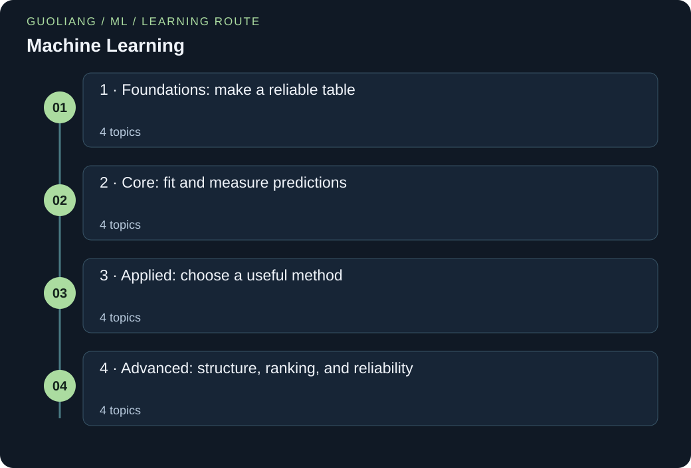

# Machine Learning

> Leon | AI Field Guides

[EN](AI-ML.en.md) · [中文](AI-ML.zh.md)



Learn machine learning in sixteen guided chapters. Start with rows and labels. Build small models, inspect their errors, and work toward text filtering, recommendation, and reliability checks. Each chapter includes an original story, answered questions, two practice cases, and runnable Python.

### Run the Python examples

Use Python 3.12 or newer. Save the code as a .py file. In a terminal, run `python filename.py`; some systems use `python3`. If the code contains `import numpy as np`, first run `python -m pip install numpy`. The import loads NumPy, a package for numeric arrays, and gives it the short name np. No dataset or model-weight downloads are needed.

[Official Python downloads](https://www.python.org/downloads/) · [Official NumPy installation guide](https://numpy.org/install/)

## A route through the ideas

Four stages cover data preparation, regression and classification, neighbours and text models, trees and boosting, clustering and PCA, recommendation, validation, calibration, and monitoring. All datasets and stories are original synthetic teaching examples. Python uses only the standard library or NumPy.

### Before you start

- Read a table and use addition, fractions, and squares.
- Start with the shared Python and maths primer. New terms are defined in each chapter.
- No prior machine-learning library experience is required.

### What you will learn

- Turn a prediction question into features, labels, and an honest split.
- Calculate predictions and errors, and run a small Python example for every topic.
- Choose and explain simple methods for text, numeric tables, and recommendation.
- Use validation, calibration, and fresh labels to judge model reliability.

## Knowledge framework

### 1 · Foundations: make a reliable table

- [Start with rows, features, labels, and a baseline](#features-labels-baselines)
- [Define the question before dividing the data](#framing-splits-leakage)
- [Inspect the table before filling gaps](#missing-data-eda)
- [Turn categories into explicit columns](#categorical-preprocessing)

### 2 · Core: fit and measure predictions

- [Linear regression: predict a number with a line](#linear-regression-mse)
- [Learn with controlled steps and comparable scales](#gradient-descent-scaling)
- [Separate probability estimates from decisions](#logistic-thresholds)
- [Count the mistakes that the task actually cares about](#metrics-imbalance)

### 3 · Applied: choose a useful method

- [Nearest neighbours: borrow evidence from nearby examples](#nearest-neighbours)
- [Naive Bayes: classify short texts from word counts](#text-naive-bayes)
- [Build rules, then understand what combining them changes](#trees-ensembles)
- [Boosting: learn the next correction](#boosting-residuals)

### 4 · Advanced: structure, ranking, and reliability

- [Find structure without inventing labels](#clustering-pca)
- [Recommendation: rank items by a stated similarity](#content-recommendations)
- [Validate choices and prepare for a changing setting](#validation-regularization-shift)
- [Check confidence and watch for change](#calibration-monitoring)

<a id="features-labels-baselines"></a>

## Start with rows, features, labels, and a baseline

### 01 / The story

Kai has a folder of school-club messages. He wants to separate announcements from ordinary chat. He first writes down what one example means: one message. He then records two inputs, word count and the number of links. A person supplies the label. The label is the answer to learn, so it cannot also be an input.

Before choosing an algorithm, Kai predicts the most common training label for every new message. This simple baseline is easy to beat only if useful information exists. He saves its score. Every later model must earn its extra complexity on the same held-out messages.

### 02 / The concept

A dataset is a collection of examples. In a table, each row is one example and each input column is a feature. The label is the target answer. Classification predicts a category. Regression predicts a number.

Learning means choosing model parameters from training examples. A baseline is a deliberately simple comparison. For classification, one option always predicts the most frequent training class. For regression with squared loss, one option predicts the training target mean. Evaluate either on separate examples.

### 03 / Put the concept to work

For spam filtering, start by defining one message and a consistent label rule. For print-time prediction, define one job and its duration in seconds. Write units and allowable values beside each input. Keep a baseline before adding features or models.

### 04 / How others use it

The official dummy-estimator documentation describes constant and class-frequency baselines. Read it to distinguish a comparison rule from a model that uses informative features. The message table here is an original teaching example.

### 05 / The formula, unpacked

```text
X ∈ ℝ^(n×d), y = [y₁, …, yₙ]
c* = argmax_c count_train(c)
accuracy = correct / n_test
```

X is the input table of real numbers, with n rows and d feature columns. ℝ means real numbers and × separates the two dimensions. y lists labels; i in yᵢ is a row index. c is a possible class. count_train(c) counts its training examples. argmax chooses the class with the largest count, called c*. n_test counts test rows.

### 06 / Work through the numbers

Use training labels [0, 0, 0, 1]. Class zero appears three times, so the baseline predicts zero. Test labels are [0, 1, 1, 0]. Two of four predictions are correct, giving accuracy 2/4=0.50. The 75% training majority does not guarantee 75% test accuracy.

### Words to know

- **Feature:** An input available when a prediction must be made.

- **Label:** The target answer used to teach or evaluate a supervised model.

- **Baseline:** A simple reference prediction rule for judging improvement.

### Let us work through it

**Can message type appear in both X and y?**

Not if message type is what we want to predict. That would give the answer to the model. Inputs must be available before that answer is known.

**Why is the test accuracy 0.50 rather than 0.75?**

The rule was chosen from training labels, but accuracy is counted on test labels. Only two of those four labels are zero.

**What if both training classes have equal counts?**

Choose and document a deterministic tie rule. The example chooses the smaller class ID. Do not inspect test labels to break the tie.

### Build a majority-label baseline

Use training labels to choose a rule, then separate test labels to score it.

```python
from collections import Counter
train_y = [0, 0, 0, 1]
test_y = [0, 1, 1, 0]
counts = Counter(train_y)
baseline = min(counts, key=lambda label: (-counts[label], label))
predictions = [baseline] * len(test_y)
correct = sum(pred == true for pred, true in zip(predictions, test_y))
print('baseline class:', baseline)
print('predictions:', predictions)
print(f'test accuracy: {correct / len(test_y):.2f}')
```

**Run it locally**

```sh
python features-labels-baselines-ml-majority-baseline.py
```

**Expected output**

```text
baseline class: 0
predictions: [0, 0, 0, 0]
test accuracy: 0.50
```

**Read the code step by step**

Counter counts training labels. min orders by negative count, so the largest count comes first; the class ID resolves a tie. List repetition makes one prediction per test row. zip pairs predictions with labels, and sum counts True comparisons as one. The output is a baseline, not evidence that word count or links are useful.

### Where you can use this

**Message sorting**

Write three invented rows with word count, link count, and a separate announcement label. Mark which inputs exist when the message arrives. Compute a majority-label baseline before training.

**Numeric baseline**

For training print times [2, 4, 6] seconds, predict their mean of 4 seconds. Test on [3, 5]. Squared errors are 1 and 1, so the test MSE is 1.

**Where the analogy stops:** A baseline can look strong when a useful class is rare. A label can also be inconsistent or wrong. Good scores require a clear task, reliable labels, and suitable held-out data.

**Keep this idea:** Define the example and answer first. Then keep a simple comparison that every complex model must improve.

### Sources for this topic

- [scikit-learn: Dummy estimators and baseline comparisons](https://scikit-learn.org/stable/modules/model_evaluation.html#dummy-estimators)

<a id="framing-splits-leakage"></a>

## Define the question before dividing the data

### 01 / The story

Mira wants to warn when a field sensor may fail during its next session. Her table has many sessions from the same twelve devices. It also has maintenance notes written after failures. A random row split gives a very high score. Then the model fails on a new device.

Mira checks when each input becomes available. She removes the later notes. She keeps whole devices in separate training, validation, and test sets. The score falls. Yet it now answers her real question: can the model work on unfamiliar hardware? She writes the prediction time and split rule beside every result.

### 02 / The concept

Training data teach the model its parameters. Validation data help us choose settings. Test data check the completed choice. Keep their roles separate.

Leakage means using information that would be unavailable when making the real prediction. A future maintenance note is one example. Related rows can also make a test too easy. If the goal is to predict on new devices, separate whole devices. If the goal is tomorrow on known devices, preserve time order.

### 03 / Put the concept to work

Write one sentence naming the prediction unit, target horizon, and available features. Draw the route from raw records to the final score. Split before fitting imputation, scaling, or feature selection, and fit those steps within each training fold. Check duplicate records and shared entities. Keep a simple baseline and record the split rule so that later model comparisons answer the same question.

### 04 / How others use it

The linked Google dataset-splitting tutorial explains the distinct roles of training, validation, and test data. The linked scikit-learn common-pitfalls guide demonstrates how preprocessing can leak information and uses pipelines to keep transformations with an estimator. Apply those documented workflows to an original sensor table: inspect feature timestamps, hold out the appropriate units, and verify that every learned transformation sees training rows only.

### 05 / The formula, unpacked

```text
D = D_train ⊔ D_val ⊔ D_test
R_test = (1 / n_test) Σ_{i=1}^{n_test} I[f(xᵢ) ≠ yᵢ]
```

D denotes the complete dataset; D_train, D_val, and D_test are its training, validation, and test subsets. The symbol ⊔ means a disjoint union of records, with any required group or time separation enforced as well. n_test is the number of test examples. The index i selects one test example, xᵢ is its available input, and yᵢ is its true class. f is the fixed trained classifier. I is an indicator that equals one for an incorrect prediction and zero otherwise. Σ adds these errors, and R_test is their average.

### 06 / Work through the numbers

Construct 120 records from twelve devices, with ten sessions per device. Assign eight entire devices to training, two to validation, and two to testing. The resulting counts are 80, 20, and 20, and their sum is 120. Suppose the fixed classifier gets eighteen of the twenty test records right. There are two errors, so R_test = 2 / 20 = 0.10, or a 10% error rate. A separate, deliberately inappropriate row split might show nineteen correct predictions out of twenty, giving 5% error. That smaller number estimates a different, contaminated comparison if device identity carries information. Neither result proves performance on all future hardware. The two held-out devices, rather than twenty independent devices, also limit how much confidence this tiny demonstration deserves.

### Words to know

- **Split:** An assignment of examples to separate sets with different jobs.

- **Leakage:** Information enters learning or selection even though it is unavailable in the intended prediction setting.

- **Group:** Related records, such as all sessions from one device.

### Let us work through it

**Why remove a very predictive maintenance note?**

It was written after failure. A warning made before the session cannot use it. Predictive strength does not make an input available.

**How do eight training devices give 80 rows?**

Each contributes ten sessions. Multiply 8 by 10. All ten rows from one device stay together.

**Can we adjust the model after seeing the test score?**

We can start a new development cycle, but that set is no longer an untouched final test. Use new independent test evidence for the revised model.

### Keep complete devices together

Build the 120-row split without a random library call.

```python
groups = [device for device in range(12) for _ in range(10)]
train = [i for i, device in enumerate(groups) if device < 8]
valid = [i for i, device in enumerate(groups) if 8 <= device < 10]
test = [i for i, device in enumerate(groups) if device >= 10]
train_devices = {groups[i] for i in train}
test_devices = {groups[i] for i in test}
print('rows:', len(train), len(valid), len(test))
print('shared devices:', sorted(train_devices & test_devices))
print('test error:', 2 / len(test))
```

**Run it locally**

```sh
python framing-splits-leakage-ml-group-split.py
```

**Expected output**

```text
rows: 80 20 20
shared devices: []
test error: 0.1
```

**Read the code step by step**

The first list repeats each device ID ten times. enumerate supplies row positions. The three conditions assign complete groups. A set removes repeated IDs; & finds shared IDs. The empty list confirms no training/test device overlap. The final line uses an assumed two errors; it does not train or evaluate a real sensor model.

### Where you can use this

**New recording devices**

Group six invented recordings by device A, B, or C. Train on A and B, and reserve C. Verify that the two device sets have no overlap before inspecting labels.

**Tomorrow’s sensor reading**

List measurements from days 1 to 10. Use days 1–6 for training, 7–8 for validation, and 9–10 for testing. Do not fill an earlier gap with a future reading.

**Where the analogy stops:** Disjoint rows do not guarantee independent evidence. Related people, locations, recordings, or devices can cross a split without literal duplicates. A clean test set can still differ from future data. Small group counts make uncertainty especially large, and repeatedly selecting models using test results turns the test set into another validation set.

**Keep this idea:** A score becomes meaningful only after you specify what is predicted, when information becomes available, and what kind of unseen case the split represents.

### Sources for this topic

- [Google: Datasets: Dividing the original dataset](https://developers.google.com/machine-learning/crash-course/overfitting/dividing-datasets)

- [scikit-learn: Common pitfalls and recommended practices](https://scikit-learn.org/stable/common_pitfalls.html)

<a id="missing-data-eda"></a>

## Inspect the table before filling gaps

### 01 / The story

Mei records temperatures from a classroom sensor. Some cells are blank. One contains 999, the device’s error code. Her first average treats 999 as a real temperature and becomes absurdly high. She checks the recording guide and marks that code as missing.

Mei counts gaps before filling them. She chooses the median of the observed training readings as a simple replacement. She also keeps a flag showing which values were missing. The table is now usable, but the replacements are not new measurements. She compares later readings with this record of what was observed and what was filled.

### 02 / The concept

Exploratory data analysis, or EDA, means checking what the data contain before fitting a model. Inspect units, ranges, duplicates, and missing counts. A missing value is unknown; it is not automatically zero.

Imputation replaces missing entries by a stated rule. A median is the middle observed value after sorting. Learn the replacement from training data only, then reuse it. A separate missingness flag preserves the fact that a measurement was absent.

### 03 / Put the concept to work

Sensor tables and document metadata often contain gaps. Inspect their causes before choosing a replacement. Compare error rates for originally complete and originally incomplete rows. Keep the fitted replacement with the model.

### 04 / How others use it

The scikit-learn imputation guide documents mean, median, constant replacements, and missing indicators. Its workflow motivates this small NumPy example. We do not assume that every model requires imputation.

### 05 / The formula, unpacked

```text
m = median(observed training values)
x̃ᵢ = m if xᵢ is missing, otherwise xᵢ
r = missing_count / n
```

m is the replacement median. xᵢ is the original value in row i; x̃ᵢ is its filled version. n is the number of rows. r is the fraction of missing entries in the chosen column. The tilde marks a transformed value.

### 06 / Work through the numbers

Training values [2, missing, 6, 4] contain one gap out of four, so r=0.25. Observed values sort to [2,4,6], giving median 4. Fill training with [2,4,6,4]. For test values [missing,10], reuse 4 to get [4,10]. Do not recompute a test median of 10.

### Words to know

- **EDA:** Inspection of data structure, ranges, and quality before modeling.

- **Imputation:** Replacing unknown entries with a stated estimate or placeholder.

- **Median:** The middle sorted value, or the mean of the two middle values for an even count.

### Let us work through it

**Why not replace every gap with zero?**

Zero may be a real measured value with a very different meaning. A gap says we do not know. Choose a rule that matches the feature.

**What does the missing flag [0,1,0,0] preserve?**

It records that the second value was unknown before filling. The filled value 4 alone cannot tell us that.

**Can we learn the median from test rows?**

No. That lets held-out data influence preparation. Fit on training rows and apply the saved rule everywhere else.

### Fit a median, then reuse it

NaN represents unknown numeric entries in this example.

```python
import numpy as np
train = np.array([2., np.nan, 6., 4.])
test = np.array([np.nan, 10.])
missing = np.isnan(train)
median = np.median(train[~missing])
filled_train = np.where(missing, median, train)
filled_test = np.where(np.isnan(test), median, test)
print(f'training missing fraction: {missing.mean():.2f}')
print('training flag:', missing.astype(int).tolist())
print('filled training:', filled_train.tolist())
print('filled test:', filled_test.tolist())
```

**Run it locally**

```sh
python missing-data-eda-ml-median-imputation.py
```

**Expected output**

```text
training missing fraction: 0.25
training flag: [0, 1, 0, 0]
filled training: [2.0, 4.0, 6.0, 4.0]
filled test: [4.0, 10.0]
```

**Read the code step by step**

isnan marks missing entries. ~ reverses the Boolean mask so indexing selects observed training values. median finds their middle value. where selects the replacement only at missing positions. astype(int) makes flags readable as zero and one. The test uses the same saved median. This prepares numeric data; it does not show that filling improves prediction.

### Where you can use this

**A sensor error code**

For [18,19,999,20], verify that 999 is an error code before marking it missing. The observed median is 19. Keep both the filled value and a missing flag.

**An empty column**

Try a training column with no observed values. Stop the median rule before it produces NaN. Decide whether to remove the column or use a documented constant and missing flag.

**Where the analogy stops:** Filling gaps can hide uncertainty. Missingness may depend on the unobserved value itself. An entirely missing training column has no observed median. Inspect and handle that case explicitly.

**Keep this idea:** First learn what a blank means. Then fill it using training information and preserve the missingness record.

### Sources for this topic

- [scikit-learn: Imputation of missing values](https://scikit-learn.org/stable/modules/impute.html)

- [scikit-learn: Common pitfalls and recommended practices](https://scikit-learn.org/stable/common_pitfalls.html)

<a id="categorical-preprocessing"></a>

## Turn categories into explicit columns

### 01 / The story

An art club catalogs objects by material: paper, wood, or metal. Lin wants to predict which storage box fits each object. She encodes materials as 1, 2, and 3. A distance-based model then treats metal as twice as far from paper as wood is. That spacing has no basis in the names.

Lin instead creates one column for each material. A one marks the selected category, and zeros mark the others. She also plans what to do with an unseen material. The new table states what she knows without inventing an order. She saves the column names with the model.

### 02 / The concept

A categorical feature names a group. Some categories have a real order, such as small, medium, and large. Others, such as material names, do not. One-hot encoding makes a separate indicator column for each known category.

Fit the vocabulary on training data. Use the same column order later. An unseen category needs an explicit rule, such as an unknown column or rejection. Our example adds an unknown column. That preserves a fixed shape but does not teach a model what a new category means.

### 03 / Put the concept to work

Use category encodings for device models, file formats, or material types in a table. Keep numeric scaling and categorical encoding as separate preparation steps. Validate the whole sequence within each training fold.

### 04 / How others use it

The official preprocessing guide explains one-hot and ordinal encodings. It also documents choices for unknown categories. Our encoder is small enough to inspect row by row.

### 05 / The formula, unpacked

```text
hⱼ(c) = I[c = vocabularyⱼ]
h_unknown(c) = I[c is absent from the training vocabulary]
```

c is the observed category. vocabularyⱼ is the known category assigned to column j. I is one when the condition is true and zero otherwise. hⱼ is the indicator in that column. h_unknown is the extra unknown-category indicator.

### 06 / Work through the numbers

With columns [paper, wood, unknown], wood becomes [0,1,0]. Paper becomes [1,0,0]. An unseen metal becomes [0,0,1]. Each row sums to one. The two known categories have equal distance √2 in this representation, rather than an invented numeric order.

### Words to know

- **Categorical feature:** An input whose values identify groups or names.

- **One-hot encoding:** Separate zero-or-one columns that identify one category.

- **Vocabulary:** The saved list of known categories and their column order.

### Let us work through it

**Why can 1, 2, 3 mislead a distance model?**

Those numbers imply order and spacing. Unordered names do not justify that geometry. One-hot columns remove that particular assumption.

**Why save column order?**

A learned weight is tied to a column. Swapping paper and wood later changes what that weight means even if the shape stays the same.

**Is an unknown column a learned solution for every new category?**

No. It identifies the situation. A useful response still needs evidence, a fallback rule, or later labeled examples.

### Encode known and unseen categories

An explicit last column records unknown categories.

```python
vocabulary = ['paper', 'wood']
def encode(value):
    return [int(value == name) for name in vocabulary] + [int(value not in vocabulary)]
print('columns:', vocabulary + ['unknown'])
for value in ['wood', 'paper', 'metal']:
    row = encode(value)
    print(value, row, 'sum:', sum(row))
```

**Run it locally**

```sh
python categorical-preprocessing-ml-category-columns.py
```

**Expected output**

```text
columns: ['paper', 'wood', 'unknown']
wood [0, 1, 0] sum: 1
paper [1, 0, 0] sum: 1
metal [0, 0, 1] sum: 1
```

**Read the code step by step**

The list comprehension compares a value with each saved name. int converts each comparison to zero or one. The final entry tests membership in the whole vocabulary. Printing the sum checks that exactly one indicator is active. This encoder prepares features only. It neither trains a classifier nor learns how to handle metal correctly.

### Where you can use this

**File formats**

Train a vocabulary on png and txt. Encode a new wav file with an explicit unknown column. Check that every output has the same length and that column names remain fixed.

**Ordered sizes**

Compare material names with small, medium, large. The sizes have an order, but their spacing may not be equal. Decide whether an ordinal code or measured dimensions better fit the task.

**Where the analogy stops:** Many categories create many columns. Rare categories give little training evidence. A new unknown column may be untrained if no training rows used it. Choose a fallback and evaluate its behavior.

**Keep this idea:** Encoding should express category meaning, keep column order fixed, and state how unseen values are handled.

### Sources for this topic

- [scikit-learn: Preprocessing: categorical features](https://scikit-learn.org/stable/modules/preprocessing.html#encoding-categorical-features)

- [scikit-learn: Common pitfalls and recommended practices](https://scikit-learn.org/stable/common_pitfalls.html)

<a id="linear-regression-mse"></a>

## Linear regression: predict a number with a line

### 01 / The story

Jun records seedling heights beside a window. He wants a simple rule that links height to growing time. Two lines look plausible on paper. One misses a tall seedling. The other moves toward it but misses several smaller plants. Jun needs a fair way to compare them.

He writes each prediction beside its measured height. He subtracts, squares each error, and takes the average. He then takes a square root to return to centimeters. The line now has a clear score. Jun also sees where it fails. He keeps it as a baseline and plans to measure light next.

### 02 / The concept

A line predicts a number by multiplying the input by a slope and adding an intercept. The slope says how much the prediction changes when the input rises by one unit. The intercept is the prediction at input zero.

In this chapter, prediction residual means prediction minus measurement. Squaring makes positive and negative errors contribute positively. Mean squared error, or MSE, averages these squares. Large errors count heavily. Root mean squared error, or RMSE, takes the square root so its unit matches the target. A fitted line describes an association; it does not by itself prove a cause.

### 03 / Put the concept to work

Start with a constant prediction, such as the training target mean, and compare a linear model on the same held-out examples. Keep measurement units beside each feature and coefficient. Examine residuals against predictions and important inputs. If large errors dominate the result, inspect their provenance before changing the loss. Report a unit-preserving metric such as root mean squared error when communicating error magnitude.

### 04 / How others use it

The linked Google loss tutorial contrasts absolute and squared regression errors and explains how the choice changes the influence of large residuals. Its role here is to ground the loss definition, not supply the seedling story or numbers. Use the tutorial's comparison as a reading prompt, then calculate both metrics on your own measurements and explain which errors each metric emphasizes.

### 05 / The formula, unpacked

```text
ŷᵢ = b + w xᵢ
MSE = (1 / n) Σᵢ₌₁ⁿ (ŷᵢ − yᵢ)²
RMSE = √MSE
```

The index i identifies an observation and n is the number being evaluated. xᵢ is its input, yᵢ its measured target, and ŷᵢ the model prediction; the hat distinguishes an estimate from a measurement. b is the intercept, expressed in target units. w is the slope, expressed in target units per input unit. The difference ŷᵢ − yᵢ is a signed residual. Σ sums over all observations, the superscript 2 squares each residual, and √ takes a square root. MSE has squared target units; RMSE returns to target units.

### 06 / Work through the numbers

Use three synthetic observations with input days 1, 2, and 3 and heights 3, 5, and 8 centimeters. A candidate line with b = 1 and w = 2 predicts 3, 5, and 7. Its residuals are 0, 0, and −1 centimeters; the squared errors sum to 1, giving MSE = 1 / 3 ≈ 0.333 and RMSE ≈ 0.577 centimeters. A constant prediction equal to the target mean, 16 / 3, has squared errors 49 / 9, 1 / 9, and 64 / 9. Its MSE is 38 / 9 ≈ 4.222. The candidate line improves this comparison, but it is not claimed to be the least-squares optimum. These three training points also provide no independent estimate of future prediction quality.

### Words to know

- **Slope:** Prediction change for a one-unit input increase.

- **Intercept:** The line’s prediction when the input is zero.

- **Residual:** Prediction minus the observed target, using this chapter’s convention.

### Let us work through it

**Why square the errors before adding?**

Errors +1 and −1 would cancel in a plain sum. Their squares add to 2. Squaring also makes an error of 4 count sixteen times as much as an error of 1.

**Where does 0.577 centimeters come from?**

The squared errors are 0, 0, and 1. Their average is 1/3 square centimeters. Its square root is about 0.577 centimeters.

**Does a lower training MSE prove a better future prediction?**

No. Training rows helped choose the rule. Compare models on the same held-out rows to test whether the improvement transfers.

### Compare a line and a constant

Use the same three rows for an arithmetic demonstration.

```python
import numpy as np
x = np.array([1., 2., 3.])
y = np.array([3., 5., 8.])
prediction = 1 + 2 * x
residual = prediction - y
mse = np.mean(residual ** 2)
baseline_mse = np.mean((y.mean() - y) ** 2)
print('prediction:', prediction.tolist())
print(f'MSE: {mse:.6f}; RMSE: {np.sqrt(mse):.6f}')
print(f'constant MSE: {baseline_mse:.6f}')
```

**Run it locally**

```sh
python linear-regression-mse-ml-line-loss.py
```

**Expected output**

```text
prediction: [3.0, 5.0, 7.0]
MSE: 0.333333; RMSE: 0.577350
constant MSE: 4.222222
```

**Read the code step by step**

np.array stores ordered numbers. Multiplication and subtraction act on matching entries. **2 squares each residual; mean adds and divides by three. sqrt restores the original unit. y.mean supplies the constant baseline. These rows are used only to compare arithmetic. The chosen line is not a fitted least-squares optimum or an independent test result.

### Where you can use this

**Seedling baseline**

Run the example, then change the final height from 8 to 10. The line still predicts 7 there. Its MSE becomes 9/3 = 3, which shows how a larger miss changes squared loss.

**Print duration**

For an invented print job, use page count as input and seconds as target. State the slope in seconds per page. Keep setup time in the intercept, and check held-out jobs of different lengths.

**Where the analogy stops:** A straight line can miss nonlinear relationships, interactions, and abrupt changes. Squared loss is sensitive to extreme residuals, whether they reflect meaningful events or measurement errors. Extrapolating beyond the observed feature range can be unreliable. Correlated inputs can make individual coefficients unstable even when predictions remain useful.

**Keep this idea:** Linear regression is a transparent baseline; its loss defines which mistakes matter, and its residuals reveal what the line leaves unexplained.

### Sources for this topic

- [Google: Linear regression: Loss](https://developers.google.com/machine-learning/crash-course/linear-regression/loss)

<a id="gradient-descent-scaling"></a>

## Learn with controlled steps and comparable scales

### 01 / The story

Asha measures how far a robot cart travels. One input is pulse duration in seconds. Another is an encoder count in thousands. During training, the loss suddenly rises. She first thinks the model needs more layers. Then she notices that one weight changes much faster than the others.

Asha rescales inputs using the training records only. She also lowers the learning rate. The updates become easier to follow. To see why, she computes one step using two invented points. She can now separate a bad update rule from missing information. A lower training loss is useful, but she still needs validation.

### 02 / The concept

The loss is a number that measures prediction error. A gradient tells us how that loss changes near the current weights. In one dimension, think of the slope of a hill. Gradient descent moves against that slope. The learning rate multiplies the gradient to set the update.

Standardization subtracts a training mean and divides by a training standard deviation. The mean gives the center. The standard deviation measures spread. This makes different input scales easier to handle. A constant column has zero spread and needs separate handling; dividing by zero is not allowed.

### 03 / Put the concept to work

Fit scaling statistics on training data and reuse them unchanged for validation and testing. Plot loss against updates, check for exploding or non-finite values, and try a smaller learning rate when steps are unstable. Compare training and validation curves before deciding whether to train longer. Handle constant features explicitly because their standard deviation is zero. Save the fitted transformation together with the final model.

### 04 / How others use it

The linked Google gradient-descent tutorial follows repeated parameter updates and visualizes training loss. Its separate normalization tutorial discusses feature scales and their effect on optimization. Together they provide a documented route from a loss definition to a practical training diagnostic. Recreate the logic with the cart example below, then explain why the same numerical learning rate need not behave identically after changing input units.

### 05 / The formula, unpacked

```text
zᵢ = (xᵢ − μ_train) / s_train
L(w,b) = (1 / n) Σᵢ₌₁ⁿ (w zᵢ + b − yᵢ)²
g_w = (2 / n) Σᵢ₌₁ⁿ (w zᵢ + b − yᵢ) zᵢ
g_b = (2 / n) Σᵢ₌₁ⁿ (w zᵢ + b − yᵢ)
w_new = w − η g_w; b_new = b − η g_b
```

xᵢ is raw input i; μ_train and s_train are the training mean and population standard deviation, with s_train positive. zᵢ is the standardized input and yᵢ the target. n counts training examples, and Σ sums over them. w and b are the current slope and intercept. L is mean squared loss. g_w and g_b are its partial derivatives with respect to those parameters. η is the positive learning rate. The suffix new marks the updated value. Both gradients are evaluated at the same old parameters before either update is applied.

### 06 / Work through the numbers

Take raw inputs 2 and 6, with targets 1 and 3. The training mean is 4 and the population standard deviation is 2, so standardized inputs are −1 and 1. Start with w = 0 and b = 0. Predictions are both zero, giving L = (1 + 9) / 2 = 5. The weight gradient is (2 / 2)[(−1)(−1) + (−3)(1)] = −2, and the intercept gradient is −4. With learning rate 0.1, simultaneous updates give w_new = 0.2 and b_new = 0.4. New predictions are 0.2 and 0.6, so the new loss is (0.64 + 5.76) / 2 = 3.2. One step reduces loss by 1.8; it does not finish optimization or demonstrate generalization.

### Words to know

- **Gradient:** Local slopes of the loss with respect to model parameters.

- **Learning rate:** A multiplier that controls how strongly a gradient changes a parameter.

- **Standard deviation:** A measure of spread; here it is the square root of the mean squared distance from the mean.

### Let us work through it

**Why do 2 and 6 become −1 and 1?**

Their mean is 4. Distances from 4 are −2 and 2. The population standard deviation is 2, so divide both distances by 2.

**Why does a negative gradient increase a weight?**

The update subtracts learning rate times gradient. Subtracting a negative number adds a positive amount. This moves toward lower loss locally.

**What if the learning rate is much larger?**

A large step may cross the low point and raise the loss. Compare the loss before and after a step; do not assume every descent update succeeds.

### Standardize and take one step

All gradients below use the old parameter values.

```python
import numpy as np
x = np.array([2., 6.]); y = np.array([1., 3.])
z = (x - x.mean()) / x.std()
w, b, rate = 0., 0., 0.1
error = w * z + b - y
gw = 2 * np.mean(error * z)
gb = 2 * np.mean(error)
w, b = w - rate * gw, b - rate * gb
print('scaled inputs:', z.tolist())
print(f'gradients: {gw:.1f}, {gb:.1f}')
print(f'weights: {w:.1f}, {b:.1f}')
print(f'loss: {np.mean((w * z + b - y) ** 2):.3f}')
```

**Run it locally**

```sh
python gradient-descent-scaling-ml-gradient-step.py
```

**Expected output**

```text
scaled inputs: [-1.0, 1.0]
gradients: -2.0, -4.0
weights: 0.2, 0.4
loss: 3.200
```

**Read the code step by step**

mean and std compute training statistics; NumPy std uses the population convention here. error stores old residuals. Multiplying by z gives the weight contribution to the derivative. Multiplying means by two comes from differentiating a square. The tuple assignment updates both parameters from old gradients. The last line recomputes the loss. This is one exact step for a tiny linear model, not a full training workflow.

### Where you can use this

**One robot update**

Change the example’s learning rate from 0.1 to 1.1. Recompute the loss. The old gradients are unchanged, but the step overshoots and produces loss 7.2.

**Constant sensor column**

Try inputs [4, 4]. Their standard deviation is zero. Detect this case before division. Drop the uninformative column or map it to zero using an explicitly saved rule.

**Where the analogy stops:** Scaling does not repair mislabeled examples or missing explanatory variables. Standard deviation can be strongly affected by outliers. Gradient descent requires a suitable step size even for a convex objective; convexity alone does not make every update stable. More complex models may have nonconvex losses and different convergence behavior.

**Keep this idea:** Inspect the update rule, input units, and loss curve together; stable optimization is necessary for learning, but it is not evidence of generalization.

### Sources for this topic

- [Google: Linear regression: Gradient descent](https://developers.google.com/machine-learning/crash-course/linear-regression/gradient-descent)

- [Google: Numerical data: Normalization](https://developers.google.com/machine-learning/crash-course/numerical-data/normalization)

- [scikit-learn: Common pitfalls and recommended practices](https://scikit-learn.org/stable/common_pitfalls.html)

<a id="logistic-thresholds"></a>

## Separate probability estimates from decisions

### 01 / The story

Leo wants to sort evening sky images into clear and cloudy groups. His model gives the next image a score of 0.60 for clear sky. He treats that number as a command to prepare the telescope. His friend asks why the cutoff is 0.50. Leo has no answer yet.

He separates two jobs. The model estimates a probability. A threshold turns that estimate into an action. Raising the threshold means fewer preparation alerts. He keeps the model fixed and compares cutoffs on validation images. The numbers now describe a choice he can explain, rather than a rule hidden inside the model.

### 02 / The concept

A binary task has two labels, here clear and cloudy. Logistic regression first makes a linear score. The sigmoid function bends that score into a value between zero and one. We interpret it as the estimated probability of the positive label.

A threshold is a separate decision rule. Predict positive when the estimate reaches that cutoff. Moving the cutoff does not change the weights or probability estimates. A sigmoid alone does not guarantee accurate probabilities. Calibration, taught later, checks whether predicted probabilities match observed frequencies.

### 03 / Put the concept to work

Name the positive class before training and keep that definition consistent in metrics. Use validation data to compare thresholds under the intended action costs or review capacity. Inspect both false positives and false negatives at the chosen operating point. If probabilities themselves inform decisions, check calibration as well as classification accuracy. Freeze the threshold before the final test, and document how ties at the threshold are handled.

### 04 / How others use it

The linked Google sigmoid tutorial explains how a linear score becomes a probability estimate. Its thresholding tutorial then connects probability cutoffs with confusion-matrix outcomes. Read these as two distinct stages of a classifier. In the original astronomy example, the model can remain fixed while the preparation rule changes; the official material supports that distinction without claiming any astronomy deployment or validating this invented dataset.

### 05 / The formula, unpacked

```text
z = b + w x
p = 1 / (1 + exp(−z))
ŷ = I[p ≥ τ]
```

x is one measured feature, w its learned coefficient, and b the intercept. z is the resulting linear score, interpreted as the model's log-odds for the positive class. exp is the exponential function with base e, approximately 2.71828. p is the estimated probability of that positive class. τ is a chosen decision threshold between zero and one. ŷ is the predicted binary label. I equals one when the bracketed condition is true and zero otherwise; this convention assigns an exact threshold tie to the positive class.

### 06 / Work through the numbers

Suppose an illustrative model uses b = −1.2, w = 0.8, and feature value x = 2. The linear score is z = −1.2 + 0.8 × 2 = 0.4. Since exp(−0.4) ≈ 0.6703, the estimated positive probability is 1 / 1.6703 ≈ 0.5987. With threshold 0.50, the model predicts the positive class; with threshold 0.65, it predicts the negative class. The probability and coefficients have not changed. For comparison, x = 0 gives z = −1.2 and p ≈ 0.2315. These are model outputs, not observed frequencies or guarantees about a particular evening. To justify either threshold, Leo would need labeled validation cases and an explicit preference between unnecessary preparation and missing a useful observing opportunity.

### Words to know

- **Positive class:** The label we choose to count as one, not necessarily something good.

- **Sigmoid:** A smooth function that maps any finite real score into a value between zero and one.

- **Threshold:** The cutoff used to turn a probability estimate into a class choice.

### Let us work through it

**Is 0.5987 already a class label?**

No. It is a probability estimate. Comparing it with 0.50 gives class one; comparing it with 0.65 gives class zero.

**Why is sigmoid(0) equal to 0.5?**

exp(0) equals 1. The denominator is 1+1=2, so the result is 1/2.

**Does a higher threshold improve every metric?**

No. It produces fewer positives. Some false alarms may disappear, but some true positives may be missed too. Count both types on validation data.

### One probability, two decisions

Use illustrative fixed weights, not a trained sky classifier.

```python
from math import exp
x, w, b = 2., 0.8, -1.2
score = b + w * x
probability = 1 / (1 + exp(-score))
print(f'score: {score:.4f}; probability: {probability:.4f}')
for threshold in [0.50, 0.65]:
    label = int(probability >= threshold)
    print(f'threshold {threshold:.2f}: class {label}')
```

**Run it locally**

```sh
python logistic-thresholds-ml-sigmoid-cutoffs.py
```

**Expected output**

```text
score: 0.4000; probability: 0.5987
threshold 0.50: class 1
threshold 0.65: class 0
```

**Read the code step by step**

The first calculation creates a linear score. exp implements the exponential in sigmoid. The loop reuses one probability. >= compares it with each cutoff; int turns True or False into one or zero. The output changes class while keeping the score fixed. No data were used to fit these weights or to justify either threshold.

### Where you can use this

**Sky image review**

For probabilities [0.3, 0.6, 0.9], compare thresholds 0.5 and 0.8. The positive counts are two and one. Add true labels before deciding which threshold is better.

**Spam review queue**

Use a threshold to choose messages for human review. A lower threshold makes the queue longer. Measure useful detections and unnecessary reviews together; queue length alone is not quality.

**Where the analogy stops:** A sigmoid output is not automatically a well-calibrated probability. A linear decision boundary can miss important interactions unless the features represent them. Threshold preferences may change with class prevalence, action costs, or available capacity. Choosing a threshold on the test set contaminates the final evaluation just as choosing model parameters there would.

**Keep this idea:** Train the probability model and choose the decision threshold as related but separate steps, then evaluate the complete rule on untouched data.

### Sources for this topic

- [Google: Logistic regression: Calculating a probability with the sigmoid function](https://developers.google.com/machine-learning/crash-course/logistic-regression/sigmoid-function)

- [Google: Thresholds and the confusion matrix](https://developers.google.com/machine-learning/crash-course/classification/thresholding)

<a id="metrics-imbalance"></a>

## Count the mistakes that the task actually cares about

### 01 / The story

Nora searches a collection of audio clips for bird calls. Only ten of every hundred clips contain a call. A model that says “no call” every time reaches 90% accuracy. That sounds good, but it retrieves nothing she wants to hear.

Nora checks a second detector. It finds eight calls and sends twelve background clips for review. Its accuracy is lower, yet its results may be more useful. She writes the four kinds of outcomes in a small table. She can now discuss how many calls are found and how much listening work remains. One score no longer hides the tradeoff.

### 02 / The concept

A confusion matrix counts correct and incorrect decisions for each class. True positive means a real call was found. False positive means background was flagged. False negative means a call was missed. True negative means background was correctly rejected.

Accuracy divides all correct decisions by all clips. Precision divides found calls by all flagged clips. Recall divides found calls by all real calls. F1 combines precision and recall through their harmonic mean. These questions differ, so report the counts as well as the ratios. A zero denominator needs an explicit convention.

### 03 / Put the concept to work

Report the positive-class definition, prevalence, threshold, and four confusion-matrix counts with your metrics. Compare against a simple baseline, including an always-negative classifier when appropriate. Use validation data to examine precision and recall across thresholds. Check important recording conditions separately, such as quiet versus windy evenings. When denominators are zero, state the undefined quantity or the explicit reporting convention instead of silently treating it as excellent performance.

### 04 / How others use it

The linked Google classification-metrics tutorial defines accuracy, precision, recall, and F1 and discusses how error priorities affect metric choice. Use that official framework to audit the original frog-detector example. Rebuild each metric from the four counts before drawing a conclusion, and explain why a high accuracy can coexist with no successful detections. The tutorial is the factual reference; the recording scenario and counts are original.

### 05 / The formula, unpacked

```text
N = TP + TN + FP + FN
Accuracy = (TP + TN) / N
Precision = TP / (TP + FP)
Recall = TP / (TP + FN)
F1 = 2 TP / (2 TP + FP + FN)
```

TP counts true positives: actual calls labeled as calls. TN counts true negatives: background clips labeled as background. FP counts false positives: background clips incorrectly labeled as calls. FN counts false negatives: actual calls that the detector misses. N is the total number of evaluated clips. Accuracy, Precision, Recall, and F1 name the four dimensionless metrics shown. Multiplication is implied in 2 TP. Each denominator must be checked before division; for example, precision is undefined when TP + FP is zero because no clips were predicted positive.

### 06 / Work through the numbers

Create one hundred labeled clips: ten contain calls and ninety contain background. Suppose a detector finds eight calls, misses two, and flags twelve background clips. Then TP = 8, FN = 2, FP = 12, and TN = 78. Accuracy is (8 + 78) / 100 = 86%. Precision is 8 / 20 = 40%, recall is 8 / 10 = 80%, and F1 is 16 / 30 ≈ 53.3%. An always-negative baseline reaches 90% accuracy because it rejects all ninety background clips, but its recall is zero. Its precision is undefined because it predicts no positives. Thus the detector has lower accuracy yet retrieves eight calls that the baseline misses. Whether twelve false alarms are acceptable depends on the intended listening workflow.

### Words to know

- **Precision:** Among predicted positives, the fraction that is truly positive.

- **Recall:** Among actual positives, the fraction that is found.

- **Class imbalance:** One class has many more examples than another.

### Let us work through it

**Why can 90% accuracy be useless for finding calls?**

Ninety clips are background. Rejecting every clip gets those ninety right but misses every call. Recall is zero.

**Why are the precision and recall denominators different?**

Precision asks about the 20 flagged clips: 8/20. Recall asks about the 10 real calls: 8/10. Both use the same eight correct detections.

**What if no clip is predicted positive?**

Precision becomes 0/0 and is mathematically undefined. Some software reports zero by convention. State that convention and keep the counts visible.

### Compute four metrics from counts

These counts describe one threshold on an invented evaluation set.

```python
tp, tn, fp, fn = 8, 78, 12, 2
total = tp + tn + fp + fn
accuracy = (tp + tn) / total
precision = tp / (tp + fp)
recall = tp / (tp + fn)
f1 = 2 * tp / (2 * tp + fp + fn)
for name, value in [('accuracy', accuracy), ('precision', precision),
                    ('recall', recall), ('F1', f1)]:
    print(f'{name}: {value:.3f}')
print('clips to review:', tp + fp)
```

**Run it locally**

```sh
python metrics-imbalance-ml-confusion-counts.py
```

**Expected output**

```text
accuracy: 0.860
precision: 0.400
recall: 0.800
F1: 0.533
clips to review: 20
```

**Read the code step by step**

The four counts cover all hundred clips once. Each division matches a different question. The F1 expression uses counts directly and equals the harmonic mean when precision and recall are defined. The loop prints each ratio to three decimal places. The code assumes nonzero denominators in this example. It computes metrics; it does not train an audio detector.

### Where you can use this

**Listening workload**

Use TP=8 and FP=12. Twenty clips need review, and eight are useful. If only ten reviews fit your session, evaluate a stricter threshold instead of hiding the workload behind accuracy.

**Rare scratch inspection**

Make a table with 5 scratched and 95 clean synthetic examples. An always-clean rule has 95% accuracy and zero recall. Use it as a baseline before evaluating a detector.

**Where the analogy stops:** A confusion matrix describes one threshold on one evaluation set. Precision can change when the positive-class prevalence changes, even if other behavior appears similar. F1 does not express every cost preference. Small numbers of positives make recall estimates unstable, and a pooled score can hide poor performance in particular conditions.

**Keep this idea:** Keep the confusion matrix close to every headline score; the right metric must reveal the errors that matter for the intended use.

### Sources for this topic

- [Google: Classification: Accuracy, recall, precision, and related metrics](https://developers.google.com/machine-learning/crash-course/classification/accuracy-precision-recall)

- [Google: Thresholds and the confusion matrix](https://developers.google.com/machine-learning/crash-course/classification/thresholding)

<a id="nearest-neighbours"></a>

## Nearest neighbours: borrow evidence from nearby examples

### 01 / The story

Aya sorts short sound clips into two instrument groups. Each clip has two measured features. Rather than fit a line, she plots the labeled training clips and finds those closest to a new clip. The nearest three labels vote on its class.

The first version gives strange results because one feature is in thousands and the other lies between zero and one. Aya rescales using training statistics. She then compares different neighbour counts on validation clips. She sees that “near” is a modeling choice. The method is easy to explain, but its answers depend on which features define the map.

### 02 / The concept

The k-nearest-neighbours classifier stores labeled training examples. For a new input, compute distances, choose the k smallest, and count their labels. In our binary example, more than half voting one gives class one.

Euclidean distance is ordinary straight-line distance. Square coordinate differences, add them, then take a square root. For ranking neighbours, squared distance gives the same order and avoids the root. Scaling must be fitted on training data. Choose k by validation, not by the final test.

### 03 / Put the concept to work

Nearest neighbours can provide a transparent baseline for small feature tables or similarity search. Show the retrieved examples to inspect mistakes. Check whether a query is far from every training point before trusting a local vote.

### 04 / How others use it

The scikit-learn neighbours guide explains supervised neighbour prediction and distance choices. The example below implements only uniform voting over a tiny numeric table.

### 05 / The formula, unpacked

```text
d²(x,q) = Σⱼ₌₁ᵈ (xⱼ−qⱼ)²
ŷ = I[(1/k) Σᵢ∈Nₖ(q) yᵢ > 1/2]
```

q is the query vector and x is a training vector. j indexes d feature coordinates. d² is squared distance; the superscript 2 means square, while d in the sum counts features. Nₖ(q) is the set of k nearest row indices. yᵢ is a zero-or-one label. ŷ is the predicted label and I is the indicator.

### 06 / Work through the numbers

Use points [0,0], [1,0], [2,0], [4,0] with labels [0,0,1,1]. Query [1.6,0] gives squared distances [2.56,0.36,0.16,5.76]. The nearest three indices are [2,1,0], with labels [1,0,0]. Their mean is 1/3, so the vote is class zero. With k=1, the result is class one.

### Words to know

- **Neighbour:** A training example ranked close to the query under a chosen distance.

- **Euclidean distance:** Straight-line distance from squared coordinate differences.

- **Hyperparameter:** A setting chosen outside parameter fitting, such as the neighbour count k.

### Let us work through it

**Why can we rank squared distances without taking roots?**

For nonnegative values, square root preserves order. The smallest square has the smallest root.

**Why does k=3 predict zero?**

The three labels are [1,0,0]. Two vote zero and one votes one. Their class-one fraction is 1/3.

**Is k=1 always more accurate because it is closest?**

No. A single mislabeled or noisy point can control the answer. Larger k smooths decisions but may mix different regions. Compare validation errors.

### Inspect every nearest-neighbour vote

The table is synthetic and already uses comparable feature scales.

```python
import numpy as np
x = np.array([[0.,0.], [1.,0.], [2.,0.], [4.,0.]])
y = np.array([0,0,1,1])
query = np.array([1.6,0.])
squared = np.sum((x - query) ** 2, axis=1)
order = np.argsort(squared, kind='stable')
print('squared distances:', np.round(squared, 2).tolist())
for k in [1,3]:
    labels = y[order[:k]]
    print('k:', k, 'labels:', labels.tolist(), 'prediction:', int(labels.mean() > 0.5))
```

**Run it locally**

```sh
python nearest-neighbours-ml-knn-vote.py
```

**Expected output**

```text
squared distances: [2.56, 0.36, 0.16, 5.76]
k: 1 labels: [1] prediction: 1
k: 3 labels: [1, 0, 0] prediction: 0
```

**Read the code step by step**

Subtracting query uses it for every row. sum(axis=1) adds feature contributions within each row. argsort returns row indices from smallest distance to largest; stable ordering resolves equal distances by row order. Slicing [:k] selects neighbours. Their mean counts the fraction of ones. This is a genuine tiny neighbour classifier, with no evidence about real audio accuracy.

### Where you can use this

**A changed neighbour count**

Run the same query with k=1 and k=3. Explain the changed answer by listing the selected labels. Do not change the training table at the same time.

**Clip similarity search**

Use two invented audio features with stated units. Retrieve three nearby clips for inspection. Rescale one feature and check whether the retrieved set changes.

**Where the analogy stops:** Distance loses meaning when irrelevant features dominate. Large training sets make direct search expensive. Ties need a rule. A vote fraction is not automatically a calibrated probability.

**Keep this idea:** A neighbour prediction is only as sensible as its distance, feature scales, and stored examples.

### Sources for this topic

- [scikit-learn: Nearest Neighbors](https://scikit-learn.org/stable/modules/neighbors.html)

- [Google: Numerical data: Normalization](https://developers.google.com/machine-learning/crash-course/numerical-data/normalization)

<a id="text-naive-bayes"></a>

## Naive Bayes: classify short texts from word counts

### 01 / The story

Bo receives many short club messages. He wants a first spam filter that he can inspect. He counts words rather than asking a large model to read each message. In the training examples, “offer” occurs often in spam and “meeting” occurs often in ordinary messages.

A new message contains “offer.” Bo combines the class frequency with the word frequency in each class. He adds a small count before division so an unseen word does not force a score to zero. The filter gives a clear answer in this tiny case. Bo still tests normal messages that use “offer” innocently, because a word is evidence, not proof.

### 02 / The concept

Tokenization splits text into units such as words. A count vector records how often each vocabulary word occurs. Multinomial naive Bayes uses class-specific word frequencies to score that vector. “Naive” names a conditional-independence assumption: the model ignores many dependencies among words once the class is fixed.

Add-one smoothing gives every vocabulary word a positive count. Multiply word probabilities with the class prior; equivalently, add their logarithms. Logs prevent long products from becoming too small. Normalize the two final scores if you want model probability estimates.

### 03 / Put the concept to work

Naive Bayes is a useful baseline for spam filtering and document categories. Fit vocabulary and word counts on training texts only. Inspect false positives, rare words, and punctuation choices before trusting aggregate accuracy.

### 04 / How others use it

The official naive Bayes guide describes multinomial text classification and smoothing. The text counts here are original and intentionally tiny. They do not establish a deployable spam filter.

### 05 / The formula, unpacked

```text
θ_cj = (N_cj + 1)/(N_c + V)
s_c = log π_c + Σⱼ xⱼ log θ_cj
P(c|x) = exp(s_c) / Σ_a exp(s_a)
```

c and a index classes; j indexes words. N_cj counts word j in class c. N_c totals all word occurrences in that class. V is vocabulary size. θ_cj is the smoothed word probability. π_c is the class prior. xⱼ counts query word j. s_c is its log score. log is natural logarithm and exp reverses it.

### 06 / Work through the numbers

Use vocabulary [offer, meeting]. Spam counts are [3,1]; ordinary counts are [1,3]. Each class has four word occurrences. Add-one smoothing gives spam word probabilities [4/6,2/6] and ordinary probabilities [2/6,4/6]. With equal class priors and query [1,0], unnormalized scores are 1/3 and 1/6. Their sum is 1/2, so spam probability is 2/3.

### Words to know

- **Token:** One text unit produced by a chosen splitting rule.

- **Prior:** The class probability before using the query’s words.

- **Smoothing:** Adding small counts so known-vocabulary words never receive zero probability.

### Let us work through it

**Why add V to the denominator?**

We add one to each of V word counts. The total count therefore increases by V as well. Probabilities still sum to one.

**Why is the query [1,0]?**

It contains offer once and meeting zero times. The vector follows the saved vocabulary order.

**What if both words occur once?**

With these symmetric counts and equal priors, both classes receive the same score. Real context may differ, but this count model cannot see it.

### Compute a two-word classifier

Use supplied training count totals to show every probability.

```python
import numpy as np
counts = np.array([[3.,1.], [1.,3.]])
word_prob = (counts + 1) / (counts.sum(axis=1, keepdims=True) + 2)
query = np.array([1.,0.])
log_scores = np.log([0.5,0.5]) + np.log(word_prob) @ query
weights = np.exp(log_scores - log_scores.max())
probabilities = weights / weights.sum()
print('word probabilities:', np.round(word_prob, 3).tolist())
print('class probabilities:', np.round(probabilities, 3).tolist())
print('class:', ['spam','ordinary'][int(np.argmax(probabilities))])
```

**Run it locally**

```sh
python text-naive-bayes-ml-naive-bayes-counts.py
```

**Expected output**

```text
word probabilities: [[0.667, 0.333], [0.333, 0.667]]
class probabilities: [0.667, 0.333]
class: spam
```

**Read the code step by step**

Rows represent classes and columns represent words. sum with keepdims preserves a column-shaped denominator for each row. Adding one implements smoothing. @ adds query-count-weighted log probabilities. Subtracting the largest log score keeps exponentials numerically manageable without changing the normalized result. argmax selects the higher score. The classifier is based only on these counts, not a trained language model.

### Where you can use this

**Inspect a false alarm**

Write an ordinary message containing offer, such as an invitation to offer help. The toy classifier still favors spam. Explain which context the count representation omitted.

**An unseen word**

Add a query word absent from the saved vocabulary. Choose an unknown token or an ignore rule before evaluation. Do not expand the vocabulary using test labels.

**Where the analogy stops:** Word counts lose order and much context. The independence assumption is often false. Probabilities may be poorly calibrated even when classification is useful. Unseen words need a saved vocabulary policy.

**Keep this idea:** Count words, smooth the counts, combine evidence, and inspect where context breaks the simple assumption.

### Sources for this topic

- [scikit-learn: Naive Bayes](https://scikit-learn.org/stable/modules/naive_bayes.html)

<a id="trees-ensembles"></a>

## Build rules, then understand what combining them changes

### 01 / The story

Tao records whether a small kite stays in the air. His inputs include wind speed and the angle of the string. A single straight rule misses an interaction: a useful angle depends on the wind. He draws a decision tree with one question at each fork.

The tree handles the small table well. A deeper version then memorizes unusual trials. Tao compares shallower trees and a forest of varied trees. He checks how the forest combines their probabilities. The combined prediction is less tied to one tree’s rule, but it still needs held-out trials. A clear branch is a useful model choice, not proof of cause.

### 02 / The concept

A decision tree asks a sequence of questions, such as “wind speed below 3?” Each answer selects a branch. A leaf is the final group and supplies a prediction. To choose a split, compare how mixed the labels are before and after it. Gini impurity is zero for a pure group and larger for a mixed group.

A forest combines many randomized trees. Here we average their positive-class probabilities. Varied trees can reduce sensitivity to one noisy sample. Boosting, in a later chapter, learns corrections in sequence instead of training a collection by the same logic.

### 03 / Put the concept to work

Fit a shallow tree first and inspect its conditions against the data. Tune depth and minimum leaf size within validation, then compare a forest or boosted trees using identical splits and metrics. Examine stability across reasonable training variations. For interpretation, distinguish a useful predictive split from a causal explanation. Record whether an ensemble combines class votes or probabilities, since these can yield different decisions.

### 04 / How others use it

The linked scikit-learn decision-tree guide demonstrates classification and regression trees and explains depth-related overfitting. Its ensemble guide distinguishes randomized forests from boosting and specifies that its forest classifier averages class probabilities. Those details ground the kite comparison and the averaging calculation below. They also explain why describing every forest implementation as a majority vote can obscure the actual prediction rule being used.

### 05 / The formula, unpacked

```text
G(p) = 2 p (1 − p)
ΔG = G(p) − (n_L / n) G(p_L) − (n_R / n) G(p_R)
p_forest = (1 / T) Σₜ₌₁ᵀ qₜ
```

p is the positive-class fraction in a parent node and G is its binary Gini impurity. n is the parent sample count; n_L and n_R count samples sent to the left and right children, so n = n_L + n_R. p_L and p_R are their positive fractions. ΔG is the impurity reduction from that split. T is the number of trees, t indexes a tree, and qₜ is that tree's predicted positive probability for the same input. Σ adds these probabilities; p_forest is their unweighted average.

### 06 / Work through the numbers

A parent node contains six successful flights and four unsuccessful ones, so p = 0.6 and G = 2 × 0.6 × 0.4 = 0.48. A proposed split sends four successes and one failure left, and two successes and three failures right. The child impurities are 0.32 and 0.48. Each child has five examples, so weighted impurity is 0.5 × 0.32 + 0.5 × 0.48 = 0.40. The reduction is 0.08, a local improvement rather than proof of better test performance. Separately, suppose three trees predict positive probabilities 0.2, 0.7, and 0.9 for a new flight. Their average is 1.8 / 3 = 0.6, producing a positive decision at threshold 0.5. This probability average is the stated ensemble rule.

### Words to know

- **Leaf:** A final tree region that supplies a prediction.

- **Gini impurity:** A label-mixing score; for two classes it is 2p(1−p).

- **Ensemble:** A prediction made by combining several models.

### Let us work through it

**Why weight child impurities by their sizes?**

A child containing nine examples should contribute more than a child containing one. The weights make the score describe a randomly selected parent example.

**How does the split gain become 0.08?**

The parent has impurity 0.48. The children have weighted impurity 0.5×0.32+0.5×0.48=0.40. Subtract to get 0.08.

**Can three similar trees all make the same error?**

Yes. Averaging does not remove a misleading pattern that all trees learned. Data quality and independent validation still matter.

### Score a split and average trees

Compute the local criterion without building a whole tree.

```python
def gini(positive, total):
    p = positive / total
    return 2 * p * (1 - p)
parent = gini(6, 10)
children = 0.5 * gini(4, 5) + 0.5 * gini(2, 5)
probabilities = [0.2, 0.7, 0.9]
print(f'parent: {parent:.2f}; children: {children:.2f}')
print(f'gain: {parent - children:.2f}')
print(f'forest probability: {sum(probabilities) / len(probabilities):.2f}')
```

**Run it locally**

```sh
python trees-ensembles-ml-gini-forest.py
```

**Expected output**

```text
parent: 0.48; children: 0.40
gain: 0.08
forest probability: 0.60
```

**Read the code step by step**

The function converts counts into a positive fraction, then computes binary Gini impurity. Equal child sizes give weights of 0.5. Subtracting child impurity measures the local gain. sum divided by len averages tree probabilities. The numbers demonstrate one candidate split and one ensemble rule; no tree search or forest training occurs.

### Where you can use this

**A pure leaf**

Change the left child to five successes and zero failures. Its positive fraction is one, so Gini becomes zero. Check whether this split also leaves enough examples for reliable evaluation.

**Forest voting rule**

Compare probabilities [0.49, 0.49, 0.99]. Their mean is about 0.657, above 0.5. A majority of thresholded labels would be negative. State which combination rule you use.

**Where the analogy stops:** Greedy splits optimize local choices and need not produce a globally optimal tree. Forests can still fail when many trees share the same misleading signal. Large ensembles require more resources and are harder to inspect. Feature importance describes model behavior under particular assumptions; it does not establish that changing a feature will change the outcome.

**Keep this idea:** Trees turn interactions into explicit regions; ensembles can stabilize predictions, but every added layer of complexity still needs validation on the intended task.

### Sources for this topic

- [scikit-learn: Decision Trees](https://scikit-learn.org/stable/modules/tree.html)

- [scikit-learn: Ensembles: Gradient boosting, random forests, bagging, voting, stacking](https://scikit-learn.org/stable/modules/ensemble.html)

<a id="boosting-residuals"></a>

## Boosting: learn the next correction

### 01 / The story

Yun predicts the duration of simple robot tasks. A constant estimate misses short and long tasks in opposite directions. She draws the errors beneath the predictions. Then she fits a tiny tree to those remaining errors. Its job is to predict a correction, not the full duration.

Yun adds only part of the correction. The training loss drops. She repeats this idea carefully and watches validation error as well. More trees keep improving the training fit, but they need not improve new tasks. She now understands boosting as a sequence of focused repairs whose number and size must be chosen with evidence.

### 02 / The concept

An ensemble combines several models. In squared-error gradient boosting, start with a simple prediction and fit a small learner to residuals. Here residual means target minus current prediction. It is the negative of the earlier chapter’s prediction error, so adding it points toward the needed correction. Add a learning-rate-scaled version of that learner.

The next learner sees the remaining errors after the previous update. This differs from averaging independently randomized trees in a forest. Other losses use their negative gradients instead of this exact residual. Tree depth, step size, and round count control flexibility.

### 03 / Put the concept to work

Boosted trees are a common option for numeric and categorical tables after appropriate preparation. Compare them with a linear baseline. Choose stopping rounds on validation data and retain the same split rules used for other models.

### 04 / How others use it

The official ensemble guide explains gradient boosting and its connection to loss gradients. The code fits one fixed-split stump to residuals. It demonstrates one real correction step, not a complete boosting library.

### 05 / The formula, unpacked

```text
rᵢ = yᵢ − F₀(xᵢ)
F₁(xᵢ) = F₀(xᵢ) + η h(xᵢ)
```

i indexes training rows. yᵢ is the target. F₀ is the current predictor and F₁ is the updated predictor. rᵢ is the needed correction. h is a small learner fitted to those corrections. η is the learning rate, here between zero and one.

### 06 / Work through the numbers

Targets [1,1,3,3] have mean 2. Starting at 2 gives residuals [−1,−1,1,1] and MSE 1. A stump separating the first two rows from the last two predicts those residuals exactly. With η=0.5, predictions become [1.5,1.5,2.5,2.5]. All squared errors are 0.25, so the new MSE is 0.25.

### Words to know

- **Residual learner:** A small model trained to predict the remaining correction.

- **Stump:** A decision tree with one split and two leaves.

- **Boosting round:** One addition of a new correction model.

### Let us work through it

**Why does the correction use target minus prediction?**

If the prediction is too high, this difference is negative. Adding a negative correction lowers it. The sign matches the repair we need.

**Where does MSE 0.25 come from?**

Each prediction remains 0.5 away from its target. Squaring gives 0.25 for every row, so the average is also 0.25.

**Why not always use η=1?**

It fits this easy example in one step. On noisy data, full corrections can fit incidental patterns too quickly. Select the rate and round count with validation.

### Fit one residual stump

The split at x<2 is fixed so we can inspect both leaf means.

```python
import numpy as np
x = np.array([0.,1.,2.,3.]); y = np.array([1.,1.,3.,3.])
prediction = np.full_like(y, y.mean())
residual = y - prediction
left = x < 2
correction = np.where(left, residual[left].mean(), residual[~left].mean())
updated = prediction + 0.5 * correction
print('residual:', residual.tolist())
print('updated:', updated.tolist())
print(f'MSE before: {np.mean((prediction-y)**2):.2f}')
print(f'MSE after: {np.mean((updated-y)**2):.2f}')
```

**Run it locally**

```sh
python boosting-residuals-ml-residual-stump.py
```

**Expected output**

```text
residual: [-1.0, -1.0, 1.0, 1.0]
updated: [1.5, 1.5, 2.5, 2.5]
MSE before: 1.00
MSE after: 0.25
```

**Read the code step by step**

full_like makes a constant starting prediction with one entry per target. The Boolean left mask defines two leaves. Each leaf uses the mean residual, which minimizes its squared residual error. where sends each row its leaf correction. Adding half the correction performs one boosting step. No split search, multiple rounds, or independent validation are included.

### Where you can use this

**A smaller step**

Use η=0.25. Predictions become [1.75,1.75,2.25,2.25], giving MSE 0.5625. The correction direction is unchanged, but progress per round is smaller.

**A noisy duration**

Change the final target from 3 to 8. Recompute the mean and leaf corrections. Explain why one unusual measurement can influence a squared-error learner strongly before deciding whether it is valid data.

**Where the analogy stops:** Repeated corrections can chase noise. A small training loss does not choose the number of rounds for you. The fixed split here is unusually easy and does not measure performance on real task durations.

**Keep this idea:** Boosting asks the next learner to repair what the current prediction still misses.

### Sources for this topic

- [scikit-learn: Ensembles: Gradient boosting, random forests, bagging, voting, stacking](https://scikit-learn.org/stable/modules/ensemble.html)

<a id="clustering-pca"></a>

## Find structure without inventing labels

### 01 / The story

Imani measures stones from a river walk. She records length, width, mass, and texture but has no rock-type labels. A clustering program returns three groups. She almost names them as three geological types. Then changing grams to kilograms changes the groups.

Imani realizes that distance depends on units. She chooses a stated scaling rule and inspects representative stones. She also tries PCA to view the strongest directions of variation. The compact plot helps her ask better questions. It does not create the missing labels. She keeps neutral group names and seeks outside evidence before making a geological claim.

### 02 / The concept

Clustering proposes groups without using target labels. K-means assigns points to nearby centers, then moves each center to its group mean. Its objective adds squared distances to centers. More groups can reduce that number without making the interpretation better.

PCA answers a different question: which directions show the most spread after centering? It projects points onto those directions. The covariance matrix summarizes how coordinates vary together. An eigenvector is a direction whose orientation that matrix preserves; its eigenvalue measures the variance along it. These are geometric descriptions, not discovered class labels.

### 03 / Put the concept to work

Choose features and scaling according to the comparison you intend, and preserve the transformation for later observations. Inspect representative members of each cluster and compare several plausible cluster counts or initializations. For PCA, report retained variance and examine the component loadings. If the representation will feed a supervised model, fit it inside training folds. Use domain evidence to interpret groups rather than treating cluster identifiers as discovered truth.

### 04 / How others use it

The linked scikit-learn clustering guide describes the k-means objective and the shapes it handles poorly. The linked decomposition guide illustrates PCA with a lower-dimensional view of the Iris measurements and notes that PCA centers inputs without automatically scaling each feature. These official examples clarify the different jobs of grouping and projection. The river-stone story and rectangular dataset below are original illustrations of those distinctions.

### 05 / The formula, unpacked

```text
J = Σᵢ₌₁ⁿ ‖xᵢ − μ_cᵢ‖²
S = (1 / n) Σᵢ₌₁ⁿ (xᵢ − x̄)(xᵢ − x̄)ᵀ
S vⱼ = λⱼ vⱼ
r₁ = λ₁ / Σⱼ₌₁ᵈ λⱼ
```

n counts observations and i selects one. xᵢ is a vector of d features; cᵢ identifies its cluster and μ_cᵢ is that cluster's centroid. The squared norm ‖·‖² sums squared coordinate differences, and J is total within-cluster squared distance. x̄ is the mean vector. S is the covariance matrix using divisor n here. Superscript T transposes a vector, making the product an outer product. vⱼ is principal direction j and λⱼ its variance, ordered largest first. Σ denotes summation. r₁ is the variance fraction retained by the first component, assuming positive total variance.

### 06 / Work through the numbers

Consider four two-dimensional points: (0,0), (0,2), (4,0), and (4,2), with both axes already in comparable units. Two clusters divided by the first coordinate have centroids (0,1) and (4,1). Every point has squared distance 1 from its centroid, so J = 4. A single centroid at (2,1) gives squared distance 5 per point and J = 20. For PCA, subtract the mean (2,1). The population covariance matrix is diagonal with entries 4 and 1, so the first principal direction is (1,0), up to its arbitrary sign. It preserves 4 / (4 + 1) = 80% of total variance. Keeping one component discards the vertical distinction. Lower clustering loss and high retained variance describe geometry, not the correctness of imagined category labels.

### Words to know

- **Centroid:** The coordinate-wise mean of the points assigned to a group.

- **Projection:** Coordinates obtained by measuring a point along selected directions.

- **Explained variance:** The share of total spread retained by selected PCA directions.

### Let us work through it

**Why is the two-cluster loss 4?**

Each point is one vertical unit from its center. Its squared distance is 1. Four such points contribute 4.

**What does retaining 80% variance mean?**

Horizontal variance is 4 and vertical variance is 1. Keeping the horizontal direction retains 4/(4+1). It does not mean 80% classification accuracy.

**Why might a small-variance direction still matter?**

A rare but useful difference can have little overall spread. PCA has no labels telling it that this difference matters for a later task.

### Measure groups and PCA variance

A rectangle makes both calculations visible.

```python
import numpy as np
x = np.array([[0., 0.], [0., 2.], [4., 0.], [4., 2.]])
centers = np.array([[0., 1.], [4., 1.]])
assignment = np.array([0, 0, 1, 1])
loss = np.sum((x - centers[assignment]) ** 2)
centered = x - x.mean(axis=0)
covariance = centered.T @ centered / len(x)
values = np.linalg.eigvalsh(covariance)
print(f'cluster loss: {loss:.1f}')
print('covariance:', covariance.tolist())
print(f'first variance share: {values[-1] / values.sum():.2f}')
```

**Run it locally**

```sh
python clustering-pca-ml-cluster-pca-geometry.py
```

**Expected output**

```text
cluster loss: 4.0
covariance: [[4.0, 0.0], [0.0, 1.0]]
first variance share: 0.80
```

**Read the code step by step**

centers[assignment] selects one center per row. Squaring and summing yields the grouping loss. mean(axis=0) computes each column mean. .T swaps axes; @ multiplies matrices to form population covariance. eigvalsh returns its eigenvalues in ascending order, so the final one is largest. This code measures chosen groups and variance. It does not discover rock types or run an iterative k-means fit.

### Where you can use this

**Stone geometry**

Multiply the vertical coordinate in the example by three. Vertical variance becomes 9 while horizontal variance stays 4. The first PCA direction changes, showing why units matter.

**Audio clip browsing**

Cluster invented clip features such as duration and energy. Listen to representative clips before naming groups. A group of loud clips may reflect recording gain rather than sound type.

**Where the analogy stops:** K-means can struggle with irregular shapes, unequal densities, and outliers; its objective also decreases as more clusters are allowed. PCA captures linear variance, which may reflect nuisance variation instead of useful signal. Scaling choices alter both analyses, and a visually separated projection does not establish a meaningful scientific distinction.

**Keep this idea:** Use clustering to propose groups and PCA to compress variation, then test your interpretation with evidence that neither method supplied.

### Sources for this topic

- [scikit-learn: Clustering](https://scikit-learn.org/stable/modules/clustering.html)

- [scikit-learn: Decomposing signals in components: Principal component analysis](https://scikit-learn.org/stable/modules/decomposition.html#principal-component-analysis-pca)

<a id="content-recommendations"></a>

## Recommendation: rank items by a stated similarity

### 01 / The story

Rui wants to suggest library videos to a science club. Each video has two hand-labeled features: astronomy and robotics. She represents one viewer’s stated interests with the same two features. A dot product gives each video a score.

Rui notices that a video with many tags can score highly just because its vector is longer. She compares cosine similarity, which removes vector length from the comparison. The ranking now reflects direction in the feature space. She shows why each video was suggested and invites feedback. This is a transparent content-based recommender, but it cannot discover interests that its two features never describe.

### 02 / The concept

A content-based recommender compares item features with a user profile in the same space. A dot product multiplies matching coordinates and adds them. Cosine similarity divides that product by both vector lengths. It measures alignment rather than size.

Ranking sorts candidate items by score. A candidate set is the list considered before ranking. Remove unavailable or already-seen items when the task calls for it. A similarity score is not a probability of enjoyment. Evaluate relevance and variety with a clear feedback protocol.

### 03 / Put the concept to work

Use this idea for related reading, video suggestions, or similar document search. Start with understandable tags, then compare richer learned features. Keep a fallback for a new viewer with no profile and for items with no tags.

### 04 / How others use it

Google’s recommendation course documents content-based filtering and dot-product similarity. Our tagged-video example adds an explicit cosine calculation for inspection. It claims no production ranking quality.

### 05 / The formula, unpacked

```text
score(u,v) = (u·v)/(‖u‖‖v‖)
u·v = Σⱼ uⱼvⱼ; ‖u‖ = √Σⱼ uⱼ²
```

u is the interest vector and v is an item vector. j indexes matching feature positions. · is the dot product. ‖u‖ is Euclidean vector length. √ means square root and Σ means sum. Both lengths must be nonzero for cosine similarity.

### 06 / Work through the numbers

Let the profile be [1,1]. Astronomy [1,0] and robotics [0,1] each score 1/√2≈0.707. A mixed video [1,1] scores 2/(√2×√2)=1. Scaling that video to [2,2] leaves its cosine at 1. In contrast, its dot product rises from 2 to 4.

### Words to know

- **User profile:** A feature vector describing stated or inferred interests.

- **Cosine similarity:** The dot product divided by both lengths, measuring directional alignment.

- **Candidate set:** Items considered before ranking chooses their order.

### Let us work through it

**Why do both one-topic videos score 0.707?**

The profile weights both topics equally. Each dot product is one, and the lengths are √2 and one.

**Does score 1 mean certain enjoyment?**

No. It means the represented directions match. The chosen features may omit pacing, difficulty, or the viewer’s current needs.

**What if the profile is [0,0]?**

Division by its zero length is undefined. Ask for interests or use a clearly labeled general fallback instead of fabricating a similarity.

### Rank three tagged videos

The tags are hand chosen; this example learns no embeddings.

```python
import numpy as np
names = ['astronomy', 'robotics', 'mixed']
items = np.array([[1.,0.], [0.,1.], [1.,1.]])
profile = np.array([1.,1.])
scores = (items @ profile) / (np.linalg.norm(items, axis=1) * np.linalg.norm(profile))
order = np.argsort(-scores, kind='stable')
for index in order:
    print(f'{names[index]}: {scores[index]:.3f}')
```

**Run it locally**

```sh
python content-recommendations-ml-cosine-recommendations.py
```

**Expected output**

```text
mixed: 1.000
astronomy: 0.707
robotics: 0.707
```

**Read the code step by step**

@ forms one dot product per item. norm computes vector length; axis=1 keeps item lengths separate. Division removes length effects. Sorting negative scores puts larger values first, with input order resolving ties. The mixed item ranks first under these tags. This is an inspectable scoring rule, not a validated viewer-preference model.

### Where you can use this

**Related reading**

Give three invented articles two topic tags. Rank them for profile [1,0]. Compare the result with profile [0,1]. Explain the changed order from the coordinates.

**Longer tag vectors**

Double every coordinate of one item. Its dot product doubles but its cosine stays fixed. Decide whether magnitude contains useful evidence in your particular recommendation task.

**Where the analogy stops:** A zero vector has no cosine direction. Narrow profiles can repeat very similar items. Hand labels can be incomplete. Similarity alone does not measure quality, novelty, or whether the viewer actually liked the item.

**Keep this idea:** Choose a representation and score that match the recommendation question, then test the ranking with feedback.

### Sources for this topic

- [Google: Content-based filtering](https://developers.google.com/machine-learning/recommendation/content-based/basics)

<a id="validation-regularization-shift"></a>

## Validate choices and prepare for a changing setting

### 01 / The story

Ren predicts greenhouse humidity from several sensor readings. A flexible model almost matches the first month perfectly. It does poorly on later days. Ren tries a penalty that discourages large weights. He compares strengths on time-ordered validation periods. The best training fit no longer wins.

He tests the chosen model once on an untouched final period. Later, new ventilation equipment changes the greenhouse. Ren does not treat the old score as a permanent promise. He collects fresh labels and checks performance again. Validation helped choose a model for one setting. Monitoring must show whether that setting still describes the world.

### 02 / The concept

Overfitting means learning details that help the training data but fail to transfer. L2 regularization adds the squared weights to the training objective, multiplied by a chosen strength. This discourages very large coefficients. It may improve generalization, but that is a question for validation.

Cross-validation repeats fitting and evaluation on several splits called folds. All learned preprocessing belongs inside each fold. Time and group dependencies still matter. Distribution shift means the future data or input-target relationship changes. Regularization does not protect against every such change.

### 03 / Put the concept to work

Define a modest set of candidate settings and compare them on the same validation folds. Place every learned preprocessing step inside each fold. Use group or chronological splits when the task requires them, and keep a final evaluation period untouched by selection. Record input ranges, class proportions when relevant, and error patterns. After deployment changes, obtain fresh labeled evidence rather than treating input monitoring alone as a performance measurement.

### 04 / How others use it

The linked scikit-learn cross-validation guide documents group-aware and time-ordered splitters. Its linear-model guide presents ridge regression and validation of regularization strength. The linked Google dataset guide also discusses mismatches between evaluation data and later use. These sources support the workflow, while the greenhouse narrative is original. Note that the averaged-loss objective below uses a different penalty normalization from scikit-learn Ridge's summed-loss convention. With otherwise matching conventions, the Ridge penalty parameter equals the training sample count times λ.

### 05 / The formula, unpacked

```text
L_λ(w,b) = (1 / n) Σᵢ₌₁ⁿ (b + wᵀxᵢ − yᵢ)² + λ Σⱼ₌₁ᵈ wⱼ²
CV(λ) = (1 / K) Σₖ₌₁ᴷ MSEₖ(λ)
```

n is the training sample count; i indexes observations and j indexes d features. xᵢ is an input vector, yᵢ its target, w the coefficient vector, and b the unpenalized intercept. Superscript T denotes transpose, so wᵀxᵢ is a dot product. λ is a nonnegative penalty strength and L_λ the penalized training objective. Σ denotes summation. K is the number of validation folds and k selects one. MSEₖ is unpenalized error on fold k after fitting its corresponding training portion. CV is their unweighted mean; unequal fold sizes would require weights for a pooled per-example mean.

### 06 / Work through the numbers

Compare two synthetic coefficient vectors under the stated averaged-loss convention. Candidate A has training MSE 1.0 and squared coefficient sum 9; candidate B has training MSE 1.4 and squared coefficient sum 1. At λ = 0.1, their penalized objectives are 1.9 and 1.5, so B has the smaller objective despite worse raw training fit. This comparison illustrates the penalty and does not assert either vector is the optimized solution. Separately, suppose a validation search gives three equal-sized fold errors of 1.0, 1.4, and 1.2 for λ = 0, versus 0.9, 1.0, and 1.1 for λ = 0.1. Their means are 1.2 and 1.0. Choose the latter setting by validation, refit on development data, and evaluate once on the reserved final period.

### Words to know

- **Overfitting:** Learning training-specific details that do not help new examples.

- **Regularization:** A constraint or penalty that changes which fitted solutions are preferred.

- **Fold:** One training/evaluation partition used during cross-validation.

### Let us work through it

**Why can worse training MSE give a smaller objective?**

Candidate B trades 0.4 more MSE for 0.8 less penalty. Its total is 1.4+0.1×1=1.5, below A’s 1.9.

**Which numbers should choose the penalty strength?**

Use validation errors, here fold means 1.2 and 1.0. The training objective helps fit weights; it is not an independent measure of future error.

**Do unchanged input averages prove the model is still accurate?**

No. The relationship between inputs and labels may change while averages stay similar. Obtain fresh labeled cases to measure errors.

### Separate fitting objective and validation

Candidate summaries illustrate two different comparisons.

```python
candidates = {'A': (1.0, 9), 'B': (1.4, 1)}
strength = 0.1
for name, (mse, squared_weights) in candidates.items():
    print(f'{name} objective: {mse + strength * squared_weights:.1f}')
folds = {0.0: [1.0, 1.4, 1.2], 0.1: [0.9, 1.0, 1.1]}
means = {value: sum(errors) / len(errors) for value, errors in folds.items()}
for value, score in means.items():
    print(f'lambda {value:.1f}: validation MSE {score:.1f}')
print('chosen lambda:', min(means, key=means.get))
```

**Run it locally**

```sh
python validation-regularization-shift-ml-regularization-validation.py
```

**Expected output**

```text
A objective: 1.9
B objective: 1.5
lambda 0.0: validation MSE 1.2
lambda 0.1: validation MSE 1.0
chosen lambda: 0.1
```

**Read the code step by step**

Each candidate stores its training MSE and squared-weight sum. The first loop adds the penalty. The folds dictionary stores independent illustrative validation summaries. The next calculation averages equal-sized folds. min with key=means.get selects the strength with the smallest validation error. It does not select by penalized training loss. These are supplied summaries, not results from a fitted model.

### Where you can use this

**Select a penalty**

Compare the two validation-error lists in the code. Choose the lower mean before opening the test set. Refit the chosen setting on development data, then report one final test result.

**A changed recording room**

A sound classifier moves from a quiet room to a hall. Keep a recent labeled sample from the hall. Compare error types, not only average volume, before deciding whether adaptation helps.

**Where the analogy stops:** Repeatedly searching many settings can overfit validation data. Cross-validation is not automatically valid for dependent observations or future forecasting. Regularization depends on feature scale and cannot supply missing information. Detecting a change in inputs does not prove accuracy fell, while stable input summaries do not guarantee that the target relationship remained stable.

**Keep this idea:** Use validation to choose complexity, reserve testing for the completed choice, and gather fresh evidence whenever the intended prediction setting changes.

### Sources for this topic

- [scikit-learn: Cross-validation: evaluating estimator performance](https://scikit-learn.org/stable/modules/cross_validation.html)

- [scikit-learn: Linear Models: Ridge regression and classification](https://scikit-learn.org/stable/modules/linear_model.html#ridge-regression-and-classification)

- [Google: Datasets: Dividing the original dataset](https://developers.google.com/machine-learning/crash-course/overfitting/dividing-datasets)

<a id="calibration-monitoring"></a>

## Check confidence and watch for change

### 01 / The story

Ari’s spam filter marks many messages with probability 0.8. She initially reads that as an 80% success guarantee for each message. Instead, she groups recent labeled messages with similar probabilities. Among four messages predicted near 0.8, only two are spam. The model is too confident in this small group.

Ari records the group size and repeats the check with more data. She also tracks missing inputs and new vocabulary. These checks answer different questions. Input changes warn that conditions may have changed. Fresh labels reveal whether predictions remain useful. She plans recalibration on separate data rather than rewriting probabilities from the final test set.

### 02 / The concept

Calibration asks whether estimated probabilities agree with observed frequencies over comparable cases. A reliability bin groups nearby estimates. Compare the bin’s mean probability with its positive-label fraction. Small bins are noisy, so keep their counts.

The Brier score averages squared differences between probability and a zero-or-one label. Lower is better for that score, but it combines several aspects of prediction quality; it is not a pure calibration measure. Monitoring also checks input validity, missingness, and labeled error rates over time. Recalibration needs data separate from the final evaluation.

### 03 / Put the concept to work

A spam review queue needs both useful ranking and interpretable confidence. Track probability bins on recent labeled messages. Also track new categories and missing features. Investigate changes, then compare any updated model on an independent period.

### 04 / How others use it

The official calibration guide explains reliability diagrams and proper scoring rules. Google’s monitoring guide describes data checks and live labeled quality checks. The example is a tiny diagnostic, not a sufficient sample for deciding a recalibration policy.

### 05 / The formula, unpacked

```text
p̄_b = (1/n_b) Σᵢ∈b pᵢ
f_b = (1/n_b) Σᵢ∈b yᵢ
Brier = (1/n) Σᵢ₌₁ⁿ (pᵢ−yᵢ)²
```

b is a nonempty probability bin and n_b is its count. pᵢ is a predicted positive probability and yᵢ is its zero-or-one label. p̄_b is the mean predicted probability; f_b is the observed positive fraction. n counts all evaluated examples. Σ adds entries.

### 06 / Work through the numbers

Use probabilities [0.8,0.8,0.8,0.8] and labels [1,1,0,0]. The mean prediction is 0.8, but the positive fraction is 2/4=0.5. Squared errors are [0.04,0.04,0.64,0.64]. Their average is 1.36/4=0.34. Four cases suggest a question; they do not establish a precise population calibration error.

### Words to know

- **Calibration:** Agreement between predicted probabilities and observed frequencies over comparable cases.

- **Reliability bin:** A group of examples with similar predicted probabilities.

- **Brier score:** The mean squared difference between predicted probability and binary outcome.

### Let us work through it

**Does 0.8 mean a particular message is partly spam?**

No. The label is still zero or one. Probability describes uncertainty. Calibration concerns frequencies across many comparable messages.

**Why do negative labels contribute 0.64 here?**

For y=0, the difference is 0.8−0=0.8. Squaring gives 0.64. Confident incorrect probabilities are penalized strongly.

**Can monitoring without labels certify accuracy?**

No. It can detect schema or input changes. Measuring correctness requires trustworthy outcomes or labels.

### Inspect a probability bin

All four examples belong to one bin near probability 0.8.

```python
import numpy as np
probability = np.array([0.8,0.8,0.8,0.8])
label = np.array([1.,1.,0.,0.])
brier = np.mean((probability - label) ** 2)
print('bin count:', len(label))
print(f'mean probability: {probability.mean():.2f}')
print(f'observed positive fraction: {label.mean():.2f}')
print(f'Brier score: {brier:.2f}')
```

**Run it locally**

```sh
python calibration-monitoring-ml-calibration-bin.py
```

**Expected output**

```text
bin count: 4
mean probability: 0.80
observed positive fraction: 0.50
Brier score: 0.34
```

**Read the code step by step**

The arrays pair each probability with its true label. Subtraction, squaring, and mean implement the Brier score. The label mean is the positive fraction because labels are zero or one. The printed count reminds us how little evidence four cases provide. The script diagnoses supplied predictions; it does not fit a calibrator or monitor a live system.

### Where you can use this

**A cautious probability**

Replace all four probabilities with 0.5. The Brier score becomes 0.25 on these labels. This improves this small score; validate any learned recalibration on separate data.

**A new file source**

Track missing-feature rates before and after a document importer changes. If the rate rises, inspect parsing first. Collect fresh labels before attributing the change to lower classifier accuracy.

**Where the analogy stops:** Delayed or missing labels limit monitoring. Binning choices change the display. Calibration may deteriorate after distribution shift. A changed feature mean is a warning, not proof that prediction error increased.

**Keep this idea:** Confidence needs frequency checks. Model quality needs fresh labels, especially when inputs or conditions change.

### Sources for this topic

- [scikit-learn: Probability calibration](https://scikit-learn.org/stable/modules/calibration.html)

- [Google: Monitoring pipelines](https://developers.google.com/machine-learning/crash-course/production-ml-systems/monitoring)

## The reference desk

### [Start with rows, features, labels, and a baseline](#features-labels-baselines)

Define the example and answer first. Then keep a simple comparison that every complex model must improve.

### [Define the question before dividing the data](#framing-splits-leakage)

A score becomes meaningful only after you specify what is predicted, when information becomes available, and what kind of unseen case the split represents.

### [Inspect the table before filling gaps](#missing-data-eda)

First learn what a blank means. Then fill it using training information and preserve the missingness record.

### [Turn categories into explicit columns](#categorical-preprocessing)

Encoding should express category meaning, keep column order fixed, and state how unseen values are handled.

### [Linear regression: predict a number with a line](#linear-regression-mse)

Linear regression is a transparent baseline; its loss defines which mistakes matter, and its residuals reveal what the line leaves unexplained.

### [Learn with controlled steps and comparable scales](#gradient-descent-scaling)

Inspect the update rule, input units, and loss curve together; stable optimization is necessary for learning, but it is not evidence of generalization.

### [Separate probability estimates from decisions](#logistic-thresholds)

Train the probability model and choose the decision threshold as related but separate steps, then evaluate the complete rule on untouched data.

### [Count the mistakes that the task actually cares about](#metrics-imbalance)

Keep the confusion matrix close to every headline score; the right metric must reveal the errors that matter for the intended use.

### [Nearest neighbours: borrow evidence from nearby examples](#nearest-neighbours)

A neighbour prediction is only as sensible as its distance, feature scales, and stored examples.

### [Naive Bayes: classify short texts from word counts](#text-naive-bayes)

Count words, smooth the counts, combine evidence, and inspect where context breaks the simple assumption.

### [Build rules, then understand what combining them changes](#trees-ensembles)

Trees turn interactions into explicit regions; ensembles can stabilize predictions, but every added layer of complexity still needs validation on the intended task.

### [Boosting: learn the next correction](#boosting-residuals)

Boosting asks the next learner to repair what the current prediction still misses.

### [Find structure without inventing labels](#clustering-pca)

Use clustering to propose groups and PCA to compress variation, then test your interpretation with evidence that neither method supplied.

### [Recommendation: rank items by a stated similarity](#content-recommendations)

Choose a representation and score that match the recommendation question, then test the ranking with feedback.

### [Validate choices and prepare for a changing setting](#validation-regularization-shift)

Use validation to choose complexity, reserve testing for the completed choice, and gather fresh evidence whenever the intended prediction setting changes.

### [Check confidence and watch for change](#calibration-monitoring)

Confidence needs frequency checks. Model quality needs fresh labels, especially when inputs or conditions change.

## Official tutorials & original research

Original stories, explanations and examples by Leon. The linked tutorials and research belong to their respective authors; these independent companions are not official translations or endorsed courses.

- [Datasets: Dividing the original dataset](https://developers.google.com/machine-learning/crash-course/overfitting/dividing-datasets) — Google

- [Common pitfalls and recommended practices](https://scikit-learn.org/stable/common_pitfalls.html) — scikit-learn

- [Linear regression: Loss](https://developers.google.com/machine-learning/crash-course/linear-regression/loss) — Google

- [Linear regression: Gradient descent](https://developers.google.com/machine-learning/crash-course/linear-regression/gradient-descent) — Google

- [Numerical data: Normalization](https://developers.google.com/machine-learning/crash-course/numerical-data/normalization) — Google

- [Logistic regression: Calculating a probability with the sigmoid function](https://developers.google.com/machine-learning/crash-course/logistic-regression/sigmoid-function) — Google

- [Thresholds and the confusion matrix](https://developers.google.com/machine-learning/crash-course/classification/thresholding) — Google

- [Classification: Accuracy, recall, precision, and related metrics](https://developers.google.com/machine-learning/crash-course/classification/accuracy-precision-recall) — Google

- [Decision Trees](https://scikit-learn.org/stable/modules/tree.html) — scikit-learn

- [Ensembles: Gradient boosting, random forests, bagging, voting, stacking](https://scikit-learn.org/stable/modules/ensemble.html) — scikit-learn

- [Clustering](https://scikit-learn.org/stable/modules/clustering.html) — scikit-learn

- [Decomposing signals in components: Principal component analysis](https://scikit-learn.org/stable/modules/decomposition.html#principal-component-analysis-pca) — scikit-learn

- [Cross-validation: evaluating estimator performance](https://scikit-learn.org/stable/modules/cross_validation.html) — scikit-learn

- [Linear Models: Ridge regression and classification](https://scikit-learn.org/stable/modules/linear_model.html#ridge-regression-and-classification) — scikit-learn

- [Dummy estimators and baseline comparisons](https://scikit-learn.org/stable/modules/model_evaluation.html#dummy-estimators) — scikit-learn

- [Imputation of missing values](https://scikit-learn.org/stable/modules/impute.html) — scikit-learn

- [Preprocessing: categorical features](https://scikit-learn.org/stable/modules/preprocessing.html#encoding-categorical-features) — scikit-learn

- [Nearest Neighbors](https://scikit-learn.org/stable/modules/neighbors.html) — scikit-learn

- [Naive Bayes](https://scikit-learn.org/stable/modules/naive_bayes.html) — scikit-learn

- [Probability calibration](https://scikit-learn.org/stable/modules/calibration.html) — scikit-learn

- [Content-based filtering](https://developers.google.com/machine-learning/recommendation/content-based/basics) — Google

- [Monitoring pipelines](https://developers.google.com/machine-learning/crash-course/production-ml-systems/monitoring) — Google
