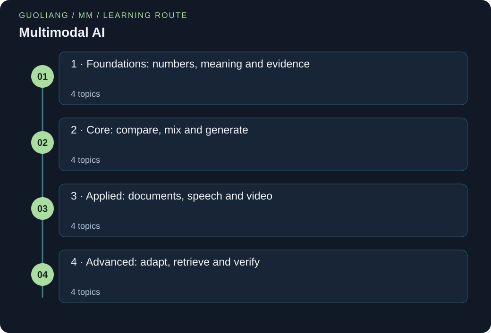

# Multimodal AI

> Leon | AI Field Guides

[EN](AI-MM.en.md) · [中文](AI-MM.zh.md)



Sixteen lessons explain how text, images, sound and video become useful evidence together. Begin with token IDs and small number lists, then build toward search, document QA, speech, video timing and evidence-aware generation. Every lesson includes runnable Python and answered teaching questions.

### Run the Python examples

Use Python 3.12 or newer. Save the code as a .py file. In a terminal, run `python filename.py`; some systems use `python3`. If the code contains `import numpy as np`, first run `python -m pip install numpy`. The import loads NumPy, a package for numeric arrays, and gives it the short name np. No dataset or model-weight downloads are needed.

[Official Python downloads](https://www.python.org/downloads/) · [Official NumPy installation guide](https://numpy.org/install/)

## A route through the ideas

Sixteen lessons connect multiple kinds of evidence. Start with tokens, representations and fusion. Explore CLIP, image search, captioning, document questions and speech. Then study video timing, instruction tuning, multimodal RAG, evaluation and efficient evidence handling. The examples use small original data to explain the mechanisms.

### Before you start

- High-school arithmetic, fractions and ordered lists of numbers
- Read the shared Python primer for lists, dictionaries, loops and indexing
- No linear algebra, calculus, pretrained downloads or model frameworks required

### What you will learn

- Distinguish shared representations, fusion, and generation
- Calculate similarity, attention, conditional loss, and temporal overlap
- Explain the original CLIP, LLaVA, BLIP-2, Whisper, and CLAP design choices
- Evaluate visual claims against observations and state what remains uncertain

## Knowledge framework

### 1 · Foundations: numbers, meaning and evidence

- [Tokens and embeddings: turn inputs into numbers](#tokens-embeddings)
- [Different observations, a shared coordinate system](#modalities-alignment)
- [Fusion: decide when evidence should meet](#early-late-fusion)
- [Audio and text: hearing words is one of several tasks](#audio-text-alignment)

### 2 · Core: compare, mix and generate

- [CLIP: learn by choosing the right partner](#clip-contrastive)
- [Cross-attention: ask one stream to inspect another](#cross-attention-fusion)
- [Image search: rank first, then inspect](#image-text-search)
- [Captioning and VQA: generate under visual conditions](#conditional-generation)

### 3 · Applied: documents, speech and video

- [Document questions: words need locations](#document-ocr-qa)
- [Speech tasks: words, speakers and errors](#speech-tasks)
- [Audio–video timing: line up the same event](#audio-video-sync)
- [Video: what happened, and when did it happen?](#video-temporal-grounding)

### 4 · Advanced: adapt, retrieve and verify

- [Visual instruction tuning: connect perception to a request](#visual-instruction-tuning)
- [Multimodal RAG: retrieve evidence before answering](#multimodal-rag)
- [Evaluation: fluent claims still need observable support](#evaluation-hallucination)
- [Efficient systems: spend work on useful evidence](#efficient-evidence-systems)

<a id="tokens-embeddings"></a>

## Tokens and embeddings: turn inputs into numbers

### 01 / The story

A school club wants to search a box of photographs using short descriptions. Before discussing a large model, Bo writes “red kite” on a card and asks what a computer should store. Giving each word an ID helps the computer look it up, but ID 7 is not seven times the meaning of ID 1.

Bo then assigns each token a small list of features and averages those lists to represent the card. The group can now compare a complete numerical example. They also notice what disappeared: “kite red” gets the same average. That small failure prepares them to ask how real models preserve order and learn useful representations.

### 02 / The concept

A token is a unit a model processes. In text it may be a word, word piece or punctuation. A tokenizer converts text into a sequence of such units. A vocabulary assigns each unit an integer ID. IDs are lookup addresses, not meaningful distances.

An embedding is a list of numbers used as a representation. In a learned system, training adjusts embedding values so they help with a task. A vector is just this ordered list; its dimension is its number of entries. For an image, a token can represent a small patch rather than a word.

We begin with a hand-written word table and take the average of two token vectors. This is pooling: combine several vectors into one. It is easy to inspect but discards order. Real tokenization and learned encoders do more, including handling words not present as whole entries.

### 03 / Put the concept to work

Learn the difference between an ID, a feature vector and an entire encoded input before using image–text search or a language model.

### 04 / How others use it

Use the original calculation and Python below to inspect the mechanism. The linked primary sources explain how full systems extend it. The story is an invented teaching scenario.

### 05 / The formula, unpacked

```text
mean_featureⱼ = (token₁ⱼ + token₂ⱼ + … + tokenₙⱼ) / n
```

n is the number of token vectors. j selects a feature position, such as first or second. Add values from the same position, then divide by how many tokens there are. All token vectors must have the same dimension, and n must be positive.

### 06 / Work through the numbers

Our invented table gives red=[1,0] and kite=[0,2]. The first mean entry is (1+0)/2=0.5. The second is (0+2)/2=1. The pooled vector is [0.5,1]. Reversing the words changes neither sum, showing that this representation cannot distinguish their order.

### Words to know

- **Token:** One unit in a model’s input or output sequence.

- **Embedding:** A list of numbers representing an input unit or observation.

- **Dimension:** The number of entries in a feature vector.

- **Pooling:** Combining several feature lists into one.

### Let us work through it

**Why not compare word IDs as meanings?**

IDs only identify lookup entries. Renumbering the vocabulary changes IDs without changing the words.

**Why is the second pooled entry one?**

The second entries are zero and two; (0+2)/2=1.

**Would reversing the tokens change this average?**

No. Addition ignores order, which is a limitation of this simple encoder.

### Look up and pool two tokens

A tiny English example uses only lists and a dictionary; the explanation applies to representations in any language.

```python
text = "red kite"
tokens = text.split()
vocabulary = {"red": 0, "kite": 1}
embedding_table = [[1.0, 0.0], [0.0, 2.0]]
ids = [vocabulary[token] for token in tokens]
vectors = [embedding_table[token_id] for token_id in ids]
pooled = [sum(vector[j] for vector in vectors) / len(vectors) for j in range(2)]
print("tokens:", tokens)
print("IDs:", ids)
print("pooled:", pooled)
```

**Run it locally**

```sh
python tokens-embeddings-toy-token-table.py
```

**Expected output**

```text
tokens: ['red', 'kite']
IDs: [0, 1]
pooled: [0.5, 1.0]
```

**Read the code step by step**

split separates at whitespace. The dictionary converts each token to an ID; square brackets look up a key or list position. The next comprehension retrieves each feature list. range(2) visits feature positions 0 and 1, sum adds matching entries and len gives two tokens. This is hand-set lookup and mean pooling, not a trained text encoder.

### Where you can use this

**Unknown word**

Change the sentence to “blue kite”. The lookup fails because blue is missing. Real tokenizers need an explicit unknown or subword strategy.

**Longer description**

Try “red red kite”. The pooled vector becomes [2/3,2/3]. Repetition changes the mean even though the described object may be the same.

**Where the analogy stops:** The toy features are invented, not learned meanings. Splitting on spaces is not a general tokenizer, especially for languages without spaces between words. Mean pooling alone loses order and many details.

**Keep this idea:** Learn the difference between an ID, a feature vector and an entire encoded input before using image–text search or a language model.

### Sources for this topic

- [Hugging Face: Tokenization algorithms](https://huggingface.co/docs/transformers/tokenizer_summary)

<a id="modalities-alignment"></a>

## Different observations, a shared coordinate system

### 01 / The story

A museum club inherits photographs of objects and separate written descriptions. Their shared ID numbers are lost. Searching a word finds descriptions, but not the matching photographs. Lin collects a small set of confirmed photograph–description pairs and uses them to teach a matching system.

A photograph can now suggest nearby descriptions in the system’s numerical representation, even when their wording differs. Volunteers still inspect the results: a decorative clock looks much like a compass. Several records are reunited, while uncertain matches stay unresolved. Lin learns that making observations comparable helps search. It does not make photographs and descriptions identical or prove that the suggested object name is correct.

### 02 / The concept

A modality is a kind of observation: a photograph, written words or a sound recording. Each records different evidence. An encoder turns one observation into a list of useful numbers, called an embedding. The token lesson explains how numbers can represent an input without being the input itself.

Alignment teaches image and text encoders to give related observations comparable representations. Matching list lengths is not enough: the coordinates must acquire compatible meanings through training. An image encoder’s first entry and an unrelated text encoder’s first entry do not automatically describe the same thing.

To compare nonzero embeddings, divide each by its length, then multiply corresponding entries and add. This is cosine similarity. It compares direction while removing overall size. A high score suggests a useful match under the learned representation. Grounding is more specific: linking a phrase to the actual region or time that supports it.

### 03 / Put the concept to work

For an archive search system, encode stored photographs once and compare their embeddings with an incoming text query. Maintain the original photographs beside the index so users can inspect evidence. Check whether captions describe appearance, function, or historical context: these supervision choices change what matching means. Separate evaluation by object identity and photography session so nearly identical images do not create misleading retrieval results.

### 04 / How others use it

The Hugging Face CLIP documentation describes separate image and text encoders whose outputs are projected into the same dimensional space. This is a concrete implementation of comparable representations. Our museum example uses that design as a retrieval pattern; it is an original teaching scenario, not a reported museum deployment. A production adaptation would still need corpus-specific checks for duplicates, ambiguous descriptions, and relevant details lost during image preprocessing.

### 05 / The formula, unpacked

```text
length(a) = √(a₁² + a₂²)
unit(a) = [a₁ / length(a), a₂ / length(a)]
similarity = unit(a)₁ × unit(b)₁ + unit(a)₂ × unit(b)₂
```

a and b are nonzero two-number embeddings for an image and a description. Subscripts select the first or second entry. Squaring multiplies a value by itself; √ takes a square root. unit(a) is a rescaled list with length 1. Similarity is between −1 and 1. With longer lists, include every entry in the squared sum and product sum. These equations compare given embeddings; training must first make them useful.

### 06 / Work through the numbers

Suppose an illustrative image encoder returns (3, 4). Its length is √(9 + 16) = 5, so the normalized image is (0.6, 0.8). Description A has embedding (0, 2), which normalizes to (0, 1). Its similarity is 0.6 × 0 + 0.8 × 1 = 0.8.

Description B has embedding (2, 0), giving normalized coordinates (1, 0) and similarity 0.6. The retrieval system therefore places A before B. Doubling A's raw embedding to (0, 4) changes its magnitude but leaves its normalized score at 0.8. None of these numbers means an 80 percent probability that A is factually correct. They show an ordering under a particular representation; a user must still inspect whether the matching description identifies the actual object.

### Words to know

- **Modality:** One form of observation, such as text, image or sound.

- **Encoder:** A process that turns input into useful feature numbers.

- **Alignment:** Learning useful correspondences between representations.

- **Cosine similarity:** A comparison of nonzero vector directions after removing length.

### Let us work through it

**Why are equal dimensions insufficient?**

Two lists can have the same length but encode unrelated meanings. Training must establish a correspondence.

**Why does [3,4] become [0.6,0.8]?**

Its length is √(9+16)=5. Dividing both entries by 5 gives those values.

**If A doubles in size, does its cosine score double?**

No. Its length doubles too, so unit(A) and similarity stay unchanged.

### Compare two descriptions

The feature lists are hand-set to isolate cosine similarity, not produced by a trained encoder.

```python
import math
def unit(values):
    length = math.sqrt(sum(x * x for x in values))
    if length == 0:
        raise ValueError("A zero vector has no direction")
    return [x / length for x in values]
image = unit([3, 4])
for name, values in [("A", [0, 2]), ("B", [2, 0])]:
    text = unit(values)
    similarity = sum(a * b for a, b in zip(image, text))
    print(f"{name}: {similarity:.2f}")
```

**Run it locally**

```sh
python modalities-alignment-cosine-alignment.py
```

**Expected output**

```text
A: 0.80
B: 0.60
```

**Read the code step by step**

def defines a reusable function. sum adds squared entries and math.sqrt gives length. The if guards division by zero. A list comprehension divides every entry by that length. The loop tests two named descriptions. zip pairs corresponding entries; multiplying and adding gives 0.80 and 0.60. These are ranking scores, not correctness probabilities.

### Where you can use this

**Zero list**

Try [0,0]. The function raises an explanatory error because a zero vector has no direction. Decide how a real system should handle missing evidence.

**Match versus proof**

A photo and “a brass compass” may rank closely even if the photo shows a clock. Check the visible dial before accepting identity.

**Where the analogy stops:** The archive analogy treats meanings as tidy categories, whereas learned coordinates can encode tangled correlations. A close match may reflect background scenery rather than the intended object. Alignment does not recover missing observations, establish object identity, or guarantee that every word in a description is supported by the image.

**Keep this idea:** A shared representation makes observations comparable only when training establishes useful correspondence; similarity remains a task-dependent score that requires evidence checks.

### Sources for this topic

- [Hugging Face: Hugging Face Transformers: CLIP model documentation](https://huggingface.co/docs/transformers/model_doc/clip)

- [OpenAI / arXiv: Learning Transferable Visual Models From Natural Language Supervision](https://arxiv.org/abs/2103.00020)

<a id="early-late-fusion"></a>

## Fusion: decide when evidence should meet

### 01 / The story

The nature club labels short pond recordings as “bird present” or “bird absent.” Sometimes the bird is hidden but audible. Sometimes it is visible and quiet. Kai first builds two separate checklists: one for the image and one for the sound. He combines their scores at the end.

This helps him notice disagreements, but it cannot explain whether a visible beak moved at the same moment as a chirp. He then considers combining the observations earlier so the system can compare their timing. Neither choice is automatically best. The club’s actual question determines whether independent evidence or detailed interaction is needed.

### 02 / The concept

Fusion means combining information from multiple modalities. Early fusion combines input features before the final decision. A simple version concatenates lists, meaning it places one list after another. A learned model can then use combinations of their entries.

Late fusion first makes separate predictions, then combines their scores. A weighted average is easy to inspect. It assumes the scores are suitable to combine and that the weights are chosen using development data. Missing audio should not silently become “evidence against a bird.”

Late fusion can reuse separate systems and reveal disagreement. Early or intermediate interactions can learn relationships across modalities, but require aligned examples and careful handling of missing inputs. Cross-attention, taught later, is one way to allow detailed interaction.

### 03 / Put the concept to work

Use simple fusion as a baseline for combining independent cues. Test missing modalities and disagreements before adding a complex interaction model.

### 04 / How others use it

Use the original calculation and Python below to inspect the mechanism. The linked primary sources explain how full systems extend it. The story is an invented teaching scenario.

### 05 / The formula, unpacked

```text
combined_score = α × image_score + (1−α) × audio_score
0 ≤ α ≤ 1
```

α, pronounced alpha, is the image weight. The audio weight is 1−α, so weights total one. Scores here are illustrative values on the same 0–1 scale; a shared range alone does not prove real systems are calibrated alike. Calibration concerns agreement between reported probabilities and observed frequencies.

### 06 / Work through the numbers

Image score 0.8, audio score 0.4 and α=0.75 give 0.75×0.8+0.25×0.4=0.6+0.1=0.7. Equal weights give 0.6. If audio is missing and only the image is used, renormalize the available weight so the result stays 0.8 rather than being artificially reduced.

### Words to know

- **Fusion:** Combining information from different observations.

- **Concatenation:** Joining lists end to end.

- **Missing modality:** An expected input stream is unavailable.

### Let us work through it

**Why not set missing audio to zero?**

Zero would act like an actual low score. Missing evidence means no observation, not a negative observation.

**Where does 0.7 come from?**

The image contributes 0.75×0.8=0.6 and audio contributes 0.25×0.4=0.1.

**Can late fusion check exact lip–sound timing?**

A single score per stream loses that detail. Temporal features or earlier interaction are needed.

### Combine only available evidence

Use two supplied scores and handle one missing modality.

```python
scores = {"image": 0.8, "audio": 0.4}
weights = {"image": 0.75, "audio": 0.25}
def fuse(available):
    total = sum(weights[name] for name in available)
    return sum(weights[name] * score for name, score in available.items()) / total
print(f"both={fuse(scores):.2f}")
print(f"image only={fuse({'image': 0.8}):.2f}")
print("early feature list:", [0.2, 0.9] + [0.6, 0.1])
```

**Run it locally**

```sh
python early-late-fusion-weighted-fusion.py
```

**Expected output**

```text
both=0.70
image only=0.80
early feature list: [0.2, 0.9, 0.6, 0.1]
```

**Read the code step by step**

Each dictionary names a score or weight. fuse sums weights for present keys only. items gives name–score pairs for the weighted sum; dividing by total makes available weights sum to one. The last + joins two lists, illustrating concatenation rather than numeric addition. The example assumes nonempty available evidence and positive total weight. It is a rule, not a trained multimodal model.

### Where you can use this

**Equal weights**

Change both weights to 0.5. Combined score becomes 0.6. Choose weights with validation examples, not by inspecting final test answers.

**Disagreeing cues**

Set audio to 0.0 while image stays 0.8. The average hides the disagreement; retain separate scores for review.

**Where the analogy stops:** Averaged scores are not automatically calibrated probabilities. A strong wrong modality can overwhelm the other. Concatenation alone does not teach the system to use either input.

**Keep this idea:** Use simple fusion as a baseline for combining independent cues. Test missing modalities and disagreements before adding a complex interaction model.

### Sources for this topic

- [Ngiam et al.: Multimodal Deep Learning](https://ai.stanford.edu/~ang/papers/icml11-MultimodalDeepLearning.pdf)

<a id="audio-text-alignment"></a>

## Audio and text: hearing words is one of several tasks

### 01 / The story

A school radio club wants to search old recordings. Searching a transcript finds spoken words, but misses clips containing only rain or a ringing bell. Luis makes a separate task: match each recording with a description of its sounds.

Before comparing features, he checks the audio timing. A four-second recording appears to last twelve seconds because someone changed the sample-rate label without changing the samples. He repairs that mistake, then compares the sound-search results with the original clips. The club now keeps word transcripts and sound descriptions as different kinds of evidence. Finding a bell-like clip does not automatically say when the bell rang or what a person said nearby.

### 02 / The concept

Sound is stored as a sequence of measurements over time, called waveform samples. Sample rate tells how many samples represent one second. A mono recording has one channel. Duration is sample count divided by sample rate. Resampling computes a new sequence at a new rate while preserving time; changing only the label does not do that.

An audio encoder may convert the waveform into a representation of changing sound frequencies, then into features. An audio–text model such as CLAP learns to compare sound with descriptions. Speech recognition, such as Whisper’s speech-to-text task, instead predicts spoken words.

A recording can contain a bell, speech and wind together. A transcript may preserve words but omit the bell. A sound-search embedding may retrieve “a ringing bell” without writing the speech or telling its exact time. Choose a task based on which evidence the user needs.

### 03 / Put the concept to work

Choose transcription when the desired evidence is spoken wording; choose a suitable audio–text retrieval model when the query describes a sound event. Preserve duration, channel handling, and the required sample rate throughout preprocessing. Evaluate overlapping sounds separately from clean single-source clips. If an event occupies only a brief part of a long recording, compare segment-level retrieval with one global embedding so a dominant background does not conceal it.

### 04 / How others use it

Whisper's original research and repository describe an encoder–decoder trained for speech tasks, including recognition and translation. The CLAP research used here trains audio and text encoders contrastively and evaluates text-to-audio retrieval and audio classification. These documented objectives support Emil's choice of different tools. Neither source establishes that a transcript preserves all non-speech events, and the retrieval example below is an invented vector calculation rather than a measured CLAP result.

### 05 / The formula, unpacked

```text
sample_count = sample_rate × duration
duration = sample_count / sample_rate
similarity = a₁b₁ + a₂b₂  (unit-length embeddings)
```

sample_rate is measured in samples per second; duration is in seconds. sample_count counts one channel. a and b are nonzero audio and text embeddings already normalized to length 1, as taught in the alignment lesson. Their paired products sum to cosine similarity. Audio sample count and embedding length describe different objects.

### 06 / Work through the numbers

A four-second mono recording sampled at 48,000 samples per second contains 192,000 samples. Properly resampling it to 16,000 samples per second gives 64,000 samples while preserving its four-second duration. Merely relabeling the original samples as 16,000 would instead imply twelve seconds, so that shortcut changes the signal's interpretation. Now suppose a retrieval encoder produces the unit audio vector (0.8, 0.6).

A candidate description has unit vector (0.6, 0.8), giving similarity 0.48 + 0.48 = 0.96. Another has vector (0, 1), giving 0.6. The first ranks higher in this two-candidate comparison. Its high score does not locate either sound within the clip, identify spoken words, or prove that every event in the description occurred; those conclusions require additional evidence or task-specific outputs.

### Words to know

- **Waveform:** A sequence of recorded sound measurements over time.

- **Sample rate:** The number of samples representing one second.

- **Resampling:** Computing samples for a new rate while preserving timing.

### Let us work through it

**Why cannot a transcript answer every sound question?**

It focuses on spoken words and may omit wind, bells or music.

**How many samples represent four seconds at 16 kHz?**

kHz means thousands per second, so 16000×4=64000 samples in one channel.

**Does similarity 0.96 locate the bell?**

No. A whole-clip score has no event boundaries by itself.

### Check the time before matching

Count samples and compare supplied unit embeddings.

```python
duration = 4
original_rate = 48000
new_rate = 16000
original_count = duration * original_rate
new_count = duration * new_rate
print("counts:", original_count, new_count)
print("wrong relabelled duration:", original_count / new_rate)
audio = [0.8, 0.6]
text = [0.6, 0.8]
print(f"similarity={sum(a * b for a, b in zip(audio, text)):.2f}")
```

**Run it locally**

```sh
python audio-text-alignment-audio-duration.py
```

**Expected output**

```text
counts: 192000 64000
wrong relabelled duration: 12.0
similarity=0.96
```

**Read the code step by step**

Multiplication counts 192000 original samples and 64000 required samples at the new rate. Dividing the old count by the new rate exposes the incorrect 12-second interpretation. zip pairs unit-embedding entries; products 0.48 and 0.48 sum to 0.96. The code neither resamples a waveform nor runs Whisper or CLAP; it checks timing and scoring arithmetic.

### Where you can use this

**Two-second clip**

Change duration to 2. Counts halve to 96000 and 32000, while correct duration remains two seconds at either rate.

**Words or events**

For “what was said?”, choose transcription. For “which clip contains rain?”, choose sound retrieval and inspect the returned audio.

**Where the analogy stops:** Emil can listen again and separate the requested events, while a global embedding can merge simultaneous sources or discard their order. A semantic match does not imply a faithful transcript, speaker identity, or precise timing. The simple sample-count equation also omits stereo channels, compression, windowing, and the spectral processing used by particular encoders.

**Keep this idea:** Match the audio objective to the question: retrieving a described sound, transcribing speech, and locating an event require different evidence and evaluation.

### Sources for this topic

- [OpenAI / arXiv: Robust Speech Recognition via Large-Scale Weak Supervision](https://arxiv.org/abs/2212.04356)

- [OpenAI: OpenAI Whisper: official architecture and usage documentation](https://github.com/openai/whisper)

- [arXiv: Large-scale Contrastive Language-Audio Pretraining with Feature Fusion and Keyword-to-Caption Augmentation](https://arxiv.org/abs/2211.06687)

<a id="clip-contrastive"></a>

## CLIP: learn by choosing the right partner

### 01 / The story

A repair club keeps photographs of spare parts and written labels. A search tool confuses a silver hinge with a silver latch. Mara makes small rounds of confirmed image–description pairs. In each round, the tool must choose the right description for every picture and the right picture for every description.

Calling all metal objects similar no longer solves the task. Mara includes confusing alternatives, then notices that two different labels actually name the same hinge. She corrects that accidental contradiction and checks new photographs. The club gets more useful candidates, but still inspects whether a part fits. Good matching needs both true partners and sensible alternatives.

### 02 / The concept

CLIP uses two encoders: one for images and one for text. It can encode stored images before a query arrives. During training, a batch contains known image–description pairs. The correct partner should score higher than other candidates in the batch.

Imagine a table whose rows are images and columns are descriptions. A correct pair sits on the diagonal when pairs have matching indices. The loss asks two questions: which description matches this image, and which image matches this description? CLIP averages both directions.

Softmax turns a row or column of scores into positive shares that total one. Divide similarities by a positive temperature first; a smaller temperature makes score differences more influential. A loss penalizes a small share for the correct partner. At use time, comparing an image with new label descriptions enables zero-shot classification for that target task. CLIP does not generate a caption by itself.

### 03 / Put the concept to work

For parts retrieval, cache image embeddings and rank them against encoded queries. Validate prompts with realistic synonyms and descriptions of confusing neighboring categories. Keep true duplicates together when splitting data, and check whether an apparent negative is another valid match. If the service must reject unsupported queries, evaluate an explicit rejection policy on held-out examples; the largest softmax score alone does not establish that a suitable part exists.

### 04 / How others use it

The original CLIP paper specifies a symmetric cross-entropy objective over image–text similarities. OpenAI's reference repository exposes separate image and text encoding and demonstrates comparison with candidate descriptions. Those public mechanisms explain efficient retrieval and label-based classification. They do not imply a caption decoder. The toy calculation below follows the objective's two directions with invented scores; it is not a result from a released checkpoint.

### 05 / The formula, unpacked

```text
scaled_score = cosine_similarity / temperature
p_correct = exp(correct_score) / sum of exp(candidate_scores)
loss_for_one_query = −ln(p_correct)
CLIP loss = average of image→text and text→image losses
```

exp(x) is e raised to x, where e≈2.718. ln is its inverse, the natural logarithm. p_correct is the correct partner’s share among the current candidates. The minus sign makes −ln(p) positive for p between zero and one; at p=1 it is zero. Each direction averages over its queries. “Temperature” is a score-scaling number, not physical heat.

### 06 / Work through the numbers

Take two pairs with cosine similarities arranged as [[0.8, 0.2], [0.1, 0.7]], and set τ = 0.2. The scaled matrix is [[4, 1], [0.5, 3.5]]. Each row has a correct-versus-incorrect gap of 3, so each correct row probability is 1/(1 + exp(−3)) ≈ 0.9526. Thus the image-to-text loss is about 0.0486.

For the first column the correct gap is 3.5, giving loss ln(1 + exp(−3.5)) ≈ 0.0298. For the second column it is 2.5, giving about 0.0789. The text-to-image average is therefore 0.0543, and the final symmetric loss is (0.0486 + 0.0543)/2 ≈ 0.0515. Row and column losses differ because their competing scores differ, even though both use the same matched pairs.

### Words to know

- **Contrastive learning:** Training with matching pairs and competing alternatives.

- **Temperature:** A positive scale controlling how strongly score gaps affect softmax.

- **Zero-shot classification:** Choosing target labels without task-specific labelled training examples.

### Let us work through it

**Why compare in both directions?**

An image competes among texts, while a text competes among images. The alternatives can differ.

**Why does 0.8 become 4?**

The temperature is 0.2, so 0.8/0.2=4.

**Does a large softmax share mean universal certainty?**

No. It depends on candidate descriptions and temperature; changing the list changes the share.

### Score the correct partners both ways

Use a two-pair similarity table to compute the stated loss.

```python
import math
similarity = [[0.8, 0.2], [0.1, 0.7]]
temperature = 0.2
scores = [[x / temperature for x in row] for row in similarity]
def loss(row, correct):
    weights = [math.exp(x - max(row)) for x in row]
    probability = weights[correct] / sum(weights)
    return -math.log(probability)
row_loss = sum(loss(row, i) for i, row in enumerate(scores)) / 2
columns = list(zip(*scores))
column_loss = sum(loss(column, i) for i, column in enumerate(columns)) / 2
print(f"image to text={row_loss:.4f}")
print(f"text to image={column_loss:.4f}")
print(f"combined={(row_loss + column_loss) / 2:.4f}")
```

**Run it locally**

```sh
python clip-contrastive-contrastive-table.py
```

**Expected output**

```text
image to text=0.0486
text to image=0.0543
combined=0.0515
```

**Read the code step by step**

Nested list comprehensions divide every table entry by temperature. loss subtracts the maximum before exp for stable arithmetic, then finds the correct share and its negative log. enumerate supplies each diagonal index. zip(*scores) groups entries by column: the star passes each row as a separate argument to zip. The two averages differ because competitors differ. This computes a loss on invented scores without training CLIP.

### Where you can use this

**Warmer temperature**

Set temperature to 1. The score gaps shrink, making the correct shares less concentrated. Compare the larger loss.

**False negative pair**

Imagine two captions both accurately describe the same image. Treating one as a wrong partner can create a misleading learning signal.

**Where the analogy stops:** Mara's rounds suggest every alternative is wrong, but real batches can contain several valid descriptions of similar images. Such false negatives complicate learning. The selected prompts also define the available choices. High relative confidence among unsuitable labels does not demonstrate calibration, factual correctness, or reliable recognition outside the evaluated domain.

**Keep this idea:** CLIP learns relative compatibility in two directions; its scores depend on the candidate set, temperature, and whether the assumed negatives are truly different.

### Sources for this topic

- [OpenAI / arXiv: Learning Transferable Visual Models From Natural Language Supervision](https://arxiv.org/abs/2103.00020)

- [OpenAI: OpenAI CLIP: official repository and usage examples](https://github.com/openai/CLIP)

- [Hugging Face: Hugging Face Transformers: CLIP model documentation](https://huggingface.co/docs/transformers/model_doc/clip)

<a id="cross-attention-fusion"></a>

## Cross-attention: ask one stream to inspect another

### 01 / The story

A model-boat club receives a photograph and the question “Which clamp is beside the bow?” A general caption lists wood, clamps and a workbench, but does not answer the question. Nadia uses the words in the question to inspect different parts of the picture.

She compares the clamp near the front of the boat with one lying loose on the table. The first location matters more for this question. Asked instead about the table, she would inspect the same image differently. Cross-attention provides a numerical way to change how information is mixed when the question changes. The calculation is useful, but its weights alone do not prove an answer is right.

### 02 / The concept

A question can change which image details matter. “What colour?” and “How many?” need different evidence. Cross-attention lets a query from one stream choose how much information to take from another stream.

Each candidate supplies a key for comparison and a value to mix. Multiply corresponding query and key entries and add to obtain a score. Divide by the square root of the number of entries in each key (its dimension), then use softmax to turn the scores into positive weights that total one. Multiply each value by its weight and add.

Unlike independent image and text embeddings, this interaction depends on the particular pair. It can combine detailed evidence but needs extra work per pair. The attention weights show a mixing operation. They do not by themselves prove why the final answer was produced or whether it is true.

### 03 / Put the concept to work

For a visual assistant, keep image patch representations available while the question is processed. This allows different question tokens or learned queries to gather different evidence. In a large archive, first retrieve a small candidate set with independent embeddings, then use a more expensive fusion model to rerank candidates. Measure whether added interaction actually improves difficult relations, rather than assuming a more elaborate connector must help.

### 04 / How others use it

The Transformer paper defines scaled dot-product attention and explains decoder attention to encoder outputs. BLIP-2 applies cross-attention in its Q-Former: learned queries extract information from frozen image features. These are specific public examples of the general mechanism. The boat story does not claim that attention weights reproduce human inspection, and the calculation isolates one attention head rather than the full residual, normalization, and multilayer computation of a deployed model.

### 05 / The formula, unpacked

```text
scoreⱼ = (q₁kⱼ₁ + q₂kⱼ₂) / √2
aⱼ = exp(scoreⱼ) / sum of exp(all scores)
output = a₁ × value₁ + a₂ × value₂
```

q is a two-number query. kⱼ is the key for candidate j. The subscript selects an entry or candidate. √2 is the square root of the number of key entries in this example. aⱼ is its mixing weight. Each value is also a list; multiply every entry by its weight before adding corresponding entries. exp raises e≈2.718 to the score.

### 06 / Work through the numbers

Consider one query Q = (1, 0), two keys (2, 0) and (0, 2), and value vectors (10, 0) and (0, 4). Here dₖ = 2, so the unscaled dot products 2 and 0 become logits √2 and 0 after division by √2. Exponentiation gives about 4.1133 and 1. Their normalized weights are therefore 0.8044 and 0.1956.

The weighted value is (0.8044 × 10, 0.1956 × 4), approximately (8.0443, 0.7823). If the query changes to (0, 1), the weights reverse and the output becomes approximately (1.9557, 3.2177). The same stored visual values now contribute differently because the request changed. This is selective mixing, not copying the most highly weighted patch, and neither coordinate is inherently a human-readable object label.

### Words to know

- **Query:** Numbers describing what the current step is looking for.

- **Key:** Numbers used to score the relevance of a candidate.

- **Value:** Information mixed using attention weights.

### Let us work through it

**Why let the question change the weights?**

Different questions need different image evidence, so fixed mixing can lose relevant details.

**Why are the raw scores two and zero?**

Multiply matching coordinates and add: 1×2+0×0=2; 1×0+0×2=0.

**If query becomes [0,1], what changes?**

The scores and weights reverse. The output becomes about [1.9557,3.2177].

### Let a query mix two values

All query, key and value lists are invented; this is one attention calculation.

```python
import math
query = [1, 0]
keys = [[2, 0], [0, 2]]
values = [[10, 0], [0, 4]]
scores = [sum(q * k for q, k in zip(query, key)) / math.sqrt(2) for key in keys]
weights = [math.exp(s - max(scores)) for s in scores]
weights = [w / sum(weights) for w in weights]
output = [sum(weight * value[j] for weight, value in zip(weights, values)) for j in range(2)]
print("weights:", [round(w, 4) for w in weights])
print("output:", [round(x, 4) for x in output])
```

**Run it locally**

```sh
python cross-attention-fusion-attention-mix.py
```

**Expected output**

```text
weights: [0.8044, 0.1956]
output: [8.0443, 0.7823]
```

**Read the code step by step**

The first comprehension makes one scaled dot-product score per key. Exponentials followed by division create weights summing to one. In the output comprehension, j selects output coordinate 0 then 1; zip pairs each weight with its value list. Each coordinate is a weighted sum. The output is [8.0443,0.7823], not a copied patch or an object label. No trained transformer is run.

### Where you can use this

**Equal evidence**

Set query=[0,0]. Both scores are zero and weights are 0.5, producing [5,2]. This is equal mixing, not certainty about either value.

**Inspect the evidence**

A high weight on a patch does not prove a stated object exists. Compare the final claim with the actual visible region.

**Where the analogy stops:** Nadia deliberately checks meaningful locations, whereas neural attention mixes learned vectors that may encode many overlapping properties. High weight does not prove causal importance or factual grounding. Information can also pass through residual connections and other layers, so displaying one attention map is not a complete account of the model's decision.

**Keep this idea:** Cross-attention makes information selection depend on a query; its weighted mixtures enable interaction but need separate tests of grounding and usefulness.

### Sources for this topic

- [arXiv: Attention Is All You Need](https://arxiv.org/abs/1706.03762)

- [Salesforce Research / arXiv: BLIP-2: Bootstrapping Language-Image Pre-training with Frozen Image Encoders and Large Language Models](https://arxiv.org/abs/2301.12597)

<a id="image-text-search"></a>

## Image search: rank first, then inspect

### 01 / The story

A school newspaper has hundreds of photographs with inconsistent file names. Lila wants an image of a red kite, but text search cannot find words inside the photographs. She imagines storing a feature list for each image and comparing them with a feature list for her query.

The first result is a red umbrella, which shares colour but not the requested object. She keeps several candidates visible instead of declaring the first one correct. A second, more detailed comparison can then inspect those candidates. The exercise turns a vague wish for “AI search” into concrete stages: prepare the index, rank candidates, review evidence and measure whether useful results appear near the top.

### 02 / The concept

An index is a stored collection prepared for search. With a dual encoder such as CLIP, encode images once and encode each text query when it arrives. Compare compatible, normalized embeddings and rank the scores. This is retrieval: return existing items, not newly generated pictures.

Top-k means the k highest-ranked candidates. A later reranker can inspect each shortlisted image and query together, often using more detailed interaction. Reusing image embeddings saves repeated work, but the stored vectors must match the encoder version used by the query.

Evaluate retrieval with checked relevant items. In this lesson, per-query Recall@k is the number of relevant items found in the first k divided by all relevant items for that query. Some benchmarks use a hit-rate convention with the same name, so report the exact definition.

### 03 / Put the concept to work

Use text-to-image retrieval for photo libraries and visual archives. Preserve original images and evaluate ambiguity, duplicates and the query’s actual intent.

### 04 / How others use it

Use the original calculation and Python below to inspect the mechanism. The linked primary sources explain how full systems extend it. The story is an invented teaching scenario.

### 05 / The formula, unpacked

```text
score(image) = sum of queryⱼ × imageⱼ
Recall@k = relevant items among first k / all relevant items
```

j selects a matching coordinate in already unit-length query and image vectors. k is a positive result count. “Relevant” is decided using a stated human-checked rule, not simply a high model score. The recall denominator must be positive.

### 06 / Work through the numbers

Let the unit query be [1,0]. Candidate vectors are kite=[0.8,0.6], umbrella=[1,0], and kite-detail=[0.6,0.8]. Their scores are 0.8, 1 and 0.6, so umbrella ranks first. If both kite items are relevant, top two contain one relevant item out of two: Recall@2=1/2=0.5. A score of one therefore need not mean the correct object.

### Words to know

- **Index:** Stored representations prepared for searching.

- **Top-k:** The k highest-ranked returned candidates.

- **Reranker:** A second comparison step applied to a shortlist.

### Let us work through it

**Why encode stored images once?**

Many queries can reuse their embeddings if image content, preprocessing and model version stay compatible.

**Why does umbrella get score one?**

Its supplied vector equals the query, so 1×1+0×0=1, even though relevance was checked as false.

**What does top three change?**

Both relevant items appear, so Recall@3 becomes one for this query. More results also demand more inspection.

### Find and check the top two

Use three supplied unit embeddings and independently checked relevance.

```python
query = [1.0, 0.0]
images = {"kite": [0.8, 0.6], "umbrella": [1.0, 0.0], "kite-detail": [0.6, 0.8]}
scores = {name: sum(q * x for q, x in zip(query, vector)) for name, vector in images.items()}
ranked = sorted(scores, key=scores.get, reverse=True)
top_two = ranked[:2]
relevant = {"kite", "kite-detail"}
recall = len(set(top_two) & relevant) / len(relevant)
print("ranking:", ranked)
print(f"Recall@2={recall:.2f}")
```

**Run it locally**

```sh
python image-text-search-search-ranking.py
```

**Expected output**

```text
ranking: ['umbrella', 'kite', 'kite-detail']
Recall@2=0.50
```

**Read the code step by step**

The dictionary comprehension computes a dot product for each image. sorted uses each name’s score and reverse=True puts the largest first. [:2] takes the first two entries. set removes repeated names, & finds relevant returned items, and len counts them. Recall is 0.50 despite a high-scoring first result. This is ranking arithmetic, not a trained image-search service.

### Where you can use this

**Changed encoder**

Imagine replacing only the query encoder. Equal vector length does not guarantee compatibility with the old index; rebuild or verify both sides together.

**Duplicate photo**

Add a duplicate of kite under a new name. Decide whether evaluation counts image files or unique scenes before claiming improved recall.

**Where the analogy stops:** The vectors are invented to expose a failure. They are not CLIP outputs. Ranking quality depends on learned features, preprocessing, query wording and the indexed collection.

**Keep this idea:** Use text-to-image retrieval for photo libraries and visual archives. Preserve original images and evaluate ambiguity, duplicates and the query’s actual intent.

### Sources for this topic

- [OpenAI: OpenAI CLIP: official repository and usage examples](https://github.com/openai/CLIP)

- [Hugging Face: Hugging Face Transformers: CLIP model documentation](https://huggingface.co/docs/transformers/model_doc/clip)

<a id="conditional-generation"></a>

## Captioning and VQA: generate under visual conditions

### 01 / The story

A museum club asks a picture-reading system how many handles a cup has. The system produces a smooth sentence about two handles, although the visible cup has one. Ren follows the response one token at a time. The model first preferred “two”, then continued with words that fit that choice.

Ren compares the sentence with the actual image and marks it wrong. He also checks a version trained with the verified answer “one handle”. That version receives a useful training signal, but still needs testing on new pictures. The exercise separates two questions: which words a model is likely to produce, and which words the visible evidence supports.

### 02 / The concept

Image captioning writes a description of a picture. Visual question answering (VQA) answers a question about it. Some VQA systems choose from fixed answers; others generate text. In a generating system, an encoder supplies visual information and a decoder predicts the next text token.

A token is a word or word piece, not necessarily a whole word. The decoder sees the image, the question and earlier tokens. It chooses a next token, adds it to the partial response, and repeats until an ending token or length limit. “Autoregressive” names this use of earlier outputs to make the next one.

During teacher-forced training, the earlier tokens come from the checked reference answer. During use they come from the model itself, so an early error can change later predictions. Multiplying next-token probabilities gives the probability of a specific response under the model. A likely response can still be visually wrong.

### 03 / Put the concept to work

Choose the output contract before choosing a decoder: a catalogue caption, an answer from a fixed vocabulary, or an open response serve different needs. Include difficult cases with occlusion, counting, and misleading question assumptions in evaluation. Compare answers after replacing or removing the image to detect language-only shortcuts. Keep image evidence available for review, especially when polished prose could hide a missing visual observation.

### 04 / How others use it

Hugging Face's image-captioning guide demonstrates image-conditioned text generation. Its VQA guide explicitly contrasts a ViLT classification head with generative answering using BLIP-2. These examples support the distinction between task and output mechanism: asking about an image does not dictate one architecture. Our calculation explains a generic autoregressive likelihood, not the exact tokenizer, loss masking, or decoding settings of every model in those guides.

### 05 / The formula, unpacked

```text
response_probability = p₁ × p₂ × … × p_T
mean_loss = −(ln p₁ + ln p₂ + … + ln p_T) / T
```

T is the number of tokens in the checked response, including an ending token here. pₜ is the model probability of the checked token at step t, given the image, question and preceding checked tokens. ln is natural logarithm, the inverse of exp. The minus sign makes unlikely correct tokens costly. The product does not assume tokens are independent: each probability already depends on previous tokens.

### 06 / Work through the numbers

Suppose a tiny illustrative tokenizer represents the checked answer as three tokens: one, handle, and an ending token. Under teacher forcing, their reference-token probabilities are 0.4, 0.5, and 0.9. The complete response probability is 0.4 × 0.5 × 0.9 = 0.18. Its summed negative log-likelihood is −ln(0.18) ≈ 1.7148, and the mean loss is 1.7148/3 ≈ 0.5716. Now imagine the incorrect sequence two, handles, and an ending token has conditional probabilities 0.5, 0.7, and 0.9.

Its probability is 0.315, larger than 0.18. The two first-token probabilities sum to 0.9, so they are compatible alternatives. A decoder could prefer the wrong sequence. Likelihood measures what the model predicts, while visual correctness must be established independently. Low loss on familiar references therefore does not certify accurate answers to new images.

### Words to know

- **Decoder:** A component that produces output tokens from context.

- **Autoregressive:** Predicting each next token using previous tokens.

- **Teacher forcing:** Using reference previous tokens during training.

### Let us work through it

**Why include earlier tokens?**

The next word depends on what has already been said; “one” and “two” can lead to different following words.

**How is 0.18 obtained?**

0.4×0.5=0.2, then 0.2×0.9=0.18.

**Does choosing the more probable response ensure accuracy?**

No. Here the wrong answer has higher probability; the visible object must decide correctness.

### Compare two possible responses

Supplied conditional probabilities isolate sequence scoring; no text or image model is loaded.

```python
import math
correct = [0.4, 0.5, 0.9]
incorrect = [0.5, 0.7, 0.9]
probability = math.prod(correct)
mean_loss = -sum(math.log(p) for p in correct) / len(correct)
print(f"correct probability={probability:.3f}")
print(f"incorrect probability={math.prod(incorrect):.3f}")
print(f"mean loss={mean_loss:.4f}")
```

**Run it locally**

```sh
python conditional-generation-response-probability.py
```

**Expected output**

```text
correct probability=0.180
incorrect probability=0.315
mean loss=0.5716
```

**Read the code step by step**

math.prod multiplies all entries. The generator takes the natural log of each checked-token probability; sum adds them and len supplies token count three. The negative average is 0.5716. The incorrect response scores 0.315 versus 0.180 for the correct one. These hand-set values demonstrate why model likelihood and visual truth need separate checks.

### Where you can use this

**Ending probability**

Change the final correct probability to 0.5. The response probability drops to 0.1; the end decision is part of the sequence.

**Fixed answer set**

For “red or blue?”, design a two-label classifier instead of a free-text response. Explain what flexibility is lost and what output becomes easier to check.

**Where the analogy stops:** Jules can deliberately distinguish visible evidence from hidden surfaces; a decoder may still complete a familiar linguistic pattern. The story therefore illustrates a desired workflow rather than an automatic guarantee of uncertainty awareness. Caption agreement, token likelihood, and answer fluency each measure something different from whether a particular visual claim is true.

**Keep this idea:** Conditional generation explains how an answer is produced; checking the conditioning evidence explains whether that answer deserves to be believed.

### Sources for this topic

- [Hugging Face: Hugging Face Transformers: image captioning](https://huggingface.co/docs/transformers/tasks/image_captioning)

- [Hugging Face: Hugging Face Transformers: visual question answering](https://huggingface.co/docs/transformers/tasks/visual_question_answering)

<a id="document-ocr-qa"></a>

## Document questions: words need locations

### 01 / The story

A student reads a scanned museum activity sheet. It has two columns: one gives a date, the other lists a room. A text extractor returns all the words but loses their arrangement. Asked “Which room is used on Friday?”, the system pairs Friday with the wrong number.

Min keeps a box around every recognised word and groups words on the same row. Now the relevant row can be shown beside the answer. She still checks uncertain characters against the scan. The repair shows that document understanding is not merely collecting words. Their position, reading order and relationship to the question can determine the answer.

### 02 / The concept

Document question answering combines page appearance, recognised text and a question. OCR supplies words, but layout supplies where they occur. A bounding box records left, top, right and bottom edges. Normalize coordinates to a chosen scale so page sizes can be compared.

Layout-aware models such as LayoutLM combine text and layout information; the paper also incorporates visual information. Our simpler example uses already recognised words and boxes. It selects every word whose vertical centre is within a fixed tolerance of a supplied target row position, then reads the selected words from left to right. This teaches evidence grouping rather than natural-language understanding.

A complete system must detect text, preserve page numbers, handle tables and choose an answer supported by a region. An unreadable cell should remain uncertain instead of being filled with a plausible value.

### 03 / Put the concept to work

Use text plus layout for scanned schedules, forms and document QA. Return the supporting page and region so the answer can be checked.

### 04 / How others use it

Use the original calculation and Python below to inspect the mechanism. The linked primary sources explain how full systems extend it. The story is an invented teaching scenario.

### 05 / The formula, unpacked

```text
normalized_x = 1000 × x / page_width
row_centre = (top + bottom) / 2
same_row if |row_centre − target_y| ≤ tolerance
```

x and page_width use the same pixel units. The chosen normalized range is 0–1000. top and bottom are vertical box edges. target_y is a known row centre in this toy example. tolerance is a permitted vertical distance in pixels. Vertical bars mean absolute value.

### 06 / Work through the numbers

A left edge at x=100 on a 500-pixel-wide page normalizes to 1000×100/500=200. Boxes with top 40 and bottom 60 have row centre 50. With target_y=50 and tolerance 5, that row is selected. A different row centred at 90 is 40 pixels away and is rejected.

### Words to know

- **Layout:** The arrangement of text and images on a page.

- **Bounding box:** A rectangle locating a word or region.

- **Evidence region:** The page area supporting an answer.

### Let us work through it

**Why are words alone insufficient?**

The same numbers can belong to different rows or columns; layout determines their relationships.

**Why is Room 8 excluded?**

Its centre is 90, so its distance from the target row at 50 is 40, above tolerance 5.

**Would increasing tolerance to 50 help?**

It would include both rooms and create ambiguity. A permissive grouping rule can mix unrelated evidence.

### Keep a word beside its row

Each tuple stores text and a box in pixel coordinates.

```python
words = [("Friday", (10, 40, 80, 60)), ("Room 3", (100, 40, 170, 60)), ("Room 8", (100, 80, 170, 100))]
target_y = 50
selected = []
for text, box in words:
    centre_y = (box[1] + box[3]) / 2
    if abs(centre_y - target_y) <= 5:
        selected.append((box[0], text))
selected.sort()
print("row:", [text for left, text in selected])
print("normalized x:", 1000 * 100 / 500)
```

**Run it locally**

```sh
python document-ocr-qa-document-row.py
```

**Expected output**

```text
row: ['Friday', 'Room 3']
normalized x: 200.0
```

**Read the code step by step**

The loop unpacks text and box. Indices 1 and 3 select top and bottom, whose average is row centre. abs and <= test vertical distance. append stores the left edge with each accepted word. sort orders by left edge; the final comprehension prints only text. The row is Friday, Room 3. These are supplied boxes, not OCR predictions.

### Where you can use this

**Larger page**

Double page width and x to 1000 and 200. Normalized x remains 200, showing how relative layout can be preserved.

**Unclear digit**

Imagine Room 3 is read as Room 8. Correct row grouping cannot fix the OCR mistake; keep the crop for a character check.

**Where the analogy stops:** The code is given OCR text and the target row; it does not recognise words, parse a question or implement LayoutLM. Slanted pages, merged cells and complex tables need richer layout handling.

**Keep this idea:** Use text plus layout for scanned schedules, forms and document QA. Return the supporting page and region so the answer can be checked.

### Sources for this topic

- [Xu et al.: LayoutLM: Pre-training of Text and Layout for Document Image Understanding](https://arxiv.org/abs/1912.13318)

- [Tesseract: Improving OCR output quality](https://tesseract-ocr.github.io/tessdoc/ImproveQuality.html)

<a id="speech-tasks"></a>

## Speech tasks: words, speakers and errors

### 01 / The story

The drama club records a rehearsal. A transcript says “bring the blue box”, but the actor said “bring the new box”. The sentence sounds natural, so reading it alone does not reveal the mistake. Asha listens to that moment and checks the word.

Another student wants to know when each person spoke, which the plain transcript does not answer. The club separates transcription from speaker-turn marking and from translating the dialogue into another language. They also count omitted and added words when evaluating the transcript. One clear task definition now replaces the assumption that a system which hears words correctly must understand every aspect of the recording.

### 02 / The concept

Automatic speech recognition (ASR) writes the words spoken in audio. Translation expresses meaning in another language. Speaker diarization marks who spoke when, usually as speaker labels rather than verified names. Sound-event recognition can identify a door slam even if nobody speaks. These tasks need different targets.

Word error rate (WER) evaluates a transcript by finding a minimum sequence of word substitutions, deletions and insertions needed to turn the reference into the prediction. Divide the number of edits by the reference word count. WER is not the same as sentence correctness or meaning preserved.

For a beginner calculation, we provide already checked edit counts. A full WER tool must find the best sequence alignment. Decide how punctuation, case and spoken numbers are normalized before comparing outputs. Keep original audio available for uncertain words.

### 03 / Put the concept to work

Use ASR for captions and searchable recordings, then evaluate words and timestamps according to the intended task. Keep translation and speaker labels separate.

### 04 / How others use it

Use the original calculation and Python below to inspect the mechanism. The linked primary sources explain how full systems extend it. The story is an invented teaching scenario.

### 05 / The formula, unpacked

```text
WER = (S + D + I) / N
```

S counts substituted words, D deleted reference words, and I inserted prediction words in a minimum edit alignment. N is the positive number of words in the reference. Insertions mean the ratio can exceed one; WER is not restricted to 0–100 percent.

### 06 / Work through the numbers

Reference “bring the new box” has N=4 words. Prediction “bring the blue box” changes new to blue, giving S=1, D=0, I=0 and WER=1/4=0.25. If a different checked example has N=2 and three insertions, WER=3/2=1.5. High insertions explain how the percentage can exceed 100.

### Words to know

- **ASR:** Turning spoken audio into written words.

- **Diarization:** Marking which speaker label is active at each time.

- **Insertion:** An extra predicted word absent from the aligned reference.

- **WER:** Minimum word-edit count divided by reference word count.

### Let us work through it

**Why check the audio when the sentence sounds natural?**

A fluent substitution can change the instruction while remaining grammatically valid.

**Why divide by four?**

The reference contains four words; its length is the denominator, not the predicted character count.

**Can WER exceed one?**

Yes. Many inserted words can make the edit count larger than the reference length.

### Count a changed word

Start with a manually checked one-substitution example.

```python
reference = "bring the new box".split()
substitutions, deletions, insertions = 1, 0, 0
wer = (substitutions + deletions + insertions) / len(reference)
print("reference words:", len(reference))
print(f"WER={wer:.2f}")
short_reference_count = 2
print(f"three insertions WER={3 / short_reference_count:.2f}")
```

**Run it locally**

```sh
python speech-tasks-word-error-rate.py
```

**Expected output**

```text
reference words: 4
WER=0.25
three insertions WER=1.50
```

**Read the code step by step**

split makes the four-word reference list; len counts its words. The next line assigns already verified edit counts. Add all edits before dividing by reference length. The last example gives 1.50 because insertions are not limited by reference length. These arithmetic examples do not implement speech recognition or a general edit-distance algorithm.

### Where you can use this

**Missing word**

For “bring the box” against the original reference, new is deleted. With one deletion, WER remains 0.25, although the error type changes.

**Who spoke**

Attach anonymous speaker A/B labels to time intervals. A correct transcript alone does not establish those labels or a person’s identity.

**Where the analogy stops:** The code calculates WER from supplied counts; it does not align arbitrary sentences or recognise speech. The same WER can hide very different meaning changes.

**Keep this idea:** Use ASR for captions and searchable recordings, then evaluate words and timestamps according to the intended task. Keep translation and speaker labels separate.

### Sources for this topic

- [Hugging Face: Automatic speech recognition](https://huggingface.co/docs/transformers/tasks/asr)

- [OpenAI / arXiv: Robust Speech Recognition via Large-Scale Weak Supervision](https://arxiv.org/abs/2212.04356)

<a id="audio-video-sync"></a>

## Audio–video timing: line up the same event

### 01 / The story

The film club records a hand clap with a camera and a separate recorder. In the edit, the hands meet before the clap is heard. Jin marks the visible contact and the sharp sound peak. He finds the sound is delayed by one sample in his simplified timeline and shifts the audio earlier.

He then checks another clap near the end. If the second event needed a different shift, a single offset would not fix the entire clip. The club learns to separate a constant delay from clocks drifting apart. Matching content is only the first step; observations must also refer to the same moment.

### 02 / The concept

Synchronisation aligns audio and video times. An offset is a constant time shift. Drift means the required shift changes over a longer recording. A visible impact and its sound can supply matching events, but not every sound has a visible source.

In a simple event timeline, store 1 where an event occurs and 0 elsewhere. Try several shifts and count aligned events by multiplying paired entries and adding. The best shift has the highest score. This resembles correlation, a way to compare sequences at different offsets.

SyncNet is a primary research example of learned audio–visual synchronisation using speech and visual information. Our binary clap sequence teaches offset bookkeeping only. Real speech needs suitable features, uncertainty handling and checks over time.

### 03 / Put the concept to work

Check synchronisation before combining lips, actions and sound in video editing or audio–visual retrieval. Validate offsets on multiple events.

### 04 / How others use it

Use the original calculation and Python below to inspect the mechanism. The linked primary sources explain how full systems extend it. The story is an invented teaching scenario.

### 05 / The formula, unpacked

```text
score(shift) = sum of visual[t] × audio[t + shift]
offset_seconds = shift × seconds_per_step
```

t is a timeline index. The sum uses only indices valid in both sequences. A positive shift here means the audio event appears later than the visual event, so alignment would move audio earlier. seconds_per_step converts an index difference to time. This explicit sign convention avoids ambiguous “shift left/right” instructions.

### 06 / Work through the numbers

Visual events [0,1,0,0,0] and audio events [0,0,1,0,0] disagree at shift 0, giving score 0. At shift 1, visual[1]=1 pairs with audio[2]=1, giving score 1. If each step is 0.1 seconds, the audio delay is 1×0.1=0.1 seconds. Shift it earlier by that amount under this convention.

### Words to know

- **Synchronisation:** Making observations refer to the same moments.

- **Offset:** A constant difference between two time axes.

- **Drift:** A timing difference that changes as recording continues.

### Let us work through it

**Why specify the sign of a shift?**

Different programs use opposite conventions. Here positive means audio is late, so correction moves it earlier.

**Which pair gives score one?**

At shift 1, visual position 1 and audio position 2 both contain one.

**Will one shift fix clock drift?**

No. Check events over time; a changing delay requires more than a single constant correction.

### Find a delayed clap

Binary event positions replace real audio and video features.

```python
visual = [0, 1, 0, 0, 0]
audio = [0, 0, 1, 0, 0]
scores = {}
for shift in [-1, 0, 1]:
    total = 0
    for t in range(len(visual)):
        j = t + shift
        if 0 <= j < len(audio):
            total += visual[t] * audio[j]
    scores[shift] = total
best_shift = max(scores, key=scores.get)
print("shift scores:", scores)
print(f"audio delay seconds={best_shift * 0.1:.1f}")
```

**Run it locally**

```sh
python audio-video-sync-sync-offset.py
```

**Expected output**

```text
shift scores: {-1: 0, 0: 0, 1: 1}
audio delay seconds=0.1
```

**Read the code step by step**

The outer loop tests three shifts; the inner loop visits video positions. j is the audio position to compare. The chained comparison checks its bounds before indexing. Multiplication counts a coincident pair of ones, and += accumulates it. max selects the shift with the highest score, giving +1 or 0.1 seconds of delay. This does not run SyncNet or alter media files.

### Where you can use this

**Sound arrives first**

Swap the two sequences. Best shift becomes −1, meaning the audio event is earlier under this convention.

**Repeated claps**

Make several equally spaced claps. Compare all shift scores; repeated patterns can create ambiguous peaks, so inspect more distinctive events.

**Where the analogy stops:** Repeated rhythms can give several plausible shifts. A constant background hum has little timing evidence. The unnormalized toy score is not a robust estimator for unequal or noisy streams.

**Keep this idea:** Check synchronisation before combining lips, actions and sound in video editing or audio–visual retrieval. Validate offsets on multiple events.

### Sources for this topic

- [Chung and Zisserman, Oxford VGG: SyncNet: Out of time, automated lip sync in the wild](https://robots.ox.ac.uk/~vgg/software/lipsync/)

<a id="video-temporal-grounding"></a>

## Video: what happened, and when did it happen?

### 01 / The story

A sports club searches a practice video for the moment a ball changes hands. To save work, the tool inspects one frame every two seconds. A quick pass happens between those frames, so the selected pictures never show it. Zoe notices the missing evidence before blaming the answer model.

She tries denser sampling and asks the tool for a start and end time rather than a label for the entire video. She compares the proposed interval with a checked interval and measures their overlap. The result now tells her how well the timing matches. She still watches the clip to confirm that the interval contains the requested action.

### 02 / The concept

A video is a sequence of images with timestamps. Looking at one frame every two seconds is sampling. It saves work but can miss a brief event between sampled instants. A model cannot inspect a frame that was never supplied.

Video classification names an activity for a whole clip. Temporal grounding answers where in time a requested event occurs. It returns a start and an end, such as “the cart turns from 4 to 8 seconds.” Averaging frame features can lose order: opening then closing differs from closing then opening.

To evaluate time boundaries, compare the predicted interval with a checked reference. Temporal IoU divides their shared duration by their combined duration, counting overlap once. This checks timing, not whether the action description is correct. Keep clips from the same recording in one data split to avoid near-duplicate leakage.

### 03 / Put the concept to work

Set a sampling policy according to the duration of events the application must detect, then test short events near sampling boundaries. Store timestamps alongside features so retrieved evidence can be played back. For a long demonstration, a coarse retrieval pass can identify candidate regions for denser inspection. Evaluate before-and-after queries separately from object-presence questions: a system can recognize a chair while misunderstanding the order of assembly steps.

### 04 / How others use it

The QVHighlights research formulates natural-language moment retrieval and highlight detection; its Moment-DETR model jointly predicts relevant temporal spans and saliency. The paper's input features are extracted every two seconds, a documented design choice rather than a universal sampling rule. Hugging Face's video-classification guide shows another task with clip sampling. Comparing these sources helps separate video preprocessing from the particular question, output, and evaluation being modeled.

### 05 / The formula, unpacked

```text
tₖ = kΔ,  0 ≤ k < D/Δ
I = max(0, min(pₑ, gₑ) − max(pₛ, gₛ))
U = (pₑ − pₛ) + (gₑ − gₛ) − I
tIoU = I / U
```

D is the video duration in seconds and Δ is a positive sampling interval. Integer k starts at zero, and tₖ is a sampled timestamp strictly before D. This rule samples instants, not complete clips. Predicted interval endpoints are pₛ and pₑ, while reference endpoints are gₛ and gₑ, all in seconds on the same timeline. Each end must exceed its start. I is intersection duration and U is union duration. The functions min, max, and the zero clamp prevent negative overlap; tIoU is temporal intersection over union, assuming U is positive.

### 06 / Work through the numbers

For D = 12 seconds and Δ = 2 seconds, the sampling rule keeps timestamps 0, 2, 4, 6, 8, and 10. An action occurring only from 5.2 to 5.7 seconds is absent from all six sampled instants; a model cannot inspect those missing frames through this representation. Now consider a separate, longer reference interval [4, 8] and a predicted interval [5, 9].

Their intersection lasts min(9, 8) − max(5, 4) = 3 seconds. Each interval lasts four seconds, so the union lasts 4 + 4 − 3 = 5 seconds. Temporal IoU is 3/5 = 0.6. This score quantifies boundary overlap, but does not establish that the prediction described the correct action or that the chosen sampling captured a shorter event inside the interval.

### Words to know

- **Timestamp:** A recorded time associated with a frame or event.

- **Temporal grounding:** Linking a query to supporting start and end times.

- **Sampling interval:** Time between selected observations.

### Let us work through it

**Why is the short event invisible in the sample?**

It occurs between 5.2 and 5.7 seconds, while the nearest selected frames are 4 and 6.

**Why is temporal union five seconds?**

Each interval is four seconds; their shared part is three, so 4+4−3=5.

**Would IoU one prove the action name correct?**

No. Identical time boundaries can still be paired with an incorrect action description.

### Sample a video and compare intervals

Use timestamps only, without any video files.

```python
timestamps = list(range(0, 12, 2))
short_event = (5.2, 5.7)
seen = any(short_event[0] <= t <= short_event[1] for t in timestamps)
predicted = (5, 9)
reference = (4, 8)
intersection = max(0, min(predicted[1], reference[1]) - max(predicted[0], reference[0]))
union = (predicted[1] - predicted[0]) + (reference[1] - reference[0]) - intersection
print("sample times:", timestamps)
print("short event sampled:", seen)
print(f"temporal IoU={intersection / union:.2f}")
```

**Run it locally**

```sh
python video-temporal-grounding-temporal-overlap.py
```

**Expected output**

```text
sample times: [0, 2, 4, 6, 8, 10]
short event sampled: False
temporal IoU=0.60
```

**Read the code step by step**

range starts at zero, stops before 12, and steps by two. any is True if at least one timestamp falls inside the short event; here none does. min of the ends and max of the starts find the shared interval. max with zero prevents a negative duration. Adding both lengths and subtracting overlap gives union five. This evaluates supplied intervals, not a video model.

### Where you can use this

**Finer sampling**

Try half-second timestamps from 0 to 11.5. The 5.5-second sample now falls inside the short event, at a higher observation cost.

**Order matters**

Compare “pick up then put down” with “put down then pick up”. The same collection of frames can hide this difference if order is discarded.

**Where the analogy stops:** Rina can revisit the original recording, while a model given only cached sparse frames cannot recover discarded visual evidence. Temporal overlap also treats seconds geometrically: two intervals can overlap well yet refer to different events. The example ignores audio cues and motion inside clips, both of which can materially change what observations are available.

**Keep this idea:** Video understanding depends on retained evidence and temporal order; locating an interval requires different outputs and checks from labeling an entire clip.

### Sources for this topic

- [arXiv: QVHighlights: Detecting Moments and Highlights in Videos via Natural Language Queries](https://arxiv.org/abs/2107.09609)

- [QVHighlights research authors: Moment-DETR: official code and QVHighlights data documentation](https://github.com/jayleicn/moment_detr)

- [Hugging Face: Hugging Face Transformers: video classification](https://huggingface.co/docs/transformers/tasks/video_classification)

<a id="visual-instruction-tuning"></a>

## Visual instruction tuning: connect perception to a request

### 01 / The story

A botanical garden club builds a tool that describes plant photographs. Visitors ask it to compare two leaves or read a sign, but it keeps giving a generic caption. Sora checks that image information can reach the language component. She then prepares examples with a picture, a clear request and a checked response.

She compares keeping the old components fixed with allowing selected parts to learn from the requests. A small trial follows the supported request types better, while uncertain plant names still go to a gardener. Sora learns that connecting picture features and teaching a response style are separate tasks. Neither removes the need to check the visible evidence.

### 02 / The concept

A visual encoder extracts image features. A language model works with text features. A connector translates between these numerical formats. Making the connector compatible is one task; teaching the system to follow image-based requests is another. Instruction tuning uses examples containing an image, a request and a desired response.

A frozen component keeps its learned weights unchanged. A trainable component can adjust them. In original LLaVA, an initial stage trains a projection connector. The later instruction stage updates the connector and language model while keeping the vision encoder fixed. BLIP-2 uses a different recipe: a small Q-Former learns to query a frozen image encoder and connect to a frozen language model during its two-stage pretraining. These are historical designs, not interchangeable names for one method.

To see freezing without calculus, hold one visual feature fixed and try two connector weights. Compare their errors against a chosen target. This illustrates what may change, but instruction training needs many examples and a suitable language loss.

### 03 / Put the concept to work

When adapting a visual assistant, record which components are frozen, which parameters receive updates, and which response tokens contribute to the loss. Build examples that require the image to answer the instruction, including carefully labeled uncertainty. Check whether the model follows formatting requests while ignoring the picture. Compare against the same system before adaptation so improvements in style are not mistaken for improvements in visual evidence use.

### 04 / How others use it

LLaVA's original paper and project describe visual instruction data and a simple projection-based interface. BLIP-2's paper describes learned queries that compress image features before a projection feeds the language model. Later systems with similar names can change these details, so this comparison is explicitly about the original papers. The formula below isolates connector adaptation with a toy squared-error objective; both papers use richer language and multimodal objectives, not this toy objective.

### 05 / The formula, unpacked

```text
connector_output = weight × fixed_feature
error = connector_output − target
toy_loss = error² / 2
```

fixed_feature is a number supplied by an unchanged visual encoder. weight is the adjustable connector multiplier. target is the illustrative desired output. error² squares the difference, so positive and negative errors are both penalized. The division by two is a convenient scaling. This is a scalar teaching loss, not LLaVA’s or BLIP-2’s full objective.

### 06 / Work through the numbers

Keep the visual feature at 2 and target at 1. With weight 1, output is 1×2=2, error is 2−1=1, and loss is 1²/2=0.5. Try weight 0.75.

Output becomes 1.5, error becomes 0.5, and loss becomes 0.5²/2=0.125. The feature remained 2 throughout. Only the connector changed. Choosing this better trial on one number does not establish instruction-following ability.

### Words to know

- **Connector:** A component mapping visual features into a compatible language format.

- **Frozen weights:** Weights kept unchanged during a training stage.

- **Instruction tuning:** Training on requests paired with desired responses.

### Let us work through it

**Why can output change when the visual encoder is frozen?**

The connector can change how it uses the same fixed feature.

**Why does 0.75 give loss 0.125?**

0.75×2=1.5, error=0.5, then 0.5²/2=0.125.

**Does zero toy loss imply good image answers?**

No. It only fits one invented scalar target. Language, perception and unseen tasks still need evaluation.

### Adjust a connector, keep the feature

Try two weights without any calculus or model library.

```python
fixed_feature = 2.0
target = 1.0
for weight in [1.0, 0.75]:
    output = weight * fixed_feature
    error = output - target
    loss = error ** 2 / 2
    print(f"weight={weight:.2f}; feature={fixed_feature:.1f}; loss={loss:.3f}")
```

**Run it locally**

```sh
python visual-instruction-tuning-frozen-feature.py
```

**Expected output**

```text
weight=1.00; feature=2.0; loss=0.500
weight=0.75; feature=2.0; loss=0.125
```

**Read the code step by step**

The feature and target are assigned once. The for loop tests two connector weights. Multiplication produces the output; subtraction produces the signed error; **2 squares it before dividing by two. Loss falls from 0.500 to 0.125 while the feature remains fixed. This is a trial comparison, not gradient training or a full visual instruction model.

### Where you can use this

**Exact toy fit**

Try weight 0.5. Output is 1 and loss zero. Then change the fixed feature to 4: the same weight no longer fits target 1.

**Training inventory**

For an imagined system, name encoder, connector and decoder, then mark which can change in each stage. Do not infer this from a product name.

**Where the analogy stops:** Sora's specialists sound like independent people, but neural modules exchange dense learned representations and can rely on fragile correlations. Freezing weights does not eliminate activation memory or all backward computation. Instruction tuning can teach a convincing response style without fixing perception, and this historical comparison should not be generalized to every later LLaVA or BLIP variant.

**Keep this idea:** Separate the connector, training data, and update policy: original LLaVA and BLIP-2 combine these ingredients differently, with different adaptation goals.

### Sources for this topic

- [arXiv: Visual Instruction Tuning](https://arxiv.org/abs/2304.08485)

- [LLaVA research team: LLaVA: original visual instruction tuning project](https://llava-vl.github.io/)

- [Salesforce Research / arXiv: BLIP-2: Bootstrapping Language-Image Pre-training with Frozen Image Encoders and Large Language Models](https://arxiv.org/abs/2301.12597)

<a id="multimodal-rag"></a>

## Multimodal RAG: retrieve evidence before answering

### 01 / The story

A science club keeps instruction sheets containing text and diagrams. A student asks which opening on a cardboard model should face upward. An answer based only on remembered wording may miss the arrow in the diagram. Priya retrieves the relevant page and keeps both its instruction text and the picture region.

She checks whether the selected evidence actually supports the direction, then writes an answer with a page reference. A nearby page uses similar words but describes a different model, so it is rejected. The workflow does not make mistakes impossible. It makes the evidence path visible and creates separate places to check retrieval, reading and the final claim.

### 02 / The concept

Retrieval-augmented generation (RAG) first retrieves information, then gives it to a generator as context for an answer. Multimodal RAG may retrieve text, images or page regions. The original RAG paper describes retrieval with generation for text; MuRAG is a primary example using an external image-and-text memory.

Split material into searchable chunks while retaining source IDs and page or region locations. A chunk is a small content unit, not a guaranteed fact. Retrieve candidates, check relevance, and answer only what their contents support. Similarity finds possible evidence; it does not certify an answer.

Evaluate stages separately. Did retrieval include the needed page? Was its diagram read correctly? Does the answer’s citation support the actual claim? If evidence is missing or conflicting, state that limitation. Retrieved text should be treated as source material, not instructions that can override the system’s task.

### 03 / Put the concept to work

Use multimodal retrieval for diagram-rich manuals, classroom notes and document collections. Preserve source regions and audit each generated claim.

### 04 / How others use it

Use the original calculation and Python below to inspect the mechanism. The linked primary sources explain how full systems extend it. The story is an invented teaching scenario.

### 05 / The formula, unpacked

```text
overlap_score = number of shared query and chunk terms
supported_answer = answer read from a checked retrieved source
citation = source_ID + page_or_region
```

Terms are lower-case words in this toy search. The overlap score counts distinct shared words. source_ID identifies the stored record. A page or region says where the evidence appears. The second line is a workflow condition, not a numerical guarantee; the example’s answer is a supplied checked field.

### 06 / Work through the numbers

Query terms are {model, opening, upward}. Page A contains all three, giving overlap 3. Page B contains only model, giving 1.

The toy retrieval chooses A. Its checked field says “arrow-marked opening” and stores page 2, region diagram-A. The answer must cite that region, not merely any page mentioning model.

### Words to know

- **RAG:** Retrieving source material and using it as context for an answer.

- **Chunk:** A small indexed unit that retains its source location.

- **Provenance:** Information tracing an answer back to its evidence.

### Let us work through it

**Why retain page and region IDs?**

They let the reader inspect the specific evidence rather than trust a general source name.

**Why does A score three?**

Its terms share model, opening and upward with the query, three distinct words.

**Does a top-ranked chunk guarantee an answer?**

No. It may mention the topic without containing the required fact, so the system needs an insufficient-evidence route.

### Return an answer with its evidence ID

Small dictionaries replace a real document store and a trained generator.

```python
query = set("model opening upward".split())
records = [
    {"id": "sheet-A", "terms": "model opening upward arrow", "answer": "arrow-marked opening", "page": 2, "region": "diagram-A"},
    {"id": "sheet-B", "terms": "model paint dry", "answer": None, "page": 3, "region": "paragraph-B"},
]
def overlap(record):
    return len(query & set(record["terms"].split()))
best = max(records, key=overlap)
print("retrieval score:", overlap(best))
if best["answer"] is not None:
    print("answer:", best["answer"])
    print("evidence:", best["id"], "page", best["page"], best["region"])
else:
    print("No checked answer in the retrieved evidence")
```

**Run it locally**

```sh
python multimodal-rag-retrieve-cite.py
```

**Expected output**

```text
retrieval score: 3
answer: arrow-marked opening
evidence: sheet-A page 2 diagram-A
```

**Read the code step by step**

split separates words and set keeps distinct terms. & finds shared terms; len turns them into a count. max calls overlap for each record and selects the highest count. The if requires a checked answer field before printing. The citation preserves the record, page and region. This toy routes supplied evidence and does not implement MuRAG or prove that word overlap establishes relevance.

### Where you can use this

**Missing answer**

Set A’s answer to None. Retrieval still succeeds but the program must report no checked answer rather than invent a direction.

**Conflicting pages**

Add a newer page with a different instruction. Keep versions and dates as metadata, then resolve which source applies before answering.

**Where the analogy stops:** The code uses word overlap and a checked answer field. It neither understands diagrams nor generates natural language from images. Real RAG can still retrieve the wrong page or misread correct evidence.

**Keep this idea:** Use multimodal retrieval for diagram-rich manuals, classroom notes and document collections. Preserve source regions and audit each generated claim.

### Sources for this topic

- [Lewis et al.: Retrieval-Augmented Generation for Knowledge-Intensive NLP Tasks](https://arxiv.org/abs/2005.11401)

- [Chen et al.: MuRAG: Multimodal Retrieval-Augmented Generator](https://arxiv.org/abs/2210.02928)

- [Xu et al.: LayoutLM: Pre-training of Text and Layout for Document Image Understanding](https://arxiv.org/abs/1912.13318)

<a id="evaluation-hallucination"></a>

## Evaluation: fluent claims still need observable support

### 01 / The story

A school archive tests captions for old photographs. One caption smoothly describes a dog beside a bicycle, but the picture contains no dog. Hana checks each object mention against the image and records which captions contain any unsupported object.

A shorter version makes fewer claims and fewer mistakes. It also omits many useful details, so Hana counts how many checked target objects each version mentions correctly. She reports both errors and coverage. The team can now see why saying less is not automatically better. It also reviews positions and actions separately, because naming real objects does not guarantee that the claimed relationship between them is correct.

### 02 / The concept

A fluent caption can contain an unsupported claim, such as naming a dog that is absent. This is a hallucination when the statement lacks support in the supplied evidence. Language habits can favour a plausible detail even when the image does not show it.

Audit both inventions and omissions. Counting unsupported object mentions measures one type of error. Counting captions with at least one such mention answers a different question. CHAIR is a published evaluation focused on object hallucination in captions. It does not cover every wrong count, relation, action or explanation.

A model that says almost nothing may have few unsupported mentions but provide little useful information. Report coverage of checked target objects separately. A written reference can itself omit visible objects, so define how people establish presence and handle alternative names. Keep empty-output and zero-denominator rules explicit.

### 03 / Put the concept to work

Keep a review table linking each important claim to the image region, timestamp, or explicit absence of supporting evidence. Combine automatic metrics with a defined annotation protocol and a checked sample of disagreements. Report performance separately for counting, relations, small objects, and misleading prompts. Compare output coverage alongside unsupported-claim rates so a shorter response is not automatically credited as a more capable visual assistant.

### 04 / How others use it

The CHAIR research introduced object-hallucination measures for image captions and examined why sentence similarity can miss visual errors. POPE evaluates object hallucination with questions about object presence, providing a different measurement setup. These sources motivate complementary checks, not a universal trust score. The calculation uses CHAIR's instance-level and sentence-level forms under an explicitly simplified annotation scheme; it does not reproduce either paper's benchmark results.

### 05 / The formula, unpacked

```text
CHAIRᵢ = H / M
CHAIRₛ = Cₕ / C
R = K / G
```

H is the number of hallucinated object mentions and M is the total number of object mentions under one fixed matching protocol. Cₕ is the number of captions containing at least one hallucinated object, and C is the total number of captions. Subscripts i and s indicate instance-level and sentence-level CHAIR. For a separate illustrative coverage measure, K counts correctly mentioned target objects and G counts all annotated target objects. R is that coverage ratio, not an additional CHAIR definition. Assume positive denominators, consistent synonym handling, and one counted mention per object within each caption.

### 06 / Work through the numbers

Suppose ten captions contain forty counted object mentions. Reviewers identify six unsupported mentions distributed across four captions. Instance-level CHAIR is 6/40 = 0.15, while sentence-level CHAIR is 4/10 = 0.40. The two values answer different questions: how many mentions are wrong, and how often a caption contains any such error. Suppose there are fifty annotated target objects and the remaining thirty-four mentions are distinct correct targets.

Coverage is then 34/50 = 0.68. A shorter revision contains twenty mentions, only one unsupported, in one of ten captions. Its CHAIR values improve to 0.05 and 0.10, but coverage drops to 19/50 = 0.38. That tradeoff is visible only because all three quantities are reported. These arithmetic results describe the invented audit, not an expected outcome for a particular model.

### Words to know

- **Hallucination:** A claim unsupported by the supplied evidence.

- **Coverage:** The fraction of checked target information successfully included.

- **Annotation protocol:** Rules for deciding and counting reference facts.

### Let us work through it

**Why measure omissions too?**

A blank or extremely short answer can avoid many errors while failing to tell the user what matters.

**Why do 0.15 and 0.40 differ?**

The first counts six bad mentions among forty mentions. The second counts four affected captions among ten captions.

**Does a missing reference word prove hallucination?**

No. A reference can omit a visible object. Inspect the image under a defined annotation protocol.

### Count unsupported mentions and coverage

Use an invented, already checked audit.

```python
mentions, unsupported = 40, 6
captions, captions_with_error = 10, 4
correct_distinct, target_objects = 34, 50
print(f"unsupported mention rate={unsupported / mentions:.2f}")
print(f"captions with errors={captions_with_error / captions:.2f}")
print(f"target coverage={correct_distinct / target_objects:.2f}")
print(f"short revision coverage={19 / target_objects:.2f}")
```

**Run it locally**

```sh
python evaluation-hallucination-claim-audit.py
```

**Expected output**

```text
unsupported mention rate=0.15
captions with errors=0.40
target coverage=0.68
short revision coverage=0.38
```

**Read the code step by step**

The first three lines name different populations: mentions, captions and distinct target objects. Each division uses its matching denominator. Rates are 0.15, 0.40 and 0.68. The last line shows that mentioning only 19 correct targets covers 0.38. These are checked count ratios; the code cannot judge image evidence or implement the full annotation protocol by itself.

### Where you can use this

**Shorter is not always better**

Compare the original coverage 34/50 with the short revision 19/50. Reduced invention must be weighed alongside lost useful facts.

**Relation error**

“The cup is under the book” can name two real objects and still be wrong. Add a relation check beyond object-presence counts.

**Where the analogy stops:** Bea's audit assumes reviewers can determine object presence reliably, which becomes difficult with occlusion, small regions, and incomplete annotations. A low object-hallucination rate does not verify relations, identity, or reasoning. Coverage depends on the chosen target inventory, and the simplified counting rules here must not be mistaken for a complete implementation of the published evaluation protocols.

**Keep this idea:** Evaluate both unsupported claims and retained useful evidence; reliable multimodal output must be grounded, informative, and honest about what the observations cannot establish.

### Sources for this topic

- [arXiv: Object Hallucination in Image Captioning](https://arxiv.org/abs/1809.02156)

- [arXiv: Evaluating Object Hallucination in Large Vision-Language Models](https://arxiv.org/abs/2305.10355)

<a id="efficient-evidence-systems"></a>

## Efficient systems: spend work on useful evidence

### 01 / The story

The school archive tries a question-answering tool on a small computer. Passing every page image to a detailed model is slow. Rowan first searches cached page representations, then sends only a few candidates for closer reading. The response arrives sooner, but one question’s needed diagram falls outside the shortlist.

Rowan checks retrieval recall before celebrating the speed gain. He also limits how much text is passed to the answer stage and keeps source IDs attached. The final design has a clear fallback when evidence is absent. Efficiency becomes a set of measured choices about what to keep, what to reuse and where extra inspection is worth its cost.

### 02 / The concept

A cascade uses a cheap first stage and a more expensive second stage. Dual-encoder retrieval can cache independent image embeddings. A detailed reranker or answerer then processes a shortlist. This can reduce repeated work, but anything discarded early cannot be used later.

A context budget limits how many text or visual tokens a stage can inspect. Larger images can preserve small details while using more tokens. Caching needs version checks: changed images, preprocessing or encoders can make stored features stale. Quantization reduces numeric precision, and its quality effect must also be tested.

Measure complete latency, memory and evidence recall rather than a single fast component. Let the system abstain, meaning explicitly decline to answer from insufficient evidence. Abstention is a policy choice to evaluate; a threshold on a similarity score is not automatically a calibrated confidence rule.

### 03 / Put the concept to work

Build efficient multimodal search and QA by reusing compatible features, measuring end-to-end cost and keeping an explicit insufficient-evidence response.

### 04 / How others use it

Use the original calculation and Python below to inspect the mechanism. The linked primary sources explain how full systems extend it. The story is an invented teaching scenario.

### 05 / The formula, unpacked

```text
full_cost = N × expensive_cost
cascade_cost = N × cheap_cost + k × expensive_cost
saved_fraction = 1 − cascade_cost / full_cost
```

N is the total number of candidates, k is the retained shortlist size, and costs use the same hypothetical unit per candidate. The formula assumes serial independent work and ignores overhead, caching setup and parallel hardware. saved_fraction describes this arithmetic comparison, not measured wall-clock acceleration.

### 06 / Work through the numbers

With N=100, expensive_cost=10 and cheap_cost=1, processing every item expensively costs 1000 units. Keeping k=5 gives 100×1+5×10=150 units. Saved fraction is 1−150/1000=0.85. This is an 85% reduction in stated toy cost. It is useful only if the shortlist preserves enough relevant evidence for the question.

### Words to know

- **Cascade:** A sequence of stages where later work uses earlier selected candidates.

- **Cache:** Stored results reused when their inputs and computation remain compatible.

- **Context budget:** The amount of input a stage is allowed to process.

- **Abstention:** Explicitly withholding an answer when evidence is insufficient.

### Let us work through it

**Why audit recall after making a shortlist?**

The answer stage cannot recover a relevant page that retrieval discarded.

**How does 150 arise?**

The cheap pass costs 100×1=100 and five detailed checks cost 5×10=50.

**Does fitting a token budget prove sufficient evidence?**

No. A small omitted diagram can contain the only answer. Budget and relevance are separate checks.

### Compare a full pass and a shortlist

Use hypothetical cost units and a simple evidence budget.

```python
candidate_count = 100
cheap_cost, expensive_cost = 1, 10
shortlist_size = 5
full_cost = candidate_count * expensive_cost
cascade_cost = candidate_count * cheap_cost + shortlist_size * expensive_cost
print("costs:", full_cost, cascade_cost)
print(f"saved fraction={1 - cascade_cost / full_cost:.2f}")
evidence_tokens = [80, 60, 90]
budget = 150
used = 0
kept = []
for index, count in enumerate(evidence_tokens):
    if used + count <= budget:
        kept.append(index)
        used += count
print("kept evidence indices:", kept, "tokens:", used)
```

**Run it locally**

```sh
python efficient-evidence-systems-cascade-budget.py
```

**Expected output**

```text
costs: 1000 150
saved fraction=0.85
kept evidence indices: [0, 1] tokens: 140
```

**Read the code step by step**

The first arithmetic compares assumed per-item costs. enumerate gives each evidence item an index and token count. The if checks whether adding it fits the remaining budget. append records accepted indices and += updates used tokens. Items 0 and 1 use 140 tokens, so item 2 is omitted. This greedy budget rule does not judge relevance or run a model; omitted evidence may be essential.

### Where you can use this

**Larger shortlist**

Set k=20. Toy cost becomes 300, leaving 70% saved. Check whether the extra candidates recover otherwise missed evidence.

**Essential last item**

Imagine item 2 holds the answer. The current budget policy fails despite using only 140 tokens; rank evidence by relevance and keep source IDs.

**Where the analogy stops:** The cost example is hypothetical, not a benchmark. More aggressive filtering can reduce recall. An apparently confident model can still misread retrieved evidence, so efficiency cannot replace factual checks.

**Keep this idea:** Build efficient multimodal search and QA by reusing compatible features, measuring end-to-end cost and keeping an explicit insufficient-evidence response.

### Sources for this topic

- [OpenAI: OpenAI CLIP: official repository and usage examples](https://github.com/openai/CLIP)

- [Chen et al.: MuRAG: Multimodal Retrieval-Augmented Generator](https://arxiv.org/abs/2210.02928)

- [ONNX Runtime: Quantize ONNX models](https://onnxruntime.ai/docs/performance/model-optimizations/quantization.html)

- [arXiv: Evaluating Object Hallucination in Large Vision-Language Models](https://arxiv.org/abs/2305.10355)

## The reference desk

### [Tokens and embeddings: turn inputs into numbers](#tokens-embeddings)

Learn the difference between an ID, a feature vector and an entire encoded input before using image–text search or a language model.

### [Different observations, a shared coordinate system](#modalities-alignment)

A shared representation makes observations comparable only when training establishes useful correspondence; similarity remains a task-dependent score that requires evidence checks.

### [Fusion: decide when evidence should meet](#early-late-fusion)

Use simple fusion as a baseline for combining independent cues. Test missing modalities and disagreements before adding a complex interaction model.

### [Audio and text: hearing words is one of several tasks](#audio-text-alignment)

Match the audio objective to the question: retrieving a described sound, transcribing speech, and locating an event require different evidence and evaluation.

### [CLIP: learn by choosing the right partner](#clip-contrastive)

CLIP learns relative compatibility in two directions; its scores depend on the candidate set, temperature, and whether the assumed negatives are truly different.

### [Cross-attention: ask one stream to inspect another](#cross-attention-fusion)

Cross-attention makes information selection depend on a query; its weighted mixtures enable interaction but need separate tests of grounding and usefulness.

### [Image search: rank first, then inspect](#image-text-search)

Use text-to-image retrieval for photo libraries and visual archives. Preserve original images and evaluate ambiguity, duplicates and the query’s actual intent.

### [Captioning and VQA: generate under visual conditions](#conditional-generation)

Conditional generation explains how an answer is produced; checking the conditioning evidence explains whether that answer deserves to be believed.

### [Document questions: words need locations](#document-ocr-qa)

Use text plus layout for scanned schedules, forms and document QA. Return the supporting page and region so the answer can be checked.

### [Speech tasks: words, speakers and errors](#speech-tasks)

Use ASR for captions and searchable recordings, then evaluate words and timestamps according to the intended task. Keep translation and speaker labels separate.

### [Audio–video timing: line up the same event](#audio-video-sync)

Check synchronisation before combining lips, actions and sound in video editing or audio–visual retrieval. Validate offsets on multiple events.

### [Video: what happened, and when did it happen?](#video-temporal-grounding)

Video understanding depends on retained evidence and temporal order; locating an interval requires different outputs and checks from labeling an entire clip.

### [Visual instruction tuning: connect perception to a request](#visual-instruction-tuning)

Separate the connector, training data, and update policy: original LLaVA and BLIP-2 combine these ingredients differently, with different adaptation goals.

### [Multimodal RAG: retrieve evidence before answering](#multimodal-rag)

Use multimodal retrieval for diagram-rich manuals, classroom notes and document collections. Preserve source regions and audit each generated claim.

### [Evaluation: fluent claims still need observable support](#evaluation-hallucination)

Evaluate both unsupported claims and retained useful evidence; reliable multimodal output must be grounded, informative, and honest about what the observations cannot establish.

### [Efficient systems: spend work on useful evidence](#efficient-evidence-systems)

Build efficient multimodal search and QA by reusing compatible features, measuring end-to-end cost and keeping an explicit insufficient-evidence response.

## Official tutorials & original research

Original stories, explanations and examples by Leon. The linked tutorials and research belong to their respective authors; these independent companions are not official translations or endorsed courses.

- [Hugging Face Transformers: CLIP model documentation](https://huggingface.co/docs/transformers/model_doc/clip) — Hugging Face

- [Learning Transferable Visual Models From Natural Language Supervision](https://arxiv.org/abs/2103.00020) — OpenAI / arXiv

- [OpenAI CLIP: official repository and usage examples](https://github.com/openai/CLIP) — OpenAI

- [Attention Is All You Need](https://arxiv.org/abs/1706.03762) — arXiv

- [Hugging Face Transformers: image captioning](https://huggingface.co/docs/transformers/tasks/image_captioning) — Hugging Face

- [Hugging Face Transformers: visual question answering](https://huggingface.co/docs/transformers/tasks/visual_question_answering) — Hugging Face

- [BLIP-2: Bootstrapping Language-Image Pre-training with Frozen Image Encoders and Large Language Models](https://arxiv.org/abs/2301.12597) — Salesforce Research / arXiv

- [Visual Instruction Tuning](https://arxiv.org/abs/2304.08485) — arXiv

- [LLaVA: original visual instruction tuning project](https://llava-vl.github.io/) — LLaVA research team

- [Robust Speech Recognition via Large-Scale Weak Supervision](https://arxiv.org/abs/2212.04356) — OpenAI / arXiv

- [OpenAI Whisper: official architecture and usage documentation](https://github.com/openai/whisper) — OpenAI

- [Large-scale Contrastive Language-Audio Pretraining with Feature Fusion and Keyword-to-Caption Augmentation](https://arxiv.org/abs/2211.06687) — arXiv

- [QVHighlights: Detecting Moments and Highlights in Videos via Natural Language Queries](https://arxiv.org/abs/2107.09609) — arXiv

- [Moment-DETR: official code and QVHighlights data documentation](https://github.com/jayleicn/moment_detr) — QVHighlights research authors

- [Hugging Face Transformers: video classification](https://huggingface.co/docs/transformers/tasks/video_classification) — Hugging Face

- [Object Hallucination in Image Captioning](https://arxiv.org/abs/1809.02156) — arXiv

- [Evaluating Object Hallucination in Large Vision-Language Models](https://arxiv.org/abs/2305.10355) — arXiv

- [Tokenization algorithms](https://huggingface.co/docs/transformers/tokenizer_summary) — Hugging Face

- [Multimodal Deep Learning](https://ai.stanford.edu/~ang/papers/icml11-MultimodalDeepLearning.pdf) — Ngiam et al.

- [LayoutLM: Pre-training of Text and Layout for Document Image Understanding](https://arxiv.org/abs/1912.13318) — Xu et al.

- [Improving OCR output quality](https://tesseract-ocr.github.io/tessdoc/ImproveQuality.html) — Tesseract

- [Automatic speech recognition](https://huggingface.co/docs/transformers/tasks/asr) — Hugging Face

- [SyncNet: Out of time, automated lip sync in the wild](https://robots.ox.ac.uk/~vgg/software/lipsync/) — Chung and Zisserman, Oxford VGG

- [Retrieval-Augmented Generation for Knowledge-Intensive NLP Tasks](https://arxiv.org/abs/2005.11401) — Lewis et al.

- [MuRAG: Multimodal Retrieval-Augmented Generator](https://arxiv.org/abs/2210.02928) — Chen et al.

- [Quantize ONNX models](https://onnxruntime.ai/docs/performance/model-optimizations/quantization.html) — ONNX Runtime
