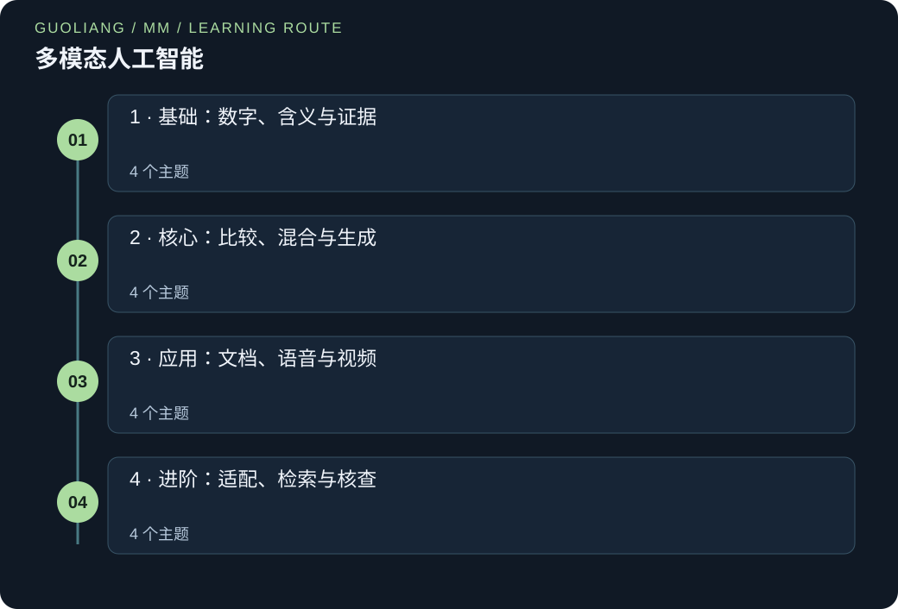

# 多模态人工智能

> Guoliang | AI Field Guides

[EN](AI-MM.en.md) · [中文](AI-MM.zh.md)



十六课解释文字、图像、声音与视频如何共同提供有用证据。从词元编号和小型数值列表出发，逐步进入搜索、文档问答、语音、视频时序及依据证据生成。每课都有可运行 Python 与已解答教学问题。

### 运行 Python 示例

使用 Python 3.12 或更新版本。把代码保存为 .py 文件，在终端中用 `python 文件名.py` 运行；部分系统使用 `python3`。若出现 `import numpy as np`，先运行 `python -m pip install numpy`。这行 import 加载 NumPy 数值工具包，并把它简称为 np。示例无需下载数据集或模型权重。

[Python 官方下载](https://www.python.org/downloads/) · [NumPy 官方安装说明](https://numpy.org/install/)

## 把知识连接起来

十六节课把多种证据连接起来。先学习词元、表示和融合，再探索 CLIP、图像检索、图像描述、文档问答与语音。随后学习视频时序、指令微调、多模态 RAG、评估和高效证据处理。示例使用少量原创数据来解释机制。

### 开始前需要了解

- 高中算术、分数与有序数值列表
- 列表、字典、循环、索引可先读共享 Python 入门
- 不要求线性代数、微积分、预训练下载或模型框架

### 你将学到什么

- 区分共享表征、信息融合与生成
- 计算相似度、注意力、条件损失与时间重叠
- 解释原始 CLIP、LLaVA、BLIP-2、Whisper 与 CLAP 的设计选择
- 依据观察评估视觉陈述，并说明仍然存在的不确定性

## 知识框架

### 1 · 基础：数字、含义与证据

- [词元与嵌入：把输入变成数字](#tokens-embeddings)
- [不同的观察，共享的坐标系](#modalities-alignment)
- [融合：决定证据何时相遇](#early-late-fusion)
- [音频与文本：听出文字只是其中一种任务](#audio-text-alignment)

### 2 · 核心：比较、混合与生成

- [CLIP：通过选择正确伙伴来学习](#clip-contrastive)
- [交叉注意力：让一条信息流查询另一条](#cross-attention-fusion)
- [图像搜索：先排序，再检查](#image-text-search)
- [图像描述与视觉问答：在视觉条件下生成](#conditional-generation)

### 3 · 应用：文档、语音与视频

- [文档问答：文字也需要位置](#document-ocr-qa)
- [语音任务：文字、说话人及错误](#speech-tasks)
- [音画时序：对齐同一事件](#audio-video-sync)
- [视频：发生了什么，又发生在什么时候？](#video-temporal-grounding)

### 4 · 进阶：适配、检索与核查

- [视觉指令微调：把感知连接到请求](#visual-instruction-tuning)
- [多模态 RAG：先找证据，再回答](#multimodal-rag)
- [评估：流畅的陈述仍需要可观察的支持](#evaluation-hallucination)
- [高效系统：把计算用在有用证据上](#efficient-evidence-systems)

<a id="tokens-embeddings"></a>

## 词元与嵌入：把输入变成数字

### 01 / 从一个完整故事开始

学校社团想用短说明搜索一箱照片。讨论大模型前，小博在卡片上写下“red kite”，思考电脑应保存什么。给每词一个编号便于查表，但编号 7 并不表示意义是编号 1 的七倍。

他再给每个词元分配小型特征列表，将其平均来表示卡片。大家因此能比较一个完整数值例子，也发现丢失了什么：“kite red”得到同样平均值。这个小失败让他们开始理解真实模型为何要保留顺序、学习有用表示。

### 02 / 理解核心概念

词元是模型处理的单位。文本中可以是词、词的一部分或标点。分词器把文字转换成这种单位的序列，词表为每个单位分配整数 ID。ID 是查表地址，不是有意义的距离。

嵌入是用作表示的一组数。在学习系统里，训练调整这些数，使其有助于任务。向量就是这种有序列表，维度就是元素数。图像词元可表示小图像块而非词。

我们先手写词表，把两个词元向量取平均。这称为池化：将多个向量组合成一个。它容易观察，却丢失顺序。真实分词与学习编码器还做更多工作，包括处理词表中没有整词条目的词。

### 03 / 如何运用这个概念

使用图文搜索或语言模型前，先区分 ID、特征向量与整个输入的编码。

### 04 / 官方教程与研究中的应用

用下面的原创计算与 Python 代码观察机制。所链接的一手资料解释完整系统怎样扩展这些机制。故事是虚构的教学情境。

### 05 / 公式与逐项解析

```text
mean_featureⱼ = (token₁ⱼ + token₂ⱼ + … + tokenₙⱼ) / n
```

n 是词元向量数。j 选择第一或第二等特征位置。把相同位置的值相加，再除以词元数。所有词元向量必须同维，且 n 为正。

### 06 / 一步步算出结果

教学表给 red=[1,0]、kite=[0,2]。平均第一项为 (1+0)/2=0.5，第二项为 (0+2)/2=1，池化向量为 [0.5,1]。交换词序不改变两项和，说明这种表示无法区分顺序。

### 先认识这些词

- **词元:** 模型输入或输出序列中的一个单位。

- **嵌入:** 表示输入单位或观察的一组数字。

- **维度:** 特征向量中的元素数量。

- **池化:** 将多个特征列表组合成一个。

### 一步步想清楚

**为什么不能用词 ID 比较含义？**

ID 只标识查表条目。重新编号会改 ID，却不改变词。

**平均向量第二项为什么是一？**

第二项分别是零与二，(0+2)/2=1。

**颠倒词元顺序会改变平均值吗？**

不会。加法忽略顺序，这是简单编码器的局限。

### 查表并汇总两个词元

小型英文例子只使用列表与字典，其表示原理适用于任何语言。

```python
text = "red kite"
tokens = text.split()
vocabulary = {"red": 0, "kite": 1}
embedding_table = [[1.0, 0.0], [0.0, 2.0]]
ids = [vocabulary[token] for token in tokens]
vectors = [embedding_table[token_id] for token_id in ids]
pooled = [sum(vector[j] for vector in vectors) / len(vectors) for j in range(2)]
print("tokens:", tokens)
print("IDs:", ids)
print("pooled:", pooled)
```

**在本地运行**

```sh
python tokens-embeddings-toy-token-table.py
```

**预期输出**

```text
tokens: ['red', 'kite']
IDs: [0, 1]
pooled: [0.5, 1.0]
```

**逐步读懂代码**

split 按空白分开。字典把每个词元转为 ID；方括号查询键或列表位置。下一推导式取得每个特征列表。range(2) 遍历特征位置 0、1，sum 累加同位置元素，len 给出两个词元。这是手设查表与均值池化，不是训练文本编码器。

### 这些知识可以用在哪里

**未知词**

改为“blue kite”。查表失败，因为缺少 blue。真实分词器需要明确未知词或子词策略。

**更长说明**

试“red red kite”。平均向量变为 [2/3,2/3]。即使描述同一物体，重复仍会改变均值。

**类比的边界与注意事项:** 教学特征是虚构的，不是学到的含义。按空格切分不是通用分词器，尤其不适用于词间没有空格的语言。只取均值会丢失顺序与许多细节。

**记住这一点:** 使用图文搜索或语言模型前，先区分 ID、特征向量与整个输入的编码。

### 本节资料来源

- [Hugging Face: 分词算法](https://huggingface.co/docs/transformers/tokenizer_summary)

<a id="modalities-alignment"></a>

## 不同的观察，共享的坐标系

### 01 / 从一个完整故事开始

博物馆社收到物体照片与独立说明，但共同编号丢失。搜索词只能找到说明，不能找到相应照片。林整理少量已确认图文对，用它们教匹配系统。

现在照片能在系统的数值表示中找到相近说明，即使用词不同。志愿者仍检查结果，因为装饰钟看起来很像指南针。几份记录重新配对，不确定项保留未决。林发现，让观察可比较能帮助搜索，但不代表照片与说明完全相同，也不证明推荐物体名正确。

### 02 / 理解核心概念

模态是一种观察形式，例如照片、文字或录音。它们记录不同证据。编码器把观察转成有用数值列表，称为嵌入。词元课程说明数字怎样表示输入，而不等于输入本身。

对齐通过训练，让相关图像与文字获得可比较的表示。列表长度相同并不足够，坐标含义必须通过训练变得兼容。图像编码器第一项与无关文本编码器第一项不会自动描述相同内容。

比较非零嵌入时，先各除以自身长度，再把对应元素相乘相加，得到余弦相似度。它去掉整体大小影响，只比较方向。高分表示在这种学习表示下可能匹配。定位依据更具体：把短语连接到真正支持它的区域或时间。

### 03 / 如何运用这个概念

对于档案搜索系统，可以预先编码库存照片，再把它们的嵌入与新输入的文本查询比较。在索引之外保留原始照片，让用户能够检查证据。还应核查说明描述的是外观、用途还是历史背景，因为这些监督信号会改变匹配的含义。评估时按物件身份与拍摄场次划分数据，避免几乎相同的照片造成误导性的检索结果。

### 04 / 官方教程与研究中的应用

Hugging Face 的 CLIP 文档描述了独立的图像编码器与文本编码器，它们的输出被投影到维度相同的空间。这是实现可比较表征的一种具体方式。博物馆例子把这种设计用作检索模式；它是原创教学情境，并不是已报道的博物馆部署案例。真正用于业务时，仍需针对具体档案检查重复内容、含糊说明，以及图像预处理过程中丢失的重要细节。

### 05 / 公式与逐项解析

```text
length(a) = √(a₁² + a₂²)
unit(a) = [a₁ / length(a), a₂ / length(a)]
similarity = unit(a)₁ × unit(b)₁ + unit(a)₂ × unit(b)₂
```

a、b 是图像与说明的非零双数嵌入。下标选择第一或第二项。平方是数乘自身，√ 表示开方。unit(a) 是缩放到长度 1 的列表。相似度在 −1 到 1。列表更长时，平方和与乘积和包含每一项。公式只比较已有嵌入，必须先训练才可能有用。

### 06 / 一步步算出结果

假设教学示例中的图像编码器输出 (3, 4)。其长度为 √(9 + 16) = 5，因此归一化后的图像向量为 (0.6, 0.8)。说明 A 的嵌入是 (0, 2)，归一化后得到 (0, 1)。相似度为 0.6 × 0 + 0.8 × 1 = 0.8。说明 B 的嵌入是 (2, 0)，归一化坐标为 (1, 0)，相似度为 0.6。

因此检索系统把 A 排在 B 前面。把 A 的原始嵌入加倍为 (0, 4)，只会改变向量大小，归一化分数仍是 0.8。这些数字并不表示 A 有百分之八十的概率在事实层面正确。它们只说明在特定表征下的排序；用户仍须检查匹配说明是否确实指向实际物件。

### 先认识这些词

- **模态:** 文字、图像、声音等一种观察形式。

- **编码器:** 把输入变为有用特征数的过程。

- **对齐:** 学习不同表示之间有用对应关系。

- **余弦相似度:** 去掉长度影响后比较非零向量方向。

### 一步步想清楚

**为什么维度相同还不够？**

两个列表可同样长却表示无关含义，需要训练建立对应。

**为什么 [3,4] 变成 [0.6,0.8]？**

长度为 √(9+16)=5，两项各除以 5 即得。

**A 的数值加倍时，余弦分数也加倍吗？**

不会。长度也加倍，因此 unit(A) 与相似度不变。

### 比较两条说明

手设特征列表只用于说明余弦相似度，并非训练编码器输出。

```python
import math
def unit(values):
    length = math.sqrt(sum(x * x for x in values))
    if length == 0:
        raise ValueError("A zero vector has no direction")
    return [x / length for x in values]
image = unit([3, 4])
for name, values in [("A", [0, 2]), ("B", [2, 0])]:
    text = unit(values)
    similarity = sum(a * b for a, b in zip(image, text))
    print(f"{name}: {similarity:.2f}")
```

**在本地运行**

```sh
python modalities-alignment-cosine-alignment.py
```

**预期输出**

```text
A: 0.80
B: 0.60
```

**逐步读懂代码**

def 定义可复用函数。sum 累加平方，math.sqrt 得到长度。if 防止除以零。列表推导式将每项除以长度。循环测试两条带名称的说明。zip 配对对应项，相乘相加得到 0.80、0.60。这些是排序分数，不是正确概率。

### 这些知识可以用在哪里

**零列表**

试 [0,0]。函数报错说明零向量没有方向。思考真实系统如何处理缺失证据。

**匹配与证明**

照片与“黄铜指南针”可能很相似，但照片实际是钟。接受身份前先检查可见表盘。

**类比的边界与注意事项:** 档案类比把含义看作整齐的类别，而学习得到的坐标可能编码交织的相关关系。高度相似可能来自背景，而非目标物件。对齐不能恢复缺失的观察、确认物件身份，也不能保证说明中的每一个词都有图像依据。

**记住这一点:** 共享表征只有在训练建立了有用对应关系后，才能让观察彼此可比；相似度仍然是依赖任务、需要证据核查的分数。

### 本节资料来源

- [Hugging Face: Hugging Face Transformers：CLIP 模型文档](https://huggingface.co/docs/transformers/model_doc/clip)

- [OpenAI / arXiv: 通过自然语言监督学习可迁移视觉模型](https://arxiv.org/abs/2103.00020)

<a id="early-late-fusion"></a>

## 融合：决定证据何时相遇

### 01 / 从一个完整故事开始

自然社把池塘短视频标为“有鸟”或“无鸟”。有时鸟被遮住却能听见，有时看得见却很安静。小凯先为图像与声音分别建立检查表，最后组合分数。

这样便于发现分歧，但无法解释可见鸟嘴是否在鸣叫同时移动。他开始考虑更早组合观察，让系统比较时序。两种方式没有自动优胜者，要由社团的问题决定需要独立证据还是细致交互。

### 02 / 理解核心概念

融合指组合多模态信息。早期融合在最终决策前组合输入特征。简单做法是拼接列表，即将一个列表放到另一个后面，学习模型再使用不同元素的组合。

晚期融合先独立预测，再组合分数。加权平均容易检查，但假设分数适合组合，且权重是在开发数据上选择。音频缺失不能悄悄当成“没有鸟的证据”。

晚期融合可复用独立系统并显示分歧。早期或中间交互可学习跨模态关系，但需要对齐样本及谨慎处理缺失输入。后面的交叉注意力是实现细致交互的一种方法。

### 03 / 如何运用这个概念

可用简单融合作为组合独立线索的基线。添加复杂交互模型前，先测试模态缺失与分歧。

### 04 / 官方教程与研究中的应用

用下面的原创计算与 Python 代码观察机制。所链接的一手资料解释完整系统怎样扩展这些机制。故事是虚构的教学情境。

### 05 / 公式与逐项解析

```text
combined_score = α × image_score + (1−α) × audio_score
0 ≤ α ≤ 1
```

α 读作 alpha，是图像权重。音频权重为 1−α，两者和为一。这里分数是相同 0–1 尺度的教学值，但范围相同不代表真实系统校准一致。校准关注报告概率与观察频率是否一致。

### 06 / 一步步算出结果

图像分数 0.8、音频 0.4、α=0.75，得到 0.75×0.8+0.25×0.4=0.6+0.1=0.7。等权得到 0.6。若缺音频而仅使用图像，应重新归一化可用权重，使结果仍为 0.8，而不是被人为降低。

### 先认识这些词

- **融合:** 组合不同观察的信息。

- **拼接:** 将列表首尾相接。

- **模态缺失:** 预期输入流没有提供。

### 一步步想清楚

**为什么不把缺失音频设为零？**

零会像真实低分那样起作用。缺证据表示没有观察，不是反面观察。

**0.7 从哪里来？**

图像贡献 0.75×0.8=0.6，音频贡献 0.25×0.4=0.1。

**晚期融合能检查精确唇音时序吗？**

每流一个分数会丢失这种细节，需要时间特征或更早交互。

### 只组合可用证据

使用两个给定分数，并处理一个缺失模态。

```python
scores = {"image": 0.8, "audio": 0.4}
weights = {"image": 0.75, "audio": 0.25}
def fuse(available):
    total = sum(weights[name] for name in available)
    return sum(weights[name] * score for name, score in available.items()) / total
print(f"both={fuse(scores):.2f}")
print(f"image only={fuse({'image': 0.8}):.2f}")
print("early feature list:", [0.2, 0.9] + [0.6, 0.1])
```

**在本地运行**

```sh
python early-late-fusion-weighted-fusion.py
```

**预期输出**

```text
both=0.70
image only=0.80
early feature list: [0.2, 0.9, 0.6, 0.1]
```

**逐步读懂代码**

字典为分数或权重命名。fuse 只累加存在键的权重。items 提供名称与分数对，用于加权和，再除以 total 使可用权重和为一。最后的 + 连接列表，表示拼接而非数值相加。例子假设至少有一项证据且总权重为正。这是规则，不是训练多模态模型。

### 这些知识可以用在哪里

**等权重**

把权重都改为 0.5，组合分数为 0.6。应用验证样本选择权重，不应查看最终测试答案后再选。

**线索分歧**

把音频设为 0.0，图像仍为 0.8。平均会掩盖分歧，复核时应保留独立分数。

**类比的边界与注意事项:** 平均分数不自动成为校准概率。强烈但错误的模态可能压过另一个。仅拼接也不会教会系统使用任一输入。

**记住这一点:** 可用简单融合作为组合独立线索的基线。添加复杂交互模型前，先测试模态缺失与分歧。

### 本节资料来源

- [Ngiam et al.: 多模态深度学习](https://ai.stanford.edu/~ang/papers/icml11-MultimodalDeepLearning.pdf)

<a id="audio-text-alignment"></a>

## 音频与文本：听出文字只是其中一种任务

### 01 / 从一个完整故事开始

学校广播社想搜索旧录音。搜转写能找到讲话内容，却漏掉只有雨声或铃声的片段。Luis 创建另一任务：将录音与声音说明匹配。

比较特征前，他先检查时间。一段四秒录音变成十二秒，是因为有人只改采样率标签，没有改变采样点。他修正错误，再把声音搜索结果与原片段比较。社团现在将词转写与声音说明当作不同证据。找到像铃声的片段，不会自动说明铃声何时出现，或旁边的人说了什么。

### 02 / 理解核心概念

声音以随时间排列的测量值保存，称为波形采样点。采样率说明一秒由多少点表示。单声道录音只有一个通道。时长等于采样点数除以采样率。重采样按新采样率计算新序列并保持时间；只改标签不能达到这个效果。

音频编码器可能先将波形转成随时间变化的频率表示，再提取特征。CLAP 等音频文本模型学习比较声音与说明。Whisper 等语音转文字任务则预测说出的词。

一段录音可同时有铃声、说话、风声。转写能保留词，却可能忽略铃声。声音搜索嵌入可找到“铃在响”，但不写出讲话内容，也不说明精确时间。要依据用户需要的证据选择任务。

### 03 / 如何运用这个概念

当所需证据是说话内容时，选择转录；当查询描述声音事件时，选择合适的音频文本检索模型。整个预处理过程中都要正确保留时长、声道处理方式与所需采样率。应将重叠声音与干净的单声源片段分别评估。如果事件只占长录音中的很短一段，可比较分段检索与单一全局嵌入，避免主要背景声掩盖该事件。

### 04 / 官方教程与研究中的应用

Whisper 的原始研究与代码库描述了为语音任务训练的编码器解码器，包括识别与翻译。本节引用的 CLAP 研究通过对比学习训练音频编码器与文本编码器，并评估文本到音频检索及音频分类。这些公开目标支持埃米尔为不同任务选择不同工具。两项来源都没有证明转录能保留全部非语音事件；下面的检索例子也是虚构的向量计算，而非实测 CLAP 结果。

### 05 / 公式与逐项解析

```text
sample_count = sample_rate × duration
duration = sample_count / sample_rate
similarity = a₁b₁ + a₂b₂  (unit-length embeddings)
```

sample_rate 的单位为点每秒，duration 为秒，sample_count 对一个通道计数。a、b 是按对齐课程方法已归一化到长度 1 的非零音频与文本嵌入。对应乘积相加得余弦相似度。音频采样点数与嵌入长度描述不同对象。

### 06 / 一步步算出结果

一段四秒的单声道录音，如果每秒采样 48,000 次，就包含 192,000 个采样点。正确地重新采样为每秒 16,000 次后，它会有 64,000 个采样点，同时保持四秒时长。若只是把原始采样点的标签改为 16,000，则会被解释为十二秒，因此这种捷径改变了信号的含义。再假设检索编码器输出单位音频向量 (0.8, 0.6)。

某个候选说明的单位向量为 (0.6, 0.8)，相似度为 0.48 + 0.48 = 0.96。另一个说明的向量是 (0, 1)，相似度为 0.6。在这两个候选的比较中，第一个排名更高。但高分不能定位片段中两种声音各自发生的位置，不能识别说出的词，也不能证明描述中的每个事件都发生过；这些结论需要额外证据或针对任务的输出。

### 先认识这些词

- **波形:** 随时间排列的声音测量序列。

- **采样率:** 表示一秒的采样点数量。

- **重采样:** 按新采样率计算采样点并保持时间关系。

### 一步步想清楚

**为什么转写不能回答所有声音问题？**

它关注说出的词，可能忽略风、铃声、音乐。

**16 kHz 下四秒有多少采样点？**

kHz 表示每秒千次，所以单通道有 16000×4=64000 点。

**相似度 0.96 能定位铃声吗？**

不能。整段分数本身没有事件边界。

### 匹配前检查时间

统计采样点，比较给定单位嵌入。

```python
duration = 4
original_rate = 48000
new_rate = 16000
original_count = duration * original_rate
new_count = duration * new_rate
print("counts:", original_count, new_count)
print("wrong relabelled duration:", original_count / new_rate)
audio = [0.8, 0.6]
text = [0.6, 0.8]
print(f"similarity={sum(a * b for a, b in zip(audio, text)):.2f}")
```

**在本地运行**

```sh
python audio-text-alignment-audio-duration.py
```

**预期输出**

```text
counts: 192000 64000
wrong relabelled duration: 12.0
similarity=0.96
```

**逐步读懂代码**

乘法得到原采样点 192000、新采样率所需点数 64000。旧点数除以新采样率，暴露错误的 12 秒解释。zip 配对单位嵌入项，0.48 与 0.48 相加得 0.96。代码没有真正重采样波形，也没有运行 Whisper 或 CLAP，只检查时间与评分计算。

### 这些知识可以用在哪里

**两秒片段**

把时长改成 2，点数减半为 96000、32000，但正确时长在两种采样率下都为两秒。

**词还是事件**

对“说了什么”选择转写；对“哪段有雨声”选择声音检索，并检查返回音频。

**类比的边界与注意事项:** 埃米尔可以重听录音并区分所需事件，但全局嵌入可能合并同时发生的声源，或丢弃其顺序。语义匹配不意味着忠实转录、说话者身份或精确时间。简单的采样点数公式也省略了立体声声道、压缩、加窗，以及具体编码器采用的频谱处理。

**记住这一点:** 应让音频目标与问题相匹配：检索被描述的声音、转录语音和定位事件，需要不同的证据与评估。

### 本节资料来源

- [OpenAI / arXiv: 通过大规模弱监督实现稳健语音识别](https://arxiv.org/abs/2212.04356)

- [OpenAI: OpenAI Whisper：官方架构与使用文档](https://github.com/openai/whisper)

- [arXiv: 结合特征融合与关键词转描述增强的大规模对比语言音频预训练](https://arxiv.org/abs/2211.06687)

<a id="clip-contrastive"></a>

## CLIP：通过选择正确伙伴来学习

### 01 / 从一个完整故事开始

维修社保存零件照片与文字标签。搜索工具把银色合页和银色门闩混淆。Mara 把已确认图文对分成小批，每批要求工具为每张图选正确说明，也为每条说明选正确图。

把所有金属物体都当相似项已经不能解决任务。她加入易混候选，却发现两个不同标签实际指同一合页。她纠正矛盾后检查新照片。候选更有用，但社团仍须核对零件是否适合。好的匹配既需要真实伙伴，也需要合理的其他选项。

### 02 / 理解核心概念

CLIP 使用图像与文本两个编码器，因此可在查询到来前编码库存图像。训练时，一批数据包含已知图文对。正确伙伴的分数应高于同批其他候选。

想象一张表，行是图像，列是说明。配对索引相同时，正确对位于对角线。损失同时问两个问题：哪个说明匹配这张图，哪张图匹配这条说明？CLIP 对两个方向取平均。

Softmax 把一行或一列分数变成总和为一的正份额。先用正的温度除相似度；温度更小，分数差影响更大。损失惩罚正确伙伴份额太小。使用时，将图像与新标签说明比较，可对目标任务做零样本分类。CLIP 本身不会生成描述。

### 03 / 如何运用这个概念

零件检索可以缓存图像嵌入，再根据编码后的查询对它们排序。用真实的同义词和容易混淆的相邻类别描述验证提示词。划分数据时，应把真实重复项放在同一部分，并检查看似负例的对象是否其实也是正确匹配。如果服务必须拒绝没有依据的查询，就要用保留样本评估明确的拒绝规则；最高 softmax 分数本身不能证明存在合适零件。

### 04 / 官方教程与研究中的应用

原始 CLIP 论文定义了基于图文相似度的对称交叉熵目标。OpenAI 的参考代码库提供独立的图像与文本编码，并展示了与候选描述比较的过程。这些公开机制解释了高效检索和基于类别描述的分类，但不意味着模型具有图像描述解码器。下面的教学计算用虚构分数演示目标函数的两个方向，并非任何已发布检查点的测试结果。

### 05 / 公式与逐项解析

```text
scaled_score = cosine_similarity / temperature
p_correct = exp(correct_score) / sum of exp(candidate_scores)
loss_for_one_query = −ln(p_correct)
CLIP loss = average of image→text and text→image losses
```

exp(x) 是 e 的 x 次方，e≈2.718。ln 是其逆运算自然对数。p_correct 是正确伙伴在当前候选中的份额。p 在零一之间时，负号让 −ln(p) 为正；p=1 时为零。每个方向先对查询取平均。“温度”是分数缩放数字，并非物理热度。

### 06 / 一步步算出结果

取两组配对，余弦相似度矩阵为 [[0.8, 0.2], [0.1, 0.7]]，并设 τ = 0.2。缩放后的矩阵是 [[4, 1], [0.5, 3.5]]。每行中正确项与错误项的差都为 3，因此每个正确项的行概率为 1/(1 + exp(−3)) ≈ 0.9526。图像到文本的损失约为 0.0486。

第一列中正确项的优势为 3.5，损失为 ln(1 + exp(−3.5)) ≈ 0.0298。第二列中的优势为 2.5，损失约为 0.0789。因此文本到图像的平均损失是 0.0543，最终对称损失为 (0.0486 + 0.0543)/2 ≈ 0.0515。虽然两个方向使用相同的正确配对，但竞争分数不同，因此行损失与列损失也不同。

### 先认识这些词

- **对比学习:** 用匹配对及竞争候选训练。

- **温度:** 控制分数差对 softmax 影响程度的正缩放值。

- **零样本分类:** 不使用目标任务标注样本训练而选择标签。

### 一步步想清楚

**为什么比较两个方向？**

图像在多条文字中选伙伴，文字在多张图中选伙伴，竞争项可以不同。

**0.8 为什么变成 4？**

温度为 0.2，因此 0.8/0.2=4。

**大的 softmax 份额意味着普遍确定吗？**

不意味着。它依赖候选说明与温度，改变列表会改变份额。

### 双向给正确伙伴评分

用两对相似度表计算所述损失。

```python
import math
similarity = [[0.8, 0.2], [0.1, 0.7]]
temperature = 0.2
scores = [[x / temperature for x in row] for row in similarity]
def loss(row, correct):
    weights = [math.exp(x - max(row)) for x in row]
    probability = weights[correct] / sum(weights)
    return -math.log(probability)
row_loss = sum(loss(row, i) for i, row in enumerate(scores)) / 2
columns = list(zip(*scores))
column_loss = sum(loss(column, i) for i, column in enumerate(columns)) / 2
print(f"image to text={row_loss:.4f}")
print(f"text to image={column_loss:.4f}")
print(f"combined={(row_loss + column_loss) / 2:.4f}")
```

**在本地运行**

```sh
python clip-contrastive-contrastive-table.py
```

**预期输出**

```text
image to text=0.0486
text to image=0.0543
combined=0.0515
```

**逐步读懂代码**

嵌套列表推导式将每个表项除以温度。loss 先减最大值再取 exp，使计算稳定，然后取正确份额及负对数。enumerate 提供每个对角索引。zip(*scores) 按列分组：星号把每行作为独立参数传入 zip。竞争项不同，所以两个均值不同。代码只对虚构分数算损失，没有训练 CLIP。

### 这些知识可以用在哪里

**更高温度**

把温度改为 1。分数差缩小，正确份额更不集中，比较变大的损失。

**假负例配对**

想象两条说明都准确描述同一张图。把其中一条当错误伙伴，可能产生误导训练信号。

**类比的边界与注意事项:** 玛拉的训练轮次似乎意味着其他选项全都错误，但真实批次可能包含对相似图像同样有效的多段描述。这类假负例会增加学习难度。选定的提示词也限定了可用选项。在一组不合适标签中获得较高相对置信度，并不能证明校准良好、事实正确，或在评估范围以外仍然可靠。

**记住这一点:** CLIP 在两个方向学习相对兼容性；其分数取决于候选集合、温度，以及假定的负例是否确实不同。

### 本节资料来源

- [OpenAI / arXiv: 通过自然语言监督学习可迁移视觉模型](https://arxiv.org/abs/2103.00020)

- [OpenAI: OpenAI CLIP：官方代码库与使用示例](https://github.com/openai/CLIP)

- [Hugging Face: Hugging Face Transformers：CLIP 模型文档](https://huggingface.co/docs/transformers/model_doc/clip)

<a id="cross-attention-fusion"></a>

## 交叉注意力：让一条信息流查询另一条

### 01 / 从一个完整故事开始

模型船社收到一张照片和问题：“哪把夹子在船头旁？”普通描述列出木头、夹子、工作台，却没回答。Nadia 用问题中的词查看图像不同位置。

她比较船前端旁的夹子与桌上散放的夹子。对当前问题，第一个位置更重要。若改问桌面，她会用不同方式查看同图。交叉注意力提供一种数值方法，随问题改变信息混合方式。计算很有用，但权重本身不能证明答案正确。

### 02 / 理解核心概念

问题会改变哪些图像细节重要。“什么颜色”与“有几个”需要不同证据。交叉注意力让一条信息流的查询决定从另一条信息流取多少内容。

每个候选提供用于比较的键，以及用于混合的值。查询与键对应元素相乘相加得分。除以每个键的元素数量（维度）的平方根，再用 softmax 将分数变成总和为一的正权重。各值乘对应权重后相加。

不同于独立图文嵌入，这种交互取决于具体配对。它可组合细致证据，但每对需要额外计算。注意力权重显示的是混合操作，本身不能证明最终答案的成因或真假。

### 03 / 如何运用这个概念

视觉助手在处理问题时，可以保留图像块的表征，使不同问题词元或学习得到的查询获取不同证据。面对大型档案，可以先用独立嵌入检索出少量候选，再用计算成本更高的融合模型重新排序。应测量额外交互是否确实改善了难处理的关系，而不是假定更复杂的连接模块一定更有效。

### 04 / 官方教程与研究中的应用

Transformer 论文定义了缩放点积注意力，并解释了解码器如何关注编码器输出。BLIP-2 在 Q-Former 中使用交叉注意力：学习得到的查询从冻结的图像特征中提取信息。这些都是通用机制的公开具体实例。木船故事并不声称注意力权重重现了人类的观察过程；下面的计算也只展示一个注意力头，并非部署模型中完整的残差、归一化与多层计算。

### 05 / 公式与逐项解析

```text
scoreⱼ = (q₁kⱼ₁ + q₂kⱼ₂) / √2
aⱼ = exp(scoreⱼ) / sum of exp(all scores)
output = a₁ × value₁ + a₂ × value₂
```

q 是双数查询，kⱼ 是候选 j 的键。下标选择元素或候选。√2 是本例键元素个数的平方根。aⱼ 是混合权重。每个值也为列表，先把各项乘权重，再按对应项相加。exp 表示 e≈2.718 的分数次方。

### 06 / 一步步算出结果

考虑一个查询 Q = (1, 0)，两个键 (2, 0) 与 (0, 2)，以及两个值向量 (10, 0) 与 (0, 4)。这里 dₖ = 2，因此未缩放的点积 2 与 0 除以 √2 后变成 logit √2 与 0。取指数约为 4.1133 与 1，归一化后的权重因此为 0.8044 与 0.1956。加权值是 (0.8044 × 10, 0.1956 × 4)，约为 (8.0443, 0.7823)。

若查询改为 (0, 1)，权重就会交换，输出约为 (1.9557, 3.2177)。因为请求改变，同一组储存的视觉值产生了不同贡献。这是一种选择性混合，并不是复制权重最大的图像块；两个输出坐标也都不是天然可供人理解的物体标签。

### 先认识这些词

- **查询:** 描述当前步骤要寻找什么的数值。

- **键:** 用于对候选相关性评分的数值。

- **值:** 按注意力权重混合的信息。

### 一步步想清楚

**为什么让问题改变权重？**

不同问题需要不同图像证据，固定混合可能丢掉相关细节。

**原始分数为何是二与零？**

对应坐标相乘后相加：1×2+0×0=2；1×0+0×2=0。

**查询变为 [0,1] 会怎样？**

分数与权重交换，输出约为 [1.9557,3.2177]。

### 让查询混合两个值

查询、键、值均为手设列表，只计算一次注意力。

```python
import math
query = [1, 0]
keys = [[2, 0], [0, 2]]
values = [[10, 0], [0, 4]]
scores = [sum(q * k for q, k in zip(query, key)) / math.sqrt(2) for key in keys]
weights = [math.exp(s - max(scores)) for s in scores]
weights = [w / sum(weights) for w in weights]
output = [sum(weight * value[j] for weight, value in zip(weights, values)) for j in range(2)]
print("weights:", [round(w, 4) for w in weights])
print("output:", [round(x, 4) for x in output])
```

**在本地运行**

```sh
python cross-attention-fusion-attention-mix.py
```

**预期输出**

```text
weights: [0.8044, 0.1956]
output: [8.0443, 0.7823]
```

**逐步读懂代码**

第一个推导式为每个键计算缩放点积分数。取指数再除以总和得到和为一的权重。输出推导式的 j 依次选坐标 0、1，zip 配对权重与值列表。每个输出坐标是加权和。结果 [8.0443,0.7823] 不是复制的图像块或物体标签。未运行训练好的 Transformer。

### 这些知识可以用在哪里

**相同证据**

设 query=[0,0]。两分数为零，权重为 0.5，输出 [5,2]。这只是等量混合，不是对任一值确定。

**检查证据**

某块权重大并不能证明声称的物体存在。应将最终陈述与实际可见区域比较。

**类比的边界与注意事项:** 娜迪亚有意识地检查有意义的位置，而神经注意力混合的是可能同时编码多种性质的学习向量。较高权重不能证明因果重要性或事实依据。信息也可以经过残差连接与其他层传递，因此展示一张注意力图并不能完整解释模型的决策。

**记住这一点:** 交叉注意力让信息选择依赖查询；加权混合支持模态交互，但是否有依据、是否有用，仍需单独测试。

### 本节资料来源

- [arXiv: 注意力就是你所需要的一切](https://arxiv.org/abs/1706.03762)

- [Salesforce Research / arXiv: BLIP-2：利用冻结的图像编码器与大语言模型启动图文预训练](https://arxiv.org/abs/2301.12597)

<a id="image-text-search"></a>

## 图像搜索：先排序，再检查

### 01 / 从一个完整故事开始

校报有数百张文件名混乱的照片。Lila 想找红风筝，但文字搜索无法直接找到照片里的词。她设想给每张图保存特征列表，再与查询的特征比较。

首位结果却是红伞，它颜色相同，物体不符。她保留几个候选供查看，不立即宣称第一名正确，再对候选做更细致比较。这个练习把模糊的“AI 搜索”愿望变成具体步骤：准备索引、排列候选、检查证据、衡量有用结果是否靠前。

### 02 / 理解核心概念

索引是为搜索准备的存储集合。使用 CLIP 等双编码器时，可预先编码图片，查询到来时再编码文本。比较兼容且归一化的嵌入，对分数排序。这称为检索：返回已有内容，而非生成新图片。

Top-k 指排名最高的 k 个候选。后续重排器可将候选图与查询一起更细致检查。复用图片嵌入节省重复计算，但存储向量必须与查询编码器版本匹配。

评估时需要核实哪些条目相关。本课每查询 Recall@k 定义为前 k 项找到的相关条目数除以该查询全部相关条目数。有些基准把同名指标定义为命中率，因此必须报告明确公式。

### 03 / 如何运用这个概念

可在图库与视觉档案中使用文本找图。保留原图，并评估歧义、重复项与查询的实际意图。

### 04 / 官方教程与研究中的应用

用下面的原创计算与 Python 代码观察机制。所链接的一手资料解释完整系统怎样扩展这些机制。故事是虚构的教学情境。

### 05 / 公式与逐项解析

```text
score(image) = sum of queryⱼ × imageⱼ
Recall@k = relevant items among first k / all relevant items
```

j 选择已归一化查询和图像向量的对应坐标。k 为正的结果数量。“相关”由明确的人类核实规则决定，不是模型分高就算相关。召回率分母必须为正。

### 06 / 一步步算出结果

单位查询为 [1,0]。候选向量 kite=[0.8,0.6]、umbrella=[1,0]、kite-detail=[0.6,0.8]，分数分别 0.8、1、0.6，因此伞排首位。若两个风筝条目相关，前二只找到其中一个，Recall@2=1/2=0.5。分数为一也不代表物体正确。

### 先认识这些词

- **索引:** 为搜索准备并存储的表示。

- **前 k 项:** 排名最高的 k 个返回候选。

- **重排器:** 对候选短列表进行第二轮比较的步骤。

### 一步步想清楚

**为什么库存图只编码一次？**

只要图像内容、预处理和模型版本兼容，多次查询就能复用嵌入。

**为什么伞得分一？**

给定向量与查询相同，所以 1×1+0×0=1，但核实相关性仍为假。

**取前三项会怎样？**

两个相关项都出现，此查询 Recall@3=1，但更多结果需要更多检查。

### 查找并检查前二项

使用三个给定单位嵌入与独立核实的相关性。

```python
query = [1.0, 0.0]
images = {"kite": [0.8, 0.6], "umbrella": [1.0, 0.0], "kite-detail": [0.6, 0.8]}
scores = {name: sum(q * x for q, x in zip(query, vector)) for name, vector in images.items()}
ranked = sorted(scores, key=scores.get, reverse=True)
top_two = ranked[:2]
relevant = {"kite", "kite-detail"}
recall = len(set(top_two) & relevant) / len(relevant)
print("ranking:", ranked)
print(f"Recall@2={recall:.2f}")
```

**在本地运行**

```sh
python image-text-search-search-ranking.py
```

**预期输出**

```text
ranking: ['umbrella', 'kite', 'kite-detail']
Recall@2=0.50
```

**逐步读懂代码**

字典推导式为每图计算点积。sorted 按名称对应分数排列，reverse=True 将高分放前。[:2] 取前二。set 去除重复名称，& 找到返回项中相关者，len 计数。即使首位高分，召回率仍是 0.50。这是排序计算，不是训练图像搜索服务。

### 这些知识可以用在哪里

**改变编码器**

设想只替换查询编码器。同维度不保证与旧索引兼容，应一起重建或验证两侧。

**重复照片**

用新名字加入 kite 副本。声称召回改善前，先决定评估计图像文件还是独立场景。

**类比的边界与注意事项:** 向量是为展示失败而虚构，并非 CLIP 输出。排序质量取决于学习特征、预处理、查询措辞与索引集合。

**记住这一点:** 可在图库与视觉档案中使用文本找图。保留原图，并评估歧义、重复项与查询的实际意图。

### 本节资料来源

- [OpenAI: OpenAI CLIP：官方代码库与使用示例](https://github.com/openai/CLIP)

- [Hugging Face: Hugging Face Transformers：CLIP 模型文档](https://huggingface.co/docs/transformers/model_doc/clip)

<a id="conditional-generation"></a>

## 图像描述与视觉问答：在视觉条件下生成

### 01 / 从一个完整故事开始

博物馆社问读图系统杯子有几个把手。系统流畅回答两个，照片却只有一个。Ren 逐词元跟踪回答：模型先偏好 two，再继续生成符合该选择的词。

他将句子与原图比较，判为错误，也检查使用核实答案“one handle”训练的版本。该版本得到有用训练信号，但仍需要新图测试。练习区分两个问题：模型可能生成哪些词，以及可见证据支持哪些词。

### 02 / 理解核心概念

图像描述为图片写说明，视觉问答 VQA 回答有关图片的问题。有些 VQA 系统从固定答案选择，有些生成文字。生成系统由编码器提供视觉信息，解码器预测下一个文本词元。

词元可以是词或词的一部分，不一定是整词。解码器看到图像、问题和先前词元后，选择下一个词元，加入部分答案，再重复直到结束词元或长度上限。“自回归”就是利用先前输出预测下一个的方式。

教师强制训练时，先前词元来自核实的参考答案；使用时来自模型自身，所以早期错误可能影响后续预测。把各步词元概率相乘，得到该模型给一条具体回答的概率。但很可能的回答仍可能与图像不符。

### 03 / 如何运用这个概念

选择解码器之前，应先确定输出要求：目录描述、固定词表中的答案和开放式回答服务于不同需求。评估应包含遮挡、计数和问题前提具有误导性的困难情况。替换或移除图像后比较答案，可以发现只依赖语言的捷径。应保留可供复核的图像证据，尤其是在流畅文字可能掩盖视觉信息缺失时。

### 04 / 官方教程与研究中的应用

Hugging Face 的图像描述指南展示了以图像为条件的文本生成。它的视觉问答指南明确比较了 ViLT 分类头与使用 BLIP-2 的生成式回答。这些例子支持任务与输出机制之间的区分：对图像提问，并不会唯一决定架构。下面的计算解释一般的自回归似然，而不是那些指南中所有模型的具体分词方式、损失掩码或解码设置。

### 05 / 公式与逐项解析

```text
response_probability = p₁ × p₂ × … × p_T
mean_loss = −(ln p₁ + ln p₂ + … + ln p_T) / T
```

T 为核实回答的词元数，这里包括结束词元。pₜ 是模型在图像、问题和此前核实词元条件下，给第 t 个正确词元的概率。ln 是自然对数，即 exp 的逆运算。负号使低概率正确词元付出较大损失。乘积不假设词元独立，因为每个概率已经依赖此前词元。

### 06 / 一步步算出结果

假设一个简化的教学分词器把经过检查的回答表示为三个词元：one、handle 与结束词元。在教师强制条件下，这三个参考词元的概率分别是 0.4、0.5 与 0.9。完整回答的概率为 0.4 × 0.5 × 0.9 = 0.18。负对数似然总和为 −ln(0.18) ≈ 1.7148，平均损失为 1.7148/3 ≈ 0.5716。现在设想错误序列 two、handles 与结束词元的条件概率是 0.5、0.7 与 0.9，其序列概率为 0.315，高于 0.18。

两个首词元的概率之和为 0.9，因此它们是可以共存的候选。解码器可能更偏好错误序列。似然衡量的是模型的预测，而视觉正确性必须独立确认。因此，在熟悉的参考文本上损失较低，不能证明模型会准确回答新图像的问题。

### 先认识这些词

- **解码器:** 根据上下文产生输出词元的组件。

- **自回归:** 使用此前词元预测下一个词元。

- **教师强制:** 训练时使用参考答案中的此前词元。

### 一步步想清楚

**为什么包含先前词元？**

下一词取决于已说内容；one 和 two 可能导向不同后续词。

**0.18 怎样得到？**

0.4×0.5=0.2，再算 0.2×0.9=0.18。

**选择更高概率回答就能确保准确吗？**

不能。本例错误回答概率更高，正确性要由可见物体决定。

### 比较两种可能回答

用给定条件概率单独说明序列评分，不加载文本或图像模型。

```python
import math
correct = [0.4, 0.5, 0.9]
incorrect = [0.5, 0.7, 0.9]
probability = math.prod(correct)
mean_loss = -sum(math.log(p) for p in correct) / len(correct)
print(f"correct probability={probability:.3f}")
print(f"incorrect probability={math.prod(incorrect):.3f}")
print(f"mean loss={mean_loss:.4f}")
```

**在本地运行**

```sh
python conditional-generation-response-probability.py
```

**预期输出**

```text
correct probability=0.180
incorrect probability=0.315
mean loss=0.5716
```

**逐步读懂代码**

math.prod 将全部元素相乘。生成式对每个正确词元概率取自然对数，sum 相加，len 给出词元数三。负平均为 0.5716。错误回答的概率为 0.315，高于正确回答的 0.180。手设数值说明模型似然与视觉事实需要分别检查。

### 这些知识可以用在哪里

**结束概率**

把最后正确概率改为 0.5。回答概率降为 0.1，结束判断也是序列一部分。

**固定答案集**

对“红色还是蓝色”，设计双标签分类器而非自由文本。说明失去哪种灵活性，又让什么输出更易检查。

**类比的边界与注意事项:** 朱尔斯能够主动区分可见证据与被遮挡的表面，但解码器仍可能补全熟悉的语言模式。因此，这个故事说明的是期望的工作流程，而不是模型会自动意识到不确定性的保证。描述一致性、词元似然与答案流畅度，衡量的都不是某项具体视觉陈述是否真实。

**记住这一点:** 条件生成解释答案如何产生；核查作为条件的证据，才能判断这个答案是否值得相信。

### 本节资料来源

- [Hugging Face: Hugging Face Transformers：图像描述](https://huggingface.co/docs/transformers/tasks/image_captioning)

- [Hugging Face: Hugging Face Transformers：视觉问答](https://huggingface.co/docs/transformers/tasks/visual_question_answering)

<a id="document-ocr-qa"></a>

## 文档问答：文字也需要位置

### 01 / 从一个完整故事开始

学生阅读扫描版博物馆活动单。它有两栏：一栏日期，一栏房间。文字提取器返回了所有词，却丢失排列。被问“周五用哪个房间”时，系统把周五与错误数字配对。

小敏保留每个识别词的边界框，并把同一行的词分组。现在答案旁可以显示对应行。她仍把不确定字符与扫描图比较。修复说明文档理解不只是收集词，位置、阅读顺序以及与问题的关系都可能决定答案。

### 02 / 理解核心概念

文档问答组合页面外观、识别文字和问题。OCR 提供词，布局提供位置。边界框记录左、上、右、下边界。可将坐标归一化到指定尺度，以比较不同页面大小。

LayoutLM 等布局模型结合文本与布局信息，论文也纳入视觉信息。更简单的本例使用已识别词与框，先选出垂直中心距给定目标行位置不超过固定容差的全部词，再从左到右读取选中词。这讲解证据分组，不是真正自然语言理解。

完整系统还要检测文字、保留页码、处理表格，选择由区域支持的答案。不可读单元格应保持不确定，不应填一个看似合理的值。

### 03 / 如何运用这个概念

扫描活动表、表单与文档问答应同时使用文字和布局。返回支持答案的页码与区域，便于核查。

### 04 / 官方教程与研究中的应用

用下面的原创计算与 Python 代码观察机制。所链接的一手资料解释完整系统怎样扩展这些机制。故事是虚构的教学情境。

### 05 / 公式与逐项解析

```text
normalized_x = 1000 × x / page_width
row_centre = (top + bottom) / 2
same_row if |row_centre − target_y| ≤ tolerance
```

x、page_width 使用同样像素单位，选定归一化范围为 0–1000。top、bottom 是框的上下边。target_y 是本例已知的目标行中心。tolerance 是允许的垂直像素距离，竖线表示绝对值。

### 06 / 一步步算出结果

500 像素宽页面上左边 x=100，归一化为 1000×100/500=200。框上边 40、下边 60，行中心为 50。target_y=50、容差 5 时，该行选中。中心为 90 的另一行相距 40，被排除。

### 先认识这些词

- **布局:** 页面上文字与图像的排列。

- **边界框:** 定位词或区域的矩形。

- **证据区域:** 支持答案的页面区域。

### 一步步想清楚

**为什么只有词还不够？**

相同数字可能属于不同行列，布局决定它们的关系。

**为什么排除 Room 8？**

中心为 90，与目标 50 距离 40，超过容差 5。

**容差增至 50 会改善吗？**

会包含两个房间，制造歧义。过宽分组规则可能混合无关证据。

### 让文字保留行关系

每个元组保存文字和像素坐标框。

```python
words = [("Friday", (10, 40, 80, 60)), ("Room 3", (100, 40, 170, 60)), ("Room 8", (100, 80, 170, 100))]
target_y = 50
selected = []
for text, box in words:
    centre_y = (box[1] + box[3]) / 2
    if abs(centre_y - target_y) <= 5:
        selected.append((box[0], text))
selected.sort()
print("row:", [text for left, text in selected])
print("normalized x:", 1000 * 100 / 500)
```

**在本地运行**

```sh
python document-ocr-qa-document-row.py
```

**预期输出**

```text
row: ['Friday', 'Room 3']
normalized x: 200.0
```

**逐步读懂代码**

循环解包文字与框。索引 1、3 选择上下边，平均得行中心。abs 与 <= 检查垂直距离。append 保存通过项的左边坐标与文字。sort 按左边坐标排序，最后推导式只打印文字。该行为 Friday、Room 3。框是给定的，不是 OCR 预测。

### 这些知识可以用在哪里

**更大页面**

把页宽与 x 加倍为 1000、200。归一化 x 仍为 200，展示相对布局如何保持。

**不清楚的数字**

假设 Room 3 被读成 Room 8。正确行分组无法修复 OCR 错误，需要保留裁剪图核对字符。

**类比的边界与注意事项:** 代码已获得 OCR 文字和目标行，不识别文字、不理解问题，也没有实现 LayoutLM。倾斜页、合并单元格和复杂表格需要更丰富布局处理。

**记住这一点:** 扫描活动表、表单与文档问答应同时使用文字和布局。返回支持答案的页码与区域，便于核查。

### 本节资料来源

- [Xu et al.: LayoutLM：面向文档图像理解的文本与布局预训练](https://arxiv.org/abs/1912.13318)

- [Tesseract: 改善 OCR 输出质量](https://tesseract-ocr.github.io/tessdoc/ImproveQuality.html)

<a id="speech-tasks"></a>

## 语音任务：文字、说话人及错误

### 01 / 从一个完整故事开始

戏剧社录下排练。转写写成“bring the blue box”，演员实际说的是“bring the new box”。句子很自然，只读文字看不出错。Asha 听回该时刻并核对词。

另一同学想知道各人何时发言，纯转写却不能回答。社团将转写、说话人轮次标注、翻译到另一语言分开，还在评估时统计漏词和加词。明确任务后，大家不再假设能听出词的系统就理解录音的所有方面。

### 02 / 理解核心概念

自动语音识别 ASR 写出音频中的讲话内容。翻译用另一种语言表达含义。说话人分离标记谁在何时讲话，通常给说话人标签，并非核实姓名。声音事件识别可以发现关门声，即使没有人讲话。这些任务需要不同目标。

词错误率 WER 寻找将参考转成预测所需的最少词替换、删除、插入操作，再将编辑次数除以参考词数。WER 不等于整句正确性，也不等于含义保留程度。

为便于入门，本例直接给已检查编辑次数。完整 WER 工具还需寻找最佳序列对齐。比较输出前，应决定如何统一标点、大小写、口述数字。对不确定词，应保留原音频供核对。

### 03 / 如何运用这个概念

ASR 可用于字幕与录音搜索，再按任务评估文字与时间戳。翻译与说话人标签应分开处理。

### 04 / 官方教程与研究中的应用

用下面的原创计算与 Python 代码观察机制。所链接的一手资料解释完整系统怎样扩展这些机制。故事是虚构的教学情境。

### 05 / 公式与逐项解析

```text
WER = (S + D + I) / N
```

S 是最少编辑对齐中的替换词数，D 是被删参考词数，I 是预测插入词数。N 为正的参考词数。插入可使比例超过一，因此 WER 不局限于 0–100%。

### 06 / 一步步算出结果

参考“bring the new box”有 N=4 个词。预测“bring the blue box”将 new 换为 blue，S=1、D=0、I=0，WER=1/4=0.25。另一已核实例若 N=2 且插入三词，WER=3/2=1.5。插入较多说明百分比为何可以超过 100。

### 先认识这些词

- **自动语音识别:** 将语音转为书面文字。

- **说话人分离:** 标记各时刻对应哪个说话人标签。

- **插入:** 相对对齐参考多出的预测词。

- **词错误率:** 最少词编辑次数除以参考词数。

### 一步步想清楚

**句子通顺时为什么还要听音频？**

流畅的替换仍可能改变指令，同时语法完全正常。

**为什么除以四？**

参考有四个词，分母是参考词数，不是预测字符数。

**WER 能超过一吗？**

可以。大量插入词可使编辑次数超过参考长度。

### 统计一个词的变化

从人工核实的一次替换例子开始。

```python
reference = "bring the new box".split()
substitutions, deletions, insertions = 1, 0, 0
wer = (substitutions + deletions + insertions) / len(reference)
print("reference words:", len(reference))
print(f"WER={wer:.2f}")
short_reference_count = 2
print(f"three insertions WER={3 / short_reference_count:.2f}")
```

**在本地运行**

```sh
python speech-tasks-word-error-rate.py
```

**预期输出**

```text
reference words: 4
WER=0.25
three insertions WER=1.50
```

**逐步读懂代码**

split 生成四词参考列表，len 计数。下一行给出已核实编辑次数。先将编辑次数相加，再除以参考长度。最后例子为 1.50，因为插入数不受参考长度限制。这些计算没有实现语音识别或通用编辑距离算法。

### 这些知识可以用在哪里

**漏词**

将“bring the box”与原参考比较，new 被删除。一删词时 WER 仍是 0.25，但错误类型不同。

**谁在讲话**

给时间区间添加匿名说话人 A/B 标签。正确转写本身不能确定这些标签，更不能确认人的身份。

**类比的边界与注意事项:** 代码从给定计数算 WER，没有对齐任意句子或识别语音。相同 WER 可能隐藏很不同的语义变化。

**记住这一点:** ASR 可用于字幕与录音搜索，再按任务评估文字与时间戳。翻译与说话人标签应分开处理。

### 本节资料来源

- [Hugging Face: 自动语音识别](https://huggingface.co/docs/transformers/tasks/asr)

- [OpenAI / arXiv: 通过大规模弱监督实现稳健语音识别](https://arxiv.org/abs/2212.04356)

<a id="audio-video-sync"></a>

## 音画时序：对齐同一事件

### 01 / 从一个完整故事开始

电影社用相机和独立录音机记录拍手。剪辑里双手先接触，之后才听到声音。小金标记可见接触与明显声音峰值，发现在简化时间线上声音晚一个采样位置，于是将音频提前。随后他检查片尾另一次拍手。

如果第二事件需要不同移动量，单个偏移就无法修好全片。大家因此区分恒定延迟与时钟逐渐漂移。内容匹配只是第一步，观察还必须指向同一时刻。

### 02 / 理解核心概念

同步让音频与视频时间对齐。偏移是恒定时间移动；漂移表示长录制中所需移动量逐渐改变。可见碰撞及其声音可提供对应事件，但并非每个声音都有可见来源。

简单事件时间线上，事件发生存 1，其余存 0。尝试多个移动量，将配对项相乘相加，统计对齐事件。最高分对应最好偏移。这类似相关计算，即在不同偏移下比较序列。

SyncNet 是学习音画同步的一手研究例子，使用语音与视觉信息。本例二值拍手序列仅讲解偏移记录。真实语音需要合适特征、不确定性处理和跨时间核查。

### 03 / 如何运用这个概念

视频剪辑或音画检索中，组合嘴部、动作与声音前先检查同步。应使用多个事件验证偏移。

### 04 / 官方教程与研究中的应用

用下面的原创计算与 Python 代码观察机制。所链接的一手资料解释完整系统怎样扩展这些机制。故事是虚构的教学情境。

### 05 / 公式与逐项解析

```text
score(shift) = sum of visual[t] × audio[t + shift]
offset_seconds = shift × seconds_per_step
```

t 是时间线索引。求和仅包含两序列都有效的位置。这里正 shift 表示音频事件比视频更晚，因此对齐时应将音频提前。seconds_per_step 将索引差转为时间。明确符号约定可避免含糊的“左右移动”。

### 06 / 一步步算出结果

视频事件 [0,1,0,0,0] 与音频 [0,0,1,0,0] 在 shift=0 时不重合，得分零。shift=1 时，visual[1]=1 对应 audio[2]=1，得分一。每步 0.1 秒时，音频延迟为 1×0.1=0.1 秒。按本约定应提前该时长。

### 先认识这些词

- **同步:** 让不同观察对应相同时刻。

- **偏移:** 两个时间轴之间的恒定差。

- **漂移:** 随录制继续而变化的时间差。

### 一步步想清楚

**为什么要规定偏移正负？**

不同程序可能使用相反约定。这里正数表示音频晚，校正时需提前。

**哪一对产生得分一？**

shift=1 时，视频位置 1 与音频位置 2 都为一。

**一个偏移能修复时钟漂移吗？**

不能。要随时间检查事件；变化延迟需要超出单个常量的校正。

### 寻找延迟拍手

用二值事件位置代替真实音画特征。

```python
visual = [0, 1, 0, 0, 0]
audio = [0, 0, 1, 0, 0]
scores = {}
for shift in [-1, 0, 1]:
    total = 0
    for t in range(len(visual)):
        j = t + shift
        if 0 <= j < len(audio):
            total += visual[t] * audio[j]
    scores[shift] = total
best_shift = max(scores, key=scores.get)
print("shift scores:", scores)
print(f"audio delay seconds={best_shift * 0.1:.1f}")
```

**在本地运行**

```sh
python audio-video-sync-sync-offset.py
```

**预期输出**

```text
shift scores: {-1: 0, 0: 0, 1: 1}
audio delay seconds=0.1
```

**逐步读懂代码**

外循环测试三个偏移，内循环遍历视频位置。j 为要比较的音频位置。连续比较先检查范围，再索引。相乘统计同时为一的事件对，+= 累加。max 选择最高分偏移，得到 +1，即延迟 0.1 秒。代码没有运行 SyncNet 或修改媒体文件。

### 这些知识可以用在哪里

**声音先到**

交换两个序列，最好偏移变为 −1，按此约定表示音频更早。

**重复拍手**

加入多个等间隔拍手，比较所有偏移得分。重复模式可能产生歧义峰值，应检查更独特事件。

**类比的边界与注意事项:** 重复节奏可能对应多个合理偏移，持续背景嗡声几乎没有时间证据。未归一化教学分数无法稳健估计长度不同或有噪声的序列。

**记住这一点:** 视频剪辑或音画检索中，组合嘴部、动作与声音前先检查同步。应使用多个事件验证偏移。

### 本节资料来源

- [Chung and Zisserman, Oxford VGG: SyncNet：自然场景中的自动唇音同步](https://robots.ox.ac.uk/~vgg/software/lipsync/)

<a id="video-temporal-grounding"></a>

## 视频：发生了什么，又发生在什么时候？

### 01 / 从一个完整故事开始

体育社搜索练习视频里球换手的时刻。工具为省计算，每两秒看一帧。一记快速传球发生在两帧之间，选中图片从未显示它。Zoe 在责怪回答模型前先发现证据缺失。

她尝试更密采样，并要求返回起止时间，而不是给整段一个标签。她将建议区间与核实区间比较，测量重叠。结果说明时间匹配如何，但她仍会观看片段，确认区间真的包含请求动作。

### 02 / 理解核心概念

视频是带时间戳的图像序列。每两秒看一帧称为采样，可减少计算，但可能漏掉两采样时刻之间的短事件。没有提供的帧，模型无法查看。

视频分类为整段命名活动。时间定位回答请求事件在什么时候发生，输出起止时间，例如“车在第 4 到 8 秒转弯”。把帧特征平均可能丢失顺序：先开后关与先关后开不同。

评估时间边界时，比较预测与核实参考区间。时间 IoU 将共享时长除以合并时长，重叠部分只算一次。这检查时间，不证明动作描述正确。应把同一录制来源的片段放在同一数据划分，防止近似重复泄漏。

### 03 / 如何运用这个概念

应根据应用必须检测的事件时长制定采样策略，并测试靠近采样边界的短事件。将时间戳与特征一起保存，使检索到的证据能够回放。对于较长的示范视频，可以先粗略检索候选区域，再进行更密集的检查。应把前后顺序问题与物体是否出现的问题分开评估：系统可能认出了椅子，却误解组装步骤的顺序。

### 04 / 官方教程与研究中的应用

QVHighlights 研究定义了自然语言片段检索与精彩片段检测任务；其中的 Moment-DETR 模型联合预测相关时间跨度与显著性。论文每两秒提取一次输入特征，这是公开记录的设计选择，并不是普遍适用的采样规则。Hugging Face 的视频分类指南展示了另一个也采用片段采样的任务。比较这些来源，有助于把视频预处理与所建模的具体问题、输出和评估区分开来。

### 05 / 公式与逐项解析

```text
tₖ = kΔ,  0 ≤ k < D/Δ
I = max(0, min(pₑ, gₑ) − max(pₛ, gₛ))
U = (pₑ − pₛ) + (gₑ − gₛ) − I
tIoU = I / U
```

D 是以秒表示的视频时长，Δ 是正的采样间隔。整数 k 从零开始，tₖ 是严格早于 D 的采样时间戳。这条规则抽取的是时刻，而不是完整片段。预测区间端点为 pₛ 与 pₑ，参考区间端点为 gₛ 与 gₑ，全部使用同一时间轴上的秒数。每个终点都必须晚于起点。I 是交集时长，U 是并集时长。min、max 与零截断避免出现负重叠；在 U 为正的假设下，tIoU 就是时间交并比。

### 06 / 一步步算出结果

对于 D = 12 秒、Δ = 2 秒，采样规则保留的时间戳是 0、2、4、6、8 和 10。若某个动作只发生在 5.2 到 5.7 秒之间，它就没有出现在这六个采样时刻中的任何一个；模型无法通过这种表征检查那些缺失帧。再考虑另一个较长的参考区间 [4, 8] 与预测区间 [5, 9]。它们的交集时长是 min(9, 8) − max(5, 4) = 3 秒。

两个区间各长四秒，所以并集时长是 4 + 4 − 3 = 5 秒。时间交并比为 3/5 = 0.6。该分数衡量边界重叠，却不能证明预测描述了正确动作，也不能证明选用的采样捕捉到了区间内部更短的事件。

### 先认识这些词

- **时间戳:** 与帧或事件对应的记录时刻。

- **时间定位:** 将查询连接到支持它的起止时刻。

- **采样间隔:** 选中观察之间的时间差。

### 一步步想清楚

**为什么采样中看不到短事件？**

它在 5.2 到 5.7 秒发生，最近选中帧却在 4、6 秒。

**时间并集为何是五秒？**

两个区间各四秒，共享三秒，所以 4+4−3=5。

**IoU 为一就证明动作名称正确吗？**

不能。相同时间边界仍可能搭配错误动作说明。

### 采样视频并比较区间

只用时间戳，不需要视频文件。

```python
timestamps = list(range(0, 12, 2))
short_event = (5.2, 5.7)
seen = any(short_event[0] <= t <= short_event[1] for t in timestamps)
predicted = (5, 9)
reference = (4, 8)
intersection = max(0, min(predicted[1], reference[1]) - max(predicted[0], reference[0]))
union = (predicted[1] - predicted[0]) + (reference[1] - reference[0]) - intersection
print("sample times:", timestamps)
print("short event sampled:", seen)
print(f"temporal IoU={intersection / union:.2f}")
```

**在本地运行**

```sh
python video-temporal-grounding-temporal-overlap.py
```

**预期输出**

```text
sample times: [0, 2, 4, 6, 8, 10]
short event sampled: False
temporal IoU=0.60
```

**逐步读懂代码**

range 从零开始，每次加二，到 12 之前停止。any 在至少一个时间戳落入短事件时为 True，这里没有。终点取 min、起点取 max 找共享区间。再与零取 max 防止负时长。两区间长度相加减重叠，得并集五。代码评估给定区间，不运行视频模型。

### 这些知识可以用在哪里

**更密采样**

尝试 0 到 11.5 的半秒采样。5.5 秒落在短事件中，但观察成本更高。

**顺序重要**

比较“先拿起再放下”与“先放下再拿起”。若丢弃顺序，相同帧集合可能掩盖差异。

**类比的边界与注意事项:** 丽娜可以重新查看原始录像，而只获得缓存稀疏帧的模型无法恢复已经丢弃的视觉证据。时间重叠也只是从几何上处理秒数：两个区间可能重叠良好，却指向不同事件。本例忽略了音频线索与片段内部的运动，两者都可能显著改变可用观察。

**记住这一点:** 视频理解依赖保留下来的证据与时间顺序；定位一个区间所需的输出和检查，与为整段片段分类不同。

### 本节资料来源

- [arXiv: QVHighlights：通过自然语言查询检测视频中的相关片段与精彩时刻](https://arxiv.org/abs/2107.09609)

- [QVHighlights research authors: Moment-DETR：官方代码与 QVHighlights 数据文档](https://github.com/jayleicn/moment_detr)

- [Hugging Face: Hugging Face Transformers：视频分类](https://huggingface.co/docs/transformers/tasks/video_classification)

<a id="visual-instruction-tuning"></a>

## 视觉指令微调：把感知连接到请求

### 01 / 从一个完整故事开始

植物园社制作描述植物照片的工具。访客请它比较两片叶或读标牌，它却一直给泛泛描述。Sora 先确认图像信息能进入语言部分，再准备包含图片、明确请求、核实回答的例子。

她比较固定旧组件与允许部分组件从请求学习的方式。小规模试验更能遵循支持的请求类型，不确定植物名仍交给园丁。她认识到，连接图像特征与教回答方式是两项任务，都不能代替可见证据核查。

### 02 / 理解核心概念

视觉编码器提取图像特征，语言模型处理文本特征，连接器在两种数值格式间转换。让连接器兼容是一项任务，教系统遵循图像请求是另一项。指令微调使用包含图像、请求、期望回答的例子。

冻结组件保持已学权重不变，可训练组件则能调整。原始 LLaVA 第一阶段训练投影连接器，后续指令阶段更新连接器与语言模型，固定视觉编码器。BLIP-2 使用不同流程：两阶段预训练中，小型 Q-Former 学习查询冻结图像编码器，并连接冻结语言模型。这些是历史设计，不能当作同一种方法的不同名字。

无需微积分，也可通过固定一个视觉特征、尝试两个连接权重，再比较与目标的误差来理解冻结。这展示哪些数可以变化；真实指令训练需要许多例子和合适的语言损失。

### 03 / 如何运用这个概念

适配视觉助手时，应记录哪些组件被冻结、哪些参数会更新，以及哪些回答词元参与损失计算。训练例子应让回答必须依赖图像，并包含经过谨慎标注的不确定情况。要检查模型是否只遵循格式要求，却忽略图片。还应与适配前的同一系统比较，避免把表达风格的改善误认为视觉证据使用的改善。

### 04 / 官方教程与研究中的应用

LLaVA 的原始论文与项目介绍了视觉指令数据，以及基于简单投影的接口。BLIP-2 论文则描述了学习得到的查询，先压缩图像特征，再通过投影输入语言模型。名称相近的后续系统可能改变这些细节，因此这里明确比较的是原始论文。下面的公式用教学性质的平方误差目标单独演示连接模块适配；两篇论文采用的是更丰富的语言与多模态目标，并不是这个教学目标。

### 05 / 公式与逐项解析

```text
connector_output = weight × fixed_feature
error = connector_output − target
toy_loss = error² / 2
```

fixed_feature 是不变视觉编码器提供的数。weight 是可调整连接器乘数。target 为教学期望输出。error² 对差值平方，使正负误差都受惩罚。除以二只是方便的缩放。这是标量教学损失，不是 LLaVA 或 BLIP-2 的完整目标。

### 06 / 一步步算出结果

固定视觉特征为 2，目标为 1。权重 1 时，输出 1×2=2，误差 2−1=1，损失 1²/2=0.5。试权重 0.75，输出 1.5，误差 0.5，损失 0.5²/2=0.125。

整个过程特征始终为 2，只有连接器改变。在一个数上选择更好尝试，不能证明已经会遵循指令。

### 先认识这些词

- **连接器:** 把视觉特征转换为兼容语言格式的组件。

- **冻结权重:** 某训练阶段保持不变的权重。

- **指令微调:** 使用请求与期望回答配对训练。

### 一步步想清楚

**视觉编码器冻结时，输出为什么还会改变？**

连接器可以改变使用同一固定特征的方式。

**为什么 0.75 得到损失 0.125？**

0.75×2=1.5，误差 0.5，再算 0.5²/2=0.125。

**教学损失为零就能答好图像问题吗？**

不能。它只拟合了一个虚构标量目标。语言、感知与新任务仍需评估。

### 调整连接器，保留特征

不使用微积分或模型库，尝试两个权重。

```python
fixed_feature = 2.0
target = 1.0
for weight in [1.0, 0.75]:
    output = weight * fixed_feature
    error = output - target
    loss = error ** 2 / 2
    print(f"weight={weight:.2f}; feature={fixed_feature:.1f}; loss={loss:.3f}")
```

**在本地运行**

```sh
python visual-instruction-tuning-frozen-feature.py
```

**预期输出**

```text
weight=1.00; feature=2.0; loss=0.500
weight=0.75; feature=2.0; loss=0.125
```

**逐步读懂代码**

特征与目标只赋值一次。for 循环测试两个连接权重。乘法得到输出，相减得到有符号误差，**2 平方后除以二。特征不变时，损失从 0.500 降至 0.125。这只是尝试比较，不是梯度训练或完整视觉指令模型。

### 这些知识可以用在哪里

**精确拟合教学目标**

试权重 0.5，输出为 1、损失零。再把固定特征改成 4，同一权重便不再匹配目标 1。

**训练清单**

为设想系统列出编码器、连接器、解码器，标明各阶段哪些可改变。不要仅根据产品名字猜训练方式。

**类比的边界与注意事项:** 索拉故事中的专业组件像是彼此独立的人，但神经模块交换的是稠密学习表征，也可能依赖脆弱的相关关系。冻结权重并不会消除激活内存或所有反向计算。指令微调可能只教会令人信服的回答风格，却没有修复感知问题；这项历史比较也不应泛化到后来的所有 LLaVA 或 BLIP 变体。

**记住这一点:** 应分别理解连接模块、训练数据与参数更新规则：原始 LLaVA 与 BLIP-2 以不同方式组合这些要素，适配目标也不同。

### 本节资料来源

- [arXiv: 视觉指令微调](https://arxiv.org/abs/2304.08485)

- [LLaVA research team: LLaVA：原始视觉指令微调项目](https://llava-vl.github.io/)

- [Salesforce Research / arXiv: BLIP-2：利用冻结的图像编码器与大语言模型启动图文预训练](https://arxiv.org/abs/2301.12597)

<a id="multimodal-rag"></a>

## 多模态 RAG：先找证据，再回答

### 01 / 从一个完整故事开始

科学社保存含文字与示意图的说明页。学生问纸板模型哪个开口应朝上。只凭记忆文字回答可能漏掉图中的箭头。Priya 找出相关页，同时保留说明文字与图片区域。

她检查选中证据是否真正支持方向，再写带页码答案。相邻页用词相似，却描述另一模型，因此排除。流程不能让错误消失，但让证据路径可见，并提供分别检查检索、阅读、最终陈述的地方。

### 02 / 理解核心概念

检索增强生成 RAG 先找信息，再把它作为上下文交给生成器回答。多模态 RAG 可检索文字、图像或页面区域。原始 RAG 论文描述文本检索与生成，MuRAG 则是一项使用外部图文记忆的一手研究。

把材料分成可搜索的小块，同时保留来源 ID、页码或区域位置。块是小内容单位，不是保证正确的事实。检索候选，检查相关性，只回答内容支持的部分。相似度用于找到可能证据，不为答案作保证。

分阶段评估：有没有检索到必要页，示意图有没有读对，答案引用是否真正支持陈述？若证据缺失或冲突，就明确说明。检索文字是来源材料，不能当成覆盖系统任务的指令。

### 03 / 如何运用这个概念

多模态检索可用于含图说明书、课堂笔记与文档集合。应保留来源区域并逐条核查生成陈述。

### 04 / 官方教程与研究中的应用

用下面的原创计算与 Python 代码观察机制。所链接的一手资料解释完整系统怎样扩展这些机制。故事是虚构的教学情境。

### 05 / 公式与逐项解析

```text
overlap_score = number of shared query and chunk terms
supported_answer = answer read from a checked retrieved source
citation = source_ID + page_or_region
```

本例 terms 是小写词。重合分数统计不同的共同词。source_ID 标识存储记录，页码或区域说明证据在哪。第二行是流程条件，不是数值保证；例子的答案来自给定已核实字段。

### 06 / 一步步算出结果

查询词为 {model,opening,upward}。A 页包含三词，重合分 3；B 页只有 model，得 1。教学检索选择 A，其已核实字段为“arrow-marked opening”，位置为第 2 页 diagram-A 区域。答案应引用该区域，不能随便引用一页提到 model 的内容。

### 先认识这些词

- **检索增强生成:** 检索来源材料，并将其作为回答上下文。

- **内容块:** 保留来源位置的小型索引内容单位。

- **来源记录:** 将答案追溯到证据的信息。

### 一步步想清楚

**为什么保留页码与区域 ID？**

它们让读者查看具体证据，而不只是相信笼统来源名。

**A 为什么得三分？**

它与查询共享 model、opening、upward 三个不同词。

**首位内容块保证有答案吗？**

不保证。它可能提到主题却不含所需事实，因此系统需要证据不足时的处理路线。

### 返回答案及证据 ID

用小字典代替真实文档库与训练生成器。

```python
query = set("model opening upward".split())
records = [
    {"id": "sheet-A", "terms": "model opening upward arrow", "answer": "arrow-marked opening", "page": 2, "region": "diagram-A"},
    {"id": "sheet-B", "terms": "model paint dry", "answer": None, "page": 3, "region": "paragraph-B"},
]
def overlap(record):
    return len(query & set(record["terms"].split()))
best = max(records, key=overlap)
print("retrieval score:", overlap(best))
if best["answer"] is not None:
    print("answer:", best["answer"])
    print("evidence:", best["id"], "page", best["page"], best["region"])
else:
    print("No checked answer in the retrieved evidence")
```

**在本地运行**

```sh
python multimodal-rag-retrieve-cite.py
```

**预期输出**

```text
retrieval score: 3
answer: arrow-marked opening
evidence: sheet-A page 2 diagram-A
```

**逐步读懂代码**

split 切分词，set 保留不同词。& 找共同词，len 计数。max 对每条记录调用 overlap，选择最高分。if 要求存在核实答案字段后才打印。引用保留记录、页码、区域。本例仅传递给定证据，没有实现 MuRAG，也不证明词重合必然相关。

### 这些知识可以用在哪里

**答案缺失**

把 A 的 answer 设为 None。检索仍成功，但程序必须报告没有核实答案，不能编造方向。

**页面冲突**

加入一张说明不同的新页。将版本和日期保留为元数据，再在回答前判断哪个来源适用。

**类比的边界与注意事项:** 代码使用词重合与核实答案字段，既不理解图，也不从图生成自然语言。真实 RAG 仍可能检索错页，或误读正确证据。

**记住这一点:** 多模态检索可用于含图说明书、课堂笔记与文档集合。应保留来源区域并逐条核查生成陈述。

### 本节资料来源

- [Lewis et al.: 面向知识密集自然语言任务的检索增强生成](https://arxiv.org/abs/2005.11401)

- [Chen et al.: MuRAG：多模态检索增强生成器](https://arxiv.org/abs/2210.02928)

- [Xu et al.: LayoutLM：面向文档图像理解的文本与布局预训练](https://arxiv.org/abs/1912.13318)

<a id="evaluation-hallucination"></a>

## 评估：流畅的陈述仍需要可观察的支持

### 01 / 从一个完整故事开始

学校档案测试旧照片描述。一条描述流畅地说自行车旁有狗，但图中没有狗。Hana 将每次物体提及与图像核对，并记录哪些描述含无依据物体。

短版本陈述少、错误少，却也遗漏很多有用细节。因此她再统计各版本正确提到多少已核实目标物体，同时报告错误与覆盖。大家看出少说并不自动更好，还单独复核位置和动作，因为提到真实物体也不保证物体关系正确。

### 02 / 理解核心概念

流畅描述也可能包含无依据陈述，例如说有一只实际不存在的狗。当陈述缺少给定证据支持时，这称为幻觉。语言习惯可能偏好合理细节，即使图像并未显示它。

既要审查编造，也要审查遗漏。统计无依据物体提及，衡量一种错误；统计至少含一次此类错误的描述，回答另一问题。CHAIR 是关注描述中物体幻觉的已发表评估，并不覆盖所有数量、关系、动作或解释错误。

几乎不说内容的模型，无依据提及可能很少，但有用信息也少。应单独报告已核实目标物体的覆盖。文字参考本身也可能遗漏可见物体，因此要规定如何确认存在、处理别名，并明确空输出与零分母规则。

### 03 / 如何运用这个概念

保留一张审核表，把每个重要陈述连接到图像区域、时间戳，或明确标记为缺少支持证据。将自动指标与明确的标注规范结合，并抽取经过检查的分歧样本。计数、关系、小物体和误导性提示应分别报告表现。同时比较输出覆盖与无依据陈述比例，避免自动把更短的回答评价为能力更强的视觉助手。

### 04 / 官方教程与研究中的应用

CHAIR 研究为图像描述引入物体幻觉指标，并研究了为什么句子相似度可能漏掉视觉错误。POPE 通过询问物体是否存在来评估物体幻觉，提供了另一种测量设置。这些来源支持互补检查，而不是通用的可信度分数。下面的计算在明确简化的标注方案下使用 CHAIR 的实例级与句子级形式，并不复现任何一篇论文的基准结果。

### 05 / 公式与逐项解析

```text
CHAIRᵢ = H / M
CHAIRₛ = Cₕ / C
R = K / G
```

H 是在同一固定匹配规范下被判为幻觉的物体提及数量，M 是所有物体提及的数量。Cₕ 是至少含有一个幻觉物体的描述数量，C 是描述总数。下标 i 与 s 分别表示实例级和句子级 CHAIR。另设一个教学用覆盖指标，其中 K 统计正确提及的目标物体，G 统计所有已标注的目标物体。R 是该覆盖比例，并不是额外的 CHAIR 定义。假设分母均为正，同义词处理一致，且在每条描述中对每个物体只计一次提及。

### 06 / 一步步算出结果

假设十条描述包含四十次计入统计的物体提及。审核员发现六次无依据提及，分布在四条描述中。实例级 CHAIR 为 6/40 = 0.15，句子级 CHAIR 为 4/10 = 0.40。两个数回答不同问题：多少提及是错误的，以及一条描述含有这类错误的频率有多高。假设共有五十个已标注目标物体，而剩下的三十四次提及都是互不重复的正确目标，则覆盖率为 34/50 = 0.68。

较短的修订版本只有二十次提及，其中一次没有依据，出现在十条描述中的一条。它的 CHAIR 值改善为 0.05 与 0.10，但覆盖率下降为 19/50 = 0.38。只有同时报告这三个量，才能看见这种取舍。这些算术结果描述的是虚构审核案例，并不是对某个具体模型结果的预期。

### 先认识这些词

- **幻觉:** 缺少给定证据支持的陈述。

- **覆盖率:** 已核实目标信息中被成功包含的比例。

- **标注规范:** 判定与统计参考事实的规则。

### 一步步想清楚

**为什么也衡量遗漏？**

空白或极短回答可以避免许多错误，却没告诉用户重要内容。

**0.15 与 0.40 为什么不同？**

前者是四十次提及中六次错误，后者是十条描述中四条受影响。

**参考文字没有某词就证明幻觉吗？**

不能。参考可能漏掉可见物体。应按明确标注规范检查图像。

### 统计无依据提及与覆盖

使用虚构且已核实的审查计数。

```python
mentions, unsupported = 40, 6
captions, captions_with_error = 10, 4
correct_distinct, target_objects = 34, 50
print(f"unsupported mention rate={unsupported / mentions:.2f}")
print(f"captions with errors={captions_with_error / captions:.2f}")
print(f"target coverage={correct_distinct / target_objects:.2f}")
print(f"short revision coverage={19 / target_objects:.2f}")
```

**在本地运行**

```sh
python evaluation-hallucination-claim-audit.py
```

**预期输出**

```text
unsupported mention rate=0.15
captions with errors=0.40
target coverage=0.68
short revision coverage=0.38
```

**逐步读懂代码**

前三行分别命名提及数、描述数、不同目标物体数三种总体。每个除法使用相应分母，结果为 0.15、0.40、0.68。最后一行显示只提及 19 个正确目标时覆盖为 0.38。这些是核实计数的比值，代码无法自行判断图像证据或实现完整标注协议。

### 这些知识可以用在哪里

**更短未必更好**

比较原覆盖 34/50 与短版本 19/50。减少编造时，也要考虑损失的有用事实。

**关系错误**

“杯子在书下面”可以提到两个真实物体却仍然错误。除物体存在外还需检查关系。

**类比的边界与注意事项:** 贝娅的审核假设审核员能够可靠判断物体是否存在，但在遮挡、区域很小或标注不完整时，这会变得困难。较低的物体幻觉率并不能验证关系、身份或推理。覆盖率依赖选定的目标清单，这里的简化计数规则也不能被当作已发表评估规范的完整实现。

**记住这一点:** 既要评估无依据陈述，也要评估保留下来的有用证据；可靠的多模态输出需要有依据、有信息，并如实说明观察无法证明什么。

### 本节资料来源

- [arXiv: 图像描述中的物体幻觉](https://arxiv.org/abs/1809.02156)

- [arXiv: 评估大型视觉语言模型中的物体幻觉](https://arxiv.org/abs/2305.10355)

<a id="efficient-evidence-systems"></a>

## 高效系统：把计算用在有用证据上

### 01 / 从一个完整故事开始

学校档案在小电脑上试问答工具。每张页面图都交给细致模型太慢。Rowan 先搜索缓存页面表示，再只把少数候选送去细读。回答更快了，但某个问题需要的图却不在候选列表中。

他先检查检索召回，再判断速度提升是否值得。他也限制传给回答阶段的文字量，同时保留来源 ID。最终设计在证据缺失时有明确回退。效率成为可测量的选择：保留什么、复用什么、何处值得增加检查。

### 02 / 理解核心概念

级联使用便宜第一阶段和较贵第二阶段。双编码器检索可以缓存独立图像嵌入，细致重排器或回答器再处理候选短列表。这能减少重复工作，但早期丢弃的内容后面无法使用。

上下文预算限制一个阶段能查看多少文本或视觉词元。大图可能保留细节，同时使用更多词元。缓存需要版本检查：图像、预处理、编码器变化都会使旧特征过时。量化降低数值精度，其质量影响也要测试。

应衡量完整延迟、内存与证据召回，而不是单个快组件。系统需要能拒答，即在证据不足时明确不作答。拒答是一项要评估的策略；相似度阈值不会自动成为校准置信规则。

### 03 / 如何运用这个概念

通过复用兼容特征、测量端到端成本、明确证据不足回答，构建高效多模态搜索与问答。

### 04 / 官方教程与研究中的应用

用下面的原创计算与 Python 代码观察机制。所链接的一手资料解释完整系统怎样扩展这些机制。故事是虚构的教学情境。

### 05 / 公式与逐项解析

```text
full_cost = N × expensive_cost
cascade_cost = N × cheap_cost + k × expensive_cost
saved_fraction = 1 − cascade_cost / full_cost
```

N 为候选总数，k 为保留数，cost 使用同一假设单位。公式假设顺序独立工作，并忽略额外开销、缓存建立和并行硬件。saved_fraction 只描述此算术比较，不是实测运行加速。

### 06 / 一步步算出结果

N=100、expensive_cost=10、cheap_cost=1 时，全部精查花费 1000 单位。保留 k=5 时，成本 100×1+5×10=150。节省比例 1−150/1000=0.85，即所述教学成本降低 85%。只有短列表保留了足够相关证据，这种降低才有用。

### 先认识这些词

- **级联:** 后续阶段使用前面筛选候选的阶段序列。

- **缓存:** 输入与计算保持兼容时可复用的存储结果。

- **上下文预算:** 允许一个阶段处理的输入数量。

- **拒答:** 证据不足时明确不作答。

### 一步步想清楚

**创建短列表后为什么审查召回？**

回答阶段无法找回已被检索阶段丢弃的相关页。

**150 怎样得到？**

便宜全遍历为 100×1=100，五次精查为 5×10=50。

**符合词元预算就证明证据足够吗？**

不能。被删小图可能包含唯一答案，预算和相关性需要分别检查。

### 比较全量处理与候选列表

使用假设成本单位与简单证据预算。

```python
candidate_count = 100
cheap_cost, expensive_cost = 1, 10
shortlist_size = 5
full_cost = candidate_count * expensive_cost
cascade_cost = candidate_count * cheap_cost + shortlist_size * expensive_cost
print("costs:", full_cost, cascade_cost)
print(f"saved fraction={1 - cascade_cost / full_cost:.2f}")
evidence_tokens = [80, 60, 90]
budget = 150
used = 0
kept = []
for index, count in enumerate(evidence_tokens):
    if used + count <= budget:
        kept.append(index)
        used += count
print("kept evidence indices:", kept, "tokens:", used)
```

**在本地运行**

```sh
python efficient-evidence-systems-cascade-budget.py
```

**预期输出**

```text
costs: 1000 150
saved fraction=0.85
kept evidence indices: [0, 1] tokens: 140
```

**逐步读懂代码**

先用算术比较假设逐项成本。enumerate 给每个证据条目索引与词元数。if 检查加入后是否仍在预算内。append 记录接受的索引，+= 更新已用数。条目 0、1 使用 140 词元，所以条目 2 被丢弃。这个贪心预算规则不判断相关性，也不运行模型，被删证据可能很关键。

### 这些知识可以用在哪里

**更长候选列表**

设 k=20，教学成本变为 300，节省 70%。检查额外候选能否找回此前遗漏的证据。

**最后一项很关键**

假设条目 2 有答案。当前预算策略即使用了 140 词元也失败，应按相关性排序证据并保留来源 ID。

**类比的边界与注意事项:** 成本例子是假设，不是基准实测。更激进筛选可能降低召回，看似确定的模型仍可能误读已检索证据，因此效率不能替代事实核查。

**记住这一点:** 通过复用兼容特征、测量端到端成本、明确证据不足回答，构建高效多模态搜索与问答。

### 本节资料来源

- [OpenAI: OpenAI CLIP：官方代码库与使用示例](https://github.com/openai/CLIP)

- [Chen et al.: MuRAG：多模态检索增强生成器](https://arxiv.org/abs/2210.02928)

- [ONNX Runtime: 量化 ONNX 模型](https://onnxruntime.ai/docs/performance/model-optimizations/quantization.html)

- [arXiv: 评估大型视觉语言模型中的物体幻觉](https://arxiv.org/abs/2305.10355)

## 知识速查

### [词元与嵌入：把输入变成数字](#tokens-embeddings)

使用图文搜索或语言模型前，先区分 ID、特征向量与整个输入的编码。

### [不同的观察，共享的坐标系](#modalities-alignment)

共享表征只有在训练建立了有用对应关系后，才能让观察彼此可比；相似度仍然是依赖任务、需要证据核查的分数。

### [融合：决定证据何时相遇](#early-late-fusion)

可用简单融合作为组合独立线索的基线。添加复杂交互模型前，先测试模态缺失与分歧。

### [音频与文本：听出文字只是其中一种任务](#audio-text-alignment)

应让音频目标与问题相匹配：检索被描述的声音、转录语音和定位事件，需要不同的证据与评估。

### [CLIP：通过选择正确伙伴来学习](#clip-contrastive)

CLIP 在两个方向学习相对兼容性；其分数取决于候选集合、温度，以及假定的负例是否确实不同。

### [交叉注意力：让一条信息流查询另一条](#cross-attention-fusion)

交叉注意力让信息选择依赖查询；加权混合支持模态交互，但是否有依据、是否有用，仍需单独测试。

### [图像搜索：先排序，再检查](#image-text-search)

可在图库与视觉档案中使用文本找图。保留原图，并评估歧义、重复项与查询的实际意图。

### [图像描述与视觉问答：在视觉条件下生成](#conditional-generation)

条件生成解释答案如何产生；核查作为条件的证据，才能判断这个答案是否值得相信。

### [文档问答：文字也需要位置](#document-ocr-qa)

扫描活动表、表单与文档问答应同时使用文字和布局。返回支持答案的页码与区域，便于核查。

### [语音任务：文字、说话人及错误](#speech-tasks)

ASR 可用于字幕与录音搜索，再按任务评估文字与时间戳。翻译与说话人标签应分开处理。

### [音画时序：对齐同一事件](#audio-video-sync)

视频剪辑或音画检索中，组合嘴部、动作与声音前先检查同步。应使用多个事件验证偏移。

### [视频：发生了什么，又发生在什么时候？](#video-temporal-grounding)

视频理解依赖保留下来的证据与时间顺序；定位一个区间所需的输出和检查，与为整段片段分类不同。

### [视觉指令微调：把感知连接到请求](#visual-instruction-tuning)

应分别理解连接模块、训练数据与参数更新规则：原始 LLaVA 与 BLIP-2 以不同方式组合这些要素，适配目标也不同。

### [多模态 RAG：先找证据，再回答](#multimodal-rag)

多模态检索可用于含图说明书、课堂笔记与文档集合。应保留来源区域并逐条核查生成陈述。

### [评估：流畅的陈述仍需要可观察的支持](#evaluation-hallucination)

既要评估无依据陈述，也要评估保留下来的有用证据；可靠的多模态输出需要有依据、有信息，并如实说明观察无法证明什么。

### [高效系统：把计算用在有用证据上](#efficient-evidence-systems)

通过复用兼容特征、测量端到端成本、明确证据不足回答，构建高效多模态搜索与问答。

## 官方教程与原始研究

故事、讲解与计算例子由 Guoliang 原创编写。链接中的教程和研究属于各自作者；本资料为独立学习笔记，并非官方译本或官方认可课程。

- [Hugging Face Transformers：CLIP 模型文档](https://huggingface.co/docs/transformers/model_doc/clip) — Hugging Face

- [通过自然语言监督学习可迁移视觉模型](https://arxiv.org/abs/2103.00020) — OpenAI / arXiv

- [OpenAI CLIP：官方代码库与使用示例](https://github.com/openai/CLIP) — OpenAI

- [注意力就是你所需要的一切](https://arxiv.org/abs/1706.03762) — arXiv

- [Hugging Face Transformers：图像描述](https://huggingface.co/docs/transformers/tasks/image_captioning) — Hugging Face

- [Hugging Face Transformers：视觉问答](https://huggingface.co/docs/transformers/tasks/visual_question_answering) — Hugging Face

- [BLIP-2：利用冻结的图像编码器与大语言模型启动图文预训练](https://arxiv.org/abs/2301.12597) — Salesforce Research / arXiv

- [视觉指令微调](https://arxiv.org/abs/2304.08485) — arXiv

- [LLaVA：原始视觉指令微调项目](https://llava-vl.github.io/) — LLaVA research team

- [通过大规模弱监督实现稳健语音识别](https://arxiv.org/abs/2212.04356) — OpenAI / arXiv

- [OpenAI Whisper：官方架构与使用文档](https://github.com/openai/whisper) — OpenAI

- [结合特征融合与关键词转描述增强的大规模对比语言音频预训练](https://arxiv.org/abs/2211.06687) — arXiv

- [QVHighlights：通过自然语言查询检测视频中的相关片段与精彩时刻](https://arxiv.org/abs/2107.09609) — arXiv

- [Moment-DETR：官方代码与 QVHighlights 数据文档](https://github.com/jayleicn/moment_detr) — QVHighlights research authors

- [Hugging Face Transformers：视频分类](https://huggingface.co/docs/transformers/tasks/video_classification) — Hugging Face

- [图像描述中的物体幻觉](https://arxiv.org/abs/1809.02156) — arXiv

- [评估大型视觉语言模型中的物体幻觉](https://arxiv.org/abs/2305.10355) — arXiv

- [分词算法](https://huggingface.co/docs/transformers/tokenizer_summary) — Hugging Face

- [多模态深度学习](https://ai.stanford.edu/~ang/papers/icml11-MultimodalDeepLearning.pdf) — Ngiam et al.

- [LayoutLM：面向文档图像理解的文本与布局预训练](https://arxiv.org/abs/1912.13318) — Xu et al.

- [改善 OCR 输出质量](https://tesseract-ocr.github.io/tessdoc/ImproveQuality.html) — Tesseract

- [自动语音识别](https://huggingface.co/docs/transformers/tasks/asr) — Hugging Face

- [SyncNet：自然场景中的自动唇音同步](https://robots.ox.ac.uk/~vgg/software/lipsync/) — Chung and Zisserman, Oxford VGG

- [面向知识密集自然语言任务的检索增强生成](https://arxiv.org/abs/2005.11401) — Lewis et al.

- [MuRAG：多模态检索增强生成器](https://arxiv.org/abs/2210.02928) — Chen et al.

- [量化 ONNX 模型](https://onnxruntime.ai/docs/performance/model-optimizations/quantization.html) — ONNX Runtime
