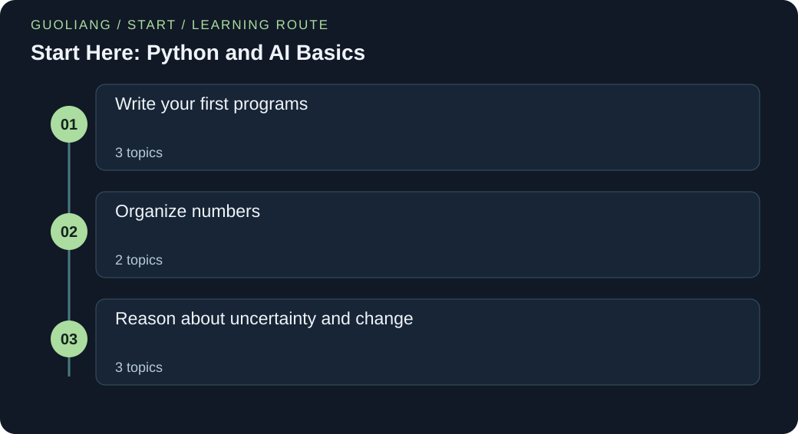

# Start Here: Python and AI Basics

> Leon | AI Field Guides

[EN](AI-START.en.md) · [中文](AI-START.zh.md)



New to programming or AI mathematics? Begin with eight gentle lessons. Read a story, follow the numbers, and run a small Python program.

### Run the Python examples

Use Python 3.12 or newer. Save the code as a .py file. In a terminal, run `python filename.py`; some systems use `python3`. If the code contains `import numpy as np`, first run `python -m pip install numpy`. The import loads NumPy, a package for numeric arrays, and gives it the short name np. No dataset or model-weight downloads are needed.

[Official Python downloads](https://www.python.org/downloads/) · [Official NumPy installation guide](https://numpy.org/install/)

## A route through the ideas

Start with names, lists and functions. Then learn vectors, matrices, probability, logarithms and slopes. Each lesson defines its terms before using them. You only need school arithmetic to begin.

### Before you start

- Addition, subtraction, multiplication and division.
- A willingness to check one small step at a time.
- Python 3.12 or later to run examples; no extra packages.

### What you will learn

- Read and change a small Python program.
- Track shapes, units and mathematical symbols.
- Explain one loss calculation and one gradient update.
- Continue to a full AI guide with a stronger foundation.

## Knowledge framework

### Write your first programs

- [Numbers, names and a first program](#python-values)
- [Lists, positions and repeated steps](#lists-loops)
- [Functions, choices and small checks](#functions-tests)

### Organize numbers

- [Vectors and the dot product](#vectors-dot-products)
- [Matrices: several examples at once](#matrices-shapes)

### Reason about uncertainty and change

- [Probability: choose the denominator](#probability-counts)
- [Powers and logarithms without mystery](#powers-logarithms)
- [Slopes, gradients and one learning step](#slopes-gradients)

<a id="python-values"></a>

## Numbers, names and a first program

### 01 / The story

Leah records the temperature of a small greenhouse. One sensor reports Celsius, but her notebook uses Fahrenheit. She first converts one reading with a calculator. The next morning she repeats the same work and makes a typing error. She writes three Python lines instead. One line stores the reading. Another applies the conversion rule. The last line displays the answer. She checks it against her earlier calculation. Now she can change the reading without rewriting the rule. A program has become a clear record of her calculation.

### 02 / The concept

A variable gives a value a name. In Python, = assigns a value. It does not ask whether two values are equal. Use == for that question. A number such as 20 is an integer. A value such as 20.5 is a floating-point number. Text is written inside quotes.

Python calculates the right side of an assignment before storing the result. Parentheses control the order of operations. The print function displays a result. A line starting with # is a comment for the reader.

### 03 / Put the concept to work

Keep the conversion rule separate from the reading. Change only celsius to convert another temperature. Use a clear variable name for each unit. Print an intermediate result when you need to locate a mistake.

### 04 / How others use it

The Python tutorial introduces numbers, assignments and arithmetic expressions. Data preprocessing uses the same operations to convert units before later analysis. The temperature example here is an original illustration of that workflow.

### 05 / The formula, unpacked

```text
F = (9 / 5)C + 32
```

C is a temperature in degrees Celsius. F is the same temperature in degrees Fahrenheit. Multiply C by nine fifths, then add 32. In Python, write multiplication with * and division with /. A name such as celsius is easier to read than a single letter when a program grows.

### 06 / Work through the numbers

For C = 20, first calculate 9 / 5 = 1.8. Next calculate 1.8 × 20 = 36. Finally add 32 to get F = 68. At C = 0, the multiplication produces zero and F = 32. These two checks help catch a misplaced bracket. The program prints 68.0 because division produces a floating-point result.

### Words to know

- **Variable:** A name that refers to a value.

- **Assignment:** Store the right-side result under a name with =.

- **Boolean:** A value that is either True or False.

### Let us work through it

**Why not write 20 × 1.8 + 32 each time?**

A named input makes the rule reusable. It also tells another reader what 20 means.

**Does x = x + 1 make sense?**

Yes, if x already has a numeric value. Read the old value, add one, then store the new value. This is an instruction, not an algebraic equation.

**What happens if celsius is the text "20"?**

Text and numbers are different types. Convert numeric text with float or int before this calculation. Do not assume a quoted number behaves like a number.

### Numbers, names and a first program

Save this code in a file ending in .py. Run it with Python 3. No extra packages are needed. The program uses small, fixed inputs so you can check every result.

```python
celsius = 20
fahrenheit = (9 / 5) * celsius + 32
print(fahrenheit)
print(fahrenheit == 68)
```

**Run it locally**

```sh
python python-values-first-steps.py
```

**Expected output**

```text
68.0
True
```

**Read the code step by step**

Line 1 gives the number 20 the name celsius. Line 2 reads that value and follows the conversion rule. The result is stored as fahrenheit. Line 3 displays 68.0. Line 4 asks whether that result equals 68. It displays True. True and False are Boolean values: they represent yes and no. Changing line 1 changes the calculation. It does not change the formula.

### Where you can use this

**Sensor preprocessing**

Convert every sensor reading to the same unit before comparing them.

**Model settings**

Give a name to a learning rate or a threshold so its role is visible.

**Where the analogy stops:** Floating-point numbers cannot represent every decimal exactly. This example has a simple exact check. For many later calculations, compare values with an appropriate tolerance instead of requiring exact equality.

**Keep this idea:** Give values meaningful names. Use = to assign and == to compare. State the units before calculating.

### Sources for this topic

- [Python Software Foundation: An informal introduction to Python](https://docs.python.org/3/tutorial/introduction.html)

<a id="lists-loops"></a>

## Lists, positions and repeated steps

### 01 / The story

Leah now has three daily readings. She could create three separate variables, but a fourth day would need another line. She puts the readings in a list. Then she asks the computer to visit each reading in order. During each visit, it adds the reading to a running total. At the end, she divides by the number of readings. She can see both the total and the average. When another day arrives, the same loop handles the longer list. The important idea is one repeated action over a collection.

### 02 / The concept

A list stores values in order. Square brackets create it. Positions start at zero, so values[0] reads the first item. A for loop takes one item at a time. The indented lines below the loop repeat for each item.

The variable total is an accumulator. It starts at zero and keeps the sum so far. len(values) counts the items. Check that the list is not empty before dividing by its length.

### 03 / Put the concept to work

Use a list when you have several readings with the same role. Use a loop when the same action applies to each reading. Track total after every visit before writing a compact one-line version.

### 04 / How others use it

Python’s data-structure and control-flow tutorials explain lists and for loops. A data-cleaning script can visit rows to count missing values. A model-training loop can visit batches to update parameters. Both repeat an action over a collection.

### 05 / The formula, unpacked

```text
mean = (x₁ + x₂ + … + xₙ) / n = (1 / n) Σᵢ₌₁ⁿ xᵢ
```

n is the number of readings and must be positive. xᵢ means reading i in the mathematical notation. Σ means add the listed terms. The mathematical labels here begin at one. Python list positions begin at zero. The first mathematical reading x₁ is values[0] in the code.

### 06 / Work through the numbers

Use readings 18, 21 and 24. Start with total = 0. After the first visit it is 18. After the second it is 39. After the third it is 63. There are three readings, so the mean is 63 / 3 = 21. The loop does not forget the previous total. It updates it.

### Words to know

- **Index:** The position of an item in a list, starting at zero in Python.

- **Loop:** Repeat a block of instructions for several items.

- **Accumulator:** A variable that stores a result built over several steps.

### Let us work through it

**Why is total created before the loop?**

If total were reset to zero inside the loop, earlier readings would be lost. The final total would only contain the last reading.

**What is values[2]?**

It is 24. Positions 0, 1 and 2 refer to the first, second and third values.

**Is a Python list already a NumPy vector?**

No. A list is a general Python container. NumPy arrays have different rules for numerical operations. Later examples will name the representation they use.

### Lists, positions and repeated steps

Save this code in a file ending in .py. Run it with Python 3. No extra packages are needed. The program uses small, fixed inputs so you can check every result.

```python
values = [18, 21, 24]
total = 0
for value in values:
    total = total + value
    print("running total:", total)
print("first:", values[0])
print("mean:", total / len(values))
```

**Run it locally**

```sh
python lists-loops-first-steps.py
```

**Expected output**

```text
running total: 18
running total: 39
running total: 63
first: 18
mean: 21.0
```

**Read the code step by step**

The list contains three numbers. total is created before the loop, so it is not reset during each visit. value receives 18, then 21, then 24. Two indented lines run on each visit. The final two print calls have no indentation, so they run after the loop. Notice that the printed average is 21.0.

### Where you can use this

**Dataset rows**

Visit each record to count missing fields or collect a summary.

**Training batches**

A training loop repeats updates for several groups of examples.

**Where the analogy stops:** The mean hides variation. Readings 0 and 42 also have mean 21, although neither is close to 21. This program assumes a nonempty list of numbers.

**Keep this idea:** A list keeps values in order. A loop repeats steps. Create an accumulator before the loop so it keeps earlier results.

### Sources for this topic

- [Python Software Foundation: Data structures](https://docs.python.org/3/tutorial/datastructures.html)

- [Python Software Foundation: More control flow tools](https://docs.python.org/3/tutorial/controlflow.html)

<a id="functions-tests"></a>

## Functions, choices and small checks

### 01 / The story

Omar wants to label a sensor reading as warm or cool. He writes the rule once, but soon needs it in two places. Copying the code makes later changes easy to miss. He gives the rule a name: label_temperature. The function accepts one reading and returns one label. He checks the value just below the boundary and the value exactly on it. These checks reveal which side includes the boundary. His small function now has both a clear job and examples that describe its behaviour.

### 02 / The concept

A function groups instructions under a name. def starts its definition. A parameter is a named input. return sends a result back to the caller. An if statement chooses a branch based on a condition.

A test compares an actual result with an expected result. assert raises an error if its condition is false. It is useful for checking examples. It is not a substitute for validating untrusted inputs in a real application.

### 03 / Put the concept to work

Write a function when a calculation needs a name and may be reused. Choose its inputs and return value before writing its body. Test a value on each side of a boundary and a value exactly on it.

### 04 / How others use it

Python’s control-flow tutorial explains if, def and return. A preprocessing pipeline often calls small functions for cleaning or conversion. An evaluation script can call another function to calculate a metric. Clear inputs make those parts easier to check.

### 05 / The formula, unpacked

```text
label(x) = warm if x ≥ 25; otherwise cool
```

x is the temperature passed into the function. The number 25 is a chosen boundary for this example, not a universal comfort rule. The symbol ≥ means greater than or equal to. Python writes it as >=. The function returns text, not a probability.

### 06 / Work through the numbers

For x = 24, the comparison 24 ≥ 25 is false, so the result is cool. For x = 25, the comparison is true and the result is warm. For x = 29, it is also warm. These three inputs check both branches and the boundary. Many bugs hide exactly where a rule changes.

### Words to know

- **Parameter:** A name used for an input inside a function.

- **Return value:** The result a function sends back.

- **Boundary case:** An input where the rule changes its behaviour.

### Let us work through it

**What changes if >= becomes >?**

The value 25 becomes cool. The exact boundary matters even when almost all other inputs behave the same.

**Why use return instead of only print?**

A returned value can be stored, compared or passed to another function. Printing only displays a value.

**Do two passing tests prove every case is correct?**

No. They check only their inputs. Add cases that represent other valid values and any invalid inputs the real program must handle.

### Functions, choices and small checks

Save this code in a file ending in .py. Run it with Python 3. No extra packages are needed. The program uses small, fixed inputs so you can check every result.

```python
def label_temperature(value):
    if value >= 25:
        return "warm"
    return "cool"

assert label_temperature(24) == "cool"
assert label_temperature(25) == "warm"
for reading in [24, 25, 29]:
    print(reading, label_temperature(reading))
```

**Run it locally**

```sh
python functions-tests-first-steps.py
```

**Expected output**

```text
24 cool
25 warm
29 warm
```

**Read the code step by step**

The first four lines define the function. They do not run its body immediately. Calling label_temperature(24) supplies 24 as value. The if condition is checked. A return statement ends that call. The two assert lines check known cases. The final loop calls the function three more times and prints each input beside its label.

### Where you can use this

**Preprocessing functions**

Keep a unit conversion or a cleaning rule in one reusable function.

**Model checks**

Test that a metric returns the expected answer for a small known case.

**Where the analogy stops:** This threshold is a chosen teaching rule. It is not a weather or health recommendation. The function assumes a numeric input. A production interface must handle invalid values deliberately.

**Keep this idea:** A function gives repeated logic a name. return sends its answer back. Boundary checks reveal exactly what a rule means.

### Sources for this topic

- [Python Software Foundation: More control flow tools](https://docs.python.org/3/tutorial/controlflow.html)

<a id="vectors-dot-products"></a>

## Vectors and the dot product

### 01 / The story

Nora describes each short video using two counts: outdoor scenes and spoken sentences. A single number cannot keep both measurements separate. She writes an ordered pair instead. Then she builds a simple score that gives different importance to the two counts. She multiplies each count by its weight and adds the results. A friend swaps the order of the counts and gets another score. They learn that a vector needs both values and a shared meaning for each position. The arithmetic is simple, but the ordering is part of the data.

### 02 / The concept

A vector is an ordered list of numbers. Its length here is the number of entries, also called its dimension. A feature vector describes one item. A weight vector says how each feature contributes to a score.

The dot product multiplies matching entries and adds the products. Both vectors must have the same number of entries. Feature order must also match. A weighted score does not become a useful prediction until its features, weights and evaluation are justified.

### 03 / Put the concept to work

Write the feature names beside their positions. Check that the weight list uses the same order. Calculate the individual contributions before adding them. This reveals which feature raises or lowers this score.

### 04 / How others use it

NumPy documents the dot product for one-dimensional arrays. Linear layers and linear prediction rules use weighted sums of features. Retrieval models can also compare learned representations using a dot product, often after normalization.

### 05 / The formula, unpacked

```text
x = [x₁, x₂]; w = [w₁, w₂]
s = w · x = w₁x₁ + w₂x₂
```

x is the feature vector. x₁ and x₂ are its first and second features. w contains the two weights, w₁ and w₂. The dot symbol · names the dot product. s is the resulting score. Subscripts are position labels, not powers. The score is a single number.

### 06 / Work through the numbers

Take x = [3, 4] and w = [2, −1]. The first contribution is 2 × 3 = 6. The second is −1 × 4 = −4. Add them to get s = 2. If only the first feature increases to 4, the score becomes 2 × 4 − 4 = 4. The change is 2 because its weight is 2.

### Words to know

- **Feature:** One measured property of an item.

- **Dimension:** The number of entries in this vector.

- **Dot product:** Multiply matching entries, then add the results.

### Let us work through it

**Why must the feature order match?**

A weight for outdoor scenes must multiply the outdoor-scene count. Swapping only one vector changes the meaning of the calculation.

**Does a negative weight mean bad data?**

No. It means that increasing this feature lowers this particular score, with the other features fixed.

**What if one vector has an extra entry?**

There is no matching partner for that entry. Stop and fix the data contract instead of silently discarding it.

### Vectors and the dot product

Save this code in a file ending in .py. Run it with Python 3. No extra packages are needed. The program uses small, fixed inputs so you can check every result.

```python
features = [3, 4]
weights = [2, -1]
assert len(features) == len(weights)
score = 0
for position in range(len(features)):
    contribution = features[position] * weights[position]
    score = score + contribution
    print("contribution:", contribution)
print("score:", score)
```

**Run it locally**

```sh
python vectors-dot-products-first-steps.py
```

**Expected output**

```text
contribution: 6
contribution: -4
score: 2
```

**Read the code step by step**

The two lists use the same feature order. The assert line checks their lengths. range(2) produces the positions 0 and 1. Each loop visit reads one feature and its matching weight. Multiplication gives one contribution. The running score adds both contributions. This longer version shows every step. Later examples may write the same operation with sum, zip or NumPy.

### Where you can use this

**Linear models**

A prediction often starts with a weighted sum of input features.

**Similarity search**

Many retrieval systems compare numeric representations using a dot product or a normalized version.

**Where the analogy stops:** A dot product is only arithmetic until the feature meanings and weights are justified. Large feature scales can dominate a score. The arbitrary weights in this example were chosen to make the calculation visible.

**Keep this idea:** Match the positions, multiply each pair, and add the products. Equal dimensions do not guarantee equal feature meanings.

### Sources for this topic

- [NumPy: numpy.dot](https://numpy.org/doc/stable/reference/generated/numpy.dot.html)

- [NumPy: NumPy: the absolute basics for beginners](https://numpy.org/doc/stable/user/absolute_beginners.html)

<a id="matrices-shapes"></a>

## Matrices: several examples at once

### 01 / The story

Nora has a score for one video. Now she wants scores for two videos. She places one feature vector on each row of a table. Each column keeps the same meaning. She applies the same weights to every row. The first score is zero and the second is two. Her friend turns the table sideways and gets confused. They label the rows as videos and the columns as features. The labels make the calculation clear again. A matrix is useful because it keeps many related vectors in a regular shape.

### 02 / The concept

A matrix is a rectangular table of numbers. Its shape states the number of rows and columns, in that order. A 2 by 2 matrix has two rows and two columns. Here a row describes one video. A column describes one feature across videos.

Multiplying this matrix by a two-entry weight vector produces one score per row. The number of columns must match the number of weights. Shape checks catch some errors. They cannot tell whether the columns contain the right measurements.

### 03 / Put the concept to work

Draw the rows and columns before using matrix notation. Label one row as one sample. Check that every row has the same number of features. Then apply the same scoring rule to each row.

### 04 / How others use it

NumPy’s beginner guide explains array shapes and axes. Its dot documentation describes matrix and vector operations. Machine-learning code uses these structures to handle a batch of samples with one shared set of weights.

### 05 / The formula, unpacked

```text
X = [[1, 2], [3, 4]]; w = [2, −1]
y = Xw = [1×2 + 2×(−1), 3×2 + 4×(−1)] = [0, 2]
```

X is the input matrix. It has two sample rows and two feature columns. w is a column vector of two weights, written as a list for convenience. y contains one score for each row. Xw means matrix-vector multiplication, not multiplication of two whole lists in Python. Each output is a dot product.

### 06 / Work through the numbers

For the first row, multiply 1 by 2 and 2 by −1. Add 2 and −2 to get 0. For the second row, multiply 3 by 2 and 4 by −1. Add 6 and −4 to get 2. There are two rows, so there are two outputs. Adding another sample row creates another output. Adding a feature column requires another weight.

### Words to know

- **Matrix:** A rectangular table of numbers.

- **Shape:** The sizes of the axes, such as rows and columns.

- **Sample:** One item described by the input data.

### Let us work through it

**Why is the output not a 2 by 2 table?**

Each row is reduced to one weighted sum. Two rows therefore produce two numbers.

**What happens if a row has three features?**

It needs three matching weights. Otherwise the intended dot product is not defined.

**Can a correctly shaped matrix still be wrong?**

Yes. A column measured in centimetres cannot silently replace a column measured in metres. Meaning and units matter too.

### Matrices: several examples at once

Save this code in a file ending in .py. Run it with Python 3. No extra packages are needed. The program uses small, fixed inputs so you can check every result.

```python
rows = [[1, 2], [3, 4]]
weights = [2, -1]
scores = []
for row in rows:
    assert len(row) == len(weights)
    score = 0
    for column in range(len(weights)):
        score = score + row[column] * weights[column]
    scores.append(score)
print("shape:", len(rows), "by", len(weights))
print("scores:", scores)
```

**Run it locally**

```sh
python matrices-shapes-first-steps.py
```

**Expected output**

```text
shape: 2 by 2
scores: [0, 2]
```

**Read the code step by step**

The outer loop visits sample rows. The inner loop visits columns within the current row. The score starts at zero for each new row. append adds the completed score to the end of scores. The indentation matters: append runs after the inner loop finishes. If score were reset only before the outer loop, scores would accumulate across rows. These particular inputs hide that bug because the first row scores zero. Change the first row to [2, 2]: correct scores become [2, 2], while the faulty reset gives [2, 4].

### Where you can use this

**Batch prediction**

Apply one model to several examples using a matrix of features.

**Images**

A grayscale image can be stored as a matrix whose entries record pixel intensities.

**Where the analogy stops:** A nested Python list is not automatically a NumPy matrix. The loops here perform the arithmetic explicitly. More dimensions need additional shape conventions, which later lessons explain before using them.

**Keep this idea:** Shape means axis sizes. For Xw, the feature-column count must match the weight count. Each sample row produces one score.

### Sources for this topic

- [NumPy: NumPy: the absolute basics for beginners](https://numpy.org/doc/stable/user/absolute_beginners.html)

- [NumPy: numpy.dot](https://numpy.org/doc/stable/reference/generated/numpy.dot.html)

<a id="probability-counts"></a>

## Probability: choose the denominator

### 01 / The story

Leah keeps ten days of weather records. Four days had rain. A simple warning rule raised an alert on five days. Three of those five days had rain. Her friend says the rule has a rain rate of four out of ten. Leah asks a more precise question: when an alert appears, how often did it rain? They look only at the five alerted days and count three rainy ones. Both fractions are correct, but they answer different questions. Choosing the group to count is the first step in using probability.

### 02 / The concept

An observed proportion is a count divided by the size of the group being counted. It lies between zero and one. Multiply by 100 to express it as a percentage. A probability model uses numbers in the same range to describe uncertainty.

A conditional proportion limits attention to a stated condition, such as days with an alert. The denominator changes with that condition. Observed proportions can help estimate future probabilities. Ten days alone do not guarantee reliable estimates for another season.

### 03 / Put the concept to work

Write the question in words before choosing a fraction. Circle the group named after given. That group determines the denominator. Then count the desired event within that group.

### 04 / How others use it

Google’s classification guide distinguishes precision and recall. The same denominator choice appears here: precision asks about alerts, while recall asks about actual rainy days. The weather counts are a small teaching illustration, not a forecast evaluation.

### 05 / The formula, unpacked

```text
p̂(rain) = rainy days / all days = 4/10 = 0.4
p̂(rain | alert) = rainy alerted days / alerted days = 3/5 = 0.6
```

The hat in p̂ marks an estimate from these records. The vertical bar | means given: restrict the group to the condition on its right. rain | alert reads rain given an alert. The denominator must be greater than zero. These are frequencies from a tiny dataset, not promises about tomorrow.

### 06 / Work through the numbers

The overall rainy fraction is 4 ÷ 10 = 0.4, or 40%. Within the five alerted days it is 3 ÷ 5 = 0.6, or 60%. The reverse question gives another denominator: of the four rainy days, three had alerts. That fraction is 3 ÷ 4 = 0.75. Confusing these two conditional questions is a common mistake.

### Words to know

- **Proportion:** A part divided by the whole group being counted.

- **Condition:** A rule that selects which records belong in the calculation.

- **Estimate:** A value inferred from available observations.

### Let us work through it

**Why is 0.6 different from 0.75?**

The first denominator is alerted days. The second is rainy days. They describe different groups.

**What if there were no alerts?**

The observed rain-given-alert fraction would be undefined because its denominator is zero. Do not report zero as if it were measured.

**Does 60% mean tomorrow must be rainy?**

No. It summarizes these records under a condition. Future weather may differ, and the sample is small.

### Probability: choose the denominator

Save this code in a file ending in .py. Run it with Python 3. No extra packages are needed. The program uses small, fixed inputs so you can check every result.

```python
all_days = 10
rainy_days = 4
alerted_days = 5
rainy_alerted_days = 3
print("rain:", rainy_days / all_days)
print("rain given alert:", rainy_alerted_days / alerted_days)
print("alert given rain:", rainy_alerted_days / rainy_days)
```

**Run it locally**

```sh
python probability-counts-first-steps.py
```

**Expected output**

```text
rain: 0.4
rain given alert: 0.6
alert given rain: 0.75
```

**Read the code step by step**

The first four lines name the counts. The first fraction uses four rainy days out of ten. The next two fractions share the numerator three, but use different denominators. The second result asks about alerted days. The third asks about rainy days. In a real program, check that the selected group is nonempty before dividing.

### Where you can use this

**Classifier evaluation**

Precision asks how many predicted positives were truly positive. Recall uses the actual positives as its denominator.

**Data checks**

Compare event frequencies across groups before drawing conclusions from an overall average.

**Where the analogy stops:** Ten records provide little evidence about future weather. The sample may be biased or unrepresentative. A conditional proportion with an empty selected group is undefined.

**Keep this idea:** Ask which group you are counting. P(rain given alert) and P(alert given rain) generally use different denominators.

### Sources for this topic

- [Google: Accuracy, recall, precision and related metrics](https://developers.google.com/machine-learning/crash-course/classification/accuracy-precision-recall)

<a id="powers-logarithms"></a>

## Powers and logarithms without mystery

### 01 / The story

Nora compares two models. One assigns the true class probability 0.8. The other assigns it 0.2. She wants to compare the probability assignments, not only the final class labels. She wants a penalty that grows when the assigned probability shrinks. She tries the negative natural logarithm. The first model gets a small penalty. The second gets a larger one. She does not need to memorize a table of logarithms. She first learns what a logarithm reverses, then checks the numbers with Python. A new symbol now has a concrete purpose.

### 02 / The concept

A power means repeated multiplication when the exponent is a positive integer. For example, 2³ = 2 × 2 × 2 = 8. A logarithm asks the reverse question: what exponent produces this value? So log₂(8) = 3.

The natural logarithm, written ln, uses the constant e, about 2.71828, as its base. exp(a) means e raised to a. ln and exp undo one another for valid real inputs. In classification, −ln(p) penalizes a model when it gives the true class probability p.

### 03 / Put the concept to work

Check the base whenever you see a logarithm. In Python, math.log(p) means ln(p). Read a loss as a rule for scoring a prediction. Calculate a few probabilities to see how that rule behaves.

### 04 / How others use it

Python’s math documentation defines log, log2 and exp. Google lists logarithms among the mathematics used in its machine-learning course. Later classification lessons apply negative logarithms to probability-based losses.

### 05 / The formula, unpacked

```text
2³ = 8; log₂(8) = 3
ln(exp(a)) = a
L = −ln(p), where 0 < p ≤ 1
```

The superscript 3 is an exponent. The subscript 2 in log₂ is the base. a is a real number. p is the probability assigned to the true class. L is the loss for that example. ln uses base e, not base 10. Larger L means a worse probability assignment for this true class.

### 06 / Work through the numbers

For p = 0.8, ln(0.8) is about −0.2231, so L is 0.2231. For p = 0.2, L is about 1.6094. For p = 1, ln(1) = 0 and the loss is zero. As p approaches zero from above, the loss grows without a finite upper bound. ln(0) is not a finite number.

### Words to know

- **Exponent:** The power applied to a base.

- **Logarithm:** The exponent needed to produce a value from a chosen base.

- **Loss:** A number that measures an error or a poor prediction under a chosen rule.

### Let us work through it

**Why is there a minus sign?**

For probabilities between zero and one, ln(p) is nonpositive. The minus sign turns it into a nonnegative penalty.

**Can I pass zero to math.log?**

No. Python raises a domain error. Real training code uses numerically stable loss functions instead of taking the log of rounded zero.

**Is a small loss proof that a model is useful?**

No. Check unseen examples, suitable metrics and the task’s requirements. A loss value answers only its specified question.

### Powers and logarithms without mystery

Save this code in a file ending in .py. Run it with Python 3. No extra packages are needed. The program uses small, fixed inputs so you can check every result.

```python
import math
print("power:", 2 ** 3)
print("reverse:", math.log2(8))
for probability in [0.8, 0.2, 1.0]:
    loss = -math.log(probability)
    print(f"p={probability:.1f}, loss={loss:.4f}")
```

**Run it locally**

```sh
python powers-logarithms-first-steps.py
```

**Expected output**

```text
power: 8
reverse: 3.0
p=0.8, loss=0.2231
p=0.2, loss=1.6094
p=1.0, loss=-0.0000
```

**Read the code step by step**

import math loads Python’s standard mathematical tools. ** means a power. math.log2 uses base two. math.log with one argument uses the natural logarithm. The loop calculates three losses. The f-string inserts values into text. :.4f prints four digits after the decimal point; it changes the display, not the stored loss. The display −0.0000 is floating-point negative zero. It compares equal to zero; the loss at probability one is zero.

### Where you can use this

**Classification loss**

Cross-entropy includes the negative log probability of the true class for a one-hot label.

**Products of probabilities**

Logarithms turn products into sums. This helps work with many small positive probabilities.

**Where the analogy stops:** The logarithm requires a positive input. Rounded zero probabilities cause numerical trouble. This short program illustrates the formula; production libraries compute equivalent losses with stable operations.

**Keep this idea:** A logarithm reverses exponentiation. The loss −ln(p) is small for a high true-class probability and large for a low one.

### Sources for this topic

- [Python Software Foundation: Mathematical functions](https://docs.python.org/3/library/math.html)

- [Google: Prerequisites and prework](https://developers.google.com/machine-learning/crash-course/prereqs-and-prework)

<a id="slopes-gradients"></a>

## Slopes, gradients and one learning step

### 01 / The story

Leah adjusts a camera setting. The target is three, but she starts at zero. She measures the error as the square of the distance from the target. At zero, the error is nine. She tries a slightly larger setting and sees the error fall. This tells her a useful direction. She then uses the slope to choose a small update. The setting becomes 0.6 and the error becomes 5.76. She has not reached the target yet. She has learned how a local change can guide the next step.

### 02 / The concept

A slope describes how fast an output changes when an input changes. For a curve, the derivative is the slope at one point. You can estimate it by comparing nearby values. A gradient collects these slopes when there are several input variables.

Gradient descent moves a parameter against the local slope of a loss. A learning rate controls the step size. The method does not know the whole landscape from one slope. A step that is too large may increase the loss.

### 03 / Put the concept to work

Choose a simple loss and draw several values. Estimate a slope with nearby inputs. Use a small learning rate for one update. Recalculate the loss afterward, rather than assuming that an update must improve it.

### 04 / How others use it

Google’s gradient-descent lesson uses derivatives to guide parameter updates. Neural networks use the same optimization idea with many parameters. Backpropagation calculates their gradients; an optimizer decides how to apply those gradients.

### 05 / The formula, unpacked

```text
L(w) = (w − 3)²
g = dL/dw = 2(w − 3)
w_new = w − ηg
```

w is the adjustable parameter. L is its squared error from the target three. dL/dw means the derivative of L with respect to w. We call this slope g. η, pronounced eta, is the positive learning rate. w_new is the value after one update. For one parameter, the gradient is just this single slope.

### 06 / Work through the numbers

Start with w = 0. The loss is (0 − 3)² = 9. The slope is 2(0 − 3) = −6. Choose η = 0.1. The new value is 0 − 0.1 × (−6) = 0.6. Its loss is (0.6 − 3)² = 5.76. To see where the slope comes from, expand the change: [L(w+h) − L(w)] / h = 2(w−3) + h. As the small nonzero change h approaches zero, this approaches 2(w−3).

### Words to know

- **Derivative:** The local slope of a function with respect to one input.

- **Gradient:** A collection of partial derivatives for several parameters.

- **Learning rate:** A value that scales a parameter update.

### Let us work through it

**Why subtract a negative slope?**

Subtracting it increases w. Here increasing w moves toward three and lowers the loss for a small step.

**What happens at w = 3?**

The slope and loss are both zero. This quadratic has reached its minimum. Other functions may have zero slope at points that are not minima.

**What if η = 2 at w = 0?**

The new weight is 12 and the loss is 81. The update jumped too far, so the loss increased.

### Slopes, gradients and one learning step

Save this code in a file ending in .py. Run it with Python 3. No extra packages are needed. The program uses small, fixed inputs so you can check every result.

```python
def loss(weight):
    return (weight - 3) ** 2

weight = 0.0
step = 0.001
approx_slope = (loss(weight + step) - loss(weight - step)) / (2 * step)
slope = 2 * (weight - 3)
new_weight = weight - 0.1 * slope
print(f"estimated slope: {approx_slope:.3f}")
print(f"before: w={weight:.2f}, loss={loss(weight):.2f}")
print(f"after: w={new_weight:.2f}, loss={loss(new_weight):.2f}")
assert loss(new_weight) < loss(weight)
```

**Run it locally**

```sh
python slopes-gradients-first-steps.py
```

**Expected output**

```text
estimated slope: -6.000
before: w=0.00, loss=9.00
after: w=0.60, loss=5.76
```

**Read the code step by step**

The function defines the curve. approx_slope compares points just to the left and right of the current weight. Their input distance is twice step, which explains the denominator. slope uses the exact derivative for this particular curve. The update subtracts learning rate times slope. The last line checks that this chosen step reduced this loss. It does not claim that every possible learning rate would work.

### Where you can use this

**Linear regression**

Adjust a line’s weights to reduce a prediction loss on training examples.

**Neural networks**

Backpropagation computes parameter gradients. An optimizer then uses them to update weights.

**Where the analogy stops:** This loss is a simple convex quadratic with one minimum. Neural-network losses can have a more complicated shape. Finite-difference estimates also depend on step size and floating-point precision.

**Keep this idea:** The gradient describes local change. Subtract learning rate times gradient, then check the result. A larger step is not always better.

### Sources for this topic

- [Google: Gradient descent](https://developers.google.com/machine-learning/crash-course/linear-regression/gradient-descent)

- [Google: Prerequisites and prework](https://developers.google.com/machine-learning/crash-course/prereqs-and-prework)

## The reference desk

### [Numbers, names and a first program](#python-values)

Give values meaningful names. Use = to assign and == to compare. State the units before calculating.

### [Lists, positions and repeated steps](#lists-loops)

A list keeps values in order. A loop repeats steps. Create an accumulator before the loop so it keeps earlier results.

### [Functions, choices and small checks](#functions-tests)

A function gives repeated logic a name. return sends its answer back. Boundary checks reveal exactly what a rule means.

### [Vectors and the dot product](#vectors-dot-products)

Match the positions, multiply each pair, and add the products. Equal dimensions do not guarantee equal feature meanings.

### [Matrices: several examples at once](#matrices-shapes)

Shape means axis sizes. For Xw, the feature-column count must match the weight count. Each sample row produces one score.

### [Probability: choose the denominator](#probability-counts)

Ask which group you are counting. P(rain given alert) and P(alert given rain) generally use different denominators.

### [Powers and logarithms without mystery](#powers-logarithms)

A logarithm reverses exponentiation. The loss −ln(p) is small for a high true-class probability and large for a low one.

### [Slopes, gradients and one learning step](#slopes-gradients)

The gradient describes local change. Subtract learning rate times gradient, then check the result. A larger step is not always better.

## Official tutorials & original research

Original stories, explanations and examples by Leon. The linked tutorials and research belong to their respective authors; these independent companions are not official translations or endorsed courses.

- [An informal introduction to Python](https://docs.python.org/3/tutorial/introduction.html) — Python Software Foundation

- [More control flow tools](https://docs.python.org/3/tutorial/controlflow.html) — Python Software Foundation

- [Data structures](https://docs.python.org/3/tutorial/datastructures.html) — Python Software Foundation

- [NumPy: the absolute basics for beginners](https://numpy.org/doc/stable/user/absolute_beginners.html) — NumPy

- [numpy.dot](https://numpy.org/doc/stable/reference/generated/numpy.dot.html) — NumPy

- [Mathematical functions](https://docs.python.org/3/library/math.html) — Python Software Foundation

- [Prerequisites and prework](https://developers.google.com/machine-learning/crash-course/prereqs-and-prework) — Google

- [Gradient descent](https://developers.google.com/machine-learning/crash-course/linear-regression/gradient-descent) — Google

- [Accuracy, recall, precision and related metrics](https://developers.google.com/machine-learning/crash-course/classification/accuracy-precision-recall) — Google
