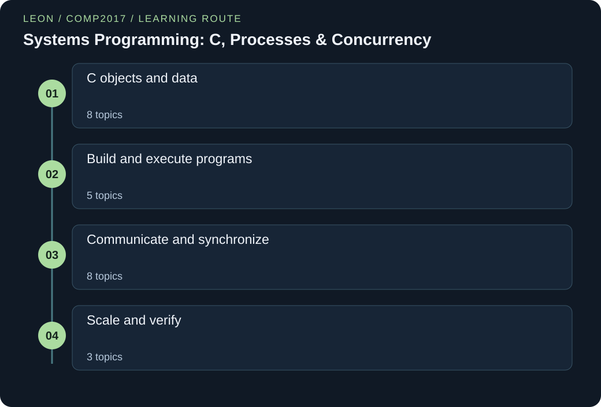

# COMP2017 — Systems Programming: C, Processes & Concurrency

> Guoliang | Original study notes

[English](COMP2017.md) · [中文](COMP2017.zh.md)



Build a precise model of C memory, program construction and Unix process behavior. Original worked examples explain how resources move through programs and how synchronization turns concurrent activity into correct results.

A complete C11 and POSIX path through data representation, pointers, allocation, files, linked structures, build stages, signals, processes, communication, threads and parallel patterns. All 24 chapters include two complete runnable programs, exact output, guided syntax, traced behavior and engineering discussion. Platform-specific facilities are identified where used.

## Connected knowledge framework

### C objects and data
- [Bits, C types and explicit control](#representation-control)
- [Pointers, arrays and multidimensional layout](#pointers-arrays)
- [Strings, bounded input and parsing](#strings-parsing)
- [Structures, alignment, unions and tags](#structured-data)
- [File streams, binary records and errors](#file-streams)
- [Dynamic allocation and object lifetime](#allocation-ownership)
- [Linked lists and structural invariants](#linked-structures)
- [Function pointers and behavioral parameters](#callbacks)

### Build and execute programs
- [Preprocessing, macros and conditional builds](#preprocessing)
- [Translation units, symbols and libraries](#compilation-linkage)
- [Signals and asynchronous safety](#signals)
- [Processes, virtual memory and fork](#process-fork)
- [Execute programs and reap children](#exec-wait)

### Communicate and synchronize
- [Pipes, FIFO endpoints and byte framing](#pipes-fifos)
- [Messages, Unix sockets and IPC selection](#queues-sockets)
- [Shared memory and semaphore protocols](#shared-memory-semaphores)
- [Thread creation, joining and cancellation](#thread-lifecycle)
- [Data races, mutexes and atomicity](#data-races-mutexes)
- [Thread-safe interfaces and reader–writer locks](#thread-safe-design)
- [Condition variables and producer–consumer waiting](#condition-variables)
- [Deadlock, lock ordering and progress](#deadlock-progress)

### Scale and verify
- [Work, span and realistic speedup](#parallel-performance)
- [Parallel patterns: partition, join and combine](#parallel-patterns)
- [Debugging with reproducible evidence](#debugging-evidence)

<a id="representation-control"></a>

## Bits, C types and explicit control

### 01 / The story

A shipping label can contain the same printed digits while meaning a quantity, a product code or a price. Computer bits similarly acquire meaning through a representation and a type. A byte is storage, not an instruction to interpret it as a letter or a signed number. C asks the programmer to be explicit about these choices, then uses control flow to decide which operations run.

A function receives copies of its arguments, much like a clerk receiving a copied form; changing the copy does not change the original form unless the form contains a usable reference to it.

### 02 / The principle

A positional numeral sums digit values multiplied by powers of its base. C integer types have finite ranges; unsigned arithmetic wraps modulo one more than the maximum representable value, while overflowing signed arithmetic is undefined behavior. Integer division truncates toward zero in modern C; use a floating operand when a fractional result is intended. sizeof yields an object size in C bytes and has type size_t; a byte contains CHAR_BIT bits, not a universally fixed eight.

Initialize automatic objects before reading them. Conditions treat zero as false and nonzero as true; && and || short-circuit, unlike bitwise operators. Loops need clear bounds and progress. Functions have declared parameter and result types, pass arguments by value and should express whether a result or error is being returned.

### 03 / The formula, unpacked

```text
Value of digits aₘ…a₀ in base B = Σᵢ aᵢBⁱ
Unsigned range with w value bits: 0 … 2ʷ−1
Unsigned result = mathematical result mod 2ʷ
Loop invariant example: sum = Σⱼ₌₀ⁱ⁻¹ a[j]
```

B is a numeral base, aᵢ a digit between zero and B−1, and i its position counting from the right. The unsigned formula uses w value bits, excluding any padding bits. It does not describe signed overflow. In the loop invariant, i is the number of already processed array elements and sum their accumulated value, assuming the additions remain representable.

An invariant describes what stays true at each loop boundary and helps justify both correctness and bounds.

### 04 / A first worked example

The binary numeral 101101 equals 32+8+4+1=45, which is hexadecimal 2D. On a machine with an eight-bit unsigned char, converting the mathematical value 260 to that type produces 4. In contrast, adding one to the maximum signed int has no portable numeric answer. For a three-element array {2,4,7}, start sum=0 and i=0.

Each loop adds a[i] and increments i; successive sums are 2, 6 and 13. The condition i<3 prevents an invalid fourth access. The expression 13/3 produces integer 4, while 13.0/3 produces an approximate floating result of 4.3333.

### Words to know

- **Unsigned value:** An integer value with no negative range; arithmetic uses a defined modulus.

- **Undefined behavior:** A case for which the C standard imposes no behavior requirements.

- **Invariant:** A fact preserved at a chosen program boundary.

### Let us work through it

**Can a successful run prove signed overflow is safe?**

No. Undefined behavior is not made valid by one observed result. Guard before arithmetic.

**Why cast before division?**

Converting the completed integer quotient cannot recover the discarded fraction.

**What does sizeof count?**

C bytes. CHAR_BIT states how many bits a byte has on the implementation.

### Observe defined wrap and guard signed addition

Use implementation limits without executing signed overflow.

```c
#define _POSIX_C_SOURCE 200809L
#include <stdio.h>
#include <stdlib.h>
#include <limits.h>

int main(void) {
    unsigned int largest = UINT_MAX;
    printf("unsigned wrap=%u\n", largest + 1u);
    int value = INT_MAX;
    if (value > INT_MAX - 1)
        puts("signed addition rejected");
    else
        printf("signed sum=%d\n", value + 1);
    printf("integer quotient=%d\n", 13 / 3);
    printf("floating quotient=%.4f\n", 13.0 / 3.0);
    return 0;
}
```

**Run it locally**

```sh
cc -std=c11 -Wall -Wextra -pedantic -pthread representation-control-c-defined-integer-arithmetic.c -lm -o demo
./demo
```

**Expected output**

```text
unsigned wrap=0
signed addition rejected
integer quotient=4
floating quotient=4.3333
```

**Read the syntax**

- `unsigned int`: Declare a nonnegative integer type with modulo arithmetic.

- `UINT_MAX`: Read the maximum unsigned int value from limits.h rather than assuming a width.

- `printf("%u\n", value)`: Print an unsigned int; the format must match the argument type.

- `#include <stdio.h>`: Include declarations for standard input/output functions such as printf before calling them.

- `int main(void)`: Define the program entry function. int is its status result type; void here means no parameters. Braces enclose a block of statements.

- `return 0;`: Finish main with a successful process status. A semicolon ends the statement; nonzero statuses signal failure in these examples.

**Follow the execution**

1. Read the maximum from the header and add in unsigned arithmetic.

2. Reject signed addition before it crosses the bound.

3. Compare integer and floating-point division.

**Follow the changing state**

| Operation | Result |
| --- | --- |
| UINT_MAX + 1u | 0 |
| 13 / 3 | 4 |
| 13.0 / 3.0 | 4.3333 |

**Read the code step by step**

UINT_MAX plus one wraps to zero for every conforming unsigned int representation. The signed branch checks the limit before addition, so no signed overflow is executed.

The final pair changes operand types before division. Four decimal places are an output format, not a claim that the binary floating representation is exact.

### Trace a prefix sum and a copied parameter

Combine a loop invariant with one isolated function call.

```c
#define _POSIX_C_SOURCE 200809L
#include <stdio.h>
#include <stdlib.h>

static int replace_copy(int value) {
    value = 9;
    return value;
}
int main(void) {
    int values[] = {2, 4, 7};
    int sum = 0;
    size_t count = sizeof values / sizeof values[0];
    for (size_t i = 0; i < count; i++) {
        sum += values[i];
        printf("processed=%zu sum=%d\n", i + 1, sum);
    }
    int original = 5;
    printf("returned=%d\n", replace_copy(original));
    printf("caller=%d\n", original);
    return 0;
}
```

**Run it locally**

```sh
cc -std=c11 -Wall -Wextra -pedantic -pthread representation-control-c-prefix-and-pass-by-value.c -lm -o demo
./demo
```

**Expected output**

```text
processed=1 sum=2
processed=2 sum=6
processed=3 sum=13
returned=9
caller=5
```

**Follow the execution**

1. Derive the element count at the array declaration site.

2. Print the preserved prefix invariant after every update.

3. Compare the returned value with the unchanged caller variable.

**Read the code step by step**

Before index i is processed, sum covers exactly the preceding elements. The count expression works here because values is the actual array, not an adjusted function parameter.

replace_copy changes its own parameter and returns nine. The caller prints that returned value but does not assign it to original, so original remains five. Small fixed inputs keep all sums representable.

### Guoliang's further thinking

**Separate representation from meaning**

A numeric identifier and a quantity may share an integer type but need different validation. The type range is only the outer boundary of the domain.

**Choose overflow behavior deliberately**

Unsigned wrap is useful for modular arithmetic, but a wrapped allocation size or item count is usually a defect. Defined behavior can still violate the intended contract.

**Watch out:** Do not infer a language guarantee from one machine’s observed overflow result. Unsigned wrap is specified; signed overflow is not.

<details>
<summary>Check your understanding</summary>

Why does a function taking int x fail to change the caller’s integer when it assigns x=9?

The parameter is a separate object initialized from the argument value. Return the new value or pass a pointer to the caller’s object and modify that object through the pointer.

</details>

<a id="pointers-arrays"></a>

## Pointers, arrays and multidimensional layout

### 01 / The story

An apartment directory has a building address, a floor number and a room number. Knowing an address is useful only when the building exists and the requested room belongs to it. A C pointer similarly needs a valid object and a live storage duration before dereferencing. Pointer arithmetic moves by objects of the pointed-to type, like taking one floor at a time rather than one centimeter.

A two-dimensional array is a building with equally sized floors; an array of pointers is a collection of directions that may lead to unrelated buildings. Similar-looking notation can hide very different layouts.

### 02 / The principle

A pointer stores a pointer value, and dereferencing accesses the designated object when type, alignment, lifetime and bounds requirements hold. Arrays contain contiguous elements, but an array object is not a pointer variable. In most expressions an array converts to a pointer to its first element; sizeof and unary & are important exceptions.

Pointer arithmetic is defined within an array and one past its end; the one-past pointer may be formed but not dereferenced. Subtracting pointers requires the same array and yields ptrdiff_t. A real T[R][C] is an array of R row arrays, so its usual converted type is pointer to a C-element row. It is not T**. An array parameter is adjusted to a pointer parameter, so pass length explicitly.

### 03 / The formula, unpacked

```text
a[i] ≡ *(a+i), for valid i
Array bytes = N·sizeof(T)
Row-major byte offset of a[r][c] = (r·C+c)·sizeof(T)
int a[R][C] converts to int (*)[C], not int **
```

N is the number of elements of a one-dimensional array and T their type. In the row-major offset, r and c are zero-based row and column indices and C the number of columns; all indices must be in range. The offset describes object layout in bytes rather than permission to cross subarray bounds with an arbitrary scalar pointer.

A pointer-to-row advances by one complete row. Array-to-pointer conversion does not carry the array’s length into a function.

### 04 / A first worked example

Assume sizeof(int)=4 and declare int grid[2][3]={{2,4,6},{8,10,12}}. The array occupies 2×3×4=24 bytes. Element grid[1][2] is at byte offset (1×3+2)×4=20 from the start. A pointer declared int (*row)[3]=grid advances 12 bytes when incremented once; row[1][2] accesses 12. By contrast, int *p=grid[0] points into the first three-element row. p+3 is its one-past pointer and must not be dereferenced as a portable way to access the next row.

Use the row-aware type and indices to express the actual array structure. This distinction matters even though the rows occupy adjacent storage bytes.

### Words to know

- **Pointee:** The live object designated by a pointer.

- **One-past pointer:** A valid array boundary marker that must not be dereferenced.

- **Pointer to row:** A pointer whose pointed-to type is a whole row array.

### Let us work through it

**Does a pointer remember the array length?**

Not by itself. Pass a length alongside the pointer or encode a valid boundary separately.

**Why is int ** not a two-dimensional array type?**

It points to an int pointer object. A real grid converts to a pointer to an array row, with different layout and stepping.

**May an end pointer be read as an element?**

No. It may mark the boundary, but dereferencing one past the array is invalid.

### Traverse with a begin and end pointer

Use the end as a sentinel, never as an element.

```c
#define _POSIX_C_SOURCE 200809L
#include <stdio.h>
#include <stdlib.h>

int main(void) {
    int values[] = {3, 5, 8};
    size_t count = sizeof values / sizeof values[0];
    const int *begin = values;
    const int *end = values + count;
    int total = 0;
    for (const int *cursor = begin; cursor != end; cursor++) {
        total += *cursor;
    }
    printf("elements=%td\n", end - begin);
    printf("sum=%d\n", total);
    return 0;
}
```

**Run it locally**

```sh
cc -std=c11 -Wall -Wextra -pedantic -pthread pointers-arrays-c-pointer-range.c -lm -o demo
./demo
```

**Expected output**

```text
elements=3
sum=16
```

**Read the syntax**

- `const int *begin`: Point to integers read through this pointer without modifying them. const does not extend lifetime.

- `end = values + count`: Form the one-past boundary inside the permitted array arithmetic range.

- `*cursor`: Access the element designated by a valid in-range pointer.

**Follow the execution**

1. Create begin and one-past end from the same array.

2. Dereference only while the cursor differs from end.

3. Subtract same-array pointers to recover the traversed count.

**Follow the changing state**

| Cursor index | Action |
| --- | --- |
| 0..2 | read element |
| 3 | stop without reading |

**Read the code step by step**

Array conversion supplies a pointer to the first element. Adding count forms one past the end. The comparison happens before dereferencing, so the sentinel is never read.

Both pointers in the subtraction belong to the same array. Their difference counts elements, not bytes, and %td matches ptrdiff_t. The sum is safe for these fixed inputs.

### Use the actual row type

Traverse a rectangular array through a pointer to a three-element row.

```c
#define _POSIX_C_SOURCE 200809L
#include <stdio.h>
#include <stdlib.h>

int main(void) {
    int grid[2][3] = {{2, 4, 6}, {8, 10, 12}};
    int (*row)[3] = grid;
    for (size_t r = 0; r < 2; r++) {
        int total = 0;
        for (size_t c = 0; c < 3; c++)
            total += row[r][c];
        printf("row %zu sum=%d\n", r, total);
    }
    printf("second row last=%d\n", (*(row + 1))[2]);
    printf("row elements=%zu\n", sizeof *row / sizeof(*row)[0]);
    return 0;
}
```

**Run it locally**

```sh
cc -std=c11 -Wall -Wextra -pedantic -pthread pointers-arrays-c-row-aware-grid.c -lm -o demo
./demo
```

**Expected output**

```text
row 0 sum=12
row 1 sum=30
second row last=12
row elements=3
```

**Follow the execution**

1. Declare the pointer with its row width.

2. Use separate row and column bounds.

3. Check row stepping and row length independently.

**Read the code step by step**

Parentheses bind *row before [3], so row points to an array of three ints. Adding one advances by one complete row, and the second index stays within that row.

The final sizeof ratio counts row elements without assuming sizeof(int). No pointer into the first scalar row is used to cross its one-past boundary.

### Guoliang's further thinking

**Keep bounds beside addresses**

An address alone is not a complete buffer contract. Carry count, capacity and ownership separately when each has a different meaning.

**Preserve row structure in types**

A pointer-to-row lets the compiler scale arithmetic correctly. Flatten only through a deliberately defined one-dimensional representation, not by ignoring subarray bounds.

**Watch out:** Inside a function parameter declared int a[], sizeof(a) measures a pointer. It cannot recover the caller’s array element count.

<details>
<summary>Check your understanding</summary>

Can a pointer one past a five-element array be used in a loop comparison?

Yes, it can serve as the end sentinel and be compared appropriately with pointers into the same array. Dereferencing that sentinel is invalid.

</details>

<a id="strings-parsing"></a>

## Strings, bounded input and parsing

### 01 / The story

A train of character cars needs a clearly marked final car so a worker knows when to stop reading. In a C string, the zero byte supplies that marker; the buffer’s physical capacity is a separate fact. A worker who keeps walking until a marker appears can leave the allocated track if no marker exists. Input complicates the job because the arriving train may be longer than the track.

Safe text handling records capacity, checks how much arrived and decides what to do with leftover input. It also distinguishes the characters representing a number from the numeric value itself.

### 02 / The principle

A C string is a sequence of characters terminated by a null character. Its logical length excludes the terminator, while storage must include it. strlen requires a valid terminated string, and strcmp compares contents rather than pointer addresses. String literals must not be modified; a character array initialized from a literal can be modified within bounds. fgets limits the number stored and may retain a newline or return only part of a long line, so detect truncation where line integrity matters.

A scanf %s conversion needs a width and a checked return count. strtol supports validated numeric conversion through an end pointer and range reporting, unlike unchecked atoi. Functions from ctype.h require EOF or a value representable as unsigned char; cast potentially negative char values before classification.

### 03 / The formula, unpacked

```text
Required capacity ≥ strlen(text)+1
fgets(buffer,C,stream): at most C−1 characters plus terminator when C>1
Valid parsed integer = digits consumed ∧ permitted suffix ∧ no range error
```

C is the destination buffer capacity in bytes, and strlen counts bytes before the first null character, not necessarily user-perceived Unicode characters. The added one reserves the terminator. The parsing expression is a checklist, not a quantitative equation: verify that some digits were consumed, any remaining characters are allowed, and conversion did not exceed the target range.

A bounded read protects the destination size but does not itself prove that a complete logical line was consumed.

### 04 / A first worked example

A buffer char name[6] can store at most five ordinary single-byte name characters plus the terminator. Reading the line Maple followed by newline with fgets(name,6,stdin) stores M,a,p,l,e,zero; the newline remains in the stream. The program must consume or otherwise account for the remaining line before the next logical read.

For numeric input "42x", strtol with base 10 produces 42 and points the end pointer at x. A strict integer parser rejects that suffix. Input " 42 " can be accepted if the policy permits surrounding whitespace and verifies the remaining characters are only whitespace.

### Words to know

- **Null terminator:** The zero character marking the end of a C string.

- **Capacity:** The total number of bytes available in a destination buffer.

- **End pointer:** A pointer returned by conversion to the first unconsumed character.

### Let us work through it

**Is strlen the buffer capacity?**

No. It counts bytes before the first terminator and requires that a valid terminator already exists.

**Why reject 42x after strtol returns 42?**

The numeric prefix is valid but the suffix violates a strict whole-input integer contract.

**Why cast char before isspace?**

A negative plain char other than EOF is outside the function’s permitted argument domain.

### Separate text length from storage capacity

Observe a terminated copy and explicitly detect a truncated formatted result.

```c
#define _POSIX_C_SOURCE 200809L
#include <stdio.h>
#include <stdlib.h>
#include <string.h>

int main(void) {
    char text[] = "lamp";
    text[0] = 'L';
    printf("text=%s length=%zu capacity=%zu\n", text, strlen(text), sizeof text);
    char small[4];
    int needed = snprintf(small, sizeof small, "%s", "Maple");
    if (needed < 0)
        return 1;
    printf("stored=%s required=%d\n", small, needed);
    printf("truncated=%s\n", (size_t)needed >= sizeof small ? "yes" : "no");
    return 0;
}
```

**Run it locally**

```sh
cc -std=c11 -Wall -Wextra -pedantic -pthread strings-parsing-c-string-capacity.c -lm -o demo
./demo
```

**Expected output**

```text
text=Lamp length=4 capacity=5
stored=Map required=5
truncated=yes
```

**Read the syntax**

- `char text[] = "lamp"`: Create a modifiable array containing four letters and a zero terminator.

- `sizeof text`: Measure this actual array’s capacity in bytes, including the terminator.

- `snprintf(destination, sizeof destination, ... )`: Limit writes by capacity and return the length that would have been produced without the bound.

**Follow the execution**

1. Inspect the array size and the terminated text length.

2. Write through a bounded formatting function.

3. Check the returned required length against capacity.

**Follow the changing state**

| Buffer | Capacity | Stored text |
| --- | --- | --- |
| text | 5 | Lamp |
| small | 4 | Map |

**Read the code step by step**

The array text owns five bytes and permits changing its first letter. strlen reports four because it excludes the terminator.

With capacity four, snprintf stores three letters and a terminator. Its result five reports the full intended length, excluding the terminator. Comparing that result to capacity detects truncation instead of silently treating Map as the full name.

### Validate the entire integer input

Accept surrounding spaces while rejecting suffixes, empty text and range failures.

```c
#define _POSIX_C_SOURCE 200809L
#include <stdio.h>
#include <stdlib.h>
#include <errno.h>
#include <limits.h>
#include <ctype.h>
static int parse_int(const char *text, int *output) {
    char *end;
    errno = 0;
    long value = strtol(text, &end, 10);
    if (end == text || errno == ERANGE || value < INT_MIN || value > INT_MAX)
        return 0;
    while (isspace((unsigned char)*end))
        end++;
    if (*end != '\0')
        return 0;
    *output = (int)value;
    return 1;
}
int main(void) {
    const char *inputs[] = {"42x", " 42 ", "", "99999999999999999999999999999999"};
    for (size_t i = 0; i < sizeof inputs / sizeof inputs[0]; i++) {
        int value = 0;
        if (parse_int(inputs[i], &value))
            printf("input %zu accepted=%d\n", i, value);
        else
            printf("input %zu rejected\n", i);
    }
    return 0;
}
```

**Run it locally**

```sh
cc -std=c11 -Wall -Wextra -pedantic -pthread strings-parsing-c-strict-integer-parser.c -lm -o demo
./demo
```

**Expected output**

```text
input 0 rejected
input 1 accepted=42
input 2 rejected
input 3 rejected
```

**Follow the execution**

1. Reset errno and record the first unconsumed character.

2. Check both conversion range and destination type range.

3. Commit the output only when the entire text is accepted.

**Read the code step by step**

strtol reads a numeric prefix and exposes where it stopped. The helper rejects no digits, long overflow, and values outside int before casting. It then allows only trailing whitespace.

The output pointer is updated only after every check succeeds, so rejected inputs preserve the caller’s previous value. This helper assumes non-null pointers to a valid terminated string and writable int.

### Guoliang's further thinking

**A bounded operation can still lose a record**

Preventing a buffer overflow does not ensure a full logical line was received. Decide whether to reject, accumulate or intentionally truncate long records.

**Parsing is a policy boundary**

Decide whether signs and surrounding whitespace are accepted before choosing library calls. A successful conversion alone does not validate the whole domain.

**Watch out:** Using strncpy does not automatically produce a terminated string when the input fills the bound. Choose a deliberate copying policy and verify capacity and termination.

<details>
<summary>Check your understanding</summary>

Why is char *p="lamp" different from char a[]="lamp"?

p points to a string literal that must not be modified. a is a separate modifiable five-element array containing the four letters and the null terminator.

</details>

<a id="structured-data"></a>

## Structures, alignment, unions and tags

### 01 / The story

A toolbox groups a ruler, a hammer and a screwdriver into one kit even though they are different shapes. A struct groups different C member types into one object. Protective spaces between tools resemble padding added for alignment: the box may be larger than the sum of its contents. A union is closer to a case with interchangeable inserts, where several representations share storage.

A tag outside that shared space records which insert is currently intended. Copying a kit’s inventory card is not the same as duplicating every borrowed tool, just as copying pointer members does not copy the objects they designate.

### 02 / The principle

A struct gives named members distinct storage within one aggregate. Use the dot operator for an object and arrow for a pointer; struct assignment copies member values, including embedded arrays, but pointer members remain aliases to the same pointees. Alignment is an implementation requirement, not universally equal to a type’s size.

Padding may occur between members and after the final member, so use sizeof and offsetof rather than guessed layouts. A union reserves storage sufficient for its largest member, suitably aligned; its size does not change when another member is stored. Pair a union with an enum tag to describe the intended active representation.

Compare structures member by member because padding makes raw memcmp unsuitable for general value equality. Portable persistence needs an explicit format rather than a memory dump.

### 03 / The formula, unpacked

```text
p->member ≡ (*p).member
Typical padded size = round_up(end_of_last_member, alignment)
Tagged value invariant: tag identifies the initialized union member
```

The arrow equivalence applies when p validly points to a live structure or union with the named member. The size expression is an explanatory layout model for typical implementations, not a universal C ABI formula; alignment and member offsets must be obtained from the implementation. The tagged-value statement is an invariant, not arithmetic.

An enum supplies named integer constants, while the program must keep its tag consistent with whichever union member was initialized and is intended to be read.

### 04 / A first worked example

Assume char size and alignment are 1, int size and alignment are 4, and struct alignment is 4. For struct Packet { char kind; int count; char flag; }, kind occupies offset 0, padding occupies 1–3, count occupies 4–7 and flag occupies 8. Tail padding extends the size to 12. Reordering to int count; char kind; char flag; permits a typical size of 8 under these assumptions.

A union containing that int and a 20-byte character array needs at least 20 bytes, possibly more for alignment. Storing an int does not shrink it to four bytes.

### Words to know

- **Member:** A named component stored within a structure or union.

- **Padding:** Storage bytes inserted by an implementation to satisfy layout requirements.

- **Tagged union:** Shared member storage paired with a tag that identifies the intended representation.

### Let us work through it

**Does structure assignment clone pointed-to objects?**

No. Embedded arrays are copied, but pointer member values continue to designate the same objects.

**Can memcmp generally test structure value equality?**

No. Padding and representation details can differ. Compare the logical members explicitly.

**Who keeps a union tag consistent?**

The program. An enum label alone does not automatically control which union member was initialized.

### Copy embedded data and share pointed-to data

Compare two kinds of structure member after one assignment.

```c
#define _POSIX_C_SOURCE 200809L
#include <stdio.h>
#include <stdlib.h>

struct Record {
    char label[4];
    int *borrowed;
};
int main(void) {
    int shared[] = {4, 7};
    struct Record original = {{'o', 'a', 'k', '\0'}, shared};
    struct Record copy = original;
    copy.label[0] = 'O';
    copy.borrowed[0] = 9;
    printf("original label=%s value=%d\n", original.label, original.borrowed[0]);
    printf("copy label=%s value=%d\n", copy.label, copy.borrowed[0]);
    return 0;
}
```

**Run it locally**

```sh
cc -std=c11 -Wall -Wextra -pedantic -pthread structured-data-c-structure-copy-and-alias.c -lm -o demo
./demo
```

**Expected output**

```text
original label=oak value=9
copy label=Oak value=9
```

**Read the syntax**

- `struct Record`: Declare a type grouping named fields with distinct storage.

- `struct Record copy = original`: Copy the structure value, including the embedded array but only the pointer value.

- `copy.borrowed[0]`: Follow a pointer member to a shared object; structure copying did not create a new pointee.

**Follow the execution**

1. Create an embedded label and a pointer to shared data.

2. Copy the structure, then modify one member of each kind.

3. Compare which changes cross the copy boundary.

**Follow the changing state**

| Member | After copying |
| --- | --- |
| label | independent bytes |
| borrowed | same pointee |

**Read the code step by step**

Structure assignment copies the embedded label array into distinct storage. Changing the copy’s label therefore leaves the original label lowercase.

The borrowed pointer value is also copied, but the pointed-to integer array is not. Both structures observe the update to nine. The borrowed array remains alive throughout main, and neither structure owns a heap allocation here.

### Read a union through its tag

Keep one tag and one initialized member in agreement.

```c
#define _POSIX_C_SOURCE 200809L
#include <stdio.h>
#include <stdlib.h>

enum Kind { COUNT, TEMPERATURE };
struct Measurement {
    enum Kind kind;
    union {
        int count;
        double temperature;
    } data;
};
static void show(const struct Measurement *value) {
    switch (value->kind) {
    case COUNT:
        printf("count=%d\n", value->data.count);
        break;
    case TEMPERATURE:
        printf("temperature=%.1f\n", value->data.temperature);
        break;
    }
}
int main(void) {
    struct Measurement value = {COUNT, {.count = 7}};
    show(&value);
    value.data.temperature = 18.5;
    value.kind = TEMPERATURE;
    show(&value);
    return 0;
}
```

**Run it locally**

```sh
cc -std=c11 -Wall -Wextra -pedantic -pthread structured-data-c-tagged-measurement.c -lm -o demo
./demo
```

**Expected output**

```text
count=7
temperature=18.5
```

**Follow the execution**

1. Initialize the count member together with its tag.

2. Select a member through a switch on the tag.

3. Change both representation and tag before reading again.

**Read the code step by step**

The designated initializer names count as the initial union member. The COUNT tag records that choice. The accessor selects the matching member before interpreting the stored value.

Changing to temperature writes the new representation and changes the tag before the next call. This is a single-threaded update; concurrent readers would require synchronization around the whole change. Union storage does not shrink or grow between variants.

### Guoliang's further thinking

**Persist meaning instead of addresses**

A file format should encode each logical field with a specified width and byte order. Process pointers and padding are unsuitable as portable saved data.

**Make representation changes local**

A tagged-value accessor can check the tag before reading. Centralizing that check reduces the chance that a new variant leaves old readers using the wrong member.

**Watch out:** Writing a raw struct to disk includes padding and machine-specific representations, and pointer values cannot reconstruct the pointed-to data in a later process.

<details>
<summary>Check your understanding</summary>

If struct A contains int *data, what does b=a copy?

It copies the pointer value, so both structures initially refer to the same allocation. Independent ownership needs a deliberate deep copy or an explicitly shared-ownership policy.

</details>

<a id="file-streams"></a>

## File streams, binary records and errors

### 01 / The story

A notebook and an in-memory scratchpad both hold information, but their operations fail in different ways. Opening a notebook in a replacement mode may erase its old contents before any new page is written. A buffered pen can appear to have written while its ink is still waiting in the mechanism. C file streams similarly separate logical operations from the underlying device.

A short read may mean the notebook ended or that something went wrong; a final close can reveal a delayed write error. Careful file code treats every stage as an operation with a result, not merely a line of ceremony.

### 02 / The principle

fopen returns a stream pointer or NULL and interprets modes such as read, truncate-and-write and append. Standard streams are stdin, stdout and stderr. Formatted I/O converts text, while fread and fwrite transfer elements; their return values count complete elements, not bytes unless element size is one. fgetc returns int so every unsigned-char value can be distinguished from EOF.

Drive input loops using the read result, then distinguish end-of-file from error with feof and ferror. Seekable binary files can support fixed-record offsets; text-stream positioning has stricter portability constraints. Buffering means successful output may not yet have reached storage, so inspect fflush and fclose results when data matters.

Binary formats need specified field sizes, byte order and encoding to be portable across programs and machines.

### 03 / The formula, unpacked

```text
Byte count requested = element_size × element_count
Fixed-record offset = record_index × record_size
Read loop mnemonic: attempt → inspect result → process valid data → distinguish EOF/error
```

The element size and count are the second and third arguments of fread or fwrite. Their product is the requested byte count, but the return value reports how many complete elements were transferred. The record index is zero-based and the offset formula assumes a fixed-size binary format, a seekable stream and a representable offset.

The read-loop line is a control-flow mnemonic. EOF is a return indication; it is not a character stored at the end of every file.

### 04 / A first worked example

A binary log format defines each record as exactly 12 bytes, independently of any C struct layout. To read zero-based record 4, seek to offset 4×12=48 and request one 12-byte element. A return value of 1 means the complete record arrived. A return value of 0 requires checking for an error or an incomplete final record before parsing.

If instead the program requests 12 elements of size one and receives 7, it knows seven bytes arrived but still lacks a full record. Opening the existing log with "wb" would truncate it; "rb" is appropriate for this read-only operation.

### Words to know

- **Stream:** A C library object that manages buffered input or output.

- **EOF:** A special input result distinct from all unsigned-char values.

- **Complete element:** One full element of the size requested from fread or fwrite.

### Let us work through it

**Why keep fgetc in int?**

The result must represent every unsigned-char value plus the separate EOF indicator.

**Does a short read always mean an error?**

No. It can mean end of input. Inspect ferror and whether the format required more data.

**Why check close after successful writing?**

Buffered output may fail only when it is flushed during close.

### Read bytes until the operation reports the end

Include a zero byte to show that file input is not a C-string traversal.

```c
#define _POSIX_C_SOURCE 200809L
#include <stdio.h>
#include <stdlib.h>

int main(void) {
    FILE *stream = tmpfile();
    if (stream == NULL)
        return 1;
    const unsigned char bytes[] = {'A', 0, 'B'};
    if (fwrite(bytes, 1, sizeof bytes, stream) != sizeof bytes) {
        fclose(stream);
        return 1;
    }
    if (fseek(stream, 0, SEEK_SET) != 0) {
        fclose(stream);
        return 1;
    }
    size_t count = 0;
    int ch;
    while ((ch = fgetc(stream)) != EOF) {
        printf("byte %zu=%d\n", count, ch);
        count++;
    }
    if (ferror(stream)) {
        fclose(stream);
        return 1;
    }
    printf("count=%zu ended=%s\n", count, feof(stream) ? "yes" : "no");
    return fclose(stream) == 0 ? 0 : 1;
}
```

**Run it locally**

```sh
cc -std=c11 -Wall -Wextra -pedantic -pthread file-streams-c-byte-input-and-eof.c -lm -o demo
./demo
```

**Expected output**

```text
byte 0=65
byte 1=0
byte 2=66
count=3 ended=yes
```

**Read the syntax**

- `FILE *stream = tmpfile()`: Create an owned temporary update stream. Check NULL before use; closing removes the temporary file.

- `int ch = fgetc(stream)`: Read one byte value or EOF using a result type that distinguishes them.

- `ferror(stream)`: Inspect the error indicator after the read loop; EOF alone does not explain the cause.

**Follow the execution**

1. Write a known three-byte sequence to an owned temporary stream.

2. Seek and read using the return value as the loop condition.

3. Distinguish a zero byte, end of input and an input error.

**Follow the changing state**

| Read | Meaning |
| --- | --- |
| 65 | A |
| 0 | data byte |
| 66 | B |
| EOF | end indication |

**Read the code step by step**

The output stream receives three bytes, including a zero in the middle. Seeking switches from writing to reading and positions the stream at the start. fgetc returns zero for that byte, which is still ordinary data.

The loop stops only when the read returns EOF. The program then checks for an error and verifies the end indicator. All output operations that can fail on the temporary stream are checked; close is part of the result.

### Count bytes and complete records separately

Read the same seven-byte input using two element sizes.

```c
#define _POSIX_C_SOURCE 200809L
#include <stdio.h>
#include <stdlib.h>

int main(void) {
    FILE *stream = tmpfile();
    if (stream == NULL)
        return 1;
    const unsigned char bytes[] = {1, 2, 3, 4, 5, 6, 7};
    if (fwrite(bytes, 1, sizeof bytes, stream) != sizeof bytes) {
        fclose(stream);
        return 1;
    }
    if (fseek(stream, 0, SEEK_SET) != 0) {
        fclose(stream);
        return 1;
    }
    unsigned char record[12] = {0};
    size_t records = fread(record, sizeof record, 1, stream);
    if (ferror(stream)) {
        fclose(stream);
        return 1;
    }
    printf("complete records=%zu\n", records);
    if (fseek(stream, 0, SEEK_SET) != 0) {
        fclose(stream);
        return 1;
    }
    size_t received = fread(record, 1, sizeof record, stream);
    if (ferror(stream)) {
        fclose(stream);
        return 1;
    }
    printf("received bytes=%zu\n", received);
    puts(received == sizeof record ? "record accepted" : "truncated record rejected");
    return fclose(stream) == 0 ? 0 : 1;
}
```

**Run it locally**

```sh
cc -std=c11 -Wall -Wextra -pedantic -pthread file-streams-c-partial-record-units.c -lm -o demo
./demo
```

**Expected output**

```text
complete records=0
received bytes=7
truncated record rejected
```

**Follow the execution**

1. Request one complete twelve-byte record.

2. Rewind with a checked seek and request twelve one-byte elements.

3. Reject the input until all required record bytes exist.

**Read the code step by step**

A twelve-byte element cannot be completed from seven available bytes, so the first return count is zero. That count does not mean no underlying bytes were read. The program does not parse the incomplete record.

Seeking back resets the end-of-file indication. A second request uses one-byte elements, exposing the received count seven. The explicit format contract still requires twelve, so the record is rejected.

### Guoliang's further thinking

**Own temporary resources explicitly**

These examples create their own anonymous temporary streams with tmpfile and close them before exit. They require no prepared input files and do not overwrite user data.

**Choose transfer units consciously**

Reading bytes makes a truncated-record byte count visible. Reading larger elements reports only completed elements, so incomplete bytes must never be treated as a valid record.

**Watch out:** while (!feof(fp)) is not a correct input loop: the EOF indicator is usually set only after a read fails at the end, so stale data can be processed twice.

<details>
<summary>Check your understanding</summary>

Why can a successful fprintf followed by a failing fclose matter?

Buffered output can defer the actual write. A later flush during fclose can fail, so the earlier formatted-write result alone does not prove all data reached the file.

</details>

<a id="allocation-ownership"></a>

## Dynamic allocation and object lifetime

### 01 / The story

A equipment desk lends numbered lockers on request. The locker number is useful only while the rental remains valid, and copying the number does not create a second locker. Returning the locker ends access for everyone holding a copy, even if the original renter crosses their own number out. Dynamic memory has the same ownership problem.

Resizing may move the contents to another locker, invalidating old directions. A disciplined program names who allocates, who may borrow, who may resize and who eventually frees each object. This bookkeeping is more important than memorizing the four allocation function names.

### 02 / The principle

malloc obtains uninitialized storage, calloc initializes allocated bytes to zero, realloc changes a prior allocation and free releases it. Check size arithmetic before allocation so multiplication cannot wrap. In C, allocation results need no cast when assigned to an object pointer, but the correct header is required.

Byte-zeroed storage is not a portable promise that every pointer representation is null or every floating representation is zero. For a nonzero realloc request, failure leaves the original allocation intact; use a temporary pointer and update ownership only on success. Successful reallocation invalidates old pointers into the allocation even when the address appears unchanged.

Free exactly the owned allocation base once, after all borrowers are finished. Automatic object lifetime ends when its enclosing execution scope ends; typical stack and heap diagrams are implementation models, not a universal layout guarantee.

### 03 / The formula, unpacked

```text
Allocation precondition: n ≤ SIZE_MAX / sizeof(*p)
Requested bytes = n × sizeof(*p)
Ownership invariant: one clear release responsibility per allocation
Lifetime: allocate → initialize → use → release
```

n is the desired element count and SIZE_MAX the largest size_t value. The division-based precondition prevents overflow before multiplication; sizeof(*p) uses the pointed-to type and does not dereference p for ordinary non-VLA types. Ownership and lifetime lines are design invariants, not numeric laws. The allocator may return NULL, so arithmetic validity is only the first check.

A pointer value can remain stored after release, but that does not preserve the lifetime of the old object.

### 04 / A first worked example

Assume an int occupies four bytes. A six-element dynamic buffer requests 6×4=24 bytes. After initialization, growing to ten elements requests 40 bytes using a temporary realloc result. If it is NULL, the original six-element buffer still exists and must eventually be freed. If it succeeds, use the returned pointer and initialize elements 6–9 before reading them; new bytes are not automatically initialized.

A second pointer that previously referred to element 2 must be recomputed from the new base. Freeing the allocation and setting the owner to NULL does not repair any other stale aliases.

### Words to know

- **Owner:** The code responsible for releasing an allocation exactly once.

- **Borrower:** Code allowed to use an object while its lifetime and contract remain valid.

- **Dangling pointer:** A pointer associated with an object whose lifetime has ended.

### Let us work through it

**Does free repair every alias?**

No. Other stored pointers do not become safe merely because the owner was freed or set to NULL.

**Why check multiplication before malloc?**

A wrapped size can request too little storage even if allocation succeeds.

**What survives failed nonzero realloc?**

The original allocation remains valid. Preserve its pointer in a separate owner variable.

### Allocate, initialize, use and release

Check size arithmetic and allocation as two separate conditions.

```c
#define _POSIX_C_SOURCE 200809L
#include <stdio.h>
#include <stdlib.h>
#include <stdint.h>

int main(void) {
    size_t n = 6;
    int *values = NULL;
    if (n > SIZE_MAX / sizeof *values)
        return 1;
    values = malloc(n * sizeof *values);
    if (values == NULL)
        return 1;
    int total = 0;
    for (size_t i = 0; i < n; i++) {
        values[i] = (int)i + 1;
        total += values[i];
    }
    printf("count=%zu sum=%d\n", n, total);
    free(values);
    values = NULL;
    puts("owner cleared");
    return 0;
}
```

**Run it locally**

```sh
cc -std=c11 -Wall -Wextra -pedantic -pthread allocation-ownership-c-owned-dynamic-array.c -lm -o demo
./demo
```

**Expected output**

```text
count=6 sum=21
owner cleared
```

**Read the syntax**

- `n > SIZE_MAX / sizeof *values`: Reject an element count whose byte-size multiplication would overflow size_t.

- `malloc(n * sizeof *values)`: Allocate enough storage for n pointed-to elements; check the returned pointer before use.

- `free(values)`: End the owned allocation’s lifetime once all uses are finished.

**Follow the execution**

1. Validate the requested byte count without overflowing it.

2. Initialize every element before reading it.

3. Release the allocation and stop using its old addresses.

**Follow the changing state**

| Phase | Permitted use |
| --- | --- |
| allocated | write before read |
| initialized | read within bounds |
| freed | no access |

**Read the code step by step**

sizeof *values uses the pointed-to int type; for this ordinary non-VLA type it does not read through the initially null pointer. The division guard runs before multiplication.

After allocation succeeds, each element is written before it contributes to the sum. One owner releases the base pointer exactly once. Setting that owner to NULL helps avoid accidental reuse here, but it would not repair other aliases.

### Commit a resize only after success

Keep the old allocation reachable if a nonzero resize fails.

```c
#define _POSIX_C_SOURCE 200809L
#include <stdio.h>
#include <stdlib.h>
#include <stdint.h>

int main(void) {
    size_t old_count = 3, new_count = 5;
    int *values = malloc(old_count * sizeof *values);
    if (values == NULL)
        return 1;
    for (size_t i = 0; i < old_count; i++)
        values[i] = (int)i + 1;
    if (new_count > SIZE_MAX / sizeof *values) {
        free(values);
        return 1;
    }
    int *resized = realloc(values, new_count * sizeof *values);
    if (resized == NULL) {
        free(values);
        return 1;
    }
    values = resized;
    for (size_t i = old_count; i < new_count; i++)
        values[i] = (int)i + 1;
    for (size_t i = 0; i < new_count; i++)
        printf("%s%d", i ? " " : "", values[i]);
    putchar('\n');
    free(values);
    return 0;
}
```

**Run it locally**

```sh
cc -std=c11 -Wall -Wextra -pedantic -pthread allocation-ownership-c-realloc-commit.c -lm -o demo
./demo
```

**Expected output**

```text
1 2 3 4 5
```

**Follow the execution**

1. Initialize the original allocation.

2. Use a temporary result and commit ownership after success.

3. Initialize new elements and release the returned allocation base.

**Read the code step by step**

The temporary resized receives the result. A failed nonzero request leaves values available for cleanup. Success replaces ownership with the returned pointer before any further access.

The first three initialized values are preserved. The newly available two elements are explicitly initialized. The program makes no assumption about whether the allocator moved storage and keeps no interior aliases across the resize.

### Guoliang's further thinking

**Separate count from capacity**

An allocation can have space for ten values while only six are initialized. Reading newly added capacity before initialization is a separate error from being within allocated bounds.

**Resize invalidates borrowed locations**

After successful realloc, reconstruct interior pointers from the returned base and saved indices. Do not compare or reuse the old pointer as evidence that an alias survived.

**Watch out:** Returning the address of a local automatic variable leaves the caller with a pointer to an object whose lifetime has ended. Return a value or define a valid longer-lived ownership arrangement.

<details>
<summary>Check your understanding</summary>

Why is p=realloc(p,new_size) risky when new_size is nonzero?

On failure it overwrites the only saved allocation pointer with NULL, losing access to the still-allocated block. A temporary preserves the original owner until success is known.

</details>

<a id="linked-structures"></a>

## Linked lists and structural invariants

### 01 / The story

A treasure trail stores the next location on each clue card. Adding a card between two existing cards changes directions rather than shifting every later card. But finding the insertion place still requires following the trail unless someone already knows it. A doubly linked trail also keeps directions backward.

A circular trail returns to its start instead of ending, so an explorer who waits for an end marker walks forever. Linked-list programming succeeds when every update preserves a clear structural invariant and when a card is not destroyed before its next direction has been saved.

### 02 / The principle

A singly linked node holds payload and a next pointer. Maintain a head pointer, optionally a tail, and a documented empty representation. Inserting after a known node takes constant pointer updates; locating a position is generally linear. Deleting a node requires reconnecting its predecessor or updating the head, then releasing the removed node only after needed links are saved.

A pointer-to-pointer can uniformly represent the link that leads to a node, including the head link. Doubly linked lists maintain reciprocal next and previous links, enabling constant-time removal of a known node when ownership is clear. Circular lists use a start or sentinel-based stopping condition. Allocation failure must leave the old structure valid.

Persist payloads and reconstruct links later; raw process addresses are not a portable list format.

### 03 / The formula, unpacked

```text
Singly linked invariant: head reaches each live node once, then NULL
Doubly linked invariant: x->next->prev = x when x->next exists
Search: O(n); splice at a known valid link: O(1)
Reverse step: save next; redirect current->next; advance
```

n counts nodes and the complexity assumes ordinary pointer access. A splice changes a fixed number of links once the location is known; it does not include a search. The displayed equalities and sequence are invariants and a mnemonic rather than quantitative laws. The doubly linked condition requires valid non-null nodes and has a corresponding previous-to-next condition.

Circular structures replace the NULL-terminated invariant with a specified cycle or sentinel invariant and must use matching traversal and destruction rules.

### 04 / A first worked example

Start with a singly linked list 4→7→9→NULL. To remove 7, keep a pointer to node 4 and a temporary pointer to node 7. Save node 7’s next pointer, set node 4’s next to node 9, and then free node 7. The result is 4→9→NULL. To reverse it, start previous=NULL and current=4. Save 9, redirect 4.next to NULL, then advance.

Save NULL, redirect 9.next to 4, then advance again. Set head to previous, giving 9→4→NULL. Each next pointer is saved before mutation so the unprocessed suffix remains reachable.

### Words to know

- **Head link:** The pointer variable that identifies the first node or NULL.

- **Splice:** Changing a fixed number of links to insert or remove nodes at a known position.

- **Pointer to pointer:** A pointer used to reach and update another pointer variable.

### Let us work through it

**Why save next before free?**

After release, reading even the removed node’s link is invalid. Save every needed value first.

**Is deletion by value constant time?**

Generally no. The search is linear even when the final link update is constant time.

**What must allocation failure preserve?**

All existing reachable nodes and links must remain valid, with ownership still clear.

### Remove both a middle node and the head

Represent the incoming link explicitly so both cases use one function.

```c
#define _POSIX_C_SOURCE 200809L
#include <stdio.h>
#include <stdlib.h>

struct Node {
    int value;
    struct Node *next;
};
static int push(struct Node **head, int value) {
    struct Node *node = malloc(sizeof *node);
    if (node == NULL)
        return 0;
    node->value = value;
    node->next = *head;
    *head = node;
    return 1;
}
static void destroy(struct Node *node) {
    while (node != NULL) {
        struct Node *next = node->next;
        free(node);
        node = next;
    }
}
static void print_list(const struct Node *node) {
    for (; node != NULL; node = node->next)
        printf("%d -> ", node->value);
    puts("NULL");
}
static void remove_value(struct Node **head, int value) {
    struct Node **link = head;
    while (*link != NULL && (*link)->value != value)
        link = &(*link)->next;
    if (*link != NULL) {
        struct Node *victim = *link;
        *link = victim->next;
        free(victim);
    }
}
int main(void) {
    struct Node *head = NULL;
    if (!push(&head, 9) || !push(&head, 7) || !push(&head, 4)) {
        destroy(head);
        return 1;
    }
    print_list(head);
    remove_value(&head, 7);
    print_list(head);
    remove_value(&head, 4);
    print_list(head);
    destroy(head);
    return 0;
}
```

**Run it locally**

```sh
cc -std=c11 -Wall -Wextra -pedantic -pthread linked-structures-c-list-remove-link.c -lm -o demo
./demo
```

**Expected output**

```text
4 -> 7 -> 9 -> NULL
4 -> 9 -> NULL
9 -> NULL
```

**Read the syntax**

- `struct Node **link`: Point to the variable that currently leads to a node, including the head variable itself.

- `*link = victim->next`: Reconnect the incoming link before releasing the removed node.

- `link = &(*link)->next`: Move to the address of the next link while searching.

**Follow the execution**

1. Build a checked, owned NULL-terminated list.

2. Search for the incoming link and reconnect it.

3. Free only removed nodes, then destroy the remaining list.

**Follow the changing state**

| Step | List |
| --- | --- |
| initial | 4 → 7 → 9 |
| remove 7 | 4 → 9 |
| remove 4 | 9 |

**Read the code step by step**

The link variable points either to head or to a predecessor’s next field. This unifies the two places where an incoming edge can live. The search stops at the matching node or a NULL link.

On a match, the incoming link is redirected before the victim is freed. Allocation checks preserve the already built list, and the failure path destroys it. Final cleanup saves next before releasing each node.

### Reverse links without losing the suffix

Use automatic nodes to focus on link order without allocation.

```c
#define _POSIX_C_SOURCE 200809L
#include <stdio.h>
#include <stdlib.h>

struct Node {
    int value;
    struct Node *next;
};
int main(void) {
    struct Node third = {9, NULL};
    struct Node second = {7, &third};
    struct Node first = {4, &second};
    struct Node *head = &first;
    struct Node *previous = NULL;
    while (head != NULL) {
        struct Node *next = head->next;
        head->next = previous;
        previous = head;
        head = next;
    }
    head = previous;
    for (const struct Node *node = head; node != NULL; node = node->next)
        printf("%d -> ", node->value);
    puts("NULL");
    return 0;
}
```

**Run it locally**

```sh
cc -std=c11 -Wall -Wextra -pedantic -pthread linked-structures-c-list-reverse.c -lm -o demo
./demo
```

**Expected output**

```text
9 -> 7 -> 4 -> NULL
```

**Follow the execution**

1. Maintain separate pointers for reversed and unprocessed portions.

2. Save the next link before redirecting it.

3. Adopt the reversed prefix as the new head after the suffix is empty.

**Read the code step by step**

previous owns no allocation; it identifies the already reversed prefix. head identifies the unprocessed suffix. Saving next keeps that suffix reachable before the current edge is redirected.

All three nodes are automatic objects alive until main returns. They must not be passed to free. Reversal changes links, not payload values or storage ownership.

### Guoliang's further thinking

**Separate search from mutation**

First identify the link that must change. Then perform a small update with a clear before-and-after invariant. Pointer-to-pointer code makes the head case part of the same operation.

**Changing termination changes every traversal**

A circular list cannot reuse a NULL-terminated destruction loop unchanged. Choose the structural invariant before implementing iteration, reversal and cleanup.

**Watch out:** A constant-time deletion claim assumes the needed link or predecessor is already known. Finding a node by value in a singly linked list remains O(n).

<details>
<summary>Check your understanding</summary>

Why must deleting the head update the caller’s head variable?

The old first node is no longer part of the list. Return the new head or pass a pointer to the head pointer; changing only a local copy leaves the caller pointing to the removed node.

</details>

<a id="callbacks"></a>

## Function pointers and behavioral parameters

### 01 / The story

A theatre has many light controls. Each control accepts a small action card. The same control can dim a lamp, change its colour, or switch it off. The control does not need to know every action in advance.

### 02 / The principle

A function pointer can be stored, passed and called, enabling callbacks and dispatch tables. Parentheses distinguish a pointer to a function from a function returning a pointer. The function’s return and parameter types must be compatible with the pointer type used to call it; casting away a mismatch does not make the call valid. typedef can make callback declarations easier to read.

A qsort comparator receives pointers to elements and returns a negative, zero or positive result according to a consistent ordering. Compare integer values with relational operators rather than subtraction that can overflow. Validate a table index and non-null function pointer before dispatch. ISO C does not generally equate object pointers and function pointers; dynamic loading uses platform-specific guarantees beyond portable ISO C.

### 03 / The formula, unpacked

```text
int (*op)(int,int): pointer to function taking two ints and returning int
int *op(int,int): function returning pointer to int
Safe integer comparator result: (a > b) − (a < b)
```

The parentheses bind *op before the function parameter list, making op a pointer to a function. Without them, op names a function whose result is an int pointer. In the comparator expression, a and b are integer values, and each relational expression produces zero or one. Subtracting those small results safely returns −1, 0 or 1.

This defines ascending numeric order without evaluating a−b, whose mathematical difference may not fit in int.

### 04 / A first worked example

A calculator defines two compatible functions, sum(int,int) and difference(int,int), and a table of function pointers containing them. With operands 17 and 6, dispatch index 0 calls sum and returns 23; index 1 calls difference and returns 11. Index 2 must be rejected before indexing because the table has two entries.

For sorting integers −2000000000 and 2000000000 on a 32-bit-int implementation, direct subtraction cannot represent the difference. The relational comparator instead evaluates 0−1=−1 for the first ordering, correctly reporting that the negative value comes first without overflow or assumptions about wrapping.

### Words to know

- **Callback:** A function passed as behavior for another operation to invoke.

- **Function pointer:** A typed pointer used to designate and call a compatible function.

- **Comparator:** A callback reporting negative, zero or positive according to an ordering.

### Let us work through it

**Can a cast fix an incompatible callback signature?**

No. Calling through an incompatible function type can be undefined behavior.

**Why avoid a-b in an integer comparator?**

The mathematical difference may overflow even when both inputs individually fit.

**Why check a dispatch index first?**

Accessing the table out of bounds is already invalid before any function call occurs.

### Select behavior through a checked table

Use one compatible function-pointer type and reject an invalid index.

```c
#define _POSIX_C_SOURCE 200809L
#include <stdio.h>
#include <stdlib.h>

typedef int (*Operation)(int, int);
static int sum(int a, int b) {
    return a + b;
}
static int difference(int a, int b) {
    return a - b;
}
int main(void) {
    Operation operations[] = {sum, difference};
    size_t count = sizeof operations / sizeof operations[0];
    for (size_t index = 0; index <= count; index++) {
        if (index >= count) {
            puts("invalid operation");
            continue;
        }
        printf("operation %zu=%d\n", index, operations[index](17, 6));
    }
    return 0;
}
```

**Run it locally**

```sh
cc -std=c11 -Wall -Wextra -pedantic -pthread callbacks-c-checked-dispatch-table.c -lm -o demo
./demo
```

**Expected output**

```text
operation 0=23
operation 1=11
invalid operation
```

**Read the syntax**

- `typedef int (*Operation)(int, int)`: Give a readable name to a pointer to a two-int function returning int.

- `Operation operations[]`: Declare an array of compatible function pointers.

- `operations[index](17, 6)`: Call the selected function after validating the index.

**Follow the execution**

1. Declare one shared callback type.

2. Validate the index before reading a table entry.

3. Invoke the selected behavior with bounded operands.

**Follow the changing state**

| Index | Outcome |
| --- | --- |
| 0 | 23 |
| 1 | 11 |
| 2 | rejected |

**Read the code step by step**

Both functions match the typedef exactly. The table stores their addresses, and calling through an entry supplies the same two argument types.

The loop deliberately reaches the first invalid index. The guard rejects it before table access. This separates operation selection from the arithmetic performed by the selected callback.

### Sort without subtracting arbitrary integers

Compare extreme values safely, then sort a small array with duplicates.

```c
#define _POSIX_C_SOURCE 200809L
#include <stdio.h>
#include <stdlib.h>
#include <limits.h>
static int compare_int(const void *left, const void *right) {
    int a = *(const int *)left;
    int b = *(const int *)right;
    return (a > b) - (a < b);
}
int main(void) {
    int minimum = INT_MIN, maximum = INT_MAX;
    printf("extreme comparison=%d\n", compare_int(&minimum, &maximum));
    int values[] = {4, -7, 0, -7};
    size_t count = sizeof values / sizeof values[0];
    qsort(values, count, sizeof values[0], compare_int);
    for (size_t i = 0; i < count; i++)
        printf("%s%d", i ? " " : "", values[i]);
    putchar('\n');
    return 0;
}
```

**Run it locally**

```sh
cc -std=c11 -Wall -Wextra -pedantic -pthread callbacks-c-safe-qsort-comparator.c -lm -o demo
./demo
```

**Expected output**

```text
extreme comparison=-1
-7 -7 0 4
```

**Follow the execution**

1. Recover the actual element types from the generic pointers.

2. Use relational results instead of subtracting the original values.

3. Sort and inspect the complete result including duplicates.

**Read the code step by step**

qsort passes addresses of actual int elements through its generic pointer interface. The comparator converts back to the correct element pointer type before reading.

Each relational expression is zero or one, so their difference lies between minus one and one. It never evaluates the potentially overflowing difference between the integer values themselves. Equal duplicate values return zero. qsort does not promise stable ordering of equal elements.

### Guoliang's further thinking

**Behavior is also part of an API**

A callback contract includes argument lifetime, permitted side effects and ordering consistency, not only its C type. A type-compatible callback can still violate the algorithm’s assumptions.

**Keep error policy outside arithmetic**

A dispatch table selects behavior but does not validate arithmetic ranges automatically. Small fixed operands are safe here; external operands need operation-specific overflow checks.

**Watch out:** Passing a function with the wrong signature and casting its address to the expected callback type can produce undefined behavior when called.

<details>
<summary>Check your understanding</summary>

Why should a comparator return zero for values it considers equivalent?

The sorting algorithm relies on a consistent ordering relation. Contradictory answers can invalidate its assumptions and make the result meaningless.

</details>

<a id="preprocessing"></a>

## Preprocessing, macros and conditional builds

### 01 / The story

A printing press prepares a document by inserting standard paragraphs and replacing abbreviations before the editor checks the resulting sentences. The C preprocessor plays a similar role before type checking. It does not understand that a repeated abbreviation may perform a side effect twice. Conditional sections decide which source text reaches the compiler, while header guards stop the same declarations from being inserted repeatedly in one translation unit.

Thinking in terms of the expanded document helps diagnose surprises: inspect what the compiler actually receives, rather than assuming a macro behaves like a normal function call with evaluated arguments.

### 02 / The principle

Preprocessing handles includes, macro replacement, conditional compilation and source-location control. Object-like macros replace names; function-like macros substitute argument tokens. Parenthesize each argument and the complete result where appropriate, but parentheses do not prevent multiple evaluation or unsequenced side effects.

Prefer a static inline function for typed computation that should evaluate each argument once. Include guards avoid duplicate inclusion within one translation unit; they do not solve multiple external definitions across translation units. #ifdef tests whether a macro exists, while #if can test its numeric value. __FILE__ and __LINE__ help diagnostics; __func__ is a predefined function-scope identifier rather than a preprocessing macro. #line changes diagnostic source locations.

Pragmas are implementation-specific unless standardized, so distinguish portable source from compiler extensions.

### 03 / The formula, unpacked

```text
SQUARE(x) defined as ((x)*(x))
SQUARE(a+1) expands to ((a+1)*(a+1))
SQUARE(i++) expands to ((i++)*(i++)) — undefined behavior in C
Mnemonic: preprocess → inspect expansion → type-check
```

SQUARE is a macro name and x a token parameter, not a runtime local variable. Parentheses preserve grouping for an argument such as a+1. Repeating i++ duplicates a modification, and the multiplication does not sequence the two modifications of i, causing undefined behavior. The final line is a workflow mnemonic, not an equation.

An inline function evaluates the caller’s argument once, although a caller can still create unsequenced interactions between multiple function arguments in C.

### 04 / A first worked example

With a=4, the unparenthesized macro #define BAD(x) x*x expands BAD(a+1) to a+1*a+1, which evaluates as 4+4+1=9. The parenthesized version gives (4+1)×(4+1)=25. For #define ENABLE_CACHE 0, #ifdef ENABLE_CACHE includes its branch because the name is defined, whereas #if ENABLE_CACHE excludes its branch because its numeric value is zero.

A static inline int square(int x) returning x*x safely computes square(i++) once for an initial i=4: it returns 16 and leaves i=5, assuming the multiplication is representable and no other conflicting expression accesses i.

### Words to know

- **Macro expansion:** Replacement of preprocessing tokens before ordinary C type checking.

- **Translation unit:** The source remaining after a source file and its included text are preprocessed.

- **Multiple evaluation:** Evaluating an argument expression more than once because its tokens were duplicated.

### Let us work through it

**Do parentheses prevent duplicate evaluation?**

No. They control grouping, not how many copies of an argument are evaluated.

**Is a macro with value zero undefined?**

No. #ifdef sees a defined name; #if evaluates its numeric condition.

**Why use static inline for small arithmetic?**

It supplies type checking and evaluates each argument once inside the call; it is still subject to normal arithmetic limits.

### Compare token substitution with a function call

Demonstrate a grouping bug without ever executing an unsafe repeated increment.

```c
#define _POSIX_C_SOURCE 200809L
#include <stdio.h>
#include <stdlib.h>

#define BAD(x) x *x
#define SQUARE(x) ((x) * (x))
static inline int square(int x) {
    return x * x;
}
int main(void) {
    int a = 4;
    printf("ungrouped=%d\n", BAD(a + 1));
    printf("grouped=%d\n", SQUARE(a + 1));
    int i = 4;
    int result = square(i++);
    printf("function=%d next i=%d\n", result, i);
    return 0;
}
```

**Run it locally**

```sh
cc -std=c11 -Wall -Wextra -pedantic -pthread preprocessing-c-macro-grouping.c -lm -o demo
./demo
```

**Expected output**

```text
ungrouped=9
grouped=25
function=16 next i=5
```

**Read the syntax**

- `#define BAD(x) x * x`: Replace argument tokens twice without grouping; this is intentionally a faulty arithmetic macro.

- `#define SQUARE(x) ((x) * (x))`: Protect grouping but still duplicate the argument tokens. Do not pass side effects.

- `static inline int square(int x)`: Declare a typed function with translation-unit-local linkage; its parameter is one evaluated value.

**Follow the execution**

1. Expand the faulty macro mentally before evaluating it.

2. Compare the parenthesized arithmetic result.

3. Use a real function for the side-effecting argument.

**Follow the changing state**

| Form | Result |
| --- | --- |
| BAD(4+1) | 9 |
| SQUARE(4+1) | 25 |
| square(i++) | 16; i=5 |

**Read the code step by step**

BAD(a+1) expands into a+1*a+1, so multiplication binds before the additions and gives nine. SQUARE groups both copies and gives twenty-five.

The increment is passed only to the real function, which receives the old value four once and leaves i at five. Calling SQUARE(i++) would cause unsequenced modifications and is deliberately absent. Parentheses alone would not make it safe.

### Distinguish presence from numeric truth

A defined zero feature flag answers two different questions.

```c
#define _POSIX_C_SOURCE 200809L
#include <stdio.h>
#include <stdlib.h>

#define ENABLE_CACHE 0
int main(void) {
#ifdef ENABLE_CACHE
    puts("macro exists");
#else
    puts("macro absent");
#endif
#if ENABLE_CACHE
    puts("cache enabled");
#else
    puts("cache disabled");
#endif
    printf("active function=%s\n", __func__);
    return 0;
}
```

**Run it locally**

```sh
cc -std=c11 -Wall -Wextra -pedantic -pthread preprocessing-c-conditional-macro-value.c -lm -o demo
./demo
```

**Expected output**

```text
macro exists
cache disabled
active function=main
```

**Follow the execution**

1. Define the feature flag explicitly as zero.

2. Compare the source selected by #ifdef and #if.

3. Inspect the predefined function name in ordinary runtime output.

**Read the code step by step**

The preprocessor includes the first branch because the name exists, but includes the second else branch because its numeric value is zero. The compiler only receives the selected statements.

__func__ supplies the enclosing function’s name as a predefined function-scope identifier. It is not a user macro and does not require a guessed file path or line number in the expected output.

### Guoliang's further thinking

**Inspect the expanded program**

Compiler preprocessing output exposes token substitution. Use it to explain a macro failure before changing unrelated compiler options.

**Choose configuration semantics explicitly**

A numeric feature macro can represent disabled with zero. A presence-only macro uses defined versus absent. Mixing these conventions silently changes builds.

**Watch out:** Header guards are scoped to each preprocessing run. Defining an externally linked global object in a guarded header can still create one definition in every .c file that includes it.

<details>
<summary>Check your understanding</summary>

Why can parentheses fix BAD(a+1) but not SQUARE(i++)?

Parentheses repair expression grouping. They do not turn duplicated tokens into one evaluated value or sequence the two increments.

</details>

<a id="compilation-linkage"></a>

## Translation units, symbols and libraries

### 01 / The story

A theater production has scripts prepared independently by several writers. Each script can mention a performer supplied elsewhere, but before opening night the producer must match every reference with an appropriate performer. Compilation checks an individual translation unit; linking connects its external references to definitions.

A private helper resembles a performer known only inside one rehearsal room. A shared library supplies performers loaded through a runtime system, while a static archive contributes selected object code to the executable. Naming a performer in the program booklet does not hire them, just as including a header does not necessarily link the corresponding implementation.

### 02 / The principle

A typical C toolchain preprocesses source, compiles it to assembly, assembles object files and links them into a program. Headers provide declarations and shared types; a non-inline external function normally has one definition supplied by some translation unit or library. An extern declaration can refer to a global defined elsewhere; file-scope static gives internal linkage.

Scope, linkage and storage duration are separate concepts. Object files contain code, data, relocation information and symbol tables in a platform-specific format. Static libraries are archives from which required members may be selected; command-line order can matter. Shared-library linking records runtime dependencies, and explicit dynamic loading uses facilities such as dlopen and dlsym on supporting platforms.

Diagnose missing definitions, duplicate definitions and incompatible declarations before guessing at compiler flags.

### 03 / The formula, unpacked

```text
Mnemonic: .c → preprocessed source → assembly → .o → executable
Declaration: int add(int,int);
Definition: int add(int a,int b) { return a+b; }
Compiler stops: -E preprocessing; -S assembly; -c object file
```

The arrows summarize a conventional toolchain rather than specifying the internal design of every compiler. A declaration tells a translation unit the name and type of add; a definition also provides its body. The addition example assumes representable operands. GCC-style -E, -S and -c stop the driver at different stages.

An object file can contain unresolved external references that are acceptable until linking; a header include is source inclusion, not a command to load library code.

### 04 / A first worked example

Suppose main.c includes math_ops.h, whose only content is the declaration int add(int,int), and calls add(8,5). Compiling main.c to main.o succeeds because the compiler knows the interface, but linking main.o alone cannot supply add’s implementation. Compile math_ops.c, which defines add, and link both objects; the program can then compute 13.

If two .c files both define int total=0 with external linkage, including guards does not fix the duplicate definition. Place one definition in one .c file and an extern int total declaration in the shared header. Inspect object symbols when the source organization and linker message disagree.

### Words to know

- **Declaration:** A statement introducing an identifier and its type to the compiler.

- **Definition:** A declaration that also supplies an object or function implementation.

- **Linkage:** The rule determining whether declarations denote the same entity across scopes or translation units.

### Let us work through it

**Does including a header supply every function body?**

No. Headers normally provide interfaces; implementations must still be linked when required.

**Are scope and lifetime the same?**

No. A local static object has block scope but retains its value throughout program execution.

**What does file-scope static hide?**

It gives the identifier internal linkage, distinct from same-named entities in other translation units.

### Use an interface before its definition

Keep declaration, definition and a private helper distinct in one runnable translation unit.

```c
#define _POSIX_C_SOURCE 200809L
#include <stdio.h>
#include <stdlib.h>

int add(int, int);
extern int total;
static int helper(int left, int right) {
    return left + right;
}
int add(int left, int right) {
    return helper(left, right);
}
int total = 0;
int main(void) {
    total = add(8, 5);
    printf("total=%d\n", total);
    return 0;
}
```

**Run it locally**

```sh
cc -std=c11 -Wall -Wextra -pedantic -pthread compilation-linkage-c-declarations-and-definitions.c -lm -o demo
./demo
```

**Expected output**

```text
total=13
```

**Read the syntax**

- `int add(int, int);`: Declare a function interface before its body is seen. The semicolon ends the declaration.

- `extern int total`: Declare an externally linked object defined once elsewhere in the program. Here that definition is later in the same file.

- `static int helper(...)`: Give a helper internal linkage, preventing this name from becoming a shared external definition.

**Follow the execution**

1. Read the prototypes as promises about types.

2. Locate the unique definitions satisfying those promises.

3. Call the public function and observe the linked object value.

**Follow the changing state**

| Name | Role |
| --- | --- |
| add | external function |
| helper | internal helper |
| total | one defined object |

**Read the code step by step**

The prototype states the argument and return types. The later function definition supplies executable behavior. The extern declaration refers to the single total definition rather than creating a second initialized object.

helper has internal linkage and supports add without becoming part of its public interface. All definitions are present in this standalone file; the example does not pretend to reproduce a missing-object linker failure.

### Separate local scope from storage duration

Compare an automatic local with a static local over repeated calls.

```c
#define _POSIX_C_SOURCE 200809L
#include <stdio.h>
#include <stdlib.h>

static void inspect(void) {
    int automatic = 0;
    static int persistent = 0;
    automatic++;
    persistent++;
    printf("automatic=%d persistent=%d\n", automatic, persistent);
}
int main(void) {
    inspect();
    inspect();
    inspect();
    return 0;
}
```

**Run it locally**

```sh
cc -std=c11 -Wall -Wextra -pedantic -pthread compilation-linkage-c-scope-and-storage-duration.c -lm -o demo
./demo
```

**Expected output**

```text
automatic=1 persistent=1
automatic=1 persistent=2
automatic=1 persistent=3
```

**Follow the execution**

1. Observe that both variables have the same lexical scope.

2. Track which initialization occurs on every call.

3. Distinguish object storage duration from function linkage.

**Read the code step by step**

Both local names are visible only within inspect. The automatic object is initialized to zero for each call, while the static local is initialized once and retains its value.

The static before inspect itself has a different role: it gives the function internal linkage. One keyword participates in different rules depending on declaration context. These calls are single-threaded; unsynchronized concurrent increments would require a different design.

### Guoliang's further thinking

**Share one interface declaration**

In a multi-file project, include the same header in both callers and the implementation. This lets the compiler compare the implementation with its advertised type.

**A standalone example has a deliberate limit**

The first program places a declaration and definition in one file to remain directly runnable. Real separate-compilation diagnosis additionally requires compiling and linking distinct translation units.

**Watch out:** Compilation success does not prove declarations across separately compiled files are compatible. Keep shared interfaces in headers and include them in their implementation files too.

<details>
<summary>Check your understanding</summary>

What does static on a file-scope helper function accomplish?

It gives the name internal linkage, keeping that function’s identity within its translation unit. Another translation unit can use the same helper name for its own distinct function.

</details>

<a id="signals"></a>

## Signals and asynchronous safety

### 01 / The story

A stage manager can ring a bell at almost any moment to request that a performance stop. The performer should record the request and finish a safe transition, rather than trying to rebuild the stage while an interrupted worker holds tools in an unknown state. A signal handler has the same interruption problem: it may run while library code is halfway through modifying its internal data.

Setting a small flag is often enough; ordinary control flow can then perform cleanup. A bell also does not count every audience member who rang it, just as standard signals may coalesce rather than queue every event.

### 02 / The principle

Signals notify a process or thread of asynchronous events such as interruption, termination requests or child status changes. On POSIX systems, sigaction gives controlled handler installation and masking. SIGKILL and SIGSTOP cannot be caught or ignored. A handler must obey async-signal-safety rules; ordinary printf, malloc and mutex locking are inappropriate because interruption can encounter inconsistent state or deadlock.

A simple handler may assign a volatile sig_atomic_t flag and let normal code act on it; this special pattern does not make volatile a general thread-synchronization tool. Signal masks control delivery, and a robust wait protocol uses atomic mask-and-wait operations such as sigsuspend to avoid lost wakeups. Interrupted system calls may report EINTR or be restarted depending on the operation and configuration.

Symbolic signal names are portable across POSIX systems; numeric assignments vary.

### 03 / The formula, unpacked

```text
Mnemonic: handler records request → main flow checks flag → cleanup runs normally
Race-prone sequence: check flag; pause()
Safer wait pattern: block signal; inspect predicate; sigsuspend with temporary mask
```

The arrows describe a control protocol, not elapsed-time guarantees. A flag is an object of volatile sig_atomic_t used only in a manner permitted for a signal handler; an idempotent stop request is simpler than a count of events. The predicate is the state that tells ordinary code whether work is ready or shutdown is requested.

The mask determines which signals are blocked. Atomically changing the mask while waiting closes the gap in which a signal could arrive after a check but before sleeping.

### 04 / A first worked example

A worker sets stop_requested=0 and installs a SIGTERM handler that only assigns stop_requested=1. After each completed work item, normal code checks the flag. If a termination request arrives during item 7, the handler returns quickly; the worker completes item 7, observes the flag, closes its stream and releases its allocation in ordinary control flow.

A loop that instead checks the flag and then calls pause can sleep forever if the signal arrives between those actions and no later signal occurs. The block-check-sigsuspend pattern addresses that ordering gap. Multiple SIGTERM arrivals need not be counted because shutdown is an idempotent request.

### Words to know

- **Handler:** A function entered when a caught signal is delivered.

- **Signal mask:** The set of signals whose delivery is currently blocked.

- **Async-signal-safe:** Permitted by the signal contract even if an interrupted operation was in progress.

### Let us work through it

**Why avoid printf in a handler?**

It may interrupt library state that is not safe to reenter. Record a permitted flag and print in ordinary flow.

**Does volatile synchronize threads?**

No. The signal flag pattern has specific rules; volatile is not a substitute for thread synchronization.

**Can a standard signal count every event?**

Not reliably. Repeated pending standard signals may coalesce; use an appropriate queued protocol for counts.

### Record a signal and handle it in normal flow

Raise one signal deterministically and keep output outside the handler.

```c
#define _POSIX_C_SOURCE 200809L
#include <stdio.h>
#include <stdlib.h>
#include <signal.h>
static volatile sig_atomic_t requested = 0;
static void record_request(int signal_number) {
    (void)signal_number;
    requested = 1;
}
int main(void) {
    struct sigaction action = {0};
    struct sigaction previous;
    action.sa_handler = record_request;
    if (sigemptyset(&action.sa_mask) == -1)
        return 1;
    if (sigaction(SIGUSR1, &action, &previous) == -1)
        return 1;
    if (raise(SIGUSR1) != 0)
        return 1;
    printf("request observed=%s\n", requested ? "yes" : "no");
    puts("cleanup in normal flow");
    if (sigaction(SIGUSR1, &previous, NULL) == -1)
        return 1;
    return 0;
}
```

**Run it locally**

```sh
cc -std=c11 -Wall -Wextra -pedantic -pthread signals-c-minimal-signal-handler.c -lm -o demo
./demo
```

**Expected output**

```text
request observed=yes
cleanup in normal flow
```

**Read the syntax**

- `volatile sig_atomic_t`: Use the special scalar type for a simple signal-handler assignment visible to ordinary control flow.

- `struct sigaction action = {0}`: Zero-initialize the action object before filling its handler, mask and flags.

- `(void)signal_number`: Explicitly mark an intentionally unused handler parameter without reading unrelated state.

**Follow the execution**

1. Install a minimal handler using sigaction.

2. Generate one known signal without timing assumptions.

3. Observe and clean up outside asynchronous context.

**Follow the changing state**

| Context | Operation |
| --- | --- |
| handler | requested = 1 |
| ordinary flow | print and restore |

**Read the code step by step**

The installed handler only assigns one to the permitted flag. It neither prints nor allocates. In this single-threaded demonstration, raise delivers the unblocked signal before returning, making the output deterministic.

Ordinary flow reads the flag, reports it and performs cleanup. The previous signal disposition is restored. This is a request flag, not an event counter or a general multi-thread publication mechanism.

### Accept a pending signal synchronously

Block before generation so there is no check-then-sleep gap.

```c
#define _POSIX_C_SOURCE 200809L
#include <stdio.h>
#include <stdlib.h>
#include <signal.h>

int main(void) {
    sigset_t selected, previous, pending;
    if (sigemptyset(&selected) == -1 || sigaddset(&selected, SIGUSR1) == -1)
        return 1;
    if (sigprocmask(SIG_BLOCK, &selected, &previous) == -1)
        return 1;
    if (raise(SIGUSR1) != 0)
        return 1;
    if (sigpending(&pending) == -1)
        return 1;
    int member = sigismember(&pending, SIGUSR1);
    if (member == -1)
        return 1;
    printf("pending before wait=%s\n", member ? "yes" : "no");
    int received = 0;
    if (sigwait(&selected, &received) != 0)
        return 1;
    printf("accepted expected signal=%s\n", received == SIGUSR1 ? "yes" : "no");
    if (sigprocmask(SIG_SETMASK, &previous, NULL) == -1)
        return 1;
    return 0;
}
```

**Run it locally**

```sh
cc -std=c11 -Wall -Wextra -pedantic -pthread signals-c-blocked-signal-wait.c -lm -o demo
./demo
```

**Expected output**

```text
pending before wait=yes
accepted expected signal=yes
```

**Follow the execution**

1. Block the selected signal before it can be generated.

2. Verify that the generated signal is pending.

3. Accept it through sigwait, then restore the original mask.

**Read the code step by step**

Blocking occurs before raise. The signal therefore becomes pending instead of executing its default action. sigwait accepts the selected pending signal and returns its symbolic identity through received.

No handler and no arbitrary sleep are needed. The original mask is restored after acceptance. This example is deliberately single-threaded; use pthread_sigmask and a coordinated mask policy when introducing threads.

### Guoliang's further thinking

**Synchronous acceptance can simplify design**

A dedicated signal-waiting flow can block selected signals and accept them with sigwait, avoiding an asynchronous handler for those signals. Threaded programs must arrange masks before worker creation.

**Waiting is a protocol, not a delay**

A sleep does not close the gap between checking a flag and beginning to wait. Use a mask-and-wait design or synchronous signal acceptance with explicit ownership of the signal.

**Watch out:** Calling a function from normal threaded code safely does not mean it is async-signal-safe. Thread safety and signal-handler safety are different contracts.

<details>
<summary>Check your understanding</summary>

Why is a sleep call not a reliable substitute for waiting on a signal condition?

Sleep merely delays execution. It does not atomically coordinate the predicate check with signal delivery, and timing changes can expose the same missed-notification race.

</details>

<a id="process-fork"></a>

## Processes, virtual memory and fork

### 01 / The story

Two musicians photocopy the same score, then write different notes on their copies. The page numbers remain identical even though the annotations diverge. After fork, parent and child can similarly display equal virtual addresses for corresponding variables while their ordinary memory changes remain separate.

Some resources are more like a shared music stand than a copied page: inherited file descriptors may refer to the same underlying open file description and offset. A process model therefore needs to identify what is copied, what remains shared and which execution context continues, rather than assuming that everything is either duplicated or common.

### 02 / The principle

A process is an executing program with an address space and operating-system resources. fork creates a child that continues after the call, returning zero in the child and the child’s PID in the parent; failure returns −1 in the parent and creates no child. Ordinary writable memory is logically separate, often implemented through copy-on-write pages.

Shared-memory mappings are an explicit exception. Inherited descriptors refer to the same underlying open file descriptions, potentially sharing file offsets and status flags. Buffered stdio data lives in user memory and can be duplicated, leading to repeated output if both copies flush it. Scheduling order is unspecified.

After fork in a multithreaded process, only the calling thread survives in the child, and restrictive rules apply before exec because inherited locks may be held by vanished threads.

### 03 / The formula, unpacked

```text
fork result: −1 failure; 0 child; positive child PID in parent
If every process successfully forks each round: process count after r rounds = 2ʳ
Mnemonic: equal virtual address ≠ shared ordinary writable object
```

r counts rounds in which every currently existing process reaches a successful fork. The exponential count does not apply to a parent-only creation loop, children that exit early or failed calls. A PID identifies a process, not a memory address. Virtual addresses are interpreted within each process’s address space, so equal printed pointer values do not establish shared writes.

The final line is a conceptual distinction rather than an arithmetic relation between addresses.

### 04 / A first worked example

A single-threaded program has x=5 and calls fork once successfully. The child changes its x to 12, while the parent changes its own x to 8. Each process later reads its own value, regardless of which runs first. If both processes then execute a second successful fork, four processes exist and inherit the then-current value from their respective parent.

By contrast, a loop in which each child immediately exits and only the original parent continues for three successful iterations creates three children plus the parent, four total, not eight. Any reasoning about output must also account for buffered text written before the first fork.

### Words to know

- **Process:** An execution context with an address space and operating-system resources.

- **Fork result:** Zero in the child, the child PID in the parent, or minus one on failure.

- **Copy-on-write:** An implementation technique that delays physical copying while preserving separate ordinary memory semantics.

### Let us work through it

**Does wait merge child memory into the parent?**

No. It reports child status and orders completion; explicit IPC is needed for shared results.

**Why avoid printing process IDs in a fixed-output example?**

IDs depend on the operating-system run. Demonstrate roles and status without promising a particular identifier.

**Why does a parent-only loop create linearly many children?**

Each child exits before the next iteration, so only one process creates the next child.

### Change two copies of ordinary state

Have only the parent print after it has reaped the child.

```c
#define _POSIX_C_SOURCE 200809L
#include <stdio.h>
#include <stdlib.h>
#include <unistd.h>
#include <sys/wait.h>
#include <errno.h>
static int wait_child(pid_t child, int *status) {
    pid_t result;
    do {
        result = waitpid(child, status, 0);
    } while (result == -1 && errno == EINTR);
    return result == child;
}
int main(void) {
    int value = 5;
    pid_t child = fork();
    if (child == -1)
        return 1;
    if (child == 0) {
        value = 12;
        _exit(value);
    }
    value = 8;
    int status = 0;
    if (!wait_child(child, &status) || !WIFEXITED(status))
        return 1;
    printf("parent value=%d\n", value);
    printf("child reported=%d\n", WEXITSTATUS(status));
    return 0;
}
```

**Run it locally**

```sh
cc -std=c11 -Wall -Wextra -pedantic -pthread process-fork-c-fork-separate-state.c -lm -o demo
./demo
```

**Expected output**

```text
parent value=8
child reported=12
```

**Read the syntax**

- `pid_t child = fork()`: Create a child and distinguish each return path before doing other work.

- `if (child == 0)`: Select code running in the newly created child.

- `_exit(value)`: Terminate the child without running normal stdio flushing or exit handlers; only the small status is reported.

**Follow the execution**

1. Separate failure, child and parent return paths.

2. Modify each process’s own ordinary object.

3. Decode a completed child status before reporting it.

**Follow the changing state**

| Process | Initial | Own final value |
| --- | --- | --- |
| parent | 5 | 8 |
| child | 5 | 12 |

**Read the code step by step**

Both processes continue from fork with their own ordinary value initialized to five. The child changes its copy to twelve; the parent changes its copy to eight.

The parent obtains twelve only through the child’s explicitly chosen exit status, not by reading merged memory. Exit status is intentionally used only for this tiny demonstration; larger structured results need IPC. Printing after wait gives one stable output order.

### Count a parent-only creation loop

Exit children immediately so creation grows linearly.

```c
#define _POSIX_C_SOURCE 200809L
#include <stdio.h>
#include <stdlib.h>
#include <unistd.h>
#include <sys/wait.h>
#include <errno.h>
static int wait_child(pid_t child, int *status) {
    pid_t result;
    do {
        result = waitpid(child, status, 0);
    } while (result == -1 && errno == EINTR);
    return result == child;
}
int main(void) {
    int created = 0, status_sum = 0;
    for (int i = 0; i < 3; i++) {
        pid_t child = fork();
        if (child == -1)
            return 1;
        if (child == 0)
            _exit(i + 1);
        int status = 0;
        if (!wait_child(child, &status) || !WIFEXITED(status))
            return 1;
        created++;
        status_sum += WEXITSTATUS(status);
    }
    printf("children created=%d\n", created);
    printf("distinct processes=%d\n", created + 1);
    printf("status sum=%d\n", status_sum);
    return 0;
}
```

**Run it locally**

```sh
cc -std=c11 -Wall -Wextra -pedantic -pthread process-fork-c-parent-only-creation.c -lm -o demo
./demo
```

**Expected output**

```text
children created=3
distinct processes=4
status sum=6
```

**Follow the execution**

1. Ensure the child cannot continue the creation loop.

2. Reap each child with interrupted-wait handling.

3. Distinguish cumulative process count from simultaneous concurrency.

**Read the code step by step**

Only the original parent reaches the next loop iteration. Each child reports its iteration number and exits, and the parent reaps it before creating the next. Three iterations therefore create three children, not seven.

The total of four counts distinct processes over the whole run, not four simultaneously live processes. The status sum checks that all three completion records were collected. No scheduling delay is used to enforce order.

### Guoliang's further thinking

**Buffering changes observable output**

User-space output buffered before fork is copied. Flush it before forking or use an explicit output ownership policy, especially when the child exits on an error path.

**Single-threaded fork examples have a boundary**

After forking a multi-threaded process, the child inherits state that may contain locks owned by vanished threads. Follow the restricted pre-exec contract instead of treating this example as a general child-work template.

**Watch out:** Copy-on-write is an implementation technique for separate address spaces. It does not make ordinary parent and child variables a communication channel.

<details>
<summary>Check your understanding</summary>

If a child changes a global variable, can the parent observe that change just by waiting for the child?

No. Waiting orders termination but does not merge separate ordinary memory. Use a pipe, shared mapping or another explicit IPC mechanism to communicate the result.

</details>

<a id="exec-wait"></a>

## Execute programs and reap children

### 01 / The story

A theater room can host a completely new production without changing its room number. exec replaces a process’s program image while preserving its process identity. fork supplies a second room first, which is why a shell can launch another program and continue existing. When the performance ends, a small completion slip remains for the parent to collect.

That slip resembles a zombie process: the performance is over, but its status has not yet been reaped. A running child whose parent disappears is a different situation, like a performance transferred to a new supervisor rather than an uncollected completion record.

### 02 / The principle

The exec family replaces the current process image; a successful call does not return. Variants differ in list versus vector arguments, PATH lookup and explicit environment handling. Argument vectors terminate with a null pointer. A common launch sequence forks, arranges child descriptors, executes the new program and uses _exit on failure to avoid flushing inherited user-space buffers again.

The parent checks waitpid, retrying appropriately after EINTR, and decodes status only through the correct macros. WIFEXITED guards WEXITSTATUS; WIFSIGNALED guards WTERMSIG. WNOHANG can return zero when no selected child has a reportable state change. A terminated unreaped child is a zombie; a living child whose parent exits is reparented according to the operating system’s rules.

A process pool reuses workers, but needs an actual task-distribution and shutdown protocol.

### 03 / The formula, unpacked

```text
Mnemonic: fork → child setup → exec; parent → waitpid → decode status
waitpid(...,WNOHANG): >0 child reported; 0 none ready; −1 error
Successful exec: same process identity, new program image
```

The arrow sequence is a lifecycle mnemonic, not a requirement that the parent runs after the child. The PID returned by waitpid identifies the child whose status was recorded; inspect the return before using status. Zero in the nonblocking case is not an exit status. A successful exec replaces code and ordinary program data while retaining specified process properties; descriptors remain unless configured close-on-exec.

Its success is recognized by the old program never continuing after the call.

### 04 / A first worked example

A launcher creates one child and records PID 4200 as an illustrative identifier. The child calls execvp with arguments {"printf","ready",NULL}. If execution succeeds, the child’s old error-handling branch is never reached. The parent calls waitpid(4200,&status,0). After a successful wait, suppose WIFEXITED(status) is true and WEXITSTATUS(status) is 0; the parent reports normal completion.

If the command could not be executed, the child follows its error path and calls _exit(127). The parent may then receive 127 as the chosen failure convention, but it must still check normal termination before extracting that number.

### Words to know

- **Program image:** The code and ordinary data replaced by a successful exec.

- **Reaping:** Collecting a terminated child’s status with a wait operation.

- **Encoded status:** The wait result interpreted through macros rather than as a raw exit code.

### Let us work through it

**What executes after successful exec in the old image?**

Nothing. Success replaces that image; returning from exec indicates failure.

**Why test WIFEXITED first?**

WEXITSTATUS is meaningful for normal exit, not every possible child termination status.

**Does a zombie still execute application code?**

No. It has terminated; its completion status remains until collected.

### Replace a child with a fresh copy of this program

A child-mode argument makes successful replacement visible.

```c
#define _POSIX_C_SOURCE 200809L
#include <stdio.h>
#include <stdlib.h>
#include <unistd.h>
#include <sys/wait.h>
#include <errno.h>
#include <string.h>
static int wait_child(pid_t child, int *status) {
    pid_t result;
    do {
        result = waitpid(child, status, 0);
    } while (result == -1 && errno == EINTR);
    return result == child;
}
int main(int argc, char **argv) {
    if (argc == 2 && strcmp(argv[1], "child") == 0) {
        puts("replacement image running");
        return 7;
    }
    if (argc < 1 || argv[0] == NULL || argv[0][0] == '\0')
        return 1;
    pid_t child = fork();
    if (child == -1)
        return 1;
    if (child == 0) {
        execl(argv[0], argv[0], "child", (char *)NULL);
        _exit(127);
    }
    int status = 0;
    if (!wait_child(child, &status) || !WIFEXITED(status))
        return 1;
    printf("replacement exit=%d\n", WEXITSTATUS(status));
    return 0;
}
```

**Run it locally**

```sh
cc -std=c11 -Wall -Wextra -pedantic -pthread exec-wait-c-exec-self-replacement.c -lm -o demo
./demo
```

**Expected output**

```text
replacement image running
replacement exit=7
```

**Read the syntax**

- `execl(argv[0], argv[0], "child", (char *)NULL)`: Replace the image using this executable path and a null-terminated argument list.

- `WIFEXITED(status)`: Check whether a child terminated through a normal exit path.

- `WEXITSTATUS(status)`: Extract the low-order exit status only after normal exit has been established.

**Follow the execution**

1. Recognize the new image’s child-mode argument.

2. Call exec only in the forked child.

3. Wait and decode normal exit in the original parent.

**Follow the changing state**

| Path | Next behavior |
| --- | --- |
| exec succeeds | new main, exit 7 |
| exec fails | old child exits 127 |

**Read the code step by step**

The initial image forks once. The child asks exec to start the same executable with an extra argument, so the new image enters the child branch rather than forking again. Its normal return flushes its own output and reports status seven.

The old child code after execl runs only if replacement fails. The parent waits before printing, so the two lines have a stable order. The process identity survives exec, although no variable from the old image is used to establish this output.

### Handle an exec failure without duplicating buffers

An empty executable pathname provides a controlled failure case.

```c
#define _POSIX_C_SOURCE 200809L
#include <stdio.h>
#include <stdlib.h>
#include <unistd.h>
#include <sys/wait.h>
#include <errno.h>
static int wait_child(pid_t child, int *status) {
    pid_t result;
    do {
        result = waitpid(child, status, 0);
    } while (result == -1 && errno == EINTR);
    return result == child;
}
int main(void) {
    pid_t child = fork();
    if (child == -1)
        return 1;
    if (child == 0) {
        char *arguments[] = {"unused", NULL};
        execv("", arguments);
        _exit(127);
    }
    int status = 0;
    if (!wait_child(child, &status))
        return 1;
    if (WIFEXITED(status))
        printf("launcher failure status=%d\n", WEXITSTATUS(status));
    else
        return 1;
    return 0;
}
```

**Run it locally**

```sh
cc -std=c11 -Wall -Wextra -pedantic -pthread exec-wait-c-exec-failure-status.c -lm -o demo
./demo
```

**Expected output**

```text
launcher failure status=127
```

**Follow the execution**

1. Request an intentionally invalid executable path.

2. Terminate the failed child through its dedicated error path.

3. Interpret the encoded wait status using guarded macros.

**Read the code step by step**

An empty path cannot name an executable file, so execv returns failure. The child uses the explicitly chosen status 127 and _exit, avoiding normal exit handlers or inherited stdio flushing.

The parent first verifies that waitpid reported the requested child, then checks normal termination before extracting the exit value. The status integer itself is never printed as if it were an exit code.

### Guoliang's further thinking

**Self-execution keeps the example self-contained**

The first program executes its own saved executable with a child-mode argument. No shell, downloaded program or prepared data file is required. Invoke it by a usable executable path.

**An exit convention is not a universal diagnosis**

This launcher chooses 127 for exec failure. Another program can legitimately exit with 127, so production launchers may use an additional close-on-exec error pipe to distinguish cases.

**Watch out:** A wait status is encoded information, not directly the child’s exit code. Printing the raw integer as the exit code can misreport the outcome.

<details>
<summary>Check your understanding</summary>

Why does calling exec in the shell process itself prevent that shell from returning to its old prompt?

On success exec replaces the shell’s program image. Fork first when the shell needs to preserve its own control flow while a child executes the command.

</details>

<a id="pipes-fifos"></a>

## Pipes, FIFO endpoints and byte framing

### 01 / The story

Two workshops pass parts through a narrow chute. The chute preserves their order, but a worker may collect half a batch or several batches together. Closing every loading hatch tells the receiver that no more parts can arrive; leaving even an unused hatch open prevents that conclusion. Pipes behave similarly: reads do not preserve application message boundaries, and end-of-file depends on all write descriptors being closed.

A FIFO gives the chute a public name so unrelated workshops can open it. The name remains an access point, not a storage file that keeps yesterday’s parts after all users leave.

### 02 / The principle

pipe creates a read endpoint and a write endpoint for a byte stream. After fork, close every endpoint each process does not need, including inherited duplicates. A blocking read on an empty pipe waits while a writer exists; it returns zero after buffered data is drained and all write ends are closed. Writes with no readers can raise SIGPIPE and fail with EPIPE.

Partial reads and writes require loops and checked counts, with EINTR handled as appropriate. Writes no larger than PIPE_BUF have an atomicity guarantee against interleaving with other writers, but reads still have no message boundaries. Define delimiters, fixed lengths or length prefixes at the application layer. dup2 supports redirection and pipelines.

FIFO naming changes discovery and open behavior, not the basic byte-stream model.

### 03 / The formula, unpacked

```text
Bytes remaining = requested − bytes already transferred
EOF condition: buffer empty AND no open write endpoints
Framing mnemonic: accumulate bytes → identify complete frame → parse → retain remainder
```

Transferred counts come from successful read or write returns and may be smaller than requested. A zero read has a special EOF meaning, while −1 indicates an error. The EOF condition counts all open write endpoints across relevant processes, not only the one the programmer considers the official writer. PIPE_BUF is a platform limit for atomic pipe writes, distinct from total pipe capacity.

The framing line is a parsing protocol and must include a maximum accepted frame size.

### 04 / A first worked example

A writer sends the byte sequence "3:cat4:bird", representing two length-prefixed records. The reader might receive "3:ca" first, then "t4:bi", then "rd". It parses the first length, waits for three payload bytes, emits cat, and keeps the remaining bytes for the second record. It must not assume one read equals one write.

In a parent-to-child pipe, the parent closes its read end and the child closes its write end. When the parent finishes and closes its last write end, the child eventually reads zero after consuming remaining bytes. If the child forgot its own inherited write end, EOF would not arrive.

### Words to know

- **Endpoint:** A descriptor used for the read or write side of a pipe.

- **Framing:** An application rule for reconstructing records from a byte stream.

- **Partial transfer:** A successful transfer of fewer bytes than requested.

### Let us work through it

**When does an empty pipe return EOF?**

When every write endpoint is closed. A forgotten inherited writer can keep the reader waiting.

**Does PIPE_BUF define a message boundary?**

No. It concerns interleaving between writers, not how reads divide bytes.

**Why drain output before waiting for a large writer?**

The child can block on a full pipe; waiting without draining can prevent the child from finishing.

### Drain a pipe after closing the writer

Use a small self-contained stream and accumulate bytes across reads.

```c
#define _POSIX_C_SOURCE 200809L
#include <stdio.h>
#include <stdlib.h>
#include <unistd.h>
#include <errno.h>
static int write_all(int fd, const void *data, size_t length) {
    const unsigned char *bytes = data;
    size_t sent = 0;
    while (sent < length) {
        ssize_t amount = write(fd, bytes + sent, length - sent);
        if (amount == -1 && errno == EINTR)
            continue;
        if (amount <= 0)
            return 0;
        sent += (size_t)amount;
    }
    return 1;
}
int main(void) {
    int endpoints[2];
    if (pipe(endpoints) == -1)
        return 1;
    const char message[] = "hello";
    if (!write_all(endpoints[1], message, 5)) {
        close(endpoints[0]);
        close(endpoints[1]);
        return 1;
    }
    if (close(endpoints[1]) == -1) {
        close(endpoints[0]);
        return 1;
    }
    char result[6];
    size_t total = 0;
    for (;;) {
        char chunk[2];
        ssize_t amount = read(endpoints[0], chunk, sizeof chunk);
        if (amount == -1 && errno == EINTR)
            continue;
        if (amount < 0) {
            close(endpoints[0]);
            return 1;
        }
        if (amount == 0)
            break;
        if ((size_t)amount > 5 - total) {
            close(endpoints[0]);
            return 1;
        }
        for (ssize_t i = 0; i < amount; i++)
            result[total++] = chunk[i];
    }
    result[total] = '\0';
    printf("received=%s bytes=%zu\n", result, total);
    puts("EOF after writer closed");
    return close(endpoints[0]) == 0 ? 0 : 1;
}
```

**Run it locally**

```sh
cc -std=c11 -Wall -Wextra -pedantic -pthread pipes-fifos-c-pipe-bytes-and-eof.c -lm -o demo
./demo
```

**Expected output**

```text
received=hello bytes=5
EOF after writer closed
```

**Read the syntax**

- `int endpoints[2]`: Reserve two descriptor slots: pipe fills index zero for reading and one for writing.

- `close(endpoints[1])`: Close this writer so that EOF can be observed after buffered bytes are consumed.

- `ssize_t amount`: Use the signed byte-count return type so minus one can represent an error.

**Follow the execution**

1. Create both endpoints and write the known bounded bytes.

2. Close the only writer before testing for end of stream.

3. Accumulate every successful read and terminate the final text.

**Follow the changing state**

| State | Read behavior |
| --- | --- |
| bytes remain | returns available bytes |
| empty and no writers | 0 / EOF |

**Read the code step by step**

Five bytes fit comfortably into this demonstration pipe, so the same process can write them before reading. The writer is then closed, making eventual EOF possible.

The reader requests at most two bytes each time but does not rely on a specific read grouping. It accumulates checked counts, reserves one byte for a string terminator, and stops on a zero read. This arrangement is only suitable for a tiny bounded payload; large simultaneous transfers need concurrent draining.

### Reconstruct two length-prefixed frames

Send bounded records from a child and parse them before reaping it.

```c
#define _POSIX_C_SOURCE 200809L
#include <stdio.h>
#include <stdlib.h>
#include <unistd.h>
#include <sys/wait.h>
#include <errno.h>
static int write_all(int fd, const void *data, size_t length) {
    const unsigned char *bytes = data;
    size_t sent = 0;
    while (sent < length) {
        ssize_t amount = write(fd, bytes + sent, length - sent);
        if (amount == -1 && errno == EINTR)
            continue;
        if (amount <= 0)
            return 0;
        sent += (size_t)amount;
    }
    return 1;
}
static int read_exact(int fd, void *data, size_t length) {
    unsigned char *bytes = data;
    size_t received = 0;
    while (received < length) {
        ssize_t amount = read(fd, bytes + received, length - received);
        if (amount == -1 && errno == EINTR)
            continue;
        if (amount < 0)
            return -1;
        if (amount == 0)
            return received == 0 ? 0 : -1;
        received += (size_t)amount;
    }
    return 1;
}

static int wait_child(pid_t child, int *status) {
    pid_t result;
    do {
        result = waitpid(child, status, 0);
    } while (result == -1 && errno == EINTR);
    return result == child;
}
int main(void) {
    int endpoints[2];
    if (pipe(endpoints) == -1)
        return 1;
    pid_t child = fork();
    if (child == -1) {
        close(endpoints[0]);
        close(endpoints[1]);
        return 1;
    }
    if (child == 0) {
        close(endpoints[0]);
        int ok = write_all(endpoints[1], "3cat4bird", 9);
        close(endpoints[1]);
        _exit(ok ? 0 : 1);
    }
    close(endpoints[1]);
    int valid = 1, frames = 0;
    for (;;) {
        char digit;
        int header = read_exact(endpoints[0], &digit, 1);
        if (header == 0)
            break;
        if (header < 0 || digit < '0' || digit > '8') {
            valid = 0;
            break;
        }
        size_t length = (size_t)(digit - '0');
        char payload[9];
        if (read_exact(endpoints[0], payload, length) != 1) {
            valid = 0;
            break;
        }
        payload[length] = '\0';
        printf("frame=%s\n", payload);
        frames++;
    }
    close(endpoints[0]);
    int status = 0;
    if (!wait_child(child, &status) || !WIFEXITED(status) || WEXITSTATUS(status) != 0 ||
        !valid)
        return 1;
    printf("frames=%d\n", frames);
    return 0;
}
```

**Run it locally**

```sh
cc -std=c11 -Wall -Wextra -pedantic -pthread pipes-fifos-c-pipe-length-framing.c -lm -o demo
./demo
```

**Expected output**

```text
frame=cat
frame=bird
frames=2
```

**Follow the execution**

1. Close inherited endpoints that the process will not use.

2. Read and validate each length before reading its payload.

3. Drain complete frames, close the pipe and reap the writer.

**Read the code step by step**

This deliberately small protocol uses one decimal length digit followed by that many bytes, with a maximum payload of eight. read_exact loops until the requested part is complete and distinguishes clean EOF from truncation.

Each process closes its unused endpoint. The parent drains frames before waiting, preventing a wait-before-read design error. The writer sends nine bytes including the two length digits, and the parser prints only complete bounded payloads.

### Guoliang's further thinking

**A FIFO changes discovery, not framing**

A named FIFO lets unrelated processes find endpoints. Its byte stream still needs the same length, delimiter and shutdown rules as an anonymous pipe.

**Bound every announced length**

A receiver must reject oversized frames before allocating or reading into a fixed buffer. It must also distinguish clean EOF between frames from truncation inside one.

**Watch out:** Waiting for a child before draining a pipe can deadlock if the child is blocked writing into a full pipe. Design reading and waiting so neither side prevents the other’s progress.

<details>
<summary>Check your understanding</summary>

Does a five-byte atomic pipe write guarantee the next read returns exactly five bytes?

No. Atomicity protects that write against interleaving by other writers; it does not impose message boundaries on reads. A read may return fewer bytes or include bytes from multiple writes.

</details>

<a id="queues-sockets"></a>

## Messages, Unix sockets and IPC selection

### 01 / The story

A mailbox accepts discrete envelopes, while a telephone connection carries a continuous conversation that the listener must divide into sentences. Message queues resemble envelopes; stream sockets resemble the conversation. A local service may need either model, depending on whether it exchanges fixed requests, large streams or independent notifications.

Choosing an IPC mechanism also chooses how participants find it, who cleans it up and what happens when a peer disappears. A fast transport cannot repair an ambiguous protocol: a receiver still needs to know which request a response belongs to, how long data can be and what errors mean.

### 02 / The principle

System V message queues preserve messages and support selection by positive message type through msgget, msgsnd, msgrcv and msgctl. The size argument describes payload bytes after the leading long type, not the entire message object. Capacities and maximum message sizes are finite; short receive buffers and flags require deliberate handling. ftok can generate keys but does not guarantee global uniqueness.

Queue objects can outlive participants until removed, without implying durable disk persistence. Unix-domain sockets support local client–server communication: stream sockets use socket, bind, listen, accept and connect, while datagram sockets preserve datagram boundaries. Stream reads need framing and partial-transfer handling.

Socket pathname ownership, permissions and cleanup belong to the protocol. Choose among pipes, FIFOs, queues, sockets and shared memory using topology, message boundaries, volume, portability and lifecycle requirements.

### 03 / The formula, unpacked

```text
System V message layout: positive long type | payload bytes
Message size argument = defined payload length, excluding type
Stream server mnemonic: socket → bind → listen → accept → exchange → close
```

The vertical separator describes the required message layout, not an arithmetic bitwise operation. A positive type enables queue selection rules; the payload length must match the bytes intentionally initialized and sent, avoiding accidental padding or stale data. The server sequence is a lifecycle mnemonic for a connection-oriented local socket.

The listening socket and each accepted connection are separate descriptors with separate responsibilities. A pathname identifies an endpoint; it does not by itself authenticate or authorize every peer.

### 04 / A first worked example

A queue message structure begins with long type and contains char payload[16]. To send the five-byte word "hello" without a terminator, set a positive type and pass payload size 5, not sizeof the whole structure. The receiver uses the returned length and must add a terminator only if it has spare capacity and wants a C string.

In a separate Unix stream service, a four-byte length prefix announces a 100-byte payload. Receiving the prefix and only 37 payload bytes is normal; the program must collect 63 more before parsing. A documented maximum length prevents the peer from demanding an unbounded allocation.

### Words to know

- **Message type:** A positive long used by a System V queue to categorize or select messages.

- **Datagram:** A bounded message whose boundary is preserved by the transport.

- **Socket pair:** Two connected local endpoints created together for communication.

### Let us work through it

**Does message size include the leading long?**

For System V msgsnd and msgrcv, the size describes payload bytes after the type field.

**Does a received byte array automatically form a string?**

No. Use the returned length and add a terminator only within spare capacity.

**Are local sockets network downloads?**

No. AF_UNIX socket pairs communicate locally between endpoints created by this program.

### Send only the defined payload bytes

Create, use and remove one private System V message queue.

```c
#define _POSIX_C_SOURCE 200809L
#include <stdio.h>
#include <stdlib.h>
#include <sys/types.h>
#include <sys/ipc.h>
#include <sys/msg.h>
struct Message {
    long type;
    char payload[16];
};
int main(void) {
    int queue = msgget(IPC_PRIVATE, 0600);
    if (queue == -1)
        return 1;
    struct Message sent = {2, {'h', 'e', 'l', 'l', 'o'}};
    if (msgsnd(queue, &sent, 5, IPC_NOWAIT) == -1) {
        msgctl(queue, IPC_RMID, NULL);
        return 1;
    }
    struct Message received = {0, {0}};
    ssize_t length = msgrcv(queue, &received, sizeof received.payload, 2, IPC_NOWAIT);
    if (length == -1) {
        msgctl(queue, IPC_RMID, NULL);
        return 1;
    }
    printf("type=%ld bytes=%zd text=%.*s\n", received.type, length, (int)length,
           received.payload);
    if (msgctl(queue, IPC_RMID, NULL) == -1)
        return 1;
    puts("queue removed");
    return 0;
}
```

**Run it locally**

```sh
cc -std=c11 -Wall -Wextra -pedantic -pthread queues-sockets-c-system-v-message-boundary.c -lm -o demo
./demo
```

**Expected output**

```text
type=2 bytes=5 text=hello
queue removed
```

**Read the syntax**

- `msgget(IPC_PRIVATE, 0600)`: Create a new queue accessible through its returned identifier; IPC_PRIVATE requests creation, not a reusable public key.

- `long type`: Place the required positive message type before the payload bytes.

- `msgctl(queue, IPC_RMID, NULL)`: Remove the owned queue and its remaining messages from the kernel.

**Follow the execution**

1. Create a new queue owned by this run.

2. Send a positive type and exactly five payload bytes.

3. Use the returned payload length, then remove the queue.

**Follow the changing state**

| Part | Included in size 5? |
| --- | --- |
| long type | no |
| hello | yes |
| terminator and spare bytes | no |

**Read the code step by step**

The size five excludes the leading long and sends exactly hello without a terminator. The receiver requests type two and obtains the payload length from msgrcv. Bounded printing uses that length rather than searching beyond initialized text.

IPC_NOWAIT makes a capacity or missing-message failure explicit instead of introducing an unbounded wait in this same-process demonstration. Both success and operation failures remove the private queue. System V IPC is an optional platform facility; this program was tested on the stated macOS toolchain.

### Preserve two local datagram boundaries

Use socketpair without a filesystem pathname or network service.

```c
#define _POSIX_C_SOURCE 200809L
#include <stdio.h>
#include <stdlib.h>
#include <unistd.h>
#include <sys/socket.h>

int main(void) {
    int sockets[2];
    if (socketpair(AF_UNIX, SOCK_DGRAM, 0, sockets) == -1)
        return 1;
    if (send(sockets[0], "cat", 3, 0) != 3 || send(sockets[0], "bird", 4, 0) != 4) {
        close(sockets[0]);
        close(sockets[1]);
        return 1;
    }
    for (int i = 0; i < 2; i++) {
        char payload[16];
        ssize_t length = recv(sockets[1], payload, sizeof payload, 0);
        if (length < 0) {
            close(sockets[0]);
            close(sockets[1]);
            return 1;
        }
        printf("datagram %d bytes=%zd text=%.*s\n", i, length, (int)length, payload);
    }
    int first = close(sockets[0]);
    int second = close(sockets[1]);
    return first == 0 && second == 0 ? 0 : 1;
}
```

**Run it locally**

```sh
cc -std=c11 -Wall -Wextra -pedantic -pthread queues-sockets-c-local-datagram-boundaries.c -lm -o demo
./demo
```

**Expected output**

```text
datagram 0 bytes=3 text=cat
datagram 1 bytes=4 text=bird
```

**Follow the execution**

1. Create two connected local datagram endpoints.

2. Send two records with explicit lengths.

3. Receive each bounded record and close both endpoints.

**Read the code step by step**

Two connected AF_UNIX datagram endpoints are created locally. Each successful send contributes one record. The receiving buffer is larger than either known payload, so each receive retrieves one complete datagram.

The program prints lengths three and four without assuming null termination. Switching the socket type to SOCK_STREAM would remove this record-boundary guarantee and require a framing loop. These two tiny sends fit the bounded demonstration; production code must also handle interruption and backpressure.

### Guoliang's further thinking

**Clean up kernel-owned objects**

A System V queue may remain after the creating process exits. Remove this example’s private queue on every completed path; do not treat process exit as its cleanup protocol.

**Record preservation still needs size limits**

Datagrams preserve boundaries but can be truncated by a small receive buffer. Stream sockets need explicit framing. Neither transport validates the application’s payload meaning.

**Watch out:** Kernel persistence of a System V queue does not mean messages survive a reboot or are a substitute for a durable database.

<details>
<summary>Check your understanding</summary>

Which mechanism naturally preserves individual records: a stream socket or a message queue?

A message queue preserves message boundaries. A stream socket preserves ordered bytes, so record boundaries must be represented and reconstructed by the application.

</details>

<a id="shared-memory-semaphores"></a>

## Shared memory and semaphore protocols

### 01 / The story

Several editors share a whiteboard. Sharing the board removes the need to copy notes into separate notebooks, but it does not decide who may erase a sentence or when a reader can trust a new paragraph. Shared memory supplies the board, while synchronization supplies the editing protocol. A counting semaphore resembles a tray of permission tokens: taking one reserves capacity and returning one announces availability.

Tokens may move between different participants, unlike a mutex whose owning thread releases its lock. If an editor disappears halfway through an update, returning a token alone may not restore the damaged paragraph.

### 02 / The principle

Shared mappings let processes access common storage, but do not automatically make compound updates atomic or establish an application-level handoff. System V shared memory uses shmget, shmat, shmdt and shmctl; check shmat against (void*)−1, not NULL. Segments can map at different virtual addresses, so use offsets or carefully designed representations instead of raw cross-process pointers.

IPC_RMID marks a segment for removal; existing attachments generally remain until detached under the applicable system rules. Semaphores count available resources: a successful wait consumes a permit and post adds one. POSIX and System V semaphore APIs differ in initialization, operations and cleanup. Process-shared synchronization objects require appropriate placement and attributes.

System V SEM_UNDO adjusts recorded semaphore operations on exit but cannot repair half-updated application data. Define ownership, initialization and recovery separately.

### 03 / The formula, unpacked

```text
Quiescent bounded-buffer invariant: empty + full = capacity
Producer: wait(empty) → lock → insert → unlock → post(full)
Consumer: wait(full) → lock → remove → unlock → post(empty)
```

Empty counts unreserved free slots and full counts published available items. Capacity is the fixed number of buffer slots. The sum invariant is stated at quiescent points because a participant may temporarily hold a reserved permit during an operation. The lock protects shared indices and payload consistency; it is distinct from the counting semaphores.

The arrow sequences are protocol mnemonics. Real code must handle interrupted waits, failed operations and shutdown without losing permits or leaving locks held.

### 04 / A first worked example

A shared ring buffer has capacity 3, starts empty, and initializes empty=3 and full=0. A producer successfully waits on empty, reducing it to 2, then locks, stores item 17, advances the write index modulo 3, unlocks and posts full to 1. A consumer waits on full, locks and removes 17, advances its read index, unlocks and posts empty back to 3.

At the finished-operation boundaries the counts match buffer occupancy. Reserving a slot before taking the mutex matters: if a producer held the mutex while waiting for an empty slot, the consumer needing that mutex could be prevented from freeing one.

### Words to know

- **Shared segment:** Storage attached to multiple processes as the same underlying bytes.

- **Permit:** One unit of availability consumed by a successful semaphore wait.

- **Quiescent point:** A point where no participant holds a partly completed reservation or update.

### Let us work through it

**Does sharing bytes protect an update?**

No. A separate ordering or synchronization protocol is still required.

**What does successful sem_trywait consume?**

One available permit. With no permit, it reports EAGAIN instead of blocking.

**Why store offsets instead of raw shared pointers?**

The same segment can be mapped at different addresses in different processes.

### Observe explicit shared storage after a child completes

Compare a shared integer with an ordinary process-local integer.

```c
#define _POSIX_C_SOURCE 200809L
#include <stdio.h>
#include <stdlib.h>
#include <unistd.h>
#include <sys/wait.h>
#include <errno.h>
#include <sys/ipc.h>
#include <sys/shm.h>
static int wait_child(pid_t child, int *status) {
    pid_t result;
    do {
        result = waitpid(child, status, 0);
    } while (result == -1 && errno == EINTR);
    return result == child;
}
int main(void) {
    int segment = shmget(IPC_PRIVATE, sizeof(int), 0600);
    if (segment == -1)
        return 1;
    int *shared = shmat(segment, NULL, 0);
    if (shared == (void *)-1) {
        shmctl(segment, IPC_RMID, NULL);
        return 1;
    }
    if (shmctl(segment, IPC_RMID, NULL) == -1) {
        shmdt(shared);
        return 1;
    }
    *shared = 4;
    int local = 4;
    pid_t child = fork();
    if (child == -1) {
        shmdt(shared);
        return 1;
    }
    if (child == 0) {
        *shared = 17;
        local = 9;
        _exit(local == 9 ? 0 : 1);
    }
    int status = 0;
    if (!wait_child(child, &status) || !WIFEXITED(status) || WEXITSTATUS(status) != 0) {
        shmdt(shared);
        return 1;
    }
    printf("shared=%d parent local=%d\n", *shared, local);
    return shmdt(shared) == 0 ? 0 : 1;
}
```

**Run it locally**

```sh
cc -std=c11 -Wall -Wextra -pedantic -pthread shared-memory-semaphores-c-shared-segment-handoff.c -lm -o demo
./demo
```

**Expected output**

```text
shared=17 parent local=4
```

**Read the syntax**

- `shmat(segment, NULL, 0)`: Attach the shared segment and check against (void *)-1, not NULL.

- `shmctl(segment, IPC_RMID, NULL)`: Mark the segment for removal once remaining attachments are gone.

- `shmdt(shared)`: Detach this process’s attachment after all uses are complete.

**Follow the execution**

1. Attach owned shared storage and arrange deferred removal.

2. Let the child update shared and ordinary state separately.

3. Wait before reading the shared result, then detach.

**Follow the changing state**

| Object | Parent sees after wait |
| --- | --- |
| shared segment integer | 17 |
| ordinary local | 4 |

**Read the code step by step**

The shared segment is attached before fork and inherited by the child. It is immediately marked for removal, so it will not remain after the last attachment disappears. The ordinary local variable is still copied into separate process memory.

Only the child writes the shared integer after fork. The parent reads it after successful child completion, so this is a sequential handoff, not a concurrent update algorithm. Shared memory alone would not make two simultaneous increments safe.

### Consume and return semaphore permits

Use a named POSIX semaphore with immediate unlinking for macOS portability.

```c
#define _POSIX_C_SOURCE 200809L
#include <stdio.h>
#include <stdlib.h>
#include <unistd.h>
#include <fcntl.h>
#include <semaphore.h>
#include <errno.h>

int main(void) {
    char name[64];
    int length = snprintf(name, sizeof name, "/glv3-%ld", (long)getpid());
    if (length < 0 || (size_t)length >= sizeof name)
        return 1;
    sem_t *permits = sem_open(name, O_CREAT | O_EXCL, 0600, 2);
    if (permits == SEM_FAILED)
        return 1;
    if (sem_unlink(name) == -1) {
        sem_close(permits);
        return 1;
    }
    if (sem_trywait(permits) == -1 || sem_trywait(permits) == -1) {
        sem_close(permits);
        return 1;
    }
    puts("two permits acquired");
    errno = 0;
    if (sem_trywait(permits) != -1 || errno != EAGAIN) {
        sem_close(permits);
        return 1;
    }
    puts("third request has no permit");
    if (sem_post(permits) == -1 || sem_trywait(permits) == -1) {
        sem_close(permits);
        return 1;
    }
    puts("returned permit acquired again");
    return sem_close(permits) == 0 ? 0 : 1;
}
```

**Run it locally**

```sh
cc -std=c11 -Wall -Wextra -pedantic -pthread shared-memory-semaphores-c-semaphore-permit-accounting.c -lm -o demo
./demo
```

**Expected output**

```text
two permits acquired
third request has no permit
returned permit acquired again
```

**Follow the execution**

1. Create two permits and immediately unlink the temporary name.

2. Consume permits without blocking and inspect the empty case.

3. Return one permit, acquire it again and close the object.

**Read the code step by step**

The semaphore begins with two permits. Two nonblocking waits consume them, and a third reports EAGAIN. Posting restores one permit, which the next wait consumes. No approximate sem_getvalue observation is used as a synchronization decision.

The unique process-based name is created exclusively and immediately removed from the namespace. The open semaphore remains usable until close. This demonstrates real permit accounting in one process; a producer-consumer design additionally needs shared data, ordering and a shutdown protocol.

### Guoliang's further thinking

**Separate resource removal from current access**

Marking System V shared memory for removal does not instantly invalidate existing attachments. Named semaphore unlinking removes the name while open references retain their usable object until closed.

**A permit does not repair application data**

A semaphore can count availability, but failure halfway through an update can leave invalid payload state. Recovery needs a separately designed ownership and consistency protocol.

**Watch out:** Shared bytes are not automatically synchronized bytes. Volatile access, elapsed time and matching virtual addresses do not establish a safe producer–consumer handoff.

<details>
<summary>Check your understanding</summary>

Why can storing a raw pointer inside a shared-memory segment fail in another process?

The second process may map the segment at a different address, and the pointee may not be shared at all. Store an offset from the mapping base or another explicitly portable reference.

</details>

<a id="thread-lifecycle"></a>

## Thread creation, joining and cancellation

### 01 / The story

A restaurant adds cooks who share the same pantry but maintain separate current tasks and scratch notes. Threads likewise share a process address space and descriptors while keeping their own execution state and stacks. A manager must keep each cook’s instruction card alive until it has been read, and must not clear the pantry while cooks still use it.

Joining is a completion handoff; detaching is permission to reclaim thread bookkeeping automatically, not evidence that the work has finished. Cancellation is a request to stop under a protocol, not a safe substitute for designing how unfinished work and held resources are cleaned up.

### 02 / The principle

A POSIX thread begins in a function with signature void *worker(void *arg). pthread_create returns an error number directly, so only successfully created threads should later be joined. Argument objects must remain alive and must not be modified concurrently without synchronization. Each joinable thread should be joined exactly once or detached according to the ownership plan.

Returning from the start routine ends that thread; returning from main or calling exit terminates the process and its threads. Do not return a pointer to a worker’s expired automatic object. Attributes control properties such as detach state and stack size, subject to platform limits. pthread_cancel requests cancellation; deferred cancellation occurs at cancellation points and cleanup handlers must preserve resource invariants.

Cooperative shutdown through a protected flag and wakeup protocol is often simpler to reason about.

### 03 / The formula, unpacked

```text
Mnemonic: initialize arguments → create → worker uses arguments → join → reclaim shared resources
Thread start type: void *(*)(void *)
Joinable lifecycle: running → terminated → joined/reclaimed
```

The sequence states required lifetime dependencies, not a guaranteed scheduling order immediately after creation. A newly created worker may run before the creating thread continues. The void-pointer argument carries an address whose actual object type and ownership are defined by the program. A join waits for termination and establishes the relevant completion synchronization.

A detached thread cannot be joined; its bookkeeping is reclaimed on termination, but application data needs a separate safe lifetime arrangement.

### 04 / A first worked example

A coordinator prepares two argument records with immutable ranges [0,50) and [50,100), then starts two workers. Each record remains in a coordinator array until both joins complete. Workers compute separate sums and store them in separate result fields. After successful joins, the coordinator reads those results and combines them.

Passing the address of one loop variable instead would let workers race with the loop and possibly all see its final value. If the second creation fails, only the first thread exists: the coordinator joins that first thread, handles the failed task through a defined fallback and does not join an uninitialized thread identifier.

### Words to know

- **Start routine:** A function with signature void *worker(void *) used by pthread_create.

- **Join:** An operation that waits for a joinable thread to finish and collects its result.

- **Ownership transfer:** An explicit change in which code must eventually release an object.

### Let us work through it

**May a worker begin before pthread_create returns?**

Yes. Initialize arguments before creation and preserve them until all uses finish.

**How are pthread errors reported?**

Most pthread operations return an error number directly rather than using minus one and errno.

**Who frees a heap result returned by a worker?**

The program’s ownership contract decides. Here successful join transfers that responsibility to the joining thread.

### Keep one argument record per worker

Partition a small range and read results only after joining.

```c
#define _POSIX_C_SOURCE 200809L
#include <stdio.h>
#include <stdlib.h>
#include <pthread.h>
#include <string.h>
static void check_thread(int code) {
    if (code != 0) {
        fprintf(stderr, "pthread error: %s\n", strerror(code));
        exit(EXIT_FAILURE);
    }
}

struct Job {
    int begin;
    int end;
    int sum;
};
static void *worker(void *argument) {
    struct Job *job = argument;
    int total = 0;
    for (int i = job->begin; i < job->end; i++)
        total += i;
    job->sum = total;
    return NULL;
}
int main(void) {
    struct Job jobs[2] = {{0, 5, 0}, {5, 10, 0}};
    pthread_t threads[2];
    size_t created = 0;
    for (; created < 2; created++) {
        int error = pthread_create(&threads[created], NULL, worker, &jobs[created]);
        if (error != 0)
            break;
    }
    for (size_t i = 0; i < created; i++)
        check_thread(pthread_join(threads[i], NULL));
    if (created != 2)
        return 1;
    printf("first=%d second=%d total=%d\n", jobs[0].sum, jobs[1].sum,
           jobs[0].sum + jobs[1].sum);
    return 0;
}
```

**Run it locally**

```sh
cc -std=c11 -Wall -Wextra -pedantic -pthread thread-lifecycle-c-stable-thread-arguments.c -lm -o demo
./demo
```

**Expected output**

```text
first=10 second=35 total=45
```

**Read the syntax**

- `void *worker(void *argument)`: Match the POSIX start-function type; convert the generic pointer back to the agreed argument structure.

- `pthread_create(&threads[i], NULL, worker, &jobs[i])`: Start a joinable worker using default attributes and one stable argument record.

- `pthread_join(threads[i], NULL)`: Wait for completion before reading that worker’s result or ending its argument lifetime.

**Follow the execution**

1. Initialize both job records before starting any worker.

2. Track successful creation and join only those threads.

3. Combine disjoint results after completion.

**Follow the changing state**

| Job | Range | Result |
| --- | --- | --- |
| 0 | [0,5) | 10 |
| 1 | [5,10) | 35 |

**Read the code step by step**

The two records exist in main until both successful joins finish. Each worker reads its own immutable range and writes only its own result field, so the workers need no mutex for these separate objects.

The creation loop counts successful threads. If creation fails, only existing threads are joined before the program reports failure. The normal output uses results only after completion synchronization.

### Transfer a heap result through join

The worker consumes one heap argument and returns a different owned result.

```c
#define _POSIX_C_SOURCE 200809L
#include <stdio.h>
#include <stdlib.h>
#include <pthread.h>
#include <string.h>
static void check_thread(int code) {
    if (code != 0) {
        fprintf(stderr, "pthread error: %s\n", strerror(code));
        exit(EXIT_FAILURE);
    }
}

static void *worker(void *argument) {
    int input = *(int *)argument;
    free(argument);
    int *result = malloc(sizeof *result);
    if (result == NULL)
        return NULL;
    *result = input * input;
    return result;
}
int main(void) {
    int *argument = malloc(sizeof *argument);
    if (argument == NULL)
        return 1;
    *argument = 7;
    pthread_t thread;
    int error = pthread_create(&thread, NULL, worker, argument);
    if (error != 0) {
        free(argument);
        return 1;
    }
    void *raw_result = NULL;
    check_thread(pthread_join(thread, &raw_result));
    if (raw_result == NULL)
        return 1;
    int *result = raw_result;
    printf("result=%d\n", *result);
    free(result);
    puts("result released by joiner");
    return 0;
}
```

**Run it locally**

```sh
cc -std=c11 -Wall -Wextra -pedantic -pthread thread-lifecycle-c-thread-result-ownership.c -lm -o demo
./demo
```

**Expected output**

```text
result=49
result released by joiner
```

**Follow the execution**

1. Define ownership before and after successful creation.

2. Return an allocation that outlives the worker’s local scope.

3. Adopt and free the result after joining.

**Read the code step by step**

Before successful creation, main owns the argument allocation and frees it on creation failure. After successful creation, the worker copies its value and frees that argument exactly once.

The result is a separate heap allocation, so it remains alive when the worker returns. join supplies its pointer to main, which reads and frees it. Returning a pointer to an automatic local would not provide this lifetime. The fixed input seven keeps the multiplication representable.

### Guoliang's further thinking

**Creation failure creates no join target**

Track how many threads were created successfully. Join only those identifiers and preserve their argument objects while handling any failed task.

**Prefer cooperative shutdown for owned state**

Cancellation can interrupt resource protocols at cancellation points. A protected stop predicate and wakeup path often make cleanup easier to specify and test.

**Watch out:** Detaching a thread does not make stack-allocated arguments safe after their owning function returns. Bookkeeping reclamation and application-object lifetime are separate concerns.

<details>
<summary>Check your understanding</summary>

Can a worker safely return the address of a local int as its result?

No. That object’s lifetime ends when the worker returns. Use caller-owned storage that stays alive through the join, or a heap allocation with a clear ownership transfer.

</details>

<a id="data-races-mutexes"></a>

## Data races, mutexes and atomicity

### 01 / The story

Two clerks independently read that the stock count is ten, sell one item, and each write nine. Their arithmetic is individually correct, but the combined transaction loses a sale. A mutex gives one clerk exclusive access to the entire read–modify–write operation. In C, however, an unprotected conflicting access is worse than this simple cartoon: the language may permit compiler transformations that make the whole program’s behavior undefined.

The lost-update story explains why coordination is needed; it is not a complete list of possible outcomes. Correctness must come from a synchronization relationship, not from favorable timing during a demonstration.

### 02 / The principle

A C data race involves conflicting accesses in different threads, at least one non-atomic, with neither ordered before the other by the required happens-before relation; it causes undefined behavior. A mutex provides mutual exclusion and memory synchronization when all relevant accesses follow the same locking discipline.

Protect the complete invariant, including checks and updates, rather than isolated assignments. Keep critical sections no larger than necessary without splitting a logically atomic operation. Initialize a mutex before use and destroy it only after no thread can use or wait on it. C atomic objects support specified indivisible operations, but several atomic steps can still form a higher-level race condition.

Volatile neither makes increments atomic nor publishes ordinary data safely between threads. Select memory-ordering rules deliberately when using atomics.

### 03 / The formula, unpacked

```text
Protected invariant example: stock ≥ 0
Transaction: lock → if stock>0 then stock−− → unlock
Atomic counter update: atomic_fetch_add(&count,1)
Data race in C ⇒ undefined behavior
```

Stock is shared state guarded by one agreed mutex. The condition and decrement must occur in the same critical section so two threads cannot both spend the final unit. The atomic_fetch_add expression illustrates a C atomic read–modify–write on an appropriately declared atomic object, not a replacement for every multi-variable invariant.

Happens-before is a synchronization ordering relation, not simply wall-clock observation. The implication about undefined behavior is a language rule, so reasoning only about interleaved machine instructions is insufficient.

### 04 / A first worked example

One unit remains in stock and two workers each attempt one sale. Under a mutex, the first worker sees stock=1, records a sale and changes stock to 0. The second sees zero and rejects the sale; exactly one succeeds. Now consider a separate variant where stock is a C atomic integer: each worker checks it outside the lock and locks only for the decrement.

Both may pass the check before either changes stock. Two later atomic decrements can then produce −1, violating the invariant without a C data race. If stock were plain non-atomic storage instead, the unlocked checks would also permit a data race, and no particular resulting value would be guaranteed.

### Words to know

- **Data race:** Unordered conflicting accesses across threads, with at least one non-atomic access.

- **Critical section:** The code region executed while holding the lock protecting its invariant.

- **Atomic transaction:** A whole logical operation that other participants cannot observe halfway through.

### Let us work through it

**Is a lost-update trace the only possible race result?**

No. The trace is an explanatory model. An actual C data race has undefined behavior.

**Why lock the check and update together?**

Another participant could invalidate the checked condition between separate critical sections.

**Does locking writers protect an unlocked reader?**

No. Every conflicting access must participate in an appropriate common synchronization discipline.

### Model a lost update without a C data race

Run a chosen interleaving as explicit sequential steps.

```c
#define _POSIX_C_SOURCE 200809L
#include <stdio.h>
#include <stdlib.h>

int main(void) {
    int shared = 10;
    int read_a = shared;
    int read_b = shared;
    shared = read_a - 1;
    printf("after A writes=%d\n", shared);
    shared = read_b - 1;
    printf("after B writes=%d\n", shared);
    printf("two completed decrements should give=%d\n", 10 - 2);
    puts("sequential model, not an executed data race");
    return 0;
}
```

**Run it locally**

```sh
cc -std=c11 -Wall -Wextra -pedantic -pthread data-races-mutexes-c-lost-update-model.c -lm -o demo
./demo
```

**Expected output**

```text
after A writes=9
after B writes=9
two completed decrements should give=8
sequential model, not an executed data race
```

**Read the syntax**

- `int read_a = shared`: Save a modeled observation in an ordinary sequential variable; this program creates no racing threads.

- `shared = read_a - 1`: Model the write based on an earlier saved observation.

- `puts(...)`: Print the explanation of the modeled result, not a guarantee about undefined race behavior.

**Follow the execution**

1. Save both observations before applying either update.

2. Write the results derived from stale local observations.

3. Compare with the independent sequential contract.

**Follow the changing state**

| Step | Shared value |
| --- | --- |
| initial reads | 10 |
| A writes | 9 |
| B writes | 9 |

**Read the code step by step**

Both modeled actors save ten before either modeled write occurs. Each calculates nine from its own saved value. The second write therefore replaces nine with nine, losing one logical decrement.

All statements actually execute in one thread and are well-defined. A real unprotected shared int accessed this way from two threads would introduce a C data race, whose behavior is not restricted to this cartoon.

### Protect the complete final-item transaction

Two workers compete for one item under one shared mutex.

```c
#define _POSIX_C_SOURCE 200809L
#include <stdio.h>
#include <stdlib.h>
#include <pthread.h>
#include <string.h>
static void check_thread(int code) {
    if (code != 0) {
        fprintf(stderr, "pthread error: %s\n", strerror(code));
        exit(EXIT_FAILURE);
    }
}

static pthread_mutex_t lock = PTHREAD_MUTEX_INITIALIZER;
static int stock = 1;
struct Attempt {
    int success;
};
static void *sell(void *argument) {
    struct Attempt *attempt = argument;
    check_thread(pthread_mutex_lock(&lock));
    if (stock > 0) {
        stock--;
        attempt->success = 1;
    }
    check_thread(pthread_mutex_unlock(&lock));
    return NULL;
}
int main(void) {
    struct Attempt attempts[2] = {{0}, {0}};
    pthread_t threads[2];
    for (size_t i = 0; i < 2; i++)
        check_thread(pthread_create(&threads[i], NULL, sell, &attempts[i]));
    for (size_t i = 0; i < 2; i++)
        check_thread(pthread_join(threads[i], NULL));
    printf("successful requests=%d\n", attempts[0].success + attempts[1].success);
    printf("remaining stock=%d\n", stock);
    check_thread(pthread_mutex_destroy(&lock));
    return 0;
}
```

**Run it locally**

```sh
cc -std=c11 -Wall -Wextra -pedantic -pthread data-races-mutexes-c-mutex-check-and-update.c -lm -o demo
./demo
```

**Expected output**

```text
successful requests=1
remaining stock=0
```

**Follow the execution**

1. Give each worker a private result field.

2. Keep the shared check and update inside the same locked section.

3. Join before reading final state and destroying the lock.

**Read the code step by step**

The lock covers both the availability check and the decrement. One worker sees one and succeeds. The other sees zero and leaves the state unchanged. Which worker wins is unspecified, so output reports only the deterministic aggregate.

Each success field belongs to one worker and is read after join. The final stock read also occurs after both workers finish. Destroying the mutex is safe only then, when no user or waiter remains.

### Guoliang's further thinking

**Demonstrate the defect without executing undefined behavior**

The first example explicitly simulates saved reads in one thread. It teaches the lost-update mechanism without claiming that a racy C program has a predictable result.

**Atomic fields do not automatically protect a relation**

Two individually atomic counters can still violate a shared total invariant when updated separately. Match synchronization boundaries to the complete rule, not simply to individual assignments.

**Watch out:** A mutex around writers alone does not protect a concurrent non-atomic reader. Every conflicting access needs the appropriate synchronization discipline.

<details>
<summary>Check your understanding</summary>

If count is atomic, is if(count>0) count-- automatically one atomic transaction?

No. The load and decrement are separate atomic operations, so another thread can act between them. Use a mutex or a correctly designed compare-exchange loop for the compound condition and update.

</details>

<a id="thread-safe-design"></a>

## Thread-safe interfaces and reader–writer locks

### 01 / The story

A library can let many visitors read one catalogue simultaneously, but an editor needs exclusive access while rearranging its entries. A reader–writer lock models that agreement. The interface still matters: if the librarian hands out a pointer to an entry and releases the lock, another editor may remove the entry before the visitor reads it.

Similarly, a helper that stores its search position in one shared notebook can mix up two simultaneous visitors. Thread-safe design therefore extends beyond putting a lock inside a function; it includes object lifetime, returned data, hidden state and how several calls compose.

### 02 / The principle

Thread safety means an interface behaves according to its contract under allowed concurrent calls. Mutable global or static state can make an otherwise simple helper unsafe; use caller-owned state, immutable data, thread-local storage or locking as appropriate. strtok keeps internal parsing state, while POSIX strtok_r makes that state explicit, though the caller must still manage separate writable buffers correctly.

Reader–writer locks permit concurrent readers and exclusive writers, but fairness and writer starvation depend on the implementation and policy. A read lock does not authorize mutation. Avoid assuming a portable atomic upgrade from read lock to write lock; release and reacquire may require rechecking the condition.

Protect the lifetime of returned references or return a safe copy. Thread-safe individual operations do not automatically compose into one atomic check-and-act sequence.

### 03 / The formula, unpacked

```text
Reader–writer invariant: writers ∈ {0,1}; writers=1 ⇒ readers=0
API mnemonic: protected state + ownership + lifetime + composition contract
Read-mostly workload ≠ guaranteed reader–writer-lock speedup
```

Readers and writers count threads currently admitted under the locking policy, not threads waiting. The invariant permits many readers only when no writer holds access. The API expression is a design checklist rather than arithmetic. Ownership specifies who can mutate or release an object; lifetime specifies how long it remains valid; composition explains whether multiple calls may be interleaved.

Read-mostly access can favor reader–writer locks, but lock overhead, contention and fairness can outweigh the potential parallelism.

### 04 / A first worked example

A configuration object holds a string "blue" behind a reader–writer lock. Three readers may acquire read access together and copy its five bytes including the terminator into their own buffers. A writer waits until all readers release their locks, then replaces the configuration with "green" under exclusive access.

The returned copies remain usable afterward. Returning the internal string pointer and unlocking instead would leave a lifetime hazard if the writer frees or reallocates it. Separately, two concurrent tokenizers each need a distinct save pointer and a distinct writable input buffer when using strtok_r; replacing the function name alone does not establish those requirements.

### Words to know

- **Reentrancy:** The ability to enter an operation again without corrupting hidden unfinished state under its stated contract.

- **Reader–writer lock:** A lock allowing multiple readers or one exclusive writer.

- **Snapshot:** An independent copy whose lifetime is defined after protected access ends.

### Let us work through it

**Does changing strtok to strtok_r fix shared buffers?**

No. Each concurrent parse still needs its own writable buffer and save pointer unless access is synchronized.

**May a reader change data under a read lock?**

No. Concurrent readers rely on the promise that read access does not mutate the protected data.

**Why copy before unlocking?**

A writer may replace or release internal storage immediately after the lock is released.

### Give concurrent parsers independent state

Use separate writable buffers and save pointers with strtok_r.

```c
#define _POSIX_C_SOURCE 200809L
#include <stdio.h>
#include <stdlib.h>
#include <pthread.h>
#include <string.h>
static void check_thread(int code) {
    if (code != 0) {
        fprintf(stderr, "pthread error: %s\n", strerror(code));
        exit(EXIT_FAILURE);
    }
}

struct ParseJob {
    char text[16];
    int sum;
};
static void *parse(void *argument) {
    struct ParseJob *job = argument;
    char *save = NULL;
    char *token = strtok_r(job->text, ",", &save);
    while (token != NULL) {
        if (token[0] < '0' || token[0] > '9' || token[1] != '\0')
            exit(EXIT_FAILURE);
        job->sum += token[0] - '0';
        token = strtok_r(NULL, ",", &save);
    }
    return NULL;
}
int main(void) {
    struct ParseJob jobs[2] = {{{'1', ',', '2', ',', '3', '\0'}, 0},
                               {{'4', ',', '5', ',', '6', '\0'}, 0}};
    pthread_t threads[2];
    for (size_t i = 0; i < 2; i++)
        check_thread(pthread_create(&threads[i], NULL, parse, &jobs[i]));
    for (size_t i = 0; i < 2; i++)
        check_thread(pthread_join(threads[i], NULL));
    printf("first total=%d second total=%d\n", jobs[0].sum, jobs[1].sum);
    return 0;
}
```

**Run it locally**

```sh
cc -std=c11 -Wall -Wextra -pedantic -pthread thread-safe-design-c-independent-tokenizers.c -lm -o demo
./demo
```

**Expected output**

```text
first total=6 second total=15
```

**Read the syntax**

- `strtok_r(job->text, ",", &save)`: Start tokenization using a caller-owned writable buffer and explicit saved state.

- `strtok_r(NULL, ",", &save)`: Continue the same parse using its saved position. NULL means continue, not an empty string.

- `struct ParseJob`: Keep each worker’s buffer and output together so their ownership is visible.

**Follow the execution**

1. Allocate distinct text arrays before creating workers.

2. Keep tokenizer continuation state inside each invocation.

3. Read private totals only after both joins.

**Follow the changing state**

| Worker | Writable input | Total |
| --- | --- | --- |
| 0 | 1,2,3 | 6 |
| 1 | 4,5,6 | 15 |

**Read the code step by step**

Each worker receives a different structure containing its own writable text. Its save pointer is an automatic variable local to that invocation. strtok_r may replace delimiters in the buffer, but it cannot touch the other job’s bytes.

This parser deliberately accepts only one decimal digit per returned token. It is not a complete CSV parser, and strtok_r skips empty fields. A format where empty fields matter needs a different parsing strategy.

### Return copies from a protected configuration

Allow readers to copy under read locks, then update under a write lock.

```c
#define _POSIX_C_SOURCE 200809L
#include <stdio.h>
#include <stdlib.h>
#include <pthread.h>
#include <string.h>
static void check_thread(int code) {
    if (code != 0) {
        fprintf(stderr, "pthread error: %s\n", strerror(code));
        exit(EXIT_FAILURE);
    }
}

static pthread_rwlock_t lock = PTHREAD_RWLOCK_INITIALIZER;
static char configuration[16] = "blue";
struct Snapshot {
    char text[16];
};
static void *copy_configuration(void *argument) {
    struct Snapshot *snapshot = argument;
    check_thread(pthread_rwlock_rdlock(&lock));
    strcpy(snapshot->text, configuration);
    check_thread(pthread_rwlock_unlock(&lock));
    return NULL;
}
int main(void) {
    struct Snapshot snapshots[2] = {{{0}}, {{0}}};
    pthread_t readers[2];
    for (size_t i = 0; i < 2; i++)
        check_thread(
            pthread_create(&readers[i], NULL, copy_configuration, &snapshots[i]));
    for (size_t i = 0; i < 2; i++)
        check_thread(pthread_join(readers[i], NULL));
    check_thread(pthread_rwlock_wrlock(&lock));
    strcpy(configuration, "green");
    check_thread(pthread_rwlock_unlock(&lock));
    printf("first snapshot=%s second snapshot=%s\n", snapshots[0].text,
           snapshots[1].text);
    check_thread(pthread_rwlock_rdlock(&lock));
    printf("current=%s\n", configuration);
    check_thread(pthread_rwlock_unlock(&lock));
    check_thread(pthread_rwlock_destroy(&lock));
    return 0;
}
```

**Run it locally**

```sh
cc -std=c11 -Wall -Wextra -pedantic -pthread thread-safe-design-c-reader-writer-snapshots.c -lm -o demo
./demo
```

**Expected output**

```text
first snapshot=blue second snapshot=blue
current=green
```

**Follow the execution**

1. Copy each snapshot while holding read access.

2. Use exclusive write access for the replacement.

3. Compare independent snapshots with the new protected value.

**Read the code step by step**

Both readers may hold the read lock concurrently. They copy the known bounded string into distinct sixteen-byte arrays, so the snapshots remain valid after unlocking.

The coordinator joins readers before performing the write to make the displayed sequence deterministic. Existing snapshots stay blue while the protected current value becomes green. A real service can interleave these phases, but still must protect every access and define snapshot timing.

### Guoliang's further thinking

**Returned pointers extend the contract**

A function can lock perfectly and still return a dangling view. Specify whether callers receive a copy, borrowed lifetime or retained ownership.

**Reader preference is not a universal promise**

Reader–writer locks can cost more than mutexes and may have implementation-dependent fairness. Measure a real workload before assuming that many readers imply faster execution.

**Watch out:** Reentrancy, thread safety and async-signal safety are different properties. A function protected by an internal mutex may be thread-safe but unsafe when called from a signal handler.

<details>
<summary>Check your understanding</summary>

Why must a reader recheck state after releasing a read lock and acquiring a write lock?

Another writer may have changed the state during the gap. The earlier observation is no longer sufficient to justify the intended update.

</details>

<a id="condition-variables"></a>

## Condition variables and producer–consumer waiting

### 01 / The story

A customer waits for bread in a bakery. A bell announces that something may have changed, but it does not reserve a loaf for that customer. Another customer may take the last loaf before the first reaches the counter, or a bell may ring without bread being available. The correct habit is to check the shelf again while holding the place needed to inspect and take a loaf safely.

A condition variable is that notification mechanism, while the shared predicate is the shelf state. The notification is useful only as part of a protocol that protects the predicate and closes the gap between checking and waiting.

### 02 / The principle

A condition variable lets threads sleep until a protected predicate may have become true. Lock the associated mutex, test the predicate in a while loop, and call pthread_cond_wait while the predicate is false. Waiting atomically releases the mutex and blocks; before return it reacquires the mutex. Recheck because wakeups can be spurious and another thread may consume the resource first.

A signal wakes at least one eligible waiter, while broadcast wakes all current waiters; neither stores a persistent token for future waiters. Change shared state under the same mutex and use a consistent notification policy. A bounded queue commonly needs not-empty and not-full conditions. Shutdown adds another predicate and usually broadcasts so sleeping workers can exit.

Destroy synchronization objects only after all users and waiters have finished.

### 03 / The formula, unpacked

```text
Consumer predicate: queue_size > 0 OR shutdown
while (queue_size == 0 && !shutdown) wait(condition,mutex)
After wake: recheck predicate with mutex held
Queue invariant: 0 ≤ queue_size ≤ capacity
```

queue_size is shared occupancy and shutdown a shared Boolean-like state, both protected by the same mutex. The while condition describes when no progress is currently possible. A wakeup does not itself prove data exists; the mutex protects the renewed test and the subsequent removal. Capacity is fixed here, and producers need the complementary wait while the queue is full.

The pseudo-call wait represents pthread_cond_wait’s atomic unlock-and-wait followed by reacquisition, not an ordinary separate unlock and sleep.

### 04 / A first worked example

Two consumers find an empty queue and each waits in a loop, releasing the mutex. A producer acquires the mutex, inserts one item, changes size from 0 to 1, signals and unlocks. Suppose both consumers eventually wake, whether from a broadcast or a spurious wakeup. The first to reacquire the mutex removes the item and restores size=0.

The second reacquires, rechecks and waits again. Replacing while with if would allow the second to proceed with an empty queue. During shutdown, set the protected flag and broadcast; each awakened consumer can distinguish an empty closed queue from an empty queue that may receive future work.

### Words to know

- **Predicate:** The persistent shared fact that determines whether progress is permitted.

- **Spurious wakeup:** A return from waiting that does not establish that the predicate is true.

- **Broadcast:** A notification making all current waiters eligible to resume and recheck.

### Let us work through it

**Why use while instead of if?**

A wakeup does not reserve data; the predicate can still be false when the mutex is reacquired.

**Where is the remembered work stored?**

In the protected predicate and payload, not in the condition-variable signal.

**Why broadcast on shutdown?**

Several sleepers may need to observe the persistent closed flag and stop instead of waiting for future work.

### Publish one value through a protected predicate

Allow either scheduling order without missing completed work.

```c
#define _POSIX_C_SOURCE 200809L
#include <stdio.h>
#include <stdlib.h>
#include <pthread.h>
#include <string.h>
static void check_thread(int code) {
    if (code != 0) {
        fprintf(stderr, "pthread error: %s\n", strerror(code));
        exit(EXIT_FAILURE);
    }
}

static pthread_mutex_t lock = PTHREAD_MUTEX_INITIALIZER;
static pthread_cond_t changed = PTHREAD_COND_INITIALIZER;
static int ready = 0, payload = 0, consumed = 0;
static void *consume(void *argument) {
    (void)argument;
    check_thread(pthread_mutex_lock(&lock));
    while (!ready)
        check_thread(pthread_cond_wait(&changed, &lock));
    consumed = payload;
    check_thread(pthread_mutex_unlock(&lock));
    return NULL;
}
int main(void) {
    pthread_t thread;
    check_thread(pthread_create(&thread, NULL, consume, NULL));
    check_thread(pthread_mutex_lock(&lock));
    payload = 42;
    ready = 1;
    check_thread(pthread_cond_signal(&changed));
    check_thread(pthread_mutex_unlock(&lock));
    check_thread(pthread_join(thread, NULL));
    printf("consumed=%d\n", consumed);
    check_thread(pthread_cond_destroy(&changed));
    check_thread(pthread_mutex_destroy(&lock));
    return 0;
}
```

**Run it locally**

```sh
cc -std=c11 -Wall -Wextra -pedantic -pthread condition-variables-c-condition-predicate-handoff.c -lm -o demo
./demo
```

**Expected output**

```text
consumed=42
```

**Read the syntax**

- `while (!ready)`: Repeat the protected predicate test whenever a wait returns.

- `pthread_cond_wait(&changed, &lock)`: Atomically release the mutex and wait; return with the mutex reacquired.

- `pthread_cond_signal(&changed)`: Notify a current waiter that state may have changed; it is not a saved permit.

**Follow the execution**

1. Acquire the mutex before testing persistent state.

2. Publish payload and its ready predicate together.

3. Join before consuming the final result and destroying synchronization.

**Follow the changing state**

| Scheduling case | Why it works |
| --- | --- |
| consumer first | wait → signal → recheck |
| producer first | ready already true |

**Read the code step by step**

The producer writes payload and ready while holding the mutex. If the consumer is already waiting, the signal permits it to resume. If it starts later, it observes ready and skips waiting.

The loop tolerates wakeups that do not make the predicate true. consumed is read by main only after join. Synchronization objects are destroyed after the consumer can no longer wait or access them.

### Drain a bounded queue and then shut down

Use not-empty, not-full and a persistent closed flag.

```c
#define _POSIX_C_SOURCE 200809L
#include <stdio.h>
#include <stdlib.h>
#include <pthread.h>
#include <string.h>
static void check_thread(int code) {
    if (code != 0) {
        fprintf(stderr, "pthread error: %s\n", strerror(code));
        exit(EXIT_FAILURE);
    }
}

enum { CAPACITY = 2 };
static int buffer[CAPACITY];
static size_t head = 0, tail = 0, count = 0;
static int closed = 0, received = 0, total = 0;
static pthread_mutex_t lock = PTHREAD_MUTEX_INITIALIZER;
static pthread_cond_t not_empty = PTHREAD_COND_INITIALIZER;
static pthread_cond_t not_full = PTHREAD_COND_INITIALIZER;
static void *producer(void *argument) {
    (void)argument;
    for (int value = 1; value <= 5; value++) {
        check_thread(pthread_mutex_lock(&lock));
        while (count == CAPACITY)
            check_thread(pthread_cond_wait(&not_full, &lock));
        buffer[tail] = value;
        tail = (tail + 1) % CAPACITY;
        count++;
        check_thread(pthread_cond_signal(&not_empty));
        check_thread(pthread_mutex_unlock(&lock));
    }
    check_thread(pthread_mutex_lock(&lock));
    closed = 1;
    check_thread(pthread_cond_broadcast(&not_empty));
    check_thread(pthread_mutex_unlock(&lock));
    return NULL;
}
static void *consumer(void *argument) {
    (void)argument;
    for (;;) {
        check_thread(pthread_mutex_lock(&lock));
        while (count == 0 && !closed)
            check_thread(pthread_cond_wait(&not_empty, &lock));
        if (count == 0 && closed) {
            check_thread(pthread_mutex_unlock(&lock));
            break;
        }
        int value = buffer[head];
        head = (head + 1) % CAPACITY;
        count--;
        check_thread(pthread_cond_signal(&not_full));
        check_thread(pthread_mutex_unlock(&lock));
        total += value;
        received++;
    }
    return NULL;
}
int main(void) {
    pthread_t producer_thread, consumer_thread;
    check_thread(pthread_create(&consumer_thread, NULL, consumer, NULL));
    check_thread(pthread_create(&producer_thread, NULL, producer, NULL));
    check_thread(pthread_join(producer_thread, NULL));
    check_thread(pthread_join(consumer_thread, NULL));
    printf("consumed=%d sum=%d\n", received, total);
    printf("remaining=%zu closed=%d\n", count, closed);
    check_thread(pthread_cond_destroy(&not_empty));
    check_thread(pthread_cond_destroy(&not_full));
    check_thread(pthread_mutex_destroy(&lock));
    return 0;
}
```

**Run it locally**

```sh
cc -std=c11 -Wall -Wextra -pedantic -pthread condition-variables-c-bounded-queue-shutdown.c -lm -o demo
./demo
```

**Expected output**

```text
consumed=5 sum=15
remaining=0 closed=1
```

**Follow the execution**

1. Protect the ring indices and occupancy with one mutex.

2. Wait in loops on complementary full and empty predicates.

3. Close after production and drain before consumer termination.

**Read the code step by step**

The queue holds at most two values. Producers wait while full; the consumer waits only while empty and still open. The mutex protects indices, occupancy and the closed flag, while condition waits release it so the other participant can make progress.

After sending five values, the sole producer marks closed and broadcasts. The consumer drains any remaining values before exiting. Only that consumer writes total and received, which main reads after joining. This design has one finite producer; early cancellation or multiple producers would require an extended shutdown contract.

### Guoliang's further thinking

**State must make early notifications harmless**

If the producer finishes before the consumer waits, the consumer sees the true predicate and never sleeps. This is why a condition variable without shared state is incomplete.

**Shutdown belongs in every wait predicate**

A queue may be empty because work has not arrived or because no future work will arrive. A closed flag distinguishes them and must wake blocked participants.

**Watch out:** A signal sent before any waiter exists is not saved as a permit. The persistent shared predicate is what prevents a correctly designed consumer from missing completed work.

<details>
<summary>Check your understanding</summary>

Why must the producer be able to acquire the mutex while a consumer waits?

The producer needs it to change the predicate. pthread_cond_wait releases the mutex atomically as it begins waiting, so the consumer does not block the work that can satisfy its condition.

</details>

<a id="deadlock-progress"></a>

## Deadlock, lock ordering and progress

### 01 / The story

Two mechanics each hold one of two tools and refuse to return their current tool until they receive the other. Neither can continue. Requiring everyone to acquire the wrench before the drill removes that circular wait. Yet avoiding this stalemate does not guarantee efficient work: mechanics could repeatedly put tools down and pick them up in synchrony, making no progress, or one could continually lose access.

These resemble livelock and starvation. Concurrency design therefore needs both a safety argument about what never goes wrong and a progress argument about how waiting operations eventually have a chance to finish.

### 02 / The principle

Classical resource deadlock requires mutual exclusion, hold-and-wait, no forced resource preemption and circular waiting. Break a condition deliberately: avoid nested locks, acquire all resources through a protocol, or impose one global lock order. Use stable numeric ranks or another explicitly valid ordering, rather than relationally comparing pointers to unrelated C objects.

A trylock failure must release any already-held resources when the protocol requires it; blind retry can produce livelock or starvation. Keep blocking I/O and callbacks out of critical sections unless their interactions are understood. Condition waits, joins and semaphores also create dependencies, so analyze more than mutex pairs.

Timeouts reveal a lack of timely progress but do not prove deadlock. Recovery requires restoring invariants; forcibly killing a thread holding ordinary locks is not a general safe solution.

### 03 / The formula, unpacked

```text
Global order invariant: acquire locks only in increasing rank
Wait-for cycle: A waits for B, B waits for …, … waits for A
Progress distinction: deadlock = blocked cycle; livelock = activity without completion
```

Ranks are program-defined unique ordering keys for lockable resources. Increasing rank prevents a cycle because following a cycle would require ranks to increase and return to the starting rank. A wait-for edge means one actor cannot proceed until another releases or produces something. The displayed distinctions are diagnostic mnemonics rather than formal detection algorithms.

Starvation is another failure: some operation is repeatedly denied progress even while other operations complete. Fairness is an additional property, not supplied by lock ordering alone.

### 04 / A first worked example

Two account objects have lock ranks 10 and 20. Every transfer between them acquires rank 10 before rank 20, regardless of transfer direction. A transfer from the second account to the first therefore still locks 10 then 20. No pair can hold 20 while waiting to acquire 10 under this policy, removing that circular-wait pattern.

A trylock alternative first acquires 10, attempts 20, and releases 10 if the attempt fails before retrying later. If it kept 10 while endlessly retrying, it could prevent another operation from completing. The balances must remain unchanged until both required locks are held.

### Words to know

- **Circular wait:** A dependency chain in which each participant waits for another and the chain returns to its start.

- **Lock rank:** A stable ordering key used to acquire multiple locks consistently.

- **Livelock:** Repeated activity that does not complete useful work.

### Let us work through it

**Why not order unrelated object pointers with <?**

C does not provide a general relational order for pointers to unrelated objects. Use explicit stable ranks.

**Does lock order guarantee fairness?**

No. It removes the targeted circular-wait pattern, not all starvation or scheduling problems.

**When a second trylock fails, what happens to the first lock?**

The protocol must release it before abandoning or retrying the operation if retaining it would block progress.

### Use one lock order for both directions

Move units between two bins while preserving the total.

```c
#define _POSIX_C_SOURCE 200809L
#include <stdio.h>
#include <stdlib.h>
#include <pthread.h>
#include <string.h>
static void check_thread(int code) {
    if (code != 0) {
        fprintf(stderr, "pthread error: %s\n", strerror(code));
        exit(EXIT_FAILURE);
    }
}

struct Resource {
    int rank;
    int units;
    pthread_mutex_t lock;
};
struct Move {
    struct Resource *from;
    struct Resource *to;
};
static void *move_units(void *argument) {
    struct Move *job = argument;
    struct Resource *first = job->from->rank < job->to->rank ? job->from : job->to;
    struct Resource *second = first == job->from ? job->to : job->from;
    for (int i = 0; i < 50; i++) {
        check_thread(pthread_mutex_lock(&first->lock));
        check_thread(pthread_mutex_lock(&second->lock));
        if (job->from->units > 0) {
            job->from->units--;
            job->to->units++;
        }
        check_thread(pthread_mutex_unlock(&second->lock));
        check_thread(pthread_mutex_unlock(&first->lock));
    }
    return NULL;
}
int main(void) {
    struct Resource left = {10, 100, PTHREAD_MUTEX_INITIALIZER};
    struct Resource right = {20, 100, PTHREAD_MUTEX_INITIALIZER};
    struct Move jobs[2] = {{&left, &right}, {&right, &left}};
    pthread_t threads[2];
    for (size_t i = 0; i < 2; i++)
        check_thread(pthread_create(&threads[i], NULL, move_units, &jobs[i]));
    for (size_t i = 0; i < 2; i++)
        check_thread(pthread_join(threads[i], NULL));
    printf("left=%d right=%d total=%d\n", left.units, right.units,
           left.units + right.units);
    check_thread(pthread_mutex_destroy(&left.lock));
    check_thread(pthread_mutex_destroy(&right.lock));
    return 0;
}
```

**Run it locally**

```sh
cc -std=c11 -Wall -Wextra -pedantic -pthread deadlock-progress-c-global-lock-order.c -lm -o demo
./demo
```

**Expected output**

```text
left=100 right=100 total=200
```

**Read the syntax**

- `resource->rank`: Use a program-defined numeric rank independent of memory address.

- `pthread_mutex_lock(&first->lock)`: Acquire the lower-ranked lock before the higher-ranked lock.

- `pthread_mutex_unlock(&second->lock)`: Release locks after the complete shared-state operation; reverse order is a clear convention here.

**Follow the execution**

1. Assign unique ranks before any worker starts.

2. Acquire by rank rather than transfer direction.

3. Finish all updates before releasing either lock.

**Follow the changing state**

| Direction | Acquisition order |
| --- | --- |
| left → right | 10 → 20 |
| right → left | 10 → 20 |

**Read the code step by step**

Each job names a source and destination, but acquisition order depends only on the stable ranks ten and twenty. Both directions therefore lock the same lower-ranked resource first. The check and both updates occur while both locks are held.

Each side begins with one hundred units and moves only fifty, so all requests succeed regardless of scheduling. Opposite transfers cancel and the total stays two hundred. The helper assumes distinct resources with distinct ranks; self-transfer needs a separate branch.

### Release a partial acquisition after a failed try

Hold the second lock deliberately so the worker takes its nonblocking rollback path.

```c
#define _POSIX_C_SOURCE 200809L
#include <stdio.h>
#include <stdlib.h>
#include <pthread.h>
#include <string.h>
#include <errno.h>
static void check_thread(int code) {
    if (code != 0) {
        fprintf(stderr, "pthread error: %s\n", strerror(code));
        exit(EXIT_FAILURE);
    }
}

static pthread_mutex_t first = PTHREAD_MUTEX_INITIALIZER;
static pthread_mutex_t second = PTHREAD_MUTEX_INITIALIZER;
static int rolled_back = 0;
static void *attempt(void *argument) {
    (void)argument;
    check_thread(pthread_mutex_lock(&first));
    int result = pthread_mutex_trylock(&second);
    if (result == EBUSY) {
        check_thread(pthread_mutex_unlock(&first));
        rolled_back = 1;
        return NULL;
    }
    check_thread(result);
    check_thread(pthread_mutex_unlock(&second));
    check_thread(pthread_mutex_unlock(&first));
    return NULL;
}
int main(void) {
    check_thread(pthread_mutex_lock(&second));
    pthread_t thread;
    check_thread(pthread_create(&thread, NULL, attempt, NULL));
    check_thread(pthread_join(thread, NULL));
    check_thread(pthread_mutex_unlock(&second));
    check_thread(pthread_mutex_trylock(&first));
    puts("first lock available after rollback");
    check_thread(pthread_mutex_unlock(&first));
    printf("busy path taken=%d\n", rolled_back);
    check_thread(pthread_mutex_destroy(&first));
    check_thread(pthread_mutex_destroy(&second));
    return 0;
}
```

**Run it locally**

```sh
cc -std=c11 -Wall -Wextra -pedantic -pthread deadlock-progress-c-trylock-rollback.c -lm -o demo
./demo
```

**Expected output**

```text
first lock available after rollback
busy path taken=1
```

**Follow the execution**

1. Create a deterministic unavailable-second-lock condition.

2. Take the nonblocking failure path and release the first lock.

3. Join, then verify no partial ownership remains.

**Read the code step by step**

The coordinator holds second before creating the worker. The worker acquires first but uses trylock for second, so it returns EBUSY instead of waiting. It releases first before returning.

Joining while second is held is safe only because this worker never blocks waiting for second. The coordinator later proves first is available with another trylock. No payload mutation occurs before both locks are available, so rollback leaves data unchanged.

### Guoliang's further thinking

**Include joins and I/O in the dependency graph**

A thread can deadlock while joining a worker that needs its held lock, even if every pair of mutex acquisitions follows ranks. Inspect all waiting dependencies.

**Rollback must precede retry**

An unsuccessful partial acquisition should leave both data and ownership unchanged. A retry policy also needs a progress argument; endless immediate retries can waste work or starve a participant.

**Watch out:** A five-second pause does not prove a deadlock. The program may be slow, waiting for external input or starved; inspect the dependency chain and thread states.

<details>
<summary>Check your understanding</summary>

Does consistent lock ordering prevent a thread from joining a worker that needs a lock the joining thread still holds?

No. That dependency involves completion as well as lock acquisition. Release resources needed by the worker before joining, or redesign the protocol.

</details>

<a id="parallel-performance"></a>

## Work, span and realistic speedup

### 01 / The story

A team copies a set of manuscripts. Adding scribes helps with independent pages, but a single final editor can still limit the completion time. Small pages may take less time to copy than to distribute and collect. Parallel programming has the same constraints: enough independent work is needed, and serial stages, coordination and imbalance remain.

A good timing experiment measures how long the whole job takes from the user’s perspective, not merely the sum of processor time charged to every worker. It also compares equivalent jobs, because a faster run that quietly skips work is not a speedup of the same computation.

### 02 / The principle

Concurrency means tasks overlap in time; parallelism means simultaneous execution. Work counts total operations in a computation, while span is its longest dependency chain. Ideal execution on p processors cannot beat either work divided by p or the span. Amdahl’s law models a fixed-size workload with serial fraction s and perfectly parallel remaining work; real overhead usually lowers speedup further.

Task creation, synchronization, memory bandwidth, cache effects and imbalance all matter. Prefer a bounded worker pool and task-size cutoffs over creating a thread for every tiny recursive call. Compare outputs and equivalent inputs before interpreting timing. Use monotonic wall-clock elapsed time for end-to-end speedup; process CPU time can sum work across threads and answer a different question.

Repeat measurements and report the workload and processor assumptions.

### 03 / The formula, unpacked

```text
Speedup(p) = T₁/Tp; efficiency = Speedup(p)/p
Amdahl ideal: Speedup(p) = 1/(s+(1−s)/p)
Tp ≥ max(W/p, D) under an ideal work–span model
```

T₁ is elapsed time for the serial baseline and Tp elapsed time on p processing units for the same task. The fraction s describes inherently serial work in the simple fixed-size model, not observed overhead after parallelization. W is total work and D the critical-path span in compatible time units. These are idealized bounds; communication and machine limitations add costs.

Efficiency near one means near-linear speedup under the stated baseline, not proof that the underlying algorithm is optimal.

### 04 / A first worked example

A workload takes 10 seconds serially, with 20% inherently serial and 80% perfectly divisible. On four processors the ideal time is 2+8/4=4 seconds, speedup 10/4=2.5 and efficiency 2.5/4=0.625. Adding 0.5 seconds of coordination yields 4.5 seconds and speedup about 2.22. Even infinitely many processors leave the two-second serial portion, limiting ideal speedup to 5.

If a parallel measurement reports six CPU-seconds over three wall-clock seconds, use the three-second elapsed value for user-visible completion speedup. The CPU figure still helps describe resource consumption, but it is not the same measurement.

### Words to know

- **Speedup:** Serial elapsed time divided by parallel elapsed time for equivalent work.

- **Span:** The longest dependency chain in a computation.

- **Overhead:** Work introduced by coordination, scheduling or data movement rather than the original useful task.

### Let us work through it

**Is an Amdahl number a benchmark result?**

No. It is a model prediction under stated serial-fraction and perfect-parallelism assumptions.

**Why verify output before timing?**

A program that skips work can appear fast while solving a different problem.

**Can CPU time replace elapsed time for speedup?**

Not generally. Summed CPU consumption and end-to-end completion time answer different questions.

### Calculate an ideal bound and explicit overhead

Evaluate model predictions without pretending to measure hardware.

```c
#define _POSIX_C_SOURCE 200809L
#include <stdio.h>
#include <stdlib.h>

int main(void) {
    double serial_fraction = 0.2;
    int processors[] = {1, 2, 4, 8};
    for (size_t i = 0; i < sizeof processors / sizeof processors[0]; i++) {
        int p = processors[i];
        double speedup = 1.0 / (serial_fraction + (1.0 - serial_fraction) / p);
        printf("p=%d ideal speedup=%.3f efficiency=%.3f\n", p, speedup, speedup / p);
    }
    double serial_seconds = 10.0;
    double ideal_seconds =
        serial_seconds * (serial_fraction + (1.0 - serial_fraction) / 4.0);
    double with_overhead = ideal_seconds + 0.5;
    printf("four-worker model seconds=%.1f with overhead=%.1f\n", ideal_seconds,
           with_overhead);
    printf("overhead model speedup=%.3f limit=%.1f\n", serial_seconds / with_overhead,
           1.0 / serial_fraction);
    return 0;
}
```

**Run it locally**

```sh
cc -std=c11 -Wall -Wextra -pedantic -pthread parallel-performance-c-amdahl-model.c -lm -o demo
./demo
```

**Expected output**

```text
p=1 ideal speedup=1.000 efficiency=1.000
p=2 ideal speedup=1.667 efficiency=0.833
p=4 ideal speedup=2.500 efficiency=0.625
p=8 ideal speedup=3.333 efficiency=0.417
four-worker model seconds=4.0 with overhead=4.5
overhead model speedup=2.222 limit=5.0
```

**Read the syntax**

- `double serial_fraction = 0.2`: Represent the assumed serial fraction as a floating-point model parameter.

- `1.0 / (s + (1.0 - s) / p)`: Compute the ideal fixed-workload speedup; floating constants avoid integer division.

- `printf("%.3f", value)`: Display three decimal places; rounding is presentation, not extra measured precision.

**Follow the execution**

1. State the serial fraction and fixed workload before computing.

2. Separate ideal parallel time from added coordination cost.

3. Label every printed value as a model prediction.

**Follow the changing state**

| Component | Seconds at p=4 |
| --- | --- |
| serial work | 2.0 |
| parallel work | 2.0 |
| assumed overhead | 0.5 |

**Read the code step by step**

The fixed workload has a twenty-percent serial portion. Only the remaining eighty percent is divided by p. Efficiency divides modeled speedup by the processor count.

For the ten-second baseline, four ideal workers predict four seconds. Adding the explicitly assumed half-second overhead predicts 4.5 seconds. These values are arithmetic consequences of a model, not elapsed-time observations. The serial portion limits the ideal speedup to five.

### Check equivalent work before benchmarking

Compute the same sum serially and with four disjoint workers.

```c
#define _POSIX_C_SOURCE 200809L
#include <stdio.h>
#include <stdlib.h>
#include <pthread.h>
#include <string.h>
static void check_thread(int code) {
    if (code != 0) {
        fprintf(stderr, "pthread error: %s\n", strerror(code));
        exit(EXIT_FAILURE);
    }
}

struct Job {
    const int *values;
    size_t begin;
    size_t end;
    long result;
};
static void *sum_range(void *argument) {
    struct Job *job = argument;
    long total = 0;
    for (size_t i = job->begin; i < job->end; i++)
        total += job->values[i];
    job->result = total;
    return NULL;
}
int main(void) {
    enum { COUNT = 100, WORKERS = 4 };
    int values[COUNT];
    long serial = 0;
    for (size_t i = 0; i < COUNT; i++) {
        values[i] = (int)i + 1;
        serial += values[i];
    }
    struct Job jobs[WORKERS];
    pthread_t threads[WORKERS];
    for (size_t i = 0; i < WORKERS; i++) {
        jobs[i] =
            (struct Job){values, i * COUNT / WORKERS, (i + 1) * COUNT / WORKERS, 0};
        check_thread(pthread_create(&threads[i], NULL, sum_range, &jobs[i]));
    }
    long parallel = 0;
    for (size_t i = 0; i < WORKERS; i++) {
        check_thread(pthread_join(threads[i], NULL));
        parallel += jobs[i].result;
    }
    printf("serial=%ld parallel=%ld\n", serial, parallel);
    printf("same result=%s workers=%d\n", serial == parallel ? "yes" : "no", WORKERS);
    return serial == parallel ? 0 : 1;
}
```

**Run it locally**

```sh
cc -std=c11 -Wall -Wextra -pedantic -pthread parallel-performance-c-equivalent-parallel-work.c -lm -o demo
./demo
```

**Expected output**

```text
serial=5050 parallel=5050
same result=yes workers=4
```

**Follow the execution**

1. Build one shared read-only input and a serial reference result.

2. Assign nonoverlapping ranges to worker records.

3. Join, combine and compare before making any performance claim.

**Read the code step by step**

The partition boundaries cover indices zero through ninety-nine exactly once. Every worker reads the same immutable input array but writes a distinct result field. The coordinator joins before reduction.

Both results must equal 5050 for this fixed input. The program deliberately prints no timing claim: creation overhead may dominate such a small job. Only after verifying equivalent results should a separate benchmark measure realistic workloads and elapsed time.

### Guoliang's further thinking

**Measure whole jobs and repeat**

A useful benchmark includes relevant creation, coordination and cleanup costs, uses equivalent input, and reports repeated monotonic elapsed measurements with machine details.

**Small demonstrations should not claim speed**

The threaded sum below establishes equivalent results and ownership. Its tiny workload may be slower than serial code; no timing claim is inferred from using four workers.

**Watch out:** Parallelizing already tiny operations can slow the program. Count dispatch and synchronization overhead before assuming more threads will help.

<details>
<summary>Check your understanding</summary>

Why can doubling cores stop improving a memory-intensive task?

Workers can saturate shared memory bandwidth or contend for caches. The bottleneck is then data movement rather than available arithmetic execution units.

</details>

<a id="parallel-patterns"></a>

## Parallel patterns: partition, join and combine

### 01 / The story

An inventory team counts separate aisles, writes local totals, then combines them. That partition-and-combine pattern avoids everyone fighting over one shared counter. A production line instead assigns different stages to different workers, which can raise throughput while leaving each individual item’s travel time substantial.

A prefix total has a third shape: each aisle needs the total of all earlier aisles, so local results require an additional offset pass. These examples show why “make it parallel” is not one operation. Identify independent ownership, dependencies and the final combination rule before choosing workers and synchronization.

### 02 / The principle

Parallel divide-and-conquer runs independent subproblems concurrently and joins before combining results. Merge sort sorts disjoint halves, then merges; its serial merge can limit span even when recursive sorting is parallel. A map–reduce pattern computes local outputs and combines them with a specified reduction; floating-point addition is not associative, so changed grouping can change rounding.

Batch search parallelizes independent queries more naturally than splitting one tiny binary search. Matrix multiplication can partition output rows or tiles so each result element has one writer. A work queue balances uneven tasks, while a pipeline overlaps different stages with bounded buffers and backpressure.

Prefix scan first computes block-local prefixes and block totals, then prefix offsets of the totals, then adds offsets. Synchronization must separate phases before later phases read earlier results.

### 03 / The formula, unpacked

```text
Matrix product: Cᵢⱼ = Σₖ Aᵢₖ Bₖⱼ
Block-scan result = local prefix + sum of all preceding block totals
Parallel merge sort with serial merge: W(n)=Θ(n log n), D(n)=Θ(n)
```

i and j identify an output matrix entry, and k ranges over the shared inner dimension. Row partitioning assigns each C entry to one worker while A and B remain read-only. A block total is the sum of one input block; the offset is an exclusive prefix over those totals. The merge-sort bounds assume balanced recursive halves, parallel recursive sorting and a sequential linear-time merge at each node.

Different parallel merge algorithms can change the span, so state the implementation being analyzed.

### 04 / A first worked example

Compute an inclusive prefix sum of [2,1,3,4,2,5] using two three-item blocks. The first worker produces local prefixes [2,3,6] and total 6; the second produces [4,6,11] and total 11. After both finish, block offsets are [0,6]. Add zero to the first block and six to the second, producing [2,3,6,10,12,17]. Each phase reads only completed prior results.

For a matrix example, A=[[1,2],[3,4]] and B=[[2,0],[1,5]] give C=[[4,10],[10,20]]. Assigning one output row to each of two workers avoids concurrent writes to the same C entries while both read the inputs.

### Words to know

- **Partition:** A division of work into owned subproblems with clear boundaries.

- **Reduction:** Combining local results with a specified operation and grouping.

- **Prefix scan:** Computing the cumulative result up to each input position.

### Let us work through it

**Why join before computing block offsets?**

Offsets depend on completed earlier block totals. Reading unfinished results violates the dependency.

**Why can output-row ownership avoid a matrix mutex?**

Each output element has one writer while inputs are read-only. The coordinator reads only after joins.

**Is floating addition associative?**

Not exactly. Changing reduction grouping can change rounding even without a race.

### Join local prefixes before applying offsets

Compute an inclusive prefix scan with two independent first-phase workers.

```c
#define _POSIX_C_SOURCE 200809L
#include <stdio.h>
#include <stdlib.h>
#include <pthread.h>
#include <string.h>
static void check_thread(int code) {
    if (code != 0) {
        fprintf(stderr, "pthread error: %s\n", strerror(code));
        exit(EXIT_FAILURE);
    }
}

struct Block {
    const int *input;
    int *output;
    size_t count;
    int total;
};
static void *local_prefix(void *argument) {
    struct Block *job = argument;
    int total = 0;
    for (size_t i = 0; i < job->count; i++) {
        total += job->input[i];
        job->output[i] = total;
    }
    job->total = total;
    return NULL;
}
int main(void) {
    const int input[] = {2, 1, 3, 4, 2, 5};
    int output[6] = {0};
    struct Block blocks[2] = {{input, output, 3, 0}, {input + 3, output + 3, 3, 0}};
    pthread_t threads[2];
    for (size_t i = 0; i < 2; i++)
        check_thread(pthread_create(&threads[i], NULL, local_prefix, &blocks[i]));
    for (size_t i = 0; i < 2; i++)
        check_thread(pthread_join(threads[i], NULL));
    printf("block totals=%d %d\n", blocks[0].total, blocks[1].total);
    int offset = 0;
    for (size_t b = 0; b < 2; b++) {
        for (size_t i = 0; i < blocks[b].count; i++)
            blocks[b].output[i] += offset;
        offset += blocks[b].total;
    }
    for (size_t i = 0; i < 6; i++)
        printf("%s%d", i ? " " : "", output[i]);
    putchar('\n');
    return 0;
}
```

**Run it locally**

```sh
cc -std=c11 -Wall -Wextra -pedantic -pthread parallel-patterns-c-two-block-prefix-scan.c -lm -o demo
./demo
```

**Expected output**

```text
block totals=6 11
2 3 6 10 12 17
```

**Read the syntax**

- `job->output[i] = total`: Write only the output block assigned to this worker.

- `pthread_join(...)`: Finish the local-prefix phase before reading any block total.

- `output[i] += offset`: Shift a completed local prefix by the sum of all preceding blocks.

**Follow the execution**

1. Assign one input and output block to each worker.

2. Join before reading block totals.

3. Accumulate earlier block totals as exclusive offsets.

**Follow the changing state**

| Block | Local prefixes | Offset | Final |
| --- | --- | --- | --- |
| 0 | 2,3,6 | 0 | 2,3,6 |
| 1 | 4,6,11 | 6 | 10,12,17 |

**Read the code step by step**

Each worker computes local cumulative sums in a disjoint output block. After joining, the totals are six and eleven. The coordinator applies offsets zero and six in a second, deliberately sequential phase.

The resulting prefixes include every earlier input exactly once. This demonstrates phase dependencies rather than a fully optimized scan implementation. The small fixed integers keep every addition representable.

### Give each matrix row one writer

Read shared inputs and write separate output rows.

```c
#define _POSIX_C_SOURCE 200809L
#include <stdio.h>
#include <stdlib.h>
#include <pthread.h>
#include <string.h>
static void check_thread(int code) {
    if (code != 0) {
        fprintf(stderr, "pthread error: %s\n", strerror(code));
        exit(EXIT_FAILURE);
    }
}

static const int left[2][2] = {{1, 2}, {3, 4}};
static const int right[2][2] = {{2, 0}, {1, 5}};
static int result[2][2];
struct Row {
    size_t index;
};
static void *multiply_row(void *argument) {
    const struct Row *job = argument;
    size_t r = job->index;
    for (size_t c = 0; c < 2; c++) {
        int total = 0;
        for (size_t k = 0; k < 2; k++)
            total += left[r][k] * right[k][c];
        result[r][c] = total;
    }
    return NULL;
}
int main(void) {
    struct Row jobs[2] = {{0}, {1}};
    pthread_t threads[2];
    for (size_t i = 0; i < 2; i++)
        check_thread(pthread_create(&threads[i], NULL, multiply_row, &jobs[i]));
    for (size_t i = 0; i < 2; i++)
        check_thread(pthread_join(threads[i], NULL));
    for (size_t r = 0; r < 2; r++)
        printf("row %zu: %d %d\n", r, result[r][0], result[r][1]);
    return 0;
}
```

**Run it locally**

```sh
cc -std=c11 -Wall -Wextra -pedantic -pthread parallel-patterns-c-matrix-row-ownership.c -lm -o demo
./demo
```

**Expected output**

```text
row 0: 4 10
row 1: 10 20
```

**Follow the execution**

1. Keep both input matrices read-only.

2. Assign each output row to exactly one worker.

3. Join before any whole-matrix consumer reads the result.

**Read the code step by step**

For each output cell, k walks the shared inner dimension. Each worker writes only its assigned row, so no two workers write the same scalar object. Both input matrices remain const.

The coordinator joins before displaying the completed matrix. This tiny example demonstrates dependency and ownership, not high-performance matrix multiplication. Larger implementations need attention to tiling, numeric range and memory movement.

### Guoliang's further thinking

**Parallelize ownership before synchronization**

Disjoint output regions eliminate many conflicts before locks are considered. Still identify the later phases that depend on all those regions being complete.

**A faster merge changes the span argument**

Parallel recursive sorting with a serial merge has a different critical path from a design that also parallelizes merging. State the actual algorithm before claiming a complexity bound.

**Watch out:** Launching merge before both sorted halves are complete creates a dependency violation. Disjoint writes during sorting do not remove the need for the later join.

<details>
<summary>Check your understanding</summary>

Why is one shared increment per processed record often worse than per-thread local counts plus one reduction?

Every shared increment adds synchronization or cache-coherence traffic. Local counts keep independent work independent, and the final reduction performs far fewer shared operations.

</details>

<a id="debugging-evidence"></a>

## Debugging with reproducible evidence

### 01 / The story

A mechanic hears an intermittent rattle and first records the conditions that produce it. Replacing random parts may hide the symptom without explaining the failure. Systems debugging benefits from the same discipline: minimize the input, identify the first violated invariant and use tools that observe the relevant layer.

A compiler warning can reveal a format mismatch before execution; a memory checker can catch a lifetime error; a debugger can show the call stack; a thread dump can expose who waits for whom. Each instrument has a scope, and a quiet instrument is evidence about that scope rather than proof of universal correctness.

### 02 / The principle

Start with a reproducible case, explicit expected behavior and checked error returns. Enable suitable compiler warnings and debugging information; warnings can uncover type, format and control-flow mistakes but do not establish correctness. A debugger supports breakpoints, stepping, stack inspection and variable examination.

Address and undefined-behavior sanitizers detect many invalid accesses and operations during exercised runs; thread sanitizers target races with different instrumentation and platform support. Memory tools can identify leaks, but ownership review is still necessary. For process issues inspect process state, descriptor ownership and wait results.

For concurrency capture dependencies rather than relying on sleeps to force an order. Test boundary cases such as empty input, one element, allocation failure and interrupted I/O. Keep a failure’s minimal reproduction and verify the intended invariant after fixing the cause.

### 03 / The formula, unpacked

```text
Mnemonic: reproduce → localize → explain → change → verify
Boundary set: zero, one, last valid, first invalid, resource failure
Evidence rule: no observed failure ≠ proof that no failure exists
```

The sequence describes an investigation workflow, not a formal algorithm with a fixed runtime. Last valid and first invalid refer to a precisely stated bound, such as array length or buffer capacity. Resource failure includes allocation, opening, thread creation and interrupted operations where the API can report them.

A tool result is limited to the executed path, configuration and its detection capabilities. Verification should target the repaired invariant and related edge cases, while avoiding undefined behavior in the test’s own expected-output reasoning.

### 04 / A first worked example

A line processor crashes only when an input has eight characters. Its buffer has capacity 8 and the copy stores all eight characters before appending a terminator at index 8. Valid indices are 0 through 7, so the first invalid write is the terminator. A memory checker may point to that store; the root cause is failing to reserve one byte.

Repair by bounding the payload at seven characters or allocating nine bytes for this input, then define how longer lines are handled. Verify empty, seven-character, eight-character and longer inputs. A run that happened not to crash before the repair would not have made the out-of-bounds write valid.

### Words to know

- **Minimal reproduction:** A small case preserving the conditions needed to reveal a failure.

- **Fault injection:** Deliberately making a selected operation fail to test its recovery contract.

- **Regression check:** A retained check that detects the return of a previously understood defect.

### Let us work through it

**May a test expect a particular freed-memory value?**

No. Accessing an expired object cannot be assigned a portable expected result.

**Why inject failure instead of allocating an enormous block?**

Injection is controlled and repeatable. An enormous request depends on environment and can disrupt the machine.

**What should a rejected operation preserve?**

Whatever its stated failure guarantee promises, such as ownership, length and existing contents. Check those facts explicitly.

### Test the last payload byte and its terminator

Preserve the destination when an input cannot fit.

```c
#define _POSIX_C_SOURCE 200809L
#include <stdio.h>
#include <stdlib.h>
#include <string.h>
static int copy_text(char *destination, size_t capacity, const char *source) {
    size_t length = strlen(source);
    if (length >= capacity)
        return 0;
    memcpy(destination, source, length + 1);
    return 1;
}
int main(void) {
    const char *inputs[] = {"", "1234567", "12345678", "12345678901"};
    for (size_t i = 0; i < sizeof inputs / sizeof inputs[0]; i++) {
        char destination[8] = "kept";
        int accepted = copy_text(destination, sizeof destination, inputs[i]);
        printf("length=%zu accepted=%d stored='%s'\n", strlen(inputs[i]), accepted,
               destination);
    }
    return 0;
}
```

**Run it locally**

```sh
cc -std=c11 -Wall -Wextra -pedantic -pthread debugging-evidence-c-terminator-boundary-regression.c -lm -o demo
./demo
```

**Expected output**

```text
length=0 accepted=1 stored=''
length=7 accepted=1 stored='1234567'
length=8 accepted=0 stored='kept'
length=11 accepted=0 stored='kept'
```

**Read the syntax**

- `length >= capacity`: Reject when the payload would leave no space for the terminating zero byte.

- `memcpy(destination, source, length + 1)`: Copy the validated payload plus its terminator only after checking capacity.

- `return 0`: Report rejection before any destination write in this helper’s chosen contract.

**Follow the execution**

1. Reserve one byte before deciding whether the payload fits.

2. Exercise empty, last-valid and first-invalid lengths.

3. Check preserved destination contents after rejection.

**Follow the changing state**

| Payload length | Needed capacity | Fits 8? |
| --- | --- | --- |
| 0 | 1 | yes |
| 7 | 8 | yes |
| 8 | 9 | no |

**Read the code step by step**

The buffer has eight bytes, so the largest accepted payload is seven bytes plus one terminator. Empty text still requires one byte. The guard runs before copying and rejects both the boundary overflow and a longer case.

Each case starts from a fresh kept value. Rejected inputs leave it unchanged, testing the failure-state contract as well as the accept/reject result. The helper assumes non-overlapping storage and a valid terminated source; use a different copy primitive if overlap is permitted.

### Inject allocation failure and verify preserved ownership

Run the same append path with a controlled failing resize and with real realloc.

```c
#define _POSIX_C_SOURCE 200809L
#include <stdio.h>
#include <stdlib.h>
#include <stdint.h>
struct Buffer {
    int *data;
    size_t length;
    size_t capacity;
};
typedef void *(*Resize)(void *, size_t);
static void *fail_resize(void *old, size_t size) {
    (void)old;
    (void)size;
    return NULL;
}
static int append(struct Buffer *buffer, int value, Resize resize) {
    if (buffer->length == buffer->capacity) {
        if (buffer->capacity > SIZE_MAX / 2)
            return 0;
        size_t capacity = buffer->capacity ? buffer->capacity * 2 : 1;
        if (capacity > SIZE_MAX / sizeof *buffer->data)
            return 0;
        int *next = resize(buffer->data, capacity * sizeof *buffer->data);
        if (next == NULL)
            return 0;
        buffer->data = next;
        buffer->capacity = capacity;
    }
    buffer->data[buffer->length++] = value;
    return 1;
}
int main(void) {
    struct Buffer buffer = {malloc(2 * sizeof(int)), 2, 2};
    if (buffer.data == NULL)
        return 1;
    buffer.data[0] = 4;
    buffer.data[1] = 7;
    int failed = append(&buffer, 9, fail_resize);
    printf("injected accepted=%d length=%zu capacity=%zu values=%d,%d\n", failed,
           buffer.length, buffer.capacity, buffer.data[0], buffer.data[1]);
    int accepted = append(&buffer, 9, realloc);
    if (!accepted) {
        free(buffer.data);
        return 1;
    }
    printf("real accepted=%d length=%zu capacity=%zu values=%d,%d,%d\n", accepted,
           buffer.length, buffer.capacity, buffer.data[0], buffer.data[1],
           buffer.data[2]);
    free(buffer.data);
    return 0;
}
```

**Run it locally**

```sh
cc -std=c11 -Wall -Wextra -pedantic -pthread debugging-evidence-c-injected-resize-failure.c -lm -o demo
./demo
```

**Expected output**

```text
injected accepted=0 length=2 capacity=2 values=4,7
real accepted=1 length=3 capacity=4 values=4,7,9
```

**Follow the execution**

1. Introduce failure through a function matching the real allocator contract.

2. Inspect ownership-related state after the rejected append.

3. Run the successful path and release the final allocation.

**Read the code step by step**

The injected function follows the nonzero realloc failure rule: return NULL and leave the old allocation untouched. append keeps its owner, length and capacity unchanged until a successful resize has been confirmed.

The first attempt therefore leaves two values in capacity two. The real allocator then permits growth to four and appends nine. Size guards precede multiplication, and the final owner is freed once. The helper assumes the initial length is no larger than capacity and the buffer owns its stated allocation.

### Guoliang's further thinking

**Tools test exercised paths**

Compiler warnings and sanitizers are valuable evidence, but a clean run does not prove unexecuted paths safe. Pair tool results with ownership and bounds reasoning.

**A test seam should preserve the real contract**

The injected resize failure below returns NULL without freeing the original nonzero allocation, matching realloc’s failure contract. A fake failure that frees it would test a different API.

**Watch out:** Do not write tests that expect a particular value from signed overflow, a data race or freed memory. Undefined behavior has no portable expected result to assert.

<details>
<summary>Check your understanding</summary>

Why can adding printf make a race appear to disappear?

It changes timing, scheduling and sometimes synchronization inside the library. That can hide a symptom while leaving the original shared-state protocol incorrect.

</details>

## Continue exploring

- [WG14 N1570 — public C11 committee draft](https://www.open-std.org/jtc1/sc22/wg14/www/docs/n1570.pdf)

- [GNU Compiler Collection — compilation stages and options](https://gcc.gnu.org/onlinedocs/gcc/Overall-Options.html)

- [The Open Group — POSIX specifications](https://pubs.opengroup.org/onlinepubs/9799919799/)

- [The Open Group: sigaction and asynchronous signal handling](https://pubs.opengroup.org/onlinepubs/9799919799/functions/sigaction.html)

- [The Open Group: signal actions and async-signal-safe operations](https://pubs.opengroup.org/onlinepubs/9799919799/functions/V2_chap02.html)

- [The Open Group: pthread_cond_wait and predicate rechecking](https://pubs.opengroup.org/onlinepubs/7908799/xsh/pthread_cond_wait.html)

- [The Open Group: pthread_join and thread result lifetime](https://pubs.opengroup.org/onlinepubs/009695399/functions/pthread_join.html)

- [The Open Group: wait and waitpid status interpretation](https://pubs.opengroup.org/onlinepubs/9699919799/functions/wait.html)

- [The Open Group: memory ordering and synchronization](https://pubs.opengroup.org/onlinepubs/9799919799/basedefs/V1_chap04.html)

- [The Open Group: named semaphore lifetime](https://pubs.opengroup.org/onlinepubs/7990949875/functions/sem_open.html)

- [WG14 C11 defect discussion: realloc failure and zero-size requests](https://open-std.org/JTC1/SC22/WG14/issues/c11c17/issue0400.html)


---
Guoliang
