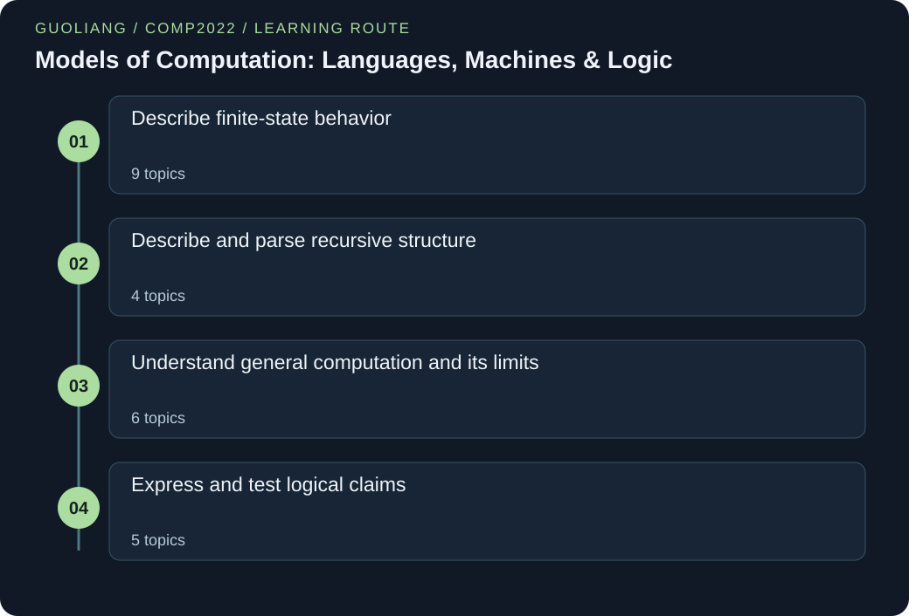

# COMP2022 — Models of Computation: Languages, Machines & Logic

> Guoliang | Original study notes

[English](COMP2022.md) · [中文](COMP2022.zh.md)



Build a connected understanding of regular languages, grammars, Turing machines and formal logic. Original stories and worked examples turn definitions into tools for constructing models, testing claims and explaining impossibility.

An independently written guide to finite automata, grammars, computability and logic. Each topic includes original worked problems, definitions, reasoning checks and teaching notes.

## Connected knowledge framework

### Describe finite-state behavior
- [Strings, languages and specifications](#languages-specifications)
- [Regular expressions as language algebra](#regular-expressions)
- [DFA states as summaries of the past](#dfa-state-invariants)
- [Nondeterminism and epsilon moves](#nfa-epsilon)
- [Converting an NFA to a DFA](#subset-construction)
- [From automata back to expressions](#state-elimination)
- [Matching strategy and repeated work](#regex-execution)
- [Closure and decision procedures for regular languages](#regular-decision-problems)
- [Proving that finite memory is insufficient](#finite-memory-limits)

### Describe and parse recursive structure
- [Grammars and recursive structure](#context-free-grammars)
- [Parse trees and ambiguity](#parse-trees-ambiguity)
- [Chomsky normal form without changing the language](#chomsky-normal-form)
- [CYK: build large parses from small spans](#cyk-parsing)

### Understand general computation and its limits
- [Turing machines and configurations](#turing-machine-configurations)
- [Designing machines with marking and invariants](#turing-machine-design)
- [Simulation, universality and the Church–Turing thesis](#universality-simulation)
- [Recognizers versus deciders](#recognizers-deciders)
- [Why universal termination tests cannot exist](#undecidability-diagonalization)
- [Dovetailing and complement](#recognizable-closure)

### Express and test logical claims
- [Propositional syntax and truth](#propositional-semantics)
- [Equivalent formulas and safe rewriting](#logical-equivalence)
- [Negation normal form and conjunctive normal form](#propositional-normal-forms)
- [Entailment and countermodels](#logical-consequence)
- [Objects, quantifiers and scope](#predicate-logic)

<a id="languages-specifications"></a>

## Strings, languages and specifications

### 01 / The story

Imagine a gatekeeper checking delivery labels. Before choosing a scanner, the depot must say which labels are allowed: perhaps any sequence of A and B that ends in B. A specification describes that rule independently of the device used to check it. The device might keep a tiny light on its panel, run a program, or consult a lookup table.

Those implementations can look completely different yet make the same decisions. The analogy has a limit: real scanners can fail mechanically, whereas our mathematical machines follow their rules exactly. We study whether the rules describe the intended set of labels.

### 02 / The principle

An alphabet is a finite set of symbols; a string is a finite sequence over that alphabet. The empty string ε has length zero. A language is any subset of all finite strings, not necessarily a spoken language or a set with a practical description. A decision problem can be represented as language membership: yes instances belong to the language.

A specification states the input domain and required answer, while an algorithm provides a procedure. An implementation is correct only if its behavior satisfies that specification on every allowed input. For general computation, also state whether termination is required; producing correct answers whenever a program happens to finish is weaker than always producing an answer.

### 03 / The formula, unpacked

```text
Σ* = ⋃ₖ≥₀ Σᵏ;  L ⊆ Σ*;  |ε| = 0
```

Σ is the alphabet and Σᵏ is the set of strings of length k. The star means all finite lengths, including length zero, so ε always belongs to Σ*. L is a language chosen from that universe.

Vertical bars give string length here, not set size. These definitions describe allowable inputs and yes answers; they do not assert that a machine exists to decide membership in every possible L.

### 04 / A first worked example

Take Σ = {A, B} and specify L as the strings ending in B. The strings B, AB and BAB belong; ε, A and BAA do not. A correct decision procedure first handles an empty input by rejecting, then checks whether the last symbol is B.

It may inspect the final character directly if the representation permits that, or scan left to right while remembering the latest character. Both procedures implement the same specification. A procedure that merely checks whether B occurs anywhere fails on BAA, providing a concrete counterexample rather than just an intuition that something is wrong.

### Words to know

- **Alphabet:** A finite set of allowed symbols.

- **String:** A finite ordered sequence of symbols.

- **Specification:** A rule stating allowed inputs and required outputs.

### Let us work through it

**Why separate a rule from a scanner?**

Different procedures can satisfy the same rule; we must judge them against one shared target.

**How many length-two strings use {x,y}?**

Each of two positions has two choices, giving 2×2=4: xx, xy, yx, yy.

**Is {ε} empty?**

No. It contains one string of length zero.

### Count a finite slice

Over Σ={x,y}, list every string of length at most two that ends in x. Count ε among candidate inputs, but apply the ending rule literally.

**Choose the method**

Partition by length so no candidate is missed or counted twice.

1. Length zero contributes ε. It has no final x, so reject it.

2. Length one contributes x and y. Only x ends in x.

3. Length two contributes xx, xy, yx, yy. Inspecting the second position keeps xx and yx.

**Interpret the answer**

The selected language slice is {x,xx,yx}, containing three strings.

**Check the reasoning**

For positive length n, fixing the final x leaves 2^(n−1) choices. At n=1 and 2 this gives 1+2=3.

### Repair an incorrect test

The rule is “binary input contains exactly two 1s.” A proposed test accepts whenever length is two. Test 10 and 101, then state a correct procedure that halts.

**Choose the method**

Compare the proposed predicate with the actual count, then replace the predicate.

1. For 10, length is two, so the proposal accepts. Its 1-count is one, so the required answer is no.

2. For 101, length is three, so the proposal rejects. Its 1-count is two, so the required answer is yes.

3. Scan the finite input once, adding one when a 1 appears. After the last symbol, accept exactly when the count equals two.

**Interpret the answer**

The length-only test has both false acceptance and false rejection. The counting procedure halts after all input symbols.

**Check the reasoning**

The empty string gives count zero and is rejected, while 11 gives count two and is accepted.

### Guoliang's further thinking

**Input validity comes first**

If the alphabet is {x,y}, the string xz is outside the input domain. Decide whether an implementation reports an input error or a no answer; do not silently change the mathematical language.

**A counterexample is decisive**

One disagreement is enough to disprove an implementation’s universal correctness claim. A thousand successful tests do not cover infinitely many inputs.

**Watch out:** Confusing ε with ∅: ε is one string; ∅ contains no strings. The language {ε} has one member.

<details>
<summary>Check your understanding</summary>

Is the set of all binary strings a single string?

No. It is the infinite language {0,1}*. Every individual member is finite, even though there are infinitely many members.

</details>

<a id="regular-expressions"></a>

## Regular expressions as language algebra

### 01 / The story

A small toy factory builds products from three instructions: choose one of two designs, place two pieces side by side, or repeat a piece any finite number of times. A regular expression is a similar recipe for strings. Choice produces alternatives, concatenation joins pieces, and repetition allows a variable number of copies.

The recipe describes all possible finished products, not the order in which a factory makes them. Repetition can choose zero copies, which is easy to miss. Also, this mathematical recipe excludes powerful extras found in some programming libraries, so claims about regular languages should use the basic operations explicitly.

### 02 / The principle

Regular expressions are built recursively from symbols, the empty language, the empty string, union, concatenation and Kleene star. Their semantics assign a language to every expression. Union accepts a string from either operand. Concatenation accepts strings that can be split into a left part from the first language and a right part from the second. Star permits zero or more concatenated members of one language.

Parentheses determine grouping; standard shorthand gives star higher precedence than concatenation, and concatenation higher precedence than union. Matching here means membership of the whole string. Substring search is a different task unless the expression explicitly permits arbitrary surrounding text. A regular expression is a specification, not a commitment to a particular backtracking implementation.

### 03 / The formula, unpacked

```text
L(R|S) = L(R) ∪ L(S)
L(RS) = {uv : u ∈ L(R), v ∈ L(S)}
L(R*) = ⋃ₖ≥₀ L(R)ᵏ
```

R and S denote expressions, while L(R) denotes the language represented by R. The vertical bar inside an expression denotes choice. The product uv is string concatenation, and the superscript k means k concatenated pieces rather than numerical exponentiation of a string.

In particular, L(R)⁰ is {ε}. These equations are recursive definitions: evaluate small expressions first, then combine their languages using the corresponding operation.

### 04 / A first worked example

Consider R = (ab|c)*d over {a,b,c,d}. Each repeated block is either ab or c, followed by exactly one final d. Choosing the blocks ab, c, ab produces abcabd, which matches. Choosing zero blocks produces d, so that also matches.

The string acd fails: before the final d, the prefix ac cannot be divided into ab and c blocks because its first a lacks the required following b. The string dcc fails because the d must occur at the end. Writing out the block decomposition gives a direct membership explanation.

### Words to know

- **Union:** Accept a string from either alternative.

- **Concatenation:** Place one string after another.

- **Kleene star:** Zero or more concatenated members of a language.

### Let us work through it

**Why does zero repetition matter?**

It adds ε even if the repeated block is nonempty.

**How can xyx be split for (xy|x)*?**

Choose xy followed by x, so it belongs.

**Does matching a prefix prove a whole match?**

No. Every remaining symbol must also be consumed by the expression.

### Decompose a new pattern

For R=(xy|z)*x, decide membership of xyzzx, x and zxy. Match the whole string.

**Choose the method**

Separate the final required x before decomposing the repeated prefix.

1. xyzzx ends with x. The prefix xyzz splits as xy,z,z, all allowed blocks.

2. The string x leaves an empty prefix. Zero repeated blocks are allowed by star.

3. zxy ends in y, so it cannot supply the final x, regardless of its earlier blocks.

**Interpret the answer**

xyzzx and x match; zxy does not.

**Check the reasoning**

Removing the final x from the pattern would change the language: ε would then match.

### Compare star placement

Over {a,b}, find a string in a*b* but not (ab)*, and a string in (ab)* but not a*b*.

**Choose the method**

Inspect block order: grouped runs versus alternating pairs.

1. The string aab has two a symbols followed by one b, so it belongs to a*b*.

2. Every nonempty (ab)* string alternates a then b and has even length. aab has length three, so it is excluded.

3. The string abab is two ab blocks, but after its first b another a occurs. This violates the all-a-before-all-b structure.

**Interpret the answer**

aab witnesses the first difference; abab witnesses the reverse. Neither language contains the other.

**Check the reasoning**

Both expressions still accept ε, so sharing the empty string does not establish equivalence.

### Guoliang's further thinking

**Expression versus implementation**

The expression says which strings belong. Backtracking and simultaneous state simulation may execute it differently while agreeing on all answers.

**Star is not plus**

One-or-more repetition can be written RR*. Its omission of ε matters when R itself cannot generate ε.

**Watch out:** Assuming R* excludes the empty string. Zero repetitions always contribute ε, even when R itself matches nothing.

<details>
<summary>Check your understanding</summary>

What is the difference between a*b and (ab)*?

a*b has any number of a symbols followed by one b. (ab)* repeats an entire ab block and also includes ε; for example aab belongs only to the first.

</details>

<a id="dfa-state-invariants"></a>

## DFA states as summaries of the past

### 01 / The story

A doorway counter needs only two lights to report whether an even or odd number of people has entered. It does not retain every arrival time. Each new arrival toggles the light, and the current light summarizes everything relevant to the final parity question.

A deterministic finite automaton uses states in this way: each state represents an information summary of the prefix already read. A good design begins by naming what each state means. The analogy stops when a task requires an unbounded exact count, because a fixed number of lights cannot remember arbitrarily many distinct totals.

### 02 / The principle

A DFA has a finite state set, an input alphabet, one start state, a set of accepting states and a total transition function. It processes exactly one symbol per transition. Every input therefore has one run, and acceptance depends on the state reached after the entire input has been consumed. Design states around an invariant: after reading a prefix, what information does the current state certify?

For parity, only even versus odd matters. For a fixed substring, a state can summarize the longest useful suffix. A complete definition includes every state-symbol transition, even transitions to a rejecting sink. Correctness follows by showing that the invariant holds initially and survives each transition, then relating accepting states to the specification.

### 03 / The formula, unpacked

```text
D = (Q, Σ, δ, q₀, F)
δ : Q × Σ → Q
w ∈ L(D) ⇔ δ*(q₀,w) ∈ F
```

Q is the finite set of states; q₀ is its start state and F is its accepting subset. δ gives the next state for one symbol. δ* extends this operation to a whole string: start at q₀ and apply δ repeatedly, with δ*(q,ε)=q.

The star on δ means an extended transition function here, rather than language repetition. The acceptance condition is checked only after all input symbols have been read.

### 04 / A first worked example

Build a DFA for binary strings containing an odd number of 1 symbols. Use states E and O, start at E, and accept only O. Reading 0 leaves either state unchanged. Reading 1 toggles E to O or O to E. On 10110 the state sequence is E, O, O, E, O, O, so the input is accepted.

On ε the state stays E, giving rejection. The invariant is precise: E means the processed prefix has even 1-count, and O means odd 1-count. That invariant proves the rule for every string, not just the examples.

### Words to know

- **State:** A finite summary of the processed prefix.

- **Invariant:** A statement preserved after every transition.

- **Accepting state:** A state that accepts if input has ended there.

### Let us work through it

**Why does a modulo counter need few states?**

The question ignores complete totals and only needs a remainder.

**What happens to remainder two after another 1 modulo three?**

2+1=3 has remainder zero, so transition to state zero.

**Does an accepting prefix ensure an accepted extension?**

No. An additional symbol can change the summarized property.

### Trace a remainder machine

Use states 0,1,2 for number of 1s modulo three. Start and accept at 0; reading 0 stays, reading 1 adds one modulo three. Trace 110101.

**Choose the method**

Record one state after each symbol and check the invariant against the cumulative count.

1. Start with count zero and state 0. The first two 1s give counts 1,2 and states 1,2.

2. The next 0 leaves state 2. The next 1 raises count to three and returns state to 0.

3. The final 0 leaves state 0; the final 1 raises count to four and ends in state 1.

**Interpret the answer**

The full state trace is 0,1,2,2,0,0,1. Reject because four is not divisible by three.

**Check the reasoning**

Directly count four 1s: 4 mod 3=1, independently matching the final state.

### Design a last-symbol machine

Over {a,b}, design a complete DFA accepting nonempty strings ending in b. Use only two states.

**Choose the method**

Remember only whether the most recently read symbol is b; group the empty prefix with rejection.

1. Name states N and B. N means empty or last symbol a; B means last symbol b. Start at N.

2. From either state, reading a goes to N and reading b goes to B. This specifies all four state-symbol pairs.

3. Accept only B after input ends. On bab the states are N,B,N,B; on ε the state stays N.

**Interpret the answer**

This complete DFA accepts bab and rejects ε, exactly following the final-symbol rule.

**Check the reasoning**

Appending a to any accepted string forces N, as the required final character has changed.

### Guoliang's further thinking

**Prove what the state means**

For a remainder machine, initialization uses count zero. A 0 preserves count; a 1 raises count and remainder together. These two cases prove every transition, not just one run.

**Representation is a design choice**

To ask whether the last symbol is 1, parity states are insufficient: 10 and 1 have the same parity but different last symbols. Choose the summary for the actual question.

**Watch out:** Accepting as soon as an accepting state is visited. A later symbol may leave that state; the whole input must be consumed.

<details>
<summary>Check your understanding</summary>

How many states suffice to recognize binary strings with a number of 1s divisible by three?

Three states, representing the count modulo three. Reading 1 advances the residue; reading 0 leaves it unchanged. Only residue zero accepts.

</details>

<a id="nfa-epsilon"></a>

## Nondeterminism and epsilon moves

### 01 / The story

Suppose a team searches a maze with a printed sequence of colored doors. At a junction, the team can explore every compatible branch. The mission succeeds when at least one explorer follows the entire color sequence and finishes in an approved room. A failed branch does not cancel a successful one.

Some corridors are uncolored and can be crossed without consuming a color from the list. Those resemble epsilon transitions. This is a reasoning device, not a claim that computers own infinitely many physical explorers: a finite set of reachable states can represent all active branches at once.

### 02 / The principle

An NFA allows zero, one or several next states for a state-symbol pair. An epsilon transition changes state without reading a symbol. Acceptance is existential: some finite path must consume the entire input and end in an accepting state. Paths that get stuck, finish in nonaccepting states or loop on epsilon moves do not invalidate another successful path.

NFAs are often easier to compose than DFAs. Union chooses a branch, concatenation links an accepting point of one machine to the next, and star permits repeated traversal with an empty-input option. These constructions explain how to turn regular expressions into automata. Nondeterminism changes the convenience and size of a description, but it does not enlarge the family of regular languages.

### 03 / The formula, unpacked

```text
δ : Q × (Σ ∪ {ε}) → 𝒫(Q)
Accept w iff some path labeled w ends in F
```

𝒫(Q) is the power set of Q, so one transition returns a set of possible states. ε labels consume no input symbols. A path label is obtained by concatenating its ordinary symbol labels and ignoring epsilon labels.

F is the accepting-state set. “Some” is the essential quantifier: acceptance needs one successful run. A missing transition means the empty set of next states, not an instruction to wait for a later symbol.

### 04 / A first worked example

To recognize strings over {a,b} ending in ab, let a start state loop on both letters. From that state an a can also lead to a second state, which takes b to a final state with no outgoing transitions.

On baab, one branch guesses the first a as the start of the suffix and then fails on the next a. Another branch waits, guesses the second a, then reads the final b and accepts. On aba, a branch reaches the final state after ab but cannot consume the last a, so the whole string is rejected.

### Words to know

- **Nondeterminism:** A transition may offer several possible next states.

- **Epsilon move:** A state change that consumes no input symbol.

- **Existential acceptance:** One finite successful complete run suffices.

### Let us work through it

**Why can one failing branch be ignored?**

Acceptance requires at least one success, not success on every branch.

**Does ε consume a space character?**

No. It consumes nothing; a literal space would be an ordinary alphabet symbol.

**Can reaching a final state early suffice?**

Only if a successful continuation consumes all remaining symbols.

### A free branch before a letter

States are s,p,f. Start s, accept only f. Edges: s—ε→p, s—a→s, p—b→f. No other edges exist. Decide aab and ba.

**Choose the method**

Maintain active states including all free ε moves before and after each symbol.

1. The initial closure is {s,p}. Each a uses the loop at s and then restores p by ε, so after aa the set is still {s,p}.

2. The last b moves p to f, so aab ends with active set {f} and accepts.

3. For ba, b first produces {f}. No a leaves f, so the active set becomes ∅ after a and the input rejects.

**Interpret the answer**

aab is accepted; ba is rejected. Being final after a prefix is not enough.

**Check the reasoning**

The successful strings are exactly a*b: any number of a symbols and one final b.

### Why swapping NFA finals fails

NFA states s,f, alphabet {a}, start s, final set {f}. Edges s—a→s and s—a→f only. Compare input a before and after swapping finals to {s}.

**Choose the method**

List both complete runs; complement should reverse the overall answer, not each path independently.

1. Originally, input a has runs ending at s and f. The run ending at f accepts, so the NFA accepts.

2. After swapping finals, those same runs still exist. Now the run ending at s accepts.

3. Thus both machines accept a. A true complement must reject a because the original accepted it.

**Interpret the answer**

Swapping finals does not produce the complement for this NFA.

**Check the reasoning**

Determinizing gives one subset {s,f} after a. Flipping acceptance of that single subset correctly reverses the answer.

### Guoliang's further thinking

**Simulate possibilities together**

Track a set of reachable states after each prefix. Two paths arriving at the same state with the same unread suffix have identical future options and can be merged.

**An ε cycle is finite in the closure**

Closure search marks visited states. A cycle p→q→p adds p and q once each, rather than demanding endlessly repeated traversal.

**Watch out:** Complementing an NFA by swapping final and nonfinal states. Existential acceptance prevents this simple trick; convert to a complete DFA first.

<details>
<summary>Check your understanding</summary>

If one branch accepts and another loops forever on epsilon moves, is the input accepted?

Yes. NFA acceptance asks whether an accepting finite run exists; the behavior of another branch does not remove it.

</details>

<a id="subset-construction"></a>

## Converting an NFA to a DFA

### 01 / The story

A control-room display can replace a team of maze explorers with a set of illuminated rooms. After each incoming color, it turns off the old lights and illuminates every room the team could now occupy. There is only one display configuration after a given prefix, even though many explorers may have followed different routes.

That configuration is a DFA state. Epsilon corridors require a little extra work: illuminate every room reachable for free before continuing. The display may have many possible configurations, because a set of a few rooms has exponentially many subsets, even if only a small fraction occur during real runs.

### 02 / The principle

Subset construction makes one DFA state for each reachable set of NFA states. Begin with the epsilon closure of the NFA start state. To read a symbol, take all corresponding symbol transitions from the current set, then take epsilon closure again.

A subset is accepting when it intersects the NFA accepting set. The empty subset is a rejecting sink and should be included when it is reachable. The correctness invariant says that after every prefix, the DFA state equals exactly the states reachable in the NFA after that prefix, allowing epsilon moves.

This proves equal languages. A machine with m NFA states has at most 2ᵐ subset states, although an implementation should normally generate reachable subsets rather than enumerate all of them.

### 03 / The formula, unpacked

```text
S₀ = E({q₀})
Δ(S,a) = E(⋃q∈S δ(q,a))
S is accepting ⇔ S ∩ F ≠ ∅
```

E(S) is the epsilon closure of a state set S, including S itself and all states reachable using only epsilon edges. Δ is the transition function of the new DFA; δ belongs to the original NFA.

The union gathers every possible ordinary a move. F contains original accepting states. Read the final condition as “at least one active NFA state accepts,” which preserves the existential meaning of nondeterminism.

### 04 / A first worked example

Take NFA states p, q and r. Start at p, allow an epsilon move p→q, let p loop on a, let q take b to r, and accept only r. The initial DFA state is {p,q}. Reading a moves p to p and q nowhere, then epsilon closure restores q, so the set remains {p,q}.

Reading b moves only q to r, producing {r}. A further a or b produces ∅. Therefore aab finishes in {r} and accepts, while aaba finishes in ∅ and rejects. The construction makes the language a*b visible without guessing individual paths.

### Words to know

- **Subset state:** One DFA state representing several possible NFA states.

- **Epsilon closure:** All states reachable without consuming symbols, including the starting set.

- **Sink:** A state whose every transition returns to itself.

### Let us work through it

**Why close after each ordinary move?**

The NFA may then take free moves before reading another symbol.

**How many subsets can four states have?**

Each state is either included or excluded, so 2⁴=16.

**Must every possible subset be created?**

No. Reachable-subset construction omits those no input can reach.

### Construct four reachable subsets

NFA states 0,1,2; start 0; final 2. Edges: 0—ε→1, 1—x→1, 1—y→2. Alphabet {x,y}; missing moves are empty. Build its reachable DFA.

**Choose the method**

Begin from the closure, then explore new subsets until none remain.

1. Start A={0,1}. On x it reaches B={1}; on y it reaches C={2}.

2. B loops on x and goes to C on y. C has no ordinary moves, so both symbols reach D=∅.

3. D loops on both symbols. Only C contains final state 2, so only C accepts. Four subsets A,B,C,D are reachable.

**Interpret the answer**

The DFA has four reachable subset states and recognizes x*y.

**Check the reasoning**

There are at most 2³=8 subsets. A and B behave identically and can later be merged, yielding a smaller equivalent DFA.

### Close through a cycle

ε edges are p→q, q→r, r→q. The only a edge is r→f; only f is accepting. Start p. Find initial closure and the subset after a.

**Choose the method**

Use a visited set so a free-move cycle is explored finitely.

1. Include p using zero moves. From p add q; from q add r.

2. From r the ε edge returns to q, already included. Stop with E({p})={p,q,r}.

3. On a, p and q contribute no destinations, while r contributes f. No ε leaves f, so the next subset is {f}.

**Interpret the answer**

Initial subset is {p,q,r}; input a ends at accepting subset {f}.

**Check the reasoning**

Without the initial closure, p has no a move and the incorrect simulation would reject a.

### Guoliang's further thinking

**Closure contains its input**

A state can stay in place using zero ε moves. Forgetting that zero-step option can make a valid starting state disappear.

**The empty subset is useful**

Once no branch survives, no later symbol can revive one. The empty subset loops on every symbol and makes the resulting DFA complete.

**Watch out:** Forgetting epsilon closure at the start or after a symbol. Either omission can lose a valid accepting path.

<details>
<summary>Check your understanding</summary>

Can a subset containing both accepting and rejecting NFA states accept?

Yes. It accepts whenever at least one contained state is accepting, because at least one NFA branch has succeeded.

</details>

<a id="state-elimination"></a>

## From automata back to expressions

### 01 / The story

Imagine redrawing a transport map after removing a small station. Every route that entered that station, possibly traveled around a local loop, and then left must be represented by a new direct connection. Existing direct routes remain available as alternatives. Repeating this process leaves only an origin and a destination, joined by a description of every possible journey.

State elimination performs that compression with regular expressions on edges. The final description can become much longer than the original map, and different station-removal orders can produce different-looking descriptions of exactly the same collection of journeys.

### 02 / The principle

A generalized NFA labels edges with regular expressions rather than single symbols. Add a fresh start state with no incoming edges and a fresh accepting state with no outgoing edges, connecting the old boundaries with epsilon edges.

Missing edges denote ∅, and parallel edges are combined by union. When removing a state k, update every surviving edge i→j with an alternative for traveling through k: enter it, loop there any number of times, then leave. Once only the new start and finish remain, their edge expression denotes the original language.

Together with expression-to-NFA and subset constructions, this establishes equal expressive power for regular expressions, NFAs and DFAs. Equal expressive power does not imply equal representation size or equal practical execution cost.

### 03 / The formula, unpacked

```text
Rᵢⱼ ← Rᵢⱼ | Rᵢₖ(Rₖₖ)*Rₖⱼ
```

Rᵢⱼ denotes the expression labeling the current edge from state i to state j. State k is the one being removed. The new alternative concatenates an entry route, zero or more loops at k, and an exit route.

The old direct route stays in the union. All edge expressions used for one elimination step refer to the graph before that step; the formula applies to surviving states i and j.

### 04 / A first worked example

Suppose a generalized automaton has start s, middle k and finish f. Its labels are s→k:a, k→k:b, k→f:c and s→f:d. Removing k changes the s→f label to d|ab*c. The string abbbc follows the a entry, three b loops and c exit.

The string ac uses zero loops, and d uses the original direct edge. The string abcabc is excluded because after reaching f there is no way to restart. If the direct edge had been absent, its label would be ∅ and the resulting expression would simplify to ab*c.

### Words to know

- **Generalized edge:** An edge labelled by a regular expression.

- **Elimination:** Removing a state while preserving all possible surviving routes.

- **Loop:** A route from a state back to itself.

### Let us work through it

**Why keep the old edge?**

Some accepted routes never visit the removed state.

**What does a missing loop contribute?**

Its star contributes ε, representing zero visits around the loop.

**Does a longer expression mean a different language?**

No. Elimination order affects representation length without changing accepted strings.

### Eliminate a looping middle state

States s,k,f have labels s→f:u, s→k:v, k→k:w|x, k→f:y. No other edges. Remove k and test vwxwy.

**Choose the method**

Separate routes that avoid k from those entering, looping and leaving it.

1. The route avoiding k already contributes u and must remain.

2. The route through k contributes v(w|x)*y, since each loop independently chooses w or x.

3. For vwxwy, take entry v, loops w,x,w, and exit y. All pieces match the required order.

**Interpret the answer**

The final expression is u|v(w|x)*y, and vwxwy is accepted.

**Check the reasoning**

The zero-loop path vy also matches; u remains accepted without entering k.

### Distinguish no edge from a free edge

There is no s→f edge. Labels are s→k:ε, k→f:ab, and no k loop. Remove k. Then compare with the variant where s→k is absent.

**Choose the method**

Substitute ∅ for missing edges, but ε for existing free edges.

1. In the first graph, substitute ∅ | ε(∅)*ab. The old direct alternative is empty.

2. Because ∅*={ε}, concatenate ε, ε and ab to obtain ab.

3. In the variant, entry is ∅, so ∅ | ∅(∅)*ab = ∅. No route can enter k.

**Interpret the answer**

A free entry permits exactly ab; a missing entry permits no string.

**Check the reasoning**

Neither first graph nor its expression accepts ε, because the exit still requires both a and b.

### Guoliang's further thinking

**Use one old graph per update**

Compute every route through k from the pre-elimination labels. Mixing newly updated labels into the same step can accidentally count routes with unintended repeated structure.

**Empty language is an annihilator**

If there is no entry or no exit, that through-route is ∅. In contrast, an ε entry or exit costs no symbol but still permits the route.

**Watch out:** Dropping the old i→j expression when eliminating k. Routes that never visit k must remain represented.

<details>
<summary>Check your understanding</summary>

What happens when the removed state has no self-loop?

Its loop label is ∅, and ∅*={ε}. The new route is simply the entry expression followed by the exit expression.

</details>

<a id="regex-execution"></a>

## Matching strategy and repeated work

### 01 / The story

A librarian tries to divide a long row of identical cards into packets of one or two. If a final requirement cannot be met, the librarian might undo the latest choice and try another partition, then another, repeatedly exploring arrangements with the same remaining task. A more organized librarian records every distinct situation already reached and merges equivalent attempts.

This distinction explains why a compact regular expression can run slowly in a backtracking engine even though finite-state matching is possible. The pattern's mathematical language and the engine's search strategy are separate layers, and both matter when judging performance.

### 02 / The principle

The membership problem asks whether a whole input string belongs to a regular expression's language. A naive recursive or backtracking matcher can explore many decompositions of the same prefix, repeating equivalent subproblems. Thompson-style NFA simulation instead maintains a set of active states and updates that set per input symbol, including epsilon closure.

For an NFA with O(m) states and edges built from an expression of size m, straightforward active-state simulation takes O(mn) time on an input of length n and O(m) working space. Determinizing first permits O(n) matching for a fixed DFA with constant-time transitions, but constructing that DFA may require exponentially many states. These bounds concern basic regular expressions; extensions such as backreferences are outside this finite-state model.

### 03 / The formula, unpacked

```text
NFA simulation: O(mn) time, O(m) active-state space
Fixed DFA simulation: O(n) time, after preprocessing
```

m measures the size of a Thompson-style NFA, including its transitions, and n is input length. At each character, epsilon reachability and ordinary transitions are processed without endlessly revisiting already included states.

The DFA bound treats the automaton as already constructed and transition lookup as constant time. Neither bound says that every library engine implements this strategy, and preprocessing cost must be counted when the expression itself is part of the input.

### 04 / A first worked example

Consider the expression (a|aa)*b and the string aaaaac. The five a symbols can be divided into blocks of one or two in several ways: a,a,a,a,a or aa,a,aa, among others. Every choice eventually fails because the required final b is absent. A backtracking strategy may rediscover that failure through many decompositions.

An NFA simulation merges branches that reach the same state after the same prefix, then rejects when c has no valid continuation. Appending b instead gives aaaaab, which matches. This example illustrates repeated search work without changing the regular language being specified.

### Words to know

- **Backtracking:** Undo a choice and try an alternative path.

- **Active set:** All states reachable after the current input prefix.

- **Preprocessing:** Work performed before a particular input is matched.

### Let us work through it

**Why can a short pattern be slow?**

Its execution may revisit many decompositions that lead to the same failure.

**What information lets two attempts merge?**

The same automaton state and the same input position give the same remaining task.

**Is DFA construction always cheap?**

No. A subset construction can create exponentially many states even when later matching is linear.

### Count repeated decompositions

For pattern (a|aa)*b and input aaaaac, count decompositions of the five a symbols into length-one or length-two blocks. Do not claim a count of all engine instructions.

**Choose the method**

Let F(n) count decompositions. Condition on whether the first block has length one or two.

1. F(0)=1 for the empty decomposition and F(1)=1 for one single block.

2. For n≥2, F(n)=F(n−1)+F(n−2), because removing the first block leaves one of those lengths. Thus F(2)=2 and F(3)=3.

3. Continue: F(4)=3+2=5 and F(5)=5+3=8. Every decomposition still meets c rather than the required b.

**Interpret the answer**

There are eight decompositions, all unsuccessful. This measures repeated alternatives, not a universal runtime.

**Check the reasoning**

Replacing c by b changes membership to yes without changing the eight possible a-block decompositions.

### Separate preparation from matching

Assume an already built DFA makes one transition per symbol. Three inputs have lengths 4,7,9. Its construction took 30 abstract work units; each transition costs one. Find matching and total cost.

**Choose the method**

Sum the per-input scans, then add the one-time preparation cost once.

1. The first input requires four transitions; the second requires seven. Their subtotal is 11.

2. Add the third input’s nine transitions to obtain 20 matching units.

3. Add construction cost 30 once, giving 50 total units for the three inputs.

**Interpret the answer**

Matching costs 20 units; the complete batch costs 50. Linear scanning does not erase setup.

**Check the reasoning**

If every input used a new DFA with the same construction cost, setup would be 90 and total 110.

### Guoliang's further thinking

**Count states, not imaginary people**

An active set never needs multiple copies of the same state for membership. Path counts may grow while the set stays small; counting parses is a different problem.

**Amortize setup only when justified**

A fixed DFA reused for many strings can spread construction cost over them. For a new pattern on every request, excluding setup can give a misleading comparison.

**Watch out:** Concluding that regular-expression matching is inherently exponential because one backtracking implementation takes exponential time on a pattern.

<details>
<summary>Check your understanding</summary>

Why can two NFA runs reaching the same state after the same prefix be merged?

Their remaining possible behavior depends only on that state and the unread suffix. The distinct histories add no information needed for membership.

</details>

<a id="regular-decision-problems"></a>

## Closure and decision procedures for regular languages

### 01 / The story

Two security sensors can be monitored by one panel that records both sensor modes. If the first has three modes and the second has four, the combined panel needs at most twelve pairs. A policy can approve a pair when both sensors approve, when either approves, or when they disagree.

This illustrates the product of two automata. The choice of accepting pairs expresses the policy while the transition structure stays the same. Inspecting which pairs are reachable can then answer whether a disagreement is possible at all, providing a finite procedure for comparing two apparently different specifications.

### 02 / The principle

Regular languages are closed under union, intersection and complement. For complete DFAs over a common alphabet, a product construction tracks a pair of states and updates both components on each input symbol. Choose final pairs according to the desired Boolean operation. Complement is simpler: swap accepting and nonaccepting states of a complete DFA. Membership is decided by simulation.

Nonemptiness is decided by graph reachability from the start to an accepting state. Equivalence reduces to emptiness of the symmetric difference: if no reachable product state has exactly one accepting component, the machines agree on every string. Converting regular expressions to DFAs therefore gives decision procedures for expression equivalence, although the conversion may cause exponential growth.

### 03 / The formula, unpacked

```text
δ×((p,q),a) = (δ₁(p,a),δ₂(q,a))
L₁ = L₂ ⇔ (L₁ ∖ L₂) ∪ (L₂ ∖ L₁) = ∅
```

p and q are states of the first and second DFA, and δ₁ and δ₂ are their transition functions. δ× is the product transition. L₁ and L₂ denote the two languages.

Set difference keeps strings in one language but not the other; their union here is the symmetric difference. These formulas assume the same input alphabet. If needed, complete either automaton with a rejecting sink before taking complements or products.

### 04 / A first worked example

Let machine A accept binary strings ending in 1, and machine B accept binary strings with an odd number of 1s. To compare them, start their product at (not-ending-in-1, even). On input 10, A first moves to its accepting state and then back to rejection; B toggles to odd on 1 and stays odd on 0.

The final pair has exactly one accepting component. Thus 10 witnesses that the languages differ. A reachability search can discover such a pair and reconstruct its input using predecessor links. One counterexample is sufficient; checking many agreeing strings is not.

### Words to know

- **Product state:** A pair recording one state of each machine.

- **Symmetric difference:** Strings belonging to exactly one of two languages.

- **Reachability:** Whether a finite path leads from the start to a state.

### Let us work through it

**Why is one disagreement enough?**

Equivalence requires agreement on every input, so any counterexample defeats it.

**What is the product size bound for three and five states?**

At most 3×5=15 pairs, though some can be unreachable.

**Can swapping finals work on a complete DFA?**

Yes. Every input has exactly one complete run, so flipping its final acceptance flips the answer.

### Intersect two small rules

Over {0,1}, A accepts even length and B accepts strings ending in 1. Construct the acceptance rule of the product and test 101 and 01.

**Choose the method**

Track length parity and final-symbol status independently; intersection needs both.

1. Use product states (E,N),(E,Y),(O,N),(O,Y), starting at (E,N). Every symbol toggles parity; its value sets Y for 1 or N for 0.

2. 101 has length three and ends in 1, so its state is (O,Y), which fails the even-length condition.

3. 01 has length two and ends in 1, so it ends at (E,Y), the sole accepting pair.

**Interpret the answer**

The intersection accepts 01 and rejects 101; only (E,Y) is final.

**Check the reasoning**

ε has even length but no last 1, so the chosen start pair correctly rejects it.

### Find a language counterexample

A accepts an even number of 1s. B accepts strings ending in 0, with ε rejected. Over {0,1}, find a shortest disagreement including the possibility ε.

**Choose the method**

Check the start pair before exploring edges; an empty word has length zero.

1. At ε, A has seen zero 1s. Zero is even, so A accepts.

2. B explicitly rejects ε because it has no last symbol. Thus the start pair already disagrees.

3. No string has length below zero, so no shorter disagreement is possible.

**Interpret the answer**

ε is a shortest counterexample, and the languages differ immediately at their start states.

**Check the reasoning**

The string 0 is accepted by both, showing why starting only with nonempty examples could hide the easiest witness.

### Guoliang's further thinking

**Common alphabet matters**

A complement is relative to Σ*. Changing the alphabet changes which unseen symbols must be rejected or accepted, so complete both machines over the same alphabet.

**Shortest evidence by breadth first**

Breadth-first search of the product finds a shortest disagreement word when each edge consumes one symbol. Store incoming symbols as well as parents to reconstruct it.

**Watch out:** Flipping final states in an incomplete DFA without adding a sink. Missing transitions must become accepting rejection-complement behavior too.

<details>
<summary>Check your understanding</summary>

How can a finite search establish agreement on infinitely many strings?

Every string induces a path in the finite product graph. If no reachable state represents disagreement, no string can be a counterexample.

</details>

<a id="finite-memory-limits"></a>

## Proving that finite memory is insufficient

### 01 / The story

A cloakroom attendant has a fixed set of cards to remember how many guests have entered. If the attendant must later admit exactly the same number of exits, eventually two different arrival totals must share a card. From that moment, identical exit sequences produce identical behavior even though one total should pass and the other should fail.

This is more than a failed attempt to invent better cards: it is an argument against every fixed finite card system. The crucial issue is an unbounded exact requirement. A bounded maximum number of guests, or merely counting modulo a fixed number, changes the problem.

### 02 / The principle

To prove a language nonregular, show that no finite-state summary can preserve all distinctions needed by future suffixes. For L={aⁿbⁿ:n≥0}, assume a DFA with m states exists. Among the m+1 prefixes ε,a,…,aᵐ, two different prefixes aⁱ and aʲ must lead to the same state. Appending the same suffix bⁱ then makes the machine behave identically on both strings.

But aⁱbⁱ belongs to L and aʲbⁱ does not. This contradiction proves nonregularity. Another technique uses closure: if a hypothetical regular language combined with known regular languages would produce a known nonregular one, the hypothesis fails. Neither argument says that the language is undecidable; it only rules out finite automata.

### 03 / The formula, unpacked

```text
δ*(q₀,aⁱ) = δ*(q₀,aʲ), i < j
⇒ δ*(q₀,aⁱbⁱ) = δ*(q₀,aʲbⁱ)
```

m is the number of states, so m+1 examined prefixes force a repeated state by the pigeonhole principle. i and j are two distinct prefix lengths, and bⁱ is a shared distinguishing suffix. δ* is the extended DFA transition.

The implication follows because a deterministic machine in the same state processes the same remaining input identically. The contradiction concerns membership of the two completed strings, not their different lengths alone.

### 04 / A first worked example

Consider the language E of strings over {a,b} with equally many a and b symbols in any order. Suppose E were regular. The language a*b* is regular, and regular languages are closed under intersection. Their intersection would contain exactly a block of a symbols followed by an equally long block of b symbols: {aⁿbⁿ:n≥0}.

The repeated-state argument proves that language nonregular, giving a contradiction. Therefore E is not regular either. Notice that abba belongs to E but not to a*b*; the intersection deliberately removes mixed-order strings to expose the known hard pattern.

### Words to know

- **Pigeonhole principle:** More objects than categories force two objects into one category.

- **Distinguishing suffix:** The same appended string creates different required membership answers.

- **Nonregular:** No finite automaton recognizes the language.

### Let us work through it

**Why use m+1 prefixes?**

There are only m states, so some two prefixes must share one.

**Why append exactly bⁱ?**

It balances the shorter a-prefix but not the longer one.

**Does nonregular mean no algorithm can decide it?**

No. A machine with unbounded working memory can count and compare these finite inputs.

### Work through a forced collision

Suppose a hypothetical DFA for {aⁿbⁿ:n≥0} reaches the same state after a² and a⁵. Explain why this collision contradicts correctness.

**Choose the method**

Find one common suffix that one prefix needs and the other must reject.

1. Choose suffix b² because it supplies exactly two b symbols for the shorter prefix.

2. The completed a²b² has equal counts and must be accepted; a⁵b² has five a and two b and must be rejected.

3. Both runs start that suffix in the same state. Determinism forces identical later states and final decisions, contradicting those requirements.

**Interpret the answer**

Those two prefixes cannot share a state in any correct DFA for the language. Arbitrarily many needed distinctions rule out a finite DFA.

**Check the reasoning**

Using suffix b⁵ reverses which completed string is balanced and yields the same contradiction.

### A bounded version is regular

Let L₃={aⁿbⁿ:0≤n≤3}. Give a regular expression and explain why the infinite-language proof does not apply unchanged.

**Choose the method**

Enumerate the finitely many allowed n values rather than seek a repeated unbounded counter.

1. n=0 gives ε and n=1 gives ab.

2. n=2 gives aabb and n=3 gives aaabbb; there are no other allowed n values.

3. Take the union ε|ab|aabb|aaabbb. A finite expression is a regular description of all four strings.

**Interpret the answer**

L₃ is regular. The earlier proof needs arbitrarily many distinct necessary prefixes, absent under this fixed bound.

**Check the reasoning**

a⁴b⁴ is rejected despite having equal counts, because n=4 exceeds the stated limit.

### Guoliang's further thinking

**Quantifiers carry the proof**

The state count m is arbitrary. Showing one three-state machine fails would be weaker than starting from any finite m and deriving a contradiction.

**A bound changes the language**

Restricting n≤3 leaves only ε,ab,aabb,aaabbb. A finite list can always be recognized, even though the unbounded pattern cannot use finite memory.

**Watch out:** Claiming that failure to draw a DFA proves nonregularity. A proof must rule out every possible finite DFA, not only designs tried so far.

<details>
<summary>Check your understanding</summary>

Is {aⁿbⁿ:0≤n≤20} nonregular?

No. It is finite, so a DFA or a finite union of explicit expressions can recognize it. The unbounded requirement drives the impossibility proof.

</details>

<a id="context-free-grammars"></a>

## Grammars and recursive structure

### 01 / The story

A builder can make a nested storage box by choosing either an empty compartment or a small box enclosed inside a larger one. The instructions can refer back to themselves, so a finite recipe produces arbitrarily deep nesting. A context-free grammar works similarly: a named unfinished component can be replaced with a pattern containing terminals and more unfinished components.

The final object is complete only when no unfinished components remain. This analogy explains recursion, but a grammar does not prescribe a physical execution schedule. Different replacement orders may describe the same structure and produce the same final string.

### 02 / The principle

A CFG consists of nonterminal variables, terminal symbols, production rules and a start variable. Each rule replaces one nonterminal with a finite sequence, possibly ε. “Context-free” means the rule is available regardless of neighboring symbols. A derivation begins at the start variable; only all-terminal results belong to the language.

Grammars express nesting beyond finite-state memory. Correctness has two directions: every generated string must satisfy the intended property, and every intended string must be generatable.

Context-free languages are closed under union, concatenation and star: rename component variables to avoid collisions, then add a fresh start rule choosing, joining or repeating their start variables. Unlike regular languages, they are not closed under arbitrary intersection or complement. Every regular language is context-free, but the reverse is false.

### 03 / The formula, unpacked

```text
G = (V, Σ, P, S)
L(G) = {w ∈ Σ* : S ⇒* w}
```

V is the set of nonterminals, Σ the disjoint terminal alphabet, P the production set and S the start nonterminal. One ⇒ means one rewriting step; ⇒* means zero or more such steps.

A derivation may pass through mixed strings containing nonterminals, but these intermediate forms are not language members. The condition w∈Σ* ensures that the final result contains only terminals, including the possible empty string ε.

### 04 / A first worked example

Use the grammar S→[S]S | ε for balanced square brackets. To generate [][] first choose S⇒[S]S, replace the inner S by ε to obtain []S, expand the remaining S to [S]S, and replace both remaining variables by ε. To generate [[]], expand the first inner S instead.

Why does this grammar cover every balanced bracket string? Any nonempty balanced string has an initial [ whose matching ] separates an interior balanced string from a following balanced suffix. Those two smaller pieces fit exactly the two S positions. This decomposition supports a proof by induction on string length.

### Words to know

- **Nonterminal:** A named component that still needs rewriting.

- **Terminal:** A symbol allowed in the finished string.

- **Derivation:** A sequence of rule applications starting at the start variable.

### Let us work through it

**Why can a finite grammar generate infinitely many strings?**

A recursive rule can be applied any finite number of times.

**Is aSb already a language member?**

Not while S is a nonterminal; its remaining work must be finished.

**Does generating several examples prove completeness?**

No. One must explain how every intended string can be generated.

### Generate a mirrored word

Grammar S→aSa|bSb|ε over {a,b}. Give a complete derivation of abba and describe a property of every generated word.

**Choose the method**

Match the outer equal symbols, recurse on the middle, and stop with ε.

1. The outer symbols of abba are a, so apply S⇒aSa.

2. Its inner target is bb, so replace that S using bSb: aSa⇒abSba.

3. Replace the remaining S by ε, obtaining abba with no variables left. Each wrapping adds two equal end symbols.

**Interpret the answer**

S⇒aSa⇒abSba⇒abba. Every generated word is an even-length palindrome.

**Check the reasoning**

The word aba is a palindrome but odd length, so this grammar cannot generate it. The length invariant explains why.

### Build concatenation with fresh names

G₁ has A→aA|ε and G₂ has B→bB|b. Build a grammar for one G₁ string followed by one G₂ string, then derive aab.

**Choose the method**

Keep disjoint variables A and B and use a fresh start that joins them.

1. Add S→AB. A generates zero or more a symbols and B generates one or more b symbols.

2. Derive S⇒AB⇒aAB⇒aaAB⇒aaB by two recursive A steps and then A→ε.

3. Use B→b to obtain aab. No rule can place an a after a b because the two components remain in order.

**Interpret the answer**

The grammar generates a*b⁺, meaning any a block followed by a nonempty b block. It derives aab.

**Check the reasoning**

b is allowed when A disappears immediately, while ε is excluded because B cannot vanish.

### Guoliang's further thinking

**Soundness and completeness differ**

A grammar that generates only ε is sound for balanced brackets but incomplete. It never generates a bad bracket string, yet misses every nonempty good one.

**Rename before combining**

Two grammars may both call a variable S while meaning different things. Rename their variables before joining them; otherwise rules can interact unintentionally.

**Watch out:** Mistaking a sentential form such as [S] for a generated terminal string. A derivation must finish all nonterminals.

<details>
<summary>Check your understanding</summary>

What language does S→aS | b generate?

Exactly {aⁿb:n≥0}. Each recursive step adds one leading a; the final rule contributes one b and ends the derivation.

</details>

<a id="parse-trees-ambiguity"></a>

## Parse trees and ambiguity

### 01 / The story

A written expression can resemble a set of assembly instructions with missing grouping marks. If one technician joins the first two pieces before adding the third, while another joins the last two first, they may build different structures from the same line of symbols. A parse tree makes the structure explicit.

Its leaves record the visible string, while its internal nodes show how the grammar assembled it. Two different schedules of doing independent work do not necessarily create different structures. Ambiguity is about different trees, so it cannot be established merely by listing two arbitrary orders of applying rules.

### 02 / The principle

A parse tree records one derivation's hierarchical structure. Its root is the start variable, each internal node expands according to a production, and the leaf yield is read left to right. A grammar is ambiguous when some string has two distinct parse trees, equivalently two distinct leftmost derivations.

Arithmetic grammars such as E→E+E | E×E | n are ambiguous because neither operator precedence nor associativity is fixed. A layered grammar can enforce precedence: expressions combine terms by addition, terms combine factors by multiplication, and factors provide atoms or parentheses.

Ambiguity belongs to a particular grammar; demonstrating one ambiguous grammar does not prove that its language has no unambiguous grammar. Parsing chooses structure, which is necessary before evaluation or translation can be reliable.

### 03 / The formula, unpacked

```text
Ambiguous G ⇔ ∃w ∈ L(G) with at least two distinct parse trees
```

G is a grammar and w is a terminal string. The existential quantifier means one witness string is enough. Distinct parse trees differ in their production structure, not in handwriting or traversal order.

A leftmost derivation always expands the leftmost remaining nonterminal, removing irrelevant choices of expansion schedule. The statement is a definition of ambiguity rather than an algorithm that decides ambiguity for every possible grammar.

### 04 / A first worked example

For E→E+E | E×E | n, the string n+n×n has one tree whose root operation is addition and another whose root is multiplication. Assigning the three n leaves values 2, 3 and 4 gives 2+(3×4)=14 under the first tree, but (2+3)×4=20 under the second.

To enforce multiplication precedence, use E→E+T | T, T→T×F | F and F→n | (E). Now an unparenthesized multiplication is built inside a term, so the addition must sit above it. Parentheses can still request the other interpretation explicitly.

### Words to know

- **Parse tree:** A hierarchy showing which grammar rules build the string.

- **Precedence:** A rule deciding which operator groups more tightly.

- **Associativity:** How repeated operators at the same level group.

### Let us work through it

**Why are two arbitrary derivations insufficient?**

They might only expand independent branches in different orders and describe one tree.

**How can one expression have values 17 and 27?**

For 5+4×3, 5+(4×3)=17 but (5+4)×3=27.

**Does addition precedence also settle subtraction associativity?**

No. Repeated subtraction needs a separate grouping rule.

### Two trees, different results

Use E→E+E|E×E|n, where n denotes a number token. The three number tokens display values 5, 4 and 3 in that order. Exhibit two parses of 5+4×3 and evaluate them.

**Choose the method**

Choose a different root operation while keeping the leaf sequence unchanged.

1. Choose root +, with left leaf 5 and right subtree 4×3. Multiply first: 4×3=12.

2. Add at the root: 5+12=17. This tree represents 5+(4×3).

3. Choose root × instead, with left subtree 5+4=9 and right leaf 3. Its root value is 9×3=27.

**Interpret the answer**

Both trees yield the same unparenthesized text but values 17 and 27, proving this grammar ambiguous.

**Check the reasoning**

Adding explicit parentheses distinguishes the two requested structures and removes this particular ambiguity.

### Expansion order is not tree ambiguity

Grammar S→AB, A→a, B→b has no other productions. Compare expanding A first versus B first.

**Choose the method**

Write both derivations, then compare their parent–child structure.

1. Expanding A first gives S⇒AB⇒aB⇒ab.

2. Expanding B first gives S⇒AB⇒Ab⇒ab.

3. Both trees have root S, children A and B, and leaves a under A and b under B. No production choice differs.

**Interpret the answer**

The two schedules describe one parse tree. They do not establish ambiguity; this grammar is unambiguous.

**Check the reasoning**

Only the first schedule is leftmost throughout, which removes the irrelevant order choice.

### Guoliang's further thinking

**Same value can hide ambiguity**

Two trees for 1+2+3 both evaluate to six, but they remain distinct trees. Equality of numeric results does not prove a grammar unambiguous.

**Repair the grammar rather than guess**

Separating expression, term and factor makes precedence part of syntax. An evaluator can then follow the tree instead of adding an inconsistent after-the-fact rule.

**Watch out:** Calling two derivations ambiguous when they only expand independent branches in different orders. Compare trees or use leftmost derivations.

<details>
<summary>Check your understanding</summary>

Can an ambiguous grammar generate a regular language?

Yes. Ambiguity concerns the representation, not its expressive class. For example S→A|B, A→a and B→a gives two parses of the finite regular language {a}.

</details>

<a id="chomsky-normal-form"></a>

## Chomsky normal form without changing the language

### 01 / The story

A furniture company wants every assembly instruction to have one of two shapes: join two unfinished components, or attach one finished piece. Complex instructions are split into smaller named stages. Optional components and aliases need careful handling so that the revised booklet still builds exactly the same products.

Chomsky normal form provides this disciplined shape for grammar rules. The aim is not to make the instructions short or elegant; it is to make parsing easier to reason about. A special empty-product exception is preserved separately, because an assembly tree with visible leaves cannot represent a product containing no pieces.

### 02 / The principle

In CNF, ordinary productions have form A→BC or A→a. A fresh start symbol may additionally produce ε if the language contains it, and that start symbol must not occur on any right-hand side. Conversion preserves the language by introducing helper variables for terminals in longer rules, splitting long right-hand sides into binary rules, eliminating nullable-variable occurrences with all required alternatives, and removing unit productions through reachability among aliases.

The order and bookkeeping matter: a nullable variable may occur more than once, and deleting epsilon rules without adding alternatives loses strings. For a nonempty word of length n, a CNF parse has n terminal-producing nodes and n−1 binary-production nodes. This bounded shape makes membership decidable and supports dynamic programming.

### 03 / The formula, unpacked

```text
A→BC or A→a; optionally S₀→ε
Nonempty parse with n terminals uses 2n−1 production applications
```

A, B and C are nonterminals, a is a terminal and S₀ is the protected start symbol. The optional empty production is the only epsilon exception. n is the length of a nonempty derived string.

Its binary parse skeleton has n leaves and n−1 internal branching nodes; terminal productions add the n leaf applications. This count assumes CNF and does not apply to arbitrary grammars with unit chains or nullable cycles.

### 04 / A first worked example

Start with S→aS | b. Introduce A→a so the mixed rule becomes S→AS. Because S appears on a right-hand side, introduce a new start S₀ and initially link S₀→S. Removing that unit rule copies S's nonunit productions, giving S₀→AS | b, S→AS | b and A→a.

The result is CNF and still generates aⁿb for n≥0. For aab, derive S₀⇒AS⇒aS⇒aAS⇒aaS⇒aab. There are five production applications, matching 2×3−1. Different expansion orders give the same count because the binary parse structure fixes the number of required nodes.

### Words to know

- **CNF:** Grammar rules restricted to two variables or one terminal, with a protected start exception.

- **Nullable:** A variable can derive ε.

- **Unit production:** A rule A→B containing a single variable on the right.

### Let us work through it

**Why introduce a terminal helper?**

A binary CNF rule must contain two variables, not a mixture such as aB.

**How many CNF steps produce four terminals?**

Four terminal rules plus three binary rules give 2×4−1=7.

**Can ε be handled by the same positive-length count?**

No. It has no terminal leaves and uses the separate start exception.

### Convert one length-three rule

Grammar S→aBC, B→b, C→c has only the word abc. Convert it to CNF without changing that language.

**Choose the method**

First isolate the terminal in the long rule, then split three variables into two-variable steps.

1. Introduce A→a and replace S→aBC by S→ABC. The generated symbols are unchanged.

2. Introduce X→BC and replace the long rule with S→AX. Every S step now produces two variables.

3. Keep B→b and C→c. The rules S→AX, X→BC, A→a, B→b, C→c are all permitted forms.

**Interpret the answer**

The CNF grammar still generates exactly abc. It uses two binary and three terminal productions per parse.

**Check the reasoning**

For n=3, 2n−1=5 matches those five applications. No alternative rules can generate another word.

### Remove a repeated nullable variable

Grammar S→AA and A→a|ε. Preserve its language using CNF with S allowed as a protected start. S never appears on a right-hand side.

**Choose the method**

Enumerate independent keep/drop choices for both A occurrences before removing ε and unit rules.

1. Keep both A to retain S→AA. Drop one to obtain S→A; dropping either occurrence gives the same rule.

2. Drop both to retain S→ε. Because S is protected, this empty rule is allowed.

3. Remove A→ε, leaving A→a. Replace unit S→A by S→a. Final rules are S→AA|a|ε and A→a.

**Interpret the answer**

Both grammars generate exactly {ε,a,aa}; the final one is CNF with the stated start exception.

**Check the reasoning**

Deleting A→ε without adding S→a and S→ε would lose two of the three words.

### Guoliang's further thinking

**Preserve choices before deleting**

If a variable can vanish, every relevant occurrence can be kept or omitted. Deleting its ε rule first can silently remove short words.

**Normal form is a tool**

CNF may add many helper variables. The benefit is a predictable binary parse structure, not necessarily a compact grammar or shorter prose.

**Watch out:** Calling every rule of length at most two CNF. A→B is a unit rule and A→aB mixes a terminal with a nonterminal; both need conversion.

<details>
<summary>Check your understanding</summary>

If A appears twice in B→AA and A is nullable, what shorter alternatives may be needed?

B→A and B→ε may be needed, in addition to B→AA. Afterwards remove forbidden epsilon and unit rules while preserving the start-symbol exception.

</details>

<a id="cyk-parsing"></a>

## CYK: build large parses from small spans

### 01 / The story

A proofreader examines a sentence by first labeling each individual word, then each pair, then each longer segment. A long segment earns a label only when it can be cut into two already understood pieces that match a grammar rule. The table stores useful answers so the proofreader does not rediscover the same segment repeatedly.

CYK follows this plan for CNF grammars. It does not assume that a promising split is the only split; every boundary must be considered. The table answers membership directly, and storing successful choices also allows reconstruction of an actual parse tree.

### 02 / The principle

Use half-open intervals: T[i,j] is the set of nonterminals deriving the substring w[i:j], with positions 0 through n. Initialize length-one intervals using terminal rules. Then process lengths 2 through n. For every split k strictly between i and j and every rule A→BC, add A when B belongs to T[i,k] and C belongs to T[k,j].

All dependencies have shorter spans, so this order is valid. Accept a nonempty word exactly when the start variable is in T[0,n]. Handle ε separately using the grammar's start exception. With direct scans of binary productions, time is O(|P|n³) and table membership storage is O(|V|n²). For a fixed grammar these become cubic time and quadratic space.

### 03 / The formula, unpacked

```text
T[i,i+1] = {A : A→w[i]}
T[i,j] = {A : ∃k, i<k<j, A→BC, B∈T[i,k], C∈T[k,j]}
```

i is an inclusive start position, j an exclusive end position, and k is the boundary between two nonempty substrings. w[i:j] therefore has length j−i. P is the grammar's production set and V its nonterminal set.

T stores sets, not a single winning variable, since one substring may have multiple grammatical roles. The recurrence applies after CNF conversion and only to nonempty spans; empty-input membership is checked separately.

### 04 / A first worked example

Use S→AB, A→AA | a and B→b. Parse w=aab. Initialize T[0,1]={A}, T[1,2]={A} and T[2,3]={B}. For length two, T[0,2] includes A because A→AA combines the first two cells. T[1,3] includes S because S→AB combines the final a and b.

For T[0,3], split at k=2: A∈T[0,2] and B∈T[2,3], so add S and accept. The shorter cell containing S is not itself enough; acceptance requires S in the cell for the whole string. Recording the successful split reconstructs the tree S(A(A(a),A(a)),B(b)).

### Words to know

- **Span:** A contiguous substring between two boundaries.

- **Dynamic programming:** Store shorter subproblem answers and reuse them in larger problems.

- **Half-open interval:** Include the start position and exclude the end position.

### Let us work through it

**Why store a set in each cell?**

Several variables may derive the same substring and be useful in different parent rules.

**What does T[1,3] cover in abc?**

Positions 1 and 2, giving bc; position 3 is only the end boundary.

**Does S in a short cell prove full acceptance?**

No. The start variable must appear in the cell spanning the whole word.

### Fill a small CYK table

CNF grammar S→AC, C→BB, A→a, B→b. Parse abb using boundaries 0,1,2,3.

**Choose the method**

Initialize letters and grow spans so every child is available before its parent.

1. Length-one cells are T[0,1]={A}, T[1,2]={B}, T[2,3]={B}.

2. For length two, ab has no applicable binary rule, so T[0,2]=∅. The two b cells combine by C→BB, so T[1,3]={C}.

3. For the full span, split at k=1: A in T[0,1] and C in T[1,3] satisfy S→AC, so add S.

**Interpret the answer**

S∈T[0,3], so abb is accepted with tree S(A(a),C(B(b),B(b))).

**Check the reasoning**

The grammar has no alternative productions, so its only possible terminal word is indeed abb.

### Reject despite valid letters

Use the same grammar S→AC, C→BB, A→a, B→b and test bab. Explain the whole-span failure.

**Choose the method**

Check all possible binary splits, not just whether every letter has a terminal rule.

1. The diagonal cells for b,a,b are {B},{A},{B}. Every individual letter is known.

2. Neither ba nor ab matches the only length-two rule C→BB, so both length-two cells are empty.

3. At k=1 the right span is empty; at k=2 the left span is empty. Neither split can supply A followed by C.

**Interpret the answer**

T[0,3]=∅ and bab is rejected. Valid symbols do not guarantee a valid structure.

**Check the reasoning**

Compare accepted abb: it alone places an a before the required two-b region.

### Guoliang's further thinking

**Keep all successful splits**

Membership needs only whether a variable is present. To recover all parses, retain each successful rule and split rather than just one pointer.

**Cubic is a loop structure**

There are quadratically many intervals, and each can have linearly many splits. Grammar scanning adds a separate factor; fixed-grammar cubic time does not mean constant cost.

**Watch out:** Mixing inclusive and exclusive endpoints. If T[i,j] denotes w[i:j], its children must be T[i,k] and T[k,j], with no missing or repeated character.

<details>
<summary>Check your understanding</summary>

Why not fill spans in arbitrary order?

A cell depends on shorter spans. Increasing length ensures every required subproblem is finished before it is used.

</details>

<a id="turing-machine-configurations"></a>

## Turing machines and configurations

### 01 / The story

Picture a meticulous clerk with a long strip of squared paper, a pencil and a small instruction card. The card says what to do based on the clerk's current mode and the symbol in the square under the pencil. One step may replace that symbol, move the pencil one square, and change mode.

Unlike a finite automaton, the clerk can revisit earlier squares and leave reminders. The strip supplies expandable memory while the instruction card remains finite. Infinite tape is an idealization of unbounded available storage, not a requirement to complete infinitely many operations in one step.

### 02 / The principle

A Turing machine combines finite control with a read-write tape and a movable head. Its tape alphabet includes the input alphabet plus a blank symbol and possibly markers. A configuration records the current state, head position and tape contents; the transition function determines the next configuration. Most tape cells remain blank after any finite computation.

A machine can halt and accept, halt and reject, or continue forever. When using it as a function computer, specify how the output is encoded on the tape and where the head should finish. Different standard conventions, such as one-sided versus two-sided tape or allowing a stationary move, change descriptions but not which functions are computable. Time and simulation overhead can still differ.

### 03 / The formula, unpacked

```text
δ(q,a) = (q′,b,d),  d ∈ {L,R,S}
C₀ ⊢ C₁ ⊢ C₂ ⊢ ⋯
```

q is the current control state, a the symbol under the head, q′ the next state, b the symbol written and d the movement direction. S denotes staying at the same cell.

Cᵢ is the complete configuration after i steps, and ⊢ denotes one valid transition. Halting states have no further computational work. A transition reads the current cell only; the entire tape is not inspected at once.

### 04 / A first worked example

Design a machine that scans a binary string and replaces every 0 with 1, leaving existing 1s unchanged. In state scan, reading either 0 or 1 writes 1, moves right and stays in scan. Reading blank enters a halting state without changing the tape.

Starting with 010 and the head on its first symbol, the nonblank tape evolves to 110, then 110, then 111. One more transition sees the blank and halts. On empty input it halts immediately. The machine's finite state does not store the whole word; the tape records the evolving output.

### Words to know

- **Configuration:** Current state, head position and tape contents together.

- **Tape alphabet:** All symbols that may be written, including blank and markers.

- **Transition:** One rule that reads, writes, moves and changes state.

### Let us work through it

**Why is state alone not a configuration?**

The same state can read different cells or symbols and therefore have different next steps.

**What does a right move from position 2 do?**

It makes the next head position 3 after the current cell is written.

**Does unbounded tape mean infinite work per step?**

No. Each step accesses one cell and makes one bounded move.

### Trace a bit-flipping machine

In scan, read 0→write 1,R,scan; read 1→write 0,R,scan; read blank→write blank,S,halt. Input 101 occupies positions 0–2, head starts 0. Trace until halt.

**Choose the method**

Record both tape and head after each transition; unchanged control state does not mean nothing happened.

1. At position 0 read 1, write 0 and move to 1. Tape is 001.

2. At position 1 read 0, write 1 and move to 2. Tape is 011.

3. At position 2 read 1, write 0 and move to blank position 3. Tape is 010. The fourth transition sees blank and halts there.

**Interpret the answer**

Output is 010, with head at 3 after four transitions.

**Check the reasoning**

Flipping all output bits again gives original 101, independently checking the transformation.

### One configuration, one legal next step

Tape positions 0,1,2 contain a,b,blank. Head is 1 in q. Rule δ(q,b)=(r,X,L). Compute the next configuration.

**Choose the method**

Read the indicated cell, then separate writing, movement and control update.

1. Head position 1 contains b, so this rule applies; the a at position 0 is not read now.

2. Replace position 1 by X. The tape becomes a,X,blank while all other cells remain unchanged.

3. Move left from 1 to 0 and change q to r. The new head reads a only on the next transition.

**Interpret the answer**

Next configuration has state r, head 0 and tape aX followed by blanks.

**Check the reasoning**

The tape change is local: neither moving left nor changing state erases the a.

### Guoliang's further thinking

**State output conventions**

If a computation leaves useful digits among temporary markers, “the output is on tape” is incomplete. Say which cells form the output and whether markers must be erased.

**Count the halting transition**

A scanner often needs one extra step to see the first blank after the data. Counting only changed cells can undercount its execution even when some writes do not alter a symbol.

**Watch out:** Treating a missing transition, rejection and infinite looping as interchangeable. State the convention and distinguish halting outcomes from divergence.

<details>
<summary>Check your understanding</summary>

Can a Turing machine have infinitely many states?

Not in the standard model. Its control description is finite; unbounded working storage comes from the tape.

</details>

<a id="turing-machine-design"></a>

## Designing machines with marking and invariants

### 01 / The story

A clerk checks pairs of parcels by placing a sticker on one parcel from the left group, walking to the right group and placing a matching sticker there, then returning to repeat. The stickers are memory that survives the clerk's walk.

If the right group runs out too early, or extra unpaired parcels remain at the end, the shipment fails. This pattern is useful when the comparison needs unbounded memory but the machine has only finitely many modes. A good design says what each trip guarantees and why there cannot be infinitely many trips on a finite shipment.

### 02 / The principle

An implementation-level TM description can use phases rather than enumerate every transition immediately. Define each phase's invariant, the tape markers it expects, and the exit conditions for success or failure. For aⁿbⁿ, first ensure the input has one a block followed by one b block. Repeatedly mark the leftmost unmarked a, find and mark one unmarked b, then return to the left boundary.

Reject if a partner is unavailable; accept only when all a and b symbols are marked. The number of unmarked a symbols strictly decreases on each successful pass, proving termination. Each pass may scan O(n) cells and there are O(n) passes, yielding an O(n²) upper bound for this simple single-tape implementation, not a universal lower bound.

### 03 / The formula, unpacked

```text
Invariant after r complete passes: r a-symbols and r b-symbols are marked
Remaining-a count decreases by one per successful pass
```

r counts completed pairing passes. The invariant refers to a tape that has already passed the a*b* shape check, so marked symbols still correspond to two ordered blocks.

The remaining-a count is a nonnegative integer used as a termination measure. n in the running-time bound is total input length. A phase description must also explain boundary detection and malformed inputs before it can be expanded into a fully specified transition table.

### 04 / A first worked example

Run the pairing method on aaabbb. After the shape check, the first pass produces XaaYbb. The next passes produce XXaYYb and XXXYYY. A final scan sees no unmarked letters and accepts. On aabbb, two passes produce XXYYb; the remaining b causes rejection.

On abab, the shape check rejects before pairing, because a occurs after the b block starts. These three traces test equal counts, unequal counts and incorrect order separately. Merely matching counts would accidentally accept some mixed-order strings outside the target language.

### Words to know

- **Marker:** A tape symbol recording that a position has been processed.

- **Phase:** A group of steps serving one clearly stated purpose.

- **Termination measure:** A nonnegative quantity that strictly decreases during repeated progress.

### Let us work through it

**Why check order before pairing?**

Equal counts alone would also accept mixed strings such as abab.

**What does a completed pass guarantee?**

Exactly one new a and one new b have been marked.

**Is the quadratic bound a universal lower bound?**

No. It bounds this simple repeated-scan design, not every model or algorithm.

### Reject a shortage of partners

Use X to mark a and Y to mark b. Run the ordered-block pairing algorithm on aaaabb. Each round marks the leftmost unmarked a and b.

**Choose the method**

Trace full successful rounds, then locate the first missing partner.

1. The shape a*b* is valid. First round pairs one a and b, leaving XaaaYb.

2. Second round leaves XXaaYY. Two a symbols remain but all b symbols are marked.

3. Third round selects an a, giving XXXaYY, but the right scan finds no unmarked b before blank. Reject at this explicit failure.

**Interpret the answer**

aaaabb is rejected because four a symbols cannot be paired with two b symbols.

**Check the reasoning**

Direct counts 4≠2 confirm the outcome; the machine does not need to store the count four in its finite control.

### Prove the pairing loop halts

Input is a finite a-block followed by a b-block, total length n. Each scan ends at a tape boundary or explicit failure. Prove the algorithm cannot complete infinitely many pairing rounds.

**Choose the method**

Use unmarked a count as a decreasing nonnegative integer.

1. Initially let the unmarked a count be u, with 0≤u≤n.

2. Every successful round marks exactly one previously unmarked a, so the measure changes u→u−1. No rule restores it.

3. After at most the initial u successful rounds, the count reaches zero. A missing b can reject earlier; the final leftover-b check is a finite scan.

**Interpret the answer**

All permitted inputs terminate. Combining at most n rounds with O(n) work per round gives this implementation an O(n²) upper bound.

**Check the reasoning**

For u=0 there are no pairing rounds; a final scan still distinguishes ε from a nonempty b-block.

### Guoliang's further thinking

**Distinguish failure types**

Reject immediately for wrong order, reject when a selected a has no partner, and reject leftover b symbols at the end. Each check closes a different correctness gap.

**A decreasing counter needs finite phases**

Fewer unmarked a symbols proves finitely many successful passes only if each scan itself reaches a boundary or explicit failure. Include that scan-termination fact.

**Watch out:** Proving that accepted inputs are correct but forgetting termination or failing to reject unmatched symbols. A decider needs both directions and a halting argument.

<details>
<summary>Check your understanding</summary>

Why are marker symbols useful even though states can remember information?

Markers preserve an unbounded number of local facts on the tape. A fixed finite state set cannot remember an arbitrary collection of visited positions.

</details>

<a id="universality-simulation"></a>

## Simulation, universality and the Church–Turing thesis

### 01 / The story

A universal music player can perform many pieces because it reads a score supplied as data. Its hardware does not need to be rebuilt for every melody. A universal Turing machine similarly reads an encoded machine description together with that machine's input. It interprets the description step by step.

The analogy also exposes a limitation: following a score does not reveal in advance whether a strange score instructs the player to repeat forever. Universality is the power to simulate arbitrary encoded programs, not the power to predict every program's eventual behavior without executing it.

### 02 / The principle

A universal TM U simulates a machine M on input w from a finite encoding ⟨M,w⟩. It preserves the simulated outcome: acceptance, rejection or nontermination. Machine descriptions can be data because finite alphabets, states and transition tables admit finite string encodings. Equivalence between two formal computation models is established by simulations in both directions; one simulation alone proves only containment of power.

The Church–Turing thesis identifies effective algorithmic computation with Turing computability. It is a thesis about the informal notion of an algorithm, not a theorem proved merely by defining a TM. Specific simulation theorems, including universality and equivalence of standard tape variants, are mathematical results. Computational equivalence says nothing by itself about equal speed, memory cost or practical usability.

### 03 / The formula, unpacked

```text
U(⟨M,w⟩) simulates M(w)
M(w) accepts/rejects/diverges ⇒ U(⟨M,w⟩) has the same outcome
```

⟨M,w⟩ is a computable encoding of a finite machine description and a finite input string, with enough structure to separate them. U is one fixed machine, while M ranges over encoded machines. “Diverges” means the computation never halts.

The displayed relationship concerns behavior, not the number of simulation steps. A valid encoding also needs a defined treatment of malformed descriptions, commonly immediate rejection.

### 04 / A first worked example

Suppose M is a machine that writes one additional 1 after a unary input and then halts. Give U the encoding of M together with 111. U stores a simulated state and head position, looks up the applicable encoded rule, updates a representation of the simulated tape, and repeats until M's halting state appears.

The simulated output is 1111. Now give U a different machine whose only behavior is moving right forever. U also continues forever. Both cases are handled by the same interpreter, demonstrating universality while showing why it does not provide a halting test.

### Words to know

- **Encoding:** A finite string representing a machine or input.

- **Universal machine:** One interpreter able to simulate encoded machines.

- **Simulation overhead:** Extra work needed to reproduce another model’s steps.

### Let us work through it

**Why can a machine description be input data?**

Its finite rules can be listed and encoded using finite symbols.

**Does simulating a loop make it halt?**

No. A faithful simulation preserves nontermination.

**Why need both simulation directions?**

One direction proves only that the simulator is at least as expressive as the simulated model.

### Simulate a simple incrementer

Machine M scans right across unary 1s, writes one additional 1 at the first blank, and halts. Input is 11, head on its first symbol. Describe the simulated output and steps.

**Choose the method**

Keep simulated tape, head and state; apply one encoded rule at a time.

1. First scan step reads position 0=1, leaves it unchanged, and moves to position 1.

2. Second scan step reads position 1=1 and moves to blank position 2.

3. The next rule writes 1 at position 2 and enters halt. The simulated tape now contains 111.

**Interpret the answer**

The simulated output is 111, representing unary three. M uses three transitions under this stated convention.

**Check the reasoning**

The universal interpreter may use more than three of its own transitions to implement those three simulated steps.

### Track explicit simulation overhead

A toy interpreter needs 6 of its own steps per simulated step and 10 setup steps. The simulated program halts after 7 steps. Find total interpreter work; then discuss a nonhalting simulated program.

**Choose the method**

Separate fixed setup from repeated per-step cost, then distinguish finite cost from preserved divergence.

1. Seven simulated steps cost 7×6=42 interpreter steps.

2. Add setup once: 42+10=52. This is a cost model supplied by the question, not a universal bound.

3. If the simulated program takes infinitely many steps, reproducing every step requires infinitely many interpreter steps too.

**Interpret the answer**

The halting example costs 52 steps. Faithful simulation of the nonhalting example also never halts.

**Check the reasoning**

At zero simulated steps only setup remains, giving 10, consistent with the formula 10+6t.

### Guoliang's further thinking

**Behavior and resources are separate**

Two models can compute the same functions while taking very different numbers of steps. State both the preserved result and the resource relationship when discussing a simulation.

**Malformed encodings are ordinary inputs too**

A universal interpreter must recognize where the machine description ends and reject invalid formats according to a stated convention. Otherwise its formal input behavior is incomplete.

**Watch out:** Saying that the Church–Turing thesis proves all imaginable physical devices equivalent to TMs, or that simulation guarantees equal efficiency.

<details>
<summary>Check your understanding</summary>

Does a Python simulator of TMs alone prove that Python and TMs have equal power?

No. It shows Python can simulate TMs. The reverse direction, simulating the relevant Python computation model with TMs, is also required.

</details>

<a id="recognizers-deciders"></a>

## Recognizers versus deciders

### 01 / The story

A lost-property office can confirm that your bag has arrived when someone finds a matching tag. If it has not arrived, the clerk might keep searching indefinitely. A different office promises to finish checking a complete finite register and answer either yes or no.

The first behavior resembles recognition; the second resembles decision. Waiting a very long time at the first office does not turn silence into a reliable no. The difference is a guarantee about all inputs, not a difference in how friendly or fast the clerk seems on the requests observed so far.

### 02 / The principle

A recognizer for a language must accept every member and must never accept a nonmember. On nonmembers it may reject or run forever. A decider additionally halts on every input, so every membership question receives a correct yes or no.

Every decidable language is recognizable, but not every recognizable language is decidable. For encoded machine acceptance, universal simulation recognizes yes instances: if the simulated machine accepts, eventually that event is observed. If it rejects, the recognizer can reject; if it loops, the recognizer may loop.

Finite testing cannot establish that a program is a decider, because an untested input could diverge. A proof requires an argument that all permitted computations terminate as well as an argument that their answers are correct.

### 03 / The formula, unpacked

```text
L(M) = {w : M accepts w}
Decider: M halts for every w ∈ Σ*
Decidable languages ⊊ Recognizable languages
```

L(M) records only accepted strings; rejected and divergent computations are both outside this language. Σ* is the universe of finite input strings under the chosen encoding.

The strict inclusion symbol means every decidable language is recognizable and at least one recognizable language is not decidable. This classification describes existence of some appropriate machine, not whether a particular poorly designed implementation happens to terminate.

### 04 / A first worked example

Consider a program that examines candidates 0,1,2,… and accepts if it finds an integer x satisfying an input predicate P(x). Suppose each individual predicate check halts. If a witness exists, the program eventually reaches one and accepts. If none exists, the search continues forever.

Thus it recognizes the witness-existence property but does not automatically decide it. For P(x) meaning x²=49 it accepts at x=7. For P(x) meaning x²=50 over nonnegative integers it keeps searching, even though a human can design a better bounded procedure for this special predicate family. One looping implementation does not prove a language undecidable.

### Words to know

- **Recognizer:** Accepts every member and never accepts a nonmember; it may loop on nonmembers.

- **Decider:** Gives a correct membership answer and halts on every input.

- **Witness:** A finite object that establishes a yes answer.

### Let us work through it

**What can silence from a recognizer mean?**

It may not have found a future witness yet, or it may search forever; silence alone distinguishes neither.

**Why is every decider also a recognizer?**

Its correct accepting behavior satisfies recognition, with the stronger guarantee of stopping on no instances too.

**Can a poor recognizer exist for a decidable language?**

Yes. Decidability concerns existence of some decider, not quality of every implementation.

### A recognizer that loops on a simple no case

For input n≥0, test x=0,1,2,… and accept when x²=n. Each square test halts. Compare inputs 16 and 18.

**Choose the method**

Separate existence of a witness from termination when no witness exists.

1. For n=16, squares tested are 0,1,4,9,16, so x=4 supplies a witness and the program accepts.

2. For n=18, 4²=16 and 5²=25. Later nonnegative squares only grow, so no x satisfies the equation.

3. The specified program has no rule to stop after passing n. It keeps trying forever on 18 despite the available mathematical rejection argument.

**Interpret the answer**

This program recognizes perfect squares but does not decide them. It accepts 16 and diverges on 18.

**Check the reasoning**

A different program can reject as soon as x²>n. Thus the looping example does not prove the square language undecidable.

### Turn the special search into a decider

Modify square search: for integer n≥0, test x from 0 through n inclusive; accept on equality x²=n and otherwise reject after the loop. Prove correctness and termination.

**Choose the method**

Show the finite range contains every possible nonnegative square root.

1. For n=0, only x=0 is needed and it succeeds. For n≥1, any x>n has x²≥x>n, so cannot be a solution.

2. The loop checks n+1 candidates and each test halts, so total execution is finite.

3. An equality gives a genuine square witness. If none occurs in the sufficient range, no nonnegative integer solution exists, so rejection is correct.

**Interpret the answer**

The bounded procedure decides perfect-square membership. A tighter bound could improve speed without changing the answer.

**Check the reasoning**

For n=1, x=1 is included. Omitting the upper endpoint would incorrectly reject this boundary case.

### Guoliang's further thinking

**A proof needs universal termination**

Showing ten traces stop proves only those ten cases. A bound or decreasing measure covering every allowed input supplies the missing general argument.

**Restrictions may make search finite**

An unbounded witness search becomes a decider if a computable finite bound is proven sufficient. The bound must come from the problem, not an arbitrary timeout.

**Watch out:** Inferring nonmembership from a timeout, or inferring undecidability merely because one attempted algorithm loops.

<details>
<summary>Check your understanding</summary>

Can a recognizable language have a recognizer that rejects some nonmembers and loops on others?

Yes. Both behaviors are permitted outside the language. The only forbidden behavior there is acceptance.

</details>

<a id="undecidability-diagonalization"></a>

## Why universal termination tests cannot exist

### 01 / The story

Imagine a catalogue that claims to classify every possible catalogue-checking program, including programs that read their own catalogue entry. A mischievous program can inspect the prediction about itself and deliberately do the opposite. This self-reference creates a contradiction if the catalogue is always correct and always answers.

The argument does not depend on a machine being too slow or lacking enough memory. It attacks the possibility of a complete procedure. Real analysis tools remain useful because they can restrict the programs considered, permit uncertainty, or settle for guarantees that do not answer every question about every program.

### 02 / The principle

Assume a total algorithm H decides whether any encoded machine halts on any input. Construct a machine D that, on a machine description x, asks H whether x halts on input x. If H says yes, D loops forever; if H says no, D halts. Evaluate D on its own description.

Either answer from H contradicts D's defined behavior, so no such total correct H exists. The halting language is nevertheless recognizable by simulation until any halting outcome occurs. Acceptance is also recognizable but undecidable.

A related diagonal language, consisting of machine descriptions whose machines do not accept their own descriptions, is not recognizable: any proposed recognizer disagrees with it on its own description. Encodings and malformed inputs must be handled consistently in formal proofs.

### 03 / The formula, unpacked

```text
HALT = {⟨M,w⟩ : M halts on w}
D(x): if H(x,x)=yes then loop; otherwise halt
```

H is a hypothetical decider, so its answer is assumed to arrive on every well-formed pair. x encodes a machine and is also a legal input string to that machine.

D is a finite program using H as a subroutine. Substituting x=⟨D⟩ forces the contradiction. HALT includes both accepting and rejecting halts; it is different from the language of accepting computations alone.

### 04 / A first worked example

Suppose the hypothetical H predicts that D halts on ⟨D⟩. By its rule, D sees yes and deliberately loops, making the prediction false. Suppose instead H predicts that D does not halt. D sees no and immediately halts, again making the prediction false. These two cases exhaust the Boolean answers of a decider.

Adding a third “unknown” outcome avoids the contradiction but fails to decide the original problem. Restricting attention to programs with a fixed step limit also avoids it, because those programs can simply be simulated up to the limit; that is a different input class.

### Words to know

- **Undecidable:** No algorithm always halts with the correct answer for every allowed input.

- **Diagonalization:** Use a construction’s own description to force disagreement.

- **Total algorithm:** An algorithm guaranteed to halt on every input in its domain.

### Let us work through it

**What is assumed about H?**

It answers every well-formed machine-input pair correctly and always halts.

**What does D do after a yes prediction?**

It deliberately loops, contradicting a prediction that it halts.

**Does unknown escape the contradiction?**

It can, but then H is not a decider for every input.

### Complete the self-reference cases

Assume H is a total correct halting decider. Define D(x) to loop if H(x,x)=yes and halt if H(x,x)=no. Evaluate H on (⟨D⟩,⟨D⟩).

**Choose the method**

Exhaust the two possible Boolean answers rather than guessing which occurs.

1. If H returns yes, it predicts D halts on its own description. But D’s yes branch loops forever.

2. If H returns no, it predicts D does not halt there. But D’s no branch halts immediately.

3. Because H is total, it must return one of these answers. Both contradict correctness, so the starting assumption fails.

**Interpret the answer**

No total correct halting decider H exists for arbitrary encoded programs and inputs.

**Check the reasoning**

If H may fail to return, step three is unavailable. The proof targets complete deciders, not partial tools.

### A bounded question is decidable

Given a finite machine description M, input w and nonnegative integer B, decide whether M halts within at most B transitions. Explain a correct procedure, including B=0.

**Choose the method**

The supplied finite bound permits complete simulation up to that bound; answer only the bounded question.

1. Inspect the initial configuration. If it is already a designated halting configuration, answer yes even when B=0.

2. Otherwise perform at most B legal transitions, checking after each whether a halting state was reached. Answer yes if it was.

3. If none of those checked configurations halts, answer no to “within B”. The counter bounds the simulation, so this procedure itself terminates.

**Interpret the answer**

Bounded halting is decidable. A no answer means no halt within the bound, not never halting.

**Check the reasoning**

A machine halting at B+1 is correctly rejected by this bounded question but belongs to unrestricted HALT.

### Guoliang's further thinking

**Do not confuse halting with accepting**

A program that halts and rejects belongs to HALT. A recognizer for HALT therefore accepts after either simulated halt, not only after simulated acceptance.

**Useful tools remain possible**

A checker can prove termination for a restricted loop language with a decreasing integer counter. This does not conflict with the theorem, whose domain includes arbitrary programs.

**Watch out:** Concluding that no program can ever prove another program terminates. The theorem excludes one complete, always-correct decider for all programs and inputs.

<details>
<summary>Check your understanding</summary>

Why does this proof require H to halt on every input?

D must receive H’s answer before choosing its opposite behavior. If H can loop or say unknown, the contradiction no longer establishes a complete decision procedure.

</details>

<a id="recognizable-closure"></a>

## Dovetailing and complement

### 01 / The story

Two investigators search for opposite certificates about the same claim. One looks for evidence that the claim is true; the other looks for evidence that it is false. If you let the first investigator monopolize the room until finishing, the second may never get a turn. Instead, give them alternating time slots.

When one is guaranteed eventually to find the appropriate certificate, alternating effort guarantees a conclusion. This scheduling idea is dovetailing. It does not magically make an impossible certificate appear: its force comes from knowing that every case belongs to exactly one of the two searchable sides.

### 02 / The principle

Decidable languages are closed under complement, union and intersection because their deciders always finish. Swapping acceptance and rejection complements a decider. Recognizable languages are closed under union and intersection, but complement is not guaranteed. For union, simulate both recognizers fairly and accept when either accepts; sequentially waiting for the first can get stuck even if the second would accept.

For intersection, accept after both have accepted, using fair simulation as a uniform construction. A language is decidable exactly when both it and its complement are recognizable. To prove the reverse direction, dovetail the two recognizers; one must eventually accept, determining the answer. This theorem explains why the complement of a recognizable undecidable language cannot also be recognizable.

### 03 / The formula, unpacked

```text
L is decidable ⇔ L and Σ*∖L are recognizable
Union recognizer: accept when R₁ or R₂ accepts
Intersection recognizer: accept after both accept
```

Σ* fixes the entire universe of input strings, so complement includes every string outside L. R₁ and R₂ are recognizers, each with its own simulated configuration.

Fair simulation gives each unfinished process unboundedly many steps, for example alternating one step each. Acceptance flags can be remembered after a process halts. On a nonmember a combined recognizer may still run forever, which is consistent with recognition.

### 04 / A first worked example

Let Ryes recognize a language L and Rno recognize its complement. On an input z, suppose Ryes would loop forever while Rno accepts after 37 steps. A sequential strategy that waits for Ryes first never answers. Alternating one step of each simulator reaches the accepting event of Rno after at most 74 simulated steps, so the combined procedure rejects z.

If instead z belongs to L, Ryes is the process guaranteed eventually to accept. The combined procedure halts in either case. The guarantee requires complementary languages; two unrelated searches might both run forever on the same input.

### Words to know

- **Dovetailing:** Share steps fairly among simulations so none waits forever for another.

- **Complement:** All allowed input strings outside the language.

- **Acceptance flag:** A remembered fact that a simulation has already accepted.

### Let us work through it

**Why not run one recognizer to completion first?**

It may never finish on this input, preventing the other from finding a witness.

**What must an intersection recognizer remember?**

Whether each component has accepted; accept only after both flags are true.

**Why do complementary recognizers give a decider?**

Every input belongs to exactly one side, whose recognizer is guaranteed eventually to accept.

### Count fair simulation steps

Ryes recognizes L and Rno its complement. On input w, Ryes loops and Rno accepts on its fifth own step. Alternate Ryes then Rno, one step each. Find when the combined decider answers.

**Choose the method**

Number global simulated steps and track which machine receives each one.

1. Global steps 1,3,5,7,9 go to Ryes; they do not terminate its search.

2. Global steps 2,4,6,8,10 are Rno’s first through fifth steps. At global step 10 it accepts.

3. Acceptance by the complement recognizer certifies w∉L, so the combined machine rejects immediately.

**Interpret the answer**

The decider rejects after 10 simulated component steps, excluding scheduler bookkeeping.

**Check the reasoning**

Sequentially waiting for Ryes would never reach any Rno step, despite the five-step certificate.

### Why the complement cannot also be recognizable

Assume L is recognizable and undecidable. Suppose, for contradiction, that its complement has a recognizer C. Derive the contradiction without assuming either recognizer halts on all inputs.

**Choose the method**

Combine two partial successes with fair scheduling and membership exclusivity.

1. Run the given recognizer R for L and C for its complement in alternating steps on the same input.

2. If the input belongs to L, R eventually accepts; otherwise C eventually accepts. Neither can accept on the wrong side.

3. Accept when R accepts and reject when C accepts. Every input therefore receives a correct terminating answer.

**Interpret the answer**

This constructs a decider for L, contradicting the premise. Hence its complement is not recognizable.

**Check the reasoning**

For a decidable language there is no contradiction: both it and its complement have deciders and hence recognizers.

### Guoliang's further thinking

**Fairness is an algorithmic promise**

Alternating one step per live process is sufficient. Merely saying “try both” is incomplete if an implementation can give one process no further turns.

**Rejection is not a certificate of complement recognition**

A recognizer may reject some outsiders but loop on others. Reusing only its rejections cannot cover every member of the complement.

**Watch out:** Complementing a recognizer by swapping halting labels. Its infinite computations remain infinite, so previously unaccepted inputs do not all become accepted.

<details>
<summary>Check your understanding</summary>

If L is recognizable and undecidable, what can be said about its complement?

Its complement is not recognizable. Otherwise recognizers for both sides could be dovetailed to decide L, contradicting undecidability.

</details>

<a id="propositional-semantics"></a>

## Propositional syntax and truth

### 01 / The story

A laboratory alarm panel combines simple signals: a door is open, a fan is running, and a temperature limit is exceeded. The panel's wiring describes how the signals combine; their current on/off settings determine the resulting alarm value. Logic separates those two layers as syntax and semantics.

Parentheses are like wiring connections: changing them can change what the panel computes. The model assumes each signal has a definite truth value. It does not express measurement uncertainty or causal influence automatically, so a logical implication should not be mistaken for a physical mechanism connecting two sensors.

### 02 / The principle

Propositional formulas are built from atomic propositions and connectives such as negation, conjunction and disjunction. A truth assignment gives each atom a Boolean value, and the formula's value is computed recursively from its parse tree. Disjunction is inclusive unless exclusive-or is stated. Material implication P→Q is false only when P is true and Q false; when P is false, the implication is true.

A formula is satisfiable if at least one assignment makes it true, valid if every assignment does, and unsatisfiable if none does. With k atoms, a full truth table has 2ᵏ rows. This gives a finite decision procedure, though an exponential number of assignments can be expensive even when evaluating each individual assignment is easy.

### 03 / The formula, unpacked

```text
P→Q ≡ ¬P∨Q
Satisfiable F: ∃α, α(F)=1
Valid F: ∀α, α(F)=1
```

P and Q are formulas, F is the formula under examination and α is an assignment of truth values to atoms. α(F) extends that assignment recursively to the whole formula.

The symbols ∃ and ∀ mean “there exists” and “for every.” Here 1 denotes true. The equivalence for implication defines its truth-functional behavior; it does not say that P causes Q or that Q is relevant to P.

### 04 / A first worked example

Let p mean the sample is refrigerated and q mean its seal is intact. Consider F=p→q. The assignments (p,q)=(false,false), (false,true) and (true,true) satisfy F; only (true,false) falsifies it. Therefore F is satisfiable but not valid. Now add the requirement p, forming p∧(p→q).

The only satisfying assignment has p=true and q=true. If we additionally require ¬q, no assignment remains and the resulting conjunction is unsatisfiable. This stepwise reasoning shows how a set of requirements can rule out configurations without claiming that refrigeration itself physically ensures a seal is intact.

### Words to know

- **Truth assignment:** A choice of true or false for each atomic proposition.

- **Satisfiable:** True for at least one assignment.

- **Valid formula:** True for every assignment.

### Let us work through it

**Why are there eight rows for three atoms?**

Each has two choices, so 2×2×2=8 assignments.

**When is p→q false?**

Exactly when p is true and q is false.

**Can a satisfiable formula also be false somewhere?**

Yes. Satisfiable needs one true row; validity needs all rows true.

### Classify a constrained implication

For atoms p,q, classify F=(p→q)∧¬q as satisfiable, valid or unsatisfiable, using all four assignments.

**Choose the method**

The conjunction forces ¬q first; then inspect the implication on those remaining rows.

1. When q=true, ¬q=false, so both p choices make F false.

2. When q=false and p=true, p→q is false, so F is false.

3. When q=false and p=false, p→q is true and ¬q is true, so F is true.

**Interpret the answer**

Only (p,q)=(false,false) satisfies F. It is satisfiable but not valid.

**Check the reasoning**

Rewrite implication to obtain (¬p∨q)∧¬q, which under ¬q reduces to ¬p∧¬q.

### Count models of inclusive or

Let F=(p∨q)∧r with three independent Boolean atoms. Count satisfying truth assignments; “or” is inclusive.

**Choose the method**

Separate the forced atom r from the permitted p,q pairs.

1. Conjunction requires r=true. All four assignments with r=false fail.

2. For r=true, p∨q accepts (true,false), (false,true) and (true,true), but not (false,false).

3. Combine the single r choice with those three pairs to get 1×3=3 models among 2³=8 assignments.

**Interpret the answer**

F has three satisfying assignments and is satisfiable but not valid.

**Check the reasoning**

If “or” were exclusive, the both-true pair would be removed and the count would fall to two.

### Guoliang's further thinking

**Evaluate from inside outward**

First compute parenthesized subformulas, then their parent connective. This prevents reading a long formula as an informal sentence with accidental grouping.

**Classical implication is not causation**

A true implication only rules out the true-premise/false-conclusion combination. It does not explain why events occur or assign probabilities to them.

**Watch out:** Reading “p only if q” as q→p. “Only if” gives a necessary condition, so the correct translation is p→q.

<details>
<summary>Check your understanding</summary>

Is p∨¬p merely satisfiable, or valid?

It is valid under classical two-valued semantics: either p is true, or p is false and its negation is true.

</details>

<a id="logical-equivalence"></a>

## Equivalent formulas and safe rewriting

### 01 / The story

Two alarm circuits may contain different gates yet illuminate the warning lamp on exactly the same sensor settings. Testing one setting establishes only one agreement; circuit equivalence requires agreement on every possible setting. Algebraic rewriting can certify that agreement without examining the physical appearance of the circuits.

A replacement rule must apply to a complete subcircuit, just as a logical equivalence applies to a complete subformula. The analogy is useful for Boolean behavior, but equivalent formulas need not have identical evaluation costs or side effects when translated into a programming language with stateful expressions.

### 02 / The principle

Formulas F and G are logically equivalent when every truth assignment gives them the same value. Equivalence supports replacement inside larger formulas: a subformula may be replaced by an equivalent one without changing overall truth values. Useful laws include double negation, De Morgan laws, distribution, absorption and implication elimination.

A truth table proves equivalence by checking all assignments; a single differing row disproves it. Distinguish the formula F↔G, which has a truth value under one assignment, from the metalevel assertion F≡G, which quantifies over all assignments. The biconditional is valid exactly when its two sides are equivalent. These are semantic claims; merely rearranging symbols or showing a few examples is insufficient.

### 03 / The formula, unpacked

```text
F ≡ G ⇔ ∀α, α(F)=α(G)
¬(F∧G) ≡ ¬F∨¬G
F→G ≡ ¬G→¬F
```

α ranges over all assignments to the atoms involved. The ≡ symbol states a relationship between formulas, whereas ∧, ∨, ¬ and → construct formulas. The last law is contraposition; it reverses an implication while negating both sides.

It does not license reversing the arrow alone. When using a rewrite, carefully identify the entire subformula matching the law and preserve the grouping of surrounding connectives.

### 04 / A first worked example

Simplify F=¬(p∨¬q). Apply De Morgan to obtain ¬p∧¬¬q, then double negation to obtain ¬p∧q. Under p=false and q=true both formulas are true, but that one row alone is not the proof; the laws establish agreement for all four assignments.

For a nonequivalence example, compare p→q with q→p. At p=false and q=true, the first is true while the second is false. This row disproves equivalence immediately. The correct equivalent reversal of p→q is ¬q→¬p, which preserves the forbidden combination p=true and q=false.

### Words to know

- **Equivalence:** Agreement in truth value on every assignment.

- **Converse:** The reversed implication Q→P of P→Q.

- **Contrapositive:** The implication ¬Q→¬P, equivalent to P→Q.

### Let us work through it

**Why does one differing row settle nonequivalence?**

Equivalence quantifies over every row, so one failure disproves it.

**How does ¬(p∧q) distribute?**

Negate both sides and swap conjunction to disjunction: ¬p∨¬q.

**Does reversing an implication preserve it?**

Only with negation of both sides for contraposition; the converse alone generally differs.

### Simplify a nested negation

Simplify F=¬(p∧¬q) using equivalence laws, and evaluate both forms at p=true,q=false.

**Choose the method**

Push the outer negation through the conjunction, then remove double negation.

1. De Morgan gives ¬p∨¬¬q because negation swaps ∧ to ∨.

2. Double negation simplifies ¬¬q to q, yielding ¬p∨q.

3. At p=true,q=false, original inner p∧¬q is true, so F=false. Rewritten ¬p∨q is false∨false=false.

**Interpret the answer**

F≡¬p∨q≡p→q. The sampled row agrees, while the laws establish all-row equivalence.

**Check the reasoning**

At p=false the rewritten formula is true regardless of q, matching the original negation of a false conjunction.

### Disprove a tempting reversal

Compare F=p→q with G=q→p. Give a counterassignment and then write the correct equivalent reversal of F.

**Choose the method**

Seek a row in which one antecedent is false and the other implication has a true antecedent with false conclusion.

1. Choose p=false,q=true. F is true because its antecedent p is false.

2. G is false because q is true and p false. Thus F and G differ on this assignment.

3. Negate both sides as well as reverse to obtain ¬q→¬p. It has the same false case p=true,q=false as F.

**Interpret the answer**

The converse is not equivalent; the contrapositive ¬q→¬p is equivalent.

**Check the reasoning**

Both F and G happen to be true when p=q=true; that shared row cannot repair the counterexample.

### Guoliang's further thinking

**Subformula boundaries matter**

In ¬(p∨q)∧r, the negation covers only p∨q. Applying De Morgan must leave the outer conjunction with r untouched.

**Programming side effects need separate care**

Pure Boolean equivalence does not promise that function calls execute in the same order or number. The logic assumes atoms already have fixed truth values.

**Watch out:** Confusing a statement with its converse. p→q and q→p generally differ; contraposition negates both sides as well as reversing them.

<details>
<summary>Check your understanding</summary>

If F↔G is true under one assignment, does F≡G follow?

No. Equivalence requires F↔G to be true under every assignment. One row establishes only local agreement.

</details>

<a id="propositional-normal-forms"></a>

## Negation normal form and conjunctive normal form

### 01 / The story

A warehouse accepts shipments only when every inspection checklist passes. Each checklist allows several alternative acceptable conditions. This “all checklists, at least one option on each” layout resembles conjunctive normal form. Reorganizing a logical requirement into this layout can help a solver inspect it systematically, even when the original sentence looked quite different.

The reorganization may enlarge the document dramatically because distributing alternatives across combinations duplicates material. A short original statement does not guarantee a short equivalent checklist. Also, the word “normal” describes an allowed structural form, not one unique best version of the requirement.

### 02 / The principle

In negation normal form, formulas use only conjunction, disjunction and negation of atoms. Eliminate implication and biconditional, then push negations inward with De Morgan laws and double negation. In conjunctive normal form, a formula is a conjunction of clauses, each clause a disjunction of literals. A literal is an atom or its negation. Distributing disjunction over conjunction converts NNF to equivalent CNF, but may cause exponential growth.

Single literals can serve as one-literal clauses. CNF for propositional logic is unrelated to Chomsky normal form for grammars despite the shared abbreviation. Efficient SAT encodings often introduce fresh variables to preserve satisfiability with manageable size; such encodings should not be confused with equivalence over exactly the original variable set.

### 03 / The formula, unpacked

```text
F∨(G∧H) ≡ (F∨G)∧(F∨H)
CNF = C₁∧⋯∧Cₘ, where each Cᵢ is a disjunction of literals
```

F, G and H are arbitrary propositional formulas. Cᵢ is the i-th clause, and m counts clauses. A literal is p or ¬p for an atom p; a negated compound formula is not a literal.

The displayed distribution law is the direction used to build CNF. Empty conjunction and empty clause conventions must be stated if they occur; ordinary worked examples here use nonempty clauses.

### 04 / A first worked example

Convert p→(q∧r) to CNF. First remove implication: ¬p∨(q∧r). The formula is already in negation normal form because its only negation is directly on p. Distribute ∨ over ∧ to obtain (¬p∨q)∧(¬p∨r). When p=false, both clauses hold automatically.

When p=true, the first clause requires q and the second requires r, matching the original implication. By contrast, (p∧q)∨r is not written in CNF even though it can be transformed into (p∨r)∧(q∨r). Classification concerns the displayed syntactic structure, not merely whether an equivalent CNF exists.

### Words to know

- **Literal:** An atom or the negation of one atom.

- **Clause:** A disjunction of literals, such as p∨¬q.

- **CNF:** A conjunction of clauses; every clause must hold.

### Let us work through it

**Is p a clause?**

Yes. A single literal is a one-literal clause.

**Is ¬(p∨q) in NNF?**

No. Rewrite it as ¬p∧¬q to move negation to atoms.

**Does conversion always shorten a formula?**

No. Distribution may repeat subformulas and greatly increase size.

### Convert a rule with alternatives

Convert (p∧q)→r to CNF without fresh variables. Use ordinary two-valued logic.

**Choose the method**

Eliminate the implication, then push the negation inward.

1. A→B equals ¬A∨B, so the formula becomes ¬(p∧q)∨r.

2. De Morgan changes ¬(p∧q) to ¬p∨¬q.

3. Associativity gives one clause ¬p∨¬q∨r, which already is CNF.

**Interpret the answer**

The CNF is ¬p∨¬q∨r. It forbids only p=q=true with r=false.

**Check the reasoning**

That is exactly the one situation where the original rule has a true premise and false conclusion.

### Distribute two pairs

Convert (p∧q)∨(r∧s) to CNF. Count clauses and evaluate at p=true,q=false,r=true,s=true.

**Choose the method**

Distribute one conjunction at a time; retain every pair.

1. First obtain [p∨(r∧s)]∧[q∨(r∧s)].

2. Distribute inside each bracket: (p∨r)∧(p∨s)∧(q∨r)∧(q∨s).

3. There are four clauses. At the given assignment each is true because r and s are both true.

**Interpret the answer**

The four-clause CNF is true, agreeing with the true right-hand conjunction in the original.

**Check the reasoning**

At p=r=false all four cannot hold: the clause p∨r is false, and both original conjunctions are false.

### Guoliang's further thinking

**Read CNF as a checklist**

A true literal satisfies its own clause, not every clause. In (p∨q)∧r, making p true still leaves the requirement r.

**Fresh variables change the comparison**

If a transformation introduces z for p∧q, clauses must enforce that relationship. Satisfiability preservation asks whether a suitable z exists, not whether every choice of z agrees.

**Watch out:** Confusing CNF with DNF, or assuming every CNF clause has exactly three literals. General CNF permits arbitrary clause lengths.

<details>
<summary>Check your understanding</summary>

Is ¬(p∧q) in negation normal form?

No, because negation applies to a compound expression. Its equivalent NNF is ¬p∨¬q, which is also a single CNF clause.

</details>

<a id="logical-consequence"></a>

## Entailment and countermodels

### 01 / The story

An auditor asks whether a conclusion is unavoidable whenever a collection of premises is satisfied. The task is different from asking whether the conclusion sounds plausible or happens to be true today. To disprove the inference, the auditor needs one possible scenario where all premises hold but the conclusion fails.

Such a scenario is a countermodel. To prove the inference, every such scenario must be excluded. This approach separates valid reasoning from background beliefs and makes errors concrete. It also explains why contradictory premises are dangerous: when no scenario satisfies them, every conclusion becomes vacuously unavoidable in classical logic.

### 02 / The principle

A set Γ of premises entails a formula F when every assignment satisfying all premises also satisfies F. For finitely many premises, entailment can be tested by checking whether their conjunction together with ¬F is unsatisfiable. If that formula has a satisfying assignment, it is a countermodel to the argument.

A valid argument need not have true premises in the real world; validity concerns the relationship between premises and conclusion. Likewise, a true conclusion does not make an invalid inference valid. Common valid patterns include modus ponens and modus tollens. Affirming the consequent and denying the antecedent are invalid without extra premises. Entailment is directional, whereas equivalence amounts to entailment in both directions.

### 03 / The formula, unpacked

```text
Γ ⊨ F ⇔ no assignment satisfies all of Γ and ¬F
{P→Q, P} ⊨ Q
```

Γ is a collection of formulas and ⊨ denotes semantic entailment. An assignment satisfies Γ when it makes every member true. F is the proposed conclusion. The second line is modus ponens: the implication and its antecedent force the consequent.

This notation states a metalevel relation; Γ is not itself an additional atom. For a finite premise list, combine the premises using ∧ before applying a truth-table or SAT test.

### 04 / A first worked example

Let p mean a file passed validation and q mean it was accepted. The premises p→q and q do not entail p. Set p=false and q=true: the implication is true, the second premise is true, but the conclusion p is false. This is a countermodel, perhaps corresponding to a separate acceptance route.

Change the second premise to ¬q. Now p→q and ¬q entail ¬p, because assuming p would force q and contradict ¬q. The difference is logical structure; neither conclusion should be judged by the everyday likelihood that accepted files usually passed validation.

### Words to know

- **Premise:** A statement temporarily assumed true when checking an argument.

- **Countermodel:** An assignment with every premise true and conclusion false.

- **Entailment:** A conclusion true in every model of the premises.

### Let us work through it

**Does a false premise invalidate an argument form?**

No. Validity concerns truth preservation if all premises hold.

**How can SAT test entailment?**

Search for a satisfying assignment of the premises together with the negated conclusion.

**Why is one countermodel enough?**

Entailment demands success on every model of the premises.

### Chain two implications

Do premises p→q, q→r, and p entail r? Use classical propositional logic.

**Choose the method**

Assume all premises true and propagate their required consequences.

1. The third premise makes p true.

2. Because p→q is true with p true, q must be true; otherwise this implication would fail.

3. Now q→r is true with q true, so r must be true. No countermodel is possible.

**Interpret the answer**

Yes, the premises entail r by two applications of modus ponens.

**Check the reasoning**

p=q=r=true satisfies the premises, so this result is not caused by inconsistent premises.

### Test denying the antecedent

Do p→q and ¬p entail ¬q? Construct a countermodel if possible.

**Choose the method**

Make the proposed conclusion false, then see whether the premises survive.

1. To make ¬q false, choose q=true.

2. To satisfy ¬p, choose p=false.

3. With a false antecedent p, p→q is true. Both premises hold, but ¬q fails.

**Interpret the answer**

No. p=false,q=true is a countermodel; the rule never said p was the only route to q.

**Check the reasoning**

The same assignment does satisfy p→q, since the forbidden true-to-false case is absent.

### Find every countermodel

Test whether p→q entails p∨q by exhaustive enumeration of two Boolean atoms.

```python
from itertools import product

rows = []
for p, q in product([False, True], repeat=2):
    premise = (not p) or q
    conclusion = q or p
    if premise and not conclusion:
        rows.append((p, q))
print("Countermodels:", rows)
assert rows == [(False, False)]
```

**Run it locally**

```sh
python logical-consequence-entailment-countermodels.py
```

**Expected output**

```text
Countermodels: [(False, False)]
```

**Follow the execution**

1. Enumerate (False,False), (False,True), (True,False), (True,True).

2. At (False,False), the implication is true and p∨q is false.

3. The other three rows are not countermodels; the one saved pair disproves entailment.

**Read the code step by step**

product generates all four choices of p and q. The for loop unpacks each pair into the two names. In Python, not negates a truth value and or means inclusive disjunction. Thus (not p) or q represents implication.

The if condition keeps only rows with a true premise and false conclusion. append adds that pair to the list. print displays the completed list, and assert checks the expected result. This finite enumeration checks this argument only; formulas with more atoms need more rows.

### Guoliang's further thinking

**Use the conclusion to guide the search**

To refute Γ⊨p∨q, start with p=q=false because this is the only way the conclusion fails. Then test whether the premises can remain true.

**Separate consistency from validity**

Before interpreting an entailment from p and ¬p as useful knowledge, test whether the premises have any model. Logical validity alone does not answer that different question.

**Watch out:** Checking only assignments where the conclusion is true. A countermodel must make every premise true and the conclusion false.

<details>
<summary>Check your understanding</summary>

Do p and ¬p entail q in classical logic?

Yes, vacuously: no assignment satisfies both premises, so there is no countermodel. This does not make the premise set consistent or informative.

</details>

<a id="predicate-logic"></a>

## Objects, quantifiers and scope

### 01 / The story

A workshop coordinator says, “Every apprentice has a mentor.” This allows different apprentices to have different mentors. Saying “There is a mentor for every apprentice” can instead mean one person mentors them all, depending on wording. Predicate logic forces the distinction into explicit quantifier order.

It also asks what the domain contains: all people, workshop members, or something else. A precise formula resembles a carefully filled administrative form with named roles and clear scopes. The formula does not supply those facts itself; an interpretation must specify the objects and which relationships actually hold among them.

### 02 / The principle

Predicate logic adds variables over a domain, predicates for properties and relations, and universal and existential quantifiers. Under the usual nonempty-domain convention, ∀xF requires F for every domain object, while ∃xF requires a witness. Translate “all A are B” with ∀x(A(x)→B(x)); translate “some A are B” with ∃x(A(x)∧B(x)). Mixed quantifier order matters because an existential witness may depend on preceding universal variables.

Negation swaps quantifier type and negates its scope. A variable occurrence is bound only within the scope of a corresponding quantifier; free variables require an assignment. Moving quantifiers across formulas requires side conditions, especially that the moved variable is not free in the other formula. Rename bound variables when necessary to avoid accidental capture.

### 03 / The formula, unpacked

```text
∀x∃y M(x,y) versus ∃y∀x M(x,y)
¬∀x F ≡ ∃x ¬F;  ¬∃x F ≡ ∀x ¬F
```

M(x,y) is a binary relation, read here as “y mentors x.” x and y range over the stated domain. In the first formula y can depend on x; in the second, one y must work for every x.

F is the quantified scope, possibly containing x. Negation laws preserve any other free variables and their assignments. Parentheses identify scope whenever the intended grouping could otherwise be ambiguous.

### 04 / A first worked example

Take a domain {Ada, Ben}. Let the mentoring relation contain M(Ada,Ben) and M(Ben,Ada), with no self-mentoring pairs. Then ∀x∃y M(x,y) is true: Ben witnesses the requirement for Ada, and Ada witnesses it for Ben. But ∃y∀x M(x,y) is false: neither person mentors both.

The negation of the first formula is ∃x∀y ¬M(x,y), meaning some person has no mentor in the domain. Separately, “not every apprentice is certified” becomes ∃x(Apprentice(x)∧¬Certified(x)); merely asserting ∃x¬Certified(x) could choose a non-apprentice and say something weaker.

### Words to know

- **Domain:** The nonempty collection of objects variables may name.

- **Witness:** An object that makes an existential statement true.

- **Scope:** The part of a formula governed by a quantifier or connective.

### Let us work through it

**Can witnesses differ in ∀x∃y?**

Yes. After each x is chosen, a suitable y may depend on it.

**How do we negate ∃xP(x)?**

Write ∀x¬P(x): every candidate fails the property.

**Why use implication for all A are B?**

Only A-objects must pass the B test; non-A objects impose no requirement.

### A changing witness

Let the domain be {1,2,3}, and R(x,y) mean x≠y. Evaluate ∀x∃yR(x,y) and ∃y∀xR(x,y).

**Choose the method**

For the first formula find a witness per x; for the second test each fixed y against all x.

1. For x=1 choose y=2; for x=2 choose y=1; for x=3 choose y=1. Every x has a distinct partner.

2. For any fixed y in the domain, the universal x includes x=y.

3. At x=y, R(x,y) is false, so no single y passes all three x tests.

**Interpret the answer**

The first formula is true and the second false; exchanging unlike quantifiers changes meaning.

**Check the reasoning**

There are six unequal ordered pairs, but the three diagonal pairs are absent; each row has a witness and each column has a failure.

### Negate a universal category rule

Let students be {A,B,C}, and let Pass(A)=true, Pass(B)=false, Pass(C)=true. Translate and evaluate “not every student passes.” Assume this domain contains only students.

**Choose the method**

Negate the universal quantifier, then seek a concrete failing student.

1. Every student passes is ∀xPass(x), because the domain already restricts x to students.

2. Negation gives ¬∀xPass(x)≡∃x¬Pass(x).

3. Choose x=B. Pass(B) is false, so ¬Pass(B) is true and B is the required witness.

**Interpret the answer**

The statement is true. It asserts at least one failure, not that everyone fails.

**Check the reasoning**

A and C pass, so the stronger statement ∀x¬Pass(x) is false.

### Guoliang's further thinking

**Expand finite domains to check meaning**

On domain {1,2}, ∀xP(x) becomes P(1)∧P(2), whereas ∃xP(x) becomes P(1)∨P(2). This connects quantifiers with familiar propositional operations.

**Check empty categories inside a nonempty domain**

If no object is a dragon, ∀x(Dragon(x)→Blue(x)) is true. It does not imply that a dragon exists; add ∃xDragon(x) for that different claim.

**Watch out:** Using conjunction in “all A are B.” ∀x(A(x)∧B(x)) asserts that every domain object is both A and B, which is usually far stronger.

<details>
<summary>Check your understanding</summary>

In (∀x P(x))∧Q(x), is the occurrence of x in Q(x) bound?

No. The quantifier’s scope is only P(x). The occurrence in Q(x) is free and needs an external assignment.

</details>

## Continue exploring

- [MIT OpenCourseWare — Automata, Computability, and Complexity](https://ocw.mit.edu/courses/6-045j-automata-computability-and-complexity-spring-2011/)

- [Boaz Barak — Universality and uncomputability](https://introtcs.org/public/lec_08_uncomputability.html)

- [Berkeley AI textbook — First order logic](https://inst.eecs.berkeley.edu/~cs188/textbook/logic/first-order-logic.html)

- [Boaz Barak — Automata and regular expressions](https://introtcs.org/public/lec_05_infinite.html)

- [Cornell — Regular expressions and finite automata](https://www.cs.cornell.edu/courses/cs312/2007fa/recitations/rec26.html)


---
Guoliang
