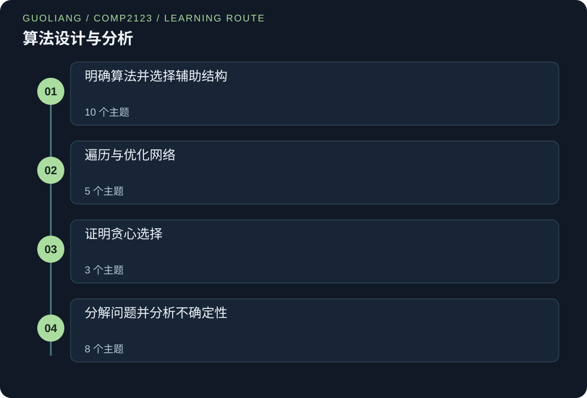

# COMP2123 — 算法设计与分析

> Leon | Original study notes

[English](COMP2123.md) · [中文](COMP2123.zh.md)



学习如何把问题变成正确且高效的算法。从小故事和具体输入开始，用 Python 追踪搜索、排序、图遍历、贪心选择、分治与随机化。列表、树、堆与哈希表为算法提供实现支持。完整例题解释方法为何成功，以及假设改变后为何可能失效。

二十六个相互关联的主题覆盖正确性与成本、辅助数据表示、图算法、贪心证明、分治、选择、随机化，以及密码学复杂度入门。这份原创学习指南用小程序解释机制，不是官方课程，也不收录提供给学生的考核材料。生产级库实现与高级密码学安全证明不在范围内。

## 把知识连接起来

### 明确算法并选择辅助结构
- [分析增长并证明正确性](#analysis-correctness)
- [数组、链表与抽象数据类型契约](#lists-representations)
- [栈、队列与环形存储](#stacks-queues)
- [树结构与遍历顺序](#trees-traversal)
- [二叉搜索树与输出敏感查询](#bst-range-queries)
- [AVL 平衡与局部旋转](#avl-balance)
- [优先队列与二叉堆](#priority-queues-heaps)
- [选择排序、插入排序与堆排序](#sorting-baselines)
- [哈希、链地址与探测](#hashing-collisions)
- [布谷鸟哈希与集合语义](#cuckoo-maps-sets)

### 遍历与优化网络
- [图与表示选择](#graph-models)
- [深度优先搜索与桥](#dfs-bridges)
- [广度优先搜索与无权距离](#bfs-distance)
- [Dijkstra 与定点距离的含义](#dijkstra-relaxation)
- [最小生成树、割与并查集](#minimum-spanning-trees)

### 证明贪心选择
- [贪心选择与交换证明](#greedy-fractional)
- [用最少资源安排全部区间](#interval-partitioning)
- [Huffman 编码与加权路径长度](#huffman-coding)

### 分解问题并分析不确定性
- [分治、二分搜索与归并排序](#recurrences-merge-sort)
- [快速排序与比较下界](#quicksort-lower-bound)
- [Pareto 极大点与几何剪枝](#pareto-maxima)
- [减少递归乘积与主定理](#karatsuba-master)
- [无需全排序的选择](#selection-pivots)
- [均匀洗牌与随机选择](#random-permutations)
- [跳表：有序链上的随机塔](#skip-lists)
- [算法复杂度与密码学的简短连接](#cryptography-complexity)

### 运行 Python 示例

使用 Python 3.12 或更新版本。把代码保存为 .py 文件，在终端中用 `python 文件名.py` 运行；部分系统使用 `python3`。若出现 `import numpy as np`，先运行 `python -m pip install numpy`。这行 import 加载 NumPy 数值工具包，并把它简称为 np。示例无需下载数据集或模型权重。

[Python 官方下载](https://www.python.org/downloads/) · [NumPy 官方安装说明](https://numpy.org/install/)

<a id="analysis-correctness"></a>

## 分析增长并证明正确性

### 01 / 从一个故事开始

米娜为学校旅行打包午餐盒。每来一个新请求，她就重新把整张清单相加。朋友则保留运行总数。米娜担心更快的方法会漏掉请求。

她们写下一条规则：读完前几个请求后，运行总数必须等于这些请求之和。她们检查规则在第一个请求之前成立，且每次加法后仍成立。两种方法得到相同总数，运行和却少了许多重复工作。米娜现在有两个独立的信任理由：正确性规则与速度的操作计数。

### 02 / 理解原理

算法是一系列步骤，规格说明规定这些步骤必须产生什么答案。先问答案是否总正确，再问需要多少工作。快速的错误答案仍是错误。

选择输入规模 n，并计数明确的操作，例如一次加法。大 O 给出增长上界，大 Omega 给出下界，大 Theta 同时给出两者。它们描述增长，不是秒表时间。普通成本估计假设数值能放进一个机器字；很大的 Python 整数处理成本可能更高。

不变量是在每步之后仍成立的陈述。证明它起初成立、下一步保持，并在循环结束时给出答案。还要说明循环为什么结束。最坏成本取同规模最难输入。期望成本对说明的随机选择求平均。摊还成本把昂贵步骤分摊到完整操作序列，不要求随机性。

### 03 / 逐项读懂公式

```text
f(n) ∈ O(g(n)) ⇔ ∃c>0, n₀: 对所有 n≥n₀，0≤f(n)≤cg(n)
1+2+⋯+n = n(n+1)/2
```

n 为输入项数，f(n) 为所计操作次数，g(n) 是比较用的较简单增长函数。∈ 表示属于，⇔ 表示当且仅当，∃ 表示存在。

c 是固定正乘数，n₀ 是固定起始规模。对所有 n≥n₀，成本必须不超过 c 倍 g(n)，常数不能随 n 改变。

1+2+…+n 表示依次执行一步、两步等的循环，等于 n(n+1)/2，增长为 Θ(n²)。写 O(n³) 也对，但上界较不精确。

### 04 / 先看一个完整例子

对 [4,−1,6,2] 求前缀和，令 s 从零开始，每读一项就记录更新后的 s，得到 [4,3,9,11]。不变量是：完成 i 次迭代后，s 等于前 i 个输入的和，前 i 个输出都正确。

i=0 时成立，加入下一项后仍成立，四次迭代得到完整答案。若每个前缀从头求和，则做 1+2+3+4=10 次加法，运行和仅做四次。

长度 n 时，两种计数分别按二次与线性增长。

### 先认识这些词

- **不变量:** 循环每步之前和之后都成立的陈述。

- **输入规模:** 数据量，常记为 n；必须说明计数对象。

- **摊还成本:** 把操作序列总成本分摊到各操作，不要求随机选择。

### 一步步想清楚

**为什么初始运行和正确？**

还未读取值时，空前缀之和为 0，变量也从 0 开始。

**第三项 6 到来时发生什么？**

旧总数为 3，加 6 得 9，正好是 4+(−1)+6。

**一次快速运行能证明线性界吗？**

不能。计时只测一个情境；每输入一项做一次加法，才解释所有同长度输入的线性界。

### 全部前缀的成本

对 n=8 个值，比较每次重算前缀与维护运行和。两者都从零开始计加法。

**先选择方法**

直接数循环的加法次数，不从计时推断复杂度。

1. 重算前缀使用 1+2+…+8 次加法。

2. 用 8×9/2=36 求等差和。

3. 运行和各读取 8 个值一次，因此使用 8 次加法。

**解释最终答案**

运行和节省 28 次加法，复杂度 Θ(n)；重算为 Θ(n²)。

**检验推理**

前缀不变量保证两者产生相同八项输出。n=0 时，两者都不做加法。

### 运行总数及其不变量

前缀是列表开头到某位置的部分。每来一个新值就打印总数。

```python
values = [4, -1, 6, 2]
total = 0
prefixes = []
for value in values:
    total += value
    prefixes.append(total)
    print(value, total)
print(prefixes)
```

**在本地运行**

```sh
python analysis-correctness-prefix-total-trace.py
```

**预期输出**

```text
4 4
-1 3
6 9
2 11
[4, 3, 9, 11]
```

**按执行顺序理解**

1. 将 total 初始化为空前缀和 0，prefixes 为空列表。

2. 先加下个值再记录 total，保持已处理前缀不变量。

3. 打印每次变化，循环后打印完整前缀表。

**跟踪状态的变化**

| 输入值 | 新总数 | 已记录前缀 |
| --- | --- | --- |
| 4 | 4 | [4] |
| -1 | 3 | [4,3] |
| 6 | 9 | [4,3,9] |
| 2 | 11 | [4,3,9,11] |

**逐步读懂代码**

values 创建 Python 列表，total=0 设置初始和，空方括号建立空输出列表。for 按顺序让 value 取得每项，+= 加入旧总数，append 将新总数放末端。

第二列始终为已见值之和，这就是不变量。四项做四次加法，n 项时间 O(n)，保存所有前缀需 O(n) 额外空间。若只留最终和，在固定大小数值模型下只需 O(1) 额外变量。

### 计算扩容存储的成本

把普通写入与容量翻倍引起的复制分开计数。

```python
capacity = 1
size = 0
copies = 0
for value in [10, 20, 30, 40, 50]:
    if size == capacity:
        copies += size
        capacity *= 2
    size += 1
    print("size:", size, "capacity:", capacity, "copies:", copies)
print("writes plus copies:", size + copies)
```

**在本地运行**

```sh
python analysis-correctness-doubling-array-cost.py
```

**预期输出**

```text
size: 1 capacity: 1 copies: 0
size: 2 capacity: 2 copies: 1
size: 3 capacity: 4 copies: 3
size: 4 capacity: 4 copies: 3
size: 5 capacity: 8 copies: 7
writes plus copies: 12
```

**按执行顺序理解**

1. 从一个可用单元和零个值开始。

2. 每次写入前，仅在当前单元全满时翻倍。

3. 每次扩容对每个旧单元计一次复制，再计一次新写入。

**跟踪状态的变化**

| 追加次数 | 写入后容量 | 累计复制 |
| --- | --- | --- |
| 1 | 1 | 0 |
| 2 | 2 | 1 |
| 3 | 4 | 3 |
| 4 | 4 | 3 |
| 5 | 8 | 7 |

**逐步读懂代码**

这是容量翻倍数组的成本模拟，不是 Python 列表分配器实现。size 统计已用单元。当 size 等于 capacity 时，全部旧引用都需要复制，因此先把 size 加入 copies，再把容量翻倍。

第五次追加引起四次复制，单独看很昂贵。五次追加合计七次复制和五次新写入。对于 n 次追加，等比复制总和小于 2n，因此在本模型下追加的摊还成本为 O(1)。这里没有随机选择。

### Leon 的进一步思考

**证明与计数回答不同问题**

前缀不变量证明每个记录的和都正确，包括含负数的输入。每项一次加法证明算术工作为线性。看似合理的输出或一次快速计时，都不能同时提供这两种论证。

**一次昂贵操作可以属于便宜的序列**

翻倍存储复制的块大小为 1、2、4 等，等比总和与最终容量成比例。这是摊还论证，不同于跳表章节依赖随机塔形的期望搜索界。

**注意这个边界:** 把 O(n) 当作精确运行时间，或把期望界当作最坏情况保证。

<details>
<summary>检查自己的理解</summary>

若算法为 Θ(n)，它也属于 O(n²) 吗？

是。n≥1 时，线性上界也是二次上界；Θ(n) 是更有信息的紧确陈述。

</details>

<a id="lists-representations"></a>

## 数组、链表与抽象数据类型契约

### 01 / 从一个故事开始

拉维把阅读卡放在编号盒中，找第 4 盒很容易，但在靠前位置插卡要移动许多后续卡。他尝试让每张卡保存下一张的链接。

现在改变链接就能插卡，但仍要沿链找到插入位置。频繁按编号读取时，拉维使用编号盒；已知编辑位置的引用时，他使用链式卡片。他学会把搜索和编辑分开计数。

### 02 / 理解原理

列表是有序集合。抽象数据类型 ADT 规定允许的操作，不决定存储方式。例如，列表可承诺读取第 i 项，或在第 i 项前插入。契约还应说明无效位置怎样处理。

数组把等宽单元排列在一起，地址公式可直接找到第 i 项。Python 列表使用可扩容的引用数组。索引读取为 O(1)，中间插入移动后续引用，可能为 O(n)。偶尔扩容使单次追加昂贵，但追加的摊还成本为 O(1)。

链表保存独立节点，每节点有值与 next 引用。双向节点还记住前驱。在已知位置改变固定数量链接为 O(1)，寻找索引 i 仍需行走。单链删除通常需要前驱；在通常保留节点身份的契约下，只知道待删节点并不够。哨兵是简化边界情况的虚拟端点。

### 03 / 逐项读懂公式

```text
数组地址(i) = base + i·cell_size
数组索引访问：O(1)
链表索引访问：O(n)；已知位置的双向链编辑：O(1)
```

i 从 0 开始，base 是数组首单元地址，cell_size 为固定单元宽度。i×cell_size 给出距起点的偏移。

n 为存储项数。O(1) 表示基本步骤数不随 n 增长，O(n) 允许与 n 成比例的步骤。常数时间链式编辑假设已知道所需节点引用，需另计寻找成本。Python 列表单元保存引用，对象本身不必相邻。

### 04 / 先看一个完整例子

数组 [L,M,N,P] 在索引 1 插入 X，要将 M、N、P 右移，再写 X，得到 [L,X,M,N,P]。双向链表若已直接引用 M，可令 left=M.prev 并创建 X。

设置 X.prev=left、X.next=M、left.next=X、M.prev=X，只改固定数量链接。但若请求只是“在索引 1 插入”，还需先找到位置；一般索引接近末端时，遍历可能主导成本。

契约也必须拒绝无效位置或定义其行为。

### 先认识这些词

- **ADT:** 抽象数据类型：将操作和结果的承诺与实现分离。

- **节点:** 包含值及指向其他节点引用的小记录。

- **引用:** 到达现有对象的方式；赋值引用不复制整个对象。

### 一步步想清楚

**为何在数组索引 1 插入需要移动三项？**

[L,M,N,P] 中 M、N、P 各右移一个位置，为 X 留空间。

**修改 m.next 前为何保存 old_next？**

保留到后续链的访问路径，否则替换链接可能断开后续节点。

**链表插入总是 O(1) 吗？**

只有已知位置上的链接修改是 O(1)，走到该位置可能为 O(n)。

### 先搜索再编辑

一个 100 节点单链表从 0 编号。只知道头节点，要在索引 80 前插入；与 100 项数组比较。

**先选择方法**

将寻找前驱与修改链接分开，再数数组后缀。

1. 链式前驱为索引 79，从索引 0 需移动 79 次 next。

2. 创建一个节点，以常数工作连接前驱和旧后继。

3. 数组移动索引 80 到 99，共 100−80=20 个引用。

**解释最终答案**

两种请求都可能线性；只有已知前驱时，链式编辑本身才是常数。

**检验推理**

若直接提供前驱引用，79 次链接搜索便消失。

### 观察数组插入怎样移动值

手工建立插入过程，不藏在 list.insert 中。

```python
items = ["L", "M", "N", "P"]
position = 1
items.append(None)
shifts = 0
for i in range(len(items) - 1, position, -1):
    items[i] = items[i - 1]
    shifts += 1
items[position] = "X"
print(items)
print("shifts:", shifts)
```

**在本地运行**

```sh
python lists-representations-array-insert-shifts.py
```

**预期输出**

```text
['L', 'X', 'M', 'N', 'P']
shifts: 3
```

**按执行顺序理解**

1. 追加备用单元，让末项有位置可去。

2. 从右往左复制，保留尚未复制的值。

3. 在位置 1 写 X，报告三次移动。

**跟踪状态的变化**

| 操作 | 数组 |
| --- | --- |
| 增加空位 | [L,M,N,P,None] |
| 复制 P | [L,M,N,P,P] |
| 复制 N 再 M | [L,M,M,N,P] |
| 写 X | [L,X,M,N,P] |

**逐步读懂代码**

append(None) 新建备用单元。None 是占位对象，不是文字 "None"。range(start,stop,-1) 逆序访问且不含 stop，倒着移动避免尚未复制的值被覆盖。

循环先移 P，再 N，再 M，最后将 X 写索引 1。输出三次引用移动。最坏需移 n 项，插入 O(n)。例子扩展 Python 列表，不展示物理地址。

### 向真实链式节点中插入

程序已知节点 M，观察在 M 后插 X 而不移动 N。

```python
class Node:
    def __init__(self, value, next_node=None):
        self.value = value
        self.next = next_node

n = Node("N")
m = Node("M", n)
head = Node("L", m)
old_next = m.next
m.next = Node("X", old_next)
values = []
current = head
while current is not None:
    values.append(current.value)
    current = current.next
print(values)
print("X still links to N:", m.next.next is n)
```

**在本地运行**

```sh
python lists-representations-linked-node-splice.py
```

**预期输出**

```text
['L', 'M', 'X', 'N']
X still links to N: True
```

**按执行顺序理解**

1. 反向构建链，让每个 next 引用已存在。

2. 保存 M 后继，创建指向后继的 X，再让 M 指 X。

3. 沿 next 遍历，确认旧 N 对象仍连通。

**跟踪状态的变化**

| 阶段 | M.next | 链 |
| --- | --- | --- |
| 之前 | N | L→M→N |
| 保存 old_next | N | old_next→N |
| 插接后 | X | L→M→X→N |

**逐步读懂代码**

class 定义节点形状，Node(...) 创建时运行 __init__，self 指新节点。next 存引用，None 标末端。先建 N，才能让 M 指 N、L 指 M。

old_next 记住 N，新 X 指 N，M 改指 X。is 检查两引用是否到同一对象。编辑是常数工作。打印遍历用 O(n) 时间和 O(n) 结果表，展示成本与插入分开。

### Leon 的进一步思考

**根据操作选择表示**

列表契约本身不承诺某种成本。算法反复读取索引 i 时，数组提供直接访问；若已持有相邻节点引用，链式插接可避免移动后缀。只计编辑可能隐藏寻找位置的成本。

**替换链接前保留访问路径**

保存 old_next 让 M 获得新 next 链接时仍能找到后缀。这类似所有权不变量：最终链中每个原节点仍恰好可达一次。若连出环，简单展示循环就不会终止。

**注意这个边界:** 声称所有链表操作都是 O(1)。只有某些已定位位置上的操作具备此界。

<details>
<summary>检查自己的理解</summary>

数百万次随机索引读取、中间插入很少，适合哪种表示？

数组列表，因为直接索引为常数，偶尔的移动成本可能可以接受。

</details>

<a id="stacks-queues"></a>

## 栈、队列与环形存储

### 01 / 从一个故事开始

努尔负责学校打印台。她先把新任务放成一摞，总拿最上面，新任务不断推迟旧任务。她改成一端到达、另一端服务的等待队列，大家便按到达顺序得到服务。

后来她为编辑程序加撤销按钮，此时必须先撤销最近操作，堆叠规则反而正确。她学到结构选择取决于下一项应当是谁，而非只看存多少项。

### 02 / 理解原理

栈先移除最新项，称后进先出 LIFO。push 添加，pop 移除栈顶，适合撤销历史与嵌套括号。队列先移除最早项，称先进先出 FIFO。enqueue 在后端添加，dequeue 从前端移除。

Python 列表以末端 append、pop 可用作栈。collections.deque 支持两端高效操作，适合队列。list.pop(0) 会移动余项，成本 O(n)。

环形队列复用固定数组，保存 front 与 size。取模使索引绕回起点，size 区分满与空。满时应拒绝入队或定义扩容规则，空时不得出队。括号检查要求每个右括号匹配最近未匹配的左括号。

### 03 / 逐项读懂公式

```text
队列插入索引 = (front + size) mod capacity
出队后：front ← (front+1) mod capacity；size ← size−1
```

front 为最早排队项索引，size 为当前项数，capacity 为正的物理槽数。mod 是除法余数，Python 写作 %。

插入位置为 front+size 再绕回槽范围。移除一项后，front 同样绕回地加一，size 减一；← 表示替换旧值。规则改变存储位置但保留 FIFO 顺序，固定容量更新为 O(1)。

### 04 / 先看一个完整例子

容量五的队列 front=3、size=3，A、B、C 位于 3、4、0。D 入队位置 (3+3) mod 5=1，size 增为四。

出队返回 A，front 变为 4，size 变为三。逻辑顺序 B、C、D，物理槽跨越边界，不需移动元素。

另看栈：忽略空格的 ([ ]) 先压 (、[，遇 ] 弹 [，遇 ) 弹 (，最终空栈证明嵌套正确。

### 先认识这些词

- **LIFO:** 后进先出：最新存入的项先离开。

- **FIFO:** 先进先出：最早存入的项先离开。

- **取模:** 除法后的余数，可让索引绕回固定范围。

### 一步步想清楚

**为什么栈拒绝 ([)]？**

当 ) 到来时，[ 仍在栈顶。只计数量发现不了嵌套次序错误。

**deque.popleft 移除什么？**

移除最左项。若新项在右端追加，这就是最早项。

**环形队列为何保存 size？**

空和满可能拥有相同前后位置，size 让状态明确。

### 不移动元素地绕回

环形队列容量 5，front=3，A、B、C 位于槽 3、4、0。先加入 D，再出队一次。

**先选择方法**

将逻辑大小与物理索引分开追踪。

1. 初始 size=3；插入位置 (3+3)%5=1。

2. D 存到 1，size=4，逻辑顺序为 A、B、C、D。

3. 移除 A；front=(3+1)%5=4，size 变为 3。

**解释最终答案**

剩余顺序是 B、C、D，对应槽 4、0、1；原元素无需移动。

**检验推理**

从 front=4 走 size=3 个模 5 位置，恰好得到 4、0、1。

### 用栈匹配括号

函数同时检查括号类型和顺序。

```python
def balanced(text):
    stack = []
    opening = {')': '(', ']': '[', '}': '{'}
    for char in text:
        if char in "([{":
            stack.append(char)
        elif char in opening:
            if not stack or stack.pop() != opening[char]:
                return False
    return not stack

print(balanced("([])"))
print(balanced("([)]"))
print(balanced("(("))
```

**在本地运行**

```sh
python stacks-queues-stack-bracket-check.py
```

**预期输出**

```text
True
False
False
```

**按执行顺序理解**

1. 建立右到左的映射，初始无未匹配括号。

2. 左括号入栈；右括号必须安全弹出匹配栈顶。

3. 提前拒绝不匹配，扫描后拒绝剩余左括号。

**跟踪状态的变化**

| ([]) 中字符 | 之后的栈 |
| --- | --- |
| ( | [(] |
| [ | [(,[] |
| ] | [(] |
| ) | [] |

**逐步读懂代码**

def 建可复用函数。opening 将每右括号映射到所需左括号。append 记录左括号，空栈时 not stack 为真，or 立即停止判断，因此不会不安全地 pop。

右括号只移除栈顶左括号，不匹配立即 False。结束时 not stack 拒绝剩余左括号，其他字符忽略。每字符检查一次，时间 O(n)，最多保存 n 个左括号，额外空间 O(n)。

### 用 deque 服务等待任务

deque 是双端队列，右端到达，左端服务。

```python
from collections import deque
queue = deque(["Ada", "Bo"])
queue.append("Cy")
print("served:", queue.popleft())
print("waiting:", list(queue))
queue.appendleft("urgent")
print("left end:", queue.popleft())
print("waiting:", list(queue))
```

**在本地运行**

```sh
python stacks-queues-deque-fifo-service.py
```

**预期输出**

```text
served: Ada
waiting: ['Bo', 'Cy']
left end: urgent
waiting: ['Bo', 'Cy']
```

**按执行顺序理解**

1. 把 Cy 追加在 Ada、Bo 后，保持到达顺序。

2. 从左移除 Ada，显示两个剩余任务。

3. 在左插 urgent，展示明确的策略改变。

**跟踪状态的变化**

| 操作 | 等待顺序 |
| --- | --- |
| 追加 Cy | [Ada,Bo,Cy] |
| 服务 Ada | [Bo,Cy] |
| 左插 urgent | [urgent,Bo,Cy] |
| 服务 urgent | [Bo,Cy] |

**逐步读懂代码**

导入语句提供 deque。append 在右加入 Cy，popleft 移除最早的 Ada。list(queue) 仅为清晰打印而复制状态。

appendleft 展示另一操作，把 urgent 放在前面，改变服务策略，所以这一部分不再纯 FIFO。deque 两端增删 O(1)，复制全部项用于展示 O(n)。空 popleft 会抛 IndexError。

### Leon 的进一步思考

**移除顺序是算法的一部分**

括号匹配需要最近的未匹配左括号，因此栈是证明的关键。BFS 需要最早等待的顶点，因此队列维持距离层。若换容器却不改证明，可能悄悄改变算法。

**环绕的是位置，不是逻辑顺序**

环形存储中索引在绕回时可能减小，但到达顺序不能改变。保存 size 可避免满与空的表示歧义。固定容量 O(1) 成本不包含扩容或为展示复制整个队列。

**注意这个边界:** 用队列验证嵌套，或每次出队移动整个数组而不用环形索引。

<details>
<summary>检查自己的理解</summary>

为什么 ([)] 左右括号数量相等却失败？

第一个右括号 ) 不匹配当前栈顶 [。正确嵌套要求匹配最近未匹配的左括号。

</details>

<a id="trees-traversal"></a>

## 树结构与遍历顺序

### 01 / 从一个故事开始

莉娜为校剧道具建目录。一个箱子装服装和工具，服装箱里有帽子与外套。她需要一张开箱顺序表和一张收箱顺序表。

开箱时，她先写父箱再写内容。收箱时，先处理小箱再关父箱。两表包含所有物品，却服务不同目的。她还把孩子报告的数量相加来数每个箱子。把每个分支看成同类小问题后，目录容易处理了。

### 02 / 理解原理

树连接节点且没有环。有根树选择一个起点，其他每节点有一个父节点。孩子位于父节点下一层，叶子没有孩子。二叉树每节点至多有左、右两个孩子。

前序先访问节点再孩子，后序先孩子再节点。二叉树中序为左分支、节点、右分支。只有满足二叉搜索树规则时，中序才有序。

递归让同一函数处理更小分支，空分支是停止情形。每个孩子结果计算一次再合并，遍历时间 O(n)。活动调用使用 O(h) 额外空间，h 为树高；链可高达 n−1。Python 有递归深度限制，深树可能需要显式栈。Euler 游历记录二叉节点周围的首次、中间、末次访问，对应三种遍历顺序。

### 03 / 逐项读懂公式

```text
size(v) = 1 + Σ(u 为 v 的孩子) size(u)
height(v) = 1 + max(u 为 v 的孩子) height(u)
叶子高度 = 0
```

v 是节点，u 遍历它的孩子，Σ 将孩子结果相加。size(v) 计 v 及全部后代，额外加一计自身。

高度数边而不是节点，叶高为零。非叶取最大孩子高度加一。二叉实现可令空分支高 −1，使公式对叶子也成立。n 为总节点数，h 为根高度，约定要一致。

### 04 / 先看一个完整例子

根 R 有孩子 A、B，A 有 C、D，B 有 E。前序 R,A,C,D,B,E；后序 C,D,A,E,B,R。

后序中 C、D、E 各报告大小一，A 得三，B 得二，R 得六。叶高零，A、B 高一，R 高二。

递归各算一次。若每个祖先都重新计算各子树大小，即使用相同递推概念，在链上也会浪费二次工作。

### 先认识这些词

- **根:** 树中选定的起始节点。

- **子树:** 某节点及其全部后代。

- **递归:** 函数对更小问题调用自身，直到停止情形。

### 一步步想清楚

**后序为何适合计算大小？**

父节点先需要孩子大小，后序先算完孩子再合并。

**单节点树高度是多少？**

按边计为 0，没有向下的边。

**中序总是有序吗？**

不是。它只是结构顺序，还需 BST 键不变量才有序。

### 合并子树信息

根 R 的孩子为 A、B。A 有叶子 C、D，B 有叶子 E。求节点数与按边计的高度。

**先选择方法**

从叶子向上计算，让所有孩子结果先准备好。

1. 每个叶子大小 1、高度 0。

2. A 大小 1+1+1=3、高度 1；B 大小 1+1=2、高度 1。

3. R 大小 1+3+2=6，高度 1+max(1,1)=2。

**解释最终答案**

共六个节点，最长向下路径有两条边。

**检验推理**

独立列出 R、A、B、C、D、E 可数得六个；R→A→C 有两条边。

### 比较三种遍历顺序

节点用标签、左分支、右分支组成元组，None 表示空分支。

```python
tree = ("R", ("A", ("C", None, None), None), ("B", None, None))
def walk(node, order):
    if node is None:
        return []
    value, left, right = node
    first = walk(left, order)
    last = walk(right, order)
    if order == "pre":
        return [value] + first + last
    if order == "in":
        return first + [value] + last
    return first + last + [value]

for order in ["pre", "in", "post"]:
    print(order, walk(tree, order))
```

**在本地运行**

```sh
python trees-traversal-tree-three-orders.py
```

**预期输出**

```text
pre ['R', 'A', 'C', 'B']
in ['C', 'A', 'R', 'B']
post ['C', 'A', 'B', 'R']
```

**按执行顺序理解**

1. None 返回空序列，作为停止情形。

2. 递归取得左右顺序，再将当前标签放前、中或后。

3. 让同一棵树经过三种放置规则。

**跟踪状态的变化**

| 规则 | A 子树结果 | 根结果 |
| --- | --- | --- |
| pre | [A,C] | [R,A,C,B] |
| in | [C,A] | [C,A,R,B] |
| post | [C,A] | [C,A,B,R] |

**逐步读懂代码**

元组组合三个值，value,left,right 赋值将其解包。None 情形返回空表并停止递归，两次调用处理更小分支，+ 按所需顺序拼接。

每输出都恰含每节点一次，但反复拼接复制结果。这个清楚版本在链上可能 O(n²) 时间，除 O(h) 调用栈外还有 O(n) 峰值临时列表存储。实际遍历可向一个结果表追加，得到 O(n) 时间、O(n) 输出和 O(h) 调用栈。

### 同时计算大小与高度

每分支一次返回两项事实，避免再扫描。

```python
tree = ("R", ("A", ("C", None, None), None), ("B", None, None))
def facts(node):
    if node is None:
        return 0, -1
    _, left, right = node
    left_size, left_height = facts(left)
    right_size, right_height = facts(right)
    return 1 + left_size + right_size, 1 + max(left_height, right_height)

size, height = facts(tree)
print("size:", size)
print("height:", height)
print("empty:", facts(None))
```

**在本地运行**

```sh
python trees-traversal-tree-size-height.py
```

**预期输出**

```text
size: 4
height: 2
empty: (0, -1)
```

**按执行顺序理解**

1. 空分支用 (0,-1)，让叶子也能套公式。

2. 向每个孩子同时请求大小和高度。

3. 父亲大小加一，高度取较长孩子加一。

**跟踪状态的变化**

| 节点 | 大小 | 高度 |
| --- | --- | --- |
| C | 1 | 0 |
| A | 2 | 1 |
| B | 1 | 0 |
| R | 4 | 2 |

**逐步读懂代码**

空分支返回大小 0、高度 −1。下划线说明标签未使用。递归返回一对，随后赋值解包；父亲相加大小、取较大高度。

根计四节点，最长 R–A–C 两边，高度 2。每节点只做一次常数合并，时间 O(n)。仅活动祖先调用占存储，额外 O(h)。小树远低于 Python 递归限制。

### Leon 的进一步思考

**每个子结果只计算一次**

大小与高度程序一次返回两项事实。若每个祖先都重新计算所有后代大小，链形树会产生二次重复访问。这与动态规划相通：保存已解子问题，而不是重复求解。

**构造输出也需要时间**

三种顺序示例为清楚起见使用列表拼接。拼接会复制元素，因此每节点访问一次并不自动证明总时间线性。向一个共享结果列表追加可以消除重复复制，而遍历规则不变。

**注意这个边界:** 认为所有二叉树都平衡。“二叉”只限制孩子数，不保证高度为对数。

<details>
<summary>检查自己的理解</summary>

删除整树时若必须先删孩子后删父亲，哪种遍历自然？

后序，因为拥有子树的节点最后处理。

</details>

<a id="bst-range-queries"></a>

## 二叉搜索树与输出敏感查询

### 01 / 从一个故事开始

奥马尔把编号图书标签存进树，每处小编号往左，大编号往右。找 22 不必逐项检查：先比较 18，再到 27，最后在其左边找到 22。

老师后来要 10 到 28 的全部标签，奥马尔跳过全太小或全太大的分支。移除根标签时，他用下一个更大标签替换。树继续可搜索，因为他维护的是整个分支的顺序，不只相邻节点。

### 02 / 理解原理

BST 每节点有键，其左子树所有键更小，右子树所有键更大。规则适用于全部后代。本例重复插入已有键只保留一份，映射也可选择替换其值。

搜索比较当前键并选一个分支。插入沿路到空位。删除叶子可直接移除，单孩子用孩子接替，两孩子则用右子树最小键即后继替换，再删除后继原节点。

搜索与更新为 O(h)，h 为高度。平衡树高为对数，差形状可成链。区间查询访问有用分支并输出边界内键，O(h+k) 包括写出 k 个答案。这叫输出敏感：大量答案本来就需要更多工作。

### 03 / 逐项读懂公式

```text
∀u∈left(v)，key(u)<key(v)；∀w∈right(v)，key(v)<key(w)
搜索/更新：O(h)；区间报告：O(h+k)
```

v 是当前比较节点，u、w 是其左、右子树任意节点，key 读取键，∀ 表示对每一个，因此规则涉及整个子树。

h 为高度，n 为节点数，k 为报告键数。查询包含 [a,b] 两端，即使完美搜索也至少要 Ω(k) 步写出 k 个答案。O(log n) 需要平衡规则，普通 BST 不保证。

### 04 / 先看一个完整例子

向空 BST 插入 18、9、27、4、13、22、31。查 22 访问 18、27、22。[10,28] 按序报告 13、18、22、27，剪去 4 所在子树，并从输出排除 31。

删除 18 时，选右子树最小键 22 作中序后继，将 22 移到根，并删掉原先没有左孩子的节点。结果保持排序不变量。

若随便选后代如 31 替根，会让右子树中较小键的位置违法。

### 先认识这些词

- **键:** 用于排序和查找记录的值。

- **后继:** 下一个较大键；有右分支时，位于该分支最左路径末端。

- **输出敏感:** 复杂度包含所产答案数量。

### 一步步想清楚

**查 22 看到 18 后为何能跳过左边？**

左子树全部小于 18，不可能是 22。

**[10,28] 返回什么？**

13、18、22、27；若端点存在也会包含。

**递增插入且不平衡会怎样？**

形成右链，搜索可能检查全部节点，最坏成本 O(n)。

### 包含必要输出工作的区间查询

使用依次插入 18、9、27、4、13、22、31 的 BST，报告 [10,28] 中的键。

**先选择方法**

用子树顺序剪枝，用中序保持输出有序。

1. 在 9 处，左子树全部小于 10，跳过 4，访问 13。

2. 根 18 在区间内，右子树的 22、27 也在区间内。

3. 31 高于 28，所以仅报告 13、18、22、27。此处 k=4、h=2。

**解释最终答案**

返回四个有序键。O(h+k) 包含不可避免的四项输出。

**检验推理**

完整中序为 [4,9,13,18,22,27,31]，过滤后得到相同结果。

### 插入键并记录搜索路线

这里使用真实链接树节点，不调用 Python 排序。

```python
class Node:
    def __init__(self, key):
        self.key = key
        self.left = None
        self.right = None
def insert(node, key):
    if node is None:
        return Node(key)
    if key < node.key:
        node.left = insert(node.left, key)
    elif key > node.key:
        node.right = insert(node.right, key)
    return node
root = None
for key in [18, 9, 27, 4, 13, 22, 31]:
    root = insert(root, key)
current = root
route = []
while current is not None:
    route.append(current.key)
    if current.key == 22:
        break
    current = current.left if 22 < current.key else current.right
print("route:", route)
print("found:", current is not None)
```

**在本地运行**

```sh
python bst-range-queries-bst-build-search.py
```

**预期输出**

```text
route: [18, 27, 22]
found: True
```

**按执行顺序理解**

1. 插入时重接递归返回的根。

2. 每次比较排除错误方向子树。

3. 到 22 或 None 停止，并记录路线供检查。

**跟踪状态的变化**

| 当前键 | 与 22 比较 | 下一步 |
| --- | --- | --- |
| 18 | 22>18 | 右 |
| 27 | 22<27 | 左 |
| 22 | 22=22 | 停止 |

**逐步读懂代码**

Node 初始有两个空孩子。insert 返回更新分支的根，赋给 node.left 或 node.right 才保持新孩子连接。相等键不进任何分支，因此只保存唯一键。

while 记录每次比较，条件表达式在目标较小时选左，否则选右，三次访问到 22。搜索 O(h) 时间、O(1) 工作引用，route 另用 O(h) 展示空间。递归插入用 O(h) 栈，不会平衡。

### 报告区间并剪掉无用分支

用嵌套元组保持示例简短，每元组依次为键、左、右。

```python
tree = (18, (9, (4, None, None), (13, None, None)),
            (27, (22, None, None), (31, None, None)))
def report(node, low, high, result):
    if node is None:
        return
    key, left, right = node
    if low < key:
        report(left, low, high, result)
    if low <= key <= high:
        result.append(key)
    if key < high:
        report(right, low, high, result)
result = []
report(tree, 10, 28, result)
print(result)
```

**在本地运行**

```sh
python bst-range-queries-bst-pruned-range.py
```

**预期输出**

```text
[13, 18, 22, 27]
```

**按执行顺序理解**

1. 检查左子树是否可能与下界相交。

2. 仅当当前键满足包含两端的界时追加。

3. 独立检查右子树，以保持中序输出。

**跟踪状态的变化**

| 访问键 | 决定 | 当前输出 |
| --- | --- | --- |
| 9 | 跳左；访问 13 | [] |
| 13 | 报告 | [13] |
| 18 | 报告 | [13,18] |
| 22,27 | 报告两项 | [13,18,22,27] |

**逐步读懂代码**

各调用共享一个 result。只有更小键仍可能达到 low 才进入左子树；当前键同时满足上下界才追加；更大键仍可能低于 high 才进入右子树。

三动作按中序进行，因此输出有序。测试跳过以 4 为根的分支；仍会访问 31，但不输出它，也不进入其右子树。唯一键、有效 BST 下时间 O(h+k)，输出 O(k)，递归调用 O(h)。假设 low 不大于 high。

### Leon 的进一步思考

**剪枝需要全局排序规则**

若节点键低于查询下界，其左子树所有键也都太小。这个结论依赖全部后代的规则，而非仅左孩子。一个局部看似合理但全局无效的 BST 会使剪枝漏掉答案。

**输出规模是不可避免的成本**

即使树完全平衡，也不能在 O(log n) 时间列出 n 个匹配键。O(h+k) 将边界搜索与写出 k 项答案分开。只问数量时可利用子树大小，但这是不同操作，需要维护额外元数据。

**注意这个边界:** 只检查左孩子较小、右孩子较大。限制适用于全部子树。

<details>
<summary>检查自己的理解</summary>

递增键依次插入普通空 BST 会怎样？

形成向右的链，高度与最坏查找为线性，虽然仍满足 BST 顺序。

</details>

<a id="avl-balance"></a>

## AVL 平衡与局部旋转

### 01 / 从一个故事开始

苔丝向搜索树插入 30、20、10，每次往左，形成长链。搜索树仍正确，却开始像慢列表。

她把 20 提到小分支顶部，10 留左，30 放右，中序仍为 10、20、30，路线更短。再试 30、10、20，需要两次小旋转。她理解了：修复平衡改变链接，但保持键顺序。

### 02 / 理解原理

AVL 是多一条规则的 BST：每节点左右孩子高度差至多一。高度为最长向下路径，节点保存高度，以便从孩子更新。

按 BST 插入或删除后向根回查。旋转重接附近少量节点。外侧偏重用一次旋转，内侧偏重先转孩子再转父亲。先更新较低节点高度，再更新新根。中序键序保持不变。

高度 h 的最少节点数服从类似 Fibonacci 的递推，迫使高度为 O(log n)，因此搜索与更新最坏为对数。删除可能使多个祖先变矮，首次旋转后仍需继续修复。下面仅演示旋转，不是完整 AVL 插删库。

### 03 / 逐项读懂公式

```text
|height(left(v))−height(right(v))| ≤ 1
N(h)=1+N(h−1)+N(h−2)，N(−1)=0，N(0)=1
```

height(left(v))、height(right(v)) 是孩子分支高度，差外竖线表示绝对值。空分支高 −1，叶高 0。

N(h) 是高 h 的 AVL 最少节点数。一孩子高 h−1，另一允许的最小高度 h−2，加一计根。初值 N(−1)=0、N(0)=1。节点数快速增长，使很少节点不能形成很高的 AVL。

### 04 / 先看一个完整例子

向空 AVL 插入 30、20、10。修前 30 左有 20，20 左有 10；30 的孩子高度为 1 与 −1，差二。

在 30 右旋后，20 成根，10 左、30 右，中序仍 10、20、30，所有平衡差变为零。若插入 30、10、20，重路径向内弯。

先在 10 左旋，再在 30 右旋，两次旋转得到相同平衡结果。

### 先认识这些词

- **平衡因子:** 左孩子高度减右孩子高度；AVL 允许 −1、0、1。

- **旋转:** 保持中序的局部孩子链接变化。

- **元数据:** 节点保存的额外事实，例如高度。

### 一步步想清楚

**30–20–10 旋转前为何 30 不平衡？**

左孩子高 1，缺失右孩子高 −1，差为 2。

**为何先更新旧根再新根？**

新根高度依赖修好的旧根，使用旧高度会记录错误结果。

**一次成功旋转能结束所有 AVL 删除吗？**

不能。修好分支可能变矮，使更高祖先不平衡，必须继续向上检查。

### 高 AVL 树最少需要多少节点？

已知 N(−1)=0、N(0)=1、N(h)=1+N(h−1)+N(h−2)，求 N(3)、N(4)。

**先选择方法**

先计算较低高度，使用允许的最不平衡孩子高度。

1. N(1)=1+1+0=2。

2. N(2)=1+2+1=4；N(3)=1+4+2=7。

3. N(4)=1+7+4=12；每处孩子高度差至多一。

**解释最终答案**

高度 4 的 AVL 树至少需要 12 个节点，11 个节点不可能达到此高度。

**检验推理**

完美高度 4 二叉树有 31 个节点，确实超过最小值。

### 向右旋转外侧偏重分支

所有节点保存高度，辅助函数在链接改变后重算高度。

```python
class Node:
    def __init__(self, key):
        self.key, self.left, self.right, self.height = key, None, None, 0
def height(node):
    return -1 if node is None else node.height
def update(node):
    node.height = 1 + max(height(node.left), height(node.right))
def rotate_right(root):
    new_root = root.left
    root.left = new_root.right
    new_root.right = root
    update(root)
    update(new_root)
    return new_root
root = Node(30)
root.left = Node(20)
root.left.left = Node(10)
update(root.left)
update(root)
print("before height:", root.height)
root = rotate_right(root)
print("keys:", root.left.key, root.key, root.right.key)
print("after height:", root.height)
```

**在本地运行**

```sh
python avl-balance-avl-single-rotation.py
```

**预期输出**

```text
before height: 2
keys: 10 20 30
after height: 1
```

**按执行顺序理解**

1. 建立 30→20→10，从叶向上更新高度。

2. 提升左孩子，同时把中间子树转给旧根。

3. 先更新旧根，再更新新根，检查高度与顺序。

**跟踪状态的变化**

| 阶段 | 根 | 高度 | 中序 |
| --- | --- | --- | --- |
| 之前 | 30 | 2 | 10,20,30 |
| 链接修好 | 20 | 待重算 | 10,20,30 |
| 更新后 | 20 | 1 | 10,20,30 |

**逐步读懂代码**

类保存键、两个链接和高度，height(None) 给空分支约定，update 使用已存孩子高度。rotate_right 先保存左孩子，将其旧右分支移到旧根左边，再让旧根成为它右孩子。

先更新旧根使新根高度计算有效。打印键保持同一排序，高度从 2 降为 1。有已存高度时每次旋转 O(1) 时间和空间，寻找修复点仍 O(h)。函数假设左孩子存在。

### 修复内侧偏重分支

先左旋理顺 30–10–20，再右旋。

```python
class Node:
    def __init__(self, key, left=None, right=None):
        self.key, self.left, self.right = key, left, right
def rotate_left(root):
    top = root.right
    root.right = top.left
    top.left = root
    return top
def rotate_right(root):
    top = root.left
    root.left = top.right
    top.right = root
    return top
root = Node(30, Node(10, right=Node(20)))
root.left = rotate_left(root.left)
print("after first:", root.key, root.left.key, root.left.left.key)
root = rotate_right(root)
print("after second:", root.left.key, root.key, root.right.key)
```

**在本地运行**

```sh
python avl-balance-avl-double-rotation.py
```

**预期输出**

```text
after first: 30 20 10
after second: 10 20 30
```

**按执行顺序理解**

1. 先识别左—右弯，再选择修复。

2. 在孩子 10 左旋，把返回的 20 重新接到 30。

3. 在 30 右旋，让 20 成根，检查两孩子。

**跟踪状态的变化**

| 阶段 | 根 | 左部结构 | 右孩子 |
| --- | --- | --- | --- |
| 之前 | 30 | 10→右 20 | None |
| 左旋后 | 30 | 20→左 10 | None |
| 右旋后 | 20 | 10 | 30 |

**逐步读懂代码**

初始树先左后右弯，rotate_left 把 20 提到 10 上，变成左链。root.left 赋值把变化分支接回，rotate_right 再把 20 提到 30 上。

最终按左、根、右打印 10、20、30，链接修改 O(1)。为集中说明形状，此第二例省略高度字段；完整 AVL 必须像首例那样在两次旋转后更新元数据。两函数都不处理所需孩子缺失的情况。

### Leon 的进一步思考

**旋转不只保留三个键**

右旋时，被提升孩子的右子树移到旧根左边。其键位于两根之间，因此转移保留全部 BST 不等式。若丢掉中间子树，即使打印的根键仍有序也会丢失数据。

**元数据决定下一次修复**

高度从下往上更新，因为父节点依赖新的孩子高度。删除后，修好分支可能变短，并触发更高处修复。单次旋转示例不能代替完整的向上维护算法。

**注意这个边界:** 根据过时高度修复，或认为每种情况一次旋转就够。识别孩子、孙子的方向，并一致更新元数据。

<details>
<summary>检查自己的理解</summary>

旋转改变中序返回的排序顺序吗？

不改变。正确旋转调整父子关系，但保留全部键及附属子树的相对中序。

</details>

<a id="priority-queues-heaps"></a>

## 优先队列与二叉堆

### 01 / 从一个故事开始

机器人社共用一台打印机。朱尔给每个任务分配优先级，数值越小越紧急。每次到达都排序整条等待列表很浪费，他只需知道下一个最小值。

他让每个父节点优先级不大于孩子，最小值于是总在顶部。新紧急任务不断上移直到恢复规则。移除顶部后，将最后任务搬上来再向下修复。其他任务并未全排序，但下一个紧急任务总能容易找到。

### 02 / 理解原理

优先队列返回优先级最好的项。小顶堆以最小键为最佳，并维护两条规则：父值不大于孩子，各层从左至右填满。这种完全形状自然适合数组。

插入在末端追加，小于父值时交换上移。删除先保存根，把最后键放根，再与较小孩子向下交换直到规则恢复。高度为对数，因此每次修复 O(log n)，读取最小值 O(1)。

自底向上建堆为 O(n)，因为大多数节点靠近叶子；逐项插入有 O(n log n) 上界。Python heapq 直接操作列表。相同优先级不自动保持到达顺序，需要时加序号。堆数组不是有序数组。

### 03 / 逐项读懂公式

```text
parent(i)=⌊(i−1)/2⌋；left(i)=2i+1；right(i)=2i+2
i>0 时 A[parent(i)] ≤ A[i]
```

A 为堆数组，i 从零编号。⌊ ⌋ 表示向下取整；这些非负索引中 Python // 实现整数除法。非根节点的父索引为 (i−1)//2。

孩子索引为 2i+1、2i+2，仅当小于当前长度 n 时存在。父不等式适用于 i>0，保证索引 0 是最小值，但不规定兄弟之间次序。

### 04 / 先看一个完整例子

从 [3,8,5,12,10] 插入 4 到索引 5，父索引 2 的值为 5，交换后为 [3,8,4,12,10,5]。4 已位于 3 下，停止。

移除最小 3，把末项 5 移根并减小长度，得到 [5,8,4,12,10]。孩子 8、4 中选择较小 4 交换，得到 [4,8,5,12,10]。根因堆序必为最小，故删除正确。

注意数组中 8 在 5 前，堆不是排序列表。

### 先认识这些词

- **优先队列:** 按优先级而非到达时间移除项的集合。

- **小顶堆不变量:** 每个父键不大于任何孩子键。

- **完全二叉树:** 每层从左到右填充，没有空洞的二叉树。

### 一步步想清楚

**为什么不全排序也能让索引 0 为最小？**

沿每条向下路径值都不减，所以后代不可能小于根。

**索引 5 与哪个父亲比较？**

父索引 (5−1)//2=2。

**为何下沉选择较小孩子？**

替换后的父值必须不大于两个孩子；换较大孩子可能把较小孩子留在父值之下。

### 修复一个新堆键

向小顶堆 [3,8,5,12,10] 追加 4，求最终位置和交换次数。

**先选择方法**

只有新节点的祖先路径可能违反堆序。

1. 新值位于索引 5，父位置 (5−1)//2=2，值为 5。

2. 交换 4、5，数组变为 [3,8,4,12,10,5]。

3. 到索引 2 后，父索引 0 的值为 3，因为 3≤4，停止。

**解释最终答案**

一次交换把 4 放到索引 2，每个父值仍不大于孩子。

**检验推理**

独立检查全部五条父子不等式，无需要求兄弟有序。

### 用 heapq 按优先级服务

heapify 建堆，heappop 移除最小项。

```python
import heapq
jobs = [8, 3, 5, 12, 10]
heapq.heapify(jobs)
print("minimum:", jobs[0])
heapq.heappush(jobs, 4)
served = []
while jobs:
    served.append(heapq.heappop(jobs))
print("served:", served)
```

**在本地运行**

```sh
python priority-queues-heaps-heapq-priority-service.py
```

**预期输出**

```text
minimum: 3
served: [3, 4, 5, 8, 10, 12]
```

**按执行顺序理解**

1. 将五任务建堆，读取根为最小值。

2. 压入优先级 4，由 heapq 恢复父子顺序。

3. 反复移除最小值，扩展有序服务历史。

**跟踪状态的变化**

| 移除次数 | 移除值 | 已服务前缀 |
| --- | --- | --- |
| 1 | 3 | [3] |
| 2 | 4 | [3,4] |
| 3 | 5 | [3,4,5] |
| 6 | 12 | [3,4,5,8,10,12] |

**逐步读懂代码**

import 导入标准库。heapify 原地重排列表成堆，不返回新排序表。jobs[0] 读最小，heappush 加 4 并修复。

while jobs 重复到空，每次 heappop 返回当前最小，因此 served 有序而内部堆未全排。建堆 O(n)，每次 push/pop O(log n)，全取 O(n log n)。输出表额外 O(n)。

### 亲自编写堆插入修复

观察新值 4 从索引 5 移到 2。

```python
heap = [3, 8, 5, 12, 10]
heap.append(4)
i = len(heap) - 1
swaps = 0
while i > 0:
    parent = (i - 1) // 2
    if heap[parent] <= heap[i]:
        break
    heap[parent], heap[i] = heap[i], heap[parent]
    i = parent
    swaps += 1
print(heap)
print("swaps:", swaps)
print("valid:", all(heap[(j - 1) // 2] <= heap[j] for j in range(1, len(heap))))
```

**在本地运行**

```sh
python priority-queues-heaps-heap-bubble-up.py
```

**预期输出**

```text
[3, 8, 4, 12, 10, 5]
swaps: 1
valid: True
```

**按执行顺序理解**

1. 追加 4，令 i 为新索引 5。

2. 与父索引 2 比较并交换违法的一对。

3. 在 3 下停止，再独立检查全部父不等式。

**跟踪状态的变化**

| i | 父索引 | 比较 | 操作 |
| --- | --- | --- | --- |
| 5 | 2 | 5>4 | 交换 |
| 2 | 0 | 3≤4 | 停止 |
| 检查 | 全部非根 | 全部有效 | True |

**逐步读懂代码**

新值从最后索引开始，// 找父。if 在父已不大于孩子时停止，成对赋值交换而不丢任一值，i=parent 从新位置继续向上。

只有 4、5 交换。all 检查全部非根父不等式，此最终检查 O(n)，不是 O(log n) 插入修复的一部分。修复额外 O(1) 变量，假设原数组已满足堆序。

### Leon 的进一步思考

**堆只保存必要的顺序**

优先服务需要下一个最小值，而不是完整有序序列。父子不等式保证根最小，却不要求兄弟有序。若需要反复有序区间查询，平衡搜索树往往更匹配。

**把修复与检查分开**

上浮只接触完全树中一条长度为对数的祖先路径。all(...) 检查故意扫描每项。若每次插入后都运行检查，实际总工作会改变，不能把它藏在 O(log n) 的声明中。

**注意这个边界:** 认为堆任意键搜索为 O(log n)。没有辅助索引时，定位任意键可能 O(n)。

<details>
<summary>检查自己的理解</summary>

小顶堆下沉时为何交换较小孩子？

若用较大孩子，新父值可能大于另一个孩子，立即违反堆序。

</details>

<a id="sorting-baselines"></a>

## 选择排序、插入排序与堆排序

### 01 / 从一个故事开始

阿米拉为学校展板排序编号卡。起初每次在未排序堆里找最小卡，虽然正确，却重复许多比较。她改成维护有序行，把新卡滑入位置。

卡片近乎有序时第二种方法很快，每张新卡都应放开头时很慢。面对大型混合牌堆，她用堆反复取下一个极值。三种方法顺序相同，差别在维护顺序所需的工作。

### 02 / 理解原理

排序按指定顺序排列值。选择排序找剩余最小值并交换到下一位置。即使输入有序，比较次数仍为二次，但交换次数仅线性。

插入排序维护有序前缀。保存下一值，将前缀中更大的值右移，再放进空隙。有序输入每次工作很少，时间 Θ(n)；逆序可能 Θ(n²) 次移动。只移严格更大的值，可保持相同键记录原先次序，这叫稳定性。

堆排序用堆序移除极值。原地升序版本用大顶堆，把最大值送到不断左缩的右边界。迭代修复时最坏 O(n log n)、额外数组空间 O(1)，通常不稳定。下方简单 heapq 版本另建结果列表，不具备这个原地空间界。

### 03 / 逐项读懂公式

```text
选择排序比较次数 = (n−1)+(n−2)+⋯+1 = n(n−1)/2
插入排序移动次数 = 逆序对数
堆排序最坏时间 = O(n log n)
```

n 为值数量。选择排序首轮与另外 n−1 项比较，随后 n−2 直到 1，总和 n(n−1)/2。

逆序对是 i<j 且 A[i]>A[j]，相对顺序错误。严格 > 比较时，每次插入移动修复一个逆序，相等值不算逆序。堆排序界假设比较与交换为常数；报告实现空间时需计结果列表。

### 04 / 先看一个完整例子

对 [5,2,4,1] 插入排序，初始有序前缀 [5]。插入 2 移 5 一次，得 [2,5,4,1]。

插入 4 再移 5 一次，得 [2,4,5,1]。插入 1 移 5、4、2，最终 [1,2,4,5]。共五次移动，匹配原逆序 (5,2)、(5,4)、(5,1)、(2,1)、(4,1)。

选择排序则在长度四、三、二的后缀中做六次比较，不论原输入是否有序。堆排序在删除之间只维持堆不变量，从而避免大规模任意输入的二次比较增长。

### 先认识这些词

- **有序前缀:** 数组开头已经排好序的部分。

- **逆序对:** 较早的值大于较晚的值。

- **稳定排序:** 保持相同键记录原先相对次序的排序。

### 一步步想清楚

**为什么先右移再写新值？**

移动保留较大值并留下空位，先写可能覆盖尚需保留的值。

**[5,2,4,1] 为何移动五次？**

各轮移动 1、1、3 项，总计五次，正好是五个原逆序。

**heapq 结果列表是原地堆排序吗？**

不是，它另存答案。时间仍可 O(n log n)，额外空间是 O(n)。

### 解释五次插入移动

对 [5,2,4,1] 用严格 > 的插入排序，统计移动次数与原逆序对。

**先选择方法**

每次右移越过一个较大的前值，因此用两种方式计数。

1. 插入 2，移动 5 一次；插入 4，再移动 5 一次。

2. 插入 1，移动 5、4、2，增加三次，总数 1+1+3=5。

3. 原逆序为 (5,2)、(5,4)、(5,1)、(2,1)、(4,1)，共五对。

**解释最终答案**

最终数组 [1,2,4,5]，移动数与逆序数同为 5。

**检验推理**

已排序输入逆序和移动均为零，但外循环仍检查每个后续元素。

### 观察插入排序扩展前缀

每次插入后打印数组，并计移动数量。

```python
values = [5, 2, 4, 1]
shifts = 0
for i in range(1, len(values)):
    item = values[i]
    j = i - 1
    while j >= 0 and values[j] > item:
        values[j + 1] = values[j]
        j -= 1
        shifts += 1
    values[j + 1] = item
    print(values)
print("shifts:", shifts)
```

**在本地运行**

```sh
python sorting-baselines-insertion-sort-trace.py
```

**预期输出**

```text
[2, 5, 4, 1]
[2, 4, 5, 1]
[1, 2, 4, 5]
shifts: 5
```

**按执行顺序理解**

1. 移动前保存下个未排项。

2. 把前缀更大值右移，直到找到插入空位。

3. 写入保存项，打印扩大的有序前缀。

**跟踪状态的变化**

| 插入值 | 插入后数组 | 累计移动 |
| --- | --- | --- |
| 2 | [2,5,4,1] | 1 |
| 4 | [2,4,5,1] | 2 |
| 1 | [1,2,4,5] | 5 |

**逐步读懂代码**

range 从 1 开始，因为单项前缀已有序。item 保存下一值以免被移动覆盖。j 向左走，and 先查边界再读数组，每个较大值右移一格。

循环后 j+1 为正确空位，到 i 的前缀已有序，后面还在等待。输出展示此不变量增长。最坏 O(n²)，有序输入 O(n)，额外少量变量 O(1)。

### 反复移除堆最小值完成排序

这是使用独立结果表的清晰堆排序版本。

```python
import heapq
values = [5, 2, 4, 1]
heap = values.copy()
heapq.heapify(heap)
result = []
while heap:
    result.append(heapq.heappop(heap))
print("input:", values)
print("sorted:", result)
```

**在本地运行**

```sh
python sorting-baselines-heap-sort-output.py
```

**预期输出**

```text
input: [5, 2, 4, 1]
sorted: [1, 2, 4, 5]
```

**按执行顺序理解**

1. 复制输入，保留原表供比较。

2. 在副本上建小顶堆。

3. 把每次移除的最小值追加到 result，直到堆空。

**跟踪状态的变化**

| 已出堆次数 | 结果 | 剩余项数 |
| --- | --- | --- |
| 0 | [] | 4 |
| 1 | [1] | 3 |
| 2 | [1,2] | 2 |
| 4 | [1,2,4,5] | 0 |

**逐步读懂代码**

copy 保留原表，heapify 用 O(n) 时间将副本建为小顶堆。heappop 返回剩余最小，因此 append 扩展已排序结果。

共有 n 次移除，每次至多 O(log n)，总 O(n log n)。堆副本与结果共额外 O(n)。展示堆排序机制，不是常数空间大顶堆版。程序排序数字，相等键记录需另定稳定策略。

### Leon 的进一步思考

**选择排序时也考虑无序程度**

严格比较下，插入排序移动次数等于逆序对数。即使 n 较大，近乎有序列表也可能只有少量逆序。选择排序仍扫描每个剩余后缀，无法利用同样的结构。

**记录带标签时稳定性很重要**

分数相同而到达时间不同的记录，稳定排序保留到达顺序。插入排序只能移动严格更大的键。把 > 改为 >= 仍保持数值有序，却可能倒转相同键记录，违反更强的契约。

**注意这个边界:** 认为所有原地排序都稳定，或把插入排序二次最坏界当作近乎有序数据的成本。

<details>
<summary>检查自己的理解</summary>

插入排序最坏很慢，为什么仍适合小数组或近乎有序数组？

控制开销小，工作随逆序对数变化。逆序少就移动少，不一定出现二次最坏情况。

</details>

<a id="hashing-collisions"></a>

## 哈希、链地址与探测

### 01 / 从一个故事开始

利奥把存储桶编号为 0 到 6，用键除以 7 的余数选桶。10、17、24 都选 3，他先把它们放成小链。

他也尝试碰撞后沿表找空槽。删除中间键后，搜索却在新缺口停止，漏掉后面的键。他把缺口换成删除标记，搜索又能继续。快速地址规则仍需要仔细的碰撞与删除策略。

### 02 / 理解原理

映射把键连到值，哈希函数把键变为桶号。不同键可能选同桶，即碰撞。必须比较真实键，不只哈希；相等键必须有一致哈希。

链地址法每桶保存小集合，分布合适时预期查找 O(1+α)，α 是项数除桶数。差哈希仍可能全进同桶，导致 O(n) 查找。

线性探测把项直接放表槽，碰撞后检查连续槽。从未用过的空槽结束搜索，墓碑标记已删槽却不结束。插入还要处理满表。表大小改变会改桶号，扩容需重新插入。期望碰撞成本与摊还扩容成本是两种不同平均。

### 03 / 逐项读懂公式

```text
α = n/m
第 j 次线性探测：(h(k)+j) mod m，j=0,1,…
均匀哈希假设下链地址查找期望 = O(1+α)
```

n 为项数，m 为桶数或槽数，α=n/m 为每桶平均项数。链地址可超过 1；探测表需要空槽，运行负载应低于 1。

k 是键，h(k) 是起始桶，j 为已尝试槽数。mod 将 h(k)+j 绕回 0 到 m−1。期望链地址界假设哈希适当分散键，仅靠负载因子不能证明。

### 04 / 先看一个完整例子

七槽探测表 h(k)=k mod 7。插入 10、17、24，都散列到 3，分别占 3、4、5。

查 24 检查 3、4、5。删除 17 后，若槽 4 变成从未使用的空槽，后续查 24 会在此停下并误报不存在。

墓碑让搜索继续。链地址法则把三键放桶 3 并在桶内检查。正确删除策略与快速哈希计算同样重要。

### 先认识这些词

- **哈希函数:** 把键映射到表位置的规则。

- **碰撞:** 不同键选择相同起始位置。

- **墓碑:** 告诉探测搜索继续前进的已删除槽标记。

### 一步步想清楚

**10、17、24 模 7 为何碰撞？**

它们余数都为 3。碰撞正常，不表示键相等。

**为何能越过墓碑却在 None 停止？**

此处 None 表示槽从未占用，墓碑表示被推移的键可能仍在后方。

**桶数翻倍能保证常数查找吗？**

不能，键仍可严重碰撞，期望界还需要合适哈希分布。

### 为什么需要墓碑

在 7 槽中用 h(k)=k mod 7 和线性探测插入 10、17、24，删除 17 后查找 24。

**先选择方法**

追踪确切插入路径，并保持搜索终止规则。

1. 三键都从槽 3 开始，依次占据 3、4、5。

2. 把槽 4 设为墓碑。搜索 24 检查 3、越过 4、在 5 成功。

3. 若槽 4 标成从未使用，搜索两次探测后就停止，并错误报告不存在。

**解释最终答案**

墓碑维持查找正确，本次成功搜索需三次槽探测。

**检验推理**

链地址实现把三键放在同桶，删除 17 不会改变其他键的搜索路径。

### 把碰撞键放进同一桶

用整数余数构建小映射，使桶位置输出确定。

```python
buckets = [[] for _ in range(7)]
for key, value in [(10, "ten"), (17, "seventeen"), (24, "twenty-four")]:
    buckets[key % 7].append((key, value))
print("bucket 3:", buckets[3])
def lookup(key):
    for stored_key, value in buckets[key % 7]:
        if stored_key == key:
            return value
    return None
print("24:", lookup(24))
print("31:", lookup(31))
```

**在本地运行**

```sh
python hashing-collisions-hash-chaining-buckets.py
```

**预期输出**

```text
bucket 3: [(10, 'ten'), (17, 'seventeen'), (24, 'twenty-four')]
24: twenty-four
31: None
```

**按执行顺序理解**

1. 建立七个独立桶表，而不是同表的七个引用。

2. 把整数键送到 key%7，并保留配对值。

3. 对存在的 24 和缺失的 31 都扫描桶 3，并检查真实键相等。

**跟踪状态的变化**

| 插入键 | 桶 | 桶 3 中的键 |
| --- | --- | --- |
| 10 | 3 | [10] |
| 17 | 3 | [10,17] |
| 24 | 3 | [10,17,24] |

**逐步读懂代码**

列表推导式创建七个独立空表，下划线表示循环编号未用。key%7 选桶，append 存键值元组。lookup 只扫该桶并比真实键。

31 也进此桶但不存在，函数返回 None。此只插演示假设输入键各不相同；完整映射重复键应替旧值。查找随桶长变化，最坏 O(n)，仅哈希合适时才期望 O(1+α)。

### 删除时保留探测链

用唯一对象标记删除槽，不打印对象，因此输出不依赖地址。

```python
deleted = object()
table = [None] * 7
for key in [10, 17, 24]:
    index = key % 7
    while table[index] is not None:
        index = (index + 1) % 7
    table[index] = key
table[4] = deleted
def contains(key):
    visited = []
    for offset in range(len(table)):
        index = (key % 7 + offset) % 7
        visited.append(index)
        item = table[index]
        if item is None:
            return False, visited
        if item is not deleted and item == key:
            return True, visited
    return False, visited
print(contains(24))
table[4] = None
print(contains(24))
```

**在本地运行**

```sh
python hashing-collisions-linear-probe-tombstone.py
```

**预期输出**

```text
(True, [3, 4, 5])
(False, [3, 4])
```

**按执行顺序理解**

1. 把三碰撞键放入相邻槽。

2. 用标记删 17，验证查 24 能越过它。

3. 把标记换 None，展示错误的停止规则。

**跟踪状态的变化**

| 槽 4 含义 | 访问槽 | 找到 24？ |
| --- | --- | --- |
| 墓碑 | [3,4,5] | True |
| 从未使用 | [3,4] | False |

**逐步读懂代码**

object() 建唯一标记。初始插入把 10、17、24 放槽 3、4、5。槽 4 换 deleted 模拟删 17。contains 至多检查表长，防止无限搜索。

is not 通过身份识别标记。首次搜索越过 4 并找到 24，换 None 后第二次过早结束。探测可 O(m)。初始插入循环仅用于已知非满输入，完整实现还需满表检测和墓碑复用。

### Leon 的进一步思考

**空槽是一种逻辑证据**

探测中，从未使用的空槽证明：按插入规则，该键不可能曾被推到它后面。删除槽不能证明这一点。墓碑保留探测路径的历史，不只是特殊的显示标记。

**两种平均需要不同论证**

期望碰撞成本假设哈希分布合适，摊还扩容成本则在更新序列中统计复制。表的摊还扩容即使便宜，若全部键同桶，查找仍可线性。可对照首章对期望与摊还的区分。

**注意这个边界:** 声称哈希查找无条件 O(1)，或认为碰撞证明两键相等。

<details>
<summary>检查自己的理解</summary>

为何改变容量通常必须重哈希已有键？

压缩到桶索引的规则依赖容量，原位置可能不再位于该键正确搜索路径上。

</details>

<a id="cuckoo-maps-sets"></a>

## 布谷鸟哈希与集合语义

### 01 / 从一个故事开始

艾丽丝用两块小板管理设备标签，每标签在每板有一个允许位置。新标签占用已满位置时，她把旧标签移到另一允许位置，通常几步就腾出空间。

有时移动会返回旧布局，她设移动上限并在发生时重建。她还发现考勤只需成员信息，物资清单却需要数量。两个存储位置并不能决定重复标签该忽略、替换还是计数，这是独立的集合规则。

### 02 / 理解原理

布谷鸟哈希给每键两个候选位置，若哈希和比较为常数，查找至多两次键探测。插入可逐出现有项，把它移到另一位置后继续。

长迁移链可能要求新哈希函数或更大表。因此单次插入不保证 O(1)。期望摊还常数插入要求合适随机哈希族及足够低负载。移动上限防止死循环，但本身不解决放置问题。

集合记成员，映射每键存一个值，多重集合记出现次数。正计数字典可实现多重集合。这些契约与哈希方法分离；Python set、dict、Counter 不承诺使用这种双表设计。

### 03 / 逐项读懂公式

```text
location(k) ∈ {T₁[h₁(k)], T₂[h₂(k)]}
多重集合总大小 = Σk count(k)
```

T₁、T₂ 是两个数组，h₁(k)、h₂(k) 分别选择键在各表的槽。花括号列出两个合法位置，每个已存键必须在其中之一。

count(k) 为 k 出现次数，Σ 对不同键求和，得到可大于不同键数的总出现数。两次探测只计表位置，昂贵哈希或相等测试要另计工作。

### 04 / 先看一个完整例子

假设 A 占第一表槽 0，第二表备用槽 2 空闲。B 也选第一表槽 0，就放 B、逐出 A，再把 A 放第二表槽 2。

两键均满足双位置不变量，查 A 只检查两个位置。若迁移回到旧的占用布局，应改哈希重建，不可无限循环。另看 red、blue、red：集合有两种成员，多重集合计 red:2、blue:1，共三次。

集合契约决定哪种行为正确。

### 先认识这些词

- **逐出:** 替换已存键，并将被替换键移到另一允许位置。

- **集合:** 仅记值是否存在，不记添加次数。

- **多重集合:** 为每种值保存出现计数。

### 一步步想清楚

**键 3 取代第一槽时，键 0 去哪里？**

0 从 first[0] 移到 second[0]，即另一允许位置。

**为何需要移动上限？**

逐出可能循环，完整实现需重建而不是永远移动。

**set 与 Counter 怎样处理 red、blue、red？**

set 保留两色；Counter 保存 red:2、blue:1，总出现三次。

### 追踪被逐出的键

两表各有三个槽，h₁(k)=k mod 3、h₂(k)=floor(k/3) mod 3，每次先尝试表 1，依次插入 0、3、6。

**先选择方法**

把待放键与已在合法位置的键分开追踪。

1. 0 进入 first[0]；插入 3 替换它，再把 0 放到 second[0]。

2. 插入 6 替换 first[0] 的 3，再把 3 放到 second[1]。

3. 最终合法位置为 first[0]=6、second[0]=0、second[1]=3。

**解释最终答案**

三个键全部保存。查询 3 检查 first[0] 和 second[1]，最多两次探测。

**检验推理**

对每个键核对两个哈希公式。这条成功轨迹不限制其他插入链的长度。

### 追踪有界的布谷鸟插入

固定两哈希规则用于小演示，说明迁移而非通用好哈希。

```python
first = [None] * 3
second = [None] * 3
def insert(key):
    board = 0
    for _ in range(8):
        table = first if board == 0 else second
        index = key % 3 if board == 0 else (key // 3) % 3
        table[index], key = key, table[index]
        if key is None:
            return
        board = 1 - board
    raise RuntimeError("Rebuild required; an evicted key remains")
for key in [0, 3, 6]:
    insert(key)
print("first:", first)
print("second:", second)
print("3 found:", first[3 % 3] == 3 or second[(3 // 3) % 3] == 3)
```

**在本地运行**

```sh
python cuckoo-maps-sets-cuckoo-two-home-demo.py
```

**预期输出**

```text
first: [6, None, None]
second: [0, 3, None]
3 found: True
```

**按执行顺序理解**

1. 先尝试新键在第一表的位置。

2. 在局部变量保留被逐键，移到另一表。

3. 只在空槽结束；达到移动上限则报告需重建。

**跟踪状态的变化**

| 插入 | 第一表 | 第二表 |
| --- | --- | --- |
| 0 | [0,None,None] | [None,None,None] |
| 3 | [3,None,None] | [0,None,None] |
| 6 | [6,None,None] | [0,3,None] |

**逐步读懂代码**

board 选表，成对赋值安装新键并用 key 保留被逐出键。若被逐值为 None 就找到空位，否则 1−board 切换其另一板。

最终 0、3、6 都有合法位置，查找只看两单元。插入可能多步。异常只报告失败，不实现重建或回滚；失败时有待放键在表外。仅所演示成功输入构成完整插入序列。

### 区分成员与次数

用标准库容器展示不同集合契约。

```python
from collections import Counter
colors = ["red", "blue", "red"]
members = set(colors)
counts = Counter(colors)
print("red present:", "red" in members)
print("distinct:", len(members))
print("red count:", counts["red"])
print("total:", sum(counts.values()))
```

**在本地运行**

```sh
python cuckoo-maps-sets-set-and-counter-contracts.py
```

**预期输出**

```text
red present: True
distinct: 2
red count: 2
total: 3
```

**按执行顺序理解**

1. 两个容器都使用相同三次颜色出现。

2. 向 set 查成员，向 Counter 查 red 次数。

3. 比较不同成员数与出现总次数。

**跟踪状态的变化**

| 输入前缀 | 不同颜色数 | 总出现次数 |
| --- | --- | --- |
| [red] | 1 | 1 |
| [red,blue] | 2 | 2 |
| [red,blue,red] | 2 | 3 |

**逐步读懂代码**

set 去重成员，Counter 构建每色到次数的映射。in 问成员，方括号取计数，values 取各计数，sum 相加。

输出区分两种颜色与三次出现。不打印集合，因为迭代顺序不适合作稳定输出。代码讲集合语义，不是布谷鸟内部。通常哈希假设下计数 n 项期望 O(n)，k 种颜色空间 O(k)。

### Leon 的进一步思考

**失败插入不能丢失键**

逐出过程中，局部变量暂存一个在表外的键。达到移动上限时，重建必须包含该待放键和已存键。仅抛异常只是演示边界，并非完整可恢复的映射更新。

**集合含义先于存储方式**

映射对重复键替换值，集合忽略重复成员，多重集合增加计数。布谷鸟的两位置查找并不决定这些契约。先明确所需结果，再选择实现。

**注意这个边界:** 把布谷鸟查找最坏界迁移到插入。单次插入可触发许多逐出及重建。

<details>
<summary>检查自己的理解</summary>

多重集合 {x:4,y:2} 有多少种元素和总出现次数？

两种元素、六次出现。这是不同大小指标，应明确命名。

</details>

<a id="graph-models"></a>

## 图与表示选择

### 01 / 从一个故事开始

妮娅画五房地图，线代表走廊。四房形成环，第五房无走廊。她数到五房四边，就以为是树。

朋友让她走到孤立房，结果没有路线。妮娅发现仅边数不够，为每房写邻居表并检查连接，环与孤立房都清楚了。图需要对象和关系，不能只有总数。

### 02 / 理解原理

图含顶点与边，顶点表示对象，边表示连接。无向边双向可走，有向边有来源和目的。应说明是否允许重边或自环。

邻接表保存每顶点邻居，空间 O(n+m)，列邻居时间与度数成比例。邻接矩阵为每个有序顶点对存单元，空间 O(n²)，查边 O(1)，扫描一行 O(n)。

无向树连通且无环。连通指任意两顶点可相达；环沿一系列边回到起点。n 顶点树有 n−1 边，但仅边数不能证明是树。无向邻接表通常每边存两次。

### 03 / 逐项读懂公式

```text
G=(V,E)；n=|V|；m=|E|
无向图：Σv∈V degree(v)=2m
n≥1 顶点的树：m=n−1
```

G 为图，V 为顶点集合，E 为边集合，|V| 是顶点数 n，|E| 是边数 m。

degree(v) 计接触 v 的边端点，每条普通无向边给两端各一，度数和 2m。此约定中自环贡献二。有向图入度和为 m，出度和也为 m。树公式要求 n≥1、连通、无环。

### 04 / 先看一个完整例子

房间 A、B、C、D、E，走廊 AB、AC、BD、CD，n=5、m=4。度数 2、2、2、2、0，总和八。

虽 m=n−1，却不是树：A、B、D、C 成环，E 孤立。矩阵分配 25 单元，邻接表用五个表头及八个邻居引用。例子说明边数恒等式不是完整树测试，还需连通性或无环性依据。

### 先认识这些词

- **顶点:** 用一个图节点表示的对象或位置。

- **边:** 顶点间连接，可以有方向或权重。

- **度数:** 无向图中接触顶点的边端点数。

### 一步步想清楚

**为什么走廊加入两个邻居表？**

走廊无向，从任一端都必须一步到另一端。

**度数为何总和 8？**

四条走廊各贡献两个端点项，2×4=8。

**五顶点四边图为何不是树？**

A、B、D、C 成环，E 孤立。边数不能代替连通检查。

### 拒绝错误的树证明

五顶点 A、B、C、D、E 具有无向边 AB、AC、BD、CD，是否为树？

**先选择方法**

先检查数量，再检查缺少的结构条件。

1. n=5、m=4，所以 m=n−1 成立。

2. 度数 2、2、2、2、0，总和 8 与 2m 一致。

3. E 孤立，A→B→D→C→A 则构成环。

**解释最终答案**

它不是树。正确边数和度数和并不能证明连通或无环。

**检验推理**

从 A 做 BFS 只能到四个顶点，独立证明图不连通。

### 建立无向邻接表

用普通字典把每个房间映射到邻居列表。

```python
vertices = ["A", "B", "C", "D", "E"]
edges = [("A", "B"), ("A", "C"), ("B", "D"), ("C", "D")]
graph = {vertex: [] for vertex in vertices}
for u, v in edges:
    graph[u].append(v)
    graph[v].append(u)
for vertex in vertices:
    print(vertex, graph[vertex])
print("degree sum:", sum(len(graph[v]) for v in vertices))
print("twice edges:", 2 * len(edges))
```

**在本地运行**

```sh
python graph-models-adjacency-list-degree-check.py
```

**预期输出**

```text
A ['B', 'C']
B ['A', 'D']
C ['A', 'D']
D ['B', 'C']
E []
degree sum: 8
twice edges: 8
```

**按执行顺序理解**

1. 为每顶点建字典项，包括孤立 E。

2. 在两端都记录每条无向边。

3. 统计全部邻居项，与边数两倍比较。

**跟踪状态的变化**

| 顶点 | 邻居 | 度 |
| --- | --- | --- |
| A | [B,C] | 2 |
| B | [A,D] | 2 |
| C | [A,D] | 2 |
| D | [B,C] | 2 |
| E | [] | 0 |

**逐步读懂代码**

字典推导式给每房独立列表，包括孤立 E。循环把边解包为 u、v，再记录双向，按原顶点表迭代保证输出顺序确定。

此简单图中 len(graph[v]) 为度，sum 加五个度。建立列表 O(n+m) 时间与空间。Python 列表查某邻居可 O(degree)，邻接表存储不自动提供常数成员查询。

### 用矩阵空间换取直接查边

存储有向图。方向使对称的两个矩阵单元可以不同。

```python
vertices = ["A", "B", "C"]
index = {v: i for i, v in enumerate(vertices)}
matrix = [[False] * 3 for _ in vertices]
for u, v in [("A", "B"), ("B", "C")]:
    matrix[index[u]][index[v]] = True
print("A to B:", matrix[index["A"]][index["B"]])
print("B to A:", matrix[index["B"]][index["A"]])
neighbors = [vertices[j] for j in range(3) if matrix[index["B"]][j]]
print("B neighbors:", neighbors)
print("cells:", sum(len(row) for row in matrix))
```

**在本地运行**

```sh
python graph-models-matrix-edge-tests.py
```

**预期输出**

```text
A to B: True
B to A: False
B neighbors: ['C']
cells: 9
```

**按执行顺序理解**

1. 建立标签到索引的字典和三个独立行。

2. 设置 A→B 与 B→C，不设置反向单元。

3. 查边时读取一个单元，找邻居时扫描整行。

**跟踪状态的变化**

| 操作 | 变化单元 | 值 |
| --- | --- | --- |
| 添加 A→B | [0][1] | True |
| 添加 B→C | [1][2] | True |
| 读取 B→A | [1][0] | False |

**逐步读懂代码**

enumerate 提供索引和标签，字典把标签映射到索引。每次推导式迭代建立独立行；如果重复使用同一行，更新会错误影响其他行。这里仅设置有向边对应的单元。

确定索引后，查边使用 O(1) 数组操作。列出 B 的邻居要扫描全部 n 列，即使只有一条边。建立 n 行 n 列矩阵需要 O(n²) 时间和空间。稠密图或频繁查边可能适合它；稀疏图遍历通常适合邻接表。

### Leon 的进一步思考

**计数前检查图的假设**

无向图的度数和 = 2m 统计边端点。有向边则分别给出度和、入度和各贡献一次。混用含义会让正确表示看起来有错。

**将计数与结构检查结合**

对于 n≥1 的简单无向图，连通且 m=n−1 能证明它是树，单独计数不能。BFS 或 DFS 可在邻接表上用 O(n+m) 时间完成缺少的连通性检查。

**注意这个边界:** 认为 m=n−1 就证明是树。这不能排除某分量成环而其他顶点孤立。

<details>
<summary>检查自己的理解</summary>

遍历极稀疏图通常适合什么表示？

邻接表只存和扫描真实边，总空间与遍历工作 O(n+m)。

</details>

<a id="dfs-bridges"></a>

## 深度优先搜索与桥

### 01 / 从一个故事开始

伊莱为学校展览检查房间路径。他沿一条走廊尽量深入，再返回尝试其他路。一处三房成三角，第四房仅靠单走廊连接三角。

关三角的一边仍有替代路线，关第四房那边则把它隔离。他按首次访问编号，记录每分支能回接到多早的位置。无需逐个尝试关闭走廊，这些数就找出脆弱边，这就是 DFS 桥检测。

### 02 / 理解原理

DFS 沿未访问邻居深入后才返回其他选择。发现时立即标记。递归调用记住返回位置，显式栈也能做到。不连通时从未访问点重启。邻接表总工作 O(n+m)。

无向桥是移除后增加连通分量数的边。发现时间记录首次访问，low 记录从该 DFS 分支向下走树边、至多再用一条回边所能到达的最早发现时间。

孩子完成后，将其 low 与父发现时间比较。若回不到父或更早顶点，连接边就是桥。忽略进入当前节点的边。对平行边只忽略确切边编号，不能忽略全部指向父的边。小例假设简单无向图，不是一般有向桥算法。

### 03 / 逐项读懂公式

```text
low[u] = min(disc[u]，回边 u–w 的 disc[w]，DFS 孩子 v 的 low[v])
(u,v) 为桥 ⇔ low[v]>disc[u]
```

disc[u] 是发现编号，low[u] 初始相同。已访问非父邻居 w 可提供较早 disc[w]，完成的孩子 v 可提供较小 low[v]，min 保留最早编号。

对树边 (u,v)，low[v]>disc[u] 表示孩子分支无替代路径回到 u 或以上。必须严格：能回到 u 自身也足以避免成为桥。测试前孩子 low 必须已最终确定。

### 04 / 先看一个完整例子

三角 A–B–C–A 加 C–D。从 A 依次访问 B、C、D，发现时间 0、1、2、3。C 的回边到 A 使 low[C]=0。

D 无回边，low[D]=3>disc[C]=2，所以 C–D 为桥。返回时 B 经 C 得 low[B]=0，因此 A–B、B–C 都不是桥。

删除 C–D 会孤立 D，删三角任一边仍有替代路线。low 把几何观察变成线性时间测试。

### 先认识这些词

- **DFS:** 深度优先搜索：先完成新进入分支，再探索其他分支。

- **桥:** 删除后使图额外分裂的无向边。

- **回边:** 此无向 DFS 中，分支连回已访问祖先的非父边。

### 一步步想清楚

**C–D 为何是桥？**

除进入 D 的边外，D 无边回到 C 或更早顶点，移除就隔离 D。

**low[C] 为何变零？**

C 有到 A 的非父边，A 的发现编号为零。

**平行边图可跳过全部指向父的边吗？**

不可，第二条平行边是替代连接，应追踪边编号，只跳过确切进入边。

### 使用严格的桥不等式

DFS 在三角形 A–B–C–A 加边 C–D 中依次访问 A、B、C、D，发现编号 0、1、2、3。

**先选择方法**

先传播已完成孩子的最早返回位置，再检查进入边。

1. C 看到非父邻居 A，因此 low[C]=0。

2. D 没有替代路线，low[D]=3>disc[C]=2，因此 C–D 为桥。

3. 把 low[C]=0 传回 B，再传回 A；对应树边不满足严格条件。

**解释最终答案**

只有 C–D 是桥，删除会孤立 D；三角形边都有替代路线。

**检验推理**

直接移除任意三角形边，可验证其中顶点仍连通。

### 用发现时间与 low 找桥

这是没有平行边或自环的简单无向小图。

```python
graph = {"A": ["B", "C"], "B": ["A", "C"],
         "C": ["B", "A", "D"], "D": ["C"]}
discovery = {}
low = {}
bridges = []
def dfs(u, parent=None):
    discovery[u] = len(discovery)
    low[u] = discovery[u]
    for v in graph[u]:
        if v == parent:
            continue
        if v not in discovery:
            dfs(v, u)
            low[u] = min(low[u], low[v])
            if low[v] > discovery[u]:
                bridges.append((u, v))
        else:
            low[u] = min(low[u], discovery[v])
for vertex in graph:
    if vertex not in discovery:
        dfs(vertex)
print("discovery:", discovery)
print("low:", low)
print("bridges:", bridges)
```

**在本地运行**

```sh
python dfs-bridges-dfs-low-bridge-trace.py
```

**预期输出**

```text
discovery: {'A': 0, 'B': 1, 'C': 2, 'D': 3}
low: {'A': 0, 'B': 0, 'C': 0, 'D': 3}
bridges: [('C', 'D')]
```

**按执行顺序理解**

1. 首次进入时分配发现编号并初始化 low。

2. 完成每个未见孩子，再传播 low 并检查桥条件。

3. 用非父已访问边降低 low，并在未见分量重启 DFS。

**跟踪状态的变化**

| 完成顶点 | 发现编号 | 最终 low | 进入边是桥？ |
| --- | --- | --- | --- |
| D | 3 | 3 | 是：C–D |
| C | 2 | 0 | 否 |
| B | 1 | 0 | 否 |
| A | 0 | 0 | 根无进入边 |

**逐步读懂代码**

discovery 字典同时充当已访问标记，其长度提供下个编号。continue 跳过进入边。未见邻居引起递归，只有返回后才使用最终 low。

else 处理已访问邻居，严格比较仅把 C–D 加入 bridges。外循环也覆盖不连通分量，每邻接项检查一次，时间 O(n+m)。字典、桥输出与递归调用连同输入总体 O(n+m)，排除输入的辅助状态 O(n)，递归可深 O(n)。深图可能超过 Python 递归限制。

### 不用递归调用完成探索

栈保存尚待访问的顶点。此例求可达性，不计算桥所需的 low 值。

```python
graph = {"A": ["B", "C"], "B": ["D"], "C": ["D"], "D": [], "X": []}
stack = ["A"]
seen = set()
order = []
while stack:
    u = stack.pop()
    if u in seen:
        continue
    seen.add(u)
    order.append(u)
    for v in reversed(graph[u]):
        if v not in seen:
            stack.append(v)
print("order:", order)
print("X reachable:", "X" in seen)
```

**在本地运行**

```sh
python dfs-bridges-dfs-explicit-stack.py
```

**预期输出**

```text
order: ['A', 'B', 'D', 'C']
X reachable: False
```

**按执行顺序理解**

1. 栈最初只有 A，seen 集合为空。

2. 取出顶点，跳过已处理项，记录首次访问。

3. 逆序压入邻居，让下一次出栈沿预期分支深入。

**跟踪状态的变化**

| 访问顶点 | 随后栈状态，右端为栈顶 |
| --- | --- |
| A | [C, B] |
| B | [C, D] |
| D | [C] |
| C | [] |

**逐步读懂代码**

pop 取出最近入栈的顶点。reversed 逆序压入所列邻居，使 B 在 C 之前被探索。出栈时才标记，允许待处理项重复；seen 检查跳过重复项。这种策略保持熟悉的深度优先访问顺序。

每个到达顶点只展开一次邻接表，时间为 O(n+m)。允许重复项的待处理栈最多使用 O(n+m) 空间。显式栈避免 Python 递归深度限制。若要计算 low 值，栈帧还需记录下一个邻居以及子调用返回步骤；这个简单栈本身不实现桥检测。

### Leon 的进一步思考

**等孩子完成后再使用 low**

孩子可能在遍历较晚时才发现回边。若它返回前就检查桥不等式，可能错误把进入边认作桥。因此后序式完成是证明的一部分，与树遍历章节相连。

**平行边需要边身份**

u 到 v 的两条边提供替代连接。若 DFS 跳过指向父顶点的所有边，就会隐藏替代路线。扩展到非简单图时，应保存边编号，只跳过确切的进入边。

**注意这个边界:** 将父边当回边更新 low，会隐藏简单无向图中的真桥。

<details>
<summary>检查自己的理解</summary>

为何用严格 > 而非 ≥？

相等表示子树可经另一条路线直接回到 u，形成环并保护树边。

</details>

<a id="bfs-distance"></a>

## 广度优先搜索与无权距离

### 01 / 从一个故事开始

萨拉想从入口到舞台穿过最少走廊。先深入一条路却走了长绕路，于是先列一步可达房，再列两步可达房。

等待队列维持层次顺序，入队就标记以防重复。舞台首次发现用了三条边，沿父指针得到对应路线。因为每走廊都算一步，此方法才成立；不同旅行时间需另一算法。

### 02 / 理解原理

BFS 按距离层探索。源点距离零并入 FIFO 队列，取最早顶点，发现未见出邻居，赋当前距离加一。入队就标记，不等出队。

队列距离不减，因此首次到达顶点的路线用边最少。记录首次发现的父节点可重建一条最短路。邻居次序不同可能选到不同但等长路线。

邻接表 BFS 含初始化为 O(n+m)。单起点只到其可达分量，不可达点保留无穷或明确缺失标记。从未见顶点重启可得遍历森林，但那些是独立搜索。普通 BFS 最小化边数，不处理任意权重。

### 03 / 逐项读懂公式

```text
d[s]=0
从 u 首次发现 v 时：d[v]=d[u]+1，parent[v]=u
不可达顶点保留 d[v]=∞
```

s 为源点，d[s]=0 表示留在原地无需边。u 是出队点，v 是未见出邻居，d[v]=d[u]+1 将路线延长一边。

parent[v]=u 记首次路线来源，重复父链接回到 s。∞ 表示尚未找到路线。距离数边，不是米或旅行时间。边权相同时，边数乘共同权重即路线成本。

### 04 / 先看一个完整例子

边 S–A、S–B、A–C、B–D、C–E、D–E，队列先为 [S]。移除 S 发现距离一的 A、B。

移除 A 发现距离二的 C，移除 B 发现距离二的 D，移除 C 发现距离三的 E。D 后来检查 E，因已标记无需再次入队。

父链 E、C、A、S 给出 S–A–C–E，长度三；S–B–D–E 同样短。BFS 无需列出所有最短路即可证明距离，但可扩展保存多个前驱。

### 先认识这些词

- **BFS 层:** 距源点最少边数相同的全部顶点。

- **父指针:** 保存前驱以重建已发现路线。

- **可达:** 从起点有一条允许的边序列到达该顶点。

### 一步步想清楚

**为何 E 入队时就标记？**

另一个邻居也可能看到 E，标记防止重复队列项，并保留一个父选择。

**E 为何距离 3？**

S–A–C–E 用三边，发现 E 前 BFS 已检查全部更短层。

**一边路线花 20 分钟，两边路线花 2 分钟怎么办？**

BFS 选边少而非时间少，应使用加权路径算法，例如非负权的 Dijkstra。

### 从父指针读出最短路线

边为 S–A、S–B、A–C、B–D、C–E、D–E，按 A 先于 B、C 先于 D 的邻居顺序，求到 E 的距离。

**先选择方法**

按完整距离层扩展，每顶点入队时即标记。

1. S 距离 0，A、B 首次出现于 1。

2. C、D 首次出现于 2，C 在距离 3 发现 E。

3. 父指针 E←C←A←S 反转得到 S→A→C→E。

**解释最终答案**

E 距离为三条边。父路径证明三可达到，层次顺序排除更短路线。

**检验推理**

S→B→D→E 也长三条边，算法不必选出唯一路线。

### 用队列求距离与路线

孤立顶点 X 展示不可达目的地的表示。

```python
from collections import deque
graph = {"S": ["A", "B"], "A": ["S", "C"], "B": ["S", "D"],
         "C": ["A", "E"], "D": ["B", "E"], "E": ["C", "D"], "X": []}
distance = {vertex: None for vertex in graph}
parent = {"S": None}
distance["S"] = 0
queue = deque(["S"])
while queue:
    u = queue.popleft()
    for v in graph[u]:
        if distance[v] is None:
            distance[v] = distance[u] + 1
            parent[v] = u
            queue.append(v)
route = []
current = "E"
while current is not None:
    route.append(current)
    current = parent[current]
route.reverse()
print("distance to E:", distance["E"])
print("route:", route)
print("distance to X:", distance["X"])
```

**在本地运行**

```sh
python bfs-distance-bfs-distance-and-route.py
```

**预期输出**

```text
distance to E: 3
route: ['S', 'A', 'C', 'E']
distance to X: None
```

**按执行顺序理解**

1. S 初始化零，其他距离 None。

2. 先给未见邻居距离和父亲，再入队。

3. 逆向走 E 父链再反转，保留 X 缺失标记。

**跟踪状态的变化**

| 出队顶点 | 新发现 | 随后队列 |
| --- | --- | --- |
| S | A:1, B:1 | [A,B] |
| A | C:2 | [B,C] |
| B | D:2 | [C,D] |
| C | E:3 | [D,E] |
| D | 无 | [E] |

**逐步读懂代码**

距离字典用 None 标未见顶点，popleft 保持到达顺序。if 块在追加前设置距离与父亲，因此不会入队两次。

第二循环从 E 沿父亲回 S，reverse 将逆向表变正向。本例 E 已到达所以安全，一般查询需先检查。X 保留 None，代表本程序无穷。时间 O(n+m)，工作与父信息额外 O(n)，路线输出至多 O(n)。

### 求到最近起点的距离

从路径两端同时开始。所有起点的距离都是零。

```python
from collections import deque
graph = {0: [1], 1: [0, 2], 2: [1, 3], 3: [2, 4], 4: [3]}
sources = [0, 4]
distance = {v: None for v in graph}
queue = deque()
for source in sources:
    distance[source] = 0
    queue.append(source)
while queue:
    u = queue.popleft()
    for v in graph[u]:
        if distance[v] is None:
            distance[v] = distance[u] + 1
            queue.append(v)
print("nearest distances:", [distance[v] for v in range(5)])
```

**在本地运行**

```sh
python bfs-distance-multi-source-bfs.py
```

**预期输出**

```text
nearest distances: [0, 1, 2, 1, 0]
```

**按执行顺序理解**

1. 给起点 0、4 赋距离零，并全部入队。

2. 两端的首次扩展发现顶点 1、3，距离为 1。

3. 以距离 2 发现中点一次，忽略后来到达的重复路线。

**跟踪状态的变化**

| 出队前队列 | 新距离 |
| --- | --- |
| [0, 4] | d[1]=1 |
| [4, 1] | d[3]=1 |
| [1, 3] | d[2]=2 |
| [3, 2] | 无；2 已发现 |

**逐步读懂代码**

探索前把两个起点放进同一个先进先出队列。首次发现仍按距离层递增。各起点的路线在同一顺序中竞争，因此顶点得到的是到任一起点的最少边数。

顶点 2 到两端都需两条边，但只标记一次。这是一次 O(n+m) 遍历，不是对每个起点分别运行 BFS。距离表与队列使用 O(n) 空间。本例起点有效且互不相同。结果不统计有多少个最近起点并列。

### Leon 的进一步思考

**入队时标记以限制重复工作**

同一层的两个顶点可能都指向下一层的同一顶点。立即标记确定首次父节点与距离，并阻止重复入队。这同时解释正确性与空间界。

**多起点改变初始化，不改变层次证明**

处理前把全部有效起点以零距离入队。共享队列随后从最近起点向外扩展。分别搜索也能求解，但可能把遍历成本乘以起点数量。

**注意这个边界:** 在边成本不同时用 BFS 最小化总权。层次不变量只保证最少边数。

<details>
<summary>检查自己的理解</summary>

所有边权都为七，BFS 能找最小权路线吗？

能。总权为边数乘共同正权七，最少边数也最小化权重。

</details>

<a id="dijkstra-relaxation"></a>

## Dijkstra 与定点距离的含义

### 01 / 从一个故事开始

本为机器人规划站点路线，有些连接花一秒，有些更久，数边并不能得最快旅行。他为每站保留已找到的最好时间。

某站原来六秒可达，后来经另一站有三秒路线。本更新标签并继续处理最小等待距离。旧六秒堆项仍在，出现时被忽略。非负连接时间使最小当前距离可安全定点。最终路线六秒，含三边，而不是最少可能边数。

### 02 / 理解原理

Dijkstra 在所有边权非负时求单源最短路。暂定距离是已发现路线中的最低成本，源点初始化零，其他为无穷。

选未定点中当前距离最小的顶点，此标签便最终确定。后续非负边不能使剩余路线更便宜。松弛每条出边：比较旧邻居距离和经过当前点的候选，保留较小者，改善时记父节点。

索引二叉堆可更新单个排队键，时间 O((n+m)log n)。简单 heapq 每次改善加入新项，旧项失效后跳过。这种惰性版本可存 O(m) 项，在常数算术下，一般时间 O(n+(m+1)log(m+2))、空间 O(n+m)。简单数组版本为 O(n²+m)。负边即使不形成负环也破坏定点证明。

### 03 / 逐项读懂公式

```text
d[v] ← min(d[v], d[u]+w(u,v))
每条边 e 均满足 w(e)≥0
索引二叉堆实现：O((n+m)log n)
```

d[v] 是到 v 已发现的最好路径成本，不是单边成本。w(u,v) 是有向边权，d[u]+w(u,v) 是经 u 的候选，min 选较小，箭头表示更新。

e 遍历边，w(e)≥0 包含零权。n 数顶点，m 数边。显示的二叉堆界假设支持 decrease-key 的索引堆；可运行惰性堆因保留旧项而具有另行说明的界。

### 04 / 先看一个完整例子

有向边 S→A:6、S→B:2、B→A:1、B→C:7、A→C:3。S 定点后 A:6、B:2，接着定点 B，把 A 改为 3、C 设为 9。

在 3 定点 A，将 C 改为 6，最后 C 在 6 定点。父链 C,A,B,S，最短路 S→B→A→C，总权 2+1+3=6。

先直接到 A 的路线反而成本 9。每次改善都对应具体发现的路径。

### 先认识这些词

- **松弛:** 用经过新检查边的更便宜路线替换距离。

- **定点距离:** 在 Dijkstra 假设下已证明为真实最短距离的标签。

- **失效堆项:** 旧排队距离，不再等于顶点当前最好距离。

### 一步步想清楚

**A 为何从 6 改为 3？**

S→B 成本 2，B→A 成本 1，共 3，小于 6。

**为何跳过 (6,A)？**

A 已有距离 3，处理旧值重复工作且不代表当前最好路线。

**负边一定让答案错误吗？**

并非每个输入都错，但失去定点距离为最终值的证明，应使用为负权设计的算法。

### 松弛更好的加权路线

有向边为 S→A:6、S→B:2、B→A:1、B→C:7、A→C:3，求 S 到 C 最短成本。

**先选择方法**

权重均非负，因此每次定点当前最小暂定距离。

1. 处理 S 后，A=6、B=2，选择 B。

2. 经 B，A=2+1=3，C=2+7=9，选择 A。

3. 经 A，C 改善为 3+3=6；旧堆项 A=6、C=9 已失效。

**解释最终答案**

S→B→A→C 成本为 6，非负权假设下的定点证明不存在更便宜路线。

**检验推理**

替代路线 S→A→C 与 S→B→C 的成本都为 9。

### 用惰性堆追踪更短路线

独立示例使用非负整数权有向图。

```python
import heapq
graph = {"S": [("A", 6), ("B", 2)], "B": [("A", 1), ("C", 7)],
         "A": [("C", 3)], "C": []}
distance = {v: float("inf") for v in graph}
distance["S"] = 0
parent = {}
heap = [(0, "S")]
while heap:
    cost, u = heapq.heappop(heap)
    if cost != distance[u]:
        continue
    for v, weight in graph[u]:
        candidate = cost + weight
        if candidate < distance[v]:
            distance[v] = candidate
            parent[v] = u
            heapq.heappush(heap, (candidate, v))
route = ["C"]
while route[-1] != "S":
    route.append(parent[route[-1]])
route.reverse()
print("distances:", [(v, distance[v]) for v in ["S", "A", "B", "C"]])
print("route:", route)
```

**在本地运行**

```sh
python dijkstra-relaxation-dijkstra-lazy-heap.py
```

**预期输出**

```text
distances: [('S', 0), ('A', 3), ('B', 2), ('C', 6)]
route: ['S', 'B', 'A', 'C']
```

**按执行顺序理解**

1. 压入源点零距离候选，其他标签无穷。

2. 跳过旧候选，否则用完整路线成本松弛出边。

3. 每次改善同时更新父亲，并重建可达目的地路线。

**跟踪状态的变化**

| 处理项 | 效果 | 当前 C 距离 |
| --- | --- | --- |
| (0,S) | A=6, B=2 | ∞ |
| (2,B) | A=3, C=9 | 9 |
| (3,A) | C=6 | 6 |
| (6,A) | 旧项；跳过 | 6 |
| (9,C) | 旧项；跳过 | 6 |

**逐步读懂代码**

邻居项为目的点与权重对。float("inf") 大于任意有限成本。堆先按成本、并列时按字符串标签排序，失效检查跳过旧候选。

成功松弛更新距离及父亲，再加入新候选。路线逆走父链后反转，假设 C 可达。全部顶点都在字典键中。惰性法可排 O(m) 项，额外空间 O(n+m)，一般时间 O(n+(m+1)log(m+2))。这些小示例不测试负权输入。

### 不用堆选择最小距离

逐项扫描使定点过程清楚可见，并明确保留不可达顶点。

```python
graph = {"S": [("A", 0), ("B", 5)], "A": [("B", 2)], "B": [], "X": []}
distance = {v: float("inf") for v in graph}
distance["S"] = 0
settled = set()
while True:
    candidates = [v for v in graph if v not in settled]
    if not candidates:
        break
    u = min(candidates, key=lambda v: distance[v])
    if distance[u] == float("inf"):
        break
    settled.add(u)
    print("settled:", u, distance[u])
    for v, weight in graph[u]:
        distance[v] = min(distance[v], distance[u] + weight)
print("X:", distance["X"])
```

**在本地运行**

```sh
python dijkstra-relaxation-dijkstra-array-choice.py
```

**预期输出**

```text
settled: S 0
settled: A 0
settled: B 2
X: inf
```

**按执行顺序理解**

1. 仅把 S 初始化为零，其他距离均为无穷大。

2. 扫描未定点距离，把最小有限值定点。

3. 松弛出边；仅剩不可达顶点时停止。

**跟踪状态的变化**

| 定点 | d[A] | d[B] | d[X] |
| --- | --- | --- | --- |
| S | 0 | 5 | ∞ |
| A | 0 | 2 | ∞ |
| B | 0 | 2 | ∞ |

**逐步读懂代码**

候选列表包含全部未定点顶点。min 扫描距离；key=lambda v: distance[v] 告诉 Python 比较哪个量。零权边有效，所以 A 可以在与 S 相同的距离定点。

当剩余顶点都不可达时，无穷大检查结束循环。最多 n 次扫描，每次最多 n 个顶点，成本 O(n²)；边松弛另加 O(m)。图之外的工作存储为 O(n)。对于稠密图，这是合理的简单替代方法。它仍要求非负权重；改变容器不会消除 Dijkstra 的假设。

### Leon 的进一步思考

**定点依赖非负的路线扩展**

设想到某未定点顶点的一条最短路线。路线首次离开已定点集合后，后续非负边不能让前缀变便宜，因此最小暂定距离可以定点。若后面存在负边，这个比较失效，需要 Bellman–Ford 等其他算法。

**队列设计改变复杂度界**

索引堆每顶点保留一项并支持降低键值。heapq 的惰性方式保留旧项，出堆时跳过。松弛思想仍正确，但额外项改变空间计数，以及一般多重图复杂度中的对数项。

**注意这个边界:** 把 Prim 更新 d[v]=min(d[v],w(u,v)) 用于最短路。Dijkstra 必须包含到 u 已花的距离。

<details>
<summary>检查自己的理解</summary>

Dijkstra 要求权重各不相同且严格为正吗？

不，等权和零权都有效；标准正确性保证要求全部非负。

</details>

<a id="minimum-spanning-trees"></a>

## 最小生成树、割与并查集

### 01 / 从一个故事开始

梅需要用电缆连接四个工作站，要求全部连通且总长度最小。每次加最便宜电缆似乎合理，直到某根只在已经连通的站之间围出环。

她记录哪些站属于同一组，仅在电缆连接不同组时接受。选中三根把四站连通，总长六。这解决整个网络问题，却不保证每站到某起点的路线最短。

### 02 / 理解原理

生成树连通全部顶点且无环，最小生成树 MST 最小化所选边总权，要求图无向。不连通时对应答案为最小生成森林。负权允许，等权可产生多个同样最优答案。

Kruskal 按权排序边。端点在不同分量时接受并合并。并查集保存这种变化的分组，find 返回代表，union 合并组。代表是管理标签，不是路径距离。

割性质证明贪心：划分顶点时不要切开已选边连接的分量，最便宜跨割边可安全加入解。Prim 利用此规则，用最便宜外连边扩展一棵树，其优先级为单边权，不同于 Dijkstra 的完整路线成本。Kruskal 排序 O(m log m)，配合路径压缩与按大小或秩合并后，并查集工作为近线性摊还。

### 03 / 逐项读懂公式

```text
在 T 覆盖全部顶点且无环的约束下，最小化 Σe∈T w(e)
Kruskal：当且仅当 find(u)≠find(v) 才加入 (u,v)，随后 union(u,v)
```

T 为所选边集合，e 遍历其中边，w(e) 为单边权，Σ 求和。spanning 表示覆盖全部顶点，acyclic 表示无环。n 顶点生成树有 n−1 边。

u、v 是当前边端点，find(u)、find(v) 标识当前组，≠ 表示不等，iff 表示当且仅当。接受边后 union 合并不同组。这只测试连通性，不是最短路线长度。

### 04 / 先看一个完整例子

顶点 A、B、C、D，边 AB:1、BC:2、AC:4、CD:3、BD:6。Kruskal 先取 AB 合并 A、B，再取 BC 加入 C。

接着取 CD 加入 D，完成总权 1+2+3=6 的树。AC 端点已连通，加上成环，会被拒绝。以 A 为根的最短路树目标不同，在其他图中可能用更贵边缩短单独路线。

MST 保证总建设成本最小，不保证每对顶点路线最短。

### 先认识这些词

- **生成树:** 连接每个顶点且无环的边集合。

- **连通分量:** 在当前所选边中可由路径相连的一组顶点。

- **并查集:** 追踪独立分组并支持查找与合并的结构。

### 一步步想清楚

**接受 AB、BC 后为何拒绝 AC？**

A、C 已经通过 B 连通，加 AC 会成环。

**路径压缩改变什么？**

缩短并查集管理森林中的链接，不改变图中所选电缆。

**MST 可以包含负权边吗？**

可以，MST 证明允许负权；Dijkstra 的非负要求属于不同问题。

### 证明最便宜的连通网络

无向图有 AB:1、BC:2、CD:3、AC:4、BD:6，求 MST 及总权。

**先选择方法**

按边权递增处理，拒绝连接已连通顶点的边。

1. 选择权 1 的 AB，合并 A、B 分量。

2. 选择权 2 的 BC 接入 C，再选择权 3 的 CD 接入 D。

3. 三边无环地连接四顶点，总权 1+2+3=6。

**解释最终答案**

AB、BC、CD 构成权重 6 的最小生成树。

**检验推理**

每棵生成树需要三边；三个最小边权和已为 6，且它们恰好构成合法树。

### 用并查集执行 Kruskal

并查集父链接追踪连通分组，不是真实电缆路线。

```python
vertices = ["A", "B", "C", "D"]
edges = [(1, "A", "B"), (2, "B", "C"), (4, "A", "C"),
         (3, "C", "D"), (6, "B", "D")]
parent = {v: v for v in vertices}
size = {v: 1 for v in vertices}
def find(x):
    while parent[x] != x:
        parent[x] = parent[parent[x]]
        x = parent[x]
    return x
chosen = []
total = 0
for weight, u, v in sorted(edges):
    a, b = find(u), find(v)
    if a == b:
        continue
    if size[a] < size[b]:
        a, b = b, a
    parent[b] = a
    size[a] += size[b]
    chosen.append((u, v, weight))
    total += weight
print("edges:", chosen)
print("total:", total)
```

**在本地运行**

```sh
python minimum-spanning-trees-kruskal-union-find.py
```

**预期输出**

```text
edges: [('A', 'B', 1), ('B', 'C', 2), ('C', 'D', 3)]
total: 6
```

**按执行顺序理解**

1. 排序边前为每顶点建立父与大小记录。

2. 查端点代表，跳过分量内部边。

3. 把小组合并到大组，另行记录接受的真实图边。

**跟踪状态的变化**

| 检查边 | 决定 | 随后分量 |
| --- | --- | --- |
| AB:1 | 接受 | {AB},{C},{D} |
| BC:2 | 接受 | {ABC},{D} |
| CD:3 | 接受 | {ABCD} |
| AC:4 | 拒绝成环 | {ABCD} |
| BD:6 | 拒绝成环 | {ABCD} |

**逐步读懂代码**

每顶点起初自己作代表。find 沿父链接到根，赋值到祖父缩短未来路径，称路径减半压缩。sorted 首先按边元组的权排序。

代表相同表示加边成环，否则小组合并到大组并累加大小。所选边 1+2+3=6。排序 O(m log m)，分组操作近线性摊还。本版单独排序表和输出额外 O(n+m)。不连通输入产生森林，不是单棵生成树。

### 跨割扩展最小生成树

Prim 选择最便宜的跨割边，不加上从源点出发的距离。

```python
import heapq
graph = {"A": [("B", 1), ("C", 4)], "B": [("A", 1), ("C", 2), ("D", 6)],
         "C": [("A", 4), ("B", 2), ("D", 3)], "D": [("B", 6), ("C", 3)]}
visited = {"A"}
heap = [(w, "A", v) for v, w in graph["A"]]
heapq.heapify(heap)
chosen = []
total = 0
while heap:
    weight, u, v = heapq.heappop(heap)
    if v in visited:
        continue
    visited.add(v)
    chosen.append((u, v, weight))
    total += weight
    for neighbor, cost in graph[v]:
        if neighbor not in visited:
            heapq.heappush(heap, (cost, v, neighbor))
print("edges:", chosen)
print("total:", total)
print("spans graph:", len(visited) == len(graph))
```

**在本地运行**

```sh
python minimum-spanning-trees-prim-cut-frontier.py
```

**预期输出**

```text
edges: [('A', 'B', 1), ('B', 'C', 2), ('C', 'D', 3)]
total: 6
spans graph: True
```

**按执行顺序理解**

1. 从 A 开始，把离开 A 的边放进小顶堆。

2. 仅在最便宜边到达新顶点时接受它。

3. 加入新的边界边，跳过旧项，累计所选边权。

**跟踪状态的变化**

| 所选边 | 已访问集合 | 累计权重 |
| --- | --- | --- |
| A–B (1) | {A,B} | 1 |
| B–C (2) | {A,B,C} | 3 |
| C–D (3) | {A,B,C,D} | 6 |

**逐步读懂代码**

visited 定义割的一侧。每个新堆项连接一个已访问顶点和当时尚未访问的顶点。目的顶点加入树后，旧项可能失效；成员检查会丢弃它。根据割论证，剩余最小跨割边可以安全选择。

接受的成本是 1、2、3。与 Dijkstra 不同，优先级只是跨割边权。这个保留旧边项的实现需要 O(n+m log(m+1)) 时间，包含图在内的空间为 O(n+m)。若输入不连通，从一个起点只能覆盖其所在分量；最后的布尔值明确显示这一限制。

### Leon 的进一步思考

**用割证明局部选择**

最便宜的跨割边可以替换某棵合适最优树中的跨割边，而不增加总成本。这种交换支持 Prim 与 Kruskal，但不说明每条所选边最小化从固定源点出发的距离。

**并查集回答连通性，不回答路径长度**

Kruskal 的父指针森林表示已选边的连通分量。链接是管理信息，不一定是生成树中的真实图边。路径压缩可改变这些链接，而分量成员与已选图边保持不变。

**注意这个边界:** 混淆 MST 与最短路树，或因 Dijkstra 不能处理负边就拒绝 MST 中的负权。

<details>
<summary>检查自己的理解</summary>

两条跨割边并列最小，是否每棵 MST 都必须含两条？

不。轻边对某棵兼容 MST 安全，但并列可产生不同最优树；唯一性需更强条件。

</details>

<a id="greedy-fractional"></a>

## 贪心选择与交换证明

### 01 / 从一个故事开始

学校机器人可带十千克散装演示材料，每种材料每千克的实用积分不同。雅拉先想取最轻的，随后发现重量本身忽略了材料帮助有多大。

她改比每千克实用值，先取最优材料，再取次优，最后一千克用第三种的一部分填满，得到 56 分。论证依赖材料可拆分。后来社团改用密封箱，她就不再未经新证明直接沿用规则。

### 02 / 理解原理

贪心每次选局部最佳，不回退。难点是证明这些选择可组成全局最优。交换论证从最佳可能答案出发，证明替换部分为贪心选择不会变差。

可分背包允许取任意比例，价值除重量为密度，按密度降序取正价值材料，直到满或无有用材料。用等重量可用高密度材料替换低密度材料，不会降低价值，反复交换便证明规则。

条件重要：重量正、价值与比例线性、材料间无其他交互。排序 O(n log n)，扫描 O(n)。0/1 背包必须全取或不取，等重量交换可能不可行，因此密度规则并非一般正确解。

### 03 / 逐项读懂公式

```text
最大化 Σᵢ vᵢxᵢ，约束为 Σᵢ wᵢxᵢ≤W，0≤xᵢ≤1
贪心顺序：按 ρᵢ=vᵢ/wᵢ 降序
```

wᵢ 为第 i 项整件重量，vᵢ 为整件价值或实用分，xᵢ 为 0 到 1 的选取比例，W 为最大总重，Σ 将各项贡献相加。

Σwᵢxᵢ≤W 防止超载，目标 Σvᵢxᵢ 要最大化。ρ 表示密度 vᵢ/wᵢ。正重量使除法合法。若容量仅是上限，应跳过非正价值项，不必为了填满而取。

### 04 / 先看一个完整例子

无人机容量 10 千克，粉末 A 重 4 值 28，B 重 5 值 25，C 重 6 值 18，密度为 7、5、3。

全取 A、B，用 9 千克得 53，再取 C 一千克得 3，总值 56。用 C 一千克替换 A 一千克，重量不变却损失四分。

不可分箱子不允许这种千克交换，不能直接复用此论证。

### 先认识这些词

- **贪心选择:** 按当前规则选择局部最好选项，不撤销已经作出的选择。

- **密度:** 整件价值除以重量，即每单位重量价值。

- **交换论证:** 把最优解中的一部分替换为算法选择，并证明不会变差。

### 一步步想清楚

**为何比密度而非整件价值？**

容量限制重量，密度衡量每单位稀缺重量能换多少实用价值。

**最后 C 的比例为何为六分之一？**

A、B 用去 10 千克中的 9 千克，C 整件重 6，所以一千克就是 1/6。

**为什么证明对密封箱失效？**

箱子不能逐千克交换，可行的分数选择在整件不可分时可能无法实现。

### 按密度填满容量

物品重量与价值为 A=(4,28)、B=(5,25)、C=(6,18)，容量 10，允许按比例取，价值线性。

**先选择方法**

计算单位重量价值，再按顺序尽量取。

1. 密度为 28/4=7、25/5=5、18/6=3。

2. 全取 A、B：重量 9，价值 28+25=53，剩余容量 1。

3. 取 C 的 1/6，增加重量 1、价值 18/6=3。

**解释最终答案**

总重量 10 时最优可分价值为 56。

**检验推理**

用较低密度重量替换已选较高密度重量不能增值；禁止拆分时此交换失效。

### 追踪可分背包

价值表示抽象实用积分，输入重量正且内容可拆分。

```python
items = [("A", 4, 28), ("B", 5, 25), ("C", 6, 18)]
remaining = 10
total = 0.0
for name, weight, value in sorted(items, key=lambda item: item[2] / item[1], reverse=True):
    taken_weight = min(weight, remaining)
    fraction = taken_weight / weight
    total += fraction * value
    remaining -= taken_weight
    print(name, "weight:", taken_weight, "fraction:", round(fraction, 3))
    if remaining == 0:
        break
print("total value:", total)
```

**在本地运行**

```sh
python greedy-fractional-fractional-knapsack-trace.py
```

**预期输出**

```text
A weight: 4 fraction: 1.0
B weight: 5 fraction: 1.0
C weight: 1 fraction: 0.167
total value: 56.0
```

**按执行顺序理解**

1. 按价值除重量排序，不只看其中一项。

2. 取整件重与剩余容量中较小者。

3. 按比例计价值，容量到零就停止。

**跟踪状态的变化**

| 物品 | 所取重量 | 剩余容量 | 累计价值 |
| --- | --- | --- | --- |
| A | 4 | 6 | 28 |
| B | 5 | 1 | 53 |
| C | 1 | 0 | 56 |

**逐步读懂代码**

lambda 是小函数，读取元组位置 2、1 并用价值除重量。reverse=True 让密度最大在前，min 取整件重与剩余容量中较小者。

比例缩放整件价值，减 taken_weight 保持 remaining 为未用容量。仅显示的比例取舍，内部仍算 1/6。容量零即停止。排序 O(n log n)，扫描 O(n)，排序副本 O(n) 空间。假设全部价值正，不解不可分背包。

### 检查贪心证明在哪里失效

枚举三个不可分物品的八个子集，与密度优先选择比较。

```python
from itertools import product
items = [("A", 3, 5), ("B", 2, 3), ("C", 2, 3)]
capacity = 4
remaining = capacity
greedy = []
for name, weight, value in sorted(items, key=lambda x: x[2] / x[1], reverse=True):
    if weight <= remaining:
        greedy.append(name)
        remaining -= weight
best_value = -1
best_names = []
for mask in product([0, 1], repeat=len(items)):
    weight = sum(take * item[1] for take, item in zip(mask, items))
    value = sum(take * item[2] for take, item in zip(mask, items))
    if weight <= capacity and value > best_value:
        best_value = value
        best_names = [item[0] for take, item in zip(mask, items) if take]
print("density choice:", greedy)
print("best whole items:", best_names)
print("best value:", best_value)
```

**在本地运行**

```sh
python greedy-fractional-indivisible-knapsack-counterexample.py
```

**预期输出**

```text
density choice: ['A']
best whole items: ['B', 'C']
best value: 6
```

**按执行顺序理解**

1. 运行密度规则，但要求选中的物品完整放入。

2. 枚举二进制选择掩码，计算每个子集总重量和价值。

3. 保留最佳可行子集，并与贪心结果比较。

**跟踪状态的变化**

| 子集 | 重量 | 价值 | 可行？ |
| --- | --- | --- | --- |
| A | 3 | 5 | 是 |
| B,C | 4 | 6 | 是 |
| A,B | 5 | 8 | 否 |

**逐步读懂代码**

A 的密度 5/3 大于 B、C 的 3/2。选择 A 后容量只剩 1，其他物品都放不下。product 为每件物品生成取或不取的 0/1 决策，zip 将决策与物品配对，求和检查容量和价值。

选择 B、C 恰好占容量 4，价值为 6，超过 A 的 5。当物品不可拆分时，等重量交换未必可行。枚举全部 2^n 个子集证明了这个小反例；每个子集扫描 O(n)，因此时间是 O(n2^n)，不是可扩展的背包求解器。

### Leon 的进一步思考

**交换等重量，而不是等件数**

用等重量的高密度材料替换少量低密度材料，价值不会下降。反复交换解释了可分背包的密度优先规则。论证要求物品可拆分，且价值与所取比例线性。

**可行集合改变时同一规则可能失效**

整件背包取消了交换少量等重量材料的自由。三物品反例中，密度优先价值为 5，最优为 6。失败来自数学条件改变，不是排序或分数实现错误。

**注意这个边界:** 把一次成功示例当证明。应找适用于每个实例的安全交换或始终领先的不变量。

<details>
<summary>检查自己的理解</summary>

容量 10，物品 (6,12)、(5,9)、(5,9)，密度贪心会失效吗？

会。选密度 2 的首项得 12，两件重 5 项一起恰好放下，却得 18。

</details>

<a id="interval-partitioning"></a>

## 用最少资源安排全部区间

### 01 / 从一个故事开始

杰安排四组排练，每组都需完整时段，不能拒绝。他按开始时间处理，并记每房何时空闲。

时间四，首场刚结束下一场就开始，他复用该房，随后同样复用第二房。两房足够，也必须两房，因为前两场重叠。时间表因此带有“一房不可能”的理由，而不只是碰巧可行。

### 02 / 理解原理

区间分配把每个时段分到房间等资源，目标最少同类资源。按开始时间排序，用小顶堆记各房最近结束时间。若最早结束房已空闲就复用，否则开新房。

采用半开 [start,finish)，包含开始、不含结束，允许一场恰在上一场结束时开始。任意时刻同时进行场次数是房间下界，最大值叫深度。

开第 k 房时，前 k−1 房仍忙，新场证明至少 k 重叠。算法达到下界，所以最优。排序和堆操作 O(n log n)。区间选择则可拒绝场次以求最大不重叠子集，目标不同。准备时间或房间专属限制需要新模型或调整区间。

### 03 / 逐项读懂公式

```text
深度 = maxₜ |{i : sᵢ≤t<fᵢ}|
最少资源数 = 深度
```

sᵢ、fᵢ 为第 i 场开始和结束，假设 sᵢ<fᵢ。t 为计数时刻，花括号收集满足 sᵢ≤t<fᵢ 的区间，竖线计数。

maxₜ 取所有时刻最大活跃数，即深度。它等于最少房间仅适用于全部场次必须进行、房间可互换且无额外准备时间的模型。严格 t<fᵢ 使相接端点兼容。

### 04 / 先看一个完整例子

A=[1,4)、B=[2,5)、C=[4,6)、D=[5,7)。A 进房 1，B 进房 2；时间 4，房 1 空闲，C 复用。

时间 5，D 复用房 2。两房足够，且 A、B 在 2 到 4 重叠证明两房必要。

安排为房 1:A 后 C，房 2:B 后 D。若两端都闭，A、C 在时间 4 冲突，说明端点约定属于问题定义。

### 先认识这些词

- **半开区间:** 包含开始、不包含结束的时间区间。

- **深度:** 同时活跃区间的最大数量。

- **下界:** 每个有效解都至少需要的数量。

### 一步步想清楚

**C 为何可在时间 4 用房 1？**

A 在 4 结束，[1,4) 不含结束，所以 C 开始时已空闲。

**为什么一房不可能？**

A、B 在 2 到 4 重叠，必须分房。

**若清理需额外一单位时间呢？**

房间到 finish+1 才可用，先调整占用区间再用调度规则。

### 让分配达到重叠下界

把 A=[1,4)、B=[2,5)、C=[4,6)、D=[5,7) 全部分配到相同房间，无准备时间。

**先选择方法**

先给可行安排，再独立证明更少房间不可行。

1. A、B 在 [2,4) 重叠，所以至少需要两房。

2. 把 A、C 依次放房间 1，时间 4 可交接。

3. 把 B、D 依次放房间 2，时间 5 也可交接。

**解释最终答案**

两房既足够又必要，因此最优。

**检验推理**

加入一单位清理时间后，A 占用变为 [1,5)，与 4 开始的 C 冲突；需要按新模型重算深度。

### 给每个场次分配房间

堆项保存结束时间和房间号，房间号让相同时间的选择确定。

```python
import heapq
sessions = [(1, 4, "A"), (2, 5, "B"), (4, 6, "C"), (5, 7, "D")]
heap = []
rooms = 0
for start, finish, name in sorted(sessions):
    if heap and heap[0][0] <= start:
        _, room = heapq.heappop(heap)
    else:
        rooms += 1
        room = rooms
    heapq.heappush(heap, (finish, room))
    print(name, "room", room)
print("rooms:", rooms)
```

**在本地运行**

```sh
python interval-partitioning-interval-room-heap.py
```

**预期输出**

```text
A room 1
B room 2
C room 1
D room 2
rooms: 2
```

**按执行顺序理解**

1. 按开始时间递增处理。

2. 结束≤开始时复用最早房，否则分配新房。

3. 替换该房结束项，记录每个场次分配。

**跟踪状态的变化**

| 场次 | 房间 | 分配后堆 |
| --- | --- | --- |
| A | 1 | [(4,1)] |
| B | 2 | [(4,1),(5,2)] |
| C | 1 | [(5,2),(6,1)] |
| D | 2 | [(6,1),(7,2)] |

**逐步读懂代码**

sorted 首先按元组开始时间排，heap[0][0] 读最早房间结束，and 防止读空堆。若已空闲，heappop 删旧结束记录，否则建立新房号。

heappush 记选中房新结束，每已分配房始终一个堆项。输出达到两房下界。时间 O(n log n)，排序副本和堆 O(n) 空间，假设时段正长度且无清理延迟。

### 独立验证房间数下界

扫描线统计活跃的半开区间。同一时刻先处理结束，再处理开始。

```python
sessions = [(1, 4), (2, 5), (4, 6), (5, 7)]
events = []
for start, finish in sessions:
    events.append((start, 1))
    events.append((finish, -1))
active = depth = 0
for time, change in sorted(events):
    active += change
    depth = max(depth, active)
    print(time, change, active)
print("minimum rooms:", depth)
```

**在本地运行**

```sh
python interval-partitioning-interval-depth-sweep.py
```

**预期输出**

```text
1 1 1
2 1 2
4 -1 1
4 1 2
5 -1 1
5 1 2
6 -1 1
7 -1 0
minimum rooms: 2
```

**按执行顺序理解**

1. 为每个场次创建一个开始和一个结束事件。

2. 排序并让同一时刻的结束事件先处理。

3. 维护活跃数及其最大值，作为下界证明。

**跟踪状态的变化**

| 时间 | 结束处理后 | 开始处理后 |
| --- | --- | --- |
| 1 | 0 | 1 |
| 2 | 1 | 2 |
| 4 | 1 | 2 |
| 5 | 1 | 2 |
| 6 | 1 | 1 |
| 7 | 0 | 0 |

**逐步读懂代码**

开始事件增加 1，结束事件减少 1。元组先按时间再按变化量排序，因此同一时刻 −1 先于 +1，符合 [start,finish)：房间先释放，另一个场次才开始。

最大活跃数是 2。这是不依赖具体分房方案的下界，第一个例子恰好达到它。对 2n 个事件排序需要 O(n log n)，扫描为 O(n)，事件列表使用 O(n) 空间。假设区间长度为正；端点或清理规则改变时，事件模型也要改变。

### Leon 的进一步思考

**新增房间同时提供证明**

当最早结束时间仍晚于新开始时间，所有已分配房间都忙。新区间因此产生与新房间总数相同的重叠数。这个下界证明贪心分配最优，而不仅仅可行。

**选择与分配优化不同输出**

区间选择可以丢弃请求以最大化被接受子集；区间分配必须安排全部请求，并最小化资源。此处若用最早结束的选择程序，可能只是漏掉场次才得到漂亮时间表。

**注意这个边界:** 误用最早结束区间选择而丢掉场次。分配必须安排每个区间。

<details>
<summary>检查自己的理解</summary>

为何最小当前结束时间就够判断是否有房？

若最早结束房仍晚于新开始，则全忙；否则这个最早房可安全复用。

</details>

<a id="huffman-coding"></a>

## Huffman 编码与加权路径长度

### 01 / 从一个故事开始

艾娃通过小显示链路发送四种重复符号，每符号两位很简单，但常见符号远多于其他，她希望常见符号码更短。

她先把最少的两符号合成小树，再按新权重重复。最终常见符号路径短，稀有符号路径长，消息载荷从 50 降至 44 位。但还得共享码本，短消息的额外信息可能超过省下的六位。

### 02 / 理解原理

位是 0 或 1，二进制码字是一串位。前缀码要求任何完整码字都不是另一码字开头，因此连续符号无需额外分隔也能分开。符号放树叶，左右边标 0、1。

Huffman 反复从小顶堆取频率最小的两树，以频率和为父权合并后放回。每次合并给两分支全部符号多加一位，因此总载荷既是频率乘叶深之和，也等于合并权重和。

交换论证说明某棵最优树把最少两符号放为最深兄弟。合并后留下同类较小问题。k 种符号计频后建堆与合并 O(k log k)。等频可有不同最优码。码本开销另计，单符号字母表需明确表示约定。

### 03 / 逐项读懂公式

```text
编码长度 = Σc f(c)·depth(c)
把权重 a、b 合并为 a+b
总编码长度 = 全部合并权重之和
```

c 遍历不同符号，f(c) 为出现次数，depth(c) 数根到叶边数，即码字位长。Σ 对所有符号求 f(c)×depth(c) 之和。

a、b 为当前最小两树权，合并增加 a+b 位，因为其内每次出现都多一条边。普通树深约定下，各合并权之和等于载荷长度。交换左右标签改码字但不改长度。

### 04 / 先看一个完整例子

频率 A:12、B:7、C:4、D:2。D、C 合成 6，6 与 B 合成 13，12 与 13 合成 25。一种码本为 A=0、B=10、C=110、D=111。

载荷 12×1+7×2+4×3+2×3=44，也等于 6+13+25。25 个符号的固定两位码为 50 位。

六位节省仅涉及载荷，短消息可能被传码本的成本抵消。C、D 交换码不改变目标。

### 先认识这些词

- **前缀码:** 任一完整码字都不是另一个完整码字开头的编码。

- **频率:** 符号在消息中的出现次数。

- **载荷:** 编码消息位，不含码本等信息。

### 一步步想清楚

**稀有符号为何通常码更长？**

每次出现都要支付码长，给稀有符号加位通常增加总成本更少。

**合并 2、4 为何加六位？**

新父下总共六次出现，每条路径增一边，每次增一位。

**两个正确程序必须输出同一码字吗？**

不。并列选择和左右标签可不同，应比较前缀有效性和加权总长，不只字面位串。

### 两种方式计算 Huffman 载荷

频率 A:12、B:7、C:4、D:2，采用至少两个符号的普通二进制前缀码。

**先选择方法**

先合并最小权重，再用叶子深度核对。

1. 依次合并 2+4=6、6+7=13、12+13=25。

2. 合并权重和为 6+13+25=44 位。

3. 深度 1、2、3、3 给出 12×1+7×2+4×3+2×3=44。

**解释最终答案**

载荷为 44 位，比 25 个符号各两位的定长码节省 6 位。

**检验推理**

该目标和节省量都不包含码本；左右交换不改变深度与成本。

### 建立编码树并读取码字

四个正频符号，序号使堆并列处理不依赖节点内容。

```python
import heapq
from itertools import count
frequencies = {"A": 12, "B": 7, "C": 4, "D": 2}
serial = count()
heap = [(freq, next(serial), (symbol, None, None))
        for symbol, freq in frequencies.items()]
heapq.heapify(heap)
merges = []
while len(heap) > 1:
    a, _, left = heapq.heappop(heap)
    b, _, right = heapq.heappop(heap)
    merges.append(a + b)
    heapq.heappush(heap, (a + b, next(serial), (None, left, right)))
codes = {}
def walk(node, prefix):
    symbol, left, right = node
    if symbol is not None:
        codes[symbol] = prefix
        return
    walk(left, prefix + "0")
    walk(right, prefix + "1")
walk(heap[0][2], "")
for symbol in sorted(codes):
    print(symbol, codes[symbol])
print("merges:", merges)
print("bits:", sum(frequencies[s] * len(codes[s]) for s in codes))
```

**在本地运行**

```sh
python huffman-coding-huffman-tree-codebook.py
```

**预期输出**

```text
A 0
B 11
C 101
D 100
merges: [6, 13, 25]
bits: 44
```

**按执行顺序理解**

1. 给叶子频率优先级与唯一序号。

2. 反复合并最小两树，直到只剩完整码树。

3. 左走加 0、右走加 1，再将码长乘频率。

**跟踪状态的变化**

| 合并 | 增加权重 | 累计载荷 |
| --- | --- | --- |
| D:2 + C:4 | 6 | 6 |
| DC:6 + B:7 | 13 | 19 |
| A:12 + DCB:13 | 25 | 44 |

**逐步读懂代码**

堆项为频率、序号、树节点。叶存符号，父存 None 与两个孩子。next(serial) 给唯一整数，等频时不需比较不同节点形状。

循环合并 2+4、6+7、12+13。walk 每边追加一位，仅叶记录码字。码字与文字例题的另一合法码本不同，但都用 44 载荷位。建树 O(k log k)，写码字还需其总长度，极端树可 O(k²)。小递归版省略流式处理、码本序列化、单符号约定。

树节点 O(k) 存储，码串总长可 O(k²)，递归深度可 O(k)。

### 等待完整码字后再解码

使用本章的一个有效码本；剩余后缀表示消息尚不完整。

```python
codes = {"A": "0", "B": "10", "C": "110", "D": "111"}
reverse = {bits: symbol for symbol, bits in codes.items()}
def decode(bits):
    pending = ""
    result = []
    for bit in bits:
        pending += bit
        if pending in reverse:
            result.append(reverse[pending])
            pending = ""
    if pending:
        raise ValueError("incomplete codeword")
    return "".join(result)
message = "ABCD"
encoded = "".join(codes[symbol] for symbol in message)
print("encoded:", encoded)
print("decoded:", decode(encoded))
try:
    decode("11")
except ValueError as error:
    print("rejected:", error)
```

**在本地运行**

```sh
python huffman-coding-prefix-code-decode.py
```

**预期输出**

```text
encoded: 010110111
decoded: ABCD
rejected: incomplete codeword
```

**按执行顺序理解**

1. 反转可信前缀码本，再拼接码字编码 ABCD。

2. 逐位读取，只在码字完整时输出符号。

3. 最后一位后检查是否仍有未完成后缀。

**跟踪状态的变化**

| 完成的位 | 输出符号 | 随后 pending |
| --- | --- | --- |
| 0 | A | 空 |
| 10 | B | 空 |
| 110 | C | 空 |
| 111 | D | 空 |
| 11 | 无；拒绝 | 11 |

**逐步读懂代码**

反向字典把完整位串映射回符号。pending 收集上个完整符号之后的位。匹配时输出符号并清空 pending。前缀无歧义保证立即输出不会抢走某个更长合法码字的开头。

本例信任码本，演示输入都是二进制字符。最终检查拒绝不完整后缀 11。对这个码字长度有固定上限的码本，工作与消息位数成线性。若码字很长且长度可变，Python 字符串反复拼接和哈希会增加依赖长度的成本；沿码树逐位走可以避免不断增长的前缀字符串。

### Leon 的进一步思考

**合并成本是独立计数方法**

每次合并给两个根下的每次符号出现增加一位。合并权重之和按最终路径的每条边统计每个符号，恰好等于频率乘深度。这为生成码本提供独立检查。

**最优载荷未必产生更小文件**

接收者需要码本或约定的重建方法。对于很短文本，这些开销可能超过节省的载荷位数。Huffman 最优性针对给定加权前缀码目标，不涵盖全部存储成本。

**注意这个边界:** 混淆前缀无歧义与等长。Huffman 刻意使用不等长，仍可无歧义解码。

<details>
<summary>检查自己的理解</summary>

为何能合并子树而不只原始符号？

子树可当一个聚合符号，权为内部总频率。整体深一层恰好增加该权重的成本。

</details>

<a id="recurrences-merge-sort"></a>

## 分治、二分搜索与归并排序

### 01 / 从一个故事开始

芬和朋友整理编号拼图，各拿一半再不断分半，直到每堆一块，单块本来有序。随后总取两有序堆前端较小块，将它们合并。

最终合并时，芬知道剩余最小块必在两个前端之一，不必搜整堆。每层处理全部拼图，反复减半仅有几层。方法把合并正确性规则与运行时间解释连在一起。

### 02 / 理解原理

分治含停止情形、拆分、小问题解、合并四部分。假设小调用正确，再证明合并解决原问题，这是一种归纳。

归并排序在零或一项停止，排序两半再合并。输出保持有序，含已移出的最小值；两半已排序，所以只比当前前端。每层 O(n)，层数 O(log n)，总 Θ(n log n)，标准数组版额外空间 O(n)。

二分搜索则在有序数组比较中间，只保留一半。常数索引使时间 O(log n)，若声称此界就不应每步复制切片。链表不能常数到中间，成本分析不同。

### 03 / 逐项读懂公式

```text
二分搜索：T(n)=T(n/2)+Θ(1)=Θ(log n)
归并排序：T(n)=2T(n/2)+Θ(n)=Θ(n log n)
```

T(n) 为 n 项工作，T(n/2) 为约一半规模调用，其前系数计调用数。Θ(1) 为常数局部工作，Θ(n) 与当前子问题规模成比例。

二分只沿一半且局部常数，归并沿两半并线性合并。省略上下取整细节，奇数长度实际近乎均分。log n 按常数因子计重复减半。深度不等于总工作，还需算全部分支及合并。

### 04 / 先看一个完整例子

[8,3,7,1] 分为 [8,3]、[7,1]，再到单项，分别合成 [3,8]、[1,7]。

最终比较 3 与 1 输出 1；3 与 7 输出 3；8 与 7 输出 7；追加余项 8，得 [1,3,7,8]。两半有序，所以每次前端比较选择剩余最小值。

八项时，三层合并每层处理至多八项，体现 n log₂n 模式，而不表示通用精确指令数。

### 先认识这些词

- **基本情形:** 直接回答的小问题，使递归能停止。

- **合并:** 反复选更小剩余前端来组合已排序序列。

- **递推式:** 用较小问题成本表示当前问题成本的等式。

### 一步步想清楚

**合并为何只比两前端？**

任一半后面的值都不小于其前端，所以剩余最小值必在两前端之一。

**为何归并不是深度所暗示的 O(log n)？**

每层访问许多子问题，合并起来处理 O(n) 项。

**二分为何保留索引而不切片？**

复制切片的成本与长度成比例，移动索引边界可避免隐含线性工作。

### 从递归树读取工作

设 n=8，每个规模 s 的非叶归并调用恰好做 s 单位局部工作，每个叶子成本 1。

**先选择方法**

按每层全部调用求和，而不只沿一条分支。

1. 第 0 层一个规模 8 调用，局部成本 8。

2. 第 1、2 层分别为 2×4=8 和 4×2=8。

3. 第 3 层八个叶子成本 8，总数 8+8+8+8=32。

**解释最终答案**

在指定成本模型下 T(8)=32；对二的幂，一般 T(n)=n log₂n+n。

**检验推理**

递推 2T(4)+8，取 T(4)=12，也得到 32。实际 Python 指令数有不同常数。

### 从停止情形实现归并排序

程序自己比较和移动，不借 sort 或 sorted 完成算法。

```python
def merge_sort(values):
    if len(values) <= 1:
        return values.copy()
    middle = len(values) // 2
    left = merge_sort(values[:middle])
    right = merge_sort(values[middle:])
    result = []
    i = j = 0
    while i < len(left) and j < len(right):
        if left[i] <= right[j]:
            result.append(left[i])
            i += 1
        else:
            result.append(right[j])
            j += 1
    result.extend(left[i:])
    result.extend(right[j:])
    return result
print(merge_sort([8, 3, 7, 1]))
print(merge_sort([]))
print(merge_sort([4, 2, 4]))
```

**在本地运行**

```sh
python recurrences-merge-sort-merge-sort-real-merge.py
```

**预期输出**

```text
[1, 3, 7, 8]
[]
[2, 4, 4]
```

**按执行顺序理解**

1. 零或一项停止，否则近乎均分。

2. 合并有序孩子结果，只前进被选前端指针。

3. 追加未用尾部，返回完整有序序列。

**跟踪状态的变化**

| 最终合并前端 | 选择 | 结果 |
| --- | --- | --- |
| 3 / 1 | 1 | [1] |
| 3 / 7 | 3 | [1,3] |
| 8 / 7 | 7 | [1,3,7] |
| 8 / 已耗尽 | 8 | [1,3,7,8] |

**逐步读懂代码**

基本情形返回空或单项副本。values[:middle] 切出一半，递归返回两有序表。i、j 指各自首个未用值，每次追加较小前端，只移动该指针。

<= 在并列时先取左键，保持稳定。某半耗尽后，extend 追加另一半余尾。平衡拆分让切片和合并总工作 O(n log n)，峰值辅助 O(n)，调用深 O(log n)。为清楚使用临时 Python 列表。

### 不用复制地把搜索区间减半

low、high 都包含在当前搜索区间内。

```python
values = [2, 5, 8, 12, 16, 23, 38]
target = 16
low, high = 0, len(values) - 1
checked = []
found = -1
while low <= high:
    middle = (low + high) // 2
    checked.append(values[middle])
    if values[middle] == target:
        found = middle
        break
    if values[middle] < target:
        low = middle + 1
    else:
        high = middle - 1
print("checked:", checked)
print("index:", found)
```

**在本地运行**

```sh
python recurrences-merge-sort-binary-search-indices.py
```

**预期输出**

```text
checked: [12, 23, 16]
index: 4
```

**按执行顺序理解**

1. 以包含两端的边界包围整个已排序数组。

2. 比较中点，将它和不可能的一半排除。

3. 相等或区间空时停止，始终保留原数组索引。

**跟踪状态的变化**

| low | high | 中值 | 决定 |
| --- | --- | --- | --- |
| 0 | 6 | 12 | low=4 |
| 4 | 6 | 23 | high=4 |
| 4 | 4 | 16 | 在索引 4 找到 |

**逐步读懂代码**

low、high 从首末索引开始，// 选择整数中点。中值太小时，直到 middle 的所有位置都太小，low 变 middle+1；相反比较降低 high。

不变量是若目标仍存在，就在当前区间内，每次失败比较都缩短区间。最终索引 4，因为从 0 计。搜索 O(log n)，工作空间 O(1)，另有 O(log n) 追踪表。输入必须已排序。

### Leon 的进一步思考

**递推要计算全部分支**

归并排序调用深度为对数，但每层子问题的长度总和约为 n。二分搜索只沿一条分支，局部工作为常数。局部成本和分支数量不同，导致不同复杂度界。

**稳定合并需要明确并列规则**

两个队首键相等时先选左边，因为它在原序列更早出现。反转并列规则仍可能保持键有序，却失去稳定性；证明必须符合实际比较运算符。

**注意这个边界:** 忽略切片或访问中点的成本。高层递归树相似，实现仍可改变递推。

<details>
<summary>检查自己的理解</summary>

链表二分若每次扫描当前段找中点，成本多少？

该实现为 Θ(n)：n+n/2+n/4+… 为 Θ(n)，对数深度不等于对数总工作。

</details>

<a id="quicksort-lower-bound"></a>

## 快速排序与比较下界

### 01 / 从一个故事开始

佐伊选一张编号票作参照，把较小放一侧，相等放中间，较大放另一侧，只两外堆还需排序。

中等大小参照产生可管理的两堆，反复选最小却让几乎全部工作留同一侧。佐伊因此理解快排平均快、倒霉选择序列慢。她还数比较方法必须区分多少不同顺序，明白一般比较排序不可能总只用线性比较次数。

### 02 / 理解原理

快排围绕枢轴分区，再递归排序较小和较大组。三路分区把相等值汇为已完成中间组，避免重复键的无谓递归。当前组分区成本 O(n)。

平衡切分 Θ(n log n)，反复 0 与 n−1 切分 Θ(n²)。每步均匀随机枢轴对任何固定输入给出期望 O(n log n)，期望关于算法选择，不保证每次。演示固定枢轴方便追踪，因此只有其最坏界保证。

n 个不同任意键的比较排序必须区分 n! 种顺序。高 h 二元决策树至多 2^h 叶，故至少高 log₂(n!)，为 Ω(n log n)。计数与基数排序利用键范围或数位额外信息，不属于只比较模型。

### 03 / 逐项读懂公式

```text
T(n)=T(k)+T(n−k−1)+Θ(n)
比较决策树高度 ≥ log₂(n!) = Ω(n log n)
```

显示的二路递推中 n 为不同值数，k 为小于枢轴的项数，较大组 n−k−1，Θ(n) 为分区。重复值的三路递推还会移除整个相等组。

n! 为 n×(n−1)×…×1，计不同输入顺序。log₂(n!) 是区分这些结果所需二元决策数量，整数时向上取整。这是最坏比较下界，不是所有排序模型的每种操作下界。

### 04 / 先看一个完整例子

围绕 6 分区 [9,2,7,4,6]，小组 [2,4]，枢轴到最终秩，大组 [9,7]，排序两侧得 [2,4,6,7,9]。

枢轴接近中间使递归浅。已排序输入总取首项时，本例子问题大小 4、3、2、1，切分越来越差。随机枢轴在期望上消除该确定输入触发模式。

三个不同键有六种顺序，二元决策树高度至少 ceil(log₂6)=3。

### 先认识这些词

- **枢轴:** 将项分为较小、相等、较大的参照值。

- **分区:** 按与枢轴关系分组，而不完全排序。

- **决策树:** 每次比较选分支，每叶代表可能顺序的模型。

### 一步步想清楚

**相等值为何进入已完成中间组？**

相对枢轴已处相同秩区块，继续递归不能改善其顺序。

**若首枢轴始终最小呢？**

每次只移除枢轴，剩余 n−1、n−2 等，分区总工作二次。

**比较下界禁止计数排序吗？**

不。计数排序利用有界键范围，成本也必须包括该范围。

### 比较决策树下界

只用两两比较排序四个不同任意键，最坏比较次数有什么下界？

**先选择方法**

先数需区分的顺序，再比较二叉决策树的叶子容量。

1. 共有 4!=4×3×2×1=24 种可能顺序。

2. 四次二元决策至多区分 2⁴=16 个叶子，少于 24。

3. 五次允许至多 2⁵=32 个叶子，因此下界 ceil(log₂24)=5。

**解释最终答案**

某个输入至少需要五次比较，并非每个输入或每个算法都恰好五次。

**检验推理**

重复键减少不同顺序的可能性；有界键计数算法使用本模型之外的信息。

### 分区并递归排序两侧

固定枢轴简版展示机制，并明确处理重复值。

```python
def quicksort(values):
    if len(values) <= 1:
        return values.copy()
    pivot = values[0]
    smaller, equal, larger = [], [], []
    for value in values:
        if value < pivot:
            smaller.append(value)
        elif value > pivot:
            larger.append(value)
        else:
            equal.append(value)
    return quicksort(smaller) + equal + quicksort(larger)
print(quicksort([9, 2, 7, 4, 6, 4]))
print(quicksort([5, 5, 5]))
```

**在本地运行**

```sh
python quicksort-lower-bound-quicksort-three-way.py
```

**预期输出**

```text
[2, 4, 4, 6, 7, 9]
[5, 5, 5]
```

**按执行顺序理解**

1. 首值作枢轴，把每个副本分到三个表之一。

2. 仅递归严格小于和严格大于的表。

3. 拼接有序小值、完整相等块、有序大值。

**跟踪状态的变化**

| 调用输入 | 枢轴 | 小于 / 等于 / 大于 |
| --- | --- | --- |
| [9,2,7,4,6,4] | 9 | [2,7,4,6,4] / [9] / [] |
| [2,7,4,6,4] | 2 | [] / [2] / [7,4,6,4] |
| [5,5,5] | 5 | [] / [5,5,5] / [] |

**逐步读懂代码**

首值作枢轴，for 把每值放进恰好一组，保留所有副本。仅对 smaller、larger 递归，在 equal 两侧拼接即可有序，因为左值都小于右值。

固定首枢轴是有意简化，不是随机期望时间实现。最坏 O(n²)。偏斜递归保留新分区列表，峰值也可 O(n²)，调用深 O(n)。原地快排空间行为不同，大偏斜输入可能超过 Python 递归限制。

### 在一个数组内分区

显式栈代替递归；每段最后一个值作为枢轴。

```python
values = [4, 1, 3, 2]
stack = [(0, len(values) - 1)]
while stack:
    low, high = stack.pop()
    if low >= high:
        continue
    pivot = values[high]
    boundary = low
    for scan in range(low, high):
        if values[scan] <= pivot:
            values[boundary], values[scan] = values[scan], values[boundary]
            boundary += 1
    values[boundary], values[high] = values[high], values[boundary]
    print("pivot:", pivot, "index:", boundary, "state:", values)
    stack.append((boundary + 1, high))
    stack.append((low, boundary - 1))
print("sorted:", values)
```

**在本地运行**

```sh
python quicksort-lower-bound-quicksort-inplace-partition.py
```

**预期输出**

```text
pivot: 2 index: 1 state: [1, 2, 3, 4]
pivot: 4 index: 3 state: [1, 2, 3, 4]
sorted: [1, 2, 3, 4]
```

**按执行顺序理解**

1. 取出包含两端的区间，跳过空段或单元素段。

2. 用 boundary 和 scan 扩展不大于枢轴的区域。

3. 安放枢轴，再把两侧更短区间加入待处理栈。

**跟踪状态的变化**

| 扫描值 | 扫描后边界 | 数组 |
| --- | --- | --- |
| 4 | 0 | [4,1,3,2] |
| 1 | 1 | [1,4,3,2] |
| 3 | 1 | [1,4,3,2] |
| 安放枢轴 2 | 1 | [1,2,3,4] |

**逐步读懂代码**

扫描时，boundary 之前的值都不大于枢轴，boundary 到 scan 之前的值都大于枢轴。遇到符合条件的值就交换，扩展第一段。最后一次交换把枢轴放在两段之间。

只有两侧还需排序。每次分区的数组更新使用 O(1) 工作空间，但这个显式栈可能占 O(n)。固定末项枢轴的最坏时间为 O(n²)，有序或全相等输入也可能出现。三路分组更适合大量重复枢轴值。打印整个数组另有展示成本，不属于通常的分区成本。

### Leon 的进一步思考

**枢轴策略属于定理条件**

固定首项或末项枢轴容易追踪，却可能每次只丢弃一项。均匀随机枢轴对每个固定输入给出关于随机选择的期望。一个看似乱序的示例或一次平衡切分都不能证明期望界。

**说明算法能够使用的信息**

比较下界假设任意不同键，只通过比较获取顺序信息。计数排序还利用有界整数范围，因而超出该模型，但需为范围付出成本，并不反驳决策树证明。

**注意这个边界:** 声称随机快排最坏 O(n log n)。标准保证是期望，差枢轴序列仍可能发生。

<details>
<summary>检查自己的理解</summary>

比较下界禁止线性排序二进制位列表吗？

不。位的已知取值范围很小，计数零一利用了任意键两两比较之外的信息。

</details>

<a id="pareto-maxima"></a>

## Pareto 极大点与几何剪枝

### 01 / 从一个故事开始

社团按电池寿命与速度比较便携设备，尚未决定哪个更重要。有一设备既更慢又续航更短，可以不确定偏好就淘汰。

其他设备提供真实取舍：速度更快但续航更少。西奥按续航排序，追踪已见最快速度，删掉明显更差方案并保留取舍。结果是前沿，而非唯一赢家，最终选择仍需社团说明偏好。

### 02 / 理解原理

点存两个数值指标，此处都越大越好。p 若两项至少不差且一项严格更好，就支配 q。未被支配点称 Pareto 极大点，前沿包含这些取舍。

x 不同时，按 x 降序扫描，先前点 x 已更大，仅当当前 y 超过所有先前 y 才保留。一个 best_y 汇总比较。排序 O(n log n)，扫描 O(n)。

分治版先按 x 排序，再解决左右两半；右点 y 至少等于某左极大点时可丢弃后者，合适线性合并也给 O(n log n)。相同 x 要小心，只最大 y 可存活。同坐标对表示同目标方案，但应用可保留多个记录。最小化目标时需反转符号或比较。

### 03 / 逐项读懂公式

```text
p 支配 q ⇔ pₓ≥qₓ 且 pᵧ≥qᵧ 且 p≠q
按 x 降序扫描：pᵧ>best_y 时保留 p，再更新 best_y
```

pₓ、pᵧ 为 p 的两坐标，qₓ、qᵧ 属于 q，两者都最大化。≥ 表示至少一样大。p≠q 指坐标对不同，因此至少一项严格。

简单公式中 best_y 为此前较大 x 点的最大 y，仅在当前 y 严格更高时保留。x 相等可按组处理或组内 y 降序，须说明重复记录全部保留还是只保一个代表。

### 04 / 先看一个完整例子

A=(1,8)、B=(3,5)、C=(4,7)、D=(6,4)、E=(7,2)。x 降序先留 E，best_y=2；留 D 变 4；留 C 变 7；B 被 C 两维支配而丢弃；留 A 变 8。前沿 {A,C,D,E}。

四者 x 增大时 y 减小，所以互不支配。B 唯一被丢弃，C 是具体支配见证。题目没有两个目标间的兑换规则，因此刻意保留多个选择。

### 先认识这些词

- **支配:** 每项目标至少不差，至少一项严格更好。

- **Pareto 前沿:** 没有被其他选择支配的选择集合。

- **取舍:** 一项目标改善而另一项损失，且未规定比较二者的规则。

### 一步步想清楚

**B=(3,5) 为何删除？**

C=(4,7) 两坐标都更大，是具体支配见证。

**A 的 x 小为何保留？**

更大 x 的点都到不了 y=8，A 提供其他点无法替代的取舍。

**记录坐标完全相同怎么办？**

它们互不严格支配。演示保留一个目标对代表，应用也可保留两个记录。

### 找出支配见证

两个坐标都越大越好，点为 A=(1,8)、B=(3,5)、C=(4,7)、D=(6,4)、E=(7,2)。

**先选择方法**

按 x 降序扫描，保存之前最大的 y。

1. E、D、C 将 best_y 从 2 提到 4、7，全部保留。

2. B 的 y=5≤7 且 x=3<4，所以 C 支配 B。

3. A 将 best_y 提到 8，较大 x 点都达不到该 y，因此保留。

**解释最终答案**

前沿为 {A,C,D,E}，B 被排除，见证是 C。

**检验推理**

前沿内部 x 增大时 y 减小，没有一对在两坐标同时更好。

### 保留改善第二指标的点

按两坐标排序处理相等第一坐标；重复坐标对只保留一个代表。

```python
points = [("A", 1, 8), ("B", 3, 5), ("C", 4, 7),
          ("D", 6, 4), ("E", 7, 2)]
ordered = sorted(points, key=lambda p: (p[1], p[2]), reverse=True)
best_y = float("-inf")
frontier = []
for name, x, y in ordered:
    if y > best_y:
        frontier.append(name)
        best_y = y
    print(name, "best y:", best_y)
print("frontier:", frontier)
```

**在本地运行**

```sh
python pareto-maxima-pareto-descending-scan.py
```

**预期输出**

```text
E best y: 2
D best y: 4
C best y: 7
B best y: 7
A best y: 8
frontier: ['E', 'D', 'C', 'A']
```

**按执行顺序理解**

1. 先 x 后 y 降序，让潜在支配者先出现。

2. 维护已见最大 y，仅保留严格改善。

3. 记录丢弃 B 的见证 C，保留其余取舍。

**跟踪状态的变化**

| 点 | y | 随后 best_y | 保留？ |
| --- | --- | --- | --- |
| E | 2 | 2 | 是 |
| D | 4 | 4 | 是 |
| C | 7 | 7 | 是 |
| B | 5 | 7 | 否 |
| A | 8 | 8 | 是 |

**逐步读懂代码**

排序键为 x、y 对，reverse=True 大值先。负无穷使首真实 y 能改善记录，仅当 y>best_y 才保留。

到 B 时 C 已让 best_y=7，所以跳过 B；A 后将其提至 8 并保留。同 x 内按 y 降序，防止较小 y 点错误存活。时间 O(n log n)，扫描本身 O(n)，排序副本与输出空间 O(n)。结果是取舍集合，不是推荐。

### 按支配定义检查并列点

一个二次时间的参考算法保留坐标相同但记录不同的点。

```python
points = [("A", 3, 5), ("B", 3, 5), ("C", 3, 4), ("D", 2, 6)]
def dominates(p, q):
    return p[1] >= q[1] and p[2] >= q[2] and (p[1] > q[1] or p[2] > q[2])
frontier = []
for candidate in points:
    blocked = any(dominates(other, candidate) for other in points)
    if not blocked:
        frontier.append(candidate[0])
print("frontier:", frontier)
print("A dominates B:", dominates(points[0], points[1]))
print("A dominates C:", dominates(points[0], points[2]))
```

**在本地运行**

```sh
python pareto-maxima-pareto-pairwise-oracle.py
```

**预期输出**

```text
frontier: ['A', 'B', 'D']
A dominates B: False
A dominates C: True
```

**按执行顺序理解**

1. 两维都用非严格比较，并要求至少一维严格更好。

2. 为每个候选寻找一个能支配它的见证点。

3. 保留没有支配见证的候选，包括同坐标记录。

**跟踪状态的变化**

| 候选 | 支配见证 | 保留？ |
| --- | --- | --- |
| A | 无 | 是 |
| B | 无 | 是 |
| C | A | 否 |
| D | 无 | 是 |

**逐步读懂代码**

支配要求两个坐标都不差，且至少一个严格更好。因此同坐标的 A、B 不互相支配。any 一旦找到一个支配点就停止。

最坏情况下逐对检查需要 O(n²) 次比较，结果空间 O(n)。它比排序扫描慢，但紧贴定义，适合验证并列情况。若契约只保留不同坐标组合，应明确去重 A、B。第一个例子使用不同坐标；其简单的严格 y 筛选会只保留一个相同方案。

### Leon 的进一步思考

**为每个丢弃点保留见证**

按 x 降序保证先前点的 x 足够大，best_y 汇总它们最强的第二坐标。丢弃一点时，实现该值的先前点就是支配见证。即使有前沿，选出唯一胜者仍需要偏好规则。

**并列策略是契约选择**

不同记录名可拥有同一坐标对，它们不严格支配彼此。保留一个目标方案与保留全部未被支配记录，是不同但都合理的请求；逐对示例明确区分它们。

**注意这个边界:** 因为只胜过一个邻居就保留点。支配测试需考虑全部足够大 x 的点，可用其最大 y 汇总。

<details>
<summary>检查自己的理解</summary>

p=(5,7)、q=(5,6)，p 支配 q 吗？

是，x 相等而 y 严格更好。不同坐标的简化不能偷偷改变支配定义。

</details>

<a id="karatsuba-master"></a>

## 减少递归乘积与主定理

### 01 / 从一个故事开始

哈娜把两个两位数拆成十位和个位，普通展开需四个小乘积。她发现两个和的乘积含两交叉项，减去已知高部、低部乘积便恢复中间部分。

23×47 时，她算 8、21、55，合成 1081，以三乘代四乘。每个小乘法也递归拆分时，收益会反复发生。她学会按数位计成本；若把大乘法当一步，就隐藏了所要说明的节省。

### 02 / 理解原理

Karatsuba 把数拆成高部与低部，展开后有高部乘积、低部乘积和两交叉乘积。不分别算两交叉项，而是计算两部分和的乘积，减掉高、低乘积恢复交叉项和。

算法做三个约半规模乘法，加、减、移位的 n 位工作 O(n)，所以 T(n)=3T(n/2)+Θ(n)，得到 Θ(n^log₂3)，log₂3≈1.585。进位不改增长阶。这是数位成本分析，不声称 Python 大整数运算为常数。

主定理比较局部工作与分支增长 n^p。局部较小得到 Θ(n^p)，同阶多一个对数，按多项式更大的局部工作只有满足正规性条件时才主导。这些标准情况要求固定 a、b、常数规模停止情形及给出的增长假设，并不覆盖所有递推，例如中位数的中位数中的不等分支。

### 03 / 逐项读懂公式

```text
x=x₁B+x₀；y=y₁B+y₀
z₂=x₁y₁；z₀=x₀y₀；z₁=(x₁+x₀)(y₁+y₀)−z₂−z₀
xy=z₂B²+z₁B+z₀
主定理：T(n)=aT(n/b)+f(n)，p=log_b a
f(n)=O(n^(p−ε)) ⇒ T(n)=Θ(n^p)
f(n)=Θ(n^p) ⇒ T(n)=Θ(n^p log n)
f(n)=Ω(n^(p+ε)) 且 af(n/b)≤cf(n)，c<1 ⇒ T(n)=Θ(f(n))
```

x、y 是输入数，x₁、y₁ 是高部，x₀、y₀ 是低部。B 是位值移位，如一位十进制用 10。z₂ 是高乘积，z₀ 是低乘积，z₁ 是交叉乘积和；B²、B 将其放回正确位置。

定理中 n 为输入长度，a≥1 是递归调用数，b>1 是缩小因子，f(n) 是调用外非负工作。p=log_b a 即 b^p=a。ε 为固定正指数间隔，c 是正规性条件中小于 1 的固定常数，不等式对足够大 n 成立。O、Ω、Θ 分别表示上界、下界与匹配增长界。

### 04 / 先看一个完整例子

以 B=10 算 23×47。z₂=2×4=8，z₀=3×7=21，两和乘积 (2+3)(4+7)=55，所以 z₁=55−8−21=26。

重组 8×100+26×10+21=1081。比较递推：归并 a=2、b=2、f(n)=Θ(n)，局部与 n^log₂2=n 同阶，故多一对数；Karatsuba a=3、b=2，线性局部小于 n^log₂3，因此叶子分支增长决定其阶。

### 先认识这些词

- **交叉项:** 一个数的高部乘另一个数的低部。

- **数位成本模型:** 统计处理数位的工作，而非把每次整数运算视为一步。

- **主定理:** 适用于若干常见等规模子问题平衡递推的规则。

### 一步步想清楚

**55 如何恢复交叉项？**

(2+3)(4+7)=55 含全部四乘积，减 8 与 21，剩 26。

**重组时 26 为何乘 10？**

每个交叉项恰有一个十位因子，高乘积有两个，因此乘 100。

**任何递归都能套主定理吗？**

不能，给出形式要求固定数量、同比例子问题及合适局部成本；不等分支需其他论证。

### 从一个乘积恢复两交叉项

以 B=10 十进制分割，用三个递归乘积计算 23×47。

**先选择方法**

计算高部与低部乘积，再从和的乘积中减去它们。

1. z₂=2×4=8，z₀=3×7=21。

2. 和的乘积 (2+3)(4+7)=55；z₁=55−8−21=26。

3. 恢复位值：8×100+26×10+21=1081。

**解释最终答案**

三个子乘积得到与四项展开相同的 1081。

**检验推理**

普通乘法独立给出 23×(40+7)=920+161=1081。

### 用三个递归乘积相乘

小型十进制实现接收非负整数，展示拆分过程。

```python
def karatsuba(x, y):
    if x < 10 or y < 10:
        return x * y
    digits = max(len(str(x)), len(str(y)))
    base = 10 ** (digits // 2)
    high_x, low_x = divmod(x, base)
    high_y, low_y = divmod(y, base)
    high_product = karatsuba(high_x, high_y)
    low_product = karatsuba(low_x, low_y)
    combined = karatsuba(high_x + low_x, high_y + low_y)
    cross = combined - high_product - low_product
    return high_product * base * base + cross * base + low_product
print(karatsuba(23, 47))
print(karatsuba(1234, 5678))
print(karatsuba(0, 900))
```

**在本地运行**

```sh
python karatsuba-master-karatsuba-three-products.py
```

**预期输出**

```text
1081
7006652
0
```

**按执行顺序理解**

1. 任一因子个位数就停止，否则用共同基数拆两数。

2. 用三个递归调用算高乘积、低乘积、和的乘积。

3. 减法恢复交叉和，再恢复每项十进制位值。

**跟踪状态的变化**

| 23×47 的量 | 计算 | 值 |
| --- | --- | --- |
| 高部乘积 | 2×4 | 8 |
| 低部乘积 | 3×7 | 21 |
| 和的乘积 | 5×11 | 55 |
| 交叉和 | 55−8−21 | 26 |
| 结果 | 8×100+26×10+21 | 1081 |

**逐步读懂代码**

任一输入为个位数时基本情形直接乘。str、len 找十进制拆分大小，** 为乘方，divmod 同时给商和余数，即高、低部。

三个递归调用求需要的乘积，减法分离交叉和，最后恢复位值，结果与普通乘法一致。线性合并的理想数位递推为 Θ(n^1.585)。Python 教学版还支付十进制转换和内置大整数操作，不是 Python 乘法的优化替代。递归及保留整数片段另需空间。

递归深度 O(log n)，中间整数与字符串也占存储，要计数位长度，而非把每个大数当常数单元。

### 观察普通乘法的四个乘积

按位值乘两个两位整数，保留全部四个部分乘积。

```python
x, y = 23, 47
high_x, low_x = divmod(x, 10)
high_y, low_y = divmod(y, 10)
parts = [("high-high", high_x * high_y, 100),
         ("high-low", high_x * low_y, 10),
         ("low-high", low_x * high_y, 10),
         ("low-low", low_x * low_y, 1)]
result = 0
for name, product, place in parts:
    result += product * place
    print(name, product, "place:", place, "running:", result)
print("product:", result)
print("ordinary leaves at depth 3:", 4 ** 3)
print("Karatsuba leaves at depth 3:", 3 ** 3)
```

**在本地运行**

```sh
python karatsuba-master-schoolbook-digit-products.py
```

**预期输出**

```text
high-high 8 place: 100 running: 800
high-low 14 place: 10 running: 940
low-high 12 place: 10 running: 1060
low-low 21 place: 1 running: 1081
product: 1081
ordinary leaves at depth 3: 64
Karatsuba leaves at depth 3: 27
```

**按执行顺序理解**

1. 用 divmod 把 23、47 分成十位和个位。

2. 计算每对部分的乘积并恢复十进制位值。

3. 比较递归叶子数，并把合并工作另行考虑。

**跟踪状态的变化**

| 部分乘积 | 乘位值后的数 | 累计和 |
| --- | --- | --- |
| 2×4 | 800 | 800 |
| 2×7 | 140 | 940 |
| 3×4 | 120 | 1060 |
| 3×7 | 21 | 1081 |

**逐步读懂代码**

divmod 分离十位与个位。展开 (2×10+3)(4×10+7) 得到四个乘积，位值分别为 100、10、10、1，相加得到 1081。Karatsuba 通过一个和的乘积恢复中间两项之和，把四个递归乘法减少为三个。

叶子数量描述理想等分的三层递归，不统计每次加法或进位。普通 n 位乘法使用 Θ(n²) 位运算工作。在线性合并成本下，Karatsuba 的理想递推为 Θ(n^log₂3)。对小整数，额外管理成本可能更大，因此较低指数不保证这段 Python 代码更快。

### Leon 的进一步思考

**研究算术时要计数字位**

若把两个大整数相乘规定为一步常数操作，Karatsuba 优势就从模型中消失。其递推计算的是位操作。Python 便利函数还有自身成本，所以小实现展示代数，并非速度基准。

**代入前先核对定理条件**

归并排序与理想 Karatsuba 分成固定数量的等比例分支。中位数的中位数选择算法使用不同大小分支，因此显示的主定理不能直接套用。先写实际递推，再选择分析工具。

**注意这个边界:** 只因有递归就套主定理，或分析数位乘法时把大整数算术当常数。

<details>
<summary>检查自己的理解</summary>

四个半规模乘法减到三个，为何改变指数？

深度 log₂n 时，叶子数从 4^log₂n=n² 变成 3^log₂n=n^log₂3，节省在每层重复。

</details>

<a id="selection-pivots"></a>

## 无需全排序的选择

### 01 / 从一个故事开始

比赛记录员只要第四小完成时间，不要完整排名。德夫选 7 为枢轴，分小、等、大，恰好三项更小，枢轴立即给答案。

若问第六小，他只保留大组，问其中第二小。排序丢弃值会增加无益工作。他也发现差枢轴可能几乎不丢数据。秩规则建立正确性，枢轴策略决定时间保证。

### 02 / 理解原理

选择返回第 k 小，此处从 1 计，秩一是最小。分 L、E、R。k 在 L 就继续 L，在相等块就返枢轴，否则减去 L、E 大小后继续 R。

Quickselect 只跟一组。均匀随机枢轴期望 O(n)，差序列仍可 Θ(n²)。固定中间索引不是中间大小值，不能继承随机保证。

中位数的中位数可保证线性最坏时间：每五项一组找各组中位数，再递归选其中位数，可在任一侧丢约 3n/10，忽略边界常数。递推 T(n)≤T(⌈n/5⌉)+T(7n/10+O(1))+O(n)。三项分组不提供相同线性论证，找枢轴成本必须计入。

### 03 / 逐项读懂公式

```text
若 k≤|L|：select(L,k)
若 |L|<k≤|L|+|E|：返回枢轴
否则：select(R,k−|L|−|E|)
```

k 是从一开始的秩，|L|、|E| 计较小和相等值数，三组大小之和 n。相等块占 |L|+1 到 |L|+|E|。

若答案在 R，减掉前两组大小，使旧秩变成 R 内新秩。随机枢轴和中位数的中位数使用相同选择规则，区别仅枢轴选择和成本保证。请求必须 1≤k≤n。

### 04 / 先看一个完整例子

求 [12,3,9,5,7,1,10] 第四小，选 7，L=[3,5,1]、E=[7]、R=[12,9,10]。|L|=3，k=4 在相等区，立即返回 7。

若问第六，只递归 R，秩 6−3−1=2，第二小为 10。两种答案都无需排序 L。若有三个 7，相等块占连续多秩，都由同一枢轴回答。

秩记录让这些情况精确。

### 先认识这些词

- **秩:** 排序中的位置，此章从 1 开始。

- **Quickselect:** 分区后只继续一个组的选择算法。

- **中位数的中位数:** 在小组中位数中递归选择枢轴，保证足够进展。

### 一步步想清楚

**7 为何第四小？**

3、5、1 三项较小，下一秩就是 7。

**秩 6 为何变为大组秩 2？**

小组三项、相等组一项，减去前四秩，6−4=2。

**数组中间索引的值就是中位数吗？**

通常不是，数组可能未排序。中间位置是确定枢轴规则，不保证其值居中。

### 保持秩相对于当前分区

对 [12,3,9,5,7,1,10] 求从 1 开始的第 6 小值，首次枢轴选 7。

**先选择方法**

先统计完整的小于块与相等块，再只跟随一侧。

1. L=[3,5,1] 有三项，E=[7] 有一项，R=[12,9,10] 有三项。

2. 秩 6 位于 R，新秩 6−3−1=2。

3. 在 R 选枢轴 10，得到 [9]、[10]、[12]，其第二小值为 10。

**解释最终答案**

原序列第六小值为 10，选择过程不需要全排序。

**检验推理**

仅用于核对，完整顺序为 [1,3,5,7,9,10,12]。

### 无需排序两侧就找到秩

代码用固定中间索引枢轴以保证追踪可复现，演示选择而非随机枢轴期望保证。

```python
def select(values, rank):
    if not 1 <= rank <= len(values):
        raise ValueError("rank outside list")
    remaining = values
    while True:
        pivot = remaining[len(remaining) // 2]
        lower = [x for x in remaining if x < pivot]
        equal = [x for x in remaining if x == pivot]
        higher = [x for x in remaining if x > pivot]
        if rank <= len(lower):
            remaining = lower
        elif rank <= len(lower) + len(equal):
            return pivot
        else:
            rank -= len(lower) + len(equal)
            remaining = higher
values = [12, 3, 9, 5, 7, 1, 10]
print("fourth:", select(values, 4))
print("sixth:", select(values, 6))
print("duplicates:", select([7, 2, 7, 9, 7], 3))
```

**在本地运行**

```sh
python selection-pivots-quickselect-one-branch.py
```

**预期输出**

```text
fourth: 7
sixth: 10
duplicates: 7
```

**按执行顺序理解**

1. 检查从一开始的秩在请求范围内。

2. 围绕中间索引值分区，它不一定是中位数。

3. 只留一侧并调整秩，或在相等块立即返回。

**跟踪状态的变化**

| 请求秩 | 首次枢轴 | 首次决定 |
| --- | --- | --- |
| 4 in [12,3,9,5,7,1,10] | 5 | 在 [12,9,7,10] 中找第 1 小 |
| 6 in [12,3,9,5,7,1,10] | 5 | 在 [12,9,7,10] 中找第 3 小 |
| 3 in [7,2,7,9,7] | 7 | 相等块；返回 7 |

**逐步读懂代码**

首个 if 拒绝无效秩。列表推导式把当前值过滤为三组，下一迭代只把一组作为 remaining。相等分支立即返回，即使多个副本占据目标秩区块。

减去前两组大小使 rank 相对于新表。不变量是答案仍为 remaining 内当前 rank。固定枢轴最坏 O(n²)，迭代过滤无保留递归分区栈，峰值额外 O(n)。随机枢轴可期望 O(n)，但那是另一枢轴策略。

### 从小组中位数选择枢轴

只排序至多五个元素的小组，不通过全排序回答秩查询。

```python
def select(values, rank):
    if not 1 <= rank <= len(values):
        raise ValueError("rank outside list")
    if len(values) <= 5:
        return sorted(values)[rank - 1]
    groups = [values[i:i + 5] for i in range(0, len(values), 5)]
    medians = [sorted(group)[len(group) // 2] for group in groups]
    pivot = select(medians, (len(medians) + 1) // 2)
    lower = [x for x in values if x < pivot]
    equal = [x for x in values if x == pivot]
    higher = [x for x in values if x > pivot]
    if rank <= len(lower):
        return select(lower, rank)
    if rank <= len(lower) + len(equal):
        return pivot
    return select(higher, rank - len(lower) - len(equal))
values = [12, 3, 9, 5, 7, 1, 10, 8, 2, 6, 11, 4]
print("sixth:", select(values, 6))
print("last:", select(values, 12))
print("duplicates:", select([4, 4, 4, 1, 2, 5, 6], 4))
```

**在本地运行**

```sh
python selection-pivots-median-of-medians-select.py
```

**预期输出**

```text
sixth: 6
last: 12
duplicates: 4
```

**按执行顺序理解**

1. 把至多五个元素的小组归约为中位数，再选择中间的中位数。

2. 统计枢轴周围的小于、等于和大于块。

3. 若目标在相等块则返回，否则调整秩并只进入一侧。

**跟踪状态的变化**

| 首次调用的量 | 值 |
| --- | --- |
| 各组中位数 | [7,6,11] |
| 枢轴 | 7 |
| 小于块大小 | 6 |
| 秩 6 的决定 | 进入小于块 |

**逐步读懂代码**

基本情形最多排序五个值，因此工作量有常数上界。连续切片形成五个一组，最后一组可以较短。每组提供中间元素，再递归选择这些中位数的中位数。

分区沿用 quickselect 的秩不变量，包含完整的相等块。五元素分组使枢轴两侧都有足够多的组，可丢弃约 3n/10 个值，允许固定的边界项。递推 T(n)≤T(ceil(n/5))+T(7n/10+O(1))+O(n) 给出最坏 O(n) 比较工作。这个列表版本的临时分区峰值空间为 O(n)。证明针对足够大输入；短组影响常数。

### Leon 的进一步思考

**秩相对于保留下来的列表**

丢弃小于块和相等块后，原秩对新子问题过大，必须减去两块大小。该不变量处理重复枢轴值，并把正确性与枢轴效率分开。

**好枢轴也有成本**

中位数的中位数付出额外工作来保证进展。五个一组产生足够多可确定的小值与大值，使递归总规模比 n 少一个固定比例。它有最坏线性保证，但常数可能超过普通输入上的简单随机选择。

**注意这个边界:** 递归两侧把选择变回排序，或丢较小项后忘改 k。

<details>
<summary>检查自己的理解</summary>

为什么精确中位数枢轴不能自动给完整线性算法？

找精确中位数本身就是选择问题，必须计成本，假设免费会循环论证。

</details>

<a id="random-permutations"></a>

## 均匀洗牌与随机选择

### 01 / 从一个故事开始

社团主持想让三张演讲卡每种顺序等概率。反复与任意卡交换看起来随机，却无法解释公平。伊沃提出先填最终位置，从剩余卡均匀选一张。

再从更小剩余组固定下一位置。三张牌有三选择再两选择，伊沃列六条选择序列，找到六种不同结果，每种概率相同。小穷举让公平规则可见，而非依赖看似厉害的洗牌。

### 02 / 理解原理

排列重新排序且每项恰保留一次，均匀指每排列同概率，仅看随机外观不能证明。

Fisher–Yates 从数组后往前，索引 i 时在 0 到 i（含 i）均匀选 j 并交换。位置 i 固定，未来只影响更早位置。末位有 n 选择，次末 n−1 等，每个带标签排列对应一条完整选择序列。

随机索引常数生成时，算法 O(n) 交换、O(1) 辅助空间。每次从全数组选通常有偏，排除自交换也错。独立均匀选择是随机源假设；可预测伪随机可用于模拟，却未必安全。相同显示值应先按不同标签项分析。

### 03 / 逐项读懂公式

```text
P(某个特定排列)=1/n · 1/(n−1) · ⋯ · 1/2 = 1/n!
i=n−1,…,1 时：j 在 {0,…,i} 中均匀选择；交换 A[i]、A[j]
```

n 为数组长度，i 从 n−1 到 1 表示正在固定位置，j 为 i+1 个仍可选位置之一，交换 A[i]、A[j]。

P 表示概率，每因子是该步需要选择的概率，n! 计不同标签排列，乘积 1/n!。独立与均匀使乘法成立。自交换让原在 i 的项有同样机会留在原位。

### 04 / 先看一个完整例子

[A,B,C] 在 i=2 选 j=0，交换得 [C,B,A]；i=1 选 j=1，前缀不变。

输出 [C,B,A]，选择路径概率 (1/3)(1/2)=1/6，其他每最终顺序相同。相比之下，若三次都独立均匀从全部三位置选，便有 3³=27 条等概率路径。

六结果不能各分相同整数路径数，因为 27 不能被六整除，因此这种全范围交换不均匀。

### 先认识这些词

- **排列:** 每个原有带标签项恰出现一次的顺序。

- **均匀分布:** 每个允许结果有相同概率的分布。

- **独立选择:** 在说明的模型下，概率不因先前随机结果改变。

### 一步步想清楚

**三张卡为何六条路径？**

末位三选、下一位二选，3×2=6。

**为何必须允许 j=i？**

原来在当前位置的卡必须能留下，否则该步占此最终位置概率为零。

**打印一个混乱顺序证明均匀吗？**

不能，均匀涉及全部结果的概率。三张牌足够小，示例才能检查每条选择序列。

### 统计通向排列的路径

Fisher–Yates 洗牌不同的 A、B、C，独立均匀选择 j₂∈{0,1,2}、j₁∈{0,1}，求 P(CBA)。

**先选择方法**

恢复能安放目标最终元素的唯一选择。

1. 要把 A 放到索引 2，选 j₂=0，得到 C、B、A。

2. 要把 B 保留在索引 1，选 j₁=1，即允许的自交换。

3. 独立概率相乘：(1/3)(1/2)=1/6。

**解释最终答案**

CBA 概率为 1/6，与其他带标签排列相同。

**检验推理**

穷举示例有六条选择路径、六种结果，每种出现一次。

### 检查三张牌的全部洗牌路径

不依赖种子，枚举全部 Fisher–Yates 选择序列，使输出精确且可复现。

```python
from itertools import product
from collections import Counter
outcomes = Counter()
for choices in product(range(3), range(2)):
    cards = ["A", "B", "C"]
    for i, j in zip([2, 1], choices):
        cards[i], cards[j] = cards[j], cards[i]
    outcomes["".join(cards)] += 1
for order in sorted(outcomes):
    print(order, outcomes[order])
print("paths:", sum(outcomes.values()))
```

**在本地运行**

```sh
python random-permutations-fisher-yates-enumerate.py
```

**预期输出**

```text
ABC 1
ACB 1
BAC 1
BCA 1
CAB 1
CBA 1
paths: 6
```

**按执行顺序理解**

1. 枚举位置 2 的三选与位置 1 的二选。

2. 每条路径从新卡表开始，执行两次交换。

3. 统计最终排列并按排序次序打印，保证输出确定。

**跟踪状态的变化**

| 选择对 (j₂,j₁) | 首次交换后 | 最终 |
| --- | --- | --- |
| (0,0) | CBA | BCA |
| (0,1) | CBA | CBA |
| (1,0) | ACB | CAB |
| (1,1) | ACB | ACB |
| (2,0) | ABC | BAC |
| (2,1) | ABC | ABC |

**逐步读懂代码**

product 生成先从 0..2、再从 0..1 的所有选择对，zip 将每个 j 与正在固定的 i 配对，成对赋值交换卡。join 把最终字母拼成字典键，Counter 计次数。

六条等概率路径中，每顺序出现一次，因此概率 1/6。洗牌本身 O(n) 步、O(1) 额外空间；本穷举审计不同，n 张会探索 n! 路径并保存结果，不是大规模实用洗牌实现。

### 揭示看似合理的有偏洗牌

每个位置都与三个位置中的任一个交换，枚举其 27 条等概率选择路径。

```python
from itertools import product
from collections import Counter
outcomes = Counter()
for choices in product(range(3), repeat=3):
    cards = ["A", "B", "C"]
    for i, j in enumerate(choices):
        cards[i], cards[j] = cards[j], cards[i]
    outcomes["".join(cards)] += 1
for order in sorted(outcomes):
    print(order, outcomes[order])
print("paths:", sum(outcomes.values()))
print("equal frequencies:", len(set(outcomes.values())) == 1)
```

**在本地运行**

```sh
python random-permutations-biased-shuffle-audit.py
```

**预期输出**

```text
ABC 4
ACB 5
BAC 5
BCA 5
CAB 4
CBA 4
paths: 27
equal frequencies: False
```

**按执行顺序理解**

1. 生成全部长度为三的交换选择序列。

2. 每次允许与任一位置交换，再统计最终排列。

3. 比较各结果次数，而不是看某一个输出是否像洗过。

**跟踪状态的变化**

| 结果组 | 每个结果路径数 | 概率 |
| --- | --- | --- |
| ABC, CAB, CBA | 4 | 4/27 |
| ACB, BAC, BCA | 5 | 5/27 |
| 均匀目标 | 需要 4.5 | 1/6 |

**逐步读懂代码**

这个看似合理的规则可能再次扰乱已经处理的位置。三次迭代每次有三个选择；若独立且均匀，就有 27 条等概率路径。27 不能被 6 整除，所以六种排列无法分到相同整数条路径。

穷举确认各结果出现四次或五次。输出看起来随机，并不能证明均匀。对 n 张牌，这种审计需要 O(n·n^n) 工作，仅适合很小情形。Fisher–Yates 只从尚未固定的位置中选择，避免此问题。伪随机生成器是否安全是另一个问题。

### Leon 的进一步思考

**证明一一对应**

Fisher–Yates 中，最后一张牌确定最后位置的选择，倒数第二张再确定下一次选择。因此每个带标签排列对应一条选择路径。路径等概率于是推出排列等概率。

**穷举验证小模型，不覆盖所有规模**

六条或二十七条路径容易精确统计。审计可暴露错误，但一般保证仍需要结构证明。固定种子改善可复现性，却不能让有偏洗牌均匀，也不能让生成器获得密码学安全性。

**注意这个边界:** 每次 j 从 {0,…,n−1} 选，或排除 j=i，都会改分布并使标准证明失效。

<details>
<summary>检查自己的理解</summary>

为什么允许自交换？

当前位置的卡与其他剩余卡一样，应有相同机会占据这个最终位置。

</details>

<a id="skip-lists"></a>

## 跳表：有序链上的随机塔

### 01 / 从一个故事开始

乌玛搜索一长排编号柜，逐个走很慢。她想象一条只停部分柜的通道，更高层停更少。她向右但不越目标，再下降细看。

找 17 时最高层带她到 11，下一站太远，于是下到底层找到目标。插入 20 则重接它加入各层的链接。好布局下快车道加速搜索，而完整底层链始终保正确。

### 02 / 理解原理

跳表把每键放在有序底层链，部分键还有高层前向链接，每键像有若干层链接的塔。哨兵是能访问全部层的虚拟起点。

搜索从顶层开始，下个键仍小于目标就右移，再降一层，底层检查下一键。插入记录每层前驱，选塔高并重接链接。删除让前驱绕过塔。

通常随机构造用每次独立公平硬币决定是否再升一层。搜索与更新期望 O(log n)，总存储期望 O(n)，平均关于塔选择，不是有利请求。高塔概率小，但搜索证明还需控制横移。AVL 则给确定性最坏平衡。可运行示例用固定塔揭示链接，不声称随机布局保证。

### 03 / 逐项读懂公式

```text
P(键到达层 ℓ)=2⁻ℓ，底层 ℓ=0
期望总键层项数 = nΣℓ≥₀2⁻ℓ = 2n
P(高度≥h)≤n·2⁻ʰ
```

n 为键数，底层 ℓ=0。到层 ℓ 需 ℓ 次成功公平晋升，概率 2⁻ℓ，Σℓ≥₀ 对所有层求和。

等比和 1+1/2+1/4+…=2，因此期望 2n 个键层项，不含哨兵。h 是层阈值，只要任一键到达即高度至少 h。相加 n 个概率得联合上界 n·2⁻ʰ。它是上界，若超过 1 则无信息。期望性能不保证每个实际布局。

### 04 / 先看一个完整例子

底层 3、8、11、17、24、29，第一层 3、11、24，第二层 11。找 17，从最高哨兵右移到 11，因下一步越界或到末端而下降。第一层下键 24，继续下降。

底层从 11 检查到 17。64 键时，第 3 层期望数量 64/8=8。单次插入可能产生高塔，但等比概率使总期望存储保持线性。

### 先认识这些词

- **塔:** 在多个跳表层拥有前向链接的键。

- **哨兵:** 简化起止链接操作的虚拟节点。

- **期望界:** 对指定随机过程求平均，不是每次构造的最坏承诺。

### 一步步想清楚

**查 17 为何上层在 11 后不再右移？**

下一上层键为 24 或到末端，移动会越过 17，因此下降。

**20 两层塔插入时重接什么？**

底层 17→20→24，第一层 11→20→24。

**所有晋升失败会怎样？**

所有键只在底层，仍正确，但像普通有序链表一样可需 O(n)。

### 塔的期望存储与高度界

n=64 个键独立公平晋升，求第 3 层期望项数、总期望项数及到达第 10 层的概率上界。

**先选择方法**

分别使用单键到达概率、期望线性性与联合上界。

1. 单键到第 3 层概率 2⁻³=1/8，因此期望为 64/8=8。

2. 求和 64(1+1/2+1/4+…)=128，得到全部键层项的期望。

3. 任一键到达第 10 层的概率至多 64×2⁻¹⁰=1/16。

**解释最终答案**

第 3 层期望大小为 8，总期望 128，不含哨兵；高度事件概率至多 6.25%。

**检验推理**

这些是平均与上界，不是固定布局的精确属性；底层始终有 64 项。

### 建立真实前向链接塔

固定高度使指针变化可复现，代码支持所给不同键与 0 到 2 的高度。

```python
class Node:
    def __init__(self, key, level):
        self.key = key
        self.forward = [None] * (level + 1)
head = Node(None, 2)
def insert(key, level):
    before = [head] * 3
    current = head
    for layer in range(2, -1, -1):
        while current.forward[layer] is not None and current.forward[layer].key < key:
            current = current.forward[layer]
        before[layer] = current
    node = Node(key, level)
    for layer in range(level + 1):
        node.forward[layer] = before[layer].forward[layer]
        before[layer].forward[layer] = node
def keys(layer):
    result = []
    current = head.forward[layer]
    while current is not None:
        result.append(current.key)
        current = current.forward[layer]
    return result
for key, level in [(3, 1), (8, 0), (11, 2), (17, 0), (24, 1), (29, 0)]:
    insert(key, level)
for layer in [2, 1, 0]:
    print("level", layer, keys(layer))
current = head
moves = []
for layer in range(2, -1, -1):
    while current.forward[layer] is not None and current.forward[layer].key < 17:
        current = current.forward[layer]
        moves.append((layer, current.key))
candidate = current.forward[0]
print("right moves:", moves)
print("found 17:", candidate is not None and candidate.key == 17)
insert(20, 1)
print("after insert:", keys(0))
```

**在本地运行**

```sh
python skip-lists-skip-list-links-and-insert.py
```

**预期输出**

```text
level 2 [11]
level 1 [3, 11, 24]
level 0 [3, 8, 11, 17, 24, 29]
right moves: [(2, 11)]
found 17: True
after insert: [3, 8, 11, 17, 20, 24, 29]
```

**按执行顺序理解**

1. 用 forward 数组在所选高度保存共享节点。

2. 从顶向下搜索，记录每层前驱。

3. 在保存的底层与上层位置插接 20，无需排序或重建。

**跟踪状态的变化**

| 层 | 插入 20 前 | 插入 20 后 |
| --- | --- | --- |
| 2 | [11] | [11] |
| 1 | [3,11,24] | [3,11,20,24] |
| 0 | [3,8,11,17,24,29] | [3,8,11,17,20,24,29] |

**逐步读懂代码**

forward 保存真实节点引用，每到一层有一个。before 记每层最后较小节点，搜索下降时不从头重来。and 先检查末端链接，才读其键。

插入先把旧后继放新节点，再让前驱指向新节点，保留每层有序链。keys 仅为显示而遍历。搜索在第 2 层右移到 11，然后到底层检查 17。固定三层仍可 O(n) 搜索，期望 O(log n) 需要完整随机高度且层数可增长。省略重复处理、删除和随机晋升。

### 从键所在的每一层移除它

使用固定两层节点，集中观察删除与前驱不变量。

```python
class Node:
    def __init__(self, key, levels):
        self.key = key
        self.forward = [None] * levels
head = Node(None, 2)
a, b, c = Node(3, 2), Node(8, 1), Node(11, 2)
head.forward = [a, a]
a.forward = [b, c]
b.forward = [c]
def delete(key):
    before = [head] * 2
    current = head
    for layer in [1, 0]:
        while current.forward[layer] is not None and current.forward[layer].key < key:
            current = current.forward[layer]
        before[layer] = current
    target = before[0].forward[0]
    if target is None or target.key != key:
        return False
    for layer in range(len(target.forward)):
        before[layer].forward[layer] = target.forward[layer]
    return True
def keys(layer):
    result = []
    current = head.forward[layer]
    while current is not None:
        result.append(current.key)
        current = current.forward[layer]
    return result
print("delete 3:", delete(3))
print("base:", keys(0))
print("upper:", keys(1))
print("delete 7:", delete(7))
```

**在本地运行**

```sh
python skip-lists-skip-list-delete-links.py
```

**预期输出**

```text
delete 3: True
base: [8, 11]
upper: [11]
delete 7: False
```

**按执行顺序理解**

1. 用共享节点建立底层 3→8→11 和上层 3→11。

2. 先找到每层最后一个较小节点，再修改链接。

3. 在匹配节点的所有层绕过它；不存在的 7 返回 False。

**跟踪状态的变化**

| 阶段 | 底层 | 上层 |
| --- | --- | --- |
| 之前 | [3,8,11] | [3,11] |
| 删除 3 | [8,11] | [11] |
| 尝试不存在的 7 | [8,11] | [11] |

**逐步读懂代码**

每层搜索都记录键小于目标的最后节点。在第 0 层，下一个节点是唯一可能的匹配；若不存在则不改变结构，若存在则让它所在各层的前驱绕过它。

删除 3 改变头节点的两个链接：底层指向 8，上层指向 11。排序顺序和“上层节点也存在于底层”的性质都保留。搜索完成后，移除一个有 L 层的节点需要 O(L) 工作。固定两层搜索仍有 O(n) 最坏时间；此小例不证明随机跳表的期望界。

### Leon 的进一步思考

**糟糕随机选择下正确性仍存在**

有序底层链包含全部键。上层链接只跳过已知小于目标的部分。若没有塔被提升，论证仍成立，但结构退化为线性时间链式搜索。

**每个修改层都需要自己的前驱**

底层前驱未必到达上层。下降时记录 before[layer] 可确定各高度正确链接。插入和删除都使用该记录；只改底层会留下过时上层链接。

**注意这个边界:** 把“期望”与“高概率”混为同一结论。每个都需要自己的界与随机模型。

<details>
<summary>检查自己的理解</summary>

若每次晋升硬币一开始就失败，搜索仍正确吗？

正确，退化为有序链表，但该倒霉布局中搜索可线性。

</details>

<a id="cryptography-complexity"></a>

## 算法复杂度与密码学的简短连接

### 01 / 从一个故事开始

两名学生尝试小数值谜题，各选秘密指数，发送公开余数，再用对方余数计算，双方都得到 18。她们很高兴，直到同学试少数指数就恢复一个秘密。

实验展示一致而非实用保密。她们分清三问：代数为何相等、大型有效参数下逆推有多难、如何知道谁发来公开值。正确算术技巧不能同时回答三问。

### 02 / 理解原理

模运算保留除法余数。循环群有可逆组合操作，反复使用一个生成元可到达每个元素。合适群中重复平方能高效算 g 的 x 次方，从 g 与 gˣ 恢复 x 则是离散对数。

Diffie–Hellman 交换 gᵃ、gᵇ，双方把收到值升为自己的秘密指数，得 gᵃᵇ。相等来自代数，保密依赖合适困难性假设和群选择。无认证交换无法阻止主动中间人分别冒充双方。

重复平方用 O(log x) 群乘。通用 baby-step–giant-step 对群阶 q 使用约 O(√q) 群操作与存储，某些群有更强专门攻击。q 接近 2ᵏ 只有约 k 位，√q 约为 2^(k/2)，对位长是指数。Shor 量子算法在其量子模型上以多项式时间解离散对数，推动后量子设计采用不同假设。小程序仅用于算术教学，绝非生产协议。

### 03 / 逐项读懂公式

```text
A=gᵃ；B=gᵇ；共享值 Bᵃ=Aᵇ=gᵃᵇ
若 q≈2ᵏ，则 √q≈2^(k/2)
```

g 是阶 q 循环群的生成元，a、b 是按 q 解释的秘密指数，A、B 是公开群元素，指数法则给 (gᵇ)ᵃ=(gᵃ)ᵇ=gᵃᵇ。

k 约为 log₂q，即写出 q 的位数，≈ 允许位长取整。对 q 的平方根成本仍可能对 k 指数增长。模 23 示例非零余数组阶为 22，小数仅展示相等，不保证保密、认证、安全编码或参数选择。

### 04 / 先看一个完整例子

在模 23 乘法中用生成元 5，取 a=3、b=4。公开 A=5³ mod 23=10，B=5⁴ mod 23=4。

一方 B³ mod 23=64 mod 23=18，另一方算 A⁴：10² mod 23=8，再 8² mod 23=18，双方都得 18。

观察者试少数指数就能解此玩具例，所以一致不证明保密。协议计算与适当群中针对计算受限观察者的安全声明不同。

### 先认识这些词

- **取模:** 保留除以正模数后的余数。

- **离散对数:** 从生成元 g 与群幂 gˣ 恢复指数 x。

- **认证:** 核实消息来自谁；数字一致不证明身份。

### 一步步想清楚

**两位学生为何都得到 18？**

分别算 (5⁴)³ 与 (5³)⁴ 模 23，都等于 5¹² 模 23。

**示例为何容易试出秘密？**

模 23 非零群按阶只有 22 种指数，可直接逐个试。

**O(√q) 为何不是位长多项式？**

q≈2ᵏ 时 √q≈2^(k/2)，写输入只用 k 位，但 k 加倍会显著扩大搜索空间。

### 把数值成本换成位长成本

某搜索约用 √q 次群操作，先取 q=2²⁰，再取 q=2⁴⁰；仅此次计数暂忽略单次操作位成本。

**先选择方法**

把平方根写为二的幂，不把 q 数值当作输入长度。

1. q=2²⁰ 时，√q=2¹⁰=1024 次。

2. q=2⁴⁰ 时，√q=2²⁰=1048576 次。

3. 指数从 20 加倍到 40，次数乘以 2¹⁰=1024。

**解释最终答案**

相对于 q 的平方根增长，对其近似对数的书写长度而言是指数级。

**检验推理**

2²⁰、2⁴⁰ 的精确位数为 21、41；一位偏差不改变指数增长。

### 用重复平方计算幂

只用很小的公开算术，有意展示玩具秘密可恢复。

```python
def power_mod(base, exponent, modulus):
    result = 1
    base %= modulus
    while exponent > 0:
        if exponent % 2 == 1:
            result = (result * base) % modulus
        base = (base * base) % modulus
        exponent //= 2
    return result
modulus, generator = 23, 5
a, b = 3, 4
public_a = power_mod(generator, a, modulus)
public_b = power_mod(generator, b, modulus)
shared_a = power_mod(public_b, a, modulus)
shared_b = power_mod(public_a, b, modulus)
print("public:", public_a, public_b)
print("shared:", shared_a, shared_b)
for guess in range(22):
    if power_mod(generator, guess, modulus) == public_a:
        print("recovered a:", guess)
        break
```

**在本地运行**

```sh
python cryptography-complexity-modular-power-and-toy-agreement.py
```

**预期输出**

```text
public: 10 4
shared: 18 18
recovered a: 3
```

**按执行顺序理解**

1. 把基数模 23 归约，result 从 1 开始。

2. 指数奇数时先乘入一次，再平方基数并把指数减半。

3. 比较两方共享幂，再枚举玩具指数展示容易恢复。

**跟踪状态的变化**

| 计算 5³ mod 23 | result | base | 剩余指数 |
| --- | --- | --- | --- |
| 开始 | 1 | 5 | 3 |
| 第一次后 | 5 | 2 | 1 |
| 第二次后 | 10 | 4 | 0 |

**逐步读懂代码**

result 从乘法单位元 1 开始。指数奇数时，把一个 base 乘入 result，base 平方与指数减半保留剩余幂。% 让中间余数较小。不变量是 result 乘剩余 base 的指数幂，与原目标模 modulus 相等。

每迭代指数减半，需 O(log exponent) 次模乘，位成本依赖数大小。最后循环试 22 个可能指数并找到 3。函数假设非负指数、模数大于一。无安全随机、侧信道防护、身份检查或协议消息，不能用于真实密码学。

### 计数整除检查与输入位数

试除用于说明算法成本，不是密码学素性测试实现。

```python
from math import isqrt
def trial_factor(number):
    checks = 0
    for divisor in range(2, isqrt(number) + 1):
        checks += 1
        if number % divisor == 0:
            return divisor, checks
    return None, checks
for number in [221, 257]:
    factor, checks = trial_factor(number)
    print("number:", number, "bits:", number.bit_length(), "factor:", factor, "checks:", checks)
```

**在本地运行**

```sh
python cryptography-complexity-trial-division-bit-length.py
```

**预期输出**

```text
number: 221 bits: 8 factor: 13 checks: 12
number: 257 bits: 9 factor: None checks: 15
```

**按执行顺序理解**

1. 用精确整数平方根限制候选因子。

2. 计数每次余数检查，找到首个因子就停止。

3. 把位数、数值大小和操作次数分开报告。

**跟踪状态的变化**

| 数值 | 检查的候选 | 结果 |
| --- | --- | --- |
| 221 | 2…13 | 13×17 |
| 257 | 2…16 | 无因子；为素数 |

**逐步读懂代码**

若合数等于 a×b，至少一个因子不超过平方根，否则乘积就大于原数。isqrt 给出精确的整数平方根下取整，避免浮点边界误差。range 不包含终点，因此要 +1 才能检查该端点。

221 在除数 13 停止。素数 257 要检查 2 到 16，共 15 次。对于数值输入 q，最坏检查次数是 O(√q)。若输入有 k 位，q 可接近 2^k，因此次数为 O(2^(k/2))。每次除法本身也有位成本。函数假设 number≥2，不能视为实用的大素数生成器。

### Leon 的进一步思考

**正确协商只是代数结论**

双方计算相同的指数乘积，但第三方仍可能恢复秘密或冒充某人。小例有意同时展示协商一致和容易破解。实际协议需要认证设计与合适参数，超出此算法练习。

**衡量输入写法，而不只看数值**

写出 q 需要约 log₂q 位。因此循环 √q 次，对输入位数而言可能是指数级。重复平方减少乘法次数，但大余数的每次乘法仍有非常数的位成本。

**注意这个边界:** 把“没有已知高效攻击”当不可能性证明，或把 Diffie–Hellman 一致本身当认证。

<details>
<summary>检查自己的理解</summary>

平方根增长慢，O(√q) 为什么仍昂贵？

输入只需约 k=log₂q 位，√q≈2^(k/2)，对输入位长是指数。

</details>

## 继续探索

- [Sedgewick and Wayne — Algorithms, 4th Edition](https://algs4.cs.princeton.edu/home/)

- [Pat Morin — Open Data Structures](https://opendatastructures.org/)

- [Pat Morin — Skip lists and their probabilistic analysis](https://opendatastructures.org/ods-python/4_Skiplists.html)

- [Sedgewick and Wayne — Quicksort](https://algs4.cs.princeton.edu/23quicksort/)

- [Boneh and Shoup — A Graduate Course in Applied Cryptography](https://toc.cryptobook.us/)

- [Python documentation — lists, stacks, queues and comprehensions](https://docs.python.org/3/tutorial/datastructures.html)

- [Python documentation — deque endpoint operations](https://docs.python.org/3/library/collections.html#collections.deque)

- [Python documentation — heapq min-heaps and priority queues](https://docs.python.org/3/library/heapq.html)

- [Python documentation — random choices and reproducibility](https://docs.python.org/3/library/random.html)

- [Princeton Algorithms — undirected graphs, DFS and BFS](https://algs4.cs.princeton.edu/41graph/)

- [Princeton Algorithms — shortest paths and Dijkstra](https://algs4.cs.princeton.edu/44sp/)

- [Princeton Algorithms — minimum spanning trees](https://algs4.cs.princeton.edu/43mst/)

- [Princeton Algorithms — union-find](https://algs4.cs.princeton.edu/15uf/)

- [Princeton Algorithms — merge sort](https://algs4.cs.princeton.edu/22mergesort/)

- [Princeton Algorithms — compression and Huffman coding](https://algs4.cs.princeton.edu/55compression/)

- [Cornell CS 2112 — AVL invariants, rotations and deletion](https://courses.cs.cornell.edu/cs2112/2017fa/lectures/lec_avl/index.html)


---
Leon
