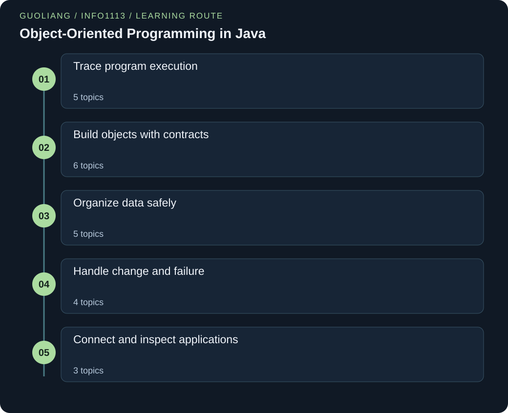

# INFO1113 — Object-Oriented Programming in Java

> Guoliang | Original study notes

[English](INFO1113.md) · [中文](INFO1113.zh.md)



Build a precise mental model of Java through original stories, traced examples and design decisions. Each lesson connects syntax to the behavior of a running program and gives you a question that tests transfer.

A complete Java 8 path through execution, object contracts, input and output, collections, generics, exceptions, testing, recursion, callbacks and application design. Each of the 23 chapters includes two independent runnable programs, traced behavior, guided questions and engineering notes.

## Connected knowledge framework

### Trace program execution
- [From source code to typed values](#java-execution-types)
- [Conditions, loops and invariants](#control-flow)
- [Methods, call frames and copied references](#methods-references)
- [Arrays, ragged grids and shallow copying](#arrays)
- [Text values, equality and builders](#strings)

### Build objects with contracts
- [Classes, constructors and protected state](#classes-invariants)
- [Input, files and resource lifetime](#text-io)
- [Binary streams and matching data layouts](#binary-io)
- [Inheritance, composition and substitutability](#inheritance-composition)
- [Overloading chooses a signature; overriding chooses behavior](#overload-override)
- [Abstract classes, interfaces and default behavior](#abstractions)

### Organize data safely
- [Choosing lists, sets, maps and linked structures](#collections)
- [Identity, value equality and hash contracts](#equality-hashing)
- [Generic classes, bounds and type safety](#generics)
- [Wildcards and the direction of data flow](#wildcards)
- [Iterators, aliasing and reachability](#iteration-memory)

### Handle change and failure
- [Exceptions as explicit failure paths](#exceptions)
- [Enums and finite state models](#enums-state)
- [Assertions, tests and useful boundaries](#testing-contracts)
- [Recursion, call trees and reusable results](#recursion-memoization)

### Connect and inspect applications
- [Anonymous classes, lambdas and captured context](#lambdas)
- [Debugging with evidence and documenting promises](#debugging-documentation)
- [From object model to a small event-driven application](#application-design)

<a id="java-execution-types"></a>

## From source code to typed values

### 01 / The story

Imagine a workshop receiving plans for a model railway. A plan checker first rejects impossible connections, then produces a standardized assembly sheet that different workshops can understand. Each workshop still needs its own tools to carry out the sheet. Java's compiler resembles the checker, bytecode resembles the standardized sheet, and a compatible virtual machine provides the local execution machinery.

The analogy has a limit: passing the checker does not prove the finished railway runs correctly. A train can still be sent to the wrong destination, just as a well-typed program can compute the wrong answer.

### 02 / The principle

A conventional Java program is written in a .java source file, compiled by javac into .class bytecode, and executed by a compatible JVM. Compile-time checks catch syntax and many type errors; runtime checks and your tests address other failures. A variable's declared type limits which values and operations are allowed.

Primitive values include int, double and boolean; reference values refer to objects or are null. An int is a signed 32-bit integer, while double represents binary floating-point approximations. Integer arithmetic can overflow, and integer division truncates toward zero. Widening conversions often happen automatically; narrowing casts may lose information.

Local variables must be definitely assigned before use. Scope determines where a name is accessible, not where every value physically resides in memory. In a conventional main(String[] args), command-line arguments arrive as Strings; check array length before indexing and parse numeric text deliberately.

### 03 / The formula, unpacked

```text
source → javac → bytecode → JVM execution
int range: −2³¹ ≤ x ≤ 2³¹ − 1
7 / 2 = 3; 7 / 2.0 = 3.5
```

The arrows show a conventional compile-and-run workflow, not a requirement that every Java launch use separate commands. x is a value stored in an int. The division examples distinguish two integer operands from an expression containing a double operand. Casting a result after integer division cannot restore the discarded fraction.

These rules describe Java arithmetic, while the exact processor instructions and object layout remain implementation details that this model deliberately does not assume.

### 04 / A first worked example

A bicycle-hire program stores 7 completed trips and 2 active days. The expression double average = 7 / 2 assigns 3.0, because integer division happens before conversion. Writing double average = 7 / 2.0 gives 3.5. Next, int whole = (int) 3.9 gives 3, which is truncation, not rounding. Save a public class TripStats in TripStats.java, compile it, then launch TripStats.

If the compiler rejects an uninitialized local variable, fix the missing assignment. If the program runs but reports 3.0, compilation succeeded and the numeric expression needs correction.

### Words to know

- **Primitive value:** A number or boolean stored as its own value, rather than an object reference.

- **Cast:** An explicit request to convert a value; it may discard information.

- **Overflow:** A mathematical result outside a type’s representable range.

### Let us work through it

**Why does assigning integer division to double not restore a fraction?**

The division is already complete. Java converts the truncated integer result afterward. Convert an operand before dividing.

**Why use long for 50000 times 50000?**

The result 2500000000 exceeds Integer.MAX_VALUE. Make at least one operand long before multiplication so the operation uses the wider type.

**Does a valid parse make every integer acceptable?**

No. Parsing checks representation. A count may still require a nonnegative value or an upper limit.

### Observe when conversion happens

Compare integer division, floating division, and widening before multiplication.

```java
public class Main {

    public static void main(String[] args) {
        int trips = 7, days = 2;
        double late = trips / days;
        double early = (double)trips / days;
        int width = 50000;
        long area = (long)width * width;
        System.out.println("late=" + late);
        System.out.println("early=" + early);
        System.out.println("area=" + area);
        System.out.println("truncate=" + (int)-3.9);
    }
}
```

**Run it locally**

```sh
javac -encoding UTF-8 Main.java
java -ea Main
```

**Expected output**

```text
late=3.0
early=3.5
area=2500000000
truncate=-3
```

**Read the syntax**

- `public class Main`: Declare the public class named Main. Save this complete program as Main.java. Braces enclose its body.

- `public static void main(String[] args)`: The JVM entry method is callable publicly. static needs no Main instance; void returns no value; args is an array of command-line strings.

- `System.out.println(value)`: Send a value to the standard output stream, then end the line. The dot selects a member; parentheses supply an argument; the semicolon ends the statement.

- `(double) trips / days`: The cast converts trips before division. Parentheses around the type mark a cast, not a method call.

**Follow the execution**

1. Declare trips and days as int, so the first division uses integer arithmetic.

2. Cast trips before division and width before multiplication to change the operation’s type.

3. Print named results so the point where information is lost is visible.

**Follow the changing state**

| Expression | Result |
| --- | --- |
| 7 / 2 | 3 |
| (double) 7 / 2 | 3.5 |
| (long) 50000 * 50000 | 2500000000 |

**Read the code step by step**

The operands determine the division type before assignment. late receives 3.0 because 7/2 has already become 3. early converts trips first, so division keeps the fractional part.

The cast before multiplication makes the product a long. The final cast truncates toward zero, giving −3 rather than −4. These are language rules, not guesses about processor storage.

### Separate parsing from accepted range

Process fixed text inputs without interactive prompts.

```java
public class Main {

    public static void main(String[] args) {
        for (String text : new String[] {"12", "-2", "twelve", "2147483648"}) {
            try {
                int value = Integer.parseInt(text);
                if (value < 0)
                    System.out.println(text + ": negative count");
                else
                    System.out.println(text + ": accepted " + value);
            } catch (NumberFormatException ex) {
                System.out.println(text + ": invalid int text");
            }
        }
    }
}
```

**Run it locally**

```sh
javac -encoding UTF-8 Main.java
java -ea Main
```

**Expected output**

```text
12: accepted 12
-2: negative count
twelve: invalid int text
2147483648: invalid int text
```

**Follow the execution**

1. The array supplies four contrasting inputs in a fixed order.

2. parseInt validates the decimal int representation before the sign rule runs.

3. The catch reports conversion failure and lets the next iteration proceed.

**Read the code step by step**

Each text is parsed inside its own try block. A syntactically valid negative integer reaches the domain check. Nonnumeric text and an integer outside the int range both fail parsing.

The loop continues after a failed item because the handler is inside the loop. No invalid value is silently changed to zero.

### Guoliang's further thinking

**Move the conversion, not the destination**

long result = a*b can overflow in int before assignment. Write (long)a*b to widen the operation itself. This distinction also explains the division example.

**Representation and domain validation**

Integer.parseInt can reject malformed or out-of-range text. A separate range check enforces the task’s meaning. Keeping those failures distinct makes an error message useful.

**Watch out:** Do not say all primitives live on the stack or all successful compilation proves correctness. Storage depends on context and implementation; type correctness is only one layer of correctness.

<details>
<summary>Check your understanding</summary>

What does (double) (9 / 4) evaluate to, and how would you obtain 2.25?

It evaluates to 2.0. Integer division happens first; use 9 / 4.0 or ((double) 9) / 4 to introduce floating-point arithmetic before division.

</details>

<a id="control-flow"></a>

## Conditions, loops and invariants

### 01 / The story

A librarian checks each trolley shelf before moving to the next. The rule is not simply to keep walking: after every shelf, all earlier shelves must already be checked. That remembered fact makes progress meaningful. A while loop resembles checking whether another shelf exists before starting; a do-while resembles inspecting one shelf before deciding whether to continue.

An enhanced for loop delegates the walking route to the trolley's traversal mechanism. The analogy is useful because loops need both a stopping rule and a fact that remains true, not merely a counter that changes.

### 02 / The principle

An if statement chooses a branch from a boolean condition. The && and || operators short-circuit, so their right operand is evaluated only when necessary; this is useful for guards such as x != null && x.isReady(). A while loop checks before its body, whereas do-while checks afterward. A for loop makes initialization, condition and update visible together.

Enhanced for visits elements but does not provide an index automatically. To reason about a loop, state an invariant, show that initialization establishes it, show that the body preserves it, and use the exit condition to obtain the result. Also identify a quantity that moves toward termination. break exits the loop; continue skips to its next iteration step.

### 03 / The formula, unpacked

```text
Before iteration i: total = a[0] + … + a[i−1]
0 ≤ i ≤ n; remaining = n − i
At exit i = n: total = sum of all n elements
```

a is an array of n numbers, i is the next index to process, and total is the accumulated sum. The empty sum at i = 0 is zero. remaining is a nonnegative progress measure that decreases by one per iteration. This reasoning assumes each iteration advances i, array length stays fixed, and arithmetic does not overflow. It describes a proof structure that also works for searching, counting and validation loops.

### 04 / A first worked example

To total daily rentals [4, 0, 7], initialize total = 0 and i = 0. The invariant says no unprocessed element has been counted. After the first iteration, total = 4 and i = 1. After the second, total remains 4 and i = 2. After the third, total = 11 and i = 3. Now i < a.length is false, so 11 is the answer. Changing the condition to i <= a.length attempts index 3 and fails.

For an empty array, the original loop performs no iterations and correctly returns zero.

### Words to know

- **Invariant:** A fact true before and after each completed iteration.

- **Short-circuit:** Skip the second Boolean operand when the first already decides the result.

- **Progress measure:** A bounded quantity that moves toward termination.

### Let us work through it

**Why is zero the correct starting total?**

No values have been processed. The sum of that empty prefix is zero, which establishes the invariant.

**What makes the loop finish?**

i increases once per iteration and cannot remain below a fixed length forever. The remaining count length−i decreases to zero.

**Why put text != null before text.length()?**

If text is null, && stops before calling length. Reversing the operands attempts the unsafe call first.

### Trace the processed prefix

Print the invariant’s state after each update.

```java
public class Main {

    public static void main(String[] args) {
        int[] values = {4, 0, 7};
        int total = 0;
        for (int i = 0; i < values.length; i++) {
            total += values[i];
            System.out.println("processed=" + (i + 1) + ", total=" + total);
        }
        int emptyTotal = 0;
        for (int value : new int[0])
            emptyTotal += value;
        System.out.println("empty total=" + emptyTotal);
    }
}
```

**Run it locally**

```sh
javac -encoding UTF-8 Main.java
java -ea Main
```

**Expected output**

```text
processed=1, total=4
processed=2, total=4
processed=3, total=11
empty total=0
```

**Read the syntax**

- `for (int i = 0; i < values.length; i++)`: Initialize once, test before each body, then increment after each completed iteration. i++ increases i by one.

- `values[i]`: Square brackets select the element at zero-based index i. length is a field giving the number of array elements.

- `total += values[i]`: Add the current element to total and store the new total. Here the chosen small inputs fit the numeric type.

**Follow the execution**

1. Initialize total to establish the empty-prefix invariant.

2. Use i<length so every indexed read is within bounds.

3. Print after adding, then separately run the same accumulation idea on empty input.

**Follow the changing state**

| Processed entries | Total |
| --- | --- |
| 0 | 0 |
| 1 | 4 |
| 2 | 4 |
| 3 | 11 |

**Read the code step by step**

Before iteration i, total contains exactly the first i entries. Adding values[i] extends that prefix by one. The printed processed count is i+1 because printing follows the addition.

The empty enhanced-for loop executes no body. Its total remains zero. This contrast checks the boundary without introducing a special-case return.

### Guard null and stop at the first match

Combine short-circuit guards with a bounded search.

```java
public class Main {

    public static void main(String[] args) {
        String[] names = {null, "", "oak", "pine", "elm"};
        int found = -1;
        for (int i = 0; i < names.length; i++) {
            String name = names[i];
            if (name == null || name.isEmpty())
                continue;
            if (name.length() == 4) {
                found = i;
                break;
            }
        }
        System.out.println("first length-four index=" + found);
        System.out.println("matched=" + names[found]);
    }
}
```

**Run it locally**

```sh
javac -encoding UTF-8 Main.java
java -ea Main
```

**Expected output**

```text
first length-four index=3
matched=pine
```

**Follow the execution**

1. Use −1 as a documented no-match marker.

2. Skip invalid entries with continue before calling other String methods.

3. Store the first matching index and exit the loop with break.

**Read the code step by step**

The guard skips missing or empty names. If name is null, || does not call isEmpty. A surviving name is safe to inspect.

The first four-letter name is pine at index three. break preserves the meaning “first match.” The example knows a match exists; a general caller must check found before indexing.

### Guoliang's further thinking

**Separate safety from progress**

An invariant can hold in a loop that never finishes. For example, a prefix sum stays correct if the loop does nothing. State both the preserved fact and a decreasing remaining-work count.

**The empty case is part of the design**

A sum loop with i<length naturally returns zero for an empty array. A do-while would enter once and require another guard. Choose control flow that matches whether zero iterations are valid.

**Watch out:** Using <= length is an off-by-one error for zero-based arrays. Writing a null check after a method call also defeats the protective purpose of short-circuit evaluation.

<details>
<summary>Check your understanding</summary>

Why can a loop preserve its invariant yet fail to finish?

An invariant describes safety, not progress. If i never increases, the invariant can remain true forever; a decreasing bounded progress measure is needed to argue termination.

</details>

<a id="methods-references"></a>

## Methods, call frames and copied references

### 01 / The story

Two coordinators have identical cards showing the location of one community noticeboard. Either coordinator can change the board, and both will see the change. If one coordinator replaces their own card with the location of a different board, the other person's card stays unchanged. This is a useful picture for passing a reference into a Java method: the reference value is copied, while the referenced object can be shared.

A method also gets its own working desk for local variables. Returning clears that desk conceptually, but it does not automatically destroy objects still reachable elsewhere.

### 02 / The principle

A method call creates a new invocation with parameter variables initialized from argument values. Java always passes by value. For a primitive argument, the copied value is the primitive; for an object argument, the copied value is a reference. Reassigning a parameter never reassigns the caller's variable. Mutating a shared object's fields or array elements can still be observed by the caller.

Each invocation has its own local variables, including recursive invocations. A static method belongs to the class context and has no implicit this; an instance method receives a particular receiver object. Return ends the invocation and supplies a value when the declared return type is not void. Method boundaries work best when inputs, outputs and side effects are explicit.

### 03 / The formula, unpacked

```text
parameter value ← copy of argument value
Caller r ─┐
          ├→ shared object O
Callee p ─┘
p = anotherObject changes p, not r
```

r is the caller's reference variable, p is the method's parameter variable, and O is the object they both initially refer to. The arrows represent references, not exposed numeric memory addresses. The assignment arrow means copying a value into another variable. This model applies equally to arrays and ordinary objects.

A return value can deliberately give the caller a new reference, but the caller must assign that returned value if it wants its own variable to change.

### 04 / A first worked example

Suppose int[] scores = {6, 8}. A method receives scores as parameter x, executes x[0] = 10, then executes x = new int[]{1, 2}. The first statement changes the shared original array to [10, 8]. The second redirects only local parameter x to a new array. After the call, scores still refers to [10, 8]. If the method instead returns x and the caller writes scores = replace(scores), the caller explicitly adopts the returned [1, 2] array.

Distinguishing mutation from reassignment explains both outcomes without calling Java pass-by-reference.

```java
import java.util.Arrays;

public class ReferenceDemo {
    static void change(int[] x) {
        x[0] = 10;
        x = new int[]{1, 2};
    }
    public static void main(String[] args) {
        int[] scores = {6, 8};
        change(scores);
        System.out.println(Arrays.toString(scores)); // [10, 8]
    }
}
```

Save this short illustration as ReferenceDemo.java in its own folder. Run:

```sh
javac -encoding UTF-8 ReferenceDemo.java
java -ea ReferenceDemo
```

### Words to know

- **Argument:** The value supplied at a method call.

- **Parameter:** A new variable initialized with a copy of an argument value.

- **Alias:** Another reference reaching the same object.

### Let us work through it

**Which assignment crosses the method boundary?**

Writing x[0] changes the shared array. Assigning a new array to x changes only the parameter variable.

**How can the caller adopt the new array?**

Return its reference and assign the result to the caller’s variable. The caller then explicitly changes its own reference.

**Why does incrementing Integer not change the caller variable?**

Integer is immutable. Unboxing, addition, and boxing create a replacement value for the local parameter.

### Compare mutation with reassignment

Keep the caller’s original array visible after the call.

```java
import java.util.Arrays;

public class Main {
    static void change(int[] x) {
        x[0] = 10;
        System.out.println("after mutation=" + Arrays.toString(x));
        x = new int[] {1, 2};
        System.out.println("local replacement=" + Arrays.toString(x));
    }
    public static void main(String[] args) {
        int[] scores = {6, 8};
        change(scores);
        System.out.println("caller=" + Arrays.toString(scores));
    }
}
```

**Run it locally**

```sh
javac -encoding UTF-8 Main.java
java -ea Main
```

**Expected output**

```text
after mutation=[10, 8]
local replacement=[1, 2]
caller=[10, 8]
```

**Read the syntax**

- `static void change(int[] x)`: Declare a class method receiving a copied array reference. void means it returns no value.

- `x[0] = 10`: Modify element zero in the object reached by x. This is distinct from assigning x itself.

- `x = new int[] {1, 2}`: Create an array and replace only the local parameter value. new allocates a new object.

**Follow the execution**

1. Pass the scores reference value into a fresh parameter x.

2. Modify the shared element before rebinding the parameter.

3. Inspect scores after return to observe which change survived.

**Follow the changing state**

| Point | Caller array | Local array |
| --- | --- | --- |
| entry | [6,8] | [6,8] |
| element write | [10,8] | [10,8] |
| parameter reassignment | [10,8] | [1,2] |

**Read the code step by step**

Both references initially reach one array. Element assignment changes that array. Reassigning x creates a different route for the callee alone.

The caller still sees [10,8]. Printing inside the method and after return exposes both states without pretending references are numeric addresses.

### Return a replacement deliberately

Contrast copying a primitive wrapper with accepting a returned array.

```java
import java.util.Arrays;

public class Main {
    static void increment(Integer x) {
        x++;
        System.out.println("local count=" + x);
    }
    static int[] doubled(int[] input) {
        int[] result = input.clone();
        for (int i = 0; i < result.length; i++)
            result[i] *= 2;
        return result;
    }
    public static void main(String[] args) {
        Integer count = 4;
        increment(count);
        System.out.println("caller count=" + count);
        int[] values = {2, 5};
        int[] replacement = doubled(values);
        System.out.println("original=" + Arrays.toString(values));
        values = replacement;
        System.out.println("adopted=" + Arrays.toString(values));
    }
}
```

**Run it locally**

```sh
javac -encoding UTF-8 Main.java
java -ea Main
```

**Expected output**

```text
local count=5
caller count=4
original=[2, 5]
adopted=[4, 10]
```

**Follow the execution**

1. Observe a local wrapper replacement separately from the caller’s count.

2. Clone before doubling so the input contract has no mutation.

3. Assign the returned reference explicitly at the caller.

**Read the code step by step**

Incrementing the wrapper reassigns only a local parameter. doubled creates an independent primitive array and edits that copy.

The original remains [2,5] until the caller chooses to replace its variable with the returned reference. Other aliases to the old array would still reach the old array.

### Guoliang's further thinking

**Mutation is an API decision**

A method that edits its argument needs to say so. A method returning a copied result can avoid surprising other aliases, at the cost of allocation and copying. Choose one contract and test it.

**A final parameter still allows mutation**

Declaring final int[] x prevents assigning another array to x. It does not prevent x[0]=10. Immutability concerns the reachable object, not merely whether a local reference can move.

**Watch out:** Calling Java pass-by-reference obscures the crucial distinction. It passes a reference value by value; object mutation can cross a method boundary, but parameter reassignment cannot.

<details>
<summary>Check your understanding</summary>

If a method increments an Integer parameter with x++, does the caller see a changed Integer variable?

No. Integer is immutable; unboxing, incrementing and boxing lead to reassignment of the local parameter. The caller retains its original reference.

</details>

<a id="arrays"></a>

## Arrays, ragged grids and shallow copying

### 01 / The story

A storage cabinet has numbered drawers starting at zero. Ordering a cabinet with five drawers fixes its size; it does not create five objects inside it. A drawer intended to hold a tool can initially be empty. A cabinet of cabinets can contain inner cabinets of different sizes, or an empty slot where an inner cabinet has not arrived.

Copying the outer cabinet's labels does not duplicate everything inside the inner cabinets. This analogy clarifies why Java arrays have fixed length, reference elements default to null, multidimensional arrays can be ragged, and copying needs an explicit depth decision.

### 02 / The principle

An array is an object with a fixed length and elements of one component type. Valid indices run from zero through length minus one. Primitive array elements receive type-specific defaults; reference elements start as null. A two-dimensional Java array is an array of array references, so rows may have different lengths or be null.

Traverse each allocated row using that row's length. Assigning one array variable to another aliases the same array. Cloning an array creates a new outer array but copies its elements; if those elements are references, their objects remain shared. Arrays of reference types are covariant, which permits some assignments but requires a runtime store check.

Generics deliberately use different rules to avoid that particular hazard.

### 03 / The formula, unpacked

```text
Valid index: 0 ≤ i < a.length
Ragged cell count = Σ row.length over non-null rows
outerCopy = original.clone(): outerCopy ≠ original; rows may still alias
```

i is an integer index and a is a non-null array. Σ means add the lengths of each allocated row; a rectangular grid is only the special case where every row has the same length. The inequality between outer arrays denotes distinct identities, not different contents. An outer clone does not recursively copy nested arrays.

The appropriate copying depth depends on whether later code must be allowed to mutate shared elements independently.

### 04 / A first worked example

Create int[][] rack = {{2, 5}, {9}}. There are three stored numbers, not four, because the second row has length one. Clone the outer array into copy. Setting copy[0][1] = 7 also changes rack[0][1], since both outer arrays still refer to the same first row. Next set copy[1] = new int[]{4, 6, 8}. Only copy's second row reference changes; rack's second row remains [9].

To isolate all integer cells, clone each non-null row as well. For rows containing mutable objects, another copying decision would still remain.

### Words to know

- **Ragged array:** An array of rows whose lengths need not match.

- **Shallow copy:** A new outer container that still shares referenced inner objects.

- **Component type:** The type an array accepts for its elements.

### Let us work through it

**How many cells does {{2,5},{9}} contain?**

Three: two in the first row and one in the second. Multiply rows by columns only after proving the array is rectangular.

**Does outer.clone isolate a row’s elements?**

No. It copies row references. Clone each primitive row if independent cell mutation is required.

**Why does an Object[] alias not permit arbitrary values in String[]?**

The actual array retains its String component type. A runtime store check rejects incompatible objects.

### Trace shallow and row-wise copies

Observe which edit crosses each copying boundary.

```java
import java.util.Arrays;

public class Main {

    public static void main(String[] args) {
        int[][] original = {{2, 5}, {9}};
        int[][] shallow = original.clone();
        shallow[0][1] = 7;
        shallow[1] = new int[] {4, 6, 8};
        System.out.println("original=" + Arrays.deepToString(original));
        System.out.println("shallow=" + Arrays.deepToString(shallow));
        int[][] isolated = new int[original.length][];
        for (int i = 0; i < original.length; i++)
            isolated[i] = original[i].clone();
        isolated[0][0] = 99;
        System.out.println("original after isolated edit=" +
                           Arrays.deepToString(original));
    }
}
```

**Run it locally**

```sh
javac -encoding UTF-8 Main.java
java -ea Main
```

**Expected output**

```text
original=[[2, 7], [9]]
shallow=[[2, 7], [4, 6, 8]]
original after isolated edit=[[2, 7], [9]]
```

**Read the syntax**

- `int[][] rack`: Declare an array whose elements are references to int arrays. Two bracket pairs do not require a rectangle.

- `rack.clone()`: Call clone to create a new outer array. Each element value, including each row reference, is copied.

- `copy[0][1]`: First select row zero, then select element one within that row. Both references and bounds must be valid.

**Follow the execution**

1. Clone the outer array and mutate one shared row.

2. Replace one row reference to separate slot mutation from cell mutation.

3. Clone individual rows before making an isolated edit.

**Follow the changing state**

| Operation | Original first row |
| --- | --- |
| start | [2,5] |
| shallow[0][1]=7 | [2,7] |
| isolated[0][0]=99 | [2,7] |

**Read the code step by step**

The outer clone shares both original rows. Editing a cell is visible through original. Replacing shallow[1] changes only that outer slot.

The second copy clones every primitive row. Its later cell edit cannot change original. The example has no null rows; a general copier must check for them.

### Handle null rows and checked stores

Show two array boundaries without letting the program crash.

```java
public class Main {

    public static void main(String[] args) {
        int[][] rows = {{1, 2}, null, {}, {3}};
        int cells = 0;
        for (int[] row : rows)
            if (row != null)
                cells += row.length;
        System.out.println("cells=" + cells);
        Object[] values = new String[2];
        values[0] = "safe";
        try {
            values[1] = Integer.valueOf(5);
        } catch (ArrayStoreException ex) {
            System.out.println("incompatible store rejected");
        }
        System.out.println("second slot=" + values[1]);
    }
}
```

**Run it locally**

```sh
javac -encoding UTF-8 Main.java
java -ea Main
```

**Expected output**

```text
cells=3
incompatible store rejected
second slot=null
```

**Follow the execution**

1. Guard row!=null before reading length.

2. Assign a String array to a wider reference type while retaining its actual component type.

3. Catch the deliberate store failure and inspect unchanged state.

**Read the code step by step**

Counting uses each existing row’s own length. The null row contributes no count because no array exists there.

The Object[] variable aliases an actual String array. The Integer store throws before changing the slot, so the final slot remains null. This illustrates why generic collections choose invariant type rules.

### Guoliang's further thinking

**Copy depth follows ownership**

Cloning rows isolates primitive cells. If cells are mutable objects, row cloning still shares those objects. State which parts callers may edit instead of calling every copy “deep.”

**Null rows are separate from empty rows**

An empty row is an allocated array of length zero. A null row has no array to query. A ragged traversal may skip both, but the stored meanings and legal operations differ.

**Watch out:** Do not use a[0].length for every row unless rectangular shape is an established invariant. Do not assume clone recursively duplicates object graphs.

<details>
<summary>Check your understanding</summary>

Why can Object[] values = new String[2] compile while values[0] = 5 fails at runtime?

Arrays are covariant, so the assignment is allowed. The actual array still accepts only String references; storing the boxed Integer triggers ArrayStoreException.

</details>

<a id="strings"></a>

## Text values, equality and builders

### 01 / The story

A printed ticket cannot have its text edited by writing on a separate instruction sheet. Asking for an uppercase ticket produces a different ticket; the original is unchanged unless you replace the reference you keep. Two separately printed tickets can carry exactly the same words without being the same physical ticket.

A StringBuilder is closer to a draft on a whiteboard: additions change one working object until you print the final text. The analogy separates content from identity and explains why a text transformation must either return a new value or use a mutable editing object.

### 02 / The principle

String is an immutable reference type. Operations such as substring, replace and toUpperCase produce results without changing the original String's value. The == operator compares reference identity, while equals compares String content. Interning can make some equal literals share an identity, but that is not a sound basis for general text comparison.

StringBuilder supports mutable appends and is useful when assembling many pieces of text in a loop. Its toString produces a String value. Java strings use UTF-16 code units: length and charAt operate on those units, so a displayed symbol can require more than one char. Choose text operations according to what counts as a character in the application, especially with supplementary characters.

### 03 / The formula, unpacked

```text
a == b: same reference?
a.equals(b): same String content?
builder.append(piece) changes the builder
s.length() counts UTF-16 code units
```

a and b are String references; invoking a.equals requires a to be non-null. A known literal can safely be the receiver, such as "ready".equals(status), or Objects.equals can compare nullable references. builder is a StringBuilder and piece is text being appended. The four lines describe distinct operations rather than interchangeable ways to compare or edit text.

Code-unit length is appropriate for Java indexing but may differ from code-point count or user-perceived character count.

### 04 / A first worked example

A program receives new String("harbor") as input and compares it with the literal "harbor". Their contents match, so equals returns true, but == need not return true and is false for these distinct objects. Calling input.toUpperCase() and ignoring its result leaves input containing "harbor". Assigning input = input.toUpperCase() keeps the uppercase result instead.

To build "Day 1, Day 2, Day 3", start with an empty builder, append a separator only when the index is greater than one, and append each label. Converting once at the end yields the complete text without a leading comma.

### Words to know

- **Immutable:** An object’s logical value cannot be changed after construction.

- **UTF-16 code unit:** One 16-bit unit used by Java String indexing.

- **StringBuilder:** A mutable buffer for assembling text before creating a String.

### Let us work through it

**Why is equals true but == false for two new strings?**

Their characters match but they are distinct objects. Value equality and reference identity answer different questions.

**What does ignoring toUpperCase lose?**

The computed new value is unused. The original String and the variable’s reference stay unchanged.

**Can one visible symbol occupy two char values?**

Yes. A supplementary Unicode code point uses a UTF-16 surrogate pair. User-perceived characters can be more complex still.

### Separate text value from object identity

Use distinct objects so literal interning cannot hide a bad comparison.

```java
public class Main {

    public static void main(String[] args) {
        String a = new String("harbor");
        String b = new String("harbor");
        System.out.println("identity=" + (a == b));
        System.out.println("content=" + a.equals(b));
        a.toUpperCase(java.util.Locale.ROOT);
        System.out.println("ignored result=" + a);
        a = a.toUpperCase(java.util.Locale.ROOT);
        System.out.println("assigned result=" + a);
    }
}
```

**Run it locally**

```sh
javac -encoding UTF-8 Main.java
java -ea Main
```

**Expected output**

```text
identity=false
content=true
ignored result=harbor
assigned result=HARBOR
```

**Read the syntax**

- `new String("harbor")`: Construct a distinct String object containing the literal text. This is useful here to expose identity.

- `left.equals(right)`: Call a content comparison on a non-null receiver. This differs from reference identity tested by ==.

- `toUpperCase(Locale.ROOT)`: Return an uppercase result using a language-neutral locale. The original immutable string does not change.

**Follow the execution**

1. Create equal text in different objects and print both comparison rules.

2. Call a transformation without assigning its result.

3. Assign the returned String and inspect the changed variable.

**Follow the changing state**

| Point | a value |
| --- | --- |
| initial | harbor |
| ignored conversion | harbor |
| assigned conversion | HARBOR |

**Read the code step by step**

new guarantees distinct String objects for this comparison. equals checks their content. Locale.ROOT makes the case conversion independent of the machine’s default locale.

The first conversion result is discarded. The second is assigned to a, which changes the reference held by the variable rather than mutating the old String.

### Build labels and count Unicode units

Contrast text assembly with the unit used for indexing.

```java
public class Main {

    public static void main(String[] args) {
        StringBuilder builder = new StringBuilder();
        for (int day = 1; day <= 3; day++) {
            if (day > 1)
                builder.append(", ");
            builder.append("Day ").append(day);
        }
        System.out.println(builder.toString());
        String symbol = new String(Character.toChars(0x1F680));
        System.out.println("code units=" + symbol.length());
        System.out.println("code points=" + symbol.codePointCount(0, symbol.length()));
    }
}
```

**Run it locally**

```sh
javac -encoding UTF-8 Main.java
java -ea Main
```

**Expected output**

```text
Day 1, Day 2, Day 3
code units=2
code points=1
```

**Follow the execution**

1. Append separators conditionally while the loop generates labels.

2. Create a supplementary code point with Character.toChars.

3. Compare length with codePointCount using the same complete String range.

**Read the code step by step**

The separator is added only after the first label, avoiding a leading comma. Chained appends operate on the same builder.

The rocket code point is outside the basic multilingual plane. Java represents it with two code units, while codePointCount reports one code point. This does not claim that code points always equal user-perceived characters.

### Guoliang's further thinking

**Choose the unit you count**

String.length counts code units, not screen width. A code-point count handles supplementary code points but still does not count every grapheme cluster. State the application’s unit before choosing an API.

**A builder changes the ownership question**

A local StringBuilder is convenient for repeated appends. Passing that mutable builder to other code permits edits to the same draft. Convert to String when publishing a stable result.

**Watch out:** Literal examples can hide an incorrect == comparison because of interning. Test text created at runtime. Remember that StringBuilder itself is mutable and should not be shared casually.

<details>
<summary>Check your understanding</summary>

Why can s.replace("a", "b") appear to have no effect?

It returns a new String result. If the result is ignored, the variable s still refers to its previous value; assign the result or use it directly.

</details>

<a id="classes-invariants"></a>

## Classes, constructors and protected state

### 01 / The story

A reusable water dispenser has a capacity and a current fill level. Users press fill or pour buttons; they do not remove a panel and rewrite the gauge. The constructor is the installation check that establishes a valid starting state. Encapsulation is valuable because every later operation can rely on the same rules.

Merely placing a private cover over the gauge is not enough if a public button accepts any impossible value. The model also explains this: the button must operate on the particular dispenser being used, not on every dispenser made from the same design.

### 02 / The principle

A class defines fields and behavior; each instance has its own instance fields. Constructors initialize a new instance and can reject invalid arguments before an invalid object escapes. The this reference denotes the current receiver and disambiguates a field from a same-named parameter. Private fields help enforce invariants by routing changes through checked operations.

Getters and setters are not automatically good encapsulation: a setter that permits impossible state defeats the design. A class receives a compiler-provided no-argument constructor only when it declares no constructors. Static fields belong to the class and are shared, so they should represent shared facts rather than accidental global state.

A final reference cannot be reassigned but may still refer to a mutable object.

### 03 / The formula, unpacked

```text
Invariant: 0 ≤ level ≤ capacity
fill(q): require q ≥ 0 and q ≤ capacity − level
After fill: level′ = level + q
```

level and capacity describe one dispenser in the same units; q is the requested addition and level′ is the state after the operation. The invariant must hold after construction and after every completed public operation. Using capacity − level in the guard can avoid an overflowing addition when working with bounded integers, assuming the invariant already holds.

These conditions belong to the object's contract, not to a graphical interface that callers might bypass.

### 04 / A first worked example

Construct a dispenser with capacity 12 and level 4. Filling by 5 is valid because 5 ≤ 12 − 4; the new level is 9. A later fill of 4 is rejected because only 3 units remain, and the level stays 9. A second dispenser constructed with capacity 8 and level 0 remains empty throughout. A static level field would incorrectly couple the two dispensers.

In the constructor, this.capacity = capacity stores the parameter into the instance field. Writing capacity = capacity would simply assign the parameter to itself and leave the field uninitialized beyond its default.

### Words to know

- **Invariant:** A rule every usable object state must satisfy.

- **Constructor:** Code that establishes a new instance’s initial state.

- **Defensive copy:** A copy made to prevent outside aliases from changing protected state.

### Let us work through it

**Why validate before changing level?**

If validation fails, the old valid state remains intact. Changing first may expose or require undoing an invalid state.

**Why compare q with capacity−level?**

The remaining capacity is safe to compute under 0≤level≤capacity. Forming level+q first could overflow for large integers.

**Does final int[] mean immutable elements?**

No. It fixes the stored reference. The array elements remain writable unless access is controlled.

### Protect a capacity invariant

Test success, rejection, and independent instance state.

```java
public class Main {
    static final class Dispenser {
        private final int capacity;
        private int level;
        Dispenser(int capacity, int level) {
            if (capacity < 0 || level < 0 || level > capacity)
                throw new IllegalArgumentException("invalid state");
            this.capacity = capacity;
            this.level = level;
        }
        void fill(int amount) {
            if (amount < 0 || amount > capacity - level)
                throw new IllegalArgumentException("does not fit");
            level += amount;
        }
        int level() {
            return level;
        }
    }
    public static void main(String[] args) {
        Dispenser a = new Dispenser(12, 4);
        Dispenser b = new Dispenser(8, 0);
        a.fill(5);
        System.out.println("after fill=" + a.level());
        try {
            a.fill(4);
        } catch (IllegalArgumentException ex) {
            System.out.println("rejected");
        }
        System.out.println("after rejection=" + a.level());
        System.out.println("other instance=" + b.level());
    }
}
```

**Run it locally**

```sh
javac -encoding UTF-8 Main.java
java -ea Main
```

**Expected output**

```text
after fill=9
rejected
after rejection=9
other instance=0
```

**Read the syntax**

- `private int level`: Store per-object mutable state behind the class access boundary. private prevents direct outside access.

- `this.capacity = capacity`: The left name is the receiver field; the right name is the constructor parameter.

- `throw new IllegalArgumentException(...)`: Create and throw an exception when an input violates the method contract. Following normal statements are skipped.

**Follow the execution**

1. Construct two valid instances with separate fields.

2. Accept five units, then reject four without mutation.

3. Read both instances to test rejection and isolation.

**Follow the changing state**

| Request | a.level | b.level |
| --- | --- | --- |
| construct | 4 | 0 |
| fill(5) | 9 | 0 |
| fill(4) rejected | 9 | 0 |

**Read the code step by step**

The constructor establishes the invariant once. Every fill preserves it by checking remaining capacity before addition. Private fields keep unchecked writes outside the public operation.

The rejected request leaves level at nine. The second instance remains empty because level is an instance field, not shared static state.

### Protect an internal array

Attack both input and output aliases with deliberate edits.

```java
import java.util.Arrays;

public class Main {
    static final class Snapshot {
        private final int[] values;
        Snapshot(int[] values) {
            this.values = values.clone();
        }
        int[] values() {
            return values.clone();
        }
    }
    public static void main(String[] args) {
        int[] supplied = {2, 5};
        Snapshot snapshot = new Snapshot(supplied);
        supplied[0] = 99;
        int[] exported = snapshot.values();
        exported[1] = 77;
        System.out.println("supplied=" + Arrays.toString(supplied));
        System.out.println("exported=" + Arrays.toString(exported));
        System.out.println("protected=" + Arrays.toString(snapshot.values()));
    }
}
```

**Run it locally**

```sh
javac -encoding UTF-8 Main.java
java -ea Main
```

**Expected output**

```text
supplied=[99, 5]
exported=[2, 77]
protected=[2, 5]
```

**Follow the execution**

1. Copy the array at construction rather than retaining the caller’s alias.

2. Return a copy when exposing the values.

3. Print a fresh getter result after both outside edits.

**Read the code step by step**

The constructor stores a clone, so editing supplied cannot change the snapshot. The getter returns another clone, so editing exported cannot change it either.

This is sufficient for primitive integer cells. An array of mutable objects would need a deeper ownership policy. The final field alone would not supply either protection.

### Guoliang's further thinking

**Reject without partial mutation**

Validation before mutation gives a simple exceptional-state guarantee: rejection leaves the object unchanged. Tests should check the state after catching the exception, not just its type.

**Copy at both ownership boundaries**

Copying constructor input prevents the caller from editing stored data through its old array. Copying getter output prevents a new alias from escaping. Either copy alone leaves the other route open.

**Watch out:** Do not expose a mutable internal list through a getter if callers must not modify it. Return a defensive copy or an appropriate unmodifiable view with clearly documented sharing behavior.

<details>
<summary>Check your understanding</summary>

Can a final List field still have elements added?

Yes. final prevents replacing the field reference. It does not make the referenced List immutable or prevent its mutation methods.

</details>

<a id="text-io"></a>

## Input, files and resource lifetime

### 01 / The story

A clerk reads a stack of delivery forms through a service window. A token reader takes one item at a time, while a line reader takes everything up to the next line boundary. Switching between those habits can leave an unexpected blank remainder. The window also needs to be closed when work finishes, even if a damaged form interrupts processing.

Java input has the same two concerns: interpreting a stream consistently and releasing the resource that supplies it. Garbage collection is not the clerk responsible for reliably closing the service window on time.

### 02 / The principle

Scanner can read tokens from standard input or files and convert them to primitive values. A token-based call such as nextInt does not consume the entire following line, so a subsequent nextLine may read only the remaining newline boundary. Pick a deliberate parsing strategy and validate before conversion where appropriate.

A file path identifies a location, but the file may be missing, unreadable or malformed. Reading and writing therefore combine data logic with failure handling. Try-with-resources closes AutoCloseable resources when the block exits, including exceptional exits. Use an explicit character encoding for portable text files.

Close resources you own; closing a Scanner wrapped around System.in also closes the shared underlying stream.

### 03 / The formula, unpacked

```text
open → read or write → close
try (resource declaration) { use resource; }
line → validate structure → parse fields → domain object
```

The first line describes a resource lifetime. The try-with-resources pattern makes the closing step part of language-managed control flow rather than relying on every return path to remember it. A line is a unit of raw text; parsing turns its fields into typed values, and domain validation decides whether those values make sense.

These are separate checks. A syntactically valid integer such as −8 may still be invalid as a count of delivered boxes.

### 04 / A first worked example

A small inventory file contains "lamp,3" and "chair,5" on separate lines. Read one complete line, split it into exactly two fields, trim the count, parse it as an integer, and reject a negative count before creating an item. Repeating gives two items and a total quantity of 8. A third line "desk,many" fails numeric parsing; report its line number instead of silently recording zero.

A line "shelf,-2" parses successfully but fails the domain rule. Keep the reader inside try-with-resources so either failure still closes the file handle.

### Words to know

- **Token:** One input unit separated according to a reader’s delimiter rules.

- **Line boundary:** The end of a logical input line, handled differently from a numeric token.

- **Resource ownership:** Responsibility for closing a resource after use.

### Let us work through it

**Why does nextLine return an empty remainder?**

nextInt consumed the digits but not the line ending. The next line call consumes the empty remainder before that boundary.

**Why distinguish parse errors from negative counts?**

The first means text is not a valid integer. The second is a valid integer that violates the data contract. They require different explanations.

**Why use a reader over a string here?**

It isolates parsing from filesystem availability. The same line parser can later receive a properly owned file reader.

### Observe a token followed by a line

All input is supplied in memory.

```java
import java.util.Scanner;

public class Main {

    public static void main(String[] args) {
        try (Scanner scanner = new Scanner("12\nlamp\n")) {
            int count = scanner.nextInt();
            String remainder = scanner.nextLine();
            String name = scanner.nextLine();
            System.out.println("count=" + count);
            System.out.println("remainder length=" + remainder.length());
            System.out.println("name=" + name);
        }
    }
}
```

**Run it locally**

```sh
javac -encoding UTF-8 Main.java
java -ea Main
```

**Expected output**

```text
count=12
remainder length=0
name=lamp
```

**Read the syntax**

- `try (Scanner scanner = new Scanner(text))`: Create an owned resource for this block and close it automatically on exit.

- `scanner.nextInt()`: Read and parse the next integer token. It does not consume the whole remaining line.

- `scanner.nextLine()`: Read the remaining text through the next line boundary, without including the line terminator.

**Follow the execution**

1. Supply a number line followed by a name line.

2. Read the token and explicitly inspect the leftover line.

3. Read the next full line and close the owned scanner.

**Follow the changing state**

| Call | Returned value |
| --- | --- |
| nextInt() | 12 |
| nextLine() | empty string |
| nextLine() | lamp |

**Read the code step by step**

nextInt stops after the digits. The first nextLine reads the remaining empty part of that same line. The following nextLine reads lamp.

Try-with-resources closes the locally owned scanner. This program intentionally shows mixed token and line reading; a consistent line-based format often avoids this boundary surprise.

### Validate complete equipment records

Reject malformed and negative quantities without losing the good records.

```java
import java.io.BufferedReader;
import java.io.StringReader;

public class Main {

    public static void main(String[] args) throws Exception {
        String data = "lamp,3\nchair,5\ndesk,many\nshelf,-2\n";
        int total = 0, lineNumber = 0;
        try (BufferedReader reader = new BufferedReader(new StringReader(data))) {
            String line;
            while ((line = reader.readLine()) != null) {
                lineNumber++;
                String[] fields = line.split(",", -1);
                if (fields.length != 2 || fields[0].trim().isEmpty()) {
                    System.out.println("line " + lineNumber + ": bad structure");
                    continue;
                }
                try {
                    int count = Integer.parseInt(fields[1].trim());
                    if (count < 0) {
                        System.out.println("line " + lineNumber + ": negative count");
                        continue;
                    }
                    total += count;
                } catch (NumberFormatException ex) {
                    System.out.println("line " + lineNumber + ": bad integer");
                }
            }
        }
        System.out.println("accepted total=" + total);
    }
}
```

**Run it locally**

```sh
javac -encoding UTF-8 Main.java
java -ea Main
```

**Expected output**

```text
line 3: bad integer
line 4: negative count
accepted total=8
```

**Read the syntax**

- `throws Exception`: This demonstration lets checked resource failures propagate from main. A larger application should catch them at a boundary that can report or recover meaningfully.

**Follow the execution**

1. Read whole lines and maintain a one-based line number.

2. Check record structure before numeric conversion and domain validation.

3. Accumulate only accepted records and report a stable final total.

**Read the code step by step**

readLine returns null only at end of input. split with −1 preserves an empty final field, allowing structure checks instead of accidentally hiding a missing count.

Only a structurally valid, parsed, nonnegative record contributes to total. The supplied small quantities cannot overflow this demonstration; a large general dataset needs a wider accumulator or checked addition.

### Guoliang's further thinking

**Parse a complete record before accepting it**

Checking field count, numeric syntax, and domain range before accumulation prevents partly accepted records. Line numbers make a rejected record identifiable without guessing which token failed.

**Closing wrappers can close shared streams**

A Scanner usually closes its underlying source. A locally created StringReader belongs to this example. A wrapper around System.in may share a process-wide input, so ownership must be decided by the calling design.

**Watch out:** Do not treat all input errors as end-of-file or silently substitute defaults. Distinguish missing data, malformed data and valid data that violates domain rules.

<details>
<summary>Check your understanding</summary>

After nextInt reads 12, why might nextLine return an empty string?

The numeric token was consumed but the line terminator remained. nextLine consumes the rest of that line. Use a consistent line-based parser or intentionally consume the remainder.

</details>

<a id="binary-io"></a>

## Binary streams and matching data layouts

### 01 / The story

A warehouse can label a box with the printed characters "258", or store the quantity in a fixed set of electronic switches. Both encode the same number, but a reader must know which representation it is receiving. Reading the switch pattern as printed letters will not recover the label. A binary file also needs an agreed layout: if the first field is a quantity and the second is a weight, both writer and reader must follow that order.

The file extension does not supply this agreement; the program's format contract does.

### 02 / The principle

Text I/O translates between characters and bytes using an encoding, while binary I/O reads and writes byte sequences according to an explicit layout. DataOutputStream can write Java primitive values in defined representations, and DataInputStream can read matching values. For example, writeInt writes four bytes in most-significant-byte-first order, and readInt expects those four bytes.

Writer and reader must agree on field order, widths and representation. A truncated field should be treated as a format failure, not silently replaced with zero. For a format intended to evolve, define a version and validation rules rather than assuming all files were produced by the current program. Binary streams still need resource management and I/O error handling.

### 03 / The formula, unpacked

```text
writeInt(258) → 00 00 01 02 (hexadecimal bytes)
258 = 1 × 256 + 2
record bytes = sum of fixed field widths, when all fields are fixed width
```

Each pair such as 01 is one byte written in hexadecimal, where digits 0 through F represent values zero through fifteen. Four byte pairs represent one 32-bit int in the DataOutput format. Most-significant-byte-first means the high-order byte comes first. The record-size rule applies only to the stated fixed-width layout; strings and other variable-length fields require additional length or delimiter conventions.

This byte order is an API guarantee, independent of a machine's native integer layout.

### 04 / A first worked example

A sensor record contains stationId as an int followed by temperature as a double. Writing stationId 258 and temperature 18.5 uses 4 + 8 = 12 bytes for these two fields. A matching reader first calls readInt and obtains 258, then readDouble and obtains 18.5. Calling readDouble first interprets the wrong eight bytes and destroys the intended field boundaries.

If the file contains only ten bytes, the final double is incomplete and must trigger a read failure. Test a round trip in memory before introducing file-system behavior, then separately test missing and truncated files.

```java
import java.io.ByteArrayInputStream;
import java.io.ByteArrayOutputStream;
import java.io.DataInputStream;
import java.io.DataOutputStream;
import java.io.IOException;

public class BinaryDemo {
    public static void main(String[] args) throws IOException {
        ByteArrayOutputStream bytes = new ByteArrayOutputStream();
        try (DataOutputStream out = new DataOutputStream(bytes)) {
            out.writeInt(258);
            out.writeDouble(18.5);
        }
        byte[] record = bytes.toByteArray();
        System.out.println(record.length); // 12
        try (DataInputStream in = new DataInputStream(
                new ByteArrayInputStream(record))) {
            System.out.println(in.readInt());    // 258
            System.out.println(in.readDouble()); // 18.5
        }
    }
}
```

Save this short illustration as BinaryDemo.java in its own folder. Run:

```sh
javac -encoding UTF-8 BinaryDemo.java
java -ea BinaryDemo
```

### Words to know

- **Binary layout:** The agreed order, widths, and representation of stored fields.

- **Byte order:** The sequence in which high- and low-order bytes are written.

- **Truncated record:** A record ending before all required field bytes arrive.

### Let us work through it

**Why is the sensor record twelve bytes?**

DataOutput writes the int in four bytes and the double in eight. The stated record has no extra header or string.

**Does native machine endianness change writeInt?**

No. The DataOutput contract specifies most-significant-byte-first order. The API defines the file representation.

**Should missing bytes be interpreted as zeros?**

No. That fabricates a different record. A readInt or readDouble that lacks bytes throws EOFException.

### Write and read a sensor record

Use byte-array streams so the program needs no file.

```java
import java.io.*;

public class Main {

    public static void main(String[] args) throws Exception {
        ByteArrayOutputStream bytes = new ByteArrayOutputStream();
        try (DataOutputStream out = new DataOutputStream(bytes)) {
            out.writeInt(258);
            out.writeDouble(18.5);
        }
        byte[] record = bytes.toByteArray();
        System.out.println("bytes=" + record.length);
        try (DataInputStream in =
                 new DataInputStream(new ByteArrayInputStream(record))) {
            System.out.println("station=" + in.readInt());
            System.out.println("temperature=" + in.readDouble());
            System.out.println("at end=" + (in.read() == -1));
        }
    }
}
```

**Run it locally**

```sh
javac -encoding UTF-8 Main.java
java -ea Main
```

**Expected output**

```text
bytes=12
station=258
temperature=18.5
at end=true
```

**Read the syntax**

- `new DataOutputStream(bytes)`: Wrap a byte destination with methods that encode primitive values.

- `out.writeInt(258)`: Write exactly four bytes using the API’s specified high-byte-first representation.

- `in.readDouble()`: Read the next eight bytes as the matching double representation. The read order must match the write order.

- `throws Exception`: This demonstration lets checked resource failures propagate from main. A larger application should catch them at a boundary that can report or recover meaningfully.

**Follow the execution**

1. Write fields in a named, fixed order.

2. Extract the byte array and verify its complete size.

3. Read the matching types and confirm no bytes remain.

**Follow the changing state**

| Field | Start offset | Byte count |
| --- | --- | --- |
| stationId | 0 | 4 |
| temperature | 4 | 8 |
| end | 12 | 0 |

**Read the code step by step**

The writer fixes field order as int then double. The reader repeats that order, consuming four then eight bytes. A final read returns −1 at end of the in-memory stream.

Closing the DataOutputStream flushes its wrapper. ByteArrayOutputStream still permits extracting its bytes afterward. This verifies the chosen primitive layout without filesystem behavior.

### Inspect exact bytes and reject truncation

A shortened copy deliberately lacks one required int byte.

```java
import java.io.*;

public class Main {

    public static void main(String[] args) throws Exception {
        ByteArrayOutputStream bytes = new ByteArrayOutputStream();
        try (DataOutputStream out = new DataOutputStream(bytes)) {
            out.writeInt(258);
        }
        byte[] full = bytes.toByteArray();
        StringBuilder hex = new StringBuilder();
        for (byte value : full) {
            if (hex.length() > 0)
                hex.append(' ');
            hex.append(String.format(java.util.Locale.ROOT, "%02X", value & 0xff));
        }
        System.out.println("hex=" + hex);
        byte[] shortRecord = java.util.Arrays.copyOf(full, 3);
        try (DataInputStream in =
                 new DataInputStream(new ByteArrayInputStream(shortRecord))) {
            in.readInt();
            System.out.println("unexpected complete record");
        } catch (EOFException ex) {
            System.out.println("truncated int rejected");
        }
    }
}
```

**Run it locally**

```sh
javac -encoding UTF-8 Main.java
java -ea Main
```

**Expected output**

```text
hex=00 00 01 02
truncated int rejected
```

**Read the syntax**

- `throws Exception`: This demonstration lets checked resource failures propagate from main. A larger application should catch them at a boundary that can report or recover meaningfully.

**Follow the execution**

1. Encode a known integer and format each unsigned byte.

2. Create a deterministic three-byte truncated record.

3. Catch only EOFException from the incomplete primitive read.

**Read the code step by step**

Masking a signed byte with 0xff produces its unsigned display value. Two hexadecimal digits represent each byte. The printed order is 00 00 01 02.

The three-byte copy cannot encode a full DataOutput int. The handler identifies truncation instead of making up the fourth byte. No unrelated I/O exception is silently swallowed.

### Guoliang's further thinking

**Round trip and malformed input test different things**

A writer and reader may share the same mistaken field order and still round-trip. Also inspect known bytes and test truncation to verify the format independently.

**Do not serialize accidental object layout**

An explicit primitive format states how many bytes exist and how to decode them. A class’s private field layout is not that format. Add version and bounds rules when the format must evolve.

**Watch out:** A .bin extension does not define a format. Do not mix Scanner-based text parsing with a binary primitive layout or assume every write method uses a single universal character encoding.

<details>
<summary>Check your understanding</summary>

If a record contains two ints and one double, how many bytes does that fixed primitive layout use before any header?

16 bytes: each DataOutput int uses 4 bytes and a double uses 8, so 4 + 4 + 8 = 16. A version field or string would add its own representation cost.

</details>

<a id="collections"></a>

## Choosing lists, sets, maps and linked structures

### 01 / The story

An event organizer needs three different records: an ordered running schedule, a collection of unique badge codes, and a lookup from each code to a guest. A list, set and map answer those different questions. Choosing a familiar container for all three makes later work awkward. Inside a list, a row of numbered boxes supports quick access by position, whereas a chain of cards supports following links from one entry to the next.

Neither representation wins for every workload, and finding a card can cost more than changing the link once you have found it.

### 02 / The principle

List preserves an ordered sequence and allows duplicates; Set models uniqueness; Map associates keys with values and is not itself a subtype of Collection. ArrayList uses a resizable backing array. Indexed access is constant time, appending is amortized constant time, and middle insertion or removal shifts elements.

LinkedList uses linked nodes; indexed access requires traversal, while operations at an already known end or iterator position can avoid shifting. HashMap and HashSet use hashing and equality; ordinary operations are expected constant time under suitable conditions, without an iteration-order promise. Prefer interface types in variables when callers need only the interface contract.

Use wrapper types such as Integer in generic collections, and distinguish list size from backing capacity.

### 03 / The formula, unpacked

```text
ArrayList: get(i) O(1); append amortized O(1); insert(i) O(n)
LinkedList: indexed lookup O(n); endpoint update O(1)
Map: one current value per equal key; Set: one member per equality class
```

n is the number of stored elements and i is a valid index. Big-O describes growth as input size increases, not elapsed milliseconds. Amortized means the average cost across a sequence of operations; an individual resize can still copy many elements. An endpoint update assumes you already have the relevant endpoint, while a middle operation can include a search.

Equality class means elements considered equal by the collection's equality rule, not necessarily identical objects.

### 04 / A first worked example

An organizer records arrivals ["Mia", "Leo", "Mia"] in a List, retaining all three events and their order. A HashSet built from the arrivals has size 2 because the repeated name is equal to an existing member. A Map storing "Mia" → 2 and "Leo" → 1 records counts. Replacing Mia's mapping with 3 changes her value without adding a third key.

If the main task is displaying the arrival at position 500 repeatedly, ArrayList is suitable. If the task is repeatedly adding and removing at the queue ends, consider a queue abstraction and an implementation suited to that access pattern.

### Words to know

- **List:** An ordered sequence that may contain equal elements more than once.

- **Set:** A collection that keeps at most one member for each equality value.

- **Map:** A relation from each key to one current associated value.

### Let us work through it

**Why do three arrivals produce two set members?**

The repeated name remains a separate list event but equals an existing set value. Containers answer different questions.

**Does replacing a map value add a key?**

Not for an equal existing key. It updates the association and keeps the key count unchanged.

**Why use Deque for a queue?**

The operations name the endpoints directly. They avoid treating repeated removal at the front as arbitrary indexed list work.

### Represent events, uniqueness, and counts

Use one input sequence to expose three different contracts.

```java
import java.util.*;

public class Main {

    public static void main(String[] args) {
        List<String> arrivals = Arrays.asList("Mia", "Leo", "Mia");
        Set<String> unique = new HashSet<>(arrivals);
        Map<String, Integer> counts = new LinkedHashMap<>();
        for (String name : arrivals)
            counts.put(name, counts.getOrDefault(name, 0) + 1);
        System.out.println("events=" + arrivals);
        System.out.println("unique count=" + unique.size());
        System.out.println("counts=" + counts);
        counts.put("Mia", 3);
        System.out.println("after replacement=" + counts + ", keys=" + counts.size());
    }
}
```

**Run it locally**

```sh
javac -encoding UTF-8 Main.java
java -ea Main
```

**Expected output**

```text
events=[Mia, Leo, Mia]
unique count=2
counts={Mia=2, Leo=1}
after replacement={Mia=3, Leo=1}, keys=2
```

**Read the syntax**

- `List<String> arrivals`: Declare a variable using the List interface, with String as its element type.

- `new LinkedHashMap<>()`: Create a map preserving insertion traversal order. The diamond lets the compiler infer type arguments.

- `for (String name : arrivals)`: Visit each element in sequence. The colon separates the loop variable from the iterable source.

**Follow the execution**

1. Retain event order in a List and derive unique membership with a Set.

2. Accumulate one map count for every equal name.

3. Replace one mapping and inspect the unchanged key count.

**Follow the changing state**

| Arrival | Counts |
| --- | --- |
| Mia | {Mia=1} |
| Leo | {Mia=1, Leo=1} |
| Mia | {Mia=2, Leo=1} |

**Read the code step by step**

The list preserves all arrival events. HashSet supplies only its size here, so unspecified set order cannot affect stdout. LinkedHashMap preserves insertion order for displayed counts.

getOrDefault supplies zero for a new name. put then records the incremented count. A later equal-key put replaces a value rather than creating another logical key.

### Contrast FIFO and LIFO with a deque

Both examples use endpoint operations rather than indexes.

```java
import java.util.*;

public class Main {

    public static void main(String[] args) {
        Deque<String> queue = new ArrayDeque<>();
        queue.addLast("oak");
        queue.addLast("pine");
        queue.addLast("elm");
        StringJoiner fifo = new StringJoiner(", ");
        while (!queue.isEmpty())
            fifo.add(queue.removeFirst());
        Deque<String> stack = new ArrayDeque<>();
        stack.push("oak");
        stack.push("pine");
        stack.push("elm");
        StringJoiner lifo = new StringJoiner(", ");
        while (!stack.isEmpty())
            lifo.add(stack.pop());
        System.out.println("FIFO=" + fifo);
        System.out.println("LIFO=" + lifo);
        System.out.println("empty poll=" + queue.pollFirst());
    }
}
```

**Run it locally**

```sh
javac -encoding UTF-8 Main.java
java -ea Main
```

**Expected output**

```text
FIFO=oak, pine, elm
LIFO=elm, pine, oak
empty poll=null
```

**Follow the execution**

1. Enqueue at one end and dequeue at the other.

2. Push and pop at the same end to form a stack.

3. Contrast throwing removal with sentinel-returning polling on empty input.

**Read the code step by step**

Adding at the tail and removing at the head gives arrival order. push and pop both use the same end, giving reverse arrival order.

removeFirst requires a nonempty queue, so the loop guards it. pollFirst instead returns null for an empty deque. ArrayDeque rejects null elements, keeping that sentinel unambiguous.

### Guoliang's further thinking

**Deterministic output needs an order contract**

HashMap does not promise traversal order. Use LinkedHashMap when insertion order is part of the result, or sort keys before display. Never infer a guarantee from one observed run.

**Count locating and modifying separately**

Linked nodes can be relinked cheaply once their location is known. Finding an arbitrary indexed node may still take linear work. Choose a container from the whole access pattern.

**Watch out:** LinkedList does not make every insertion cheap: locating an arbitrary index can still take linear time. HashMap order must not be used as a substitute for an ordered schedule.

<details>
<summary>Check your understanding</summary>

Which collection represents usernames with their latest login times, and what happens when a username is inserted twice?

A Map from username to timestamp fits. A put for an equal existing key replaces its associated value, so the number of keys does not increase.

</details>

<a id="equality-hashing"></a>

## Identity, value equality and hash contracts

### 01 / The story

A library prints two replacement cards for the same account. They are different pieces of plastic, yet the borrowing system should recognize the same account number. Its first lookup cabinet groups cards by a short code, then compares full account identity within that group. If two equivalent cards are sent to different cabinets, the comparison never gets a fair chance.

This captures the connection between equals and hashCode. A hash is a routing hint, not proof that two objects are equivalent; different accounts can still land in the same cabinet.

### 02 / The principle

Reference equality asks whether two references denote the same object. A class can override equals(Object) to define value equality. Its relation should be reflexive, symmetric, transitive and consistent while relevant state is unchanged, and a non-null object should compare unequal to null. Equal objects must have equal hash codes; unequal objects may collide.

Therefore overriding equals normally requires overriding hashCode from the same logical fields. An overload such as equals(Account) does not replace equals(Object), which collections use. Fields involved in a hash key's equality should remain stable while the key is stored. Otherwise lookup can search a different bucket from the one chosen at insertion.

Immutable value objects make the contract easier to preserve.

### 03 / The formula, unpacked

```text
a.equals(b) ⇒ a.hashCode() = b.hashCode()
Equal hash codes ⇏ equal objects
a == b tests identity; equals(Object) defines the value relation
```

a and b are non-null objects of a class with a valid equality implementation. The implication is one-way: equality constrains hashing, but hashing cannot establish equality by itself. The hash code is an int, so collisions are unavoidable for sufficiently many possible values. The contract applies across equal instances in the same execution and requires consistency when equality-relevant fields do not change.

It does not require the same hash in every future program execution.

### 04 / A first worked example

Define a final Seat class whose identity is the pair (row, number), with both fields immutable. Construct two separate instances for row "B" and seat 7. They are not identical references, but a correct equals(Object) compares both fields and returns true. Compute hashCode from those same fields, so a HashSet containing both retains one logical seat.

A third seat, B8, remains distinct even if its hash collides. If equals instead accepts only Seat as its parameter, a call through Object can fall back to Object's identity behavior; adding @Override exposes this wrong signature at compile time.

```java
import java.util.HashSet;
import java.util.Objects;
import java.util.Set;

public class EqualityDemo {
    static final class Seat {
        private final String row;
        private final int number;
        Seat(String row, int number) {
            this.row = Objects.requireNonNull(row);
            this.number = number;
        }
        @Override
        public boolean equals(Object other) {
            if (this == other) return true;
            if (!(other instanceof Seat)) return false;
            Seat seat = (Seat) other;
            return number == seat.number && row.equals(seat.row);
        }
        @Override
        public int hashCode() { return Objects.hash(row, number); }
    }
    public static void main(String[] args) {
        Set<Seat> seats = new HashSet<>();
        seats.add(new Seat("B", 7));
        seats.add(new Seat("B", 7));
        seats.add(new Seat("B", 8));
        System.out.println(seats.size()); // 2
    }
}
```

Save this short illustration as EqualityDemo.java in its own folder. Run:

```sh
javac -encoding UTF-8 EqualityDemo.java
java -ea EqualityDemo
```

### Words to know

- **Identity:** Whether two references denote the exact same object.

- **Value equality:** A class-defined rule saying two objects represent the same logical value.

- **Hash collision:** Unequal values share a hash code, which is legal.

### Let us work through it

**Why override both equals and hashCode?**

A hash collection uses the hash to find candidates and equality to distinguish them. Equal objects must be routed consistently.

**Does one shared hash make two values equal?**

No. The implication runs from equality to equal hash, not backward. The second example keeps two colliding keys.

**Why keep key fields final?**

Stable equality fields make the lookup contract easier to preserve while a key is stored. final does not recursively freeze referenced mutable objects.

### Use immutable seats as value keys

Equal separate objects become one logical set member.

```java
import java.util.*;

public class Main {
    static final class Seat {
        private final String row;
        private final int number;
        Seat(String row, int number) {
            this.row = Objects.requireNonNull(row);
            this.number = number;
        }
        @Override
        public boolean equals(Object other) {
            if (this == other)
                return true;
            if (!(other instanceof Seat))
                return false;
            Seat seat = (Seat)other;
            return number == seat.number && row.equals(seat.row);
        }
        @Override
        public int hashCode() {
            return Objects.hash(row, number);
        }
    }
    public static void main(String[] args) {
        Seat a = new Seat("B", 7), b = new Seat("B", 7);
        Set<Seat> seats = new HashSet<>();
        seats.add(a);
        seats.add(b);
        seats.add(new Seat("B", 8));
        System.out.println("identity=" + (a == b));
        System.out.println("equal=" + a.equals(b));
        System.out.println("equal hashes=" + (a.hashCode() == b.hashCode()));
        System.out.println("logical seats=" + seats.size());
    }
}
```

**Run it locally**

```sh
javac -encoding UTF-8 Main.java
java -ea Main
```

**Expected output**

```text
identity=false
equal=true
equal hashes=true
logical seats=2
```

**Read the syntax**

- `@Override`: Ask the compiler to verify that this method overrides an inherited method with the proper signature.

- `public boolean equals(Object other)`: Override Object’s equality entry point. The parameter must be Object, not only the specific class.

- `Objects.hash(row, number)`: Compute a hash from the same logical fields used by equals. Equal field values therefore produce equal hashes.

**Follow the execution**

1. Define equality through Object so collections reach the correct override.

2. Compute hashes from exactly the equality fields.

3. Insert separate equal instances and inspect logical membership count.

**Follow the changing state**

| Insert | Set size |
| --- | --- |
| B7 instance one | 1 |
| B7 instance two | 1 |
| B8 | 2 |

**Read the code step by step**

Seat is final, and its equality fields are stable. equals handles identity, unrelated types, and then the two logical fields. hashCode uses the same fields.

The set size is two even though three objects were created. No set traversal order is printed. This isolates equality behavior from ordering.

### Keep unequal colliding keys distinct

A deliberately poor hash still needs correct equality.

```java
import java.util.*;

public class Main {
    static final class Key {
        private final int id;
        Key(int id) {
            this.id = id;
        }
        @Override
        public boolean equals(Object other) {
            return other instanceof Key && id == ((Key)other).id;
        }
        @Override
        public int hashCode() {
            return 42;
        }
    }
    public static void main(String[] args) {
        Map<Key, String> values = new HashMap<>();
        values.put(new Key(1), "north");
        values.put(new Key(2), "south");
        values.put(new Key(1), "updated");
        System.out.println("keys=" + values.size());
        System.out.println("key 1=" + values.get(new Key(1)));
        System.out.println("key 2=" + values.get(new Key(2)));
        System.out.println("same hash=" +
                           (new Key(1).hashCode() == new Key(2).hashCode()));
    }
}
```

**Run it locally**

```sh
javac -encoding UTF-8 Main.java
java -ea Main
```

**Expected output**

```text
keys=2
key 1=updated
key 2=south
same hash=true
```

**Follow the execution**

1. Use an immutable integer ID for equality.

2. Force collisions with a constant hash code.

3. Look up each ID through a newly constructed equal key.

**Read the code step by step**

Both IDs hash to 42. equals still distinguishes one from two, so both mappings survive. Inserting another key with ID one replaces only its equal mapping.

The example deliberately avoids measuring timing. A legal but low-quality hash demonstrates correctness under collisions, not a recommended hashing strategy.

### Guoliang's further thinking

**An overload is not the equality override**

equals(Seat) adds another method. Collections call equals(Object). Put @Override above the intended method so the compiler checks that exact obligation.

**Correct collisions can still cost time**

Returning one constant hash is legal when equality is correct, but many keys become candidates in the same region. Contract correctness and expected performance are separate questions.

**Watch out:** Never infer equality from hashCode alone, and never mutate equality-relevant fields of a key while it remains in a hash collection. Remove it before changing it and reinsert, or design an immutable key.

<details>
<summary>Check your understanding</summary>

Can two unequal objects legally return hash code 42?

Yes. Collisions are legal; the collection must use equality to distinguish them. Returning 42 for every object can satisfy the contract while causing poor performance.

</details>

<a id="inheritance-composition"></a>

## Inheritance, composition and substitutability

### 01 / The story

A bakery owns an oven, but the bakery is not a kind of oven. A convection oven, however, can be a kind of oven if it honors the same basic promises. Mixing those relationships produces strange designs: customers might be able to ask a bakery to preheat itself simply because inheritance was used to reuse code.

Composition lets the bakery delegate heating to an owned oven. Inheritance says something stronger about how an instance can be used, so the decision should follow behavioral meaning before considering how many lines of code it saves.

### 02 / The principle

A subclass extends a superclass and can be used where the superclass type is expected, subject to the superclass contract. Java classes have a single direct superclass but can implement multiple interfaces. Inheritance carries accessible members and behavior; constructors are not inherited. A subclass constructor must arrange valid superclass initialization, often by calling super with appropriate arguments.

Private superclass state should be managed through its own behavior rather than bypassed. Composition stores a reference to a collaborator and delegates selected work, which can make replacement and testing easier. Public, private, package access and protected determine visibility; protected includes package access and has additional restrictions for subclass access across packages.

Substitutability is about preserved promises, not simply sharing a field name.

### 03 / The formula, unpacked

```text
Inheritance: SpecializedService is a Service
Composition: Coordinator has a Service
Subtype obligation: preserve the expectations of callers using the supertype contract
```

Service is an abstraction whose documented operations have meanings that clients depend on. SpecializedService adds or changes implementation while preserving those meanings. Coordinator is a separate object that refers to a Service and can delegate work to it. The relation is conceptual rather than arithmetic.

An is-a sentence is only a starting test: you must also check whether valid superclass operations remain valid and whether the subclass's results satisfy the original promises.

### 04 / A first worked example

A ReportPrinter promises print(text) for every non-null text. A FilePrinter can implement that operation by writing to a file while preserving the contract. A BatchReporter contains a ReportPrinter and calls it once for each report; making BatchReporter extend FilePrinter would expose irrelevant printing internals.

In a test, substitute a RecordingPrinter that stores printed strings. If the batch has three reports, verify three recorded outputs in order. A supposed subtype that rejects all text longer than ten characters violates the original unrestricted non-null-input promise unless that limit is already part of the common contract.

### Words to know

- **Subtype:** A type usable through a supertype while preserving its promised behavior.

- **Composition:** An object holds a collaborator and delegates work to it.

- **Substitutability:** Clients retain valid expectations when an implementation is replaced by a subtype.

### Let us work through it

**Why give the batch reporter a Sink instead of making it a Sink?**

Its responsibility is sequencing reports. Sending one report is delegated. Containment avoids exposing irrelevant inherited operations.

**Why must the child constructor call super?**

The superclass portion must establish valid state before the child is usable. Constructors are not inherited like methods.

**Can a subtype reject inputs its parent promised to accept?**

That strengthens the precondition and breaks substitutability unless the shared contract already permits rejection.

### Inject a recording collaborator

Test message ordering without external output services.

```java
import java.util.*;

public class Main {
    interface Sink {
        void send(String text);
    }
    static final class RecordingSink implements Sink {
        final List<String> messages = new ArrayList<>();
        public void send(String text) {
            messages.add(Objects.requireNonNull(text));
        }
    }
    static final class Reporter {
        private final Sink sink;
        Reporter(Sink sink) {
            this.sink = Objects.requireNonNull(sink);
        }
        void sendAll(List<String> messages) {
            for (String message : messages)
                sink.send(message);
        }
    }
    public static void main(String[] args) {
        RecordingSink sink = new RecordingSink();
        Reporter reporter = new Reporter(sink);
        reporter.sendAll(Arrays.asList("ready", "running", "done"));
        System.out.println(sink.messages);
    }
}
```

**Run it locally**

```sh
javac -encoding UTF-8 Main.java
java -ea Main
```

**Expected output**

```text
[ready, running, done]
```

**Read the syntax**

- `interface Sink`: Declare a named capability contract for collaborators.

- `implements Sink`: Promise to provide the abstract operations required by Sink.

- `private final Sink sink`: Keep a collaborator reference that cannot be replaced after construction. Its concrete implementation may vary.

**Follow the execution**

1. Declare the capability the reporter requires.

2. Pass a concrete recording implementation through the interface.

3. Inspect the ordered effects after the reporter delegates all messages.

**Follow the changing state**

| Send | Recorded messages |
| --- | --- |
| ready | [ready] |
| running | [ready, running] |
| done | [ready, running, done] |

**Read the code step by step**

Reporter stores a Sink interface, not a specific output device. Its loop delegates one send for each message. The recording sink exposes the sequence for this local test.

The test double owns its list. A public production API would normally provide a protected snapshot instead of exposing mutable state. The example’s purpose is responsibility and substitution.

### Preserve a superclass contract

A named counter adds description while retaining valid counting operations.

```java
public class Main {
    static class Counter {
        private int value;
        Counter(int start) {
            if (start < 0)
                throw new IllegalArgumentException();
            value = start;
        }
        void add(int amount) {
            if (amount < 0 || amount > Integer.MAX_VALUE - value)
                throw new IllegalArgumentException();
            value += amount;
        }
        int value() {
            return value;
        }
        String describe() {
            return "count=" + value;
        }
    }
    static final class NamedCounter extends Counter {
        private final String name;
        NamedCounter(String name, int start) {
            super(start);
            this.name = name;
        }
        @Override
        String describe() {
            return name + "=" + value();
        }
    }
    public static void main(String[] args) {
        Counter counter = new NamedCounter("samples", 2);
        counter.add(3);
        System.out.println(counter.describe());
        try {
            counter.add(-1);
        } catch (IllegalArgumentException ex) {
            System.out.println("negative rejected");
        }
        System.out.println("count=" + counter.value());
    }
}
```

**Run it locally**

```sh
javac -encoding UTF-8 Main.java
java -ea Main
```

**Expected output**

```text
samples=5
negative rejected
count=5
```

**Follow the execution**

1. Initialize the superclass before storing subclass-specific state.

2. Call inherited operations through a supertype reference.

3. Override presentation without weakening the state invariant.

**Read the code step by step**

super(start) establishes the inherited valid count. The subclass reads it through value rather than directly changing the private field. Its override changes description only.

The variable has type Counter, but the runtime receiver supplies the named description. add retains its superclass checks, including overflow prevention.

### Guoliang's further thinking

**Replace a collaborator to test a boundary**

A recording implementation lets a test inspect sent messages without real output devices. The reporter still uses the same interface, so the test exercises its sequencing responsibility directly.

**Reuse does not justify every inheritance link**

Inheriting a counter is sensible only when every accepted counter operation stays meaningful. If a wrapper needs a different contract, hold a counter field and expose only the intended operations.

**Watch out:** Do not use inheritance solely for convenient access to code. A has-a relation, unstable implementation dependency or stronger input restriction usually calls for composition or a better abstraction.

<details>
<summary>Check your understanding</summary>

Why is a read-only collection a problematic subtype of a contract that promises successful add operations?

It cannot preserve the promised operation. The abstraction should distinguish readable capabilities from mutable capabilities, or explicitly document that mutation may be unsupported.

</details>

<a id="overload-override"></a>

## Overloading chooses a signature; overriding chooses behavior

### 01 / The story

A call center first selects a service desk from the kind of request written on a form. Only after that decision does the person currently staffing that desk respond. Overloading resembles choosing the desk using information visible before the call runs. Overriding resembles selecting the response supplied by the actual receiver.

Changing the contents of the request later does not redo the earlier desk choice. Keeping the two stages separate prevents the common surprise where a variable holding a specialized object still selects the more general overloaded parameter type.

### 02 / The principle

Overloaded methods share a name but have different parameter lists; their selection uses compile-time types and applicability rules. A different return type alone is not a valid overload. Constructors can also be overloaded and can delegate to another constructor using this. Overriding provides a subtype implementation of an inherited instance method with a compatible signature and return type.

Once a particular instance-method signature is selected, dynamic dispatch uses the receiver's runtime class. The override cannot reduce access or broaden checked exceptions. Use @Override to catch mistakes. Static methods are hidden rather than dynamically overridden, and fields are not dynamically dispatched.

An argument's runtime class does not independently trigger a new overload search.

### 03 / The formula, unpacked

```text
1. Compile time: choose applicable method signature
2. Runtime: for an overridden instance method, select receiver implementation
Same name + different parameters → overload
Compatible inherited instance signature → override
```

A signature identifies the method name and parameter types for ordinary introductory examples; return type alone cannot distinguish overloads. The receiver is the object before the dot in an instance call. Compile-time type is the variable or expression type known to the compiler; runtime class belongs to the actual object.

These two stages apply to ordinary virtual instance methods. Constructors, static methods, private methods and explicit super calls require their own rules and should not be casually described as the same dispatch mechanism.

### 04 / A first worked example

Suppose Printer declares show(Object) returning "general" and show(String) returning "text". FancyPrinter overrides show(Object) to return "fancy general" but inherits show(String). With Printer p = new FancyPrinter() and Object item = "hello", p.show(item) selects show(Object) at compile time, then executes FancyPrinter's override and returns "fancy general".

By contrast, p.show("hello") selects show(String) and returns "text". The value inside item is a String in both cases, but its declared Object type controls overload selection. These two calls isolate signature selection from runtime receiver dispatch.

```java
public class DispatchDemo {
    static class Printer {
        String show(Object value) { return "general"; }
        String show(String value) { return "text"; }
    }
    static class FancyPrinter extends Printer {
        @Override
        String show(Object value) { return "fancy general"; }
    }
    public static void main(String[] args) {
        Printer p = new FancyPrinter();
        Object item = "hello";
        System.out.println(p.show(item));    // fancy general
        System.out.println(p.show("hello")); // text
    }
}
```

Save this short illustration as DispatchDemo.java in its own folder. Run:

```sh
javac -encoding UTF-8 DispatchDemo.java
java -ea DispatchDemo
```

### Words to know

- **Overload:** Methods share a name but differ in parameter lists.

- **Override:** A subtype supplies an implementation for an inherited instance method.

- **Receiver:** The object on which an instance method is invoked.

### Let us work through it

**Why does an Object variable select show(Object)?**

Overload resolution uses the expression’s compile-time type. The contained String does not restart that search at runtime.

**What then chooses FancyPrinter’s implementation?**

The runtime receiver class supplies the override of the already selected show(Object) signature.

**Can changing only return type create an overload?**

No. The parameter list must distinguish ordinary overloads. A subtype can use a compatible covariant return in an override.

### Trace overload then override

The argument value stays a String while its declared type changes.

```java
public class Main {
    static class Printer {
        String show(Object value) {
            return "general";
        }
        String show(String value) {
            return "text";
        }
    }
    static final class FancyPrinter extends Printer {
        @Override
        String show(Object value) {
            return "fancy general";
        }
    }
    public static void main(String[] args) {
        Printer p = new FancyPrinter();
        Object item = "hello";
        System.out.println(p.show(item));
        System.out.println(p.show("hello"));
    }
}
```

**Run it locally**

```sh
javac -encoding UTF-8 Main.java
java -ea Main
```

**Expected output**

```text
fancy general
text
```

**Read the syntax**

- `extends Printer`: Declare a subclass of Printer, inheriting eligible members and their contract.

- `show(Object value) / show(String value)`: Different parameter types create overloads. Their signatures are selected at compile time.

- `Printer printer = new FancyPrinter()`: The variable’s declared type is Printer; the actual receiver class is FancyPrinter. Keep both facts visible.

**Follow the execution**

1. Declare both overloads in the base class.

2. Override only the Object signature in the subclass.

3. Compare Object-typed and String-typed argument expressions.

**Follow the changing state**

| Call | Selected signature | Implementation |
| --- | --- | --- |
| p.show(item) | show(Object) | FancyPrinter |
| p.show("hello") | show(String) | Printer |

**Read the code step by step**

The first call selects show(Object), then dispatches to the override. The second selects show(String), which the subtype inherits unchanged.

No cast or runtime inspection of item occurs during overload selection. These two outputs isolate the compiler’s choice from runtime receiver behavior.

### Separate class methods from instance methods

Use explicit class names for hidden static methods.

```java
public class Main {
    static class Base {
        static String kind() {
            return "base kind";
        }
        String describe() {
            return "base instance";
        }
        Object label() {
            return "base label";
        }
    }
    static final class Derived extends Base {
        static String kind() {
            return "derived kind";
        }
        @Override
        String describe() {
            return "derived instance";
        }
        @Override
        String label() {
            return "derived label";
        }
    }
    public static void main(String[] args) {
        Base value = new Derived();
        System.out.println("base static=" + Base.kind());
        System.out.println("derived static=" + Derived.kind());
        System.out.println("instance=" + value.describe());
        System.out.println("covariant value=" + value.label());
    }
}
```

**Run it locally**

```sh
javac -encoding UTF-8 Main.java
java -ea Main
```

**Expected output**

```text
base static=base kind
derived static=derived kind
instance=derived instance
covariant value=derived label
```

**Follow the execution**

1. Declare a base-class variable holding a derived instance.

2. Name classes explicitly for both static method calls.

3. Observe virtual behavior and the covariant return override.

**Read the code step by step**

The two static calls explicitly name different declaring classes. They do not depend on value’s receiver. The instance methods do use the actual Derived object.

Derived.label returns String where Base.label promised Object. Every String is an Object, so the narrower result preserves the caller’s promise. It does not create a same-class overload by return type.

### Guoliang's further thinking

**Trace two decisions separately**

Write the selected signature first, then the receiver implementation. This prevents explaining a correct result with the false rule that runtime argument classes choose overloads.

**Static dispatch is a different rule**

A static method belongs to a class and is hidden, not overridden. Calling it with a class name makes this visible. Do not use instance-looking syntax to imply polymorphism that does not exist.

**Watch out:** Do not say Java always selects the most specialized runtime argument type. That confuses overloading with overriding. Also distinguish @Override, an annotation, from a language keyword.

<details>
<summary>Check your understanding</summary>

Can String describe() override Object describe() in a subclass?

Yes, when both are otherwise compatible instance methods: String is a covariant return type. Merely adding Object describe() and String describe() to the same class would not form valid overloads.

</details>

<a id="abstractions"></a>

## Abstract classes, interfaces and default behavior

### 01 / The story

A city can publish a bicycle-rental contract without owning a particular bicycle. Several unrelated companies can promise the same reserve and return operations. Separately, one company may build several bicycle models on a shared frame design, reusing parts while leaving some details unfinished. The public contract resembles an interface; the partially completed family design resembles an abstract class.

Both help callers work with a general idea, but they solve different design problems. A shared contract should say what clients can rely on, while a shared implementation can also manage the state needed to deliver that promise.

### 02 / The principle

An abstract class cannot be instantiated directly, but it can declare fields, constructors, concrete methods and abstract methods. A concrete subclass must implement any remaining abstract methods. An interface describes a capability that unrelated classes can implement. In Java 8, it can contain abstract methods, default instance methods, static methods and constants.

Private interface helper methods arrived in Java 9 and are outside this course’s Java 8 examples. Interface fields are implicitly public static final and do not provide per-instance mutable state. A class can implement multiple interfaces while extending only one class. Default methods provide inherited behavior, but conflicting unrelated defaults need an explicit resolution.

Prefer a small interface when consumers need a capability; use an abstract class when a genuine family needs shared implementation or controlled construction.

### 03 / The formula, unpacked

```text
abstract class: shared state + partial implementation + required operations
interface: common capability contract + optional default behavior
Concrete implementation must satisfy every inherited abstract obligation
```

The plus signs combine design responsibilities rather than numerical quantities. Shared state means instance fields managed by an abstract superclass; a capability is an operation a client can request without knowing a concrete implementation. Required operations are abstract methods still lacking a body. A default method is an instance implementation in an interface, distinct from Java's package-private access sometimes informally called default access.

Naming these meanings separately avoids confusing two uses of the same word.

### 04 / A first worked example

Define an interface AlertSink with void send(String text). A ConsoleSink prints messages, while a RecordingSink stores them for tests. A reminder service accepts an AlertSink and therefore needs no knowledge of either implementation. If several network sinks share connection settings and reconnection logic, an abstract NetworkSink could manage that state while leaving send abstract.

A concrete EmailSink completes the missing behavior. If two interfaces both supply unrelated default descriptions with the same signature, a class implementing both must choose or replace the description explicitly. It cannot rely on implementation order to select a winner.

### Words to know

- **Abstract method:** A declared operation whose implementation must be supplied by a concrete subtype.

- **Interface:** A named capability contract that different classes can implement.

- **Default method:** An inherited instance-method implementation supplied by an interface.

### Let us work through it

**Can an abstract constructor run?**

Yes. It initializes the superclass part of a concrete subclass object. Only direct construction of the abstract class is forbidden.

**Why must conflicting defaults be resolved?**

Neither unrelated interface implementation is more specific. The class must choose or define a combined behavior explicitly.

**Are interface fields per-instance mutable data?**

No. They are implicitly public static final. Use an implementing class or abstract superclass for instance state.

### Share construction while requiring behavior

A rectangle completes an abstract shape’s area operation.

```java
public class Main {
    static abstract class Shape {
        private final String name;
        Shape(String name) {
            this.name = java.util.Objects.requireNonNull(name);
        }
        abstract int area();
        String describe() {
            return name + ": area=" + area();
        }
    }
    static final class Rectangle extends Shape {
        private final int width, height;
        Rectangle(String name, int width, int height) {
            super(name);
            if (width <= 0 || height <= 0)
                throw new IllegalArgumentException();
            this.width = width;
            this.height = height;
        }
        @Override
        int area() {
            return Math.multiplyExact(width, height);
        }
    }
    public static void main(String[] args) {
        Shape shape = new Rectangle("panel", 3, 4);
        System.out.println(shape.describe());
    }
}
```

**Run it locally**

```sh
javac -encoding UTF-8 Main.java
java -ea Main
```

**Expected output**

```text
panel: area=12
```

**Read the syntax**

- `abstract class Shape`: Define a class that can share state and code but cannot be instantiated directly.

- `abstract int area();`: Declare an operation without a body. Concrete subclasses must supply its implementation.

- `super(name)`: Call the superclass constructor to initialize the inherited part before the subclass body continues.

**Follow the execution**

1. Initialize shared state through the abstract superclass constructor.

2. Validate dimensions before storing concrete state.

3. Call a shared method that delegates to a required subclass operation.

**Follow the changing state**

| Step | State or result |
| --- | --- |
| Shape constructor | name=panel |
| Rectangle constructor | width=3, height=4 |
| area() | 12 |

**Read the code step by step**

Shape owns the common name and implements description. It cannot calculate area without a concrete shape, so area remains abstract. Rectangle supplies dimensions and the missing operation.

The inherited description calls the concrete area method on the same object. multiplyExact makes overflow an explicit failure rather than silently changing the area.

### Resolve two interface defaults

Make the combined behavior explicit rather than relying on declaration order.

```java
public class Main {
    interface Description {
        String describe();
    }
    interface Left extends Description {
        default String describe() {
            return "left";
        }
        static String category() {
            return "description provider";
        }
    }
    interface Right extends Description {
        default String describe() {
            return "right";
        }
    }
    static final class Both implements Left, Right {
        @Override
        public String describe() {
            return Left.super.describe() + "+" + Right.super.describe();
        }
    }
    public static void main(String[] args) {
        Description item = new Both();
        System.out.println(item.describe());
        System.out.println(Left.category());
    }
}
```

**Run it locally**

```sh
javac -encoding UTF-8 Main.java
java -ea Main
```

**Expected output**

```text
left+right
description provider
```

**Follow the execution**

1. Declare one common capability and two default implementations.

2. Override the conflict and qualify both super calls by interface.

3. Use the common interface while keeping static behavior explicitly class-like.

**Read the code step by step**

Both inherits unrelated defaults with the same signature and must resolve the conflict. Its override names each interface’s default explicitly.

The variable needs only Description, not the concrete class. The static helper belongs to Left and is called through that interface name. All syntax is supported by Java 8.

### Guoliang's further thinking

**Capability versus shared state**

A small interface lets unrelated implementations serve the same caller. An abstract class can protect common fields and constructor checks. Use the tool that matches the actual shared responsibility.

**Keep this edition’s programs Java 8 compatible**

Java 8 interfaces support default and static methods. Private interface helpers arrived in later Java versions. They are not used here, even though modern language descriptions may mention them.

**Watch out:** An interface is not limited to methods with no bodies, and its constants are not ordinary instance fields. Avoid making a large abstract superclass when clients only need one capability.

<details>
<summary>Check your understanding</summary>

Can an abstract class have a constructor even though it cannot be instantiated directly?

Yes. Its constructor initializes the superclass portion of a concrete subclass instance. Abstract prevents direct construction, not constructor execution during subclass initialization.

</details>

<a id="generics"></a>

## Generic classes, bounds and type safety

### 01 / The story

A reusable shipping crate has a label specifying the kind of item it accepts. The warehouse can use the same crate design for books or instruments while preventing the book crate from unexpectedly receiving a bicycle. Removing the label and writing "anything" looks flexible, but the receiving clerk must then guess what comes out.

A generic class preserves the relationship between what enters and what leaves. An upper bound adds a useful promise: every accepted item might need to be weighable, allowing the crate's software to call a weight operation without guessing the exact item type.

### 02 / The principle

Generics parameterize classes, interfaces and methods with types so the compiler can check relationships between inputs and outputs. In Box<T>, a field of type T and a get method returning T preserve the chosen type across operations. Type arguments are reference types, so use Integer rather than int. A bound such as T extends Number makes Number operations available within generic code; extends is also used when the bound is an interface.

A static generic method declares its own type parameter before its return type because it cannot depend on one particular instance's T. Most generic type information is erased at runtime. Raw types and unchecked casts weaken guarantees, and new T[n] is not a legal general solution for generic arrays.

### 03 / The formula, unpacked

```text
Box<T>: put(T value) → get(): T
<T extends Number> double read(T value)
static <T> T first(List<T> values)
```

T is a placeholder for a reference type chosen for a use of the class or method. The first line means that the container preserves a type relationship, not that put immediately invokes get. The bound restricts possible T values and tells the compiler what operations are available. The static method declares a separate T whose scope is that method. first also needs a nonempty-list precondition; a type-safe signature alone cannot guarantee that a value exists.

### 04 / A first worked example

A Box<String> stores "north" and returns a String without a cast. Trying to put integer 4 into it is a compile-time error. A Box<Integer> reuses the same implementation while returning Integer. Now write a method static <T> T first(List<T> values) that rejects an empty list and returns values.get(0). Given ["red", "blue"], type inference makes the result a String with value "red".

Given [8, 13], it makes the result Integer with value 8. The algorithm is unchanged because it uses position and type preservation, not String-specific or Integer-specific behavior.

### Words to know

- **Type parameter:** A placeholder type declared by a generic class or method.

- **Bound:** A requirement restricting which types may replace a type parameter.

- **Erasure:** Compilation removes much generic type information while preserving inserted checks and casts.

### Let us work through it

**Why can Box<String>.get return String without a caller cast?**

The type parameter connects stored and returned types at compile time. The compiler checks that relationship for each use.

**Why write a type parameter before a static method’s return type?**

The method declares its own parameter. It cannot use an instance-specific T as though it belonged to one shared static method.

**Does type safety guarantee a list has a first element?**

No. Element type and collection size are different conditions. The method still checks for an empty list.

### Preserve types through a box and a method

The same code safely handles unrelated reference types.

```java
public class Main {
    static final class Box<T> {
        private final T value;
        Box(T value) {
            this.value = value;
        }
        T get() {
            return value;
        }
    }
    static <T> T first(java.util.List<T> values) {
        if (values.isEmpty())
            throw new IllegalArgumentException("empty list");
        return values.get(0);
    }
    public static void main(String[] args) {
        Box<String> direction = new Box<>("north");
        Box<Integer> count = new Box<>(8);
        String firstColor = first(java.util.Arrays.asList("red", "blue"));
        Integer firstNumber = first(java.util.Arrays.asList(8, 13));
        System.out.println(direction.get() + ", " + count.get());
        System.out.println(firstColor + ", " + firstNumber);
        try {
            first(java.util.Collections.<String>emptyList());
        } catch (IllegalArgumentException ex) {
            System.out.println("empty rejected");
        }
    }
}
```

**Run it locally**

```sh
javac -encoding UTF-8 Main.java
java -ea Main
```

**Expected output**

```text
north, 8
red, 8
empty rejected
```

**Read the syntax**

- `class Box<T>`: T names a type parameter used consistently within this class definition.

- `static <T> T first(List<T> values)`: The method introduces its own T before the return type and returns an element of that same type.

- `Box<String>`: Choose String as the class type argument. Type arguments use reference types, including wrappers such as Integer.

**Follow the execution**

1. Parameterize storage and access with the same T.

2. Let each generic method call infer its own result type.

3. Validate the nonempty condition separately from type checking.

**Follow the changing state**

| Call | Chosen T | Result |
| --- | --- | --- |
| first([red,blue]) | String | red |
| first([8,13]) | Integer | 8 |
| first([]) | String | rejection |

**Read the code step by step**

Each Box use chooses one T and keeps that relationship through get. The static first method declares a separate T, inferred from each input list.

The empty list has a valid element type but no element. Its explicit rejection demonstrates a value-level precondition that generics cannot prove.

### Use a Number bound for a stated conversion

Compute a double total from lists of different numeric wrapper types.

```java
public class Main {
    static <T extends Number> double sum(java.util.List<T> values) {
        double total = 0.0;
        for (T value : values)
            total += value.doubleValue();
        return total;
    }
    public static void main(String[] args) {
        System.out.println("integers=" + sum(java.util.Arrays.asList(3, 7)));
        System.out.println("decimals=" + sum(java.util.Arrays.asList(2.5, 1.25)));
        System.out.println("empty=" + sum(java.util.Collections.<Integer>emptyList()));
    }
}
```

**Run it locally**

```sh
javac -encoding UTF-8 Main.java
java -ea Main
```

**Expected output**

```text
integers=10.0
decimals=3.75
empty=0.0
```

**Follow the execution**

1. Declare the Number capability as a type bound.

2. Convert each element explicitly before arithmetic.

3. Return a documented double result rather than pretending it remains T.

**Read the code step by step**

The bound guarantees doubleValue exists for every T. It does not claim the + operator works directly on arbitrary T values. The method chooses double as its result representation.

The empty sum remains zero. These small values convert exactly enough for the displayed result; not every large integer is exactly representable as double. Null elements would violate this method’s input assumption.

### Guoliang's further thinking

**Return relationships are stronger than Object**

A method returning Object loses information the compiler could preserve. A method-level T can connect input and output without knowing whether the value is a String or Integer.

**A bound grants specific operations**

T extends Number grants methods such as doubleValue, not arbitrary arithmetic on T. Choose an explicit result type for arithmetic, and document precision loss when converting wide integers to double.

**Watch out:** Do not use raw List as a shortcut for List<Object>. Raw types disable parts of generic checking. Prefer a List<T> backing store to exposing an unchecked Object[]-to-T[] cast.

<details>
<summary>Check your understanding</summary>

Does T extends Number let a method add two T values with the + operator?

No. The bound permits Number methods such as doubleValue, but it does not define numeric operators for an arbitrary T. Choose an explicit result representation or pass an operation.

</details>

<a id="wildcards"></a>

## Wildcards and the direction of data flow

### 01 / The story

A depot can inspect a crate of apples as a crate of some kind of fruit. It cannot safely add a pear, because the actual crate might be reserved exclusively for apples. Conversely, a crate guaranteed to accept apples can safely receive another apple, but looking inside does not guarantee that every item is an apple: it might be a general fruit crate.

Wildcards capture these two forms of partial knowledge. They are not decorative uncertainty; they describe exactly which operations remain safe when the complete element type is hidden from the current method.

### 02 / The principle

Java generic types are invariant: List<Integer> is not a subtype of List<Number>. Otherwise code accepting List<Number> could insert a Double into a list promised to contain Integers. List<? extends Number> accepts a list of some unknown subtype of Number, so reading produces Number safely, but adding a particular non-null Number is not type-safe.

List<? super Integer> accepts a list whose unknown element type is Integer or a supertype, so adding Integer is safe; reading gives only Object without further evidence. The mnemonic PECS means producer extends, consumer super. It describes data flow relative to the method. Wildcard views are not necessarily immutable: removal and clearing may still be supported by the underlying list.

### 03 / The formula, unpacked

```text
Producer: List<? extends T> → safely read T
Consumer: List<? super T> ← safely write T
Copy: source extends T; destination super T
```

T is the type of values being transferred. A producer supplies those values to your method, while a consumer receives them from it. The wildcard ? stands for one particular but unknown type, not a new freely chosen type on every operation. The arrows describe permitted data flow. Safe reading and writing refer to static type safety; the concrete collection can still reject mutation through UnsupportedOperationException.

Null is a special write case, not a useful reason to ignore the general rule.

### 04 / A first worked example

Suppose source is a List<Integer> containing [3, 7] and destination is a List<Number> initially containing [2.5]. A copy method can declare <T> void copy(List<? extends T> src, List<? super T> dst). Reading each source element as T and adding it to destination produces [2.5, 3, 7]. By contrast, a List<? extends Number> view of source cannot accept 2.5: its hidden element type might be Integer.

A List<? super Integer> view of destination accepts 9, but its first element must be read as Object because that element could be the existing Double 2.5.

```java
import java.util.ArrayList;
import java.util.Arrays;
import java.util.List;

public class WildcardDemo {
    static <T> void copy(List<? extends T> source,
                         List<? super T> destination) {
        for (T item : source) destination.add(item);
    }
    public static void main(String[] args) {
        List<Integer> source = Arrays.asList(3, 7);
        List<Number> destination = new ArrayList<>();
        destination.add(2.5);
        copy(source, destination);
        System.out.println(destination); // [2.5, 3, 7]
    }
}
```

Save this short illustration as WildcardDemo.java in its own folder. Run:

```sh
javac -encoding UTF-8 WildcardDemo.java
java -ea WildcardDemo
```

### Words to know

- **Invariance:** List<Integer> is not a subtype of List<Number>, despite the element relationship.

- **Producer:** An argument from which the current method reads values.

- **Consumer:** An argument into which the current method writes values.

### Let us work through it

**Why can an extends view not accept a Double?**

Its hidden element type may be Integer. Adding a Double would violate the original list’s promise.

**What type can be read safely from ? super Integer?**

Object. The list may also contain earlier values of a wider element type. Integer writes are safe, but not every stored item is Integer.

**Does ? extends Number forbid clear or remove?**

No. The wildcard restricts element type operations, not every mutation. The concrete list decides which mutation methods are supported.

### Copy from a producer into a consumer

Transfer Integer values into a list that also accepts Double.

```java
import java.util.*;

public class Main {
    static <T> void copy(List<? extends T> source, List<? super T> destination) {
        for (T value : source)
            destination.add(value);
    }
    public static void main(String[] args) {
        List<Integer> source = Arrays.asList(3, 7);
        List<Number> destination = new ArrayList<>();
        destination.add(2.5);
        copy(source, destination);
        System.out.println("source=" + source);
        System.out.println("destination=" + destination);
    }
}
```

**Run it locally**

```sh
javac -encoding UTF-8 Main.java
java -ea Main
```

**Expected output**

```text
source=[3, 7]
destination=[2.5, 3, 7]
```

**Read the syntax**

- `List<? extends T> source`: The hidden element type is T or a subtype. Reading a value as T is safe.

- `List<? super T> destination`: The hidden element type is T or a supertype. Writing a T is type-safe.

- `<T> void copy(...)`: Declare one method type parameter tying the source and destination data flow together.

**Follow the execution**

1. Express the read side with extends and the write side with super.

2. Initialize the destination with a value outside Integer.

3. Transfer each source value without an unchecked cast.

**Follow the changing state**

| Step | Destination |
| --- | --- |
| initial | [2.5] |
| copy 3 | [2.5,3] |
| copy 7 | [2.5,3,7] |

**Read the code step by step**

The source can supply values readable as T. The destination can safely accept T values. Existing wider values in the destination need not have type Integer.

The source remains unchanged because the method only reads it. The destination grows in source order. This assumes its concrete implementation supports add.

### Separate type knowledge from mutability

Remove through an extends view and write through a super view.

```java
import java.util.*;

public class Main {

    public static void main(String[] args) {
        List<Integer> numbers = new ArrayList<>(Arrays.asList(3, 7));
        List<? extends Number> source = numbers;
        Number first = source.get(0);
        source.remove(0);
        List<Object> mixed = new ArrayList<>();
        mixed.add("note");
        List<? super Integer> destination = mixed;
        destination.add(9);
        Object earlier = destination.get(0);
        System.out.println("read number=" + first);
        System.out.println("after removal=" + numbers);
        System.out.println("earlier=" + earlier);
        System.out.println("destination=" + mixed);
    }
}
```

**Run it locally**

```sh
javac -encoding UTF-8 Main.java
java -ea Main
```

**Expected output**

```text
read number=3
after removal=[7]
earlier=note
destination=[note, 9]
```

**Follow the execution**

1. Read through a covariant wildcard without claiming the whole list is List<Number>.

2. Remove an element through the shared view.

3. Write Integer through a lower bound and read existing content as Object.

**Read the code step by step**

The extends view permits a Number read and a supported removal. It does not permit adding an arbitrary Number. The removal is visible through numbers because both references reach one list.

The super view safely adds Integer nine to a List<Object>. Its earlier String explains why reading promises only Object. These are static type guarantees, not immutable views.

### Guoliang's further thinking

**Describe direction relative to the method**

In copy, the source produces T and the destination consumes T. The same list may play a different role in another method. PECS describes this use, not a permanent category of object.

**Mutability is another contract**

A wildcard signature can make an add type-safe while an unmodifiable destination still rejects it. Type compatibility does not promise the concrete collection supports every operation.

**Watch out:** Do not describe ? extends T as completely read-only or ? super T as write-only. These labels approximate element type guarantees, not all operations or the underlying collection's mutability.

<details>
<summary>Check your understanding</summary>

Why can a List<Object> be passed to a method expecting List<? super Integer> but not List<Integer>?

Object is a supertype of Integer, so accepting Integer writes is safe. Invariance prevents treating a list that may contain arbitrary Objects as if every element were Integer.

</details>

<a id="iteration-memory"></a>

## Iterators, aliasing and reachability

### 01 / The story

Two visitors walk through a gallery using separate route cards. Each card records its visitor's current position; sharing one card would make the visitors unexpectedly move each other's progress. The gallery itself is the iterable structure, while each route card is an iterator. Now imagine the museum removes every public entrance to an old room.

Objects inside may still refer to one another, but the room is no longer reachable from the active building. That second picture helps explain garbage collection: unreachable cycles can be collectible even when objects still contain references to each other.

### 02 / The principle

Iterable<T> supplies an iterator, and Iterator<T> exposes traversal state through hasNext and next. Enhanced for uses this protocol for Iterable objects, with separate language support for arrays. Each independent iterator should maintain its own cursor. next must throw NoSuchElementException when exhausted rather than return a fabricated value.

Structural modification during traversal depends on the collection's contract; common fail-fast iterators can throw ConcurrentModificationException, but that is not a synchronization strategy. References also determine object reachability. Garbage collection can reclaim objects no longer reachable from live roots, including unreachable cycles; setting one variable to null is insufficient if another path remains.

Collection timing is not deterministic, and collection does not replace explicit cleanup of external resources.

### 03 / The formula, unpacked

```text
Iterable<T>.iterator() → fresh traversal state
hasNext() reports availability; next() returns and advances
Collectible candidate: no strong path from live roots to the object
```

T is the element type. Fresh traversal state means separate cursors when independent iteration is intended, not necessarily copying the entire collection. Live roots include active execution and static references; strong paths are ordinary reachability links. The last line describes eligibility at a conceptual level, not an immediate deletion command.

An object referenced by an otherwise unreachable cycle can still lack a path from live roots, whereas an apparently unused object held in a static collection may remain reachable.

### 04 / A first worked example

A list contains ["oak", "pine", "elm"]. Iterator a reads "oak" and now points toward "pine". A separately created iterator b still returns "oak" on its first next call. Advancing a until it has no next element must not affect b's cursor. After both iterators and the list become unreachable, the list and its private nodes can become collectible, assuming no other references exist.

If a static cache still holds the list, it remains reachable. Removing entries through a supported iterator operation is different from modifying the same list arbitrarily while an iterator is traversing it.

### Words to know

- **Iterator:** An object storing one traversal’s cursor and operations.

- **Reachability:** Whether a chain of live references can still reach an object.

- **Root:** An execution or static reference from which reachability begins.

### Let us work through it

**Why do two iterators both first return oak?**

Each has its own cursor. Sharing the list does not mean sharing traversal position.

**Why use iterator.remove during traversal?**

It is the iterator’s supported way to remove the last returned element. Arbitrary structural edits through the list may invalidate its traversal assumptions.

**Does setting one variable to null prove collection occurred?**

No. Other strong paths may remain. Even if none remain, eligibility does not promise immediate collection.

### Give each traversal its own cursor

Exhaust one iterator without advancing the other.

```java
import java.util.*;

public class Main {

    public static void main(String[] args) {
        List<String> trees = Arrays.asList("oak", "pine", "elm");
        Iterator<String> a = trees.iterator(), b = trees.iterator();
        System.out.println("a=" + a.next());
        System.out.println("a=" + a.next());
        System.out.println("b=" + b.next());
        System.out.println("a=" + a.next());
        System.out.println("a has next=" + a.hasNext());
        try {
            a.next();
        } catch (NoSuchElementException ex) {
            System.out.println("a exhausted");
        }
        System.out.println("b=" + b.next());
    }
}
```

**Run it locally**

```sh
javac -encoding UTF-8 Main.java
java -ea Main
```

**Expected output**

```text
a=oak
a=pine
b=oak
a=elm
a has next=false
a exhausted
b=pine
```

**Read the syntax**

- `Iterator<String> a = values.iterator()`: Ask the iterable collection for an iterator with its own traversal position.

- `a.hasNext()`: Check availability without consuming the next element.

- `a.next()`: Return the next element and advance the cursor; throw if exhausted.

**Follow the execution**

1. Create two iterators rather than aliasing one iterator.

2. Interleave their next calls to inspect independent positions.

3. Check exhaustion and handle the deliberate invalid next call.

**Follow the changing state**

| After call | a next index | b next index |
| --- | --- | --- |
| create | 0 | 0 |
| a.next twice | 2 | 0 |
| b.next | 2 | 1 |
| a.next | 3 | 1 |

**Read the code step by step**

Two iterator calls create separate traversal state over the same list. a reaches the end while b remains near the beginning.

Calling next after exhaustion throws the specified exception. The method cannot invent a default element without making exhaustion indistinguishable from real data.

### Remove safely and keep reachability visible

A second alias survives after the original variable is cleared.

```java
import java.util.*;

public class Main {

    public static void main(String[] args) {
        List<Integer> values = new ArrayList<>(Arrays.asList(1, 2, 3, 4));
        List<Integer> alias = values;
        Iterator<Integer> iterator = values.iterator();
        while (iterator.hasNext()) {
            if (iterator.next() % 2 != 0)
                iterator.remove();
        }
        values = null;
        System.out.println("remaining through alias=" + alias);
        System.out.println("original variable null=" + (values == null));
        System.out.println("alias size=" + alias.size());
    }
}
```

**Run it locally**

```sh
javac -encoding UTF-8 Main.java
java -ea Main
```

**Expected output**

```text
remaining through alias=[2, 4]
original variable null=true
alias size=2
```

**Follow the execution**

1. Create an intentional alias to the same mutable list.

2. Remove odd entries through the iterator after each next.

3. Clear one reference and observe continued access through the other.

**Read the code step by step**

next advances to one element, and remove deletes that just-returned element through the supported iterator protocol. Only even values remain.

Assigning null to values does not change alias. The printed list demonstrates a surviving strong path. It makes no claim about when any unrelated object is collected.

### Guoliang's further thinking

**Do not test garbage-collector timing**

A deterministic ownership lesson can show that another alias still reaches the object. It should not wait for System.gc or claim a collection deadline that Java does not guarantee.

**Fail-fast is not synchronization**

ConcurrentModificationException can expose an invalid traversal pattern, but it is a best-effort diagnostic. It cannot replace locks, snapshots, or an explicitly concurrent collection contract.

**Watch out:** Do not use one cursor stored in the collection for every iterator. Do not assume System.gc forces immediate cleanup, or that garbage collection closes every file at the right time.

<details>
<summary>Check your understanding</summary>

If two nodes point to one another but no live root reaches either, must the cycle remain forever?

No. Reachability-based collection can reclaim the unreachable cycle. Internal references do not create a path from a live root.

</details>

<a id="exceptions"></a>

## Exceptions as explicit failure paths

### 01 / The story

A delivery process has a normal route and a clearly marked route for problems. An unreadable address needs a decision from someone capable of correcting it; pretending the parcel arrived would corrupt the record. A damaged sorting machine is different from a missing apartment number. Exceptions let a method signal that its normal promise could not be completed and transfer control to an appropriate handler.

The analogy also reminds us that cleanup still matters: whichever route is taken, the loading door must be secured and temporary equipment must be released.

### 02 / The principle

Throwing an exception transfers control out of the current normal path until a matching catch is found. Stack frames are unwound as necessary. Checked exceptions must be caught or declared with throws; RuntimeException and Error subclasses are unchecked. This distinction is a compiler rule, not a perfect ranking of seriousness.

Choose an exception that explains the violated contract or failure, and catch it where useful recovery or translation is possible. A throws declaration does not handle the failure. Catch more specific types before broader types. Finally runs during ordinary and exceptional exits, while try-with-resources is preferable for managed resources.

Not every exception is a caller precondition failure: an I/O operation may fail despite valid inputs.

### 03 / The formula, unpacked

```text
normal return ⇒ documented result and postcondition
throw E ⇒ search outward for compatible catch
checked E ⇒ catch E or declare a suitable throws type
```

E denotes an exception type and instance carrying failure information. A compatible catch handles E or one of its supertypes. A postcondition describes what the method promises after a normal return; an exceptional exit can have a separate state guarantee, such as leaving the object unchanged. The implication does not mean all programs automatically honor their contracts.

It is a design obligation that implementation and tests must verify, including what state survives a failed operation.

### 04 / A first worked example

A parcel locker has capacity 6 and currently holds 5 parcels. add(2) checks available capacity before changing its count and throws IllegalArgumentException when the request cannot fit. Because validation occurs first, the locker still holds 5 parcels after the caller catches the exception. Separately, loading locker data from a missing file can throw IOException even when the supplied path is syntactically valid.

A command-line boundary might report the missing file and ask for a different path. Returning an empty inventory without explanation would incorrectly turn an operational failure into apparently valid domain data.

### Words to know

- **Checked exception:** An exception the compiler requires callers to catch or declare.

- **Unwinding:** Leaving active method calls while searching for a matching handler.

- **Exceptional guarantee:** What remains true about state when an operation fails.

### Let us work through it

**Does throws perform recovery?**

No. It declares permitted propagation. A catch at an appropriate boundary chooses whether to recover, report, or rethrow.

**Why validate before adding?**

A rejected operation can then leave the old state unchanged. This is a concrete failure contract that a caller can rely on.

**Why close resources on the exceptional path too?**

Failure does not end ownership obligations. Try-with-resources arranges close when control leaves the block.

### Reject before mutating state

A caller can inspect the object after catching a failed request.

```java
public class Main {
    static final class Store {
        private final int capacity;
        private int size;
        Store(int capacity, int size) {
            if (capacity < 0 || size < 0 || size > capacity)
                throw new IllegalArgumentException("invalid state");
            this.capacity = capacity;
            this.size = size;
        }
        void add(int amount) {
            if (amount < 0 || amount > capacity - size)
                throw new IllegalArgumentException("capacity exceeded");
            size += amount;
        }
        int size() {
            return size;
        }
    }
    public static void main(String[] args) {
        Store store = new Store(6, 5);
        try {
            store.add(2);
        } catch (IllegalArgumentException ex) {
            System.out.println("rejected: " + ex.getMessage());
        }
        System.out.println("after failure=" + store.size());
        store.add(1);
        System.out.println("after success=" + store.size());
    }
}
```

**Run it locally**

```sh
javac -encoding UTF-8 Main.java
java -ea Main
```

**Expected output**

```text
rejected: capacity exceeded
after failure=5
after success=6
```

**Read the syntax**

- `try { ... } catch (IllegalArgumentException ex) { ... }`: Run the normal block; matching failures transfer to the catch block, which can inspect ex.

- `throw new IllegalArgumentException("capacity")`: Signal a rejected request and leave the normal path before mutating state.

- `amount > capacity - count`: Compare against remaining capacity before addition, avoiding an overflowing sum under the invariant.

**Follow the execution**

1. Establish valid initial state in the constructor.

2. Throw before mutation when the request exceeds remaining capacity.

3. Check unchanged state, then exercise a successful call.

**Follow the changing state**

| Action | Size |
| --- | --- |
| initial | 5 |
| add(2) throws | 5 |
| add(1) | 6 |

**Read the code step by step**

The failed add exits before size is written. Catching it changes control flow but does not need to undo any partial update. A later valid request still works.

The exception message explains the boundary failure. The example catches the specific expected type rather than hiding every possible programming defect.

### Observe cleanup during exception propagation

Small owned resources report close order without touching files.

```java
public class Main {
    static final class Resource implements AutoCloseable {
        private final String name;
        Resource(String name) {
            this.name = name;
            System.out.println("open=" + name);
        }
        void use() {
            System.out.println("use=" + name);
        }
        @Override
        public void close() {
            System.out.println("close=" + name);
        }
    }
    public static void main(String[] args) {
        try (Resource first = new Resource("first");
             Resource second = new Resource("second")) {
            first.use();
            second.use();
            throw new IllegalStateException("work failed");
        } catch (IllegalStateException ex) {
            System.out.println("caught=" + ex.getMessage());
        }
        System.out.println("continued");
    }
}
```

**Run it locally**

```sh
javac -encoding UTF-8 Main.java
java -ea Main
```

**Expected output**

```text
open=first
open=second
use=first
use=second
close=second
close=first
caught=work failed
continued
```

**Follow the execution**

1. Acquire two local AutoCloseable resources in a single try header.

2. Use them and deliberately throw from the body.

3. Observe reverse cleanup before the outer handler and continuation.

**Read the code step by step**

Resources open left to right and close in reverse order when the body throws. The catch runs after both close operations. This mirrors nested ownership.

The demonstration close methods cannot fail. Real failing cleanup may produce suppressed exceptions, which callers should inspect rather than assuming the original failure disappeared.

### Guoliang's further thinking

**Do not turn failure into plausible data**

Returning zero after a malformed record may be indistinguishable from a real zero. Preserve the failure signal or use a result type that explicitly represents failure.

**Cleanup and recovery are different**

Closing a resource releases ownership; it does not make the failed operation succeed. Catch where a useful decision can be made, while resource cleanup remains local to the owner.

**Watch out:** Avoid catch(Exception e) followed by an empty body. It hides the cause and may leave partially changed state. Avoid returning from finally, which can suppress an exception or earlier result.

<details>
<summary>Check your understanding</summary>

If a method declares throws IOException, has it recovered from file failures?

No. It has declared that those failures may propagate. A caller or higher boundary must decide whether to recover, report, translate or propagate them further.

</details>

<a id="enums-state"></a>

## Enums and finite state models

### 01 / The story

A parcel can be waiting, in transit or delivered. Writing those states on loose sticky notes invites misspellings and invented labels such as "nearly delivered-ish." A printed set of official tokens narrows the vocabulary. But vocabulary alone does not guarantee a sensible journey: moving straight from delivered back to waiting may still violate the process.

An enum provides the finite set of labels, while a transition rule controls movement between them. Keeping both ideas visible prevents a program from confusing type-safe state names with a fully correct state machine.

### 02 / The principle

An enum defines a fixed set of named instances of its enum type. It gives compile-time protection against mixing unrelated labels and can contain fields, methods and constructors. Each constant can even supply specialized behavior. Enum instances can be compared with == because each declared constant denotes its singleton instance.

Prefer meaningful methods or explicit transition tables over scattered string comparisons. A state machine combines a current state, an event and a transition rule that determines the next state or rejects the event. Enums make the state space explicit but do not enforce every transition automatically. Avoid persisting ordinal values as durable identifiers because reordering constants changes those numbers.

A name or stable explicit code is usually clearer.

### 03 / The formula, unpacked

```text
δ(state, event) = next state or rejection
δ(QUEUED, dispatch) = IN_TRANSIT
δ(IN_TRANSIT, confirm) = DELIVERED
δ(DELIVERED, dispatch) = rejection
```

δ is a transition function. state belongs to an enum-defined finite set, and event is an action the application receives. Rejection means the pair has no permitted transition under this model. The model must specify how rejected actions are reported and whether state is preserved. These rules describe one chosen parcel process, not a universal domain rule.

An enum constant is a state value; it is not the complete object holding parcel identity and other data.

### 04 / A first worked example

Start parcel P7 in QUEUED. A dispatch event changes its state to IN_TRANSIT. A second dispatch is rejected because the parcel has already left the queue; its state remains IN_TRANSIT. A confirm event then changes it to DELIVERED. A later dispatch is again rejected. In tests, check the three accepted states and every unsupported state-event combination important to the contract.

If a new RETURNED state is introduced, revisit the transition model and its tests. Merely adding the enum constant does not tell existing operations how a returned parcel should behave.

### Words to know

- **Enum constant:** One named instance from a fixed enum-defined set.

- **Transition:** A rule taking a current state and event to a next state or rejection.

- **Stable code:** An explicit external identifier independent of declaration position.

### Let us work through it

**Does an enum prevent every invalid transition?**

No. It restricts state names. A separate operation must reject unsupported state-event pairs.

**Why compare enum values with ==?**

Each declared constant is one fixed instance. Identity represents that named enum value.

**Why avoid persisting ordinal?**

Ordinal is the declaration position. Inserting or reordering constants changes it. Explicit codes can preserve a format contract.

### Accept and reject workflow events

The state is assigned only after a legal transition is returned.

```java
public class Main {
    enum State { QUEUED, RUNNING, DONE }
    static State next(State state, String event) {
        if (state == State.QUEUED && event.equals("start"))
            return State.RUNNING;
        if (state == State.RUNNING && event.equals("finish"))
            return State.DONE;
        throw new IllegalStateException("invalid transition");
    }
    public static void main(String[] args) {
        State state = State.QUEUED;
        for (String event : new String[] {"start", "start", "finish", "start"}) {
            try {
                state = next(state, event);
                System.out.println(event + " -> " + state);
            } catch (IllegalStateException ex) {
                System.out.println(event + " rejected at " + state);
            }
        }
    }
}
```

**Run it locally**

```sh
javac -encoding UTF-8 Main.java
java -ea Main
```

**Expected output**

```text
start -> RUNNING
start rejected at RUNNING
finish -> DONE
start rejected at DONE
```

**Read the syntax**

- `enum State { QUEUED, RUNNING, DONE }`: Declare three named instances of one finite type. Commas separate constants.

- `state == State.QUEUED`: Compare identity with the unique named enum instance. This is appropriate for enum values.

- `return State.RUNNING`: Return the proposed next state. The caller explicitly decides whether to store it.

**Follow the execution**

1. Start with a named enum state.

2. Pass each event to the explicit transition function.

3. Catch rejected events and show the preserved state.

**Follow the changing state**

| Event | Before | After |
| --- | --- | --- |
| start | QUEUED | RUNNING |
| start | RUNNING | RUNNING |
| finish | RUNNING | DONE |

**Read the code step by step**

next is a transition function with no mutation. Assignment happens only on a normal return. A repeated start event therefore cannot corrupt the current state.

String equality identifies events, while enum identity identifies states. This model intentionally permits only two transitions; it is not a universal workflow.

### Decode explicit enum codes

Separate a persisted code from the constant’s ordinal.

```java
public class Main {
    enum Mode {
        IDLE(10),
        ACTIVE(20),
        STOPPED(30);
        private final int code;
        Mode(int code) {
            this.code = code;
        }
        int code() {
            return code;
        }
        static Mode fromCode(int code) {
            for (Mode mode : values())
                if (mode.code == code)
                    return mode;
            throw new IllegalArgumentException("unknown code");
        }
    }
    public static void main(String[] args) {
        for (Mode mode : Mode.values())
            System.out.println(mode + ": code=" + mode.code());
        System.out.println("decoded=" + Mode.fromCode(20));
        try {
            Mode.fromCode(99);
        } catch (IllegalArgumentException ex) {
            System.out.println("unknown code rejected");
        }
    }
}
```

**Run it locally**

```sh
javac -encoding UTF-8 Main.java
java -ea Main
```

**Expected output**

```text
IDLE: code=10
ACTIVE: code=20
STOPPED: code=30
decoded=ACTIVE
unknown code rejected
```

**Follow the execution**

1. Assign stable codes in enum constructors.

2. Decode by matching the explicit field.

3. Reject an unknown code instead of treating it as an ordinal.

**Read the code step by step**

Each constant stores a deliberate external code. fromCode searches those codes, not array positions. Reordering declarations would change values traversal order but not these mappings.

An unknown code fails explicitly. A larger enum might use a lookup map with duplicate-code validation, while this tiny linear search keeps the contract visible.

### Guoliang's further thinking

**Rejected transitions should preserve state**

Calculate or validate the next state before assignment. Then a rejected event leaves the current state unchanged, simplifying callers and transition tests.

**Add a state by revisiting the whole model**

A new enum label does not explain which events enter or leave it. Update the transition rules, display behavior, parsing, and relevant tests as one coherent change.

**Watch out:** Do not use enum ordinal as a permanent domain identifier. Do not assume using an enum prevents invalid transitions; enforce those in the domain operation.

<details>
<summary>Check your understanding</summary>

Why is comparing an enum constant with == appropriate while comparing arbitrary String contents with == is usually wrong?

Each enum constant is a unique fixed instance, so identity represents that named value. Distinct String objects can contain equal text, so content comparison requires equals.

</details>

<a id="testing-contracts"></a>

## Assertions, tests and useful boundaries

### 01 / The story

An elevator inspector does not only ride from floor two to floor three on a quiet day. They test the ground floor, top floor, empty cabin, capacity limit and invalid requests, because boundaries reveal mistakes ordinary trips can hide. Software tests follow the same logic. A warning light inside the maintenance panel resembles a language assertion: valuable for detecting internal assumptions, but unsuitable as the only protection against a passenger selecting an impossible destination.

Public validation must work during normal operation, whether diagnostic assertions are enabled or disabled.

### 02 / The principle

A test checks observed behavior against an expected result. Derive cases from the contract: normal cases, boundaries, invalid inputs and relevant state transitions. Black-box tests use public behavior; white-box reasoning can identify untested branches without making tests depend on every implementation detail.

Java's assert statement can be disabled, so it is useful for internal consistency checks but should not be the sole validation of public input. Testing frameworks such as JUnit provide assertions that execute as part of tests independently of the Java assert switch. Keep each test understandable and deterministic, and verify exceptional behavior as well as normal returns.

Passing tests increase confidence for the covered cases but are not a proof that no defects remain.

### 03 / The formula, unpacked

```text
Arrange → Act → Assert
Boundary set for valid range 1…m: {0, 1, m, m+1}
Expected result includes value, state change and exception behavior
```

Arrange establishes the initial conditions, Act invokes the behavior under test, and Assert compares observations with the contract. m is the largest accepted input in a simple contiguous integer range. The boundary set samples just outside and exactly on its edges; other values are still needed when the logic has additional branches.

Expected behavior can include unchanged state after rejection. Coverage statistics count execution, not the quality of the expectations being checked.

### 04 / A first worked example

A booking object has 8 seats and currently holds 3 reservations. Test reserve(2): the resulting reserved count should be 5. In an independent fixture, test reserve(5): the result should be 8. Test reserve(6): it should reject the request and keep the count at 3. Also test a negative request and decide from the documented contract whether zero is valid.

These cases exercise ordinary success, exact capacity, overflow of capacity and invalid sign. Reusing a mutated fixture carelessly can make the second test depend on the first, so each case should establish its own starting state.

### Words to know

- **Fixture:** The prepared objects and inputs for one test case.

- **Boundary case:** An input on or near a rule’s acceptance limit.

- **Regression test:** A retained test that detects a previously understood defect returning.

### Let us work through it

**Why create a fresh object for each reservation test?**

Otherwise one test’s mutation changes the next test’s starting state. Independent fixtures make each expected result interpretable.

**Why not rely on Java assert for public validation?**

The assert statement can be disabled. A normal conditional and exception always enforce the input contract.

**Does branch coverage prove expected values are correct?**

No. It records execution. A test must still compare meaningful observations with an independently derived expectation.

### Run boundary tests without a test dependency

The local check method always runs, regardless of the Java assert switch.

```java
public class Main {
    static final class Seats {
        private int reserved = 3;
        void reserve(int amount) {
            if (amount < 0 || amount > 8 - reserved)
                throw new IllegalArgumentException();
            reserved += amount;
        }
    }
    static void check(boolean condition) {
        if (!condition)
            throw new AssertionError("contract failed");
    }
    static void testSuccess(int amount, int expected) {
        Seats seats = new Seats();
        seats.reserve(amount);
        check(seats.reserved == expected);
    }
    static void testReject(int amount) {
        Seats seats = new Seats();
        boolean rejected = false;
        try {
            seats.reserve(amount);
        } catch (IllegalArgumentException ex) {
            rejected = true;
        }
        check(rejected);
        check(seats.reserved == 3);
    }
    public static void main(String[] args) {
        testSuccess(2, 5);
        testSuccess(5, 8);
        testReject(6);
        testReject(-1);
        System.out.println("four contract cases passed");
    }
}
```

**Run it locally**

```sh
javac -encoding UTF-8 Main.java
java -ea Main
```

**Expected output**

```text
four contract cases passed
```

**Read the syntax**

- `new Seats(8, 3)`: Create a fresh fixture with capacity eight and starting occupancy three.

- `if (!condition) throw new AssertionError(message)`: Use an always-active check. ! negates the boolean; this is not the optionally disabled assert statement.

- `catch (IllegalArgumentException expected)`: Catch the failure required by the test case. The variable name expected documents that role.

**Follow the execution**

1. Arrange a new fixture inside each test helper.

2. Act once with a normal, exact-boundary, or invalid request.

3. Check resulting values and rejection-state guarantees.

**Follow the changing state**

| Request | Expected outcome |
| --- | --- |
| 2 | reserved=5 |
| 5 | reserved=8 |
| 6 | reject, reserved=3 |
| -1 | reject, reserved=3 |

**Read the code step by step**

Every helper constructs a fresh fixture starting at three reserved seats. Success cases check ordinary and exact-capacity results. Rejection cases check both the exception and unchanged state.

The harness throws AssertionError if an expectation fails. It is an original small test harness, not the Java assert statement or a replacement for all features of a test framework.

### Keep a focused arithmetic regression test

Show why a fractional expected result detects integer division.

```java
public class Main {
    static double average(int[] values) {
        if (values.length == 0)
            throw new IllegalArgumentException("empty input");
        long sum = 0;
        for (int value : values)
            sum += value;
        return (double)sum / values.length;
    }
    public static void main(String[] args) {
        int[] values = {3, 6};
        double actual = average(values);
        if (actual != 4.5)
            throw new AssertionError("expected 4.5");
        boolean rejected = false;
        try {
            average(new int[0]);
        } catch (IllegalArgumentException ex) {
            rejected = true;
        }
        if (!rejected)
            throw new AssertionError("empty input must fail");
        System.out.println("fractional average=" + actual);
        System.out.println("empty input rejected=" + rejected);
    }
}
```

**Run it locally**

```sh
javac -encoding UTF-8 Main.java
java -ea Main
```

**Expected output**

```text
fractional average=4.5
empty input rejected=true
```

**Follow the execution**

1. Choose a case whose correct answer is not an integer.

2. Check the return independently of the implementation’s intermediate arithmetic.

3. Test empty-input rejection separately.

**Read the code step by step**

The expected 4.5 comes from the independent calculation (3+6)/2. Converting sum before division preserves that fraction. Equality is safe for this exactly representable half, not a universal rule for floating-point tests.

The empty case checks a separate contract branch. The method assumes a non-null array and uses a long sum to widen accumulation.

### Guoliang's further thinking

**Test the rejection guarantee too**

An exception may be correct while the object was wrongly mutated first. After catching the expected failure, check the documented remaining state.

**Use a discriminating numeric case**

An average of [2,4] is an integer, so an integer-division bug can pass. [3,6] expects 4.5 and exposes the defect with a tiny understandable case.

**Watch out:** A test that merely repeats the implementation's calculation can repeat its bug. Choose expectations from the contract, a simple independent example or a known invariant.

<details>
<summary>Check your understanding</summary>

Why is assert amount > 0 insufficient to validate an externally supplied removal amount?

Java assertions may be disabled. The program must use an ordinary conditional and appropriate exception or error response to enforce a public input requirement reliably.

</details>

<a id="recursion-memoization"></a>

## Recursion, call trees and reusable results

### 01 / The story

A nested set of folders can be counted by asking each folder for the sizes of its children, then adding one for itself. Every request handles a smaller part of the structure, and an empty folder stops the descent. Now suppose several routes ask for the same expensive calculation. A clerk can record an answer the first time and reuse it, but only if the recorded answer corresponds to the same inputs and assumptions.

These two pictures separate recursion, which breaks a problem into smaller calls, from memoization, which avoids repeating equivalent work.

### 02 / The principle

A recursive method needs base cases and recursive calls that make progress toward them. Each active call has its own locals and contributes to call-stack depth. Correctness can be argued by assuming smaller instances work and showing how their results combine into the current answer. Recursive traversal of object structures also needs a policy for cycles and repeated references; a tree assumption is not automatically true of an arbitrary object graph.

Memoization caches results by the inputs that determine them. It helps when subproblems repeat, but uses memory and can become incorrect if relevant state changes without invalidation. Deep recursion can overflow the Java stack even when the mathematical algorithm terminates. Consider iterative alternatives when depth can be large.

### 03 / The formula, unpacked

```text
ways(0) = 1; ways(1) = 1
ways(n) = ways(n−1) + ways(n−2), n ≥ 2
Memoized states: n+1; time O(n), storage O(n) for this recurrence
```

ways(n) counts sequences of one-step and two-step moves covering exactly n steps, where n is a nonnegative integer. There is one empty sequence for zero steps. The time bound assumes each cached state is computed once and arithmetic is constant cost, which holds only while values fit the chosen fixed-width type.

Recursive memoization additionally uses O(n) call-stack space in the worst case. Large exact answers need wider or arbitrary-precision arithmetic, changing the arithmetic cost model.

### 04 / A first worked example

For a staircase of 4 steps, ways(2) = 1 + 1 = 2, ways(3) = 2 + 1 = 3, and ways(4) = 3 + 2 = 5. The five patterns are 1111, 112, 121, 211 and 22. A direct recursive evaluation recomputes ways(2) from multiple branches. With a cache, compute each of ways(0) through ways(4) once and reuse the stored result. Reject negative n or define a deliberate alternate contract.

For n large enough to overflow int, correct recursion still produces incorrect numeric results unless the representation is changed.

### Words to know

- **Base case:** A case answered without another recursive call.

- **Memoization:** Caching a result under the inputs that determine it.

- **Call depth:** The number of simultaneously active nested calls.

### Let us work through it

**Why is ways(0) one?**

There is one empty sequence of moves covering zero steps. This base case makes the recurrence count combinations correctly.

**What does memoization remove?**

Repeated evaluation of the same state. It does not necessarily shorten the longest dependency chain or prevent deep-stack failure.

**Why must a cache key include the allowed step rule?**

Changing allowed moves can change the answer for the same n. A cache indexed only by n is valid only while that rule stays fixed.

### Cache each staircase state once

Count distinct computations, then repeat the same query.

```java
import java.util.*;

public class Main {
    static long ways(int n, Map<Integer, Long> memo, int[] computed) {
        if (n < 0 || n > 91)
            throw new IllegalArgumentException("supported range 0..91");
        Long cached = memo.get(n);
        if (cached != null)
            return cached;
        computed[0]++;
        long result = n < 2 ? 1L
                            : Math.addExact(ways(n - 1, memo, computed),
                                            ways(n - 2, memo, computed));
        memo.put(n, result);
        return result;
    }
    public static void main(String[] args) {
        Map<Integer, Long> memo = new HashMap<>();
        int[] computed = {0};
        System.out.println("ways(4)=" + ways(4, memo, computed));
        System.out.println("computed states=" + computed[0]);
        System.out.println("repeat=" + ways(4, memo, computed));
        System.out.println("computed after repeat=" + computed[0]);
    }
}
```

**Run it locally**

```sh
javac -encoding UTF-8 Main.java
java -ea Main
```

**Expected output**

```text
ways(4)=5
computed states=5
repeat=5
computed after repeat=5
```

**Read the syntax**

- `Map<Integer, Long> memo`: Associate each input state with its computed result; wrappers allow both numeric types as generic arguments.

- `cached != null`: Distinguish an existing cached result from an absent mapping in this chosen cache representation.

- `Math.addExact(left, right)`: Add long values and throw if the result overflows, rather than silently wrapping.

**Follow the execution**

1. Check the base contract and cache before recursion.

2. Combine smaller states and cache the computed result.

3. Repeat the query to verify reuse rather than repeated work.

**Follow the changing state**

| State | Result |
| --- | --- |
| 0 | 1 |
| 1 | 1 |
| 2 | 2 |
| 3 | 3 |
| 4 | 5 |

**Read the code step by step**

The cache is checked before work is counted. Each missing state computes its answer and stores it, including the two base cases. The first query reaches five distinct states, zero through four.

The repeated query returns the cached value without increasing the count. The explicit range keeps answers within long; checked addition still makes unexpected overflow visible.

### Replace deep recursion with an iterative exact count

Use BigInteger and two rolling states for a larger input.

```java
public class Main {
    static java.math.BigInteger ways(int n) {
        if (n < 0 || n > 1000)
            throw new IllegalArgumentException("demo range 0..1000");
        java.math.BigInteger previous = java.math.BigInteger.ONE;
        java.math.BigInteger current = java.math.BigInteger.ONE;
        for (int i = 2; i <= n; i++) {
            java.math.BigInteger next = previous.add(current);
            previous = current;
            current = next;
        }
        return current;
    }
    public static void main(String[] args) {
        System.out.println("ways(0)=" + ways(0));
        System.out.println("ways(4)=" + ways(4));
        System.out.println("ways(100)=" + ways(100));
    }
}
```

**Run it locally**

```sh
javac -encoding UTF-8 Main.java
java -ea Main
```

**Expected output**

```text
ways(0)=1
ways(4)=5
ways(100)=573147844013817084101
```

**Follow the execution**

1. Initialize both base recurrence values to one.

2. Compute next before shifting the rolling pair.

3. Print small boundary checks and one larger exact result.

**Read the code step by step**

Before each loop step, previous and current hold the two preceding recurrence values. A temporary next prevents overwriting a value before both are used. No recursive calls remain.

BigInteger keeps the count exact beyond long range. Only two recurrence values are retained, but their storage grows with the number of digits. The explicit demonstration limit keeps execution bounded.

### Guoliang's further thinking

**Count subproblems before optimizing**

For this recurrence only states zero through n are needed. Caching makes each state compute once, but an iterative recurrence can also retain just the two preceding values.

**Arithmetic size changes complexity**

BigInteger avoids fixed-width overflow but its additions cost more as values grow. The number of recurrence steps may be linear while total bit-operation cost is not constant per step.

**Watch out:** A cache key must include every input that affects the result. Caching by n alone is wrong if another configurable rule changes the allowed step sizes.

<details>
<summary>Check your understanding</summary>

Why does memoization not automatically solve a StackOverflowError?

It reduces repeated computation but may leave the longest chain of recursive calls unchanged. An iterative dynamic program can avoid that deep call chain.

</details>

<a id="lambdas"></a>

## Anonymous classes, lambdas and captured context

### 01 / The story

A café needs a small rule for deciding which orders receive a reminder. It could hire a named specialist for every rule, but a short written instruction passed to the reminder system is often clearer. That instruction still needs a known format: what input it receives and what answer it returns. A lambda fills such a single-operation contract.

An anonymous class is closer to a temporary worker with their own identity and potentially additional internal state. Both avoid a separate named class, but they do not create identical scoping or identity behavior.

### 02 / The principle

An anonymous class expression constructs an instance of a class declared at that point, extending one class or implementing one interface. A lambda supplies an implementation for a functional interface, whose abstract method contract has one functional operation after the language's inheritance and Object-method rules are considered.

Default and static methods do not themselves add abstract obligations. Parameter and return types must match the target interface. Lambdas can capture local variables only when those variables are final or effectively final. Capturing a reference does not freeze the referenced object. In a lambda, this refers to the enclosing instance; in an anonymous class, this refers to the anonymous-class instance.

Use named methods or classes when behavior becomes too complex to read locally.

### 03 / The formula, unpacked

```text
Predicate<T>: T → boolean
Function<T,R>: T → R
Example: length -> length >= minimum
Captured local variables must be final or effectively final
```

T is an input reference type and R is a result type. The arrows describe function-shaped contracts, not a promise that every implementation is pure or free of side effects. minimum is a local variable whose value cannot be reassigned after capture in the enclosing method. A block lambda uses an explicit return when returning a value from statements.

The interface determines the target type; the lambda expression does not stand alone as an untyped universal function.

### 04 / A first worked example

A reminder system uses Predicate<Integer> overdue = days -> days >= 3. Testing days 1, 3 and 5 gives false, true and true. If the threshold comes from int minimum = 3, the lambda can capture it provided the local variable is not later reassigned. A final List<String> log can also be captured, and log.add can mutate the list: final constrains the reference, not the list contents.

To change the rule deliberately, construct a new predicate using a new threshold. Avoid hiding changing domain state inside a captured mutable object unless the surrounding design clearly requires it.

### Words to know

- **Functional interface:** An interface with one abstract method that supplies a lambda’s target type.

- **Capture:** Using a value or reference from the surrounding scope in a lambda.

- **Effectively final:** A local variable assigned once and never reassigned after initialization.

### Let us work through it

**Does a lambda freeze the object it captures?**

No. The captured reference cannot be reassigned locally, but the referred object can still be mutable.

**When does a lambda body run?**

When the functional method is called, not simply when the lambda is created.

**What does this mean inside a lambda?**

It keeps the meaning from the enclosing instance context. An anonymous class introduces its own instance instead.

### Capture a threshold and a mutable log

Distinguish a fixed local reference from a frozen object.

```java
public class Main {

    public static void main(String[] args) {
        int threshold = 3;
        java.util.function.Predicate<String> longEnough = s -> s.length() >= threshold;
        java.util.List<String> log = new java.util.ArrayList<>();
        Runnable report = () -> System.out.println("log size=" + log.size());
        System.out.println("oak accepted=" + longEnough.test("oak"));
        System.out.println("ox accepted=" + longEnough.test("ox"));
        report.run();
        log.add("visited");
        report.run();
    }
}
```

**Run it locally**

```sh
javac -encoding UTF-8 Main.java
java -ea Main
```

**Expected output**

```text
oak accepted=true
ox accepted=false
log size=0
log size=1
```

**Read the syntax**

- `s -> s.length() >= threshold`: Name one parameter s; the expression after the arrow supplies the boolean result.

- `Predicate<String>`: Use the standard functional interface whose test method accepts String and returns boolean.

- `() -> System.out.println(...)`: Empty parentheses mean no parameters. The body runs only when the functional method is invoked.

**Follow the execution**

1. Create a predicate using an unchanged threshold local.

2. Call test with two explicit inputs.

3. Mutate the captured list and call the same report again.

**Follow the changing state**

| Moment | List size |
| --- | --- |
| Before add | 0 |
| After add | 1 |

**Read the code step by step**

The threshold local is never reassigned, so it can be captured. Calling test supplies the missing String input. Creation alone does not inspect any string.

The report lambda captures the log reference. Both calls reach the same list, whose contents change between calls. Effectively final restricts local assignment; it does not make the list immutable.

### See which object this names

Run a lambda and an anonymous Runnable from the same enclosing instance.

```java
public class Main {
    static final class Presenter {
        private final String name = "outer";
        void show() {
            Runnable lambda = () -> System.out.println("lambda=" + this.name);
            Runnable anonymous = new Runnable() {
                private final String name = "inner";
                public void run() {
                    System.out.println("anonymous=" + this.name);
                    System.out.println("enclosing=" + Presenter.this.name);
                }
            };
            lambda.run();
            anonymous.run();
        }
    }
    public static void main(String[] args) {
        new Presenter().show();
    }
}
```

**Run it locally**

```sh
javac -encoding UTF-8 Main.java
java -ea Main
```

**Expected output**

```text
lambda=outer
anonymous=inner
enclosing=outer
```

**Follow the execution**

1. Create an enclosing Presenter instance.

2. Run the lambda and resolve this in the enclosing context.

3. Run the anonymous object and distinguish its own field from the enclosing field.

**Read the code step by step**

The lambda belongs to the lexical context of Presenter.show, so this.name finds the Presenter field. The anonymous object has its own name field and its own this.

Presenter.this explicitly selects the enclosing instance from the anonymous class. This distinction matters when converting callbacks: shorter syntax can change what an unqualified this refers to.

### Guoliang's further thinking

**Prefer explicit data when behavior travels**

Capturing mutable collections makes later behavior depend on later state. Pass immutable snapshots when a delayed operation must describe the original moment.

**A concise body still has a contract**

A Predicate should normally answer a question without surprising mutations. Side effects in a filtering predicate complicate reuse, testing and parallel execution.

**Watch out:** A lambda is not simply an anonymous class with shorter spelling. Their this binding differs, and a lambda requires a functional-interface target rather than any arbitrary abstract class.

<details>
<summary>Check your understanding</summary>

Can an interface with one abstract method and two default methods be a lambda target?

Yes, assuming it satisfies the full functional-interface rules. Default methods already have implementations and do not add required abstract operations.

</details>

<a id="debugging-documentation"></a>

## Debugging with evidence and documenting promises

### 01 / The story

A mechanic investigates a bicycle that clicks once per wheel rotation. Replacing every component at once may stop the sound, but it reveals little about the cause. Instead, the mechanic reproduces the click, observes where it begins, forms a narrow explanation and checks it. Debugging should preserve the same discipline.

Documentation is the maintenance card explaining what the bicycle is supposed to do and under what conditions. Together, a reproducible observation and a stated contract distinguish an implementation defect from a mistaken expectation about the program's intended behavior.

### 02 / The principle

Separate compile errors, runtime exceptions and incorrect results. First reproduce a defect with the smallest useful input, then compare expected and actual behavior at an appropriate boundary. A debugger can pause at breakpoints, inspect locals and call stacks, step into a method or step over it, and reveal the earliest divergence.

Compilation with debugging information improves inspection; the exact commands depend on the tool. Fix the cause and retain a focused regression test when the behavior warrants one. Javadoc documents public contracts using descriptions and tags such as @param, @return and @throws. Explain assumptions, side effects, units and exceptional behavior.

Comments that merely repeat a method name are weaker than a precise statement of what callers may rely on.

### 03 / The formula, unpacked

```text
Reproduce → observe → hypothesis → targeted check → correction
Contract = accepted inputs + promised outputs + side effects + failure behavior
```

The arrows represent an investigation loop: a failed hypothesis sends you back to observation. Accepted inputs include ranges, null handling and units; promised outputs include ordering or state guarantees when relevant. Side effects identify mutations or external I/O. Failure behavior describes exceptions and what remains true after failure.

These are conceptual categories, not a mathematical equation. Documentation and tests should agree on the same contract so that a failing test has an interpretable meaning.

### 04 / A first worked example

A method calculating average delivery time returns 4.0 for durations [3, 6], although the expected result is 4.5. Reproduce the issue with just these two values. At a breakpoint, inspect sum = 9 and count = 2; both are correct. Step to the division and observe 9 / 2 evaluated as int before assignment to double.

The narrow fix is to convert an operand before division. Add a test with a nonintegral average and document the empty-input behavior. Testing only [2, 4] would have missed the defect because integer division happens to give the expected whole result.

### Words to know

- **Reproducer:** A small input and program that reliably reveal a failure.

- **Hypothesis:** A specific explanation that predicts an observable result.

- **Precondition:** A requirement that must hold when a method is called.

### Let us work through it

**Why inspect operand types before changing a formula?**

The written formula may be correct while the language evaluates an intermediate operation in the wrong numeric domain.

**What should documentation promise?**

Observable behavior: accepted inputs, returned meaning, state effects and expected failures. Avoid promising accidental implementation details.

**Is a print statement a proof?**

It is evidence from one execution. Use it to test a hypothesis, then retain a focused regression check.

### Locate the first wrong intermediate value

Compare the same arithmetic with conversion at two different positions.

```java
public class Main {

    public static void main(String[] args) {
        int sum = 9, count = 2;
        int quotient = sum / count;
        double late = (double)quotient;
        double early = (double)sum / count;
        System.out.println("integer quotient=" + quotient);
        System.out.println("late conversion=" + late);
        System.out.println("early conversion=" + early);
        if (early != 4.5)
            throw new AssertionError("fraction lost");
    }
}
```

**Run it locally**

```sh
javac -encoding UTF-8 Main.java
java -ea Main
```

**Expected output**

```text
integer quotient=4
late conversion=4.0
early conversion=4.5
```

**Read the syntax**

- `(double) quotient`: Convert an already computed integer. Lost fractional information cannot return.

- `(double) sum / count`: Convert one operand before division, so the division uses floating point.

- `if (early != 4.5)`: Check inequality against an independent expected result. This particular half is exactly representable.

**Follow the execution**

1. Write down the independently known mathematical answer.

2. Inspect the value immediately after integer division.

3. Move the conversion before division and retain the regression check.

**Follow the changing state**

| Expression | Type | Value |
| --- | --- | --- |
| sum/count | int | 4 |
| (double)(sum/count) | double | 4.0 |
| (double)sum/count | double | 4.5 |

**Read the code step by step**

Start with the known answer 9/2 = 4.5. The integer quotient is already 4, so the loss occurs before conversion. Casting that result cannot reconstruct the discarded fraction.

Casting one operand first changes the division to floating point. This tiny test separates the type error from input and output code, and retains a check for this exactly representable result.

### Turn documentation into executable checks

Document a small method and exercise both accepted and rejected inputs.

```java
public class Main {
    /**
     * Returns the nonnegative distance between two nonnegative positions.
     * @throws IllegalArgumentException if either position is negative
     */
    static long distance(int left, int right) {
        if (left < 0 || right < 0)
            throw new IllegalArgumentException("negative position");
        return Math.abs((long)left - right);
    }
    public static void main(String[] args) {
        System.out.println("distance=" + distance(2, 9));
        try {
            distance(-1, 9);
        } catch (IllegalArgumentException ex) {
            System.out.println("rejected negative position");
        }
    }
}
```

**Run it locally**

```sh
javac -encoding UTF-8 Main.java
java -ea Main
```

**Expected output**

```text
distance=7
rejected negative position
```

**Follow the execution**

1. Read the contract before predicting the output.

2. Check a valid pair and its returned distance.

3. Check rejection at the documented negative boundary.

**Read the code step by step**

The comment describes the accepted domain, returned meaning and rejection condition. It does not require a particular local variable name or branch order.

The guard enforces the stated domain before arithmetic. Widening the left operand makes subtraction use long, so this implementation also avoids int subtraction overflow if the domain is later broadened. Such a domain change still needs new tests and documentation.

### Guoliang's further thinking

**Reduce one variable at a time**

A tiny reproducer separates arithmetic from file input, graphics and unrelated state. If the failure disappears, restore the last removed condition and investigate its role.

**Make comments explain the reason**

A useful comment records why a guard or conversion is necessary. Repeating each statement in prose adds maintenance work without explaining the contract.

**Watch out:** Do not change several unrelated conditions before checking a hypothesis. Do not document a non-null precondition while silently accepting null in one path and crashing unpredictably in another.

<details>
<summary>Check your understanding</summary>

Why is a breakpoint just before the wrong output sometimes too late to understand the defect?

The bad state may have been created much earlier. Trace backward to where an invariant first became false, then observe the operation that caused that first divergence.

</details>

<a id="application-design"></a>

## From object model to a small event-driven application

### 01 / The story

A community greenhouse has sensors, a control policy and a wall display. If the display itself decides every watering rule, changing screen layout can accidentally change plant care. Instead, the greenhouse model stores current conditions, the policy updates them, and the display shows a snapshot. Button presses become requests to that model.

This separation also makes a useful paper diagram: boxes show responsibilities and links show collaboration. The diagram is valuable only when it helps explain behavior, not when it reproduces every field and method without showing why the parts belong together.

### 02 / The principle

A small application benefits from explicit responsibilities. Keep domain state and rules in model objects; keep input parsing or event handling at a boundary; let presentation read state without owning unrelated domain decisions. UML class diagrams can summarize fields, operations, visibility and relationships: a generalization arrow describes inheritance, realization describes interface implementation, and association describes collaboration.

Composition expresses a strong ownership relationship, not every reference field. Packages organize names and accessibility; build tools automate compilation, dependency resolution and repeatable checks. In an event-driven program, handlers translate events into model operations, and rendering reads the resulting state.

Separate logical updates from display timing so the same behavior can be tested without requiring a graphical window.

### 03 / The formula, unpacked

```text
event → validated command → model transition → render state
State after command = update(previous state, command)
Design review: one clear responsibility per component; explicit collaboration
```

An event is a raw interaction such as a button press. A validated command is a domain-level request with checked inputs. update denotes the model's transition logic; it may be implemented with mutable objects or returned state, provided the contract is clear. render converts state into a view and should not secretly advance unrelated domain rules.

The responsibility guideline is a design heuristic, not a numerical law or a demand that every class contain only one method.

### 04 / A first worked example

Design a greenhouse dashboard with a Bed model storing moisture, a WateringPolicy deciding whether watering is allowed, and a Dashboard rendering current values. A button event requests addWater(2) for a particular bed. The handler identifies the bed, the model validates the amount and updates moisture, and the display refreshes from the new state.

For a simplified model measured in moisture units, a unit test starts at 4, adds 2 and checks the result 6 without opening a window. A class diagram shows Dashboard associated with Bed and the policy interface, while a concrete policy realizes that interface. The same collaboration can be exercised through a headless command interface before adding a graphical view.

### Words to know

- **Model:** The data and rules that represent the application’s domain.

- **Event boundary:** The place where an external action becomes a validated domain request.

- **Dependency injection:** Passing a collaborator into an object instead of constructing a fixed one internally.

### Let us work through it

**Why keep rules outside a button callback?**

The same rules can be tested and reused without opening a window. The callback then translates an event into a request.

**Who decides whether watering is allowed?**

The model or an explicit policy should enforce that rule. A disabled button alone does not protect other callers.

**Does separating layers require many classes?**

No. Begin with distinct responsibilities and clear method contracts. Add classes when ownership or interchangeable behavior makes that useful.

### Follow a command through a small application

Keep input translation, domain state and rendering as separate methods.

```java
public class Main {
    static final class Bed {
        private int moisture;
        Bed(int initial) {
            if (initial < 0 || initial > 10)
                throw new IllegalArgumentException("range");
            moisture = initial;
        }
        void water(int amount) {
            if (amount < 0 || amount > 10 - moisture)
                throw new IllegalArgumentException("range");
            moisture += amount;
        }
    }
    static String handle(Bed bed, String command) {
        String[] parts = command.split(" ");
        if (parts.length != 2 || !parts[0].equals("water"))
            return "unknown command";
        try {
            bed.water(Integer.parseInt(parts[1]));
            return "accepted";
        } catch (IllegalArgumentException ex) {
            return "rejected";
        }
    }
    static String render(Bed bed) {
        return "moisture=" + bed.moisture;
    }
    public static void main(String[] args) {
        Bed bed = new Bed(4);
        for (String command : new String[] {"water 2", "water 8", "water many"}) {
            System.out.println(command + " -> " + handle(bed, command));
            System.out.println(render(bed));
        }
    }
}
```

**Run it locally**

```sh
javac -encoding UTF-8 Main.java
java -ea Main
```

**Expected output**

```text
water 2 -> accepted
moisture=6
water 8 -> rejected
moisture=6
water many -> rejected
moisture=6
```

**Read the syntax**

- `String[] parts = command.split(" ")`: Split this deliberately small command grammar at single spaces into an array of fields.

- `Integer.parseInt(parts[1])`: Translate a numeric text field into an int, rejecting malformed or out-of-range text.

- `return "moisture=" + bed.moisture`: Build a view string by concatenation. Reading this field does not advance the model.

**Follow the execution**

1. Translate each command into one validated model request.

2. Let the model enforce its own capacity rule.

3. Render after both success and failure to verify preserved state.

**Follow the changing state**

| Request | Result | Moisture |
| --- | --- | --- |
| water 2 | accepted | 6 |
| water 8 | rejected | 6 |
| water many | rejected | 6 |

**Read the code step by step**

The command handler recognizes a tiny grammar and converts its numeric argument. Bed owns the range rule and changes state only after validation. Render reads the resulting state without changing it.

The excessive request and malformed number are rejected through the same user-facing boundary. They leave moisture at six. This headless sequence checks coordination without a graphical toolkit.

### Replace one policy without rewriting the controller

Pass a target rule as behavior and enforce the model bound independently.

```java
public class Main {
    static int apply(int current, java.util.function.IntUnaryOperator policy) {
        if (current < 0 || current > 10)
            throw new IllegalArgumentException("initial range");
        int amount = policy.applyAsInt(current);
        if (amount < 0 || amount > 10 - current)
            throw new IllegalArgumentException("amount range");
        return current + amount;
    }
    public static void main(String[] args) {
        java.util.function.IntUnaryOperator gentle =
            current -> Math.max(0, 6 - current);
        java.util.function.IntUnaryOperator dryDay =
            current -> Math.max(0, 8 - current);
        System.out.println("gentle=" + apply(4, gentle));
        System.out.println("dry day=" + apply(4, dryDay));
        try {
            apply(4, current -> 20);
        } catch (IllegalArgumentException ex) {
            System.out.println("unsafe policy rejected");
        }
    }
}
```

**Run it locally**

```sh
javac -encoding UTF-8 Main.java
java -ea Main
```

**Expected output**

```text
gentle=6
dry day=8
unsafe policy rejected
```

**Follow the execution**

1. Express each target rule as an IntUnaryOperator.

2. Pass the chosen policy into one shared application function.

3. Reject a policy result that would violate the model boundary.

**Read the code step by step**

Both policies implement the same contract: inspect current moisture and suggest an amount. The shared apply method asks the selected policy and validates its answer before computing the new state.

An injected collaborator can still be wrong. The final example deliberately recommends twenty units, and the independent range check rejects it. Policy flexibility does not replace invariant enforcement.

### Guoliang's further thinking

**Headless tests shorten the feedback loop**

Testing the model directly makes failures reproducible and fast. A separate small integration test can check that event translation and rendering connect correctly.

**Inject policy before adding branches everywhere**

If different environments need different watering rules, represent the variation as one policy. Keep invariant checks in the model even when the policy recommends an action.

**Watch out:** Avoid one application class that performs parsing, storage, drawing and every domain rule. Also avoid adding layers without a responsibility they actually clarify.

<details>
<summary>Check your understanding</summary>

What becomes easier when display code reads model state but does not own the domain rules?

The rules can be tested and reused independently of the interface. A command-line view or a different graphical view can call the same model operations without duplicating their logic.

</details>

## Continue exploring

- [Oracle Java Tutorials: Learning the Java Language](https://docs.oracle.com/javase/tutorial/java/index.html)

- [Oracle Java Tutorials: Overriding and Hiding Methods](https://docs.oracle.com/javase/tutorial/java/IandI/override.html)

- [Java SE 21 Object API: equals and hashCode contracts](https://docs.oracle.com/en/java/javase/21/docs/api/java.base/java/lang/Object.html)

- [Oracle Java Tutorials: Guidelines for Wildcard Use](https://docs.oracle.com/javase/tutorial/java/generics/wildcardGuidelines.html)

- [Java SE 21 Language Specification: Classes and Interfaces](https://docs.oracle.com/javase/specs/jls/se21/html/index.html)

- [JUnit 4 official documentation](https://junit.org/junit4/)

- [Java SE 21 DataOutput API: primitive binary formats](https://docs.oracle.com/en/java/javase/21/docs/api/java.base/java/io/DataOutput.html)

- [Java SE 8 Language Specification: Types, Values, and Variables](https://docs.oracle.com/javase/specs/jls/se8/html/jls-4.html)

- [Java SE 8 Language Specification: Expressions, method invocation and lambdas](https://docs.oracle.com/javase/specs/jls/se8/html/jls-15.html)

- [Java SE 8 Object API: equality, hashing and shallow copying](https://docs.oracle.com/javase/8/docs/api/java/lang/Object.html)

- [Java SE 8 DataOutput API: primitive binary encoding](https://docs.oracle.com/javase/8/docs/api/java/io/DataOutput.html)


---
Guoliang
