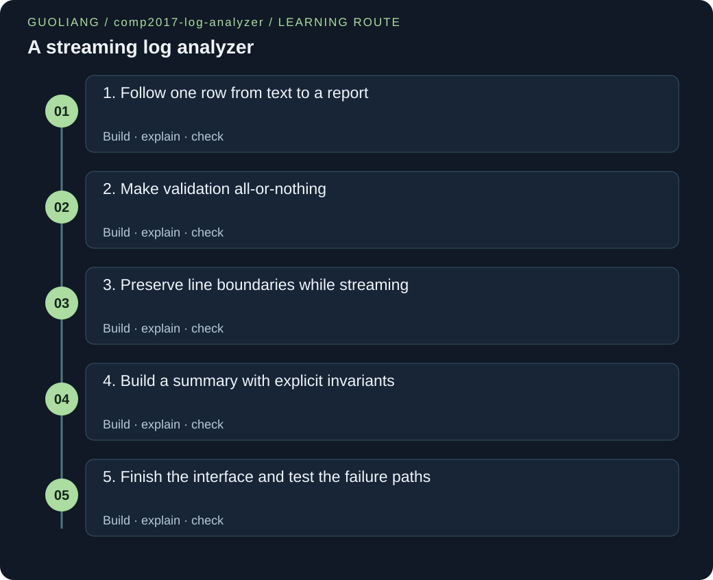

# COMP2017 — A streaming log analyzer

> Leon | Original engineering workshop



[English](comp2017-log-analyzer.en.md) · [中文](comp2017-log-analyzer.zh.md)

Turn a robot simulator trace into a trustworthy command-line report. Build a small C program that reads bounded lines, validates records, accumulates statistics, and explains failures.

[Download the complete project ZIP](../downloads/comp2017-log-analyzer.zip)

## The story

Leon is testing a classroom robot simulator. Each simulated action writes a severity and a duration, such as WARN 40. A slow action is easy to miss in a long trace, and a damaged row can make a careless average misleading. Leon starts with one good row, defines exactly what a record means, then adds a stream reader and a running summary. The finished tool reports how many INFO, WARN, and ERROR events occurred, their latency range and mean, and how many rows were rejected. All data is synthetic. This is an original engineering project and its own concept checks, not a supplied course exercise or solution.

### Before this project

- [Bits, C types and explicit control](../courses/comp2017.html#representation-control): Use comparisons, loops, unsigned values, and explicit return codes. A duration has a small valid range; a running sum needs a wider type.

- [Strings, bounded input and parsing](../courses/comp2017.html#strings-parsing): A C string ends at a NUL byte. Reserve space for that terminator, and accept a number only when the whole field is valid.

- [Structures, alignment, unions and tags](../courses/comp2017.html#structured-data): A record groups one severity and one duration. A statistics struct holds state that must stay consistent after each line.

- [File streams, binary records and errors](../courses/comp2017.html#file-streams): Read through FILE pointers, distinguish EOF from a stream error, and close only streams you opened.

- [Translation units, symbols and libraries](../courses/comp2017.html#compilation-linkage): Headers describe interfaces; separate C translation units implement them and the linker joins their object files.

### Outcomes

- Translate a plain-language input rule into a parser contract that either commits a complete record or leaves output untouched.

- Process a stream with constant application memory while preserving physical line boundaries after malformed input.

- Choose numeric types from proven bounds, calculate independent expected results, and test stdout, stderr, and exit status together.

## Requirements and contracts

### Accept exactly one input argument: a filename or - for stdin.

One clear interface makes the first CLI easy to use and test; there is no hidden interactive menu.

No argument or two arguments gives exit 2 and no stdout. A copied demo file and piped stdin both work.

### A row contains INFO, WARN, or ERROR plus one decimal integer from 0 through 60000. Only spaces and tabs separate fields.

A precise grammar prevents 12ms, -1, 1.5, or extra columns from silently becoming valid measurements.

Test both endpoints and one value above the maximum, plus unknown levels, signs, suffixes, and an extremely long integer.

### Limit each physical line to 127 bytes before LF, including any final CR. Reject an embedded NUL or an oversized line as one whole row.

The fixed buffer needs one extra byte for its terminator. Draining a bad line stops its remaining bytes from pretending to be another row.

A 127-byte row succeeds; a 128-byte row fails; a valid row immediately after it still counts once.

### Read at most 1,048,576 input bytes plus one lookahead byte. Exceeding the input budget is fatal.

This bounds byte-processing work and gives a simple proof that counters and duration totals cannot overflow.

Exactly 1 MiB of valid padded rows succeeds. One additional byte yields exit 1 and empty stdout.

### Keep valid rows when some rows are malformed, but return exit 3 and count every rejected row. Suppress the report on fatal input errors.

The person reading the report can judge missing data, while scripts can detect a non-clean run.

The mixed fixture reports 3 valid and 3 malformed rows; a nonexistent file returns 1 with no report.

### Report counts, valid-duration sum, minimum, maximum, and mean. With zero valid rows, print n/a for the last three metrics.

No observation is not the same as a zero-duration observation, and dividing by zero would be invalid.

Hand-check the demo sum 200 and mean 33.333; check all n/a values on the empty fixture.

## Architecture and ownership

**main.c: command and ownership**

Validate argc, open a file or borrow stdin, connect reader → parser → statistics, close an owned file, and choose the exit status. This is where policy lives.

**reader.c: bytes become complete lines**

Read a byte stream into the caller’s fixed buffer. Distinguish complete line, malformed framing, clean EOF, I/O failure, and input limit. Drain bad lines within the total byte budget.

**record.c: text becomes a value**

Read a complete C string without changing it. Validate level, separators, digits, numeric bound, and end of text. Commit the local candidate only after every check passes.

**stats.c: values become a report**

Maintain line/count/sum/extrema invariants without storing records. Format one final report and flush it so buffered output errors can be noticed.

argv → FILE stream → bounded physical line → validated record → running statistics → stdout. Bad records take a side path to malformed count and bounded stderr warnings. Fatal input errors stop before stdout. No application thread or heap-owned record is needed.

- FILE * returned by fopen → main opens the file and lends the pointer to analyze and read_line. → main calls fclose exactly once after analysis, including after an input failure.

- stdin and stdout → The C runtime provides these streams. This project borrows them. → Do not fclose borrowed stdin. stats_print flushes stdout; normal process shutdown performs runtime cleanup.

- 128-byte line buffer and parsed record → analyze owns local stack storage. read_line writes the buffer; parse_record copies values into the record. → The buffer is reused only after the current row is consumed. No function retains its pointer; local storage ends when its scope ends.

- Statistics structure → main owns a zero-initialized struct and lends it for updates and printing. → No free is needed: it has automatic storage duration and contains values, not allocated pointers.

<a id="milestone-one-row"></a>

## 1. Follow one row from text to a report

Get a tiny vertical slice working: one valid row enters stdin and produces one correct report. Learn the data shape before the error branches.

Start with a question small enough to answer by hand: what should INFO 12 produce? It describes one event, so valid and INFO must be 1; total, min, max, and mean must all describe 12 ms. This expectation connects an input rule to an observable result. Use the complete downloaded files as a working baseline while understanding one path at a time. A struct groups related values so you can pass one record without confusing its level with its duration.

1. In the project directory run make, then printf 'INFO 12\n' | ./log_analyzer -. Keep the terminal output next to your hand prediction. The dash is an argument; the shell pipe connects printf output to the program’s stdin.

2. Read the record.h extract. The enum gives readable names to three categories; LEVEL_COUNT sizes a three-element counter array later. unsigned stores a nonnegative duration, but the parser must still enforce the smaller 60000 limit.

3. Trace only the successful calls in main.c: read_line fills text, parse_record fills a local record, stats_accept updates totals, and stats_print creates the report. Circle where text becomes typed values. Do not copy extracts into a new standalone file; build all supplied source files together.

Teaching extract; run the complete project.

```c
enum log_level { LEVEL_INFO, LEVEL_WARN, LEVEL_ERROR, LEVEL_COUNT };

struct record {
    enum log_level level;
    unsigned duration_ms;
};
```

Extract from record.h. The record contains values rather than a pointer into the input line. A later read can overwrite that line without changing a record already passed to the statistics code. This is the first ownership decision, even though no malloc appears.

**If the input is ERROR 12 instead, should the process return an error?**

No. ERROR is a valid severity in this format. It changes the ERROR counter to 1, and the process still returns 0 because the input itself is valid.

<a id="milestone-validated-record"></a>

## 2. Make validation all-or-nothing

Extend the one-row path with a strict parser contract: only a whole valid row can create a record.

A conversion routine that reads the prefix 12 from 12ms would hide an input mistake. Our parser consumes a complete level token, requires a separator, reads at least one digit, and checks that only allowed trailing whitespace remains. It builds a local candidate and assigns *out once at the end. The caller therefore never receives half of a new record after failure. For each digit d, the next value would be 10v+d. Rewriting 10v+d <= 60000 as v <= (60000-d)/10 allows checking before multiplication.

1. Read the promise above parse_record in record.h, then its implementation. Mark input as borrowed and const; mark out as caller-owned writable storage. Neither pointer may be kept after the call.

2. Follow candidate through INFO 60000, digit by digit. Before the final zero, v is 6000 and the check permits it. For INFO 60001, the final digit makes the threshold 5999, so parsing stops before writing an out-of-range value.

3. Run make test and locate the numeric-grammar test. Predict rejection for +1, -1, 1.5, 12ms, 1 2, and 60001 before reading assertions. Test one malformed row after a good row and verify only the good duration enters the sum.

Teaching extract; run the complete project.

```c
    while (*p >= '0' && *p <= '9') {
        unsigned digit = (unsigned)(*p - '0');
        if (candidate.duration_ms > (MAX_DURATION_MS - digit) / 10U) {
            return false;
        }
        candidate.duration_ms = candidate.duration_ms * 10U + digit;
        ++p;
    }
    if (*skip_space(p) != '\0') {
        return false;
    }
    *out = candidate;
    return true;
```

Extract from record.c after the level and first-digit checks. The bound check happens before multiply-and-add. The final NUL check rejects suffixes and extra fields. *out = candidate is the commit point: all previous branches return without touching caller output.

**Why not assign out->level immediately after recognizing INFO?**

A later duration error would leave output partly changed. A local candidate makes the interface easier to reason about: success replaces the whole record; failure replaces nothing.

<a id="milestone-bounded-stream"></a>

## 3. Preserve line boundaries while streaming

Extend one-row input to a sequence without keeping the whole file in memory or mistaking a damaged tail for another row.

The reader handles bytes and line endings; the parser handles the meaning of a complete line. Keeping those jobs separate makes failures easier to locate. A 127-byte payload needs an array of 128 bytes because C strings also need a NUL terminator. Once a row is known to be bad, stopping immediately would leave its tail waiting in the stream. Keep reading until LF or EOF, but keep enforcing the total byte budget. EOF alone is not proof of success: ferror distinguishes a read failure.

1. Read the five line_status meanings in reader.h before the loop. main may parse only LINE_OK. LINE_BAD increments rejection once; LINE_END finishes; LINE_IO_ERROR and LINE_LIMIT abort without a report.

2. Trace used and bad in the extract for 127 bytes, then a 128th byte. used never exceeds 127. After bad becomes true, writing stops but reading continues. An embedded NUL follows the same rejection path, preventing hidden text after a fake string terminator.

3. Use the line-limit and binary-byte tests to check recovery. Then inspect the EOF branch for a last row without LF and the CR removal for CRLF. The 1 MiB test checks a different boundary: total input, not per-line capacity.

Teaching extract; run the complete project.

```c
        if (ch == '\n') {
            break;
        }
        if (ch == '\0' || used == MAX_LINE_BYTES) {
            bad = true;
        }
        if (!bad) {
            line[used++] = (char)ch;
        }
        /* Keep consuming a bad line so its tail is not a new record. */
```

Extract from reader.c, inside its byte loop. fgetc is stored in int elsewhere in the same loop, so EOF stays distinct from byte values. The buffer belongs to analyze; read_line borrows it. Do not read its contents after LINE_BAD, because no complete C string is promised on that path.

**Why must a long row count as one rejection even if it fills the buffer many times?**

The input contract counts physical lines, not buffer-sized chunks. Draining preserves that framing, so the next call starts at the following real line.

<a id="milestone-running-summary"></a>

## 4. Build a summary with explicit invariants

Turn many validated records into useful counts and latency aggregates using fixed-size state.

You do not need to remember every duration to compute a count, sum, minimum, or maximum. After each complete row, lines = valid + malformed. After each valid row, INFO + WARN + ERROR = valid. Only valid records affect latency metrics. Use the first valid duration to initialize both extrema; otherwise a zero-initialized minimum would stay zero for all-positive data. uint64_t holds counts and sums because their conservative bounds exceed small integer ranges, while a single 0–60000 duration fits unsigned.

1. Initialize totals with {0}, then read stats_accept and stats_reject. Trace the first two demo rows: after INFO 10 and WARN 40, count is 2, total is 50, min is 10 and max is 40. Confirm no rejected duration reaches this function.

2. Finish the six-row hand calculation before running the demo. The sum is 200 and 200/6 is 33.333… . In stats_print, cast before division and display three decimal places. Integer aggregation stays exact even though mean display is rounded.

3. Run the empty fixture. valid is zero, so no observed min or max exists and division is forbidden. Find the n/a branch, then run the positive-only mixed fixture to catch the minimum-initialization bug that the zero-containing demo alone would hide.

Teaching extract; run the complete project.

```c
void stats_accept(struct stats *s, const struct record *record)
{
    if (s->valid == 0 || record->duration_ms < s->min_ms) {
        s->min_ms = record->duration_ms;
    }
    if (s->valid == 0 || record->duration_ms > s->max_ms) {
        s->max_ms = record->duration_ms;
    }
    ++s->lines;
    ++s->valid;
    ++s->by_level[record->level];
    s->total_ms += record->duration_ms;
}
```

Extract from stats.c. Update extrema before increasing valid so valid == 0 means this is the first accepted row. record->level is safe as an index because the caller must pass a record produced by successful parsing. The header states that precondition; this is an internal interface, not an arbitrary-data API.

**Can you calculate an exact median from this state alone?**

No. Count, sum, min and max lose the ordering information needed for a median. That extension needs another representation, such as a bounded histogram, and a new memory/correctness argument.

<a id="milestone-cli-proof"></a>

## 5. Finish the interface and test the failure paths

Deliver a real CLI with a documented exit policy, clear cleanup, reproducible fixtures, and tests that can catch incorrect results.

A plausible report is not enough. The caller also needs to know whether every byte was inspected and whether any records were excluded. main owns the decision: 0 for clean completion, 3 for completed input with malformed rows, 2 for usage, and 1 for input/capacity or reported output failures. Close an owned file even when analyze fails. Delay stdout until input and close succeed; an output error may still leave a prefix. Tests compare real subprocess behavior with independent expected answers, and place temporary inputs in their own directories.

1. Read main from argument validation to return. Mark owns_input when fopen supplies the stream and false when stdin is borrowed. Follow the excerpt’s cleanup on success and failure; there is one fclose location and no free for stack-owned totals.

2. Run the mixed fixture and check echo $? immediately: it is 3 despite useful stdout. Run a missing filename and no argument: expect 1 and 2 with empty stdout. stderr is a separate diagnostic channel, so a script can keep the report apart from warnings.

3. Run make test. For each test, name the bug it would catch: wrong mean type, permissive prefix parsing, incomplete draining, lost exit code, or a byte-budget off-by-one. The tests use a five-second subprocess timeout and literal expected totals. They do not simulate every output/close failure or impose a runtime deadline on ordinary CLI use.

Teaching extract; run the complete project.

```c
    struct stats totals = {0};
    bool completed = analyze(input, &totals);
    if (owns_input && fclose(input) != 0) {
        fputs("error: cannot close input\n", stderr);
        completed = false;
    }
    if (!completed) {
        return EXIT_IO;
    }
    if (!stats_print(stdout, &totals)) {
        fputs("error: cannot write report\n", stderr);
        return EXIT_IO;
    }
    return totals.malformed == 0 ? EXIT_CLEAN : EXIT_DATA;
```

Extract from the end of main.c. completed records whether input processing really finished. fclose runs for owned input before this result is checked. stats_print checks buffered output with fflush; its failure also becomes exit 1. A malformed completed input is distinguished at the final return.

**Why test returncode and stderr if the expected stdout already matches?**

The report can be correct for accepted rows while silently hiding data loss. Exit 3 and line warnings tell a caller about rejected rows. Testing all three channels checks the tool’s full public contract.

## Build and run

Use Clang with C11 support, make and Python 3 on macOS or Linux. On Windows use a Linux environment such as WSL. The supplied Makefiles use Clang. Open a terminal in the download directory. Unzip the archive, then enter its folder. make builds the executable; make test checks its behavior.

```sh
unzip comp2017-log-analyzer.zip
cd comp2017-log-analyzer
make
make test
```

### Clean robot trace

```sh
./log_analyzer fixtures/demo.log
```

```text
lines=6
valid=6
malformed=0
INFO=3
WARN=2
ERROR=1
total_ms=200
min_ms=0
max_ms=100
mean_ms=33.333
```

Exit status: 0


After make, run this from the project directory. Exit 0; stderr is empty. Six accepted rows sum to 200 ms, so 200/6 displays as 33.333. ERROR=1 is an event count, not a failed process.

### Damaged rows with an honest report

```sh
./log_analyzer fixtures/mixed.log
```

```text
lines=6
valid=3
malformed=3
INFO=1
WARN=1
ERROR=1
total_ms=30
min_ms=5
max_ms=15
mean_ms=10.000
```

Exit status: 3


Exit 3. stdout summarizes only the three valid rows. stderr contains warning: line 2: malformed record, warning: line 4: malformed record, and warning: line 5: malformed record, each on its own line. DEBUG, -1, and 60001 are rejected. Run echo $? immediately afterward to inspect the exit status.

### No observations yet

```sh
./log_analyzer fixtures/empty.log
```

```text
lines=0
valid=0
malformed=0
INFO=0
WARN=0
ERROR=0
total_ms=0
min_ms=n/a
max_ms=n/a
mean_ms=n/a
```

Exit status: 0


Exit 0; stderr is empty. The zero-byte fixture contains no physical lines. n/a explicitly avoids inventing an observed minimum, maximum, or average when the valid count is zero.

## Debugging

### An all-positive input has minimum 0.

Zero initialization was mistaken for a real observation.

Run two rows with durations 5 and 15. Inspect s->valid just before the first stats_accept update.

When valid is zero, set both extrema from the first real record before incrementing valid. Keep the positive-only mixed fixture test.

### Durations 1, 2, 2 produce mean 1.000.

Integer division discarded the fraction before conversion to double.

Write down 5/3 = 1.666… and inspect the operand types in stats_print, not just the destination type.

Convert before division: (double)total_ms / (double)valid. The fractional-mean test expects 1.667.

### One long row causes several rejections or loses the next good row.

The reader returned when its buffer filled, leaving part of the same physical line unread.

Place a 128-byte row before WARN 7. The final report must have two physical lines and exactly one malformed row.

After marking a row bad, keep consuming through LF or EOF, still enforcing the whole-input budget. Never parse a LINE_BAD buffer.

### INFO 12ms or INFO 1 2 is accepted.

The parser validated only a numeric prefix and ignored the remaining text.

After the digit loop, inspect the character after skipped trailing spaces. It must be the terminating NUL.

Reject any remaining non-whitespace text and assign *out only at the end. Test suffixes and extra fields as distinct failures.

### A read failure looks like a successful shorter report.

EOF was treated as proof of a clean end without inspecting ferror.

Use the directory-input test on macOS/Linux; open may fail immediately or reading the opened directory may fail. In either case stdout must be empty.

Check ferror when fgetc returns EOF. Propagate LINE_IO_ERROR through analyze so main returns 1 without stats_print.

## Test plan

### Six hand-calculable valid rows

Exit 0; 3 INFO, 2 WARN, 1 ERROR; sum 200; range 0–100; mean 33.333.

Catches wrong severity indexing, missing updates, and wrong aggregates using values computed independently of the program.

### Mixed valid and malformed rows

Exit 3; 3 valid and 3 malformed; total 30; warnings identify lines 2, 4, 5.

Checks that rejection changes only rejection counters and that later good records still work.

### Empty input and twenty blank lines

Empty input: exit 0, zero counts, n/a latencies. Blank rows: exit 3, twenty rejections, five detailed warnings and one omission message.

Separates absence of data from bad data and prevents unbounded diagnostic output.

### Integer and level validation

Accept 0, 60000 and leading zeroes; reject 60001, signs, fractions, suffixes, huge integers, extra fields, and nonmatching levels.

Exercises both edges of the contract and stops permissive partial conversion.

### Framing and binary bytes

Accept CRLF, tabs and a final row without LF. Reject NUL and 0xff rows without losing the following ERROR 9.

Checks string termination, the distinction between bytes and EOF, and continued processing after damage.

### 127-byte row, 128-byte row, then a good row

Exactly 3 lines, 2 accepted and 1 rejected; total duration 8.

Finds off-by-one buffer errors and verifies drain-to-newline behavior.

### One MiB and one extra byte

8192 padded valid rows succeed at exactly 1,048,576 bytes. Adding one byte returns 1 with no report.

The accepted side and rejected side jointly verify the whole-input work bound.

### CLI and real filesystem failures

Wrong argument count gives 2; missing file or directory input gives 1; every case has empty stdout.

Exercises actual subprocesses and filesystem behavior, without mocking successful output.

### Fractional mean from 1, 2, 2

Exit 0 and mean_ms=1.667.

Detects truncating integer division that whole-number averages would miss.

## Engineering decisions

### A fixed line buffer with a total byte budget

A growing getline buffer is convenient, but a fixed 128-byte array makes memory and termination visible in a first project. We reject larger rows and drain them. Time is O(B) for bytes consumed, application state is O(1), and at most one byte beyond 1 MiB is inspected. Standard I/O owns additional internal buffers. A byte budget is not a time deadline: stdin can block waiting for its producer, so start with completed regular files.

### Integer safety comes from a bound, not optimism

A duration is unsigned and at most 60000. The parser checks before multiplying. Counts and sums use uint64_t; even the conservative bound 1,048,576 × 60,000 = 62,914,560,000 fits. A static assertion protects this bound when constants change. The mean uses floating division only after integer aggregation; display rounding to three decimals does not change the exact integer sum.

### Useful partial data needs an honest status

Malformed rows do not destroy valid observations. Exit 3 communicates that the completed report excludes some rows. Fatal input failures instead suppress stdout because the input was not fully inspected. Warnings are capped at five detailed lines plus one omission message. This makes the tool useful in a terminal and predictable in scripts. A valid ERROR event alone never makes the process fail.

### Small modules follow separate reasons to change

Changing whitespace rules belongs in record.c; changing line capacity belongs in reader.c; adding an aggregate belongs in stats.c; changing CLI policy belongs in main.c. Headers document borrowed pointers and preconditions. The parser promises not to retain text pointers, so no record depends on the reused buffer. The source remains four implementation files rather than one file for every helper.

### Know the limits of the finished program

The format is synthetic: no timestamps, arbitrary messages, live tailing, or percentiles. Returned read/write/close errors are checked, but a write error can leave part of stdout and a broken pipe can trigger the normal POSIX SIGPIPE signal. stderr failures are not retried. The tests cover deterministic contract behavior, not every device or filesystem failure. No timing or scheduler outcome is used as a correct answer.

## Complete source files

### record.h

Record interface

[Download file](../project-code/comp2017-log-analyzer/record.h)

```c
/* Leon | Original teaching project. */
#ifndef RECORD_H
#define RECORD_H

#include <stdbool.h>

#define MAX_DURATION_MS 60000U

enum log_level { LEVEL_INFO, LEVEL_WARN, LEVEL_ERROR, LEVEL_COUNT };

struct record {
    enum log_level level;
    unsigned duration_ms;
};

/* line: readable NUL-terminated text; out: writable caller-owned record.
 * Return true and assign *out only for a complete valid record.
 * Neither pointer is retained; a failed parse leaves *out unchanged. */
bool parse_record(const char *line, struct record *out);

#endif
```

1. Read the enum and struct together: severity is a category, duration is a bounded nonnegative value.

2. The parser receives borrowed text and a caller-owned output address; success is reported as bool.

3. The failure promise is explicit: *out stays unchanged. Check the implementation against that promise.

### record.c

Strict complete-row parsing

[Download file](../project-code/comp2017-log-analyzer/record.c)

```c
/* Leon | Original teaching project. */
#include "record.h"

#include <stddef.h>
#include <string.h>

static bool is_space(char ch)
{
    return ch == ' ' || ch == '\t';
}

static const char *skip_space(const char *p)
{
    while (is_space(*p)) {
        ++p;
    }
    return p;
}

bool parse_record(const char *line, struct record *out)
{
    struct record candidate = {LEVEL_INFO, 0U};
    const char *start = skip_space(line);
    const char *p = start;

    while (*p != '\0' && !is_space(*p)) {
        ++p;
    }
    size_t length = (size_t)(p - start);
    if (length == 4 && memcmp(start, "INFO", 4) == 0) {
        candidate.level = LEVEL_INFO;
    } else if (length == 4 && memcmp(start, "WARN", 4) == 0) {
        candidate.level = LEVEL_WARN;
    } else if (length == 5 && memcmp(start, "ERROR", 5) == 0) {
        candidate.level = LEVEL_ERROR;
    } else {
        return false;
    }
    if (!is_space(*p)) {
        return false;
    }
    p = skip_space(p);
    if (*p < '0' || *p > '9') {
        return false;
    }
    while (*p >= '0' && *p <= '9') {
        unsigned digit = (unsigned)(*p - '0');
        if (candidate.duration_ms > (MAX_DURATION_MS - digit) / 10U) {
            return false;
        }
        candidate.duration_ms = candidate.duration_ms * 10U + digit;
        ++p;
    }
    if (*skip_space(p) != '\0') {
        return false;
    }
    *out = candidate;
    return true;
}
```

1. The two static whitespace helpers accept only space and tab, keeping the grammar independent of locale.

2. Token length and memcmp verify a whole severity word before numeric parsing starts.

3. The digit loop checks range before arithmetic; the final end-of-string test and assignment implement all-or-nothing output.

### reader.h

Line and byte-budget interface

[Download file](../project-code/comp2017-log-analyzer/reader.h)

```c
/* Leon | Original teaching project. */
#ifndef READER_H
#define READER_H

#include <stddef.h>
#include <stdio.h>

#define MAX_LINE_BYTES 127U
#define MAX_INPUT_BYTES 1048576U

enum line_status { LINE_OK, LINE_BAD, LINE_END, LINE_IO_ERROR, LINE_LIMIT };

struct line_reader {
    FILE *stream;       /* Borrowed: only the caller closes this stream. */
    size_t bytes_read;  /* Start at zero; includes newline and CR bytes. */
};

/* Caller supplies MAX_LINE_BYTES + 1 writable bytes.
 * LINE_OK: complete NUL-terminated line, without LF or a final CR.
 * LINE_BAD: oversized or NUL-containing line was consumed through LF/EOF.
 * LINE_END: clean EOF with no pending line. Other results are fatal.
 * LINE_LIMIT may consume one byte beyond the budget to distinguish EOF.
 * Do not parse the buffer unless the result is LINE_OK. */
enum line_status read_line(struct line_reader *reader,
                           char line[MAX_LINE_BYTES + 1U]);

#endif
```

1. MAX_LINE_BYTES excludes LF but includes CR; add one byte when allocating a C string buffer.

2. A line_reader holds a borrowed stream and a cumulative byte count. Initialize that count once per input.

3. Each enum result has a different caller action; only LINE_OK promises parseable buffer contents.

### reader.c

Physical-line framing

[Download file](../project-code/comp2017-log-analyzer/reader.c)

```c
/* Leon | Original teaching project. */
#include "reader.h"

#include <stdbool.h>

enum line_status read_line(struct line_reader *reader,
                           char line[MAX_LINE_BYTES + 1U])
{
    size_t used = 0;
    bool seen_byte = false;
    bool bad = false;

    for (;;) {
        int ch = fgetc(reader->stream);
        if (ch == EOF) {
            if (ferror(reader->stream)) {
                return LINE_IO_ERROR;
            }
            if (!seen_byte) {
                return LINE_END;
            }
            break;
        }
        if (reader->bytes_read == MAX_INPUT_BYTES) {
            return LINE_LIMIT;
        }
        ++reader->bytes_read;
        seen_byte = true;
        if (ch == '\n') {
            break;
        }
        if (ch == '\0' || used == MAX_LINE_BYTES) {
            bad = true;
        }
        if (!bad) {
            line[used++] = (char)ch;
        }
        /* Keep consuming a bad line so its tail is not a new record. */
    }
    if (bad) {
        return LINE_BAD;
    }
    if (used > 0 && line[used - 1] == '\r') {
        --used;
    }
    line[used] = '\0';
    return LINE_OK;
}
```

1. fgetc returns int. On EOF check ferror before deciding whether an unfinished last line exists.

2. Every consumed byte contributes to the input budget, including newline and discarded bytes.

3. bad freezes buffer writes but not reading. A successful line is CR-normalized and NUL-terminated before return.

### stats.h

State and statistics interface

[Download file](../project-code/comp2017-log-analyzer/stats.h)

```c
/* Leon | Original teaching project. */
#ifndef STATS_H
#define STATS_H

#include "record.h"

#include <stdbool.h>
#include <stdint.h>
#include <stdio.h>

struct stats {
    uint64_t lines;
    uint64_t valid;
    uint64_t malformed;
    uint64_t by_level[LEVEL_COUNT];
    uint64_t total_ms;
    unsigned min_ms;
    unsigned max_ms;
};

/* Start with struct stats s = {0}. Add at most MAX_INPUT_BYTES records.
 * record must come from a successful parse_record call.
 * All pointers are borrowed for the duration of each call. */
void stats_accept(struct stats *s, const struct record *record);
void stats_reject(struct stats *s);

/* Write the final summary; false means a write/flush error.
 * A failed output may already contain a prefix. Do not close output here. */
bool stats_print(FILE *output, const struct stats *s);

#endif
```

1. Separate valid from malformed so the report cannot confuse total lines with accepted observations.

2. Use uint64_t for repeated counts and sums; extrema have the same type as one duration.

3. Read the preconditions: zero-initialized state, validated records, and no more than the input budget of updates.

### stats.c

Updates and report formatting

[Download file](../project-code/comp2017-log-analyzer/stats.c)

```c
/* Leon | Original teaching project. */
#include "stats.h"
#include "reader.h"

#include <inttypes.h>

_Static_assert((uint64_t)MAX_INPUT_BYTES <= UINT64_MAX / MAX_DURATION_MS,
               "The byte budget must keep duration totals representable");

void stats_accept(struct stats *s, const struct record *record)
{
    if (s->valid == 0 || record->duration_ms < s->min_ms) {
        s->min_ms = record->duration_ms;
    }
    if (s->valid == 0 || record->duration_ms > s->max_ms) {
        s->max_ms = record->duration_ms;
    }
    ++s->lines;
    ++s->valid;
    ++s->by_level[record->level];
    s->total_ms += record->duration_ms;
}

void stats_reject(struct stats *s)
{
    ++s->lines;
    ++s->malformed;
}

bool stats_print(FILE *output, const struct stats *s)
{
    if (fprintf(output,
                "lines=%" PRIu64 "\nvalid=%" PRIu64 "\nmalformed=%" PRIu64 "\n"
                "INFO=%" PRIu64 "\nWARN=%" PRIu64 "\nERROR=%" PRIu64 "\n"
                "total_ms=%" PRIu64 "\n",
                s->lines, s->valid, s->malformed,
                s->by_level[LEVEL_INFO], s->by_level[LEVEL_WARN],
                s->by_level[LEVEL_ERROR], s->total_ms) < 0) {
        return false;
    }
    if (s->valid == 0) {
        if (fputs("min_ms=n/a\nmax_ms=n/a\nmean_ms=n/a\n", output) == EOF) {
            return false;
        }
    } else {
        double mean = (double)s->total_ms / (double)s->valid;
        if (fprintf(output, "min_ms=%u\nmax_ms=%u\nmean_ms=%.3f\n",
                    s->min_ms, s->max_ms, mean) < 0) {
            return false;
        }
    }
    return fflush(output) == 0;
}
```

1. The static assertion connects the input cap to representable duration sums at compile time.

2. stats_accept handles first-record extrema then updates the related counters and sum together.

3. stats_print uses PRIu64 for portable uint64_t formatting, avoids empty-data division, and flushes output before reporting success.

### main.c

CLI, orchestration, and cleanup

[Download file](../project-code/comp2017-log-analyzer/main.c)

```c
/* Leon | Original teaching project. */
#include "reader.h"
#include "record.h"
#include "stats.h"

#include <inttypes.h>
#include <stdio.h>
#include <string.h>

enum exit_status { EXIT_CLEAN = 0, EXIT_IO = 1, EXIT_USAGE = 2, EXIT_DATA = 3 };
#define WARNING_LIMIT 5U

static void warn_bad_line(const struct stats *s)
{
    if (s->malformed <= WARNING_LIMIT) {
        fprintf(stderr, "warning: line %" PRIu64 ": malformed record\n", s->lines);
    } else if (s->malformed == WARNING_LIMIT + 1U) {
        fputs("warning: further malformed lines omitted\n", stderr);
    }
}

/* Borrow input and caller-owned statistics. Report only complete input. */
static bool analyze(FILE *input, struct stats *s)
{
    struct line_reader reader = {input, 0};
    char line[MAX_LINE_BYTES + 1U];

    for (;;) {
        enum line_status status = read_line(&reader, line);
        if (status == LINE_END) {
            return true;
        }
        if (status == LINE_IO_ERROR) {
            fputs("error: cannot read input\n", stderr);
            return false;
        }
        if (status == LINE_LIMIT) {
            fprintf(stderr, "error: input exceeds %u bytes\n", MAX_INPUT_BYTES);
            return false;
        }
        struct record record;
        if (status == LINE_BAD || !parse_record(line, &record)) {
            stats_reject(s);
            warn_bad_line(s);
        } else {
            stats_accept(s, &record);
        }
    }
}

int main(int argc, char **argv)
{
    if (argc != 2) {
        fputs("usage: log_analyzer FILE|-\n", stderr);
        return EXIT_USAGE;
    }
    bool owns_input = strcmp(argv[1], "-") != 0;
    FILE *input = owns_input ? fopen(argv[1], "rb") : stdin;
    if (input == NULL) {
        fprintf(stderr, "error: cannot open input: %s\n", argv[1]);
        return EXIT_IO;
    }

    struct stats totals = {0};
    bool completed = analyze(input, &totals);
    if (owns_input && fclose(input) != 0) {
        fputs("error: cannot close input\n", stderr);
        completed = false;
    }
    if (!completed) {
        return EXIT_IO;
    }
    if (!stats_print(stdout, &totals)) {
        fputs("error: cannot write report\n", stderr);
        return EXIT_IO;
    }
    return totals.malformed == 0 ? EXIT_CLEAN : EXIT_DATA;
}
```

1. main validates argument count and distinguishes owned file input from borrowed stdin.

2. analyze maps each reader result to parsing, rejection, clean completion, or fatal failure. Short-circuit || prevents parsing a LINE_BAD buffer.

3. Warning output is bounded separately from counting. Cleanup happens before printing, and the final return communicates data quality.

### Makefile

Reproducible multi-file build

[Download file](../project-code/comp2017-log-analyzer/Makefile)

```make
# Leon | Original teaching project.
CC = clang
CFLAGS = -std=c11 -Wall -Wextra -Werror -pedantic -pthread
OBJECTS = main.o reader.o record.o stats.o

.PHONY: all test clean
all: log_analyzer

log_analyzer: $(OBJECTS)
	$(CC) $(CFLAGS) $(LDFLAGS) -o $@ $(OBJECTS) $(LDLIBS)

main.o: main.c reader.h record.h stats.h
reader.o: reader.c reader.h
record.o: record.c record.h
stats.o: stats.c stats.h record.h reader.h

%.o: %.c
	$(CC) $(CPPFLAGS) $(CFLAGS) -c $< -o $@

test: log_analyzer
	python3 test.py

clean:
	rm -f log_analyzer $(OBJECTS)
```

1. all names the executable. Four object files correspond to four C implementation files.

2. Header prerequisites make dependents rebuild when an interface changes. The pattern rule compiles; the executable rule links.

3. test first builds and then runs python3 test.py. clean removes only the named binary and objects in this project.

### fixtures/demo.log

Valid synthetic robot records

[Download file](../project-code/comp2017-log-analyzer/fixtures/demo.log)

```text
INFO 10
WARN 40
INFO 20
ERROR 100
INFO 0
WARN 30
```

1. All six rows match the grammar, including a legitimate zero duration and an ERROR event.

2. Compute 10 + 40 + 20 + 100 + 0 + 30 = 200 before running the program.

3. Use this small fixture to compare terminal output with the literal expected report in test.py.

### fixtures/mixed.log

Valid data around three bad rows

[Download file](../project-code/comp2017-log-analyzer/fixtures/mixed.log)

```text
INFO 5
DEBUG 8
WARN 10
ERROR -1
INFO 60001
ERROR 15
```

1. Rows 2, 4, and 5 respectively violate level, sign, and maximum-duration rules.

2. The remaining durations 5, 10, 15 sum to 30; all are positive, so they check first-record minimum initialization.

3. Expect exit 3 alongside a complete report and warnings, demonstrating that report availability and clean success differ.

### fixtures/empty.log

A truly empty stream

[Download file](../project-code/comp2017-log-analyzer/fixtures/empty.log)

Invisible-byte view (hexadecimal): empty file; zero bytes

1. This file has zero bytes. It contains neither a header nor a newline.

2. Its role is to test successful completion with zero observations, not malformed input.

3. Compare with the test that sends blank lines: those do create physical lines and rejection counts.

### test.py

Executable behavior tests

[Download file](../project-code/comp2017-log-analyzer/test.py)

```python
# Leon | Original teaching project.
"""Behavior tests: run `make test`; every generated input stays in a temp dir."""
from pathlib import Path
import shutil
import subprocess
import tempfile
import unittest

ROOT = Path(__file__).resolve().parent
PROGRAM = ROOT / "log_analyzer"


class AnalyzerTests(unittest.TestCase):
    def setUp(self):
        self.temp = tempfile.TemporaryDirectory(prefix="log-analyzer-test-")
        self.addCleanup(self.temp.cleanup)
        self.work = Path(self.temp.name)

    def run_log(self, data=b"", args=None):
        if args is None:
            args = ["-"]
        self.assertTrue(PROGRAM.is_file(), "Build log_analyzer with make first")
        return subprocess.run(
            [str(PROGRAM), *args], input=data, capture_output=True,
            cwd=self.work, timeout=5, check=False,
        )

    def fields(self, result):
        lines = result.stdout.decode("ascii").splitlines()
        self.assertEqual(len(lines), 10, result.stdout)
        return dict(line.split("=", 1) for line in lines)

    def test_demo_has_hand_calculated_totals(self):
        shutil.copyfile(ROOT / "fixtures/demo.log", self.work / "demo.log")
        result = self.run_log(args=["demo.log"])
        self.assertEqual(result.returncode, 0, result.stderr)
        self.assertEqual(result.stderr, b"")
        self.assertEqual(result.stdout, (
            b"lines=6\nvalid=6\nmalformed=0\nINFO=3\nWARN=2\nERROR=1\n"
            b"total_ms=200\nmin_ms=0\nmax_ms=100\nmean_ms=33.333\n"
        ))

    def test_mixed_file_keeps_good_rows_and_reports_exit_3(self):
        shutil.copyfile(ROOT / "fixtures/mixed.log", self.work / "mixed.log")
        result = self.run_log(args=["mixed.log"])
        self.assertEqual(result.returncode, 3)
        self.assertEqual(result.stdout, (
            b"lines=6\nvalid=3\nmalformed=3\nINFO=1\nWARN=1\nERROR=1\n"
            b"total_ms=30\nmin_ms=5\nmax_ms=15\nmean_ms=10.000\n"
        ))
        for number in (2, 4, 5):
            self.assertIn(f"line {number}: malformed record".encode(), result.stderr)

    def test_empty_has_no_invented_latency(self):
        result = self.run_log()
        self.assertEqual(result.returncode, 0)
        self.assertEqual(result.stdout, (
            b"lines=0\nvalid=0\nmalformed=0\nINFO=0\nWARN=0\nERROR=0\n"
            b"total_ms=0\nmin_ms=n/a\nmax_ms=n/a\nmean_ms=n/a\n"
        ))

    def test_duration_boundaries(self):
        result = self.run_log(b"INFO 0\nERROR 60000\n")
        self.assertEqual(result.returncode, 0)
        fields = self.fields(result)
        self.assertEqual(fields["total_ms"], "60000")
        self.assertEqual(fields["min_ms"], "0")
        self.assertEqual(fields["max_ms"], "60000")
        self.assertEqual(fields["mean_ms"], "30000.000")

    def test_integer_grammar_rejects_signs_suffixes_and_overflow(self):
        bad = [b"", b"+1", b"-1", b"1.5", b"1ms", b"1 2", b"60001",
               b"999999999999999999999999", b"0x10", b"1e2"]
        for token in bad:
            with self.subTest(token=token):
                result = self.run_log(b"INFO " + token + b"\n")
                self.assertEqual(result.returncode, 3)
                fields = self.fields(result)
                self.assertEqual(fields["valid"], "0")
                self.assertEqual(fields["malformed"], "1")
                self.assertEqual(fields["mean_ms"], "n/a")

    def test_level_must_match_whole_uppercase_word(self):
        for level in (b"info", b"DEBUG", b"INF", b"INFOx", b"WARN3"):
            with self.subTest(level=level):
                result = self.run_log(level + b" 2\n")
                self.assertEqual(result.returncode, 3)
                self.assertEqual(self.fields(result)["valid"], "0")

    def test_crlf_tabs_leading_zero_and_unterminated_last_line(self):
        result = self.run_log(b" \tINFO\t0007 \r\nWARN 3")
        self.assertEqual(result.returncode, 0)
        fields = self.fields(result)
        self.assertEqual(fields["lines"], "2")
        self.assertEqual(fields["total_ms"], "10")
        self.assertEqual(fields["mean_ms"], "5.000")

    def test_line_limit_is_exact_and_drains_one_bad_record(self):
        exact = b"INFO " + b"0" * 121 + b"1"
        too_long = b"INFO 2" + b" " * 122
        self.assertEqual(len(exact), 127)
        self.assertEqual(len(too_long), 128)
        result = self.run_log(exact + b"\n" + too_long + b"\nWARN 7\n")
        self.assertEqual(result.returncode, 3)
        fields = self.fields(result)
        self.assertEqual(fields["lines"], "3")
        self.assertEqual(fields["malformed"], "1")
        self.assertEqual(fields["valid"], "2")
        self.assertEqual(fields["total_ms"], "8")

    def test_binary_bytes_do_not_hide_suffix_or_imitate_eof(self):
        result = self.run_log(b"INFO 2\x00hidden\n\xff\nERROR 9\n")
        self.assertEqual(result.returncode, 3)
        fields = self.fields(result)
        self.assertEqual(fields["lines"], "3")
        self.assertEqual(fields["malformed"], "2")
        self.assertEqual(fields["total_ms"], "9")

    def test_blank_lines_count_and_diagnostics_are_capped(self):
        result = self.run_log(b"\n" * 20)
        self.assertEqual(result.returncode, 3)
        self.assertEqual(self.fields(result)["malformed"], "20")
        self.assertEqual(result.stderr.count(b"malformed record"), 5)
        self.assertEqual(result.stderr.count(b"further malformed lines omitted"), 1)

    def test_mean_uses_fractional_division(self):
        result = self.run_log(b"INFO 1\nINFO 2\nINFO 2\n")
        self.assertEqual(result.returncode, 0)
        self.assertEqual(self.fields(result)["mean_ms"], "1.667")

    def test_byte_budget_accepts_exactly_one_mebibyte(self):
        row = b"INFO 0" + b" " * 121 + b"\n"
        result = self.run_log(row * 8192)
        self.assertEqual(result.returncode, 0, result.stderr)
        self.assertEqual(self.fields(result)["valid"], "8192")
        self.assertEqual(self.fields(result)["total_ms"], "0")

    def test_byte_budget_failure_has_no_partial_report(self):
        row = b"INFO 0" + b" " * 121 + b"\n"
        result = self.run_log(row * 8192 + b"x")
        self.assertEqual(result.returncode, 1)
        self.assertEqual(result.stdout, b"")
        self.assertIn(b"input exceeds 1048576 bytes", result.stderr)

    def test_argument_count_is_a_usage_error(self):
        for args in ([], ["one", "two"]):
            with self.subTest(args=args):
                result = self.run_log(args=args)
                self.assertEqual(result.returncode, 2)
                self.assertEqual(result.stdout, b"")
                self.assertIn(b"usage:", result.stderr)

    def test_missing_file_is_an_io_error(self):
        result = self.run_log(args=["missing.log"])
        self.assertEqual(result.returncode, 1)
        self.assertEqual(result.stdout, b"")
        self.assertIn(b"cannot open", result.stderr)

    def test_directory_is_not_a_successful_input(self):
        result = self.run_log(args=[str(self.work)])
        self.assertEqual(result.returncode, 1)
        self.assertEqual(result.stdout, b"")
        self.assertTrue(b"cannot open" in result.stderr or
                        b"cannot read" in result.stderr)


if __name__ == "__main__":
    unittest.main(verbosity=2)
```

1. setUp creates a fresh temporary directory; addCleanup removes it. run_log calls the real executable without a shell and with a timeout.

2. Fixtures have literal, independently calculated expected output. Other tests assert one targeted failure mode or boundary.

3. Both sides of limits are exercised. Missing-file and directory cases use real temporary paths; output and close failures are not exhaustively simulated.

### README.md

Complete English run guide

[Download file](../project-code/comp2017-log-analyzer/README.md)

1. Start with build/run/test commands and the exit-status table.

2. Use the five milestones and file order as your map through the source.

3. Reproduce the three captured examples, then read the tradeoffs and extension acceptance criteria.

### README.zh.md

Complete Chinese run guide

[Download file](../project-code/comp2017-log-analyzer/README.zh.md)

1. The Chinese guide carries the same commands and input contract as the English guide.

2. Use its type, ownership, and debugging explanations alongside the English source identifiers.

3. Output keys remain stable English strings in both languages, so the executable and tests do not change with the guide language.

## Extensions

### Add latency summaries for each severity

First add hand-calculated tests. Store a count and sum per level, update them only after successful parsing, then print each mean with the same empty-level policy.

The demo yields INFO mean 10.000, WARN mean 35.000, ERROR mean 100.000. A missing level prints n/a, malformed rows never contribute, and old global metrics remain unchanged.

### Add an explicit strict mode

Extend the argument contract with --strict. Decide the policy before coding: stop on the first malformed row, close any owned stream, and omit stdout. Keep the current default behavior.

The mixed fixture in strict mode returns 3, warns only about line 2, and prints no report. Without the flag its existing output is unchanged; clean and empty inputs still return 0.

## Primary references

- [WG14 N1570 — C11 committee draft: integer types and standard I/O](https://www.open-std.org/jtc1/sc22/wg14/www/docs/n1570.pdf)

- [Clang Compiler User’s Manual](https://clang.llvm.org/docs/UsersManual.html)

- [Python documentation — subprocess management](https://docs.python.org/3/library/subprocess.html)

---
Leon
