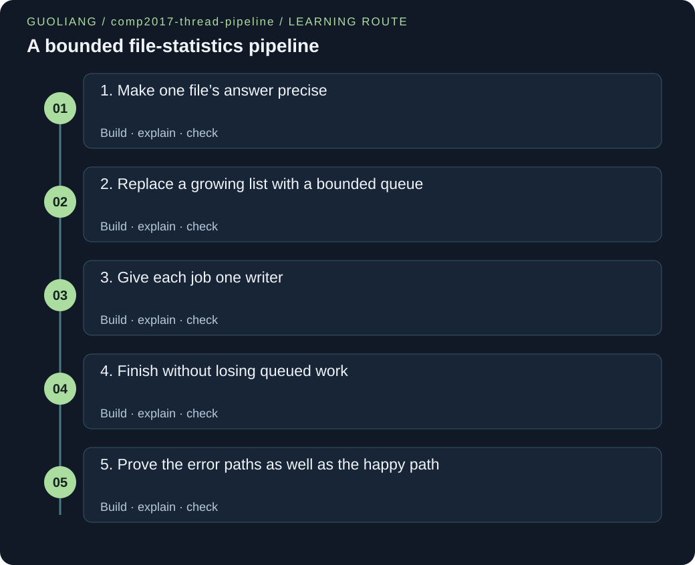

# COMP2017 — A bounded file-statistics pipeline

> Guoliang | Original engineering workshop



[English](comp2017-thread-pipeline.en.md) · [中文](comp2017-thread-pipeline.zh.md)

Build a usable pthread worker pool that counts real file bytes, lines, and words. A four-slot queue coordinates the work; one owned result slot per input keeps the final report deterministic.

[Download the complete project ZIP](../downloads/comp2017-thread-pipeline.zip)

## The story

Mina volunteers at a school robotics club. At the end of a workshop she receives several small note files and wants a reliable inventory: how many bytes, logical lines, and words are in each? Some notes are empty, one has no final newline, and a copied filename may be wrong. She needs a useful report even when one file cannot be opened.

She begins with one precise scanner and checks it against tiny synthetic notes. Next she numbers the file arguments and feeds their indices through a queue with four positions. When every position is occupied, her producer waits for space. Several workers can take different jobs, but each worker opens its own file and writes only that job’s result. This makes the ownership rule visible before concurrency becomes complicated.

The last job being submitted is not the same as the last job being finished. Mina closes the queue to announce that no more jobs will arrive, lets consumers drain the remaining jobs, and joins all workers. Only then does she print the result slots in original input order. A missing file becomes a clearly marked failed slot, not a misleading row of zeros.

Finally, she tests short and long inputs, repeated schedules, and carefully injected failures. The project demonstrates a correct coordination pattern; these small examples make no claim that more threads are faster. All code, fixtures, and explanations are original Guoliang teaching material, independent of supplied assignments.

### Before this project

- [File streams, binary records and errors](../courses/comp2017.html#file-streams): Distinguish a successful short read, end of file, and a read error before counting bytes.

- [Dynamic allocation and object lifetime](../courses/comp2017.html#allocation-ownership): Keep main’s stack objects and borrowed argv paths alive until every worker has joined.

- [Thread creation, joining and cancellation](../courses/comp2017.html#thread-lifecycle): Create a bounded set of joinable threads and join only the handles that were successfully created.

- [Data races, mutexes and atomicity](../courses/comp2017.html#data-races-mutexes): Use a mutex for shared queue state and exclusive ownership for per-job results.

- [Condition variables and producer–consumer waiting](../courses/comp2017.html#condition-variables): Wait on a state predicate in a while loop and recheck it after waking.

- [Parallel patterns: partition, join and combine](../courses/comp2017.html#parallel-patterns): Separate a producer, a fixed consumer pool, and an ordered reporting phase.

### Outcomes

- Define and implement byte, logical-line, and ASCII-separated word counts across read-buffer boundaries.

- Explain the ring-buffer invariant, backpressure, predicate waits, and close-and-drain behavior.

- Prove why a unique result writer plus successful joins avoids a result data race.

- Test ordinary runs and startup/I/O failures with bounded fixtures, independent expected results, and timeouts.

## Requirements and contracts

### Accept WORKERS followed by zero to 128 file paths; bound WORKERS to 1..16.

A finite pool and bounded job list make resource use understandable. Zero jobs is a normal lifecycle case.

Try 1, 16, 0, 17, 2x, no worker argument, and 129 file arguments. Invalid CLI input exits 2 with no report.

### Queue capacity is exactly four indices; use one mutex, not_empty, and not_full.

The producer must wait when full instead of growing storage. Consumers must sleep when no work can yet be taken.

Inspect both predicate while loops and test fewer jobs, more jobs, and 37 jobs across repeated runs.

### Each published index is taken once and has exactly one result writer; print only after joining every worker.

Concurrent completion may change order. Separate result slots and a later reporting phase preserve the input order.

Compare complete stdout for 1, 2, 4, and 16 workers against an independent sequential oracle.

### Count LF bytes plus a final unterminated logical line; split words only at the six ASCII whitespace bytes.

Empty files, final newlines, and buffer boundaries need definitions before they need code.

Empty gives 0/0/0. The evening fixture gives 26 bytes, 2 lines, and 5 words despite having only one LF.

### Accept only ordinary regular files with at most 8 MiB scanned per job; report file failures without discarding other jobs.

A teaching run should have explicit storage and work bounds. Partial counts are not a complete result.

Test the exact byte limit, one byte above it, missing paths, directories, and a FIFO without a writer.

### Close and drain normally; if thread creation fails, close before joining the workers already created.

Joining a worker that waits for nonexistent future work can hang forever. Uncreated thread handles are not valid join targets.

Temporary test shims force failure before worker 1 and after two workers. Both runs must exit 1 without output or a timeout.

## Architecture and ownership

**Producer and owner: main.c**

Validate all arguments, initialize storage, create the whole pool, publish each job index once, then close the queue. The same main thread later joins and reports.

**Bounded handoff: queue.c**

A ring stores at most four indices. count, head, closed, and entries are protected by one mutex. not_empty and not_full wake threads that must then recheck their predicates.

**Consumers and scanner: consume + stats.c**

Each worker repeatedly takes one index, releases the queue lock, opens its own regular file, and writes that index’s FileStats. Files may finish in any order.

**Ordered report after joins**

After every successful join, main reads slots from zero through J−1. A failed slot prints its error category, while successful slots print complete counts.

INITIALIZE → CREATE ALL WORKERS → PRODUCE INDICES → CLOSE → DRAIN → JOIN → REPORT. Consumers may scan while main produces. OPEN+EMPTY means wait; OPEN+FULL means producer waits; CLOSED+NONEMPTY means keep consuming; CLOSED+EMPTY means exit. If creation fails, no indices have been produced: CLOSE → JOIN CREATED WORKERS → DESTROY → EXIT 1.

- Queue fields and synchronization objects → Main owns their lifetime. All threads borrow the queue; every live state access holds its mutex. → Main destroys both conditions and the mutex only after all created workers join.

- argv paths and WorkerContext → Main lends stable, read-only paths and a fully initialized context to every worker. → The context remains in main’s stack frame through the final join; argv survives until process exit.

- One FileStats slot per job → The worker that pops index i exclusively writes results[i]. Main reads only after joining all workers. → Storage is a bounded main-stack array; it needs no free and stays alive throughout worker access.

- File descriptor and 4096-byte buffer → Only the scanning worker uses its descriptor, file offset, buffer, and word state. → scan_file attempts close on every path after a successful open; its local buffer ends with the call.

- Joinable thread handles → Main stores only successfully created handles in the prefix counted by started. → Join that prefix on both successful startup and partial startup failure; never join an uncreated handle.

<a id="milestone-precise-counts"></a>

## 1. Make one file’s answer precise

Implement a scanner whose output is correct before adding a worker pool.

Concurrency cannot repair an ambiguous definition. A line is an LF-terminated segment or the final nonempty suffix. A word begins when a non-separator follows either a separator or the start of the stream. These are two small state machines, and their state must survive a short read or a buffer boundary.

1. Read stats.h first: a result carries counts, a status, and an optional system error. Only SCAN_OK permits complete counts to be reported.

2. Trace empty, a, a\n, and a b through the counters. Keep in_word and last outside the read loop. Test received < 0 before its size_t conversion.

3. At EOF, add one logical line only for a nonempty stream whose final byte is not LF. On read failure, preserve the error and suppress partial counts.

Teaching extract; run the complete project.

```c
static void count_stream(int descriptor, FileStats *result) {
    unsigned char buffer[4096];
    bool in_word = false;
    unsigned char last = '\n';
    for (;;) {
        ssize_t received = read(descriptor, buffer, sizeof buffer);
        if (received < 0) {
            if (errno == EINTR) {
                continue;
            }
            result->status = SCAN_READ;
            result->system_error = errno;
            return;
        }
        if (received == 0) {
            break;
        }
        size_t length = (size_t)received;
        if (length > FILE_BYTE_LIMIT - result->bytes) {
            result->status = SCAN_TOO_LARGE;
            return;
        }
        result->bytes += length;
        for (size_t i = 0; i < length; i++) {
            unsigned char byte = buffer[i];
            if (byte == '\n') {
                result->lines++;
            }
            bool space = separator(byte);
            if (!space && !in_word) {
                result->words++;
            }
            in_word = !space;
            last = byte;
        }
    }
    if (result->bytes != 0 && last != '\n') {
        result->lines++;
    }
}
```

This is an extract of the final scanner, not a standalone program. separator and the types come from the full project. result->bytes tracks completed chunks; the subtraction guard prevents counting beyond the 8 MiB contract. The read buffer is reused, while in_word and last survive its reuse.

**Why does the six-whitespace-byte fixture have zero words but two logical lines?**

Every byte is a separator, so no word starts. There is one LF, followed by vertical-tab/form-feed bytes; that nonempty suffix adds the second logical line.

<a id="milestone-bounded-queue"></a>

## 2. Replace a growing list with a bounded queue

Publish a job only when a ring-buffer slot is available.

The queue separates storage capacity from total job count. head is the oldest occupied position; count is how many positions are occupied. The next insertion is (head + count) modulo capacity. Holding one mutex makes a check followed by an update one protected transition. Waiting must release that mutex so a consumer can create space.

1. Draw four boxes and trace push 0, push 1, pop, push 2. Verify the invariant 0 <= count <= 4 before and after each operation.

2. Read queue_push beside queue_pop. Producers wait on not_full; consumers wait on not_empty. Both use while with the closed flag.

3. Signal after the protected count change, then unlock. Keep file reading entirely outside the queue lock.

Teaching extract; run the complete project.

```c
bool queue_push(WorkQueue *queue, size_t job) {
    thread_check(pthread_mutex_lock(&queue->mutex), "mutex lock");
    while (queue->count == QUEUE_CAPACITY && !queue->closed) {
        thread_check(pthread_cond_wait(&queue->not_full, &queue->mutex),
                     "wait not_full");
    }
    if (queue->closed) {
        thread_check(pthread_mutex_unlock(&queue->mutex), "mutex unlock");
        return false;
    }
    size_t tail = (queue->head + queue->count) % QUEUE_CAPACITY;
    queue->entries[tail] = job;
    queue->count++;
    thread_check(pthread_cond_signal(&queue->not_empty), "signal not_empty");
    thread_check(pthread_mutex_unlock(&queue->mutex), "mutex unlock");
    return true;
}
```

The complete function is extracted from queue.c. A condition wakeup is not a reserved free slot; the while loop rechecks the shared state. A closed queue rejects a new job even if there is room. queue_pop removes one index under the same mutex and signals not_full.

**Why would holding the mutex while scanning a file defeat the intended concurrency?**

Other workers could not pop, and main could not push, until the whole file finished. The lock protects brief queue transitions, not the independent scanning work.

<a id="milestone-owned-results"></a>

## 3. Give each job one writer

Connect the queue and scanner with a small worker loop that cannot scramble the report.

A shared result array does not automatically imply a race. Each job index enters the queue once, and one locked pop removes it once. Consequently exactly one worker writes each element. Workers share a read-only context but not a writable counter or file offset. Main waits until all writers finish before observing the array.

1. Follow job i from argv[i + 2] to queue_push(i), queue_pop(&job), and results[job]. Job numbers printed to users start at one.

2. Keep queue, context, paths, and results alive through every join. Do not pass the address of a changing loop-local job variable to a worker.

3. Let scan_file record an error in the same slot on failure. The consumer loop must still take later jobs.

Teaching extract; run the complete project.

```c
static void *consume(void *argument) {
    WorkerContext *context = argument;
    size_t job;
    while (queue_pop(context->queue, &job)) {
        /* Exactly one pop receives each index. No other worker writes this
           result, and main waits for all joins before reading any result. */
        scan_file(context->paths[job], &context->results[job]);
    }
    return NULL;
}
```

This final-program extract uses the WorkerContext declared in main.c. queue_pop returns after releasing the queue mutex, so scans overlap without holding that lock. No worker prints. Distinct FileStats objects have distinct writers, and main’s later joins supply the necessary visibility before reading them.

**If job 8 finishes before job 1, where does its result go and when is it printed?**

It goes into results[7]. Main prints that slot eighth, after joining every worker. Completion order never selects output order.

<a id="milestone-close-drain-join"></a>

## 4. Finish without losing queued work

Distinguish “no work yet” from “no work will ever arrive,” then finish the lifetime of shared objects safely.

An empty queue alone cannot tell a consumer whether to wait or leave. The closed flag adds that information. Closing does not erase pending indices. After close, consumers keep popping while count is positive, then return when it reaches zero. A broadcast wakes all sleepers because every idle worker must discover termination, even when the file list was empty.

1. Read the pop predicate as “wait while empty AND still open.” A closed, nonempty queue is still consumable.

2. After the producer loop, call queue_close exactly as a phase transition. Trace the zero-job case: all workers must eventually see closed and leave.

3. Join every created worker, then destroy synchronization objects and print. Never destroy a mutex or condition that a worker may still access.

Teaching extract; run the complete project.

```c
void queue_close(WorkQueue *queue) {
    thread_check(pthread_mutex_lock(&queue->mutex), "mutex lock");
    queue->closed = true;
    /* All empty-queue consumers must learn that no future job can arrive. */
    thread_check(pthread_cond_broadcast(&queue->not_empty), "broadcast not_empty");
    thread_check(pthread_cond_broadcast(&queue->not_full), "broadcast not_full");
    thread_check(pthread_mutex_unlock(&queue->mutex), "mutex unlock");
}
```

This queue.c extract changes closed while holding the same mutex used by both waits. not_empty broadcasts end empty-queue waits; not_full also wakes any producer observing closure. In the current program only main closes, after production, so its normal producer is never blocked during that close. queue_pop drains rather than discards.

**Why is signaling just one consumer insufficient when closing a queue with sixteen idle workers?**

The other workers may remain asleep forever because no later job arrival will signal them. Broadcasting lets each reacquire the mutex, observe closed-and-empty, and return.

<a id="milestone-failure-evidence"></a>

## 5. Prove the error paths as well as the happy path

Check partial startup, per-file failure, malformed CLI input, and deterministic output with bounded automated tests.

A thread handle is valid only after successful creation. Starting production before the full pool exists would complicate startup failure because some jobs might already be running. This design deliberately creates the pool first. A startup failure can then close an empty queue, join the successful prefix of handles, and return without a misleading partial report.

1. Trace started = 0 and started = 2 in the creation-failure branch. Only those already created workers are joined; no job indices have been published.

2. Use make test. It compiles in a temporary copy, calculates expected counts independently, checks negative cases, and repeats 37-job runs with different worker counts.

3. Read the temporary fault-injection shims for pthread_create and read. They force rare failures safely. Optionally run python3 test.py --tsan where the Clang runtime supports it.

Teaching extract; run the complete project.

```c
    for (; started < workers; started++) {
        error = pthread_create(&threads[started], NULL, consume, &context);
        if (error != 0) {
            fprintf(stderr, "thread creation failed after %zu workers "
                            "(pthread error %d)\n", started, error);
            /* No jobs are published until the whole pool exists. */
            queue_close(&queue);
            join_workers(threads, started);
            queue_destroy(&queue);
            return EXIT_FAILURE;
        }
    }
```

This is the actual pool-creation loop from main.c; started, workers, context, queue, threads, and error are declared just above it. Runtime mutex/condition/join errors use a separate documented fail-fast policy. Do not describe that policy as graceful recovery. The full program and its error checks are the runnable unit.

**Do 48 matching stress runs or one clean ThreadSanitizer run prove every possible schedule is safe?**

No. They can expose defects in the executions they observe. The stronger reasoning still needs unique job delivery, one writer per slot, protected queue predicates, correct object lifetimes, and joins before reading results.

## Build and run

Use Clang with C11 support, make and Python 3 on macOS or Linux. On Windows use a Linux environment such as WSL. The supplied Makefiles use Clang. Open a terminal in the download directory. Unzip the archive, then enter its folder. make builds the executable; make test checks its behavior.

```sh
unzip comp2017-thread-pipeline.zip
cd comp2017-thread-pipeline
make
make test
```

### Three notes, three workers

```sh
./thread_pipeline 3 fixtures/morning.txt fixtures/evening.txt fixtures/empty.txt
```

```text
job=1 bytes=37 lines=2 words=6
job=2 bytes=26 lines=2 words=5
job=3 bytes=0 lines=0 words=0
summary files=3 ok=3 failed=0
```

Exit status: 0


The final unterminated evening line is counted and the empty file succeeds. stdout lists file arguments in their original order. Exit status is 0; stderr is empty. Run make once first; compilation output is not included in this stdout panel.

### More jobs than the four-slot queue

```sh
./thread_pipeline 1 fixtures/morning.txt fixtures/evening.txt fixtures/blank.txt fixtures/empty.txt fixtures/spaces.txt
```

```text
job=1 bytes=37 lines=2 words=6
job=2 bytes=26 lines=2 words=5
job=3 bytes=2 lines=2 words=0
job=4 bytes=0 lines=0 words=0
job=5 bytes=6 lines=2 words=0
summary files=5 ok=5 failed=0
```

Exit status: 0


Five jobs pass through a queue that stores only four indices at once, even with one consumer. Blank lines and whitespace-only content remain meaningful cases. Exit status is 0; stderr is empty. The sample establishes correctness, not throughput.

### No files and sixteen waiting consumers

```sh
./thread_pipeline 16
```

```text
summary files=0 ok=0 failed=0
```

Exit status: 0


An empty job list is valid. Main closes the queue and broadcasts; each consumer observes empty-and-closed and returns. Every worker is joined. Exit status is 0 with no stderr.

### A missing file keeps its place

```sh
./thread_pipeline 2 fixtures/morning.txt fixtures/missing.txt fixtures/evening.txt
```

```text
job=1 bytes=37 lines=2 words=6
job=2 error=open
job=3 bytes=26 lines=2 words=5
summary files=3 ok=2 failed=1
```

Exit status: 1


The second job reports error=open. The third job still succeeds and prints third. Exit status is 1, and stderr names job 2, the path, and the OS error; the OS wording is platform-dependent. Only exact stdout is shown here.

### Reject an invalid worker count

```sh
./thread_pipeline 0 fixtures/morning.txt
```

```text

```

Exit status: 2

No standard output. Read the exit status and any diagnostic on stderr.

No report is printed. Exit status is 2 and stderr prints the accepted usage and bounds. Validation happens before any worker is created. Empty stdout is intentional.

## Debugging

### The zero-file run never exits.

Consumers are still waiting because closure was not broadcast or closed is missing from the wait predicate.

Run ./thread_pipeline 16 with a timeout. Read queue_pop and queue_close together; check that closed changes under the mutex and all waiting consumers are notified.

Wait while count is zero AND the queue is open; broadcast on close, then join. Never try to repair the hang with a sleep.

### Output rows move around between runs.

Workers print on completion, or main reads before joining all workers.

Search main.c for printf and verify that the per-job printing loop is reached only after join_workers. Repeat the 37-job input with 1 and 16 workers.

Workers write their own indexed slot only. Main joins every worker and then traverses the result array in argument order.

### The evening file reports one line, or the blank file reports three.

The EOF correction is missing or is applied even after a final LF.

Inspect the fixture bytes and count their LF bytes. The evening file has one LF and a nonempty suffix; blank.txt has two LFs and no suffix.

Add one only when bytes != 0 and last != LF. Do not infer a logical line from the fact that a buffer was read.

### A long word is counted twice near byte 4096.

in_word was reinitialized for each chunk instead of each file.

Use the generated boundary.bin case and trace the final byte of the first read and the first byte of the next. Neither is a separator.

Keep in_word outside the read loop. Only a separator changes it to false.

### The process hangs after a thread-creation failure.

Main joined waiting workers before closing the queue, or joined an invalid uncreated handle.

Run the injected failure cases in test.py. Track started and confirm that no indices have been published yet.

Close the empty queue first, join exactly the successful prefix, destroy it, and return 1. Do not proceed to the producer loop.

### A missing file appears as a successful zero-count file.

Reporting ignores ScanStatus and treats initial counters as a finished scan.

Compare empty.txt with a nonexistent path. The counts may both start at zero, but their status values must differ.

Print numeric counts only for SCAN_OK. Preserve an error row at the failed job index and return a nonzero process status.

## Test plan

### Zero file arguments with sixteen workers

One summary line: files=0 ok=0 failed=0; exit 0 within the subprocess timeout.

Tests the close broadcast and the difference between empty and closed.

### One job, two jobs, and five jobs with a capacity of four

Each input has exactly one result in input order; all supplied files succeed.

Covers fewer and more jobs than queue slots without assuming which thread runs first.

### Empty, blank-line, whitespace-only, and unterminated fixtures

Exact hard-coded totals are checked, including empty 0/0/0 and evening 26/2/5.

Separates the stated logical-line and word definitions from terminal appearance.

### A word crossing the 4096-byte buffer and containing zero/non-ASCII bytes

The independent byte-regex oracle matches the C counts; the word is not split at the chunk boundary.

Checks stream state retention and avoidance of C-string assumptions.

### Invalid worker syntax and job-count bounds

0, 17, signs, spaces, suffix text, missing arguments, huge numbers, and 129 jobs exit 2; 128 jobs and 0002 workers are accepted.

Verifies validation before threads start and bounded numeric accumulation.

### Good, missing, good file sequence

The second row is error=open, the third still reports valid counts, summary failed=1, and process exit is 1.

A per-file failure must not cancel unrelated work or hide its position.

### A directory and a FIFO with no writer

Both report error=not-regular without hanging; files are created only in the test’s temporary directory.

Checks type validation and nonblocking FIFO opening before the rejection.

### Exactly 8 MiB and then one byte larger

The exact limit succeeds; the larger file reports too-large without numeric partial counts.

Checks the inclusive limit and the subtraction guard.

### 48 repeated runs of 37 synthetic jobs

Workers 1, 2, 4, and 16 all match an independent oracle and the one-worker stdout, byte for byte.

Exercises varied schedules and queue reuse; it is bounded evidence, not proof of all schedules or a speed benchmark.

### Queue unit probe: close after filling all four slots

New pushes fail; existing indices drain in FIFO order; the final pop returns false; repeated close remains safe.

Directly distinguishes close-and-drain from discard-on-close.

### Injected creation failures and read failures

Failure before any worker or after two workers exits 1 cleanly; a read EIO reports error=read; one EINTR retries successfully.

Tests rare negative paths with temporary build shims rather than exhausting system resources.

## Engineering decisions

### Why no result mutex is necessary

Main initializes the shared context before creating workers. Queue transitions are synchronized by one mutex. Each job index is produced once and removed once, giving its slot exactly one writer. Distinct array elements are separate objects. Main never reads any slot during the worker phase; successful joins synchronize with completion before reporting. This is an ownership-and-phase argument, not an assumption about timing. It would stop being valid if workers updated a shared total or if main polled partially written results.

### Capacity bounds queued work, not the whole process

The four-slot queue limits waiting indices and applies backpressure. At most 16 files are actively scanned, and up to 128 result slots are kept for ordered output. Each scanner reuses one 4096-byte buffer, so file length does not increase its memory. Runtime thread stacks also consume memory and are not included in that 4096-byte figure. Counting takes O(B + J) work for B bytes and J jobs, plus scheduling and waiting. Rejecting an oversized file may read one extra buffer to discover the limit was exceeded.

### Recovery is deliberately limited

Queue initialization unwinds initialized components. Partial thread creation has orderly close/join/destroy cleanup. Per-file open, metadata, type, read, size, and close errors remain visible while unrelated jobs continue. Unexpected runtime synchronization errors instead terminate the process immediately after a diagnostic. That policy does not promise a complete report or graceful cleanup. No thread cancellation, signal shutdown, or file-read deadline is implemented. A slow regular-file filesystem or repeated EINTR can still delay a run.

### Stable byte semantics, not a text-language parser

Logical lines include a final nonempty suffix, so this line count differs from counting LF alone. Exactly six ASCII whitespace bytes split words; multibyte characters and zero bytes are ordinary non-separators. No Unicode segmentation or locale-sensitive classification is claimed. Input files must stay unchanged for repeatable results. The supplied synthetic regular files are the intended learning inputs; accepting user paths does not make this a secure filesystem sandbox.

### Correctness evidence does not establish a speedup

A fixed pool avoids creating one thread per file, but startup, locks, storage bandwidth, and file-cache effects still cost time. These tiny runs deliberately print no timings. Repeated deterministic output and the optional ThreadSanitizer run check observed behavior, not every possible schedule. Tests use independent byte-count and regex expectations, bounded own fixtures, temporary builds, and subprocess timeouts. A genuine performance extension must compare equivalent workloads and report repeated measurements.

## Complete source files

### stats.h

The result contract and bounded file size

[Download file](../project-code/comp2017-thread-pipeline/stats.h)

```c
/* Guoliang | Original teaching project. */
#ifndef STATS_H
#define STATS_H

#include <stddef.h>

#define FILE_BYTE_LIMIT (8u * 1024u * 1024u)

typedef enum {
    SCAN_OK,
    SCAN_OPEN,
    SCAN_METADATA,
    SCAN_NOT_REGULAR,
    SCAN_READ,
    SCAN_TOO_LARGE,
    SCAN_CLOSE
} ScanStatus;

typedef struct {
    size_t bytes;
    size_t lines;
    size_t words;
    ScanStatus status;
    int system_error;
} FileStats;

/* The caller exclusively owns *result until this call returns.
   Failure counters are partial and must not be reported as valid counts. */
void scan_file(const char *path, FileStats *result);
const char *scan_status_name(ScanStatus status);

#endif
```

1. Read FILE_BYTE_LIMIT as 8 MiB, then separate the three size_t counters from ScanStatus.

2. system_error stores errno only for operations that actually supply one; logical rejections need no invented system error.

3. The scan_file contract gives the caller one exclusively owned output object. Failed counters are partial and must be hidden.

### stats.c

One worker’s independent regular-file scanner

[Download file](../project-code/comp2017-thread-pipeline/stats.c)

```c
/* Guoliang | Original teaching project. */
#include "stats.h"

#include <errno.h>
#include <fcntl.h>
#include <stdbool.h>
#include <sys/stat.h>
#include <unistd.h>

/* Fixed ASCII separators make results independent of process locale. */
static bool separator(unsigned char byte) {
    return byte == ' ' || byte == '\t' || byte == '\n' || byte == '\r' ||
           byte == '\v' || byte == '\f';
}

static void count_stream(int descriptor, FileStats *result) {
    unsigned char buffer[4096];
    bool in_word = false;
    unsigned char last = '\n';
    for (;;) {
        ssize_t received = read(descriptor, buffer, sizeof buffer);
        if (received < 0) {
            if (errno == EINTR) {
                continue;
            }
            result->status = SCAN_READ;
            result->system_error = errno;
            return;
        }
        if (received == 0) {
            break;
        }
        size_t length = (size_t)received;
        if (length > FILE_BYTE_LIMIT - result->bytes) {
            result->status = SCAN_TOO_LARGE;
            return;
        }
        result->bytes += length;
        for (size_t i = 0; i < length; i++) {
            unsigned char byte = buffer[i];
            if (byte == '\n') {
                result->lines++;
            }
            bool space = separator(byte);
            if (!space && !in_word) {
                result->words++;
            }
            in_word = !space;
            last = byte;
        }
    }
    if (result->bytes != 0 && last != '\n') {
        result->lines++;
    }
}

void scan_file(const char *path, FileStats *result) {
    *result = (FileStats){0};
    /* Nonblocking open avoids waiting forever for a FIFO writer. Only a
       regular file is accepted after opening; each worker owns its fd. */
    int descriptor = open(path, O_RDONLY | O_NONBLOCK);
    if (descriptor < 0) {
        result->status = SCAN_OPEN;
        result->system_error = errno;
        return;
    }
    struct stat info;
    if (fstat(descriptor, &info) != 0) {
        result->status = SCAN_METADATA;
        result->system_error = errno;
    } else if (!S_ISREG(info.st_mode)) {
        result->status = SCAN_NOT_REGULAR;
    } else {
        count_stream(descriptor, result);
    }
    /* Preserve the first error; do not retry close after an uncertain result. */
    if (close(descriptor) != 0 && result->status == SCAN_OK) {
        result->status = SCAN_CLOSE;
        result->system_error = errno;
    }
}

const char *scan_status_name(ScanStatus status) {
    switch (status) {
        case SCAN_OK: return "ok";
        case SCAN_OPEN: return "open";
        case SCAN_METADATA: return "metadata";
        case SCAN_NOT_REGULAR: return "not-regular";
        case SCAN_READ: return "read";
        case SCAN_TOO_LARGE: return "too-large";
        case SCAN_CLOSE: return "close";
    }
    return "unknown";
}
```

1. separator defines exactly six whitespace bytes. count_stream maintains word state across every read.

2. read errors are checked before converting the signed result. EINTR retries; EOF triggers the final-line correction.

3. scan_file opens, checks fstat, scans only regular files, and attempts close on all post-open paths. The first failure wins.

### queue.h

The shared state and ownership boundary

[Download file](../project-code/comp2017-thread-pipeline/queue.h)

```c
/* Guoliang | Original teaching project. */
#ifndef QUEUE_H
#define QUEUE_H

#include <pthread.h>
#include <stdbool.h>
#include <stddef.h>

#define QUEUE_CAPACITY 4u

/* Queue entries are job indices, not owning pointers. Protect all fields
   after initialization with mutex. Destroy only after every worker joins. */
typedef struct {
    size_t entries[QUEUE_CAPACITY];
    size_t head;
    size_t count;
    bool closed;
    pthread_mutex_t mutex;
    pthread_cond_t not_empty;
    pthread_cond_t not_full;
} WorkQueue;

/* Runtime synchronization failures terminate the process; see README. */
void thread_check(int error, const char *operation);
int queue_init(WorkQueue *queue);
bool queue_push(WorkQueue *queue, size_t job);
bool queue_pop(WorkQueue *queue, size_t *job);
void queue_close(WorkQueue *queue);
void queue_destroy(WorkQueue *queue);

#endif
```

1. entries holds four size_t indices, not file descriptors or heap objects.

2. head, count, and closed describe the queue state; one mutex protects them together.

3. The two condition variables name different predicates. The API makes close separate from destruction.

### queue.c

Locked ring transitions and close-and-drain behavior

[Download file](../project-code/comp2017-thread-pipeline/queue.c)

```c
/* Guoliang | Original teaching project. */
#include "queue.h"

#include <stdio.h>
#include <stdlib.h>

void thread_check(int error, const char *operation) {
    if (error != 0) {
        fprintf(stderr, "fatal: %s failed (pthread error %d)\n", operation, error);
        /* Continuing could access unprotected data or strand a waiter.
           This teaching policy exits the process, without orderly cleanup. */
        exit(EXIT_FAILURE);
    }
}

int queue_init(WorkQueue *queue) {
    queue->head = 0;
    queue->count = 0;
    queue->closed = false;
    int error = pthread_mutex_init(&queue->mutex, NULL);
    if (error != 0) {
        return error;
    }
    error = pthread_cond_init(&queue->not_empty, NULL);
    if (error != 0) {
        thread_check(pthread_mutex_destroy(&queue->mutex), "mutex destroy");
        return error;
    }
    error = pthread_cond_init(&queue->not_full, NULL);
    if (error != 0) {
        thread_check(pthread_cond_destroy(&queue->not_empty), "condition destroy");
        thread_check(pthread_mutex_destroy(&queue->mutex), "mutex destroy");
    }
    return error;
}

bool queue_push(WorkQueue *queue, size_t job) {
    thread_check(pthread_mutex_lock(&queue->mutex), "mutex lock");
    while (queue->count == QUEUE_CAPACITY && !queue->closed) {
        thread_check(pthread_cond_wait(&queue->not_full, &queue->mutex),
                     "wait not_full");
    }
    if (queue->closed) {
        thread_check(pthread_mutex_unlock(&queue->mutex), "mutex unlock");
        return false;
    }
    size_t tail = (queue->head + queue->count) % QUEUE_CAPACITY;
    queue->entries[tail] = job;
    queue->count++;
    thread_check(pthread_cond_signal(&queue->not_empty), "signal not_empty");
    thread_check(pthread_mutex_unlock(&queue->mutex), "mutex unlock");
    return true;
}

bool queue_pop(WorkQueue *queue, size_t *job) {
    thread_check(pthread_mutex_lock(&queue->mutex), "mutex lock");
    while (queue->count == 0 && !queue->closed) {
        thread_check(pthread_cond_wait(&queue->not_empty, &queue->mutex),
                     "wait not_empty");
    }
    if (queue->count == 0) {
        thread_check(pthread_mutex_unlock(&queue->mutex), "mutex unlock");
        return false;
    }
    *job = queue->entries[queue->head];
    queue->head = (queue->head + 1) % QUEUE_CAPACITY;
    queue->count--;
    thread_check(pthread_cond_signal(&queue->not_full), "signal not_full");
    thread_check(pthread_mutex_unlock(&queue->mutex), "mutex unlock");
    return true;
}

void queue_close(WorkQueue *queue) {
    thread_check(pthread_mutex_lock(&queue->mutex), "mutex lock");
    queue->closed = true;
    /* All empty-queue consumers must learn that no future job can arrive. */
    thread_check(pthread_cond_broadcast(&queue->not_empty), "broadcast not_empty");
    thread_check(pthread_cond_broadcast(&queue->not_full), "broadcast not_full");
    thread_check(pthread_mutex_unlock(&queue->mutex), "mutex unlock");
}

void queue_destroy(WorkQueue *queue) {
    thread_check(pthread_cond_destroy(&queue->not_full), "condition destroy");
    thread_check(pthread_cond_destroy(&queue->not_empty), "condition destroy");
    thread_check(pthread_mutex_destroy(&queue->mutex), "mutex destroy");
}
```

1. queue_init initializes components in order and unwinds earlier components if a later initialization fails.

2. Compare push and pop: both lock, wait in while, modify a protected state, notify the opposite side, and unlock.

3. queue_close broadcasts without discarding entries. queue_destroy is allowed only after all users have finished; runtime synchronization errors fail fast.

### main.c

CLI, lifetime management, worker loop, and ordered output

[Download file](../project-code/comp2017-thread-pipeline/main.c)

```c
/* Guoliang | Original teaching project. */
#include "queue.h"
#include "stats.h"

#include <stdio.h>
#include <stdlib.h>
#include <string.h>

#define MAX_WORKERS 16u
#define MAX_JOBS 128u

typedef struct {
    WorkQueue *queue;
    char **paths;
    FileStats *results;
} WorkerContext;

static bool parse_workers(const char *text, size_t *workers) {
    size_t value = 0;
    if (*text == '\0') {
        return false;
    }
    for (const unsigned char *p = (const unsigned char *)text; *p != '\0'; p++) {
        if (*p < '0' || *p > '9') {
            return false;
        }
        value = value * 10 + (size_t)(*p - '0');
        if (value > MAX_WORKERS) {
            return false;
        }
    }
    if (value == 0) {
        return false;
    }
    *workers = value;
    return true;
}

static void *consume(void *argument) {
    WorkerContext *context = argument;
    size_t job;
    while (queue_pop(context->queue, &job)) {
        /* Exactly one pop receives each index. No other worker writes this
           result, and main waits for all joins before reading any result. */
        scan_file(context->paths[job], &context->results[job]);
    }
    return NULL;
}

static void join_workers(pthread_t *threads, size_t count) {
    for (size_t i = 0; i < count; i++) {
        thread_check(pthread_join(threads[i], NULL), "thread join");
    }
}

static int print_results(char **paths, FileStats *results, size_t count) {
    size_t failures = 0;
    for (size_t i = 0; i < count; i++) {
        FileStats *result = &results[i];
        if (result->status == SCAN_OK) {
            printf("job=%zu bytes=%zu lines=%zu words=%zu\n",
                   i + 1, result->bytes, result->lines, result->words);
        } else {
            const char *kind = scan_status_name(result->status);
            printf("job=%zu error=%s\n", i + 1, kind);
            fprintf(stderr, "job %zu (%s): %s", i + 1, paths[i], kind);
            if (result->system_error != 0) {
                fprintf(stderr, ": %s", strerror(result->system_error));
            }
            fputc('\n', stderr);
            failures++;
        }
    }
    printf("summary files=%zu ok=%zu failed=%zu\n",
           count, count - failures, failures);
    if (fflush(stdout) != 0 || ferror(stdout)) {
        fputs("output failed\n", stderr);
        return EXIT_FAILURE;
    }
    return failures == 0 ? EXIT_SUCCESS : EXIT_FAILURE;
}

int main(int argc, char **argv) {
    size_t workers;
    if (argc < 2 || !parse_workers(argv[1], &workers) ||
        (size_t)(argc - 2) > MAX_JOBS) {
        fputs("usage: thread_pipeline WORKERS [FILE ...]\n"
              "WORKERS: 1..16; FILE: 0..128 regular files, each <= 8388608 bytes\n",
              stderr);
        return 2;
    }
    size_t jobs = (size_t)(argc - 2);
    WorkQueue queue;
    int error = queue_init(&queue);
    if (error != 0) {
        fprintf(stderr, "queue initialization failed (pthread error %d)\n", error);
        return EXIT_FAILURE;
    }
    FileStats results[MAX_JOBS] = {{0}};
    pthread_t threads[MAX_WORKERS];
    WorkerContext context = {&queue, argv + 2, results};
    size_t started = 0;
    for (; started < workers; started++) {
        error = pthread_create(&threads[started], NULL, consume, &context);
        if (error != 0) {
            fprintf(stderr, "thread creation failed after %zu workers "
                            "(pthread error %d)\n", started, error);
            /* No jobs are published until the whole pool exists. */
            queue_close(&queue);
            join_workers(threads, started);
            queue_destroy(&queue);
            return EXIT_FAILURE;
        }
    }
    for (size_t job = 0; job < jobs; job++) {
        if (!queue_push(&queue, job)) {
            fputs("internal error: queue closed during production\n", stderr);
            queue_close(&queue);
            join_workers(threads, started);
            queue_destroy(&queue);
            return EXIT_FAILURE;
        }
    }
    queue_close(&queue);
    join_workers(threads, started);
    queue_destroy(&queue);
    return print_results(argv + 2, results, jobs);
}
```

1. parse_workers accepts decimal digits only and rejects as soon as the value exceeds 16. The bounded intermediate value avoids arithmetic overflow.

2. Main initializes one context and creates every worker before publishing indices. The started prefix is the only valid join list on failure.

3. consume writes the slot matching its popped index. Main closes, joins, destroys, then print_results reports in input order and returns failure if any file failed.

### Makefile

Strict build, isolated tests, and local cleanup

[Download file](../project-code/comp2017-thread-pipeline/Makefile)

```make
# Guoliang | Original teaching project.
CC = clang
CPPFLAGS = -D_POSIX_C_SOURCE=200809L
CFLAGS = -std=c11 -Wall -Wextra -Werror -pedantic -O2 -pthread
LDFLAGS = -pthread

.PHONY: all test clean
all: thread_pipeline

thread_pipeline: main.o queue.o stats.o
	$(CC) $(LDFLAGS) -o $@ main.o queue.o stats.o

main.o: main.c queue.h stats.h
queue.o: queue.c queue.h
stats.o: stats.c stats.h

test:
	python3 test.py

clean:
	rm -f thread_pipeline main.o queue.o stats.o
```

1. The default compiler is clang with C11, POSIX feature selection, pthread support, and warnings treated as errors.

2. Header dependencies rebuild the affected translation units. -pthread is used during compilation and linking.

3. make test delegates to python3 test.py, which builds in a temporary copy. make clean removes only this project’s ordinary local build products.

### test.py

Independent oracle, boundary tests, stress, and controlled faults

[Download file](../project-code/comp2017-thread-pipeline/test.py)

```python
#!/usr/bin/env python3
# Guoliang | Original teaching project.
"""Build only in a temporary copy; use independent byte oracles and timeouts."""
import argparse
import os
from pathlib import Path
import re
import shutil
import subprocess
import tempfile

SOURCE = Path(__file__).resolve().parent
FLAGS = ["-D_POSIX_C_SOURCE=200809L", "-std=c11", "-Wall", "-Wextra",
         "-Werror", "-pedantic", "-O2", "-pthread"]
LIMIT = 8 * 1024 * 1024


def command(args, cwd, timeout=20):
    return subprocess.run(args, cwd=cwd, text=True, capture_output=True,
                          timeout=timeout, check=False)


def successful(args, cwd, timeout=30):
    result = command(args, cwd, timeout)
    assert result.returncode == 0, (args, result.stdout, result.stderr)
    return result


def expected_line(index, data):
    # A regular expression oracle, independent of the C in_word state machine.
    lines = data.count(b"\n") + int(bool(data) and not data.endswith(b"\n"))
    words = len(re.findall(rb"[^ \t\r\n\v\f]+", data))
    return f"job={index} bytes={len(data)} lines={lines} words={words}\n"


def expect_files(root, files, workers, binary="thread_pipeline"):
    result = successful([f"./{binary}", str(workers), *files], root)
    expected = "".join(expected_line(i, (root / path).read_bytes())
                       for i, path in enumerate(files, 1))
    expected += f"summary files={len(files)} ok={len(files)} failed=0\n"
    assert result.stdout == expected, (result.stdout, expected)
    assert result.stderr == "", result.stderr
    return result.stdout


def variant(root, name, source, define, shim, flags):
    # Only a temporary translation unit is instrumented; shipped C is unchanged.
    (root / f"{name}_shim.c").write_text(shim, encoding="utf-8")
    successful(["clang", *flags, f"-D{define}", "-c", source,
                "-o", f"{name}.o"], root)
    successful(["clang", *flags, "-c", f"{name}_shim.c", "-o",
                f"{name}_shim.o"], root)
    objects = [f"{name}.o" if item == source else item.replace(".c", ".o")
               for item in ("main.c", "queue.c", "stats.c")]
    successful(["clang", *flags, *objects, f"{name}_shim.o", "-o", name], root)


def run_tests(root, flags):
    successful(["make", "all", "CFLAGS=" + " ".join(flags),
                "LDFLAGS=" + " ".join(flags)], root)
    supplied = [f"fixtures/{name}.txt" for name in
                ("morning", "evening", "blank", "empty", "spaces")]
    expect_files(root, [], 16)
    expect_files(root, supplied[:1], 1)
    expect_files(root, supplied[:2], 16)
    expect_files(root, supplied, 4)
    print("PASS empty queue, empty file, and fewer/more jobs than capacity")

    # Hard-coded expected counts catch an error shared by both implementations.
    exact = successful(["./thread_pipeline", "3", *supplied], root)
    assert exact.stdout == (
        "job=1 bytes=37 lines=2 words=6\n"
        "job=2 bytes=26 lines=2 words=5\n"
        "job=3 bytes=2 lines=2 words=0\n"
        "job=4 bytes=0 lines=0 words=0\n"
        "job=5 bytes=6 lines=2 words=0\n"
        "summary files=5 ok=5 failed=0\n")
    print("PASS exact fixture counts including final unterminated line")

    binary_bytes = b"x" * 4095 + b"YZ\x00\xff \r\n\tfinal"
    (root / "boundary.bin").write_bytes(binary_bytes)
    expect_files(root, ["boundary.bin"], 2)
    print("PASS word crossing read-buffer boundary and non-ASCII bytes")

    for args in ([], ["0"], ["17"], ["-1"], ["+2"], ["2x"], [""],
                 [" 2"], ["99999999999999999999999999"],
                 ["1", *([supplied[0]] * 129)]):
        result = command(["./thread_pipeline", *args], root)
        assert result.returncode == 2 and result.stdout == "", result
        assert result.stderr.startswith("usage: thread_pipeline WORKERS"), result
    expect_files(root, supplied[:1], "0002")
    expect_files(root, [supplied[0]] * 128, 16)
    print("PASS malformed CLI, accepted leading zeros, and 128-job boundary")

    result = command(["./thread_pipeline", "4", supplied[0], "missing.txt",
                      supplied[1]], root)
    assert result.returncode == 1, result
    assert result.stdout == (expected_line(1, (root / supplied[0]).read_bytes()) +
                             "job=2 error=open\n" +
                             expected_line(3, (root / supplied[1]).read_bytes()) +
                             "summary files=3 ok=2 failed=1\n"), result.stdout
    assert "job 2 (missing.txt): open:" in result.stderr, result.stderr
    print("PASS missing file preserves other results and returns failure")

    os.mkfifo(root / "pipe")
    result = command(["./thread_pipeline", "2", "fixtures", "pipe"], root)
    assert result.returncode == 1, result
    assert result.stdout == ("job=1 error=not-regular\n"
                             "job=2 error=not-regular\n"
                             "summary files=2 ok=0 failed=2\n"), result.stdout
    print("PASS directory and FIFO rejected without waiting for a writer")

    (root / "limit.txt").write_bytes(b"z" * LIMIT)
    expect_files(root, ["limit.txt"], 1)
    with (root / "limit.txt").open("ab") as handle:
        handle.write(b"z")
    result = command(["./thread_pipeline", "1", "limit.txt"], root)
    assert result.returncode == 1, result
    assert result.stdout == ("job=1 error=too-large\n"
                             "summary files=1 ok=0 failed=1\n"), result.stdout
    print("PASS exact byte limit and oversized input without partial statistics")

    stress = []
    for i in range(37):
        path = f"stress-{i:02}.txt"
        data = (b"alpha\tbeta\n\n" * (i * 71)) + (b"tail" if i % 2 else b"")
        (root / path).write_bytes(data)
        stress.append(path)
    reference = expect_files(root, stress, 1)
    for repeat in range(12):
        for workers in (1, 2, 4, 16):
            output = expect_files(root, stress, workers)
            assert output == reference, (repeat, workers)
    print("PASS 48 repeated schedules: 37 jobs, workers 1/2/4/16, stable output")

    probe = r'''/* Guoliang | Original teaching project. */
#include "queue.h"
#include <assert.h>
int main(void) {
    WorkQueue queue;
    assert(queue_init(&queue) == 0);
    for (size_t i = 0; i < QUEUE_CAPACITY; i++) {
        assert(queue_push(&queue, i + 10));
    }
    queue_close(&queue);
    assert(!queue_push(&queue, 99));
    for (size_t i = 0; i < QUEUE_CAPACITY; i++) {
        size_t job;
        assert(queue_pop(&queue, &job));
        assert(job == i + 10);
    }
    size_t job;
    assert(!queue_pop(&queue, &job));
    queue_close(&queue);
    queue_destroy(&queue);
    return 0;
}
'''
    (root / "queue_probe.c").write_text(probe, encoding="utf-8")
    successful(["clang", *flags, "queue_probe.c", "queue.o", "-o", "queue_probe"], root)
    successful(["./queue_probe"], root)
    print("PASS queue close drains FIFO entries and rejects new work")

    for after in (0, 2):
        shim = r'''/* Guoliang | Original teaching project. */
#include <errno.h>
#include <pthread.h>
static unsigned int calls;
int fixture_create(pthread_t *thread, const pthread_attr_t *attributes,
                   void *(*start)(void *), void *argument) {
    if (calls++ == FAIL_AFTER) {
        return EAGAIN;
    }
    return pthread_create(thread, attributes, start, argument);
}
'''.replace("FAIL_AFTER", str(after))
        name = f"create_failure_{after}"
        variant(root, name, "main.c", "pthread_create=fixture_create", shim, flags)
        result = command([f"./{name}", "4", *supplied], root)
        assert result.returncode == 1 and result.stdout == "", result
        assert f"thread creation failed after {after} workers" in result.stderr, result
    print("PASS injected creation failure before first/after two workers; no hang")

    for mode in ("error", "interrupt"):
        body = "errno = EIO; return -1;" if mode == "error" else (
            "static int first = 1; if (first) { first = 0; errno = EINTR; return -1; }"
            " return read(descriptor, buffer, count);")
        shim = r'''/* Guoliang | Original teaching project. */
#include <errno.h>
#include <stddef.h>
#include <unistd.h>
ssize_t fixture_read(int descriptor, void *buffer, size_t count) {
    (void)descriptor; (void)buffer; (void)count;
    BODY
}
'''.replace("BODY", body)
        name = f"read_{mode}"
        variant(root, name, "stats.c", "read=fixture_read", shim, flags)
        if mode == "error":
            result = command([f"./{name}", "1", supplied[0]], root)
            assert result.returncode == 1, result
            assert result.stdout == ("job=1 error=read\n"
                                     "summary files=1 ok=0 failed=1\n"), result.stdout
            assert "read:" in result.stderr, result.stderr
        else:
            expect_files(root, supplied[:1], 1, name)
    print("PASS injected read error and interrupted-read retry")


def main():
    parser = argparse.ArgumentParser(description=__doc__)
    parser.add_argument("--tsan", action="store_true",
                        help="require a working clang ThreadSanitizer runtime")
    args = parser.parse_args()
    flags = FLAGS + (["-O1", "-g", "-fsanitize=thread"] if args.tsan else [])
    with tempfile.TemporaryDirectory(prefix="guoliang-thread-test-") as directory:
        root = Path(directory) / "project"
        shutil.copytree(SOURCE, root, ignore=shutil.ignore_patterns(
            "*.o", "thread_pipeline", "__pycache__"))
        run_tests(root, flags)
    print("All pipeline tests passed" + (" (ThreadSanitizer)." if args.tsan else "."))


if __name__ == "__main__":
    main()
```

1. TemporaryDirectory plus copytree isolates every build and synthetic generated input. subprocess uses argument lists and explicit timeouts.

2. A byte-oriented regular expression counts words independently of the C state machine. Hard-coded fixture output checks the oracle too.

3. Read the 48-run loop, close-and-drain queue probe, and temporary pthread_create/read shims. --tsan requires a working sanitizer and does not silently skip failures.

### fixtures/morning.txt

Synthetic note with a final LF

[Download file](../project-code/comp2017-thread-pipeline/fixtures/morning.txt)

```text
Robotics club
Build small test often
```

1. The first line is Robotics club.

2. The second line is Build small test often and ends with LF.

3. Expect 37 bytes, 2 logical lines, and 6 words; the final LF adds no empty line.

### fixtures/evening.txt

Synthetic note without a final LF

[Download file](../project-code/comp2017-thread-pipeline/fixtures/evening.txt)

```text
Check	all wheels
Then rest
```

1. A tab separates Check from all.

2. The second line Then rest reaches EOF without LF.

3. Expect 26 bytes, 2 logical lines, and 5 words; EOF supplies the second line count.

### fixtures/blank.txt

Two newline bytes and no words

[Download file](../project-code/comp2017-thread-pipeline/fixtures/blank.txt)

Invisible-byte view (hexadecimal): 0a 0a

1. The file is exactly LF followed by LF.

2. Each LF finishes a logical line even when that line has no letters.

3. Expect 2 bytes, 2 lines, and 0 words; do not add a third line after EOF.

### fixtures/empty.txt

A zero-byte fixture

[Download file](../project-code/comp2017-thread-pipeline/fixtures/empty.txt)

Invisible-byte view (hexadecimal): empty file; zero bytes

1. This file deliberately has no content and no author header because any bytes would destroy the test.

2. The scanner sees EOF on its first read and never enters the byte loop.

3. Expect 0 bytes, 0 lines, and 0 words, while the file itself is still a successful job.

### fixtures/spaces.txt

All six separators in a fixed order

[Download file](../project-code/comp2017-thread-pipeline/fixtures/spaces.txt)

Invisible-byte view (hexadecimal): 20 09 0d 0a 0b 0c

1. The bytes are space, tab, CR, LF, vertical tab, and form feed.

2. The suffix after LF contains bytes, although a terminal may not display them visibly.

3. Expect 6 bytes, 2 logical lines, and 0 words. This tests the exact separator definition, not locale behavior.

### README.md

Complete English command-line guide

[Download file](../project-code/comp2017-thread-pipeline/README.md)

1. Start with the story and exact build/run commands, then check the counting definitions against each fixture.

2. Follow the five reading stages and the phase diagram; connect every resource to its owner and end of lifetime.

3. Read the failure policy, complexity, test commands, and bounded extensions before changing the design.

### README.zh.md

Equivalent Chinese command-line guide

[Download file](../project-code/comp2017-thread-pipeline/README.zh.md)

1. Use the same commands and expected stdout as in the English guide; program output remains English.

2. Review the Chinese explanations of predicates, ownership, queue closure, and join-based visibility.

3. Keep the two language guides consistent when changing limits, counting semantics, or error behavior.

## Extensions

### Make queue capacity a bounded experiment

Add a validated capacity argument from 1 through 8, keeping fixed maximum storage and the same mutex/condition rules. Compare capacity with worker count: they control waiting jobs and active consumers separately.

Capacities 1, 4, and 8 must produce identical output for zero jobs, 37 jobs, and missing files. Invalid capacities must fail before threads start. Explain each updated invariant.

### Measure throughput without changing report semantics

Generate bounded larger local fixtures, measure elapsed time outside the result format, and compare 1, 2, 4, and 16 workers with identical bytes. Record compiler settings, repetitions, file sizes, and cache conditions. Throughput is total successful bytes divided by elapsed seconds.

Counts remain byte-for-byte identical. Report repeated measurements and their variability; make a speedup claim only if evidence supports it. Keep fixtures bounded and generated inside a temporary test directory.

## Primary references

- [The Open Group POSIX.1-2024 — condition waits, including pthread_cond_wait](https://pubs.opengroup.org/onlinepubs/9799919799/functions/pthread_cond_clockwait.html)

- [The Open Group POSIX.1-2024 — pthread_join](https://pubs.opengroup.org/onlinepubs/9799919799.2024edition/functions/pthread_join.html)

- [The Open Group POSIX.1-2024 — General Concepts, Memory Synchronization 4.15.2](https://pubs.opengroup.org/onlinepubs/9799919799/basedefs/V1_chap04.html)

- [The Open Group Base Specifications Issue 6 — pthread_create](https://pubs.opengroup.org/onlinepubs/000095399/functions/pthread_create.html)

- [The Open Group POSIX.1-2024 — read](https://pubs.opengroup.org/onlinepubs/9799919799/functions/read.html)

---
Guoliang
